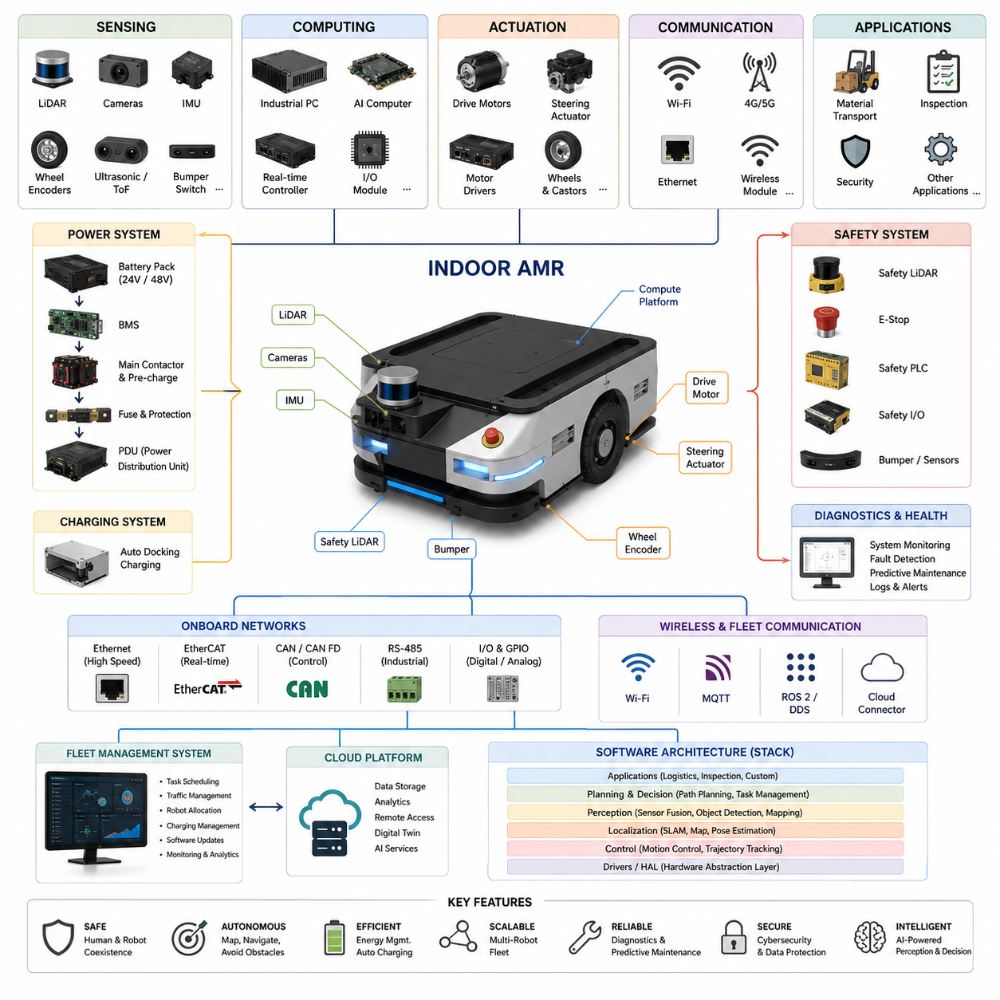
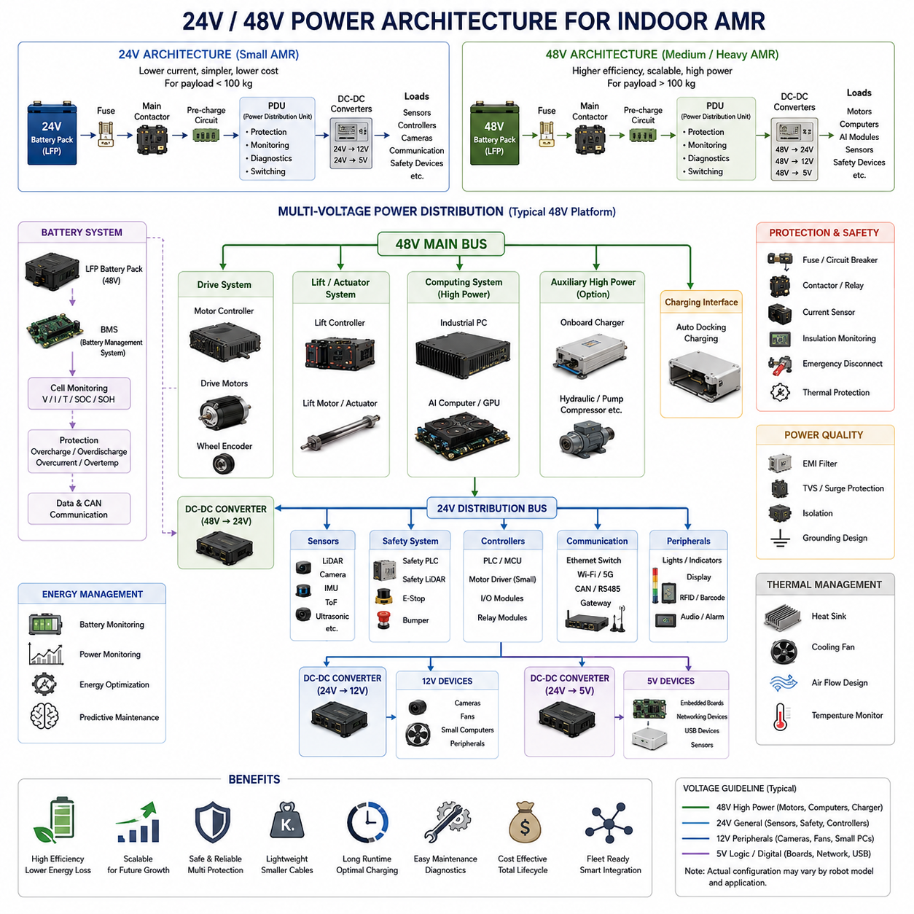
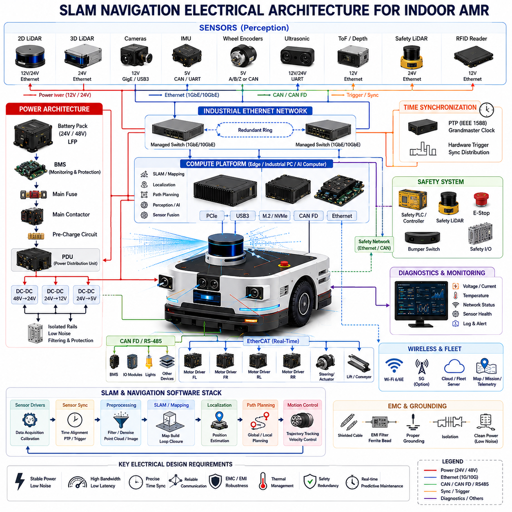
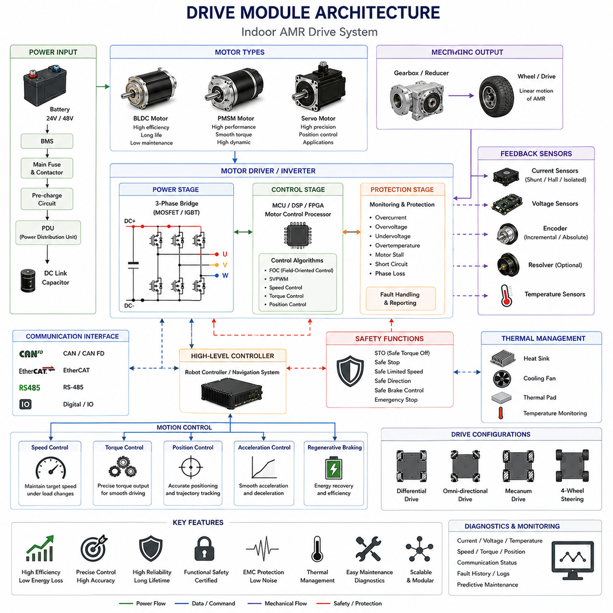
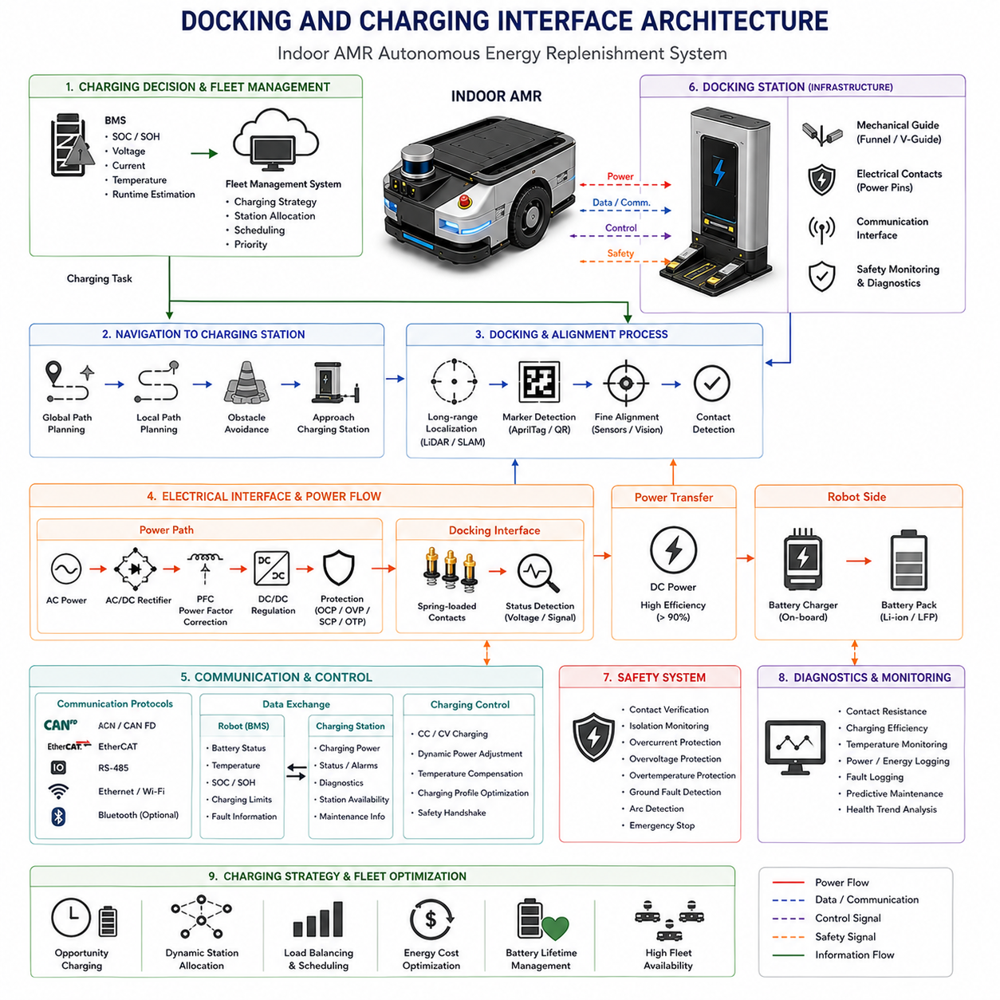

**Volume 13 AMR Electrical Architecture**


# Chapter 1. Indoor AMR

##  

## 1.1 Indoor AMR System Overview

{width="7.268055555555556in" height="7.268055555555556in"}

An Indoor Autonomous Mobile Robot (AMR) is a self-navigating robotic platform designed to transport materials, perform inspections, execute logistics operations, and support manufacturing activities within indoor environments such as factories, warehouses, hospitals, laboratories, airports, and commercial facilities. Unlike traditional Automated Guided Vehicles (AGVs), which rely on predefined physical guidance systems such as magnetic tapes, QR markers, reflectors, or embedded wires, modern Indoor AMRs are capable of perceiving their surroundings, generating maps, localizing themselves within those maps, planning paths dynamically, and avoiding obstacles in real time. This capability enables AMRs to operate in highly dynamic environments where humans, forklifts, carts, and other robots coexist.

The purpose of an Indoor AMR electrical architecture is to provide a stable, scalable, safe, and maintainable foundation for all robotic functions. The electrical architecture integrates power distribution systems, sensing systems, communication networks, computation platforms, motion control systems, safety mechanisms, charging interfaces, diagnostics infrastructure, and fleet connectivity. These subsystems work together to create a complete autonomous robotic platform capable of continuous operation in industrial environments. The Indoor AMR System Overview serves as the top-level description of how all major electrical and electronic subsystems interact to achieve autonomous operation.

At the highest level, an Indoor AMR consists of five primary domains. The first domain is the power domain, which manages energy generation, storage, conversion, distribution, and protection. The second domain is the sensing domain, which acquires information about the robot itself and its surrounding environment. The third domain is the computing domain, which processes sensor information and executes decision-making algorithms. The fourth domain is the actuation domain, which converts digital commands into physical movement. The fifth domain is the communication domain, which enables data exchange among onboard devices and external systems.

The power architecture forms the foundation of the entire robot. Most industrial Indoor AMRs utilize either a 24V or 48V battery system depending on payload requirements and power consumption. Smaller robots with payload capacities below 100 kilograms often operate using 24V systems because of their simplicity and lower cost. Medium and heavy-duty AMRs typically employ 48V architectures because higher voltage reduces current flow, decreases conductor size requirements, minimizes power losses, and improves overall system efficiency. The battery subsystem generally consists of Lithium Iron Phosphate (LFP) battery packs, Battery Management Systems (BMS), safety contactors, fuses, power distribution units, charging interfaces, and voltage conversion modules. Energy flows from the battery pack through protection devices and power distribution modules before reaching computing devices, sensors, motor controllers, and auxiliary systems.

The sensing architecture is responsible for environmental awareness and robot localization. Modern Indoor AMRs typically employ multiple sensor modalities to achieve robust perception under varying operational conditions. LiDAR sensors provide accurate distance measurements and are commonly used for simultaneous localization and mapping (SLAM). Cameras provide visual information for object recognition, pallet detection, barcode reading, QR code localization, human detection, and artificial intelligence applications. Inertial Measurement Units (IMUs) provide acceleration and rotational information that improves localization stability. Wheel encoders measure wheel rotation and contribute to odometry calculations. Additional sensors such as ultrasonic sensors, Time-of-Flight sensors, bumper switches, safety scanners, RFID readers, and environmental monitoring sensors may also be integrated depending on application requirements.

Sensor fusion plays a critical role in AMR performance. Individual sensors have limitations that may cause performance degradation under certain conditions. LiDAR sensors may struggle with reflective surfaces. Cameras may be affected by lighting variations. IMUs accumulate drift over time. Wheel encoders experience errors due to wheel slip. By combining information from multiple sensors, the robot can maintain accurate localization and environmental awareness even when individual sensors experience temporary degradation. Sensor fusion algorithms continuously estimate the robot\'s position, orientation, velocity, and surrounding obstacles using data from multiple sources.

The compute architecture functions as the central nervous system of the robot. Modern Indoor AMRs typically employ a hierarchical computing structure consisting of real-time controllers and high-level computing platforms. Real-time controllers handle safety-critical functions, motor control loops, emergency stop processing, and low-level hardware management. High-level computing platforms execute SLAM algorithms, navigation planning, perception processing, artificial intelligence inference, fleet communication, diagnostics, and user applications.

The compute platform may include industrial PCs, embedded computing systems, AI accelerators, and edge computing modules. Popular implementations include x86 industrial computers, NVIDIA Jetson platforms, and specialized AI processors. In advanced deployments, multiple computing nodes may operate simultaneously. One processor may be dedicated to navigation and localization, another to perception and artificial intelligence, while a third processor handles fleet management and cloud communication. This modular architecture improves reliability, scalability, and maintainability.

Software architecture within an Indoor AMR is commonly based on layered design principles. The hardware abstraction layer provides standardized interfaces to sensors and actuators. The middleware layer manages communication among software modules. The perception layer processes sensor data. The localization layer estimates robot position. The planning layer determines optimal routes and trajectories. The control layer converts planned trajectories into motor commands. The application layer implements customer-specific workflows and operational logic.

Communication architecture is another critical element of Indoor AMR design. Modern robots utilize multiple communication technologies depending on bandwidth, latency, reliability, and interoperability requirements. Ethernet is commonly used for high-speed data transfer among computing devices. EtherCAT provides deterministic communication for motor control and real-time applications. CAN and CAN FD networks connect distributed embedded devices. RS-485 interfaces support industrial sensors and legacy equipment. Wireless communication technologies such as Wi-Fi enable fleet connectivity and cloud integration. MQTT, DDS, REST APIs, WebSockets, and gRPC are frequently employed for higher-level software communication and fleet management functions.

Navigation architecture enables the robot to move autonomously through indoor environments. The navigation stack generally includes mapping, localization, path planning, obstacle avoidance, motion planning, and trajectory tracking modules. During initial deployment, the robot creates a digital representation of its operating environment using SLAM technology. This map becomes the reference framework for subsequent localization operations. The localization subsystem continuously estimates the robot\'s position within the map using sensor measurements. The path planning subsystem calculates routes between source and destination points while considering environmental constraints. Motion planning algorithms generate feasible trajectories that satisfy vehicle kinematic limitations. Control algorithms execute those trajectories through motor commands.

The drive system architecture converts electrical energy into controlled movement. Most Indoor AMRs employ differential drive, omnidirectional drive, mecanum drive, or four-wheel steering configurations. Differential drive systems are simple and cost-effective but have limited maneuverability. Omnidirectional systems provide superior maneuverability and are commonly used in constrained environments. Mecanum wheel systems enable lateral movement but introduce efficiency losses and mechanical complexity. Four-wheel steering systems provide enhanced stability and improved handling characteristics for larger payload capacities.

Motor control systems typically consist of brushless DC motors, servo motors, motor drivers, wheel encoders, and safety feedback devices. Closed-loop control algorithms continuously regulate speed, torque, and position to achieve precise motion control. Advanced systems incorporate traction control, anti-slip algorithms, load compensation mechanisms, and predictive motion control techniques to improve performance under varying operating conditions.

Safety architecture is one of the most important aspects of Indoor AMR design. Industrial robots operate in environments where human workers may be present, requiring strict adherence to safety standards and regulations. Safety systems typically include emergency stop circuits, safety LiDAR scanners, bumper sensors, safety controllers, safety PLCs, redundant communication paths, and fault monitoring systems. Safety zones can be dynamically adjusted according to robot speed and operational context. If a human enters a warning zone, the robot may reduce speed. If a person enters a protective zone, the robot immediately stops.

Functional safety principles require the robot to detect failures, transition to safe states, and prevent hazardous conditions. Safety architectures often employ redundant sensing, redundant power control, watchdog systems, self-diagnostics, and fault-tolerant communication mechanisms. Compliance with standards such as ISO 3691-4, IEC 61508, ISO 13849, and related industrial safety standards is typically required for commercial deployments.

Battery management is another critical subsystem. The Battery Management System continuously monitors cell voltages, temperatures, currents, state of charge, state of health, and charging conditions. Battery diagnostics enable predictive maintenance and reduce the risk of unexpected downtime. Thermal management systems ensure batteries operate within safe temperature ranges. Advanced systems support hot-swappable battery modules, enabling continuous robot operation without extended charging interruptions.

Charging infrastructure significantly influences overall fleet productivity. Indoor AMRs commonly utilize automatic docking stations that enable autonomous charging operations. When battery levels fall below predefined thresholds, the robot navigates to a charging station, aligns itself precisely, establishes electrical contact, and initiates charging automatically. Fleet management systems coordinate charging schedules to maximize fleet utilization and minimize charging bottlenecks.

Fleet management represents the next level of AMR deployment. While a single robot can perform autonomous tasks independently, industrial facilities often require dozens or hundreds of robots operating simultaneously. Fleet management systems coordinate robot assignments, traffic management, task scheduling, charging operations, software updates, and diagnostics. Centralized fleet managers communicate with individual robots through wireless networks and continuously optimize resource allocation across the entire fleet.

Diagnostics and maintenance capabilities are essential for long-term operational success. Modern AMRs continuously monitor system health parameters including battery condition, motor performance, sensor status, communication quality, processor utilization, thermal conditions, and safety system integrity. Diagnostic information is stored locally and transmitted to fleet management systems for analysis. Predictive maintenance algorithms can identify developing issues before failures occur, reducing downtime and maintenance costs.

Cybersecurity has become increasingly important as AMRs become connected to enterprise networks and cloud platforms. Security mechanisms include secure boot processes, encrypted communication channels, authentication systems, access control policies, certificate management, intrusion detection, and secure firmware update mechanisms. Robust cybersecurity architectures protect both operational continuity and sensitive industrial data.

Artificial Intelligence is rapidly transforming Indoor AMR capabilities. Traditional navigation systems relied primarily on deterministic algorithms and manually configured workflows. Modern AI-enabled AMRs utilize deep learning, reinforcement learning, foundation models, and multimodal perception systems to improve environmental understanding, decision making, and operational adaptability. AI can enhance object detection, semantic mapping, human intention prediction, anomaly detection, predictive maintenance, and natural language interaction.

Future Indoor AMR architectures are expected to evolve toward AI-native systems that integrate perception, reasoning, planning, and action within unified computational frameworks. Edge AI computing platforms will enable increasingly sophisticated autonomous behaviors while maintaining real-time responsiveness. Integration with digital twins, cloud robotics platforms, warehouse management systems, manufacturing execution systems, enterprise resource planning systems, and Physical AI ecosystems will further expand AMR capabilities.

Ultimately, the Indoor AMR System represents the convergence of electrical engineering, robotics, artificial intelligence, industrial automation, communication networks, functional safety, and software architecture. A successful Indoor AMR design requires careful integration of power systems, sensing systems, computing infrastructure, communication networks, motion control technologies, safety mechanisms, and fleet management capabilities. The electrical architecture serves as the backbone that enables all these subsystems to operate together as a unified autonomous robotic platform, providing reliable, safe, scalable, and intelligent automation solutions for modern industrial environments.

# 01_01_실내 AMR 시스템 개요 (Indoor AMR System Overview)

실내 자율주행 이동로봇(AMR, Autonomous Mobile Robot)은 공장, 물류창고, 병원, 연구소, 공항, 상업시설과 같은 실내 환경에서 자재 운반, 검사, 물류 작업, 생산 지원 등의 업무를 수행하도록 설계된 자율 이동 플랫폼이다. 기존의 AGV(Automated Guided Vehicle)가 자기 테이프, QR 코드, 반사판, 바닥 매설선과 같은 고정된 유도 장치에 의존하는 반면, 현대의 AMR은 주변 환경을 스스로 인식하고 지도를 생성하며, 자신의 위치를 추정하고, 경로를 계획하며, 장애물을 실시간으로 회피할 수 있다. 이러한 능력 덕분에 사람, 지게차, 카트, 다른 로봇이 함께 움직이는 복잡한 환경에서도 안정적으로 운용될 수 있다.

실내 AMR의 전기 아키텍처는 모든 로봇 기능을 안정적이고 확장 가능하며 안전하게 운영하기 위한 기반을 제공한다. 전기 아키텍처는 전력 분배 시스템, 센서 시스템, 통신 네트워크, 컴퓨팅 플랫폼, 구동 제어 시스템, 안전 시스템, 충전 인터페이스, 진단 시스템, 플릿(Fleet) 연결 기능 등을 통합한다. 이러한 하위 시스템들은 상호 연동되어 완전한 자율주행 로봇 플랫폼을 구성한다. 실내 AMR 시스템 개요는 이러한 주요 전기·전자 시스템들이 어떻게 결합되어 자율 이동 기능을 구현하는지를 설명하는 최상위 수준의 구조이다.

실내 AMR은 크게 전력(Power), 센서(Sensing), 컴퓨팅(Computing), 구동(Actuation), 통신(Communication)의 다섯 개 영역으로 구성된다. 전력 영역은 에너지 저장, 변환, 분배 및 보호를 담당한다. 센서 영역은 로봇과 주변 환경에 대한 정보를 수집한다. 컴퓨팅 영역은 수집된 데이터를 분석하고 의사결정을 수행한다. 구동 영역은 계산 결과를 실제 움직임으로 변환한다. 통신 영역은 내부 장치와 외부 시스템 간 데이터 교환을 수행한다.

전력 아키텍처는 로봇 전체의 기반이 되는 시스템이다. 대부분의 산업용 실내 AMR은 적재 하중과 전력 소비량에 따라 24V 또는 48V 배터리 시스템을 사용한다. 일반적으로 100kg 이하급 소형 AMR은 단순성과 비용 측면에서 24V 시스템을 사용하며, 중형 및 대형 AMR은 효율 향상을 위해 48V 시스템을 채택한다. 전압이 높아질수록 동일한 전력을 전달하기 위한 전류가 감소하므로 케이블 굵기를 줄일 수 있고, 전력 손실도 감소한다.

배터리 시스템은 일반적으로 LFP(Lithium Iron Phosphate) 배터리, BMS(Battery Management System), 안전 컨택터, 퓨즈, 전력 분배 장치(PDU), 충전 인터페이스, DC-DC 컨버터 등으로 구성된다. 배터리에서 생성된 전력은 보호 장치를 거쳐 센서, 컴퓨터, 모터 드라이버 및 각종 보조 장치로 공급된다.

센서 아키텍처는 로봇의 환경 인식과 위치 추정을 담당한다. 현대의 AMR은 다양한 센서를 결합하여 안정적인 자율주행을 구현한다. LiDAR는 거리 정보를 정밀하게 측정하며 SLAM의 핵심 센서로 활용된다. 카메라는 객체 인식, 팔레트 탐지, 바코드 판독, QR 코드 인식, 사람 탐지 및 AI 기반 인식 기능에 사용된다. IMU는 가속도와 각속도 정보를 제공하여 위치 추정 정확도를 향상시킨다. 휠 엔코더는 바퀴 회전량을 측정하여 주행 거리와 이동량을 계산한다. 이 외에도 초음파 센서, ToF 센서, 범퍼 스위치, RFID 리더기, 환경 센서 등이 적용될 수 있다.

실제 환경에서는 단일 센서만으로 안정적인 자율주행을 구현하기 어렵다. LiDAR는 반사체에 취약할 수 있고, 카메라는 조명 변화에 영향을 받을 수 있으며, IMU는 시간이 지남에 따라 누적 오차가 발생한다. 엔코더 역시 미끄러짐에 의해 오차가 발생한다. 따라서 센서 융합(Sensor Fusion)을 통해 여러 센서의 장점을 결합하여 정확한 위치 추정과 환경 인식을 수행한다.

컴퓨팅 아키텍처는 로봇의 두뇌 역할을 수행한다. 대부분의 AMR은 실시간 제어 시스템과 고수준 컴퓨팅 시스템으로 구성된 계층형 구조를 사용한다. 실시간 제어기는 모터 제어, 비상 정지 처리, 안전 기능 및 하드웨어 관리를 담당한다. 상위 컴퓨팅 시스템은 SLAM, 자율주행, 경로 계획, AI 추론, 플릿 관리, 원격 통신 등을 수행한다.

컴퓨팅 플랫폼으로는 산업용 x86 PC, NVIDIA Jetson 계열, AI 가속기 및 Edge Computer가 널리 사용된다. 최근에는 여러 개의 컴퓨팅 노드를 분산 배치하여 하나는 자율주행, 하나는 비전 및 AI, 또 다른 하나는 플릿 관리와 클라우드 통신을 담당하도록 구성하기도 한다. 이러한 구조는 확장성과 유지보수성을 크게 향상시킨다.

소프트웨어 아키텍처는 일반적으로 계층형 구조를 따른다. 하드웨어 추상화 계층은 센서와 액추에이터를 표준화된 인터페이스로 제공한다. 미들웨어 계층은 각 모듈 간 통신을 관리한다. 인지 계층은 센서 데이터를 처리하고, 위치 추정 계층은 로봇의 위치를 계산한다. 계획 계층은 최적의 경로를 생성하며, 제어 계층은 이를 실제 모터 명령으로 변환한다. 최상위 응용 계층은 고객 요구에 맞는 물류 및 작업 프로세스를 수행한다.

통신 아키텍처는 다양한 장치와 시스템을 연결한다. Ethernet은 대용량 데이터 전송에 사용되며, EtherCAT은 실시간 모터 제어를 지원한다. CAN 및 CAN FD는 분산 제어 장치 연결에 활용된다. RS-485는 산업용 센서와 PLC 연결에 널리 사용된다. 무선 통신은 Wi-Fi를 중심으로 구성되며, MQTT, DDS, REST API, WebSocket, gRPC와 같은 프로토콜을 통해 플릿 시스템과 클라우드 플랫폼이 연결된다.

자율주행 아키텍처는 지도 생성, 위치 추정, 경로 계획, 장애물 회피, 모션 계획, 궤적 추종 기능으로 구성된다. 초기 구축 단계에서는 SLAM을 통해 환경 지도를 생성한다. 이후 로봇은 이 지도를 기반으로 자신의 위치를 지속적으로 추정한다. 경로 계획 시스템은 목적지까지의 최적 경로를 계산하며, 모션 계획 시스템은 실제 차량의 운동학적 제약을 고려한 주행 궤적을 생성한다. 제어 시스템은 이를 기반으로 모터를 제어한다.

구동 시스템은 전기에너지를 실제 움직임으로 변환한다. 실내 AMR에서는 차동 구동(Differential Drive), 전방향 구동(Omnidirectional Drive), 메카넘 휠(Mecanum Wheel), 4륜 조향(Four-Wheel Steering) 등이 사용된다. 차동 구동은 단순하고 비용이 낮지만 기동성이 제한적이다. 전방향 구동과 메카넘 휠은 좁은 공간에서 뛰어난 이동성을 제공한다. 대형 플랫폼에서는 4륜 조향이 높은 안정성과 조향 성능을 제공한다.

모터 시스템은 BLDC 모터, 서보 모터, 모터 드라이버, 엔코더, 안전 피드백 장치로 구성된다. 폐루프 제어 알고리즘을 통해 속도, 위치, 토크를 정밀하게 제어한다. 고급 시스템에서는 미끄러짐 보정, 부하 보상, 예측 제어 등의 기술도 적용된다.

안전 아키텍처는 산업용 AMR에서 가장 중요한 요소 중 하나이다. 사람과 함께 작업하는 환경에서는 안전이 최우선으로 고려되어야 한다. 이를 위해 비상 정지 회로, 안전 LiDAR, 범퍼 센서, 안전 PLC, 이중화 통신, 오류 감지 시스템 등이 적용된다. 안전 영역은 로봇 속도와 작업 상황에 따라 동적으로 조정될 수 있다. 사람이 경고 구역에 진입하면 감속하고, 보호 구역에 진입하면 즉시 정지한다.

기능 안전(Functional Safety)은 시스템 고장 시 안전한 상태로 전환될 수 있도록 설계하는 개념이다. 이를 위해 이중화 센서, 이중화 전원 제어, Watchdog 시스템, 자가 진단 기능, 장애 허용 통신 구조 등이 적용된다. 상용 제품은 일반적으로 ISO 3691-4, IEC 61508, ISO 13849 등의 국제 안전 규격을 준수해야 한다.

배터리 관리 시스템은 셀 전압, 전류, 온도, 충전 상태(SOC), 배터리 건강도(SOH)를 지속적으로 모니터링한다. 진단 기능을 통해 유지보수 시점을 예측하고 돌발적인 장애를 줄일 수 있다. 또한 배터리 온도 관리 시스템을 통해 안전성과 수명을 향상시킨다. 일부 시스템은 핫스왑 배터리를 지원하여 충전 대기 시간을 최소화한다.

충전 시스템은 AMR 운영 효율에 큰 영향을 미친다. 대부분의 실내 AMR은 자동 도킹 충전 방식을 사용한다. 배터리 잔량이 설정값 이하로 내려가면 로봇은 충전 스테이션으로 이동하여 정밀 정렬 후 자동 충전을 시작한다. 플릿 관리 시스템은 여러 대의 로봇이 동시에 운영될 때 충전 스케줄을 최적화하여 가동률을 높인다.

플릿 관리 시스템은 다수의 AMR을 통합 운영하는 핵심 플랫폼이다. 수십 대에서 수백 대의 로봇이 동시에 운영되는 환경에서는 작업 할당, 교통 제어, 충전 관리, 소프트웨어 업데이트, 상태 모니터링 등을 중앙에서 관리해야 한다. 플릿 매니저는 무선 네트워크를 통해 각 로봇과 연결되며 전체 시스템의 효율을 최적화한다.

진단 및 유지보수 기능은 장기적인 운영 안정성을 보장한다. 현대 AMR은 배터리 상태, 모터 성능, 센서 상태, 통신 품질, CPU 사용률, 온도, 안전 시스템 상태 등을 지속적으로 모니터링한다. 이러한 데이터는 예지보전(Predictive Maintenance)에 활용되어 고장 발생 이전에 문제를 발견할 수 있도록 한다.

AMR이 기업 네트워크 및 클라우드와 연결됨에 따라 사이버 보안의 중요성도 증가하고 있다. 보안 부트, 암호화 통신, 인증 시스템, 접근 제어, 인증서 관리, 침입 탐지, OTA 업데이트 보안 등이 필수 요소로 자리잡고 있다.

최근에는 인공지능 기술이 실내 AMR의 성능을 크게 향상시키고 있다. 과거의 AMR이 규칙 기반 알고리즘 중심이었다면, 최신 시스템은 딥러닝, 강화학습, 파운데이션 모델, 멀티모달 AI를 활용하여 환경 이해와 의사결정 능력을 강화하고 있다. AI는 객체 인식, 의미 기반 지도 생성, 사람 행동 예측, 이상 탐지, 예지보전, 자연어 인터페이스 등 다양한 영역에 활용된다.

향후 실내 AMR은 AI-Native Architecture 방향으로 발전할 것으로 예상된다. Edge AI 컴퓨팅 성능이 향상되면서 인식, 추론, 계획, 제어가 통합된 지능형 시스템이 등장할 것이다. 또한 디지털 트윈, 클라우드 로보틱스, WMS, MES, ERP, Physical AI 플랫폼과의 통합이 더욱 확대될 것이다.

결국 실내 AMR 시스템은 전기공학, 전자공학, 로봇공학, 인공지능, 산업자동화, 통신공학, 기능안전, 소프트웨어 아키텍처가 융합된 복합 시스템이다. 성공적인 AMR 개발을 위해서는 전력 시스템, 센서 시스템, 컴퓨팅 플랫폼, 통신 네트워크, 구동 제어 기술, 안전 시스템, 플릿 관리 기술이 유기적으로 통합되어야 한다. 전기 아키텍처는 이러한 모든 요소를 연결하는 핵심 기반이며, 현대 산업 환경에서 신뢰성 있고 확장 가능하며 지능적인 자율 물류 시스템을 구현하는 근간이 된다.

##  

## 1.2 24V 48V Power Architecture

{width="7.268055555555556in" height="7.268055555555556in"}

The power architecture of an Indoor Autonomous Mobile Robot (AMR) serves as the electrical foundation upon which all robotic functions operate. Every subsystem within the robot, including sensors, controllers, communication modules, safety devices, motor drivers, artificial intelligence processors, and auxiliary equipment, ultimately depends on the power system for reliable operation. A well-designed power architecture must provide stable voltage, sufficient current capacity, high efficiency, functional safety, fault tolerance, maintainability, and scalability while minimizing energy loss and operational downtime. In modern industrial robotics, the most widely adopted power architectures are based on 24V and 48V electrical systems. These two voltage domains have become industry standards due to their balance between safety, performance, regulatory compliance, and component availability.

The selection between a 24V and 48V architecture is influenced by payload capacity, vehicle size, motor power requirements, onboard computing requirements, battery capacity, expected operating duration, charging infrastructure, and total system cost. Small indoor robots with payload capacities below approximately 100 kilograms often utilize 24V systems because of their simplicity and lower implementation cost. Medium and heavy-duty AMRs operating in warehouses, manufacturing facilities, logistics centers, and industrial environments increasingly adopt 48V systems due to their superior electrical efficiency and scalability.

The fundamental principle governing power system design is the relationship between voltage, current, and power. Electrical power is calculated as the product of voltage and current. For a given power requirement, increasing the system voltage reduces the required current proportionally. This reduction in current provides numerous engineering advantages. Lower current reduces resistive losses within cables, connectors, contactors, and power distribution systems. It also allows the use of smaller wire gauges, lighter harnesses, reduced thermal generation, and improved overall system efficiency.

Consider a robotic drive system requiring 2,400 watts of power. In a 24V architecture, the current demand would be approximately 100 amperes. In a 48V architecture, the same power can be delivered with only 50 amperes. Since resistive losses are proportional to the square of the current, reducing current by half results in approximately four times less conductor loss. This simple relationship is one of the primary reasons why larger AMRs increasingly migrate toward 48V architectures.

A typical 24V AMR architecture consists of a battery pack, battery management system, main fuse, emergency disconnect circuit, pre-charge circuit, power distribution unit, DC-DC converters, motor controllers, sensor interfaces, embedded controllers, and communication devices. The battery pack supplies the primary energy source. The battery management system continuously monitors cell voltages, temperatures, charging conditions, discharge currents, state of charge, and overall battery health. The BMS acts as both a safety system and a diagnostic subsystem, protecting the battery from abnormal operating conditions.

In most industrial AMRs, Lithium Iron Phosphate batteries have become the preferred energy storage technology. LFP batteries offer excellent thermal stability, long cycle life, superior safety characteristics, and predictable degradation behavior. Compared with NMC batteries, LFP chemistry provides lower energy density but significantly improved safety margins. For industrial environments where reliability and safety are more important than maximum energy density, LFP batteries are often the preferred choice.

The main fuse serves as the first level of electrical protection. It prevents catastrophic failures by disconnecting the battery from the system during severe overcurrent conditions. Fuse sizing requires careful consideration of nominal operating current, transient startup currents, fault currents, environmental conditions, and safety requirements. An undersized fuse may result in nuisance failures, while an oversized fuse may fail to provide adequate protection during fault conditions.

Following the fuse, the power path typically includes a main contactor and pre-charge circuit. The pre-charge circuit limits inrush current during system startup. Modern AMRs contain large capacitive loads associated with motor controllers, industrial computers, and AI accelerators. If battery voltage is applied directly to these capacitors, extremely high inrush currents can occur, potentially damaging connectors, relays, and electronic components. The pre-charge circuit gradually charges these capacitors before the main contactor closes, ensuring safe startup behavior.

The Power Distribution Unit functions as the central hub for electrical power routing. The PDU distributes energy from the battery to various subsystems while providing circuit protection, monitoring, and diagnostic capabilities. Advanced PDUs may incorporate electronic fuses, current monitoring channels, remote switching functionality, fault logging, and predictive maintenance features. In sophisticated AMR architectures, the PDU becomes an intelligent node within the overall electrical system rather than simply a passive distribution device.

Within a 24V architecture, many components can operate directly from the main battery voltage. Embedded controllers, PLCs, industrial sensors, safety scanners, communication devices, and various auxiliary modules often support direct 24V operation. However, additional voltage rails are still required. Most compute systems require 12V, 19V, or specialized power rails. Cameras often require regulated voltages. Communication devices may require isolated power supplies. As a result, DC-DC converters play a critical role in maintaining stable voltage levels throughout the robot.

DC-DC converters provide voltage conversion between different electrical domains. High-efficiency switching converters are typically used to minimize energy loss. These converters may operate in buck, boost, or buck-boost configurations depending on system requirements. Isolation may be required in certain applications to reduce noise propagation, improve safety, or prevent ground loop issues.

As AMR size and payload capacity increase, the limitations of 24V systems become increasingly apparent. High-power motors require substantial current. Large currents increase cable diameter requirements, connector complexity, fuse ratings, contactor sizes, and thermal management requirements. These factors contribute to increased weight, higher costs, and reduced efficiency. For this reason, many modern industrial AMRs adopt 48V architectures.

A 48V architecture follows the same overall design principles but operates at a higher voltage level. The battery system provides approximately 48 volts as the primary power source. Major loads such as drive motors, steering actuators, lifting systems, industrial computers, and AI processors may operate directly from the 48V bus. Lower-voltage subsystems receive power through dedicated DC-DC conversion stages.

One of the most important advantages of a 48V architecture is scalability. A robotic platform designed around 48V can more easily support larger payload capacities, longer operating durations, more powerful motors, additional sensors, and advanced AI computing resources. The architecture remains manageable even as power consumption grows significantly.

For example, a small warehouse AMR may consume only a few hundred watts during normal operation. A heavy-duty logistics robot carrying over one thousand kilograms may require several kilowatts during acceleration, lifting operations, and continuous transportation tasks. Delivering such power through a 24V system can create significant engineering challenges, whereas a 48V architecture provides a more practical solution.

Modern Indoor AMRs frequently employ dual-voltage architectures. The primary battery system operates at 48V, while secondary distribution networks provide regulated 24V, 12V, and 5V rails for specific subsystems. This approach combines the efficiency advantages of high-voltage distribution with the compatibility advantages of standard industrial devices.

A common power hierarchy begins with a 48V battery system feeding a central PDU. The PDU supplies motor controllers, industrial PCs, AI accelerators, and charging systems directly from the 48V bus. High-efficiency converters then generate regulated 24V power for sensors, safety devices, PLCs, and communication equipment. Additional converters generate 12V and 5V rails for cameras, embedded controllers, networking devices, and peripheral electronics.

Thermal management is a critical aspect of power architecture design. Every electrical component generates heat proportional to its losses. Batteries, DC-DC converters, motor controllers, power distribution units, and computing platforms all contribute to thermal loading. Excessive temperatures reduce efficiency, accelerate component aging, and increase failure rates. Effective thermal management requires careful component placement, airflow optimization, heat sink design, thermal interface materials, and continuous temperature monitoring.

Power quality also plays a significant role in system reliability. Voltage drops, transient spikes, electromagnetic interference, and switching noise can disrupt sensitive electronic systems. High-performance AMRs often incorporate filtering circuits, surge protection devices, transient voltage suppressors, isolated power supplies, and EMC mitigation strategies to maintain electrical stability.

Grounding architecture is closely related to power system design. Improper grounding can introduce communication errors, sensor noise, electromagnetic interference, and unpredictable system behavior. Industrial AMRs generally employ carefully engineered grounding strategies that separate power grounds, signal grounds, chassis grounds, and safety grounds where appropriate. Proper grounding becomes increasingly important as sensor density and computational complexity increase.

Battery charging infrastructure must be considered as part of the overall power architecture. Most industrial AMRs utilize autonomous charging stations that allow robots to recharge without human intervention. Charging systems may employ conductive charging, charging pads, docking connectors, or automated battery exchange systems. The charging subsystem must communicate with the Battery Management System to ensure safe and efficient charging operations.

Advanced charging strategies often incorporate opportunity charging. Rather than waiting until batteries become depleted, robots charge opportunistically during idle periods. This strategy improves fleet utilization, extends battery life, and reduces operational interruptions. Fleet management systems continuously monitor battery status across all robots and coordinate charging schedules accordingly.

Safety considerations become increasingly important as power levels increase. High-current battery systems contain substantial stored energy capable of causing severe damage if faults occur. Protection mechanisms include fuses, contactors, current sensors, insulation monitoring devices, thermal sensors, emergency disconnect circuits, and software-based fault detection algorithms. Functional safety principles require that hazardous energy be removed or isolated when dangerous conditions are detected.

Redundancy may also be incorporated into critical power systems. Safety controllers, emergency communication devices, localization sensors, and critical processors may receive power through independent pathways. Backup batteries or supercapacitors can maintain operation long enough to execute controlled shutdown procedures during power failures.

Modern AMRs increasingly integrate artificial intelligence and high-performance edge computing platforms. These systems introduce significant new power requirements. AI accelerators, GPU modules, industrial computers, and advanced perception systems may consume hundreds of watts individually. Consequently, power architecture design must anticipate future computational growth while maintaining efficiency and reliability.

Predictive maintenance is another emerging aspect of modern power systems. By continuously monitoring voltage, current, temperature, battery health, charging efficiency, and power consumption patterns, the system can identify developing faults before they result in failures. Machine learning algorithms may analyze power system behavior to detect anomalies, predict component degradation, and optimize maintenance schedules.

The evolution of Indoor AMR power architecture is moving toward intelligent energy management systems that dynamically allocate power according to operational priorities. Future systems may adjust compute performance, sensor activity, charging behavior, and motion profiles based on battery conditions, mission requirements, environmental conditions, and fleet-level optimization strategies.

As industrial automation continues to expand, the distinction between 24V and 48V architectures will remain an important design consideration. Smaller robots will continue to benefit from the simplicity and cost advantages of 24V systems, while larger and more capable AMRs will increasingly adopt 48V platforms to support higher power demands and advanced autonomous capabilities. Hybrid multi-voltage architectures are likely to become the dominant approach, combining the efficiency of high-voltage distribution with the compatibility and flexibility of lower-voltage subsystems.

Ultimately, the 24V and 48V power architecture serves as the backbone of the entire Indoor AMR electrical system. It determines energy efficiency, operational reliability, scalability, safety performance, maintenance requirements, and long-term lifecycle costs. A carefully engineered power architecture provides the stable electrical foundation required for autonomous navigation, sensor fusion, artificial intelligence, motion control, fleet coordination, and continuous industrial operation. Through proper integration of batteries, power distribution units, protection systems, conversion stages, charging infrastructure, and intelligent energy management strategies, the AMR becomes a reliable and efficient autonomous platform capable of meeting the demanding requirements of modern industrial environments.

# 01_02 24V·48V 전원 아키텍처 (24V·48V Power Architecture)

실내 자율주행 이동로봇(AMR)의 전원 아키텍처는 모든 로봇 기능이 동작할 수 있도록 지원하는 전기 시스템의 기반이다. 센서, 제어기, 통신 모듈, 안전 장치, 모터 드라이버, 인공지능 프로세서, 각종 보조 장비에 이르기까지 모든 시스템은 전원 아키텍처에 의존한다. 따라서 전원 시스템은 안정적인 전압 공급, 충분한 전류 용량, 높은 효율성, 기능 안전성, 장애 허용성, 유지보수성 및 확장성을 동시에 만족해야 하며, 에너지 손실과 운영 중단을 최소화해야 한다.

현대 산업용 로봇에서는 주로 24V와 48V 전원 시스템이 사용된다. 이 두 전압 체계는 안전성, 성능, 규제 준수, 부품 수급 측면에서 균형이 우수하여 산업 표준으로 자리 잡고 있다.

24V와 48V 중 어떤 구조를 선택할 것인가는 로봇의 적재 중량, 차체 크기, 모터 출력, 컴퓨팅 성능 요구사항, 배터리 용량, 운용 시간, 충전 방식, 전체 비용 등에 의해 결정된다. 일반적으로 100kg 이하급의 소형 실내 AMR은 구조가 단순하고 비용이 낮은 24V 시스템을 사용한다. 반면 물류센터나 제조공장에서 사용하는 중형 및 대형 AMR은 전기 효율이 높은 48V 시스템을 채택하는 경우가 많다.

전원 시스템 설계의 기본 원리는 전압, 전류, 전력의 관계에 있다. 전력은 전압과 전류의 곱으로 계산된다. 동일한 전력을 공급할 경우 전압이 높아지면 필요한 전류는 감소한다. 전류가 감소하면 케이블, 커넥터, 컨택터, 배선 시스템에서 발생하는 저항 손실이 줄어든다. 또한 전선 굵기를 줄일 수 있고 무게가 감소하며 발열이 줄어들고 전체 효율이 향상된다.

예를 들어 2,400W의 전력이 필요한 구동 시스템을 생각해 보면, 24V 시스템에서는 약 100A의 전류가 필요하지만 48V 시스템에서는 약 50A만 필요하다. 전력 손실은 전류의 제곱에 비례하므로 전류가 절반으로 줄어들면 손실은 약 4분의 1 수준으로 감소한다. 이러한 이유 때문에 고출력 AMR에서는 48V 시스템이 점점 더 많이 사용되고 있다.

일반적인 24V AMR 전원 아키텍처는 배터리 팩, 배터리 관리 시스템(BMS), 메인 퓨즈, 비상 차단 회로, 프리차지 회로, 전력 분배 장치(PDU), DC-DC 컨버터, 모터 컨트롤러, 센서 인터페이스 및 제어 컴퓨터로 구성된다. 배터리는 시스템의 주요 에너지원 역할을 수행하며, BMS는 셀 전압, 온도, 충전 상태, 방전 전류, SOC(State of Charge), SOH(State of Health)를 지속적으로 감시한다. BMS는 안전 장치이면서 동시에 진단 시스템의 역할도 수행한다.

산업용 AMR에서는 LFP(Lithium Iron Phosphate) 배터리가 가장 널리 사용된다. LFP 배터리는 열 안정성이 높고 수명이 길며 화재 위험이 상대적으로 낮다. NMC 계열 배터리에 비해 에너지 밀도는 낮지만 안전성과 내구성이 뛰어나기 때문에 산업 환경에서 선호된다.

메인 퓨즈는 전기 보호 시스템의 첫 번째 방어선이다. 과전류나 단락 사고 발생 시 시스템을 보호하는 역할을 수행한다. 퓨즈 선정 시에는 정상 전류, 순간 돌입 전류, 단락 전류, 환경 조건 등을 모두 고려해야 한다.

퓨즈 이후에는 일반적으로 메인 컨택터와 프리차지 회로가 배치된다. 프리차지 회로는 시스템 기동 시 발생하는 돌입 전류를 제한하는 역할을 한다. 현대 AMR은 모터 드라이버, 산업용 컴퓨터, GPU 시스템 등에 대용량 커패시터가 존재하기 때문에 배터리를 직접 연결하면 매우 큰 전류가 순간적으로 흐를 수 있다. 프리차지 회로는 이러한 위험을 줄이고 부품의 수명을 연장한다.

PDU(Power Distribution Unit)는 전력 분배의 중심 장치이다. 배터리에서 공급된 전력을 각 하위 시스템에 분배하며 보호 기능과 모니터링 기능을 수행한다. 고급 PDU는 전자식 퓨즈, 전류 측정, 원격 스위칭, 고장 기록, 예지보전 기능까지 제공할 수 있다.

24V 시스템에서는 상당수 장비가 배터리 전압을 직접 사용할 수 있다. 산업용 센서, PLC, 안전 장치, 통신 장비 등은 대부분 24V를 표준 전원으로 사용한다. 그러나 컴퓨팅 장비나 카메라, 네트워크 장비는 다른 전압이 필요하기 때문에 DC-DC 컨버터가 필수적으로 사용된다.

DC-DC 컨버터는 서로 다른 전압 레벨을 생성하는 장치이다. 일반적으로 고효율 스위칭 방식이 사용되며, 24V를 12V, 5V, 3.3V 등으로 변환한다. 일부 시스템에서는 노이즈 차단이나 절연을 위해 절연형 컨버터를 사용하기도 한다.

AMR의 크기와 적재 중량이 증가하면 24V 시스템의 한계가 나타나기 시작한다. 모터 출력이 증가할수록 전류가 크게 증가하고, 이에 따라 케이블 굵기, 커넥터 크기, 퓨즈 용량, 컨택터 용량이 모두 커진다. 또한 발열도 증가하게 된다. 이러한 문제를 해결하기 위해 많은 산업용 AMR이 48V 시스템을 채택하고 있다.

48V 전원 아키텍처는 기본적인 구조는 동일하지만 더 높은 전압을 사용한다는 점이 다르다. 배터리에서 48V 전력을 공급하고, 모터 드라이버, 산업용 컴퓨터, AI 프로세서 등 주요 부하는 직접 48V 전원을 사용한다. 센서나 PLC와 같은 장비는 DC-DC 컨버터를 통해 24V로 변환하여 공급받는다.

48V 시스템의 가장 큰 장점은 확장성이다. 더 강력한 모터, 더 큰 배터리, 더 많은 센서, 더 높은 수준의 AI 컴퓨팅 자원을 지원할 수 있다.

예를 들어 소형 창고용 AMR은 수백 와트 수준의 전력만 필요하지만, 1톤 이상의 화물을 운반하는 중량급 물류 로봇은 수 kW 이상의 전력을 요구할 수 있다. 이러한 경우 24V 시스템에서는 수백 암페어의 전류가 필요하지만 48V 시스템에서는 훨씬 효율적으로 전력을 공급할 수 있다.

최근의 AMR은 단일 전압 체계보다 다중 전압 아키텍처를 사용하는 경우가 많다. 기본 배터리는 48V를 사용하고, 내부적으로 24V, 12V, 5V 전원 레일을 생성하여 각 장치에 공급한다. 이러한 구조는 높은 효율성과 산업 표준 장비와의 호환성을 동시에 제공한다.

대표적인 전력 구조는 48V 배터리에서 PDU로 전력을 공급한 후, 모터 드라이버, 산업용 PC, GPU 시스템은 직접 48V를 사용하고, 센서와 안전 장치는 24V DC-DC 컨버터를 통해 공급받는 방식이다. 이후 카메라, 네트워크 장비, 임베디드 제어기는 다시 12V 또는 5V 전원을 사용한다.

열 관리 또한 매우 중요한 설계 요소이다. 배터리, 모터 드라이버, DC-DC 컨버터, PDU, 산업용 컴퓨터 등은 모두 열을 발생시킨다. 온도가 높아지면 효율이 떨어지고 부품 수명이 단축되며 고장 가능성이 증가한다. 따라서 적절한 히트싱크, 냉각 팬, 공기 흐름 설계, 온도 모니터링이 필요하다.

전원 품질 역시 중요하다. 전압 강하, 서지, 스위칭 노이즈, EMI는 센서와 컴퓨터의 오작동을 유발할 수 있다. 이를 방지하기 위해 필터, 서지 보호기, TVS 다이오드, 절연 전원장치 등이 사용된다.

접지(Grounding) 설계는 전원 시스템과 밀접하게 연결되어 있다. 잘못된 접지는 센서 노이즈, 통신 오류, EMI 문제를 유발한다. 따라서 전력 접지, 신호 접지, 섀시 접지, 안전 접지를 적절히 분리하여 설계해야 한다.

충전 시스템도 전원 아키텍처의 중요한 부분이다. 대부분의 산업용 AMR은 자동 충전 스테이션을 사용한다. 로봇은 배터리 잔량이 일정 수준 이하로 떨어지면 자동으로 충전소로 이동하여 충전을 수행한다. 충전 과정은 BMS와 연동되어 안전하게 관리된다.

최근에는 Opportunity Charging 개념이 많이 사용된다. 배터리가 완전히 방전될 때까지 기다리지 않고 작업이 없는 시간에 짧게 충전함으로써 가동률을 높이고 배터리 수명을 연장하는 방식이다. 플릿 관리 시스템은 전체 로봇의 배터리 상태를 분석하여 충전 스케줄을 최적화한다.

전력 수준이 높아질수록 안전 설계의 중요성도 증가한다. 대용량 배터리는 상당한 에너지를 저장하고 있으므로 고장 발생 시 심각한 사고를 초래할 수 있다. 이를 방지하기 위해 퓨즈, 컨택터, 전류 센서, 절연 감시 장치, 온도 센서, 비상 차단 회로 등이 적용된다.

중요한 시스템에는 이중화 구조가 적용되기도 한다. 안전 컨트롤러, 비상 통신 장치, 위치 추정 센서, 핵심 컴퓨터는 독립적인 전원 경로를 사용할 수 있으며, 보조 배터리나 슈퍼커패시터를 통해 비상 상황에서도 안전 정지를 수행할 수 있다.

최근 AMR에는 인공지능 기능이 대폭 확대되고 있다. GPU, AI 가속기, Edge Computer와 같은 장치는 수백 와트의 전력을 소비할 수 있다. 따라서 전원 아키텍처는 현재 요구사항뿐만 아니라 미래의 AI 확장성까지 고려하여 설계되어야 한다.

예지보전(Predictive Maintenance) 또한 전원 시스템의 중요한 발전 방향이다. 전압, 전류, 온도, 충전 효율, 배터리 열화 상태 등을 지속적으로 분석함으로써 장애가 발생하기 전에 문제를 예측할 수 있다.

향후 AMR 전원 아키텍처는 지능형 에너지 관리 시스템으로 발전할 것으로 예상된다. 배터리 상태, 임무 우선순위, 작업 환경, 플릿 운영 상태를 고려하여 전력 사용을 동적으로 최적화하는 방향으로 진화할 것이다.

결론적으로 24V와 48V 전원 아키텍처는 실내 AMR 전기 시스템의 핵심 기반이다. 소형 플랫폼에서는 단순성과 비용 측면에서 24V가 여전히 유리하지만, 중형 및 대형 플랫폼에서는 효율성과 확장성 측면에서 48V가 더욱 적합하다. 미래의 산업용 AMR은 48V 기반의 다중 전압 아키텍처를 중심으로 발전할 가능성이 높으며, 이를 통해 고성능 자율주행, AI 컴퓨팅, 플릿 운영, 예지보전 및 지속적인 산업용 운용을 지원하게 될 것이다. 이러한 전원 아키텍처는 배터리, PDU, 보호 장치, DC-DC 컨버터, 충전 시스템, 에너지 관리 시스템을 통합하여 안정적이고 효율적인 자율 이동 로봇의 기반을 제공한다.

##  

## 1.3 SLAM Navigation Electrical

{width="7.268055555555556in" height="7.268055555555556in"}

Simultaneous Localization and Mapping (SLAM) is the core technology that enables an Indoor Autonomous Mobile Robot (AMR) to understand its environment, determine its position within that environment, and navigate autonomously to a desired destination. While SLAM is often discussed from an algorithmic perspective, its real-world performance depends heavily on the underlying electrical architecture that supports sensing, communication, computation, synchronization, power distribution, and motion control. The SLAM Navigation Electrical Architecture defines how all electronic subsystems are electrically interconnected and coordinated to provide reliable localization, mapping, path planning, obstacle avoidance, and autonomous navigation capabilities. In modern industrial robots, a poorly designed electrical architecture can degrade navigation performance even when advanced software algorithms are used, whereas a robust electrical design can significantly improve localization accuracy, system stability, and operational reliability.

The primary objective of a SLAM navigation electrical system is to provide continuous, synchronized, and low-latency data flow between sensors, compute platforms, motor controllers, safety systems, and communication networks. Every navigation decision made by the robot depends on the quality, timing, and integrity of the data entering the navigation stack. Electrical design therefore becomes an enabling technology for autonomy rather than merely a support function.

A typical Indoor AMR navigation system begins with a collection of sensors that continuously observe the robot and its environment. These sensors generate raw data streams that must be powered, synchronized, transmitted, processed, and fused in real time. The most common sensors include LiDAR, cameras, IMUs, wheel encoders, ultrasonic sensors, Time-of-Flight sensors, RFID readers, and safety scanners. Each sensor possesses unique electrical characteristics, communication requirements, synchronization constraints, and power consumption profiles.

LiDAR is generally considered the primary sensor for industrial SLAM systems. Two-dimensional LiDAR remains the most widely deployed technology in warehouse and factory AMRs because it provides reliable obstacle detection, environmental mapping, and localization performance. More advanced systems increasingly employ three-dimensional LiDAR sensors to improve perception capabilities and environmental understanding. From an electrical perspective, LiDAR sensors require highly stable power supplies because measurement accuracy can be affected by voltage fluctuations, electromagnetic interference, and thermal variations. Most industrial LiDAR systems operate from regulated 12V, 24V, or Power-over-Ethernet interfaces and communicate using high-bandwidth Ethernet connections.

The electrical design supporting LiDAR integration must consider power filtering, cable shielding, grounding strategies, connector reliability, and electromagnetic compatibility. Industrial environments often contain motors, inverters, switching power supplies, and wireless communication devices that generate electrical noise. If this noise couples into LiDAR power lines or communication cables, measurement quality can deteriorate. For this reason, dedicated power rails, shielded Ethernet cables, ferrite filtering, and isolated communication pathways are frequently employed.

Cameras provide complementary information that enhances SLAM performance through visual feature extraction, semantic understanding, object recognition, and environmental classification. Camera-based navigation systems require careful electrical design because image sensors are highly sensitive to power quality and timing accuracy. Voltage instability can result in dropped frames, image distortion, synchronization errors, and degraded perception performance. Industrial camera systems typically utilize Gigabit Ethernet, USB 3.0, USB 3.1, USB-C, MIPI CSI, or specialized vision interfaces. Each interface imposes different electrical requirements regarding cable length, signal integrity, power delivery, and electromagnetic protection.

Multi-camera systems introduce additional complexity because all cameras must operate synchronously. Time alignment errors between cameras can produce localization inaccuracies and perception inconsistencies. Therefore, electrical architectures often include hardware trigger systems, synchronization distribution boards, Precision Time Protocol infrastructure, and dedicated timing networks to ensure accurate sensor alignment.

The Inertial Measurement Unit serves as a critical component within the navigation architecture. IMUs provide acceleration and angular velocity measurements that enable short-term motion estimation and orientation tracking. While IMUs are relatively compact and consume little power, they require extremely low-noise electrical environments to achieve optimal performance. Sensor drift, bias instability, and measurement errors can be amplified by power supply noise, grounding issues, and electromagnetic interference. Consequently, IMUs are often connected to dedicated low-noise voltage regulators and isolated signal pathways.

Wheel encoders provide odometry information by measuring wheel rotation. Although encoders are conceptually simple devices, their electrical implementation significantly influences navigation accuracy. Encoder signals often operate at high frequencies and require precise edge detection. Electrical noise, signal reflection, improper termination, or poor cable routing can introduce counting errors that accumulate into substantial localization drift over time. Differential signaling, shielded cables, proper grounding, and robust communication interfaces are commonly used to ensure encoder signal integrity.

Sensor fusion represents the heart of the SLAM system. The navigation computer continuously combines information from LiDAR, cameras, IMUs, encoders, and other sensors to estimate the robot's position within the environment. Sensor fusion algorithms assume that all incoming data is accurately timestamped and synchronized. Even small timing discrepancies can create localization errors. A few milliseconds of misalignment between LiDAR and IMU measurements can significantly impact navigation performance, particularly during rapid acceleration, deceleration, or turning maneuvers.

Time synchronization therefore becomes a fundamental electrical requirement within modern SLAM architectures. Precision Time Protocol based on IEEE 1588 has become one of the most widely adopted synchronization mechanisms in industrial robotics. PTP enables distributed devices to maintain highly accurate clock alignment across Ethernet networks. In advanced systems, LiDARs, cameras, IMUs, industrial computers, and edge processors all share a common timing reference. Some architectures further incorporate GNSS-disciplined clocks, hardware trigger generators, or dedicated timing distribution modules to achieve sub-microsecond synchronization accuracy.

The compute architecture supporting SLAM and navigation is responsible for processing massive quantities of sensor data in real time. Modern AMRs often employ industrial computers, edge computing platforms, AI accelerators, and embedded controllers operating together within a distributed computing architecture. The electrical requirements of these systems differ substantially from those of traditional embedded controllers. High-performance processors may consume hundreds of watts while generating significant thermal loads. Stable power delivery, proper voltage regulation, transient protection, and thermal management are therefore essential.

Industrial computers commonly operate from 24V or 48V power systems. Dedicated DC-DC converters provide regulated voltages for CPUs, GPUs, memory subsystems, storage devices, and peripheral interfaces. Power interruptions, voltage drops, or transient disturbances can cause software crashes, navigation failures, corrupted data, or unexpected robot behavior. For this reason, many industrial navigation systems incorporate redundant power supplies, backup energy storage devices, supercapacitors, and controlled shutdown mechanisms.

Communication architecture plays an equally important role within the navigation electrical system. Sensor data must move rapidly and reliably between distributed devices. Modern LiDAR sensors can generate hundreds of megabits per second of point cloud data. High-resolution cameras may produce multiple gigabits per second of image streams. Simultaneously, IMUs, encoders, safety devices, motor controllers, and diagnostic systems continuously exchange information with the navigation computer.

Industrial Ethernet has become the dominant communication infrastructure for high-bandwidth navigation systems. Gigabit Ethernet and multi-gigabit Ethernet networks provide sufficient bandwidth for LiDAR, camera, and AI workloads. Managed Ethernet switches support Quality of Service mechanisms that prioritize time-critical navigation traffic. Industrial-grade connectors, shielded cabling, and redundant network topologies improve reliability in demanding environments.

Real-time communication between navigation software and motor controllers often relies on deterministic fieldbus technologies. EtherCAT is widely used because of its low latency and precise timing characteristics. CAN FD remains popular in smaller AMRs due to its robustness and simplicity. RS-485 continues to serve industrial devices that require reliable long-distance communication. The selection of communication technology depends on system complexity, bandwidth requirements, timing constraints, and cost considerations.

Power architecture directly affects navigation performance. Navigation sensors require clean, stable, and noise-free power sources. Compute platforms require high-current supplies with minimal voltage fluctuation. Communication networks require consistent signal integrity. Any disturbance within the power distribution system can propagate throughout the navigation stack and degrade performance.

Modern AMRs therefore employ hierarchical power architectures. A central battery system, typically operating at 24V or 48V, supplies energy to all onboard devices. Power Distribution Units route energy to different subsystems. Dedicated DC-DC converters generate isolated voltage rails for sensors, compute platforms, communication devices, and safety systems. This separation prevents high-current loads such as motors from introducing electrical noise into sensitive navigation electronics.

Grounding architecture is another critical design consideration. Poor grounding can create ground loops, signal offsets, communication errors, and electromagnetic interference. Industrial navigation systems typically employ star-grounding or single-point grounding strategies to minimize these issues. Chassis grounds, signal grounds, power grounds, and communication grounds must be carefully designed and interconnected according to established EMC principles.

Electromagnetic compatibility becomes increasingly important as navigation systems grow more sophisticated. AMRs frequently operate near motor drives, welding equipment, industrial machinery, wireless transmitters, and switching power supplies. These devices generate electromagnetic noise that can interfere with navigation electronics. Effective EMC design requires shielded cables, proper routing practices, filtering components, isolation barriers, grounding strategies, and compliance with industrial EMC standards.

Thermal management also influences navigation reliability. Sensors, processors, network switches, and AI accelerators generate heat during operation. Excessive temperatures can reduce sensor accuracy, accelerate component aging, and increase failure rates. Industrial navigation systems therefore incorporate heat sinks, cooling fans, airflow channels, thermal sensors, and intelligent thermal control algorithms. Maintaining stable operating temperatures helps ensure consistent sensor performance and long-term reliability.

Safety integration forms an essential aspect of navigation electrical architecture. Autonomous navigation cannot be considered independently from safety systems. Safety LiDAR scanners, emergency stop circuits, safety PLCs, bumper sensors, and redundant communication channels continuously interact with the navigation subsystem. Safety-critical electrical pathways must remain operational even when non-critical systems experience faults. Redundant power supplies, independent communication networks, and fail-safe design principles are commonly employed to achieve this objective.

Diagnostic capabilities are increasingly integrated into navigation electrical architectures. Voltage levels, current consumption, communication latency, packet loss rates, synchronization accuracy, processor utilization, sensor health, and environmental conditions are continuously monitored. This information enables predictive maintenance strategies that identify developing problems before navigation performance deteriorates. Advanced diagnostic systems can detect sensor degradation, cable failures, communication anomalies, thermal issues, and power quality problems long before they affect robot operation.

Fleet-based AMR deployments introduce additional electrical considerations. Multiple robots operating within the same facility must share maps, localization updates, mission assignments, and operational data. Wireless communication infrastructure becomes part of the navigation architecture. Reliable Wi-Fi coverage, roaming performance, network security, and bandwidth management all contribute to successful navigation operations. Edge computing nodes and fleet management servers may provide centralized map storage, traffic coordination, and navigation optimization services.

Artificial Intelligence is becoming increasingly integrated into navigation architectures. AI-enhanced perception systems utilize deep learning models for object recognition, semantic mapping, obstacle classification, and route optimization. These capabilities require significantly greater computational resources and power budgets than traditional navigation systems. Electrical architectures must therefore accommodate GPU accelerators, AI processors, high-speed memory systems, and advanced cooling solutions while maintaining overall reliability and efficiency.

Future SLAM Navigation Electrical Architectures are expected to evolve toward highly integrated, AI-native platforms. Sensor networks will become more synchronized, compute systems more distributed, and communication infrastructures more deterministic. Advanced timing architectures, intelligent power management systems, software-defined networking, and autonomous diagnostics will become standard components of next-generation AMRs. The convergence of sensing, computation, communication, safety, and energy management into unified electrical architectures will enable increasingly capable autonomous systems capable of operating safely and efficiently in complex industrial environments.

Ultimately, the SLAM Navigation Electrical Architecture serves as the nervous system of the Indoor AMR. It connects every sensor, processor, controller, actuator, and communication device into a coordinated platform capable of understanding its environment and moving intelligently within it. The effectiveness of localization, mapping, path planning, obstacle avoidance, and autonomous navigation depends not only on software algorithms but also on the quality of the underlying electrical architecture that supports them. A carefully engineered navigation electrical system provides the foundation upon which reliable industrial autonomy is built.

# 01_03 SLAM 내비게이션 전기 아키텍처 (SLAM Navigation Electrical)

SLAM(Simultaneous Localization and Mapping)은 실내 자율주행 이동로봇(AMR)이 주변 환경을 이해하고, 자신의 위치를 추정하며, 목적지까지 자율적으로 이동할 수 있도록 하는 핵심 기술이다. 일반적으로 SLAM은 소프트웨어 알고리즘 관점에서 설명되는 경우가 많지만, 실제 현장에서의 성능은 이를 지원하는 전기 아키텍처에 크게 의존한다. 센서, 통신 네트워크, 컴퓨팅 플랫폼, 시간 동기화 시스템, 전원 시스템, 모터 제어 시스템이 어떻게 전기적으로 연결되고 동작하는지가 SLAM 성능을 결정한다.

SLAM 내비게이션 전기 아키텍처의 목적은 센서, 컴퓨터, 모터 컨트롤러, 안전 시스템, 통신 네트워크 간에 정확하고 동기화된 데이터를 실시간으로 전달하는 것이다. 로봇이 수행하는 모든 위치 추정과 주행 결정은 입력 데이터의 품질과 타이밍 정확도에 의존하기 때문에 전기 설계는 단순한 지원 기술이 아니라 자율주행 성능 자체를 결정하는 핵심 요소가 된다.

실내 AMR의 SLAM 시스템은 다양한 센서들로 구성된다. 대표적으로 LiDAR, 카메라, IMU, 휠 엔코더, 초음파 센서, ToF 센서, RFID 리더, 안전 스캐너 등이 사용된다. 이들 센서는 각기 다른 전압, 통신 방식, 전력 소비량, 데이터 전송 속도, 시간 동기화 요구사항을 가지고 있으며, 전기 아키텍처는 이러한 차이를 통합하여 하나의 일관된 시스템으로 동작하도록 만들어야 한다.

LiDAR는 산업용 AMR에서 가장 중요한 SLAM 센서로 간주된다. 현재 대부분의 실내 AMR은 2D LiDAR를 사용하지만, 고급 시스템에서는 3D LiDAR가 점점 더 많이 사용되고 있다. LiDAR는 주변 환경의 거리 정보를 정밀하게 측정하여 지도 생성과 위치 추정에 활용된다.

전기적 관점에서 LiDAR는 매우 안정적인 전원 공급을 필요로 한다. 전압 변동이나 노이즈가 발생하면 거리 측정 품질이 저하될 수 있다. 대부분의 산업용 LiDAR는 12V, 24V 또는 PoE(Power over Ethernet)를 사용하며, 데이터 전송은 주로 Ethernet을 통해 이루어진다. 따라서 LiDAR용 전원 라인은 별도로 분리하고, 노이즈 필터와 차폐 케이블을 사용하는 것이 일반적이다.

카메라는 LiDAR를 보완하는 역할을 수행한다. 카메라는 시각적 특징점을 추출하고 객체를 인식하며, 환경을 의미적으로 이해하는 데 사용된다. 최근 AI 기반 내비게이션에서는 카메라의 중요성이 더욱 커지고 있다.

카메라는 전원 품질에 매우 민감한 장치이다. 전압 강하가 발생하면 프레임 드롭이 발생할 수 있고, 데이터 전송 지연이 발생하면 SLAM 성능이 저하될 수 있다. 산업용 카메라는 GigE Vision, USB 3.0, USB 3.1, MIPI CSI 등의 인터페이스를 사용하며, 각각 다른 전기적 요구사항을 가진다.

여러 대의 카메라를 사용하는 경우에는 시간 동기화가 매우 중요하다. 카메라 간의 촬영 시점이 일치하지 않으면 객체 위치가 왜곡될 수 있다. 이를 해결하기 위해 하드웨어 트리거, 동기화 보드, PTP(Precision Time Protocol) 기반 네트워크가 사용된다.

IMU(Inertial Measurement Unit)는 가속도와 각속도를 측정하여 로봇의 자세와 움직임을 계산한다. IMU는 전력 소비량은 작지만 매우 낮은 노이즈 환경을 요구한다. 전원 노이즈가 증가하면 센서 드리프트와 바이어스 오차가 증가할 수 있다.

따라서 IMU는 일반적으로 저노이즈 전압 레귤레이터를 사용하며, 별도의 접지 설계와 차폐 구조를 적용한다. 또한 진동과 온도 변화도 측정 성능에 영향을 미치므로 전기 설계뿐 아니라 기계 설계와도 밀접하게 연관된다.

휠 엔코더는 바퀴의 회전량을 측정하여 오도메트리 정보를 생성한다. 엔코더는 단순한 장치처럼 보이지만 실제로는 매우 중요한 센서이다. 엔코더 신호는 고주파 디지털 신호이기 때문에 노이즈에 취약하다. 신호 반사, 접지 문제, 차폐 불량 등이 발생하면 펄스 누락이 발생할 수 있으며, 이는 누적 위치 오차로 이어진다.

따라서 차동 신호 전송, 차폐 케이블, 적절한 종단 저항, 안정적인 접지 구조가 필요하다.

SLAM 시스템의 핵심은 센서 융합(Sensor Fusion)이다. LiDAR, 카메라, IMU, 엔코더로부터 수집된 데이터를 통합하여 로봇의 위치를 계산한다. 이 과정에서 가장 중요한 요소 중 하나가 시간 동기화(Time Synchronization)이다.

센서 데이터는 모두 동일한 시간 기준을 가져야 한다. LiDAR 데이터와 IMU 데이터 사이에 수 밀리초의 차이만 발생해도 위치 추정 오차가 증가할 수 있다. 특히 고속 주행이나 급회전 상황에서는 이러한 오차가 더욱 크게 나타난다.

이를 해결하기 위해 현대의 AMR은 IEEE 1588 기반 PTP(Precision Time Protocol)를 사용한다. PTP는 네트워크에 연결된 모든 장치가 동일한 시계를 공유하도록 만들어 준다. 고정밀 시스템에서는 LiDAR, 카메라, IMU, Edge Computer, 산업용 PC가 모두 동일한 시간 기준을 사용한다.

더 높은 정밀도가 필요한 경우에는 GNSS 기반 클럭, 하드웨어 트리거 발생기, 전용 시간 동기화 모듈을 사용하여 마이크로초 수준의 정확도를 달성하기도 한다.

SLAM을 수행하는 컴퓨팅 시스템은 대량의 센서 데이터를 실시간으로 처리해야 한다. 이를 위해 산업용 PC, Edge Computer, AI 가속기, MCU 기반 제어기 등이 함께 사용된다.

고성능 컴퓨팅 장치는 수백 와트의 전력을 소비할 수 있으며 상당한 열을 발생시킨다. 따라서 안정적인 전원 공급, 과전류 보호, 전압 안정화, 열 관리가 필수적이다.

산업용 컴퓨터는 일반적으로 24V 또는 48V 전원을 사용한다. 내부에서는 DC-DC 컨버터를 통해 CPU, GPU, 메모리, SSD 등에 필요한 전압을 생성한다. 전압 강하나 순간적인 전원 장애가 발생하면 소프트웨어가 비정상 종료될 수 있으므로 일부 시스템에서는 슈퍼커패시터나 백업 배터리를 적용하기도 한다.

통신 아키텍처 역시 SLAM 시스템의 중요한 구성 요소이다. LiDAR는 초당 수백 Mbps의 데이터를 생성할 수 있으며, 고해상도 카메라는 수 Gbps 수준의 데이터를 생성하기도 한다.

따라서 현대 AMR에서는 Gigabit Ethernet 또는 Multi-Gigabit Ethernet이 주 통신 인프라로 사용된다. 산업용 Ethernet 스위치는 QoS(Quality of Service)를 통해 중요한 데이터를 우선 처리할 수 있도록 지원한다.

내비게이션 소프트웨어와 모터 컨트롤러 간의 실시간 통신에는 EtherCAT, CAN FD, RS-485 등이 사용된다. EtherCAT은 매우 낮은 지연시간과 높은 동기화 성능을 제공하므로 정밀 제어가 필요한 시스템에서 널리 사용된다.

전원 시스템은 SLAM 성능에 직접적인 영향을 미친다. 센서는 깨끗하고 안정적인 전원을 요구하며, 컴퓨팅 시스템은 고전류 전원을 요구한다. 전원 품질이 나빠지면 센서 오차가 증가하고 통신 오류가 발생하며 컴퓨터가 재부팅될 수 있다.

이를 방지하기 위해 대부분의 AMR은 계층형 전원 구조를 사용한다. 배터리에서 공급된 전력은 PDU를 거쳐 각 시스템으로 분배된다. 이후 DC-DC 컨버터를 통해 센서, 컴퓨터, 통신 장치, 안전 장치에 필요한 전압이 생성된다.

특히 모터와 같은 고전력 장치가 센서 전원에 영향을 주지 않도록 전원 도메인을 분리하는 것이 일반적이다.

접지 설계 또한 매우 중요하다. 접지 설계가 잘못되면 그라운드 루프가 발생하고 센서 노이즈가 증가하며 통신 오류가 발생할 수 있다.

산업용 AMR에서는 일반적으로 Star Ground 또는 Single Point Ground 구조를 사용한다. 전력 접지, 신호 접지, 통신 접지, 섀시 접지를 적절히 분리하고 지정된 위치에서만 연결한다.

전자파 적합성(EMC) 역시 중요한 설계 요소이다. 산업 현장에는 모터, 인버터, 용접기, 무선 장비 등이 존재하며 강한 전자파를 발생시킨다.

EMC 문제를 최소화하기 위해 차폐 케이블, EMI 필터, 절연 회로, 적절한 배선 설계, 접지 설계가 적용된다. 또한 IEC 61000 시리즈와 같은 EMC 표준을 만족해야 한다.

열 관리 또한 SLAM 성능에 직접적인 영향을 준다. 센서와 컴퓨터가 과열되면 성능이 저하되고 수명이 단축된다. 따라서 히트싱크, 냉각 팬, 공기 흐름 설계, 온도 센서 및 열 관리 소프트웨어가 사용된다.

안전 시스템은 내비게이션 시스템과 밀접하게 연동된다. Safety LiDAR, 비상 정지 장치, Safety PLC, 범퍼 센서 등은 지속적으로 내비게이션 시스템과 정보를 교환한다.

안전 관련 회로는 일반 시스템과 분리된 독립 전원을 사용하는 경우가 많으며, 일부 시스템에서는 이중화 전원 구조와 이중화 통신 구조를 적용한다.

최근에는 진단 기능도 SLAM 전기 아키텍처에 통합되고 있다. 전압, 전류, 온도, 통신 상태, 동기화 정확도, CPU 사용률, 센서 상태 등을 지속적으로 모니터링하여 이상을 조기에 감지한다.

이를 통해 케이블 단선, 센서 열화, 통신 장애, 전원 문제 등을 사전에 발견할 수 있으며, 예지보전(Predictive Maintenance)을 구현할 수 있다.

플릿 기반 AMR 시스템에서는 여러 대의 로봇이 동일한 지도와 작업 정보를 공유해야 한다. 따라서 무선 네트워크 역시 SLAM 아키텍처의 일부가 된다. Wi-Fi 커버리지, 로밍 성능, 네트워크 보안, 데이터 대역폭이 모두 내비게이션 성능에 영향을 미친다.

최근에는 인공지능이 SLAM 시스템에 점점 더 많이 통합되고 있다. AI 기반 객체 인식, 의미 지도(Semantic Map), 장애물 분류, 경로 최적화 기능은 기존의 규칙 기반 내비게이션보다 훨씬 높은 계산 성능을 요구한다.

이로 인해 GPU, AI 가속기, 고속 메모리, 고성능 냉각 시스템이 전기 아키텍처의 중요한 구성 요소가 되고 있다.

미래의 SLAM 내비게이션 전기 아키텍처는 센서, 컴퓨팅, 통신, 전원, 안전 시스템이 더욱 긴밀하게 통합된 AI-Native 구조로 발전할 것이다. 고정밀 시간 동기화, 지능형 전력 관리, 소프트웨어 정의 네트워크, 자가 진단 기능이 표준 기능으로 자리잡게 될 것이다.

결국 SLAM 내비게이션 전기 아키텍처는 실내 AMR의 신경계와 같은 역할을 수행한다. 모든 센서, 컴퓨터, 제어기, 액추에이터, 통신 장치를 하나의 통합 시스템으로 연결하여 로봇이 환경을 이해하고 스스로 판단하며 안전하게 이동할 수 있도록 만든다. 지도 생성, 위치 추정, 경로 계획, 장애물 회피, 자율주행의 성능은 단순히 알고리즘의 성능에 의해서만 결정되는 것이 아니라, 이를 뒷받침하는 전기 아키텍처의 품질에 의해서도 크게 좌우된다. 따라서 우수한 전기 설계는 신뢰성 높은 산업용 자율주행 로봇을 구현하기 위한 필수 기반이라고 할 수 있다.

##  

## 1.4 Drive Module Architecture

{width="7.268055555555556in" height="7.268055555555556in"}

The drive module is one of the most critical subsystems within an Indoor Autonomous Mobile Robot (AMR). It serves as the interface between electrical energy and physical motion, transforming commands generated by the navigation and control systems into controlled movement of the robot. While navigation, perception, localization, and artificial intelligence determine where the robot should move, the drive module determines how accurately, efficiently, safely, and reliably that movement is executed. The overall performance of an AMR is therefore heavily influenced by the design and implementation of its drive module architecture.

A drive module architecture encompasses the complete integration of motors, motor drivers, power electronics, feedback sensors, communication networks, control algorithms, protection systems, thermal management mechanisms, and mechanical transmission components. These elements must operate together as a unified system capable of delivering precise speed control, accurate positioning, smooth acceleration, high efficiency, low maintenance requirements, and safe operation under varying load conditions.

In modern industrial AMRs, drive modules are expected to support continuous operation in demanding environments where robots may operate twenty-four hours a day. Warehouses, manufacturing plants, hospitals, logistics centers, semiconductor facilities, and automated production lines require drive systems capable of sustaining long operating hours while maintaining consistent performance. The architecture must therefore emphasize reliability, durability, scalability, serviceability, and fault tolerance.

The drive module begins with the electric motor, which acts as the primary source of mechanical motion. Various motor technologies can be used depending on application requirements. Brushless DC motors have become the dominant choice for indoor AMRs because they provide high efficiency, excellent torque density, long service life, and low maintenance requirements. Since brushless motors eliminate mechanical brushes and commutators, they experience less wear and can operate continuously with minimal maintenance.

Permanent Magnet Synchronous Motors are increasingly utilized in high-performance AMRs because they offer superior efficiency, smoother torque characteristics, lower acoustic noise, and improved dynamic response. PMSM technology is particularly advantageous in robots requiring precise motion control, rapid acceleration, and accurate trajectory tracking.

Servo motors represent another category frequently employed in specialized AMR applications. Unlike standard drive motors, servo systems integrate motor control, position feedback, and precision motion control into a tightly coupled architecture. Servo-based drive modules are commonly used in applications involving lifting systems, docking mechanisms, steering actuators, mobile manipulators, and high-precision transportation platforms.

The motor itself cannot operate directly from battery power. Between the battery system and the motor lies the motor drive unit, often referred to as the inverter or motor controller. The motor controller converts DC power from the battery into precisely controlled three-phase AC power suitable for driving brushless motors or synchronous motors. The motor controller serves as the intelligence layer of the drive module, continuously regulating voltage, current, frequency, torque, and speed according to commands received from higher-level control systems.

A modern motor controller consists of multiple functional layers. The power stage handles energy conversion and typically contains high-power MOSFETs or IGBTs arranged in three-phase bridge configurations. These semiconductor devices perform high-frequency switching operations to synthesize the desired motor waveforms. The control stage contains microcontrollers, digital signal processors, field-programmable gate arrays, or dedicated motor control processors that execute real-time control algorithms. The protection stage continuously monitors operating conditions and intervenes whenever abnormal conditions are detected.

Field-Oriented Control has become the industry standard control strategy for high-performance AMR drive systems. FOC transforms motor currents into rotating reference frames, enabling precise control of motor torque and magnetic flux. Compared with traditional control methods, FOC provides smoother motion, improved efficiency, reduced noise, faster dynamic response, and more accurate torque regulation. These advantages make it particularly suitable for autonomous robots operating in environments where precision and efficiency are essential.

The effectiveness of FOC and other advanced control strategies depends heavily on sensor feedback. Therefore, drive module architecture incorporates multiple sensing mechanisms to monitor motor behavior continuously. Current sensors measure phase currents and provide essential information for torque control and motor protection. Voltage sensors monitor supply conditions and power quality. Temperature sensors track thermal conditions within motors, drivers, and power electronics. Position sensors provide information about rotor location and wheel movement.

Encoder systems play a particularly important role within the drive module. Incremental encoders generate pulses corresponding to shaft rotation, allowing precise measurement of speed and position. Absolute encoders provide direct position information regardless of system startup conditions. Resolver-based systems may be used in harsh industrial environments due to their robustness and reliability. High-resolution encoder feedback enables precise motion control, accurate odometry generation, and stable navigation performance.

The drive module architecture must also address power distribution and energy management. In most indoor AMRs, the drive system represents the largest consumer of electrical energy. During acceleration, climbing ramps, carrying heavy payloads, or performing rapid directional changes, motor current demand can increase significantly. The power architecture must therefore accommodate both steady-state loads and transient peak loads without introducing instability into the overall electrical system.

Modern AMRs typically employ either 24V or 48V battery architectures. Smaller robots often utilize 24V systems due to simplicity and lower component costs. Medium and heavy-duty platforms increasingly adopt 48V architectures because higher voltage reduces current requirements and improves overall system efficiency. Reduced current allows smaller cables, lower power losses, reduced thermal generation, and improved scalability.

The power path connecting the battery to the drive module generally includes battery protection systems, contactors, fuses, pre-charge circuits, power distribution units, and DC-link capacitors. These components ensure safe power delivery while protecting both the drive module and the battery system from fault conditions.

Pre-charge circuits are especially important in drive systems because motor controllers contain large capacitive energy storage elements. Direct connection of battery power can generate extremely high inrush currents that may damage connectors, relays, or semiconductor devices. Pre-charge circuits gradually energize these capacitors before full power connection occurs.

Communication architecture is another fundamental aspect of drive module design. The drive controller must continuously exchange information with navigation systems, motion planners, safety controllers, diagnostic systems, and fleet management software. This communication must occur with deterministic timing and high reliability.

CAN and CAN FD remain widely used in AMR drive systems because they provide robust communication under harsh industrial conditions. CAN FD offers increased bandwidth compared with traditional CAN, allowing more complex diagnostic and operational data to be exchanged. EtherCAT has become increasingly popular in high-performance AMRs because it provides extremely low latency and highly deterministic communication. EtherCAT networks enable synchronized control of multiple drive modules with microsecond-level timing accuracy.

In advanced AMRs, each wheel module may contain an intelligent motor controller communicating through EtherCAT. This architecture allows centralized coordination while maintaining distributed control capabilities. Real-time communication ensures precise synchronization between drive wheels, steering actuators, lifting mechanisms, and safety systems.

Safety is deeply integrated into the drive module architecture. Industrial robots frequently operate in environments shared with human workers, requiring strict compliance with safety standards and regulations. The drive system must be capable of responding immediately to emergency stop commands, collision detection events, communication failures, sensor faults, and abnormal operating conditions.

Safe Torque Off functionality has become a standard requirement in modern industrial drive systems. STO allows power to be removed from motor torque-generating circuits without disconnecting the entire system. This capability enables rapid safe stopping while maintaining diagnostic and communication functions.

Additional safety mechanisms may include Safe Stop, Safe Limited Speed, Safe Direction Monitoring, Safe Brake Control, and Safe Position Monitoring. These functions help ensure that robotic motion remains predictable and controllable under all operating conditions.

Protection systems continuously monitor electrical and mechanical conditions. Overcurrent protection prevents damage caused by excessive motor loads. Overvoltage protection guards against regenerative energy events and charging anomalies. Undervoltage protection prevents unstable operation during battery discharge. Overtemperature protection reduces power output or initiates controlled shutdown when thermal limits are exceeded.

Thermal management represents a major challenge in drive module design. Motors, power semiconductors, magnetic components, and control electronics all generate heat during operation. Excessive temperatures reduce efficiency, accelerate aging, and increase failure probability. Effective thermal design is therefore essential for long-term reliability.

Most drive modules employ aluminum housings, integrated heat sinks, thermal interface materials, forced-air cooling systems, or liquid cooling systems depending on power levels. Temperature sensors distributed throughout the module provide continuous thermal monitoring. Advanced control algorithms may dynamically adjust motor output, switching frequency, or cooling system operation to maintain optimal temperatures.

Electromagnetic compatibility is another important design consideration. High-frequency switching within motor controllers generates electromagnetic emissions that can interfere with sensors, communication networks, navigation systems, and safety devices. Poor EMC performance can result in navigation errors, communication faults, sensor instability, and system malfunctions.

Effective EMC design requires careful PCB layout, shielding, grounding, cable routing, filtering, isolation barriers, and connector selection. Differential communication interfaces, shielded cables, ferrite filters, and proper grounding architectures are commonly employed to reduce susceptibility to interference.

Drive module architecture must also support different drive configurations used in AMRs. Differential drive systems employ two independently controlled drive wheels and represent the most common configuration due to simplicity and cost effectiveness. Omnidirectional drive systems utilize multiple wheel modules capable of generating motion in any direction. Mecanum wheel systems provide exceptional maneuverability but require more sophisticated drive coordination. Four-wheel steering architectures offer improved stability and precision for larger robots carrying heavy payloads.

Each drive configuration imposes different requirements on motor control, communication synchronization, feedback systems, and safety functions. The architecture must therefore be sufficiently flexible to support various vehicle platforms while maintaining common design principles.

Diagnostics and health monitoring have become increasingly important in modern drive systems. Continuous monitoring of current, voltage, temperature, motor speed, torque output, communication quality, vibration levels, and fault history enables predictive maintenance strategies. Rather than waiting for failures to occur, maintenance activities can be scheduled proactively based on measured component health.

Machine learning and artificial intelligence are beginning to influence drive module architectures as well. AI-based algorithms can optimize energy consumption, predict component degradation, improve traction control, and adapt control parameters according to environmental conditions. These capabilities enhance efficiency, reliability, and operational performance.

As AMRs evolve toward larger fleets and increasingly autonomous operations, drive modules are becoming more intelligent and interconnected. Future architectures are expected to incorporate higher levels of functional safety, greater computational capability, enhanced diagnostics, software-defined control systems, and seamless integration with cloud-based fleet management platforms.

The drive module is therefore far more than a motor and controller. It represents a highly integrated subsystem that combines power electronics, control theory, communication engineering, functional safety, thermal management, sensing technology, and mechanical engineering into a unified motion platform. Its design directly determines how efficiently energy is converted into movement, how accurately the robot follows planned trajectories, how safely it operates around people, and how reliably it performs over years of continuous industrial service.

Ultimately, the Drive Module Architecture forms the muscular system of the Indoor AMR. While navigation software determines the robot's intentions and perception systems provide environmental awareness, the drive module transforms those decisions into precise physical actions. A robust drive architecture ensures smooth acceleration, accurate positioning, efficient energy utilization, stable operation under varying loads, and reliable performance throughout the entire operational life of the robot. Through careful integration of motors, power electronics, sensors, communication networks, safety mechanisms, and intelligent control algorithms, the drive module becomes the foundation of successful autonomous mobility in modern industrial environments.

# 01_04 구동 모듈 아키텍처 (Drive Module Architecture)

구동 모듈(Drive Module)은 실내 자율주행 이동로봇(AMR)에서 가장 중요한 핵심 서브시스템 중 하나이다. 구동 모듈은 전기 에너지를 실제 기계적 운동으로 변환하며, 자율주행 시스템이 생성한 명령을 물리적인 이동으로 구현하는 역할을 수행한다. 내비게이션, 위치 추정, 인공지능, 경로 계획 시스템이 로봇이 어디로 이동해야 하는지를 결정한다면, 구동 모듈은 그 움직임을 얼마나 정확하고 효율적이며 안전하게 수행할 수 있는지를 결정한다. 따라서 AMR의 전체 성능은 구동 모듈 아키텍처의 설계 수준에 크게 좌우된다.

구동 모듈 아키텍처는 모터, 모터 드라이버, 전력전자 장치, 피드백 센서, 통신 네트워크, 제어 알고리즘, 보호 시스템, 열 관리 장치, 기계적 전달 장치를 통합한 전체 시스템을 의미한다. 이러한 구성 요소들은 하나의 통합된 시스템으로 동작하면서 정확한 속도 제어, 위치 제어, 부드러운 가속과 감속, 높은 에너지 효율, 장시간 운용 신뢰성 및 안전성을 제공해야 한다.

현대 산업용 AMR은 하루 24시간 연속 운전이 가능한 수준의 내구성과 신뢰성을 요구한다. 물류창고, 생산공장, 병원, 반도체 공장, 스마트 물류센터 등에서는 장시간 지속적으로 운용되기 때문에 구동 시스템은 높은 신뢰성, 내구성, 유지보수성 및 장애 허용성을 갖추어야 한다.

구동 모듈의 가장 기본적인 구성 요소는 전기 모터이다. 모터는 전기에너지를 기계적 회전력으로 변환하는 장치이며, AMR의 이동력을 생성한다. 현재 산업용 AMR에서는 BLDC(Brushless DC Motor)가 가장 널리 사용된다. BLDC 모터는 브러시와 정류자가 없기 때문에 마모가 적고 효율이 높으며 유지보수가 거의 필요하지 않다. 또한 높은 토크 밀도와 긴 수명을 제공하기 때문에 AMR에 적합하다.

고성능 AMR에서는 PMSM(Permanent Magnet Synchronous Motor)이 점차 많이 사용되고 있다. PMSM은 BLDC보다 더욱 부드러운 토크 특성을 제공하며 효율이 높고 응답성이 뛰어나다. 따라서 정밀한 속도 제어와 고속 응답이 필요한 자율주행 로봇에 적합하다.

일부 특수 목적 AMR에서는 서보 모터가 사용되기도 한다. 서보 시스템은 위치 제어 성능이 매우 우수하며 리프트 장치, 조향 시스템, 모바일 매니퓰레이터, 정밀 도킹 장치 등에 적용된다.

모터는 배터리 전원을 직접 사용할 수 없기 때문에 모터 드라이버 또는 인버터가 필요하다. 모터 드라이버는 배터리의 직류 전원을 모터가 사용할 수 있는 3상 교류 전원으로 변환하는 역할을 수행한다. 또한 전압, 전류, 토크, 회전속도를 정밀하게 제어하여 상위 제어기의 명령을 실제 모터 동작으로 변환한다.

현대의 모터 드라이버는 전력단(Power Stage), 제어단(Control Stage), 보호단(Protection Stage)으로 구성된다.

전력단은 MOSFET 또는 IGBT를 이용한 3상 브리지 회로로 구성되며, 배터리 전원을 모터 구동에 필요한 전력으로 변환한다.

제어단은 MCU, DSP, FPGA 또는 전용 모터 제어 프로세서로 구성되며 실시간 제어 알고리즘을 실행한다.

보호단은 과전류, 과전압, 저전압, 과열, 단락 등의 이상 상태를 감지하고 시스템을 보호한다.

현재 고성능 AMR의 모터 제어는 대부분 FOC(Field-Oriented Control)를 사용한다. FOC는 모터 전류를 회전 좌표계로 변환하여 토크와 자속을 독립적으로 제어하는 기술이다. 기존 PWM 제어 방식보다 훨씬 부드러운 움직임을 제공하며 효율과 응답성이 뛰어나다.

FOC가 제대로 동작하기 위해서는 정확한 센서 피드백이 필요하다. 따라서 구동 모듈은 다양한 센서를 사용하여 모터 상태를 지속적으로 모니터링한다.

전류 센서는 모터의 각 상 전류를 측정하여 토크 제어와 보호 기능에 활용된다.

전압 센서는 배터리 전압과 인버터 전압 상태를 모니터링한다.

온도 센서는 모터, 드라이버, 전력반도체의 온도를 측정하여 과열을 방지한다.

위치 센서는 모터 로터의 위치와 휠의 회전량을 측정한다.

엔코더는 구동 모듈에서 매우 중요한 역할을 수행한다. 증분형 엔코더는 회전량을 펄스로 출력하며 속도와 위치 계산에 사용된다. 절대형 엔코더는 전원이 꺼졌다가 켜져도 현재 위치를 바로 알 수 있다. 일부 고신뢰성 시스템에서는 Resolver가 사용되기도 한다.

고해상도 엔코더는 정밀한 위치 제어와 안정적인 오도메트리 계산을 가능하게 하며, 결과적으로 SLAM 및 자율주행 성능 향상에 기여한다.

구동 모듈은 전력 시스템과도 밀접하게 연결된다. AMR에서 가장 많은 전력을 소비하는 장치가 바로 구동 시스템이다. 급가속, 경사 주행, 중량물 운반 시에는 매우 큰 전류가 필요할 수 있다.

소형 AMR은 일반적으로 24V 전원 시스템을 사용하지만, 중형 및 대형 AMR은 48V 시스템을 사용하는 경우가 많다. 48V 시스템은 동일한 출력을 더 낮은 전류로 공급할 수 있기 때문에 케이블 손실과 발열을 줄일 수 있다.

배터리에서 구동 모듈까지의 전력 경로에는 BMS, 퓨즈, 컨택터, 프리차지 회로, PDU(Power Distribution Unit) 등이 포함된다.

프리차지 회로는 특히 중요하다. 모터 드라이버 내부에는 대용량 커패시터가 존재하기 때문에 전원을 직접 연결하면 매우 큰 돌입 전류가 발생할 수 있다. 프리차지 회로는 이를 방지하여 전력전자 장치를 보호한다.

통신 아키텍처 역시 구동 모듈의 중요한 구성 요소이다. 구동 모듈은 내비게이션 시스템, 안전 시스템, 진단 시스템, 플릿 관리 시스템과 지속적으로 데이터를 교환해야 한다.

현재 가장 많이 사용되는 통신 방식은 CAN, CAN FD, EtherCAT이다.

CAN은 단순하고 신뢰성이 높으며 비용이 낮다.

CAN FD는 기존 CAN보다 더 높은 데이터 전송 속도를 제공한다.

EtherCAT은 매우 낮은 지연시간과 높은 동기화 성능을 제공하기 때문에 고성능 AMR에서 널리 사용된다.

고급 AMR에서는 각 휠 모듈이 독립적인 EtherCAT 노드로 구성되며, 중앙 제어기와 실시간으로 통신한다. 이를 통해 여러 개의 구동 휠을 정밀하게 동기화할 수 있다.

안전 기능은 구동 모듈 설계에서 필수적인 요소이다. 산업용 AMR은 사람과 함께 작업하기 때문에 기능 안전을 만족해야 한다.

현대의 드라이브 시스템은 STO(Safe Torque Off)를 기본적으로 지원한다. STO는 모터의 토크 생성을 즉시 차단하여 안전하게 정지할 수 있도록 해준다.

추가적으로 Safe Stop, Safe Limited Speed, Safe Brake Control, Safe Direction Monitoring 등의 기능이 적용될 수 있다.

보호 시스템은 지속적으로 모터 상태를 감시한다.

과전류 보호는 모터와 드라이버 손상을 방지한다.

과전압 보호는 회생제동이나 충전 이상으로 인한 전압 상승을 방지한다.

저전압 보호는 배터리 방전 상태에서 불안정한 동작을 방지한다.

과열 보호는 온도가 일정 수준 이상 상승할 경우 출력을 제한하거나 안전 정지를 수행한다.

열 관리는 구동 모듈 설계에서 매우 중요한 요소이다. 모터와 전력반도체는 지속적으로 열을 발생시키며, 온도가 높아지면 효율이 감소하고 수명이 단축된다.

대부분의 드라이브 시스템은 알루미늄 하우징, 히트싱크, 열전도 패드, 냉각 팬 또는 액체 냉각 시스템을 사용한다.

온도 센서는 지속적으로 열 상태를 모니터링하며, 필요 시 냉각 시스템을 제어하거나 출력 제한을 수행한다.

EMC(Electromagnetic Compatibility) 설계도 매우 중요하다. 모터 드라이버 내부의 고주파 스위칭은 강한 전자파를 발생시키며, 이는 센서와 통신 시스템에 영향을 줄 수 있다.

따라서 PCB 설계, 차폐 구조, 접지 설계, 필터링 회로, 절연 회로가 반드시 고려되어야 한다.

AMR은 다양한 구동 방식을 사용할 수 있으며, 구동 모듈은 이에 맞게 설계되어야 한다.

차동 구동(Differential Drive)은 가장 단순하고 널리 사용되는 방식이다.

전방향 구동(Omnidirectional Drive)은 모든 방향으로 이동할 수 있어 기동성이 우수하다.

메카넘 휠(Mecanum Wheel)은 측면 이동이 가능하지만 제어가 복잡하다.

4륜 조향(Four-Wheel Steering)은 중대형 플랫폼에서 높은 안정성과 정밀도를 제공한다.

각 구동 방식은 서로 다른 제어 방식과 통신 구조를 요구하므로 아키텍처는 다양한 플랫폼에 적용될 수 있도록 유연성을 가져야 한다.

최근에는 진단 및 상태 모니터링 기능이 구동 모듈에 통합되고 있다. 전류, 전압, 온도, 토크, 속도, 통신 품질, 진동 상태, 고장 이력 등을 지속적으로 수집하고 분석한다.

이러한 데이터는 예지보전(Predictive Maintenance)에 활용되어 실제 고장이 발생하기 전에 유지보수를 수행할 수 있게 한다.

또한 인공지능 기술이 구동 시스템에도 적용되고 있다. AI는 에너지 소비를 최적화하고, 모터 열화를 예측하며, 노면 상태에 따라 제어 파라미터를 자동으로 조정할 수 있다.

향후 AMR이 대규모 플릿 환경으로 발전함에 따라 구동 모듈 역시 더욱 지능화될 것이다. 기능 안전 수준이 향상되고, 진단 기능이 강화되며, 클라우드 및 플릿 관리 시스템과 긴밀하게 연결된 소프트웨어 정의 드라이브 시스템으로 발전할 것으로 예상된다.

결국 구동 모듈은 단순히 모터와 드라이버의 조합이 아니다. 전력전자, 제어공학, 통신공학, 기능안전, 열 관리, 센서 기술, 기계공학이 통합된 복합 시스템이다. 구동 모듈의 설계 수준은 에너지 효율, 주행 성능, 위치 정밀도, 안전성, 신뢰성, 유지보수성에 직접적인 영향을 미친다.

실내 AMR에서 구동 모듈은 인간의 근육과 같은 역할을 수행한다. 인공지능과 내비게이션 시스템이 이동 방향을 결정한다면, 구동 모듈은 그 명령을 실제 움직임으로 구현한다. 따라서 우수한 구동 모듈 아키텍처는 부드러운 가속과 감속, 정밀한 위치 제어, 높은 에너지 효율, 장기적인 신뢰성, 그리고 안전한 자율주행을 가능하게 하는 핵심 기반 기술이라고 할 수 있다.

##  

## 1.5 Docking and Charging Interface

{width="7.268055555555556in" height="7.268055555555556in"}

The Docking and Charging Interface is one of the most important subsystems in an Indoor Autonomous Mobile Robot (AMR). While navigation, perception, and motion control enable the robot to perform autonomous tasks, the docking and charging system ensures continuous operation by replenishing energy without human intervention. In industrial environments where robots are expected to operate around the clock, autonomous charging capability is essential for maximizing fleet utilization, minimizing downtime, reducing labor requirements, and supporting scalable deployment. The Docking and Charging Interface Architecture defines the electrical, mechanical, communication, safety, and control mechanisms that enable an AMR to autonomously locate a charging station, align with it, establish a reliable electrical connection, transfer energy safely, monitor charging status, and return to productive operation.

In modern manufacturing facilities, warehouses, hospitals, semiconductor plants, airports, and logistics centers, AMRs often operate continuously across multiple shifts. Manual battery replacement or manual charging becomes increasingly impractical as fleet size grows. Autonomous docking and charging systems eliminate this operational bottleneck by allowing robots to recharge themselves whenever battery levels fall below predetermined thresholds. As a result, charging infrastructure becomes an integral part of the overall AMR electrical architecture rather than a separate supporting system.

The docking process begins with energy management logic running within the robot's fleet management and battery management systems. The Battery Management System continuously monitors battery voltage, current, temperature, State of Charge, State of Health, and estimated remaining runtime. Based on these parameters, the robot determines when charging is required. Charging decisions may be triggered by low battery levels, mission scheduling requirements, predicted future workloads, maintenance activities, or fleet optimization strategies.

Once a charging event is initiated, the robot receives a charging task from the fleet management system or generates one internally. The navigation system then plans a route to the designated charging station. Throughout this process, the robot must maintain awareness of environmental conditions, traffic conditions, charging station availability, and operational priorities. In large fleets, charging station allocation becomes a dynamic optimization problem where multiple robots compete for limited charging resources.

The docking station itself serves as a critical infrastructure component. It provides mechanical guidance, electrical power transfer, communication interfaces, safety monitoring, environmental protection, and diagnostic capabilities. A charging station must be designed to withstand repeated docking cycles over many years of operation while maintaining reliable electrical contact and minimal maintenance requirements.

Several docking technologies are used in industrial AMRs. Conductive charging remains the most common approach because of its high efficiency, relatively low cost, and straightforward implementation. In conductive charging systems, metal charging contacts physically connect the robot to the charging station. Electrical energy flows directly through these contacts into the battery charging system. Conductive charging typically achieves energy transfer efficiencies exceeding ninety percent and supports relatively high charging power levels.

Wireless charging technologies have also emerged as alternatives in certain applications. Inductive charging systems transfer energy through electromagnetic coupling without requiring physical electrical contact. Although wireless charging eliminates mechanical wear associated with charging contacts, it generally exhibits lower efficiency, higher cost, increased thermal generation, and stricter alignment requirements. As a result, conductive charging remains the dominant solution in most industrial AMR deployments.

The mechanical alignment process is one of the most challenging aspects of autonomous docking. The robot must position itself accurately relative to the charging station to ensure reliable electrical contact. Alignment errors can prevent successful charging, damage charging hardware, increase wear, or create safety hazards.

Most docking systems therefore employ multiple layers of positioning accuracy. Long-range navigation brings the robot into the vicinity of the charging station using SLAM, LiDAR localization, or map-based navigation. Intermediate positioning may use visual markers, AprilTags, QR codes, reflective targets, or dedicated localization beacons. Final alignment is typically achieved using proximity sensors, infrared sensors, contact sensors, ultrasonic sensors, laser rangefinders, or precision vision systems.

In industrial environments, docking accuracy requirements often range from several millimeters to a few centimeters depending on charging connector design. Systems using spring-loaded charging contacts may tolerate larger positioning errors, whereas high-current charging systems often require more precise alignment to ensure reliable contact and minimize electrical resistance.

Mechanical guidance mechanisms are frequently incorporated into docking stations. Funnel-shaped guides, tapered alignment structures, V-guides, centering rails, and compliant mounting systems help compensate for small positioning errors. These passive mechanical features significantly improve docking reliability while reducing dependence on extremely precise navigation.

The electrical architecture of the docking interface begins with the charging contacts themselves. Charging contacts must safely carry charging current while minimizing electrical resistance and mechanical wear. Contact materials are carefully selected to provide low resistance, corrosion resistance, high durability, and stable long-term performance. Gold-plated, silver-plated, or specialized industrial contact materials are commonly employed.

Spring-loaded contact mechanisms are frequently used to maintain consistent contact pressure despite mechanical tolerances, vibration, contamination, or minor alignment variations. The contact design must accommodate thousands or even hundreds of thousands of charging cycles over the operational life of the robot.

Electrical safety is a primary design requirement. Charging systems often operate at significant voltage and current levels. Direct exposure of energized contacts could create safety risks for personnel or equipment. Therefore, most charging stations maintain charging contacts in a de-energized state until successful docking is confirmed. Only after proper alignment and safety verification are completed does the charging controller enable power transfer.

Contact detection mechanisms verify successful electrical connection before charging begins. These mechanisms may utilize voltage sensing, current sensing, dedicated communication lines, proximity sensors, or auxiliary contact circuits. Multiple verification stages are often employed to prevent unintended energization.

The charging controller acts as the central coordinator of the charging process. It communicates with the robot's Battery Management System to exchange information regarding battery status, charging requirements, thermal conditions, and safety limits. Charging parameters are dynamically adjusted according to battery chemistry, state of charge, temperature, battery age, and operational requirements.

Lithium Iron Phosphate batteries, which are commonly used in industrial AMRs, require carefully controlled charging profiles. Charging generally consists of constant-current and constant-voltage phases. During the constant-current phase, charging current remains fixed while battery voltage gradually rises. Once the battery reaches its target voltage, the charging system transitions into constant-voltage mode, gradually reducing charging current until charging is complete.

Communication between the robot and charging station is essential for intelligent charging operation. Communication interfaces may utilize CAN, CAN FD, RS-485, Ethernet, Wi-Fi, Bluetooth, or proprietary protocols. Through these interfaces, the robot and charging station exchange information regarding charging status, fault conditions, battery parameters, charging power limits, maintenance requirements, and operational diagnostics.

Advanced charging systems support bidirectional communication, enabling dynamic optimization of charging performance. The charging station may adjust charging power according to facility power availability, fleet demand, utility pricing, thermal conditions, or battery health considerations.

Power conversion plays a central role within the charging architecture. Industrial charging stations generally receive AC power from the facility electrical infrastructure. This AC power must be converted into regulated DC charging power suitable for the robot battery. Power conversion systems typically include rectifiers, power factor correction circuits, isolated DC power supplies, voltage regulation stages, and protection systems.

Charging power levels vary according to robot size and operational requirements. Small indoor AMRs may utilize charging systems rated between several hundred watts and one kilowatt. Medium-duty logistics robots often employ charging systems in the range of one to three kilowatts. Heavy-duty industrial AMRs may require charging capacities exceeding five kilowatts.

Thermal management becomes increasingly important as charging power increases. Power electronics, charging contacts, cables, and battery systems generate heat during charging operations. Excessive temperatures reduce efficiency, accelerate component aging, and may create safety concerns. Temperature sensors distributed throughout the charging system continuously monitor thermal conditions. Active cooling systems, passive heat sinks, thermal shutdown mechanisms, and adaptive charging algorithms help maintain safe operating temperatures.

Battery health management is another critical consideration. Charging behavior directly affects battery lifespan. Excessively aggressive charging may reduce battery life, while overly conservative charging may limit fleet productivity. Modern charging systems therefore employ intelligent charging strategies that balance operational efficiency with long-term battery preservation.

Opportunity charging has become increasingly popular in AMR deployments. Instead of waiting until batteries become significantly depleted, robots recharge during brief idle periods throughout the day. This approach maintains higher average battery levels, reduces deep discharge cycles, improves fleet availability, and extends battery lifespan. Opportunity charging requires sophisticated coordination between fleet management software, charging infrastructure, and robot scheduling systems.

Fleet-level charging management introduces additional complexity. In facilities containing dozens or hundreds of robots, charging resources must be allocated efficiently. Fleet management systems continuously monitor battery levels, task priorities, charging station availability, and traffic conditions. Intelligent scheduling algorithms determine which robots should charge, when charging should occur, and which charging stations should be assigned.

Safety systems are deeply integrated throughout the docking and charging architecture. Emergency stop systems, isolation monitoring devices, overcurrent protection, ground fault detection, thermal protection, arc detection, and fault diagnostics help prevent hazardous situations. Functional safety requirements often mandate fail-safe behavior during charging operations. If abnormal conditions are detected, charging must be interrupted immediately and safely.

Environmental factors must also be considered. Industrial facilities may expose charging systems to dust, vibration, humidity, chemical contaminants, electromagnetic interference, and temperature fluctuations. Charging stations therefore require robust mechanical construction, environmental sealing, corrosion protection, and industrial-grade components.

Electromagnetic compatibility represents another important design challenge. High-power charging systems generate switching noise that can interfere with sensors, communication networks, navigation systems, and safety devices. Proper grounding, shielding, filtering, cable routing, and isolation strategies are essential for maintaining system reliability.

Diagnostics and predictive maintenance capabilities have become standard features in advanced docking systems. Charging contact resistance, connection quality, charging efficiency, thermal performance, cycle counts, connector wear, communication quality, and fault history are continuously monitored. Predictive maintenance algorithms can identify developing issues before failures occur, reducing downtime and maintenance costs.

The future of docking and charging architecture is moving toward increasingly intelligent, autonomous, and integrated systems. High-power fast charging, wireless charging technologies, robotic charging connectors, automated battery exchange systems, AI-driven charging optimization, and facility-wide energy management integration are becoming areas of active development. Future AMR fleets may dynamically coordinate charging activities based on workload forecasts, electricity pricing, renewable energy availability, and battery health predictions.

Ultimately, the Docking and Charging Interface Architecture serves as the energy replenishment system of the Indoor AMR ecosystem. While batteries provide stored energy and drive systems convert that energy into motion, the docking and charging infrastructure ensures that energy remains continuously available. A well-designed charging architecture integrates mechanical alignment systems, electrical power transfer systems, communication networks, battery management functions, safety mechanisms, fleet coordination software, and predictive diagnostics into a unified platform. This integration enables AMRs to operate autonomously for extended periods with minimal human intervention, supporting the continuous, scalable, and efficient operation required by modern industrial automation environments.

# 01_05 도킹 및 충전 인터페이스 (Docking and Charging Interface)

도킹 및 충전 인터페이스는 실내 자율주행 이동로봇(AMR)에서 가장 중요한 서브시스템 중 하나이다. 자율주행, 인지, 위치 추정, 경로 계획 시스템이 로봇의 작업 수행을 가능하게 한다면, 도킹 및 충전 시스템은 로봇이 사람의 개입 없이 스스로 에너지를 보충하여 지속적으로 운영될 수 있도록 지원한다. 현대 산업 환경에서는 AMR이 하루 24시간 연속 운용되는 경우가 많기 때문에 자동 충전 기능은 필수적이다. 자동 충전은 로봇의 가동률을 높이고, 작업 중단 시간을 최소화하며, 운영 인력을 줄이고, 대규모 플릿(Fleet) 운영을 가능하게 만든다.

도킹 및 충전 인터페이스 아키텍처는 로봇이 충전 스테이션을 자동으로 찾고, 정확하게 정렬하며, 안전하게 전기적 연결을 수행하고, 배터리를 충전한 후 다시 작업에 복귀하는 전 과정을 정의한다. 여기에는 기계 구조, 전력 전달 시스템, 통신 시스템, 안전 시스템, 제어 알고리즘 및 진단 기능이 모두 포함된다.

현대의 공장, 물류센터, 병원, 반도체 생산라인, 공항 등에서는 수십 대에서 수백 대의 AMR이 동시에 운영된다. 이러한 환경에서는 수동 충전이나 배터리 교체가 비효율적이므로 자동 충전 인프라는 로봇 시스템의 필수 구성 요소가 된다.

충전 과정은 일반적으로 배터리 관리 시스템(BMS)과 플릿 관리 시스템에서 시작된다. BMS는 배터리 전압, 전류, 온도, 충전 상태(SOC), 배터리 건강도(SOH), 예상 운용 가능 시간을 지속적으로 모니터링한다. 배터리 잔량이 설정된 임계값 이하로 내려가면 충전 요청이 발생한다.

충전 여부는 단순히 배터리 잔량만으로 결정되지 않는다. 향후 작업 계획, 예상 이동 거리, 플릿 전체의 충전 상태, 작업 우선순위, 유지보수 일정 등도 함께 고려된다.

충전 명령이 생성되면 로봇은 내비게이션 시스템을 통해 충전 스테이션으로 이동한다. 이 과정에서 로봇은 현재 위치, 주변 교통 상황, 충전 스테이션의 사용 가능 여부, 다른 로봇의 상태 등을 고려하여 최적의 경로를 계산한다.

충전 스테이션은 단순한 전원 공급 장치가 아니라 복합적인 인프라 장비이다. 충전 스테이션은 기계적 정렬 기능, 전력 공급 기능, 통신 기능, 안전 감시 기능, 환경 보호 기능 및 진단 기능을 제공한다. 또한 수년간 반복되는 충전 사이클을 견딜 수 있는 내구성을 갖추어야 한다.

현재 산업용 AMR에서 가장 널리 사용되는 충전 방식은 접촉식(Conductive Charging) 충전이다. 접촉식 충전은 금속 접점을 이용하여 로봇과 충전 스테이션을 직접 연결하는 방식이다. 전력 전달 효율이 90% 이상으로 높고 구조가 단순하며 비용이 낮기 때문에 대부분의 산업용 AMR이 이 방식을 채택하고 있다.

무선 충전(Inductive Charging)도 일부 분야에서 사용되고 있다. 무선 충전은 물리적 접촉 없이 자기 유도 방식으로 전력을 전달한다. 기계적 마모가 없다는 장점이 있지만 충전 효율이 낮고 비용이 높으며 정렬 오차 허용 범위가 좁기 때문에 현재는 제한적으로 적용되고 있다.

자동 도킹에서 가장 어려운 기술 중 하나는 정밀 정렬이다. 로봇은 충전 스테이션에 정확하게 위치해야 하며, 정렬 오차가 크면 충전이 실패하거나 접점이 손상될 수 있다.

일반적으로 도킹은 여러 단계로 수행된다. 먼저 SLAM 기반 내비게이션을 통해 충전 스테이션 근처까지 이동한다. 이후 QR 코드, AprilTag, 반사판, 비전 마커 등을 이용하여 위치를 더욱 정밀하게 보정한다. 마지막 단계에서는 적외선 센서, 초음파 센서, 레이저 거리 센서, 근접 센서 등을 사용하여 최종 정렬을 수행한다.

산업용 AMR의 도킹 정밀도는 일반적으로 수 밀리미터에서 수 센티미터 수준을 요구한다. 충전 접점이 스프링 구조를 가진 경우에는 상대적으로 큰 오차를 허용할 수 있지만, 고전력 충전 시스템은 더욱 높은 정렬 정밀도가 요구된다.

많은 충전 스테이션은 수동적인 기계 정렬 구조를 사용한다. V-가이드, 테이퍼 구조, 센터링 레일, 가이드 플레이트 등은 작은 위치 오차를 자동으로 보정해 주며 도킹 성공률을 높인다.

충전 인터페이스의 전기 아키텍처는 충전 접점에서 시작된다. 충전 접점은 높은 전류를 안정적으로 전달해야 하며 동시에 낮은 접촉 저항을 유지해야 한다. 이를 위해 금도금, 은도금 또는 특수 산업용 접점 재질이 사용된다.

대부분의 충전 접점은 스프링 구조를 사용한다. 이는 미세한 위치 오차나 진동이 존재하더라도 일정한 접촉 압력을 유지하기 위함이다. 충전 접점은 수만 회에서 수십만 회 이상의 충전 사이클을 견딜 수 있어야 한다.

전기 안전은 충전 시스템 설계의 가장 중요한 요소 중 하나이다. 충전 접점이 항상 전원이 인가된 상태라면 사람이나 장비에 위험을 초래할 수 있다. 따라서 대부분의 충전 스테이션은 도킹이 완료되기 전까지 접점에 전원을 공급하지 않는다.

도킹이 성공적으로 완료되면 접촉 확인 회로가 동작한다. 이 회로는 전압 감지, 전류 감지, 보조 접점 또는 통신 신호를 이용하여 접속 상태를 확인한다. 이후 안전 검증이 완료되면 충전 전원이 활성화된다.

충전 컨트롤러는 전체 충전 과정을 관리하는 핵심 장치이다. 충전 컨트롤러는 BMS와 통신하여 배터리 상태, 온도, 충전 요구 조건 등을 수집한다. 이를 기반으로 충전 전류와 전압을 실시간으로 조정한다.

산업용 AMR에서 널리 사용되는 LFP 배터리는 일반적으로 정전류(Constant Current) 충전과 정전압(Constant Voltage) 충전 단계를 거친다. 초기에는 일정한 전류로 충전하고, 목표 전압에 도달하면 일정한 전압을 유지하면서 전류를 점차 감소시킨다.

충전 시스템과 로봇 간의 통신도 매우 중요하다. CAN, CAN FD, RS-485, Ethernet, Wi-Fi, Bluetooth 등이 사용될 수 있다. 통신을 통해 충전 상태, 배터리 상태, 오류 정보, 충전 전력, 유지보수 정보 등을 교환한다.

고급 충전 시스템에서는 충전 전력을 동적으로 조절할 수 있다. 시설의 전력 사용량, 전기 요금, 배터리 상태, 플릿 전체의 운영 상황 등을 고려하여 충전 전략을 최적화한다.

충전 시스템 내부에서는 전력 변환이 이루어진다. 대부분의 산업 시설은 AC 전원을 공급하므로 충전기는 이를 DC 전원으로 변환하여 배터리에 공급해야 한다. 이를 위해 정류기, 역률 보상 회로, 절연 전원장치, 전압 제어 회로 등이 사용된다.

충전 전력은 로봇의 크기에 따라 달라진다. 소형 AMR은 수백 와트에서 1kW 정도의 충전기를 사용한다. 중형 물류 로봇은 1\~3kW 수준을 사용하며, 대형 산업용 AMR은 5kW 이상의 충전 전력을 요구하기도 한다.

충전 전력이 증가할수록 열 관리의 중요성이 커진다. 충전기, 케이블, 접점, 배터리 모두 열을 발생시킨다. 과열은 효율 저하와 수명 감소를 초래할 수 있으므로 온도 센서를 이용하여 지속적으로 모니터링한다.

배터리 수명 관리 역시 중요한 요소이다. 지나치게 빠른 충전은 배터리 수명을 단축시킬 수 있으며, 너무 느린 충전은 운영 효율을 떨어뜨릴 수 있다. 따라서 충전 시스템은 운영 효율과 배터리 수명 사이에서 최적의 균형을 찾아야 한다.

최근에는 Opportunity Charging 방식이 많이 사용된다. 이는 배터리가 완전히 방전될 때까지 기다리지 않고, 작업 중 짧은 대기 시간 동안 수시로 충전하는 방식이다. 이를 통해 평균 배터리 잔량을 높게 유지하고, 플릿 가동률을 향상시키며, 배터리 수명을 연장할 수 있다.

플릿 규모가 커질수록 충전 스케줄 관리가 중요해진다. 수십 대의 로봇이 동시에 운영되는 환경에서는 충전 자원이 제한적이기 때문에 충전 우선순위와 충전소 할당이 필요하다.

플릿 관리 시스템은 각 로봇의 배터리 상태, 작업 상태, 충전소 사용 현황을 실시간으로 분석하여 최적의 충전 계획을 생성한다.

안전 시스템은 충전 아키텍처 전반에 걸쳐 통합되어 있다. 비상 정지 시스템, 절연 감시 장치, 과전류 보호 장치, 누설 전류 감지 장치, 온도 보호 장치, 아크 감지 시스템 등이 적용된다.

기능 안전 요구사항에 따라 이상 상황이 발생하면 충전은 즉시 중단되어야 하며 안전한 상태로 전환되어야 한다.

산업 환경에서는 먼지, 진동, 습기, 화학 물질, 전자파 간섭 등이 존재하기 때문에 충전 시스템은 높은 내구성과 환경 보호 성능을 갖추어야 한다. 따라서 산업용 등급의 커넥터, 방수 구조, 내식성 재료, EMC 대응 설계가 적용된다.

EMC 설계 또한 중요하다. 고출력 충전기는 강한 스위칭 노이즈를 발생시키므로 적절한 접지, 차폐, 필터링, 절연 설계가 필요하다.

최근의 도킹 시스템은 진단 및 예지보전 기능도 제공한다. 접촉 저항, 충전 효율, 온도, 충전 횟수, 접점 마모 상태, 통신 품질 등을 지속적으로 모니터링한다.

예지보전 알고리즘은 충전기나 충전 접점의 이상 징후를 조기에 발견하여 고장 발생 이전에 유지보수를 수행할 수 있도록 지원한다.

미래의 도킹 및 충전 시스템은 더욱 지능화될 것으로 예상된다. 고속 충전, 무선 충전, 자동 배터리 교환 시스템, AI 기반 충전 최적화, 공장 에너지 관리 시스템과의 통합 등이 활발히 연구되고 있다.

향후 AMR 플릿은 작업량 예측, 전기 요금, 재생에너지 사용량, 배터리 상태 등을 고려하여 스스로 충전 전략을 결정하는 수준까지 발전할 것으로 예상된다.

결국 도킹 및 충전 인터페이스는 AMR 생태계의 에너지 공급 시스템이라고 할 수 있다. 배터리가 에너지를 저장하고 구동 시스템이 이를 운동 에너지로 변환한다면, 도킹 및 충전 시스템은 그 에너지를 지속적으로 공급하는 역할을 수행한다. 기계 정렬 시스템, 전력 전달 시스템, 통신 네트워크, 배터리 관리 시스템, 안전 시스템, 플릿 관리 시스템, 진단 시스템이 하나의 통합 플랫폼으로 동작함으로써 AMR은 사람의 개입 없이 장기간 자율적으로 운영될 수 있으며, 이는 현대 산업 자동화 환경에서 요구되는 지속성, 확장성, 효율성을 가능하게 하는 핵심 기술이다.
