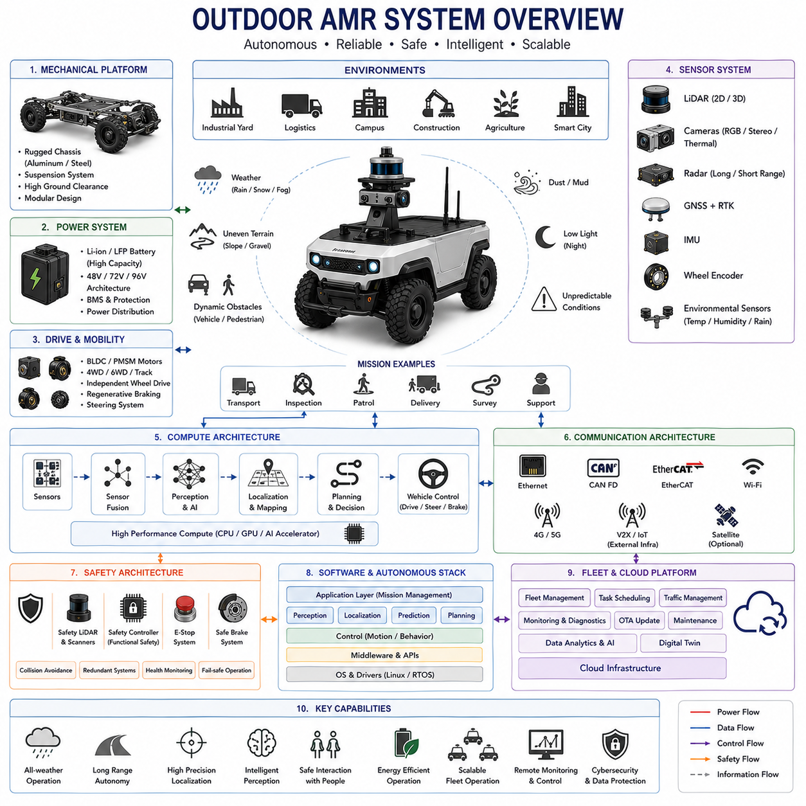
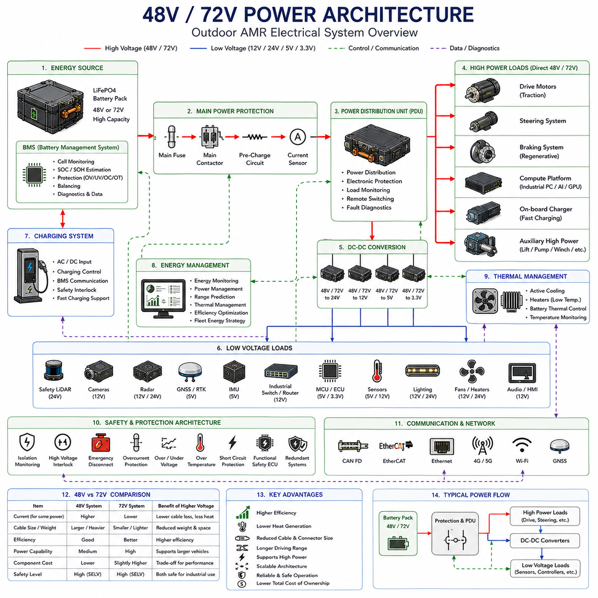
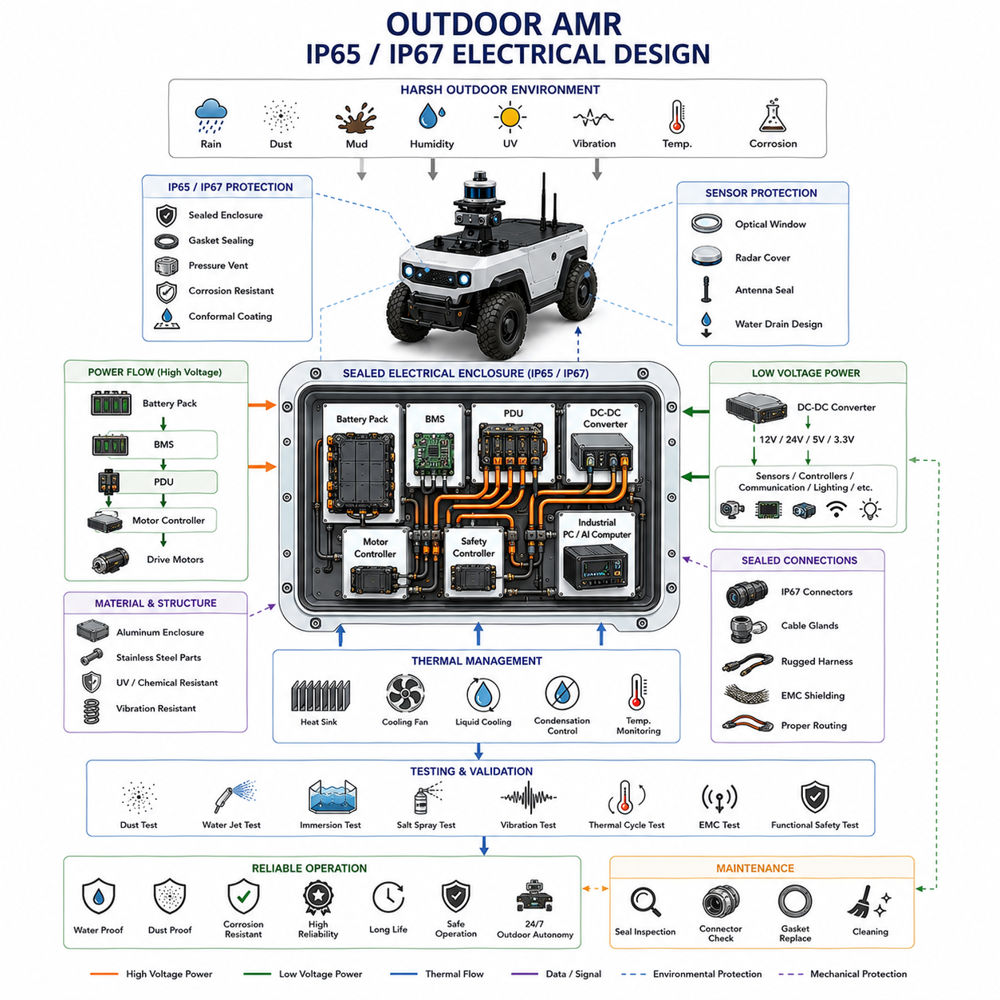
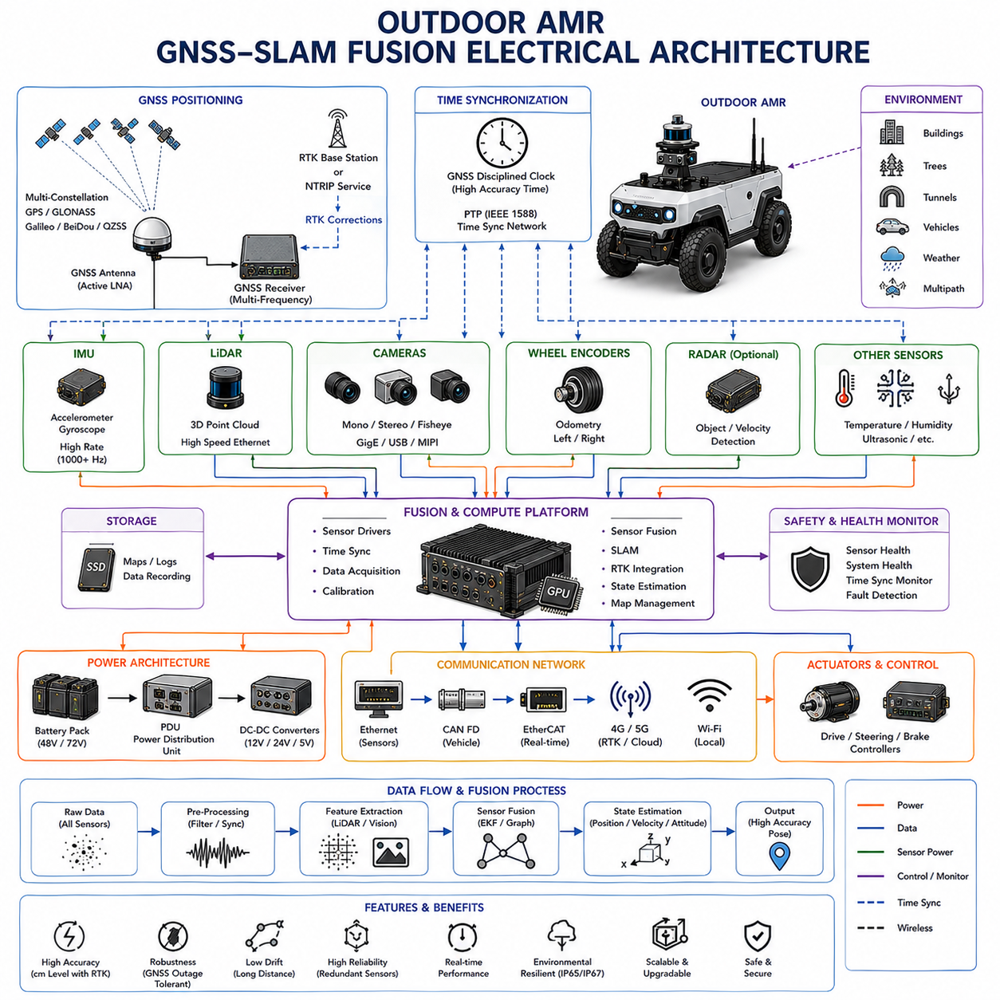
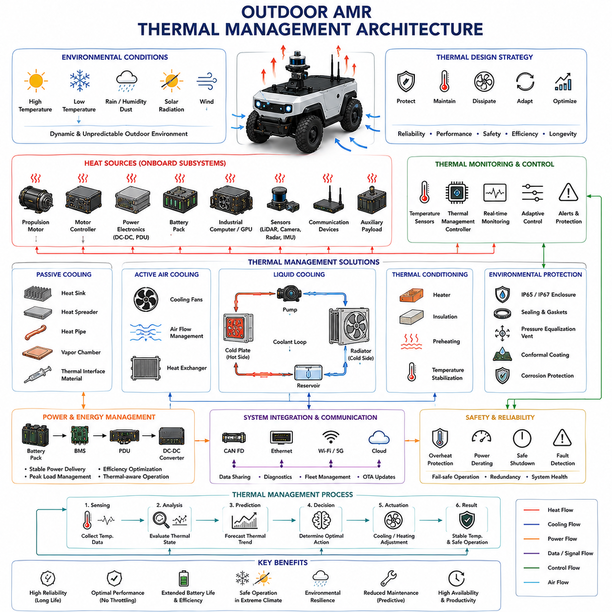

**Volume 13 AMR Electrical Architecture**


# Chapter 2. Outdoor AMR

##  

## 2.1 Outdoor AMR System Overview

{width="7.268055555555556in" height="7.268055555555556in"}

An Outdoor Autonomous Mobile Robot (Outdoor AMR) is a self-driving robotic platform designed to operate in complex outdoor environments where weather conditions, terrain variations, environmental uncertainty, and dynamic obstacles create challenges that are significantly more demanding than those encountered in indoor applications. Unlike Indoor AMRs, which typically operate on flat and highly controlled surfaces within factories and warehouses, Outdoor AMRs must navigate roads, sidewalks, industrial yards, ports, construction sites, campuses, agricultural fields, mining areas, logistics centers, airports, military facilities, and smart city environments. The Outdoor AMR System represents the integration of robotics, autonomous driving, artificial intelligence, sensor fusion, communication systems, power electronics, safety engineering, and industrial automation into a unified autonomous platform capable of reliable operation in real-world outdoor conditions.

The primary objective of an Outdoor AMR is to transport goods, perform inspections, conduct surveillance, support industrial operations, assist maintenance personnel, deliver materials, or execute specialized missions while operating safely and autonomously. Outdoor environments introduce challenges such as rain, fog, snow, dust, mud, uneven surfaces, changing illumination, moving vehicles, pedestrians, animals, and unpredictable obstacles. Therefore, the architecture of an Outdoor AMR must be significantly more robust than that of a typical indoor robotic platform.

At the highest level, the Outdoor AMR consists of several interconnected domains including the mechanical platform, power system, drive system, sensor system, compute architecture, communication network, safety architecture, navigation stack, fleet management infrastructure, and cloud integration layer. Each domain contributes to the robot's ability to perceive its surroundings, make intelligent decisions, and execute safe motion in challenging outdoor environments.

The mechanical platform forms the structural foundation of the robot. Outdoor AMRs are generally larger and more rugged than indoor robots because they must withstand environmental stress, vibration, impact loads, and terrain irregularities. The chassis is typically constructed using steel, aluminum alloys, or composite materials designed to provide high strength while minimizing weight. Structural rigidity is critical because sensor calibration, localization accuracy, and drive system performance can be affected by chassis deformation.

The mobility system is one of the defining characteristics of an Outdoor AMR. Depending on the application, robots may utilize four-wheel drive, six-wheel drive, tracked systems, articulated steering systems, skid-steering systems, differential drive configurations, or independent wheel modules. Outdoor robots frequently encounter slopes, loose gravel, wet surfaces, uneven terrain, potholes, and curbs. As a result, the mobility architecture must provide sufficient traction, ground clearance, suspension travel, and obstacle-crossing capability.

The power architecture provides energy for all onboard systems. Most industrial-grade Outdoor AMRs employ high-capacity lithium battery systems, typically based on Lithium Iron Phosphate chemistry. Compared to indoor robots, outdoor platforms often require significantly larger battery capacities because they travel longer distances, operate heavier sensors, power larger compute systems, and perform more demanding driving tasks. Battery capacities commonly range from several kilowatt-hours to tens of kilowatt-hours depending on vehicle size and mission requirements.

Power distribution architecture must support propulsion systems, steering systems, compute platforms, perception sensors, communication equipment, safety devices, lighting systems, environmental control systems, and auxiliary payloads. Most modern Outdoor AMRs utilize 48V architectures, although larger vehicles may employ 72V, 96V, or higher voltage systems to improve efficiency and reduce current requirements.

The propulsion system converts electrical energy into vehicle motion. Brushless DC motors, Permanent Magnet Synchronous Motors, and industrial servo systems are commonly employed. The propulsion architecture may include independent wheel drives, centralized drive systems, hub motors, planetary gearboxes, differential mechanisms, and regenerative braking systems. Efficient motor control is essential because propulsion often represents the largest consumer of electrical energy within the vehicle.

Navigation represents one of the most important capabilities of an Outdoor AMR. Unlike indoor robots that often rely exclusively on LiDAR-based SLAM, outdoor robots require a combination of localization technologies. Satellite-based positioning systems provide global positioning information, while local sensors provide environmental awareness and precision positioning. Modern Outdoor AMRs typically integrate GNSS receivers, RTK correction systems, inertial navigation systems, wheel odometry, LiDAR localization, visual localization, and map-based positioning algorithms.

GNSS provides absolute geographic positioning, but its accuracy can be affected by signal blockage, multipath reflections, atmospheric disturbances, and urban canyon effects. To improve positioning performance, many Outdoor AMRs utilize RTK technology. RTK systems employ correction data from reference stations to achieve centimeter-level positioning accuracy. In many industrial applications, positioning accuracy of approximately one to three centimeters is required for reliable autonomous operation.

Sensor architecture is considerably more complex in Outdoor AMRs than in indoor systems. Outdoor environments contain dynamic obstacles, varying lighting conditions, weather disturbances, and long-range detection requirements. Therefore, sensor redundancy and diversity become critical design principles.

LiDAR sensors remain among the most important perception devices. Two-dimensional LiDAR may be used for obstacle detection and safety functions, while three-dimensional LiDAR provides detailed environmental perception. Multiple LiDAR units are often installed to eliminate blind spots and improve situational awareness.

Camera systems provide rich visual information about the environment. RGB cameras support object recognition, traffic sign detection, lane detection, semantic segmentation, pedestrian recognition, and visual inspection tasks. Stereo cameras provide depth information. Thermal cameras may be used for nighttime operation, surveillance, equipment inspection, or human detection under adverse conditions.

Radar technology has become increasingly important in outdoor robotics. Unlike cameras and LiDAR, radar maintains reliable performance under rain, fog, dust, snow, and low-visibility conditions. Radar sensors provide robust obstacle detection and velocity estimation, making them valuable components within sensor fusion architectures.

The Inertial Measurement Unit provides acceleration and angular velocity information that supports dead reckoning, vehicle stabilization, and sensor fusion. High-grade industrial IMUs may incorporate gyroscopes, accelerometers, magnetometers, and temperature compensation mechanisms to improve navigation performance.

Sensor fusion serves as the foundation of outdoor autonomy. No single sensor can provide reliable perception under all environmental conditions. Therefore, Outdoor AMRs combine data from GNSS, RTK, IMU, LiDAR, radar, cameras, wheel encoders, and environmental sensors to create a unified representation of the surrounding world. Advanced sensor fusion algorithms continuously estimate vehicle position, velocity, orientation, obstacle locations, and environmental conditions.

The compute architecture functions as the central intelligence system of the robot. Modern Outdoor AMRs frequently employ distributed computing architectures consisting of industrial computers, embedded controllers, AI accelerators, safety controllers, and communication processors. These systems execute perception algorithms, localization algorithms, path planning functions, obstacle avoidance logic, vehicle control software, diagnostics, and fleet communication services.

Artificial intelligence plays an increasingly important role in outdoor robotics. Deep learning models support object detection, semantic segmentation, anomaly detection, terrain classification, route optimization, and predictive maintenance. Edge AI computing platforms allow sophisticated AI models to operate directly onboard the vehicle while maintaining real-time responsiveness.

Communication architecture enables coordination between the robot, fleet management systems, cloud platforms, operators, and external infrastructure. Multiple communication technologies are typically employed simultaneously. Ethernet serves as the primary onboard communication backbone. CAN FD and EtherCAT provide deterministic communication for vehicle control systems. Wi-Fi supports local connectivity. Cellular networks including 4G and 5G provide wide-area connectivity. Satellite communication may be employed in remote environments.

Cloud connectivity enables remote monitoring, diagnostics, software updates, mission management, digital twin synchronization, and data analytics. Modern Outdoor AMRs increasingly participate in cloud-based ecosystems where operational data is continuously analyzed to improve fleet performance and maintenance planning.

Safety architecture is one of the most critical aspects of Outdoor AMR design. Outdoor robots frequently share operating environments with people, vehicles, equipment, and public infrastructure. Safety systems must therefore function reliably under all operating conditions.

Safety architecture typically includes emergency stop systems, safety LiDAR scanners, safety controllers, redundant communication channels, fail-safe braking systems, redundant localization systems, collision avoidance algorithms, and functional safety monitoring mechanisms. Safety functions continuously evaluate environmental risks and vehicle status to prevent hazardous situations.

Environmental robustness is a defining requirement for Outdoor AMRs. Unlike indoor systems, outdoor robots must operate under varying weather conditions. Components are therefore designed to meet ingress protection requirements such as IP65, IP66, or IP67. Environmental sealing protects electronics against water, dust, humidity, and contaminants.

Thermal management is particularly challenging in outdoor environments. Electronics must remain operational under both high-temperature and low-temperature conditions. Active cooling systems, passive heat dissipation structures, heaters, thermal insulation materials, and intelligent thermal management software are often required.

Suspension systems significantly influence vehicle stability and sensor performance. Uneven terrain can introduce vibration and shock that degrade perception quality and localization accuracy. Independent suspension systems, shock absorbers, dampers, and vibration isolation mounts help maintain stable operation while protecting sensitive equipment.

Mission planning architecture enables the robot to perform meaningful work. Mission management systems coordinate navigation tasks, payload operations, charging activities, inspection routines, and fleet-level objectives. Mission execution software interacts closely with localization, perception, and motion control systems to ensure efficient task completion.

Fleet management becomes increasingly important as deployment scales grow. A single facility may operate dozens or hundreds of Outdoor AMRs simultaneously. Fleet management software coordinates task allocation, traffic management, charging schedules, software deployment, maintenance planning, and performance monitoring. Intelligent scheduling algorithms optimize fleet utilization while minimizing operational costs.

Cybersecurity has emerged as a critical requirement for modern autonomous systems. Outdoor AMRs frequently communicate with cloud services, enterprise networks, mobile devices, and external infrastructure. Security mechanisms include encrypted communication, authentication systems, secure boot processes, access control frameworks, intrusion detection systems, and secure over-the-air update mechanisms.

Digital twin technology is becoming increasingly integrated into Outdoor AMR ecosystems. Digital twins provide virtual representations of vehicles, environments, and operational processes. By synchronizing real-world data with simulation environments, operators can evaluate performance, predict failures, optimize routes, and validate software updates before deployment.

The emergence of Physical AI is further transforming Outdoor AMR architectures. Traditional robotic systems relied heavily on deterministic programming and predefined workflows. Modern Physical AI systems integrate perception, reasoning, planning, and action into unified architectures capable of adapting to changing environmental conditions. Foundation models, multimodal AI systems, reinforcement learning algorithms, and autonomous decision-making frameworks are increasingly becoming part of next-generation outdoor robotics platforms.

Future Outdoor AMRs will likely evolve toward highly autonomous, AI-native systems capable of operating across large geographic areas with minimal human supervision. Advances in battery technology, sensor systems, communication infrastructure, artificial intelligence, and cloud computing will enable increasingly capable robotic platforms. Integration with smart cities, intelligent transportation systems, industrial IoT infrastructure, and autonomous logistics networks will further expand their role in modern society.

Ultimately, the Outdoor AMR System represents the convergence of autonomous driving technology, industrial robotics, artificial intelligence, advanced sensing, communication engineering, power electronics, and safety systems. It is a comprehensive cyber-physical platform designed to perceive, understand, and interact with complex outdoor environments. By integrating robust mechanical design, reliable electrical architecture, intelligent software systems, advanced perception technologies, and scalable fleet management infrastructure, Outdoor AMRs provide the foundation for the next generation of autonomous industrial mobility and intelligent outdoor automation.

# 02_01 실외 AMR 시스템 개요 (Outdoor AMR System Overview)

실외 자율주행 이동로봇(Outdoor AMR)은 복잡한 야외 환경에서 자율적으로 이동하고 작업을 수행하도록 설계된 로봇 플랫폼이다. 실내 AMR이 비교적 평탄하고 통제된 환경에서 운영되는 반면, 실외 AMR은 비, 눈, 안개, 먼지, 진흙, 불규칙한 노면, 경사로, 변화하는 조도 환경, 이동하는 차량, 보행자, 동물 및 예측하기 어려운 장애물이 존재하는 환경에서 운용되어야 한다. 따라서 실외 AMR은 단순한 이동 로봇이 아니라 자율주행 기술, 인공지능, 센서 융합, 통신 시스템, 전력전자 기술, 기능 안전 기술, 산업 자동화 기술이 통합된 복합 시스템이라고 할 수 있다.

실외 AMR의 주요 목적은 물류 운송, 시설 점검, 순찰 감시, 유지보수 지원, 자재 공급, 산업 현장 지원, 스마트 시티 서비스 및 특수 임무 수행 등을 자율적으로 수행하는 것이다. 이러한 임무를 수행하기 위해서는 복잡한 외부 환경을 이해하고 안전하게 이동할 수 있는 높은 수준의 자율성이 필요하다.

실외 AMR 시스템은 크게 기계 플랫폼, 전원 시스템, 구동 시스템, 센서 시스템, 컴퓨팅 아키텍처, 통신 네트워크, 안전 시스템, 자율주행 시스템, 플릿 관리 시스템, 클라우드 연동 시스템으로 구성된다. 각각의 영역은 독립적으로 존재하는 것이 아니라 상호 긴밀하게 연결되어 있으며, 하나의 통합된 자율주행 플랫폼을 형성한다.

기계 플랫폼은 실외 AMR의 구조적 기반이다. 실외 환경은 진동, 충격, 기후 변화 및 지형 변화가 크기 때문에 차체는 높은 강성과 내구성을 가져야 한다. 일반적으로 강철, 알루미늄 합금 또는 복합재료를 사용하며, 구조 강성이 부족할 경우 센서 정렬 오차와 위치 추정 오차가 발생할 수 있다.

이동 플랫폼은 실외 AMR의 핵심 특징 중 하나이다. 적용 분야에 따라 4륜 구동, 6륜 구동, 무한궤도, 스키드 스티어링, 독립 조향, 차동 구동 등의 구조가 사용된다. 실외 환경에서는 경사면, 자갈길, 흙길, 포트홀, 연석, 미끄러운 노면 등을 통과해야 하므로 충분한 접지력과 지상고, 서스펜션 성능이 요구된다.

전원 시스템은 차량 내 모든 장치에 에너지를 공급한다. 대부분의 산업용 실외 AMR은 LFP(Lithium Iron Phosphate) 기반 배터리를 사용한다. 실외 AMR은 실내 AMR보다 훨씬 긴 이동 거리와 높은 계산 성능을 요구하므로 배터리 용량도 수 kWh에서 수십 kWh 수준까지 확대되는 경우가 많다.

전력 분배 시스템은 구동 모터, 조향 장치, 산업용 컴퓨터, AI 서버, 센서, 통신 장비, 안전 시스템, 조명 장치 및 각종 부가 장치에 전력을 공급한다. 대부분의 최신 실외 AMR은 48V 기반 구조를 사용하며, 대형 플랫폼은 72V 또는 96V 이상의 전압 시스템을 사용하기도 한다.

구동 시스템은 전기에너지를 실제 이동 에너지로 변환한다. BLDC 모터, PMSM 모터, 산업용 서보 모터 등이 주로 사용되며, 허브 모터, 중앙 구동 방식, 독립 휠 구동 방식 등이 적용된다. 또한 회생제동 기능을 통해 감속 시 발생하는 에너지를 배터리로 다시 회수할 수 있다.

실외 AMR에서 가장 중요한 기능 중 하나는 자율주행이다. 실내 AMR이 주로 LiDAR 기반 SLAM에 의존하는 것과 달리, 실외 AMR은 다양한 위치 추정 기술을 함께 사용한다. 대표적으로 GNSS, RTK, IMU, 휠 오도메트리, LiDAR Localization, 비전 기반 위치 추정, 지도 기반 위치 추정 등이 사용된다.

GNSS는 절대 위치 정보를 제공하지만 건물, 나무, 구조물 등에 의해 신호 품질이 저하될 수 있다. 이를 보완하기 위해 RTK 기술이 사용된다. RTK는 기준국의 보정 데이터를 활용하여 일반 GPS보다 훨씬 높은 정밀도를 제공하며, 일반적으로 1\~3cm 수준의 위치 정확도를 달성할 수 있다.

센서 시스템은 실외 자율주행의 핵심이다. 실외 환경은 조도 변화, 날씨 변화, 이동 장애물, 장거리 인식 요구사항이 존재하기 때문에 다양한 센서가 함께 사용된다.

LiDAR는 가장 중요한 환경 인식 센서 중 하나이다. 2D LiDAR는 장애물 탐지와 안전 기능에 활용되며, 3D LiDAR는 정밀 지도 생성과 환경 인식에 사용된다. 대부분의 실외 AMR은 사각지대를 제거하기 위해 여러 개의 LiDAR를 사용한다.

카메라는 객체 인식, 차선 인식, 교통 표지판 인식, 사람 인식, 의미 기반 지도 생성 등에 사용된다. RGB 카메라 외에도 Stereo Camera와 Thermal Camera가 활용된다. 열화상 카메라는 야간 운행이나 악천후 환경에서 특히 유용하다.

Radar는 최근 실외 AMR에서 매우 중요한 센서로 자리 잡고 있다. LiDAR와 카메라는 비나 안개, 먼지 환경에서 성능이 저하될 수 있지만 Radar는 상대적으로 안정적인 성능을 유지한다. 따라서 악천후 환경에서도 장애물 탐지와 속도 측정이 가능하다.

IMU는 가속도와 각속도를 측정하여 차량의 자세와 움직임을 계산한다. 고급 IMU는 자이로스코프, 가속도계, 자력계 및 온도 보정 기능을 포함하며, GNSS와 결합하여 위치 정확도를 향상시킨다.

실외 자율주행의 핵심은 센서 융합(Sensor Fusion)이다. 어떤 센서도 단독으로 모든 환경에서 완벽하게 동작할 수 없기 때문에 GNSS, RTK, IMU, LiDAR, Radar, Camera, Encoder 데이터를 통합하여 하나의 통합된 환경 모델을 생성한다.

컴퓨팅 아키텍처는 실외 AMR의 두뇌 역할을 수행한다. 현대의 실외 AMR은 산업용 PC, Edge Computer, AI 가속기, 안전 제어기, MCU 등을 조합한 분산형 구조를 사용한다. 이들 장치는 인식, 위치 추정, 경로 계획, 장애물 회피, 차량 제어, 진단 및 플릿 통신을 수행한다.

인공지능은 실외 AMR의 핵심 기술로 발전하고 있다. 딥러닝 기반 객체 인식, 의미 분할, 이상 탐지, 노면 분류, 경로 최적화, 예지보전 기능이 점차 확대되고 있다. 최신 플랫폼은 AI 모델을 차량 내부에서 직접 실행할 수 있는 Edge AI 구조를 채택하고 있다.

통신 아키텍처는 차량 내부와 외부를 연결하는 역할을 한다. 차량 내부에서는 Ethernet, CAN FD, EtherCAT 등이 사용되며, 외부 통신은 Wi-Fi, 4G, 5G, 위성 통신 등을 활용한다.

클라우드 연동은 원격 모니터링, 소프트웨어 업데이트, 디지털 트윈, 데이터 분석, 원격 진단, 플릿 운영 최적화를 가능하게 한다. 최근에는 실외 AMR이 클라우드 기반 운영 플랫폼과 긴밀하게 연결되는 방향으로 발전하고 있다.

안전 시스템은 실외 AMR 설계에서 가장 중요한 요소 중 하나이다. 실외 환경에서는 사람, 차량, 장비와 함께 이동해야 하므로 안전성이 최우선이다.

안전 시스템은 비상 정지 장치, Safety LiDAR, Safety Controller, 이중화 통신 시스템, 안전 브레이크, 충돌 방지 알고리즘, 기능 안전 모니터링 시스템 등으로 구성된다. 이러한 시스템은 위험 상황을 실시간으로 감지하고 차량을 안전한 상태로 전환한다.

환경 내구성은 실외 AMR의 필수 요구사항이다. 비, 먼지, 습기, 진동, 충격 등에 견딜 수 있어야 하므로 일반적으로 IP65, IP66 또는 IP67 등급의 방수·방진 설계가 적용된다.

열 관리 역시 중요한 문제이다. 실외 환경에서는 고온과 저온이 모두 발생할 수 있으므로 냉각 팬, 히트싱크, 히터, 단열 구조 및 지능형 열 관리 시스템이 필요하다.

서스펜션 시스템은 주행 안정성과 센서 성능에 직접적인 영향을 미친다. 노면 충격은 LiDAR와 카메라의 측정 정확도를 저하시킬 수 있으므로 독립 서스펜션, 댐퍼, 진동 흡수 장치 등이 적용된다.

임무 계획(Mission Planning) 시스템은 실외 AMR이 실제 작업을 수행할 수 있도록 지원한다. 물류 운송, 시설 점검, 경비 순찰, 자재 운반 등의 업무를 계획하고 실행하며, 자율주행 시스템과 긴밀하게 연동된다.

플릿 관리 시스템은 다수의 실외 AMR을 효율적으로 운영하기 위한 핵심 플랫폼이다. 작업 할당, 교통 관리, 충전 스케줄, 소프트웨어 업데이트, 유지보수 계획 등을 중앙에서 관리한다.

사이버 보안도 중요한 요소이다. 실외 AMR은 클라우드와 지속적으로 연결되기 때문에 암호화 통신, 인증 시스템, 보안 부팅, 접근 제어, 침입 탐지 시스템, OTA 업데이트 보안 기능이 필수적이다.

최근에는 디지털 트윈 기술이 실외 AMR에 적극적으로 적용되고 있다. 디지털 트윈은 실제 차량과 환경을 가상 공간에 재현하여 성능 검증, 경로 최적화, 유지보수 예측, 소프트웨어 검증 등에 활용된다.

또한 Physical AI 기술의 발전은 실외 AMR의 구조를 크게 변화시키고 있다. 기존의 규칙 기반 자율주행에서 벗어나 인지, 추론, 계획, 행동을 통합한 AI-Native Architecture가 등장하고 있으며, 멀티모달 AI, 강화학습, 파운데이션 모델 기반의 자율주행 기술이 빠르게 발전하고 있다.

미래의 실외 AMR은 더욱 높은 수준의 자율성을 갖추게 될 것이다. 배터리 기술, AI 기술, 센서 기술, 통신 기술이 발전함에 따라 사람의 개입 없이 장거리 운행과 복잡한 임무 수행이 가능해질 것으로 예상된다. 또한 스마트 시티, 지능형 교통 시스템, 산업용 IoT, 자율 물류 네트워크와의 연계도 확대될 것이다.

결론적으로 실외 AMR 시스템은 자율주행 기술, 산업용 로봇 기술, 인공지능, 센서 융합, 통신 공학, 전력전자, 기능 안전 기술이 융합된 복합적인 사이버-물리 시스템이다. 강인한 기계 구조, 안정적인 전기 시스템, 지능형 소프트웨어, 고성능 센서, 확장 가능한 플릿 관리 시스템을 통합함으로써 실외 AMR은 차세대 산업 자동화와 자율 이동 플랫폼의 핵심 기반 기술로 자리잡고 있다.

##  

## 2.2 48V 72V Power Architecture

{width="7.268055555555556in" height="7.268055555555556in"}

The power architecture of an Outdoor Autonomous Mobile Robot (Outdoor AMR) serves as the electrical backbone that supports every subsystem within the vehicle. Unlike indoor robots that typically operate in controlled environments with relatively modest power demands, Outdoor AMRs must support larger payloads, longer travel distances, higher speeds, more powerful computer platforms, extensive sensor suites, advanced communication systems, and demanding environmental conditions. As a result, power architecture becomes one of the most critical design elements influencing vehicle performance, operational efficiency, safety, reliability, scalability, and lifecycle cost.

Modern Outdoor AMRs increasingly utilize 48V and 72V electrical architectures because these voltage levels provide an effective balance between safety, efficiency, power delivery capability, component availability, and industrial compliance. While some smaller outdoor robots continue to use 24V systems, the majority of medium and heavy-duty outdoor autonomous platforms are transitioning toward 48V or 72V architectures. Larger autonomous vehicles may even employ 96V or higher voltage systems, but 48V and 72V remain the most practical and widely adopted solutions for industrial outdoor robotics.

The primary purpose of the power architecture is to collect energy from the battery system, distribute that energy safely throughout the vehicle, convert voltage levels as required, protect subsystems against faults, monitor system health, and ensure reliable operation under all environmental and operational conditions. The power system must support propulsion, steering, braking, perception, navigation, communication, artificial intelligence processing, safety systems, environmental control systems, payload devices, and charging infrastructure simultaneously.

The fundamental advantage of higher-voltage architectures is rooted in the basic relationship between voltage, current, and power. Electrical power is equal to voltage multiplied by current. For a given power requirement, increasing the operating voltage reduces the required current proportionally. Since resistive losses within conductors are proportional to the square of the current, reducing current dramatically improves overall system efficiency.

For example, consider an Outdoor AMR requiring 7.2 kilowatts of propulsion power. A 24V system would require approximately 300 amperes. A 48V system would require approximately 150 amperes. A 72V system would require approximately 100 amperes. This reduction in current significantly decreases cable losses, connector heating, fuse ratings, contactor requirements, and thermal management challenges.

The 48V architecture has emerged as one of the most popular solutions for medium-sized Outdoor AMRs. It offers substantial efficiency improvements over 24V systems while remaining below many regulatory thresholds associated with higher-voltage electric vehicles. The availability of industrial components designed specifically for 48V operation further contributes to its widespread adoption.

A typical 48V Outdoor AMR architecture begins with a Lithium Iron Phosphate battery pack. LFP batteries are commonly selected because they provide excellent thermal stability, long cycle life, predictable aging characteristics, and superior safety performance. The battery pack is managed by a Battery Management System that continuously monitors individual cell voltages, temperatures, charging conditions, discharge currents, State of Charge, State of Health, and fault conditions.

The Battery Management System acts as the intelligence layer of the energy storage subsystem. It protects the battery against overcharging, overdischarging, overcurrent events, thermal runaway conditions, cell imbalance, and abnormal operating states. Modern BMS units also provide diagnostic data to fleet management systems and predictive maintenance platforms.

Power exits the battery pack through a series of protection mechanisms. Main fuses provide catastrophic fault protection. High-voltage contactors enable controlled connection and disconnection of battery power. Pre-charge circuits limit inrush current during system startup. Current sensors continuously monitor energy flow and support energy management functions.

The Power Distribution Unit serves as the central hub of the vehicle's electrical architecture. It routes power to propulsion systems, steering actuators, braking systems, compute platforms, communication systems, safety devices, environmental controls, lighting systems, and payload equipment. Advanced PDUs may include electronic circuit protection, remote switching capability, fault diagnostics, load monitoring, and intelligent power management functions.

In a 48V architecture, major loads such as drive motors, steering systems, industrial computers, AI accelerators, and high-power sensors may operate directly from the primary power bus. Lower-voltage subsystems are supplied through DC-DC conversion stages that generate regulated 24V, 12V, 5V, and 3.3V rails.

The use of multiple voltage domains is common because different devices have different electrical requirements. Safety LiDAR sensors often operate at 24V. Industrial cameras may require 12V power. Embedded processors may operate at 5V or lower. Network switches, wireless communication modules, GNSS receivers, IMUs, and peripheral devices all require carefully regulated power supplies.

As vehicle size and power requirements increase, 72V architectures become increasingly attractive. Heavy-duty Outdoor AMRs designed for logistics yards, airports, industrial campuses, ports, mining sites, agriculture, and autonomous transportation applications often require power levels that exceed the practical limits of 48V systems.

A 72V architecture provides several important advantages. Current levels are reduced further, resulting in lower conductor losses, smaller cable sizes, reduced thermal generation, improved efficiency, and increased power density. High-power propulsion systems can operate more efficiently, particularly during acceleration, hill climbing, towing operations, and heavy payload transport.

Consider a large autonomous logistics vehicle requiring 14.4 kilowatts of propulsion power. A 48V system would require approximately 300 amperes. A 72V system would require only 200 amperes. This reduction significantly decreases conductor weight, connector complexity, and thermal stress throughout the vehicle.

The propulsion subsystem is typically the largest consumer of energy within an Outdoor AMR. Modern propulsion systems often utilize Permanent Magnet Synchronous Motors or high-efficiency Brushless DC motors. These motors are controlled by sophisticated motor inverters that convert battery DC power into three-phase AC power.

Motor controllers operating within 48V and 72V architectures must manage substantial power levels while maintaining precise control of speed, torque, acceleration, and regenerative braking functions. Advanced Field-Oriented Control algorithms optimize efficiency and dynamic response while minimizing energy consumption.

Regenerative braking plays an increasingly important role in Outdoor AMR energy management. During deceleration or downhill operation, propulsion motors function as generators, converting mechanical energy back into electrical energy. This recovered energy is returned to the battery pack, improving overall vehicle efficiency and extending operational range.

The compute architecture introduces additional power demands. Modern Outdoor AMRs frequently incorporate industrial computers, edge computing platforms, artificial intelligence accelerators, GPU systems, communication processors, and safety controllers. Advanced perception systems processing LiDAR point clouds, camera streams, radar data, and AI inference workloads may consume several hundred watts independently.

High-performance AI platforms based on embedded GPUs or industrial AI accelerators often operate directly from 48V or 72V buses through dedicated power conversion stages. Stable power delivery is essential because voltage fluctuations can disrupt perception, navigation, localization, and decision-making functions.

Sensor systems also contribute significantly to overall power consumption. LiDAR units, radar sensors, camera arrays, GNSS receivers, RTK modules, IMUs, environmental sensors, wireless communication devices, and safety scanners collectively require substantial energy. While individual sensors may consume relatively little power, the cumulative demand across a complete autonomous platform can be significant.

Thermal management becomes increasingly important as power levels increase. Batteries, motor controllers, DC-DC converters, AI processors, network equipment, and charging systems all generate heat during operation. Excessive temperatures reduce efficiency, accelerate component aging, and increase failure rates.

Outdoor environments present unique thermal challenges because ambient temperatures may vary dramatically. Vehicles may operate under direct sunlight during summer conditions or freezing temperatures during winter conditions. Effective thermal management therefore requires integrated heating, cooling, insulation, ventilation, and thermal monitoring systems.

Many Outdoor AMRs employ active cooling systems for compute platforms and power electronics. Heat sinks, cooling fans, liquid cooling loops, thermal interface materials, and intelligent thermal management algorithms help maintain stable operating temperatures. Battery thermal management systems are particularly important because battery performance and lifespan are strongly influenced by temperature.

Charging architecture forms another critical component of the overall power system. Outdoor AMRs may utilize conductive charging stations, automated docking systems, fast-charging infrastructure, or battery exchange systems. Charging power levels often range from several kilowatts to tens of kilowatts depending on vehicle size and operational requirements.

The charging system must communicate with the Battery Management System to ensure safe charging behavior. Charging profiles are dynamically adjusted according to battery chemistry, temperature, charge state, battery age, and operational constraints. Intelligent charging algorithms help maximize battery lifespan while minimizing operational downtime.

Fleet-scale deployments introduce additional energy management challenges. A large autonomous fleet may contain dozens or hundreds of vehicles operating simultaneously. Coordinating charging schedules, balancing facility power consumption, optimizing charging station utilization, and minimizing peak demand charges become important operational objectives.

Fleet management systems therefore integrate closely with vehicle power architectures. Real-time energy monitoring enables intelligent charging decisions based on battery status, workload forecasts, mission priorities, electricity pricing, renewable energy availability, and facility power constraints.

Safety considerations are particularly important within 48V and 72V architectures because substantial energy is stored within the battery system. Protection mechanisms include fuses, contactors, insulation monitoring devices, current sensors, voltage monitors, thermal sensors, emergency disconnect systems, and software-based fault detection algorithms.

Functional safety requirements demand that hazardous conditions be detected rapidly and that appropriate mitigation actions be executed automatically. Faults such as short circuits, insulation failures, thermal events, battery abnormalities, communication failures, and power conversion faults must be managed safely to protect personnel, equipment, and infrastructure.

Redundancy is frequently incorporated into mission-critical Outdoor AMRs. Safety controllers, emergency communication systems, localization sensors, braking systems, and critical compute platforms may receive power through independent distribution pathways. Backup batteries or supercapacitors may provide temporary energy during emergency shutdown procedures.

Electromagnetic compatibility is another essential design consideration. High-power switching devices generate electrical noise that can interfere with navigation sensors, communication systems, positioning equipment, and safety devices. Proper grounding strategies, shielding techniques, isolation barriers, filtering circuits, and cable routing practices are required to maintain reliable operation.

Modern Outdoor AMRs increasingly incorporate intelligent energy management systems that continuously optimize power consumption. These systems monitor energy flow throughout the vehicle, adjust subsystem behavior according to operational priorities, predict remaining runtime, identify efficiency opportunities, and support predictive maintenance strategies.

Artificial intelligence is beginning to influence energy management as well. Machine learning algorithms can analyze historical operating data to predict battery degradation, optimize charging schedules, improve route planning for energy efficiency, detect abnormal power consumption patterns, and enhance fleet-level energy utilization.

Future Outdoor AMR power architectures are expected to become increasingly sophisticated. Advances in battery technology, silicon carbide power electronics, high-efficiency motor systems, AI-driven energy optimization, smart charging infrastructure, renewable energy integration, and autonomous fleet coordination will continue to improve performance and efficiency.

The distinction between 48V and 72V architectures will remain an important design decision. Medium-sized Outdoor AMRs will continue to benefit from the balance of safety, simplicity, and efficiency provided by 48V systems. Larger autonomous platforms requiring greater propulsion power, extended operating range, and heavy payload capability will increasingly adopt 72V architectures to achieve superior efficiency and scalability.

Ultimately, the 48V and 72V Power Architecture forms the energy foundation of the Outdoor AMR. It determines how effectively electrical energy is stored, distributed, converted, monitored, protected, and utilized throughout the vehicle. A carefully engineered power architecture enables reliable propulsion, robust perception, advanced artificial intelligence, safe operation, efficient charging, long battery life, and scalable fleet deployment. Through the integration of batteries, battery management systems, power distribution units, conversion systems, charging infrastructure, thermal management technologies, safety mechanisms, and intelligent energy management algorithms, the Outdoor AMR becomes a practical and sustainable autonomous platform capable of operating effectively in demanding real-world environments.

# 02_02 48V·72V 전원 아키텍처 (48V·72V Power Architecture)

실외 자율주행 이동로봇(Outdoor AMR)의 전원 아키텍처는 차량 내 모든 시스템을 구동하는 전기적 기반이다. 실내 AMR이 상대적으로 제한된 공간과 비교적 낮은 전력 요구사항을 가진 환경에서 운영되는 것과 달리, 실외 AMR은 더 큰 적재 중량, 더 긴 이동 거리, 더 높은 주행 속도, 고성능 AI 컴퓨팅 시스템, 대규모 센서 구성, 강력한 통신 시스템 및 다양한 기후 조건을 지원해야 한다. 따라서 전원 아키텍처는 차량의 성능, 효율성, 안전성, 신뢰성, 확장성 및 유지보수 비용을 결정하는 핵심 요소가 된다.

최근의 실외 AMR은 주로 48V 또는 72V 기반 전원 시스템을 사용한다. 일부 소형 플랫폼은 여전히 24V를 사용하지만, 중형 이상의 산업용 플랫폼은 대부분 48V 또는 72V 시스템을 채택하고 있다. 대형 자율주행 플랫폼은 96V 이상을 사용하는 경우도 있으나, 현재 산업용 실외 AMR에서는 48V와 72V가 가장 널리 사용되는 전압 체계이다.

전원 아키텍처의 목적은 배터리에 저장된 에너지를 안전하게 수집하고, 차량 전체에 분배하며, 필요한 전압으로 변환하고, 장애를 감지하고 보호하며, 다양한 환경 조건에서도 안정적인 동작을 보장하는 것이다. 전원 시스템은 구동 시스템, 조향 시스템, 제동 시스템, 센서 시스템, 컴퓨팅 플랫폼, 통신 장비, 안전 장치, 환경 제어 장치, 작업 장비 및 충전 시스템에 동시에 전력을 공급해야 한다.

48V와 72V 전원 시스템의 가장 큰 장점은 전압이 높아질수록 동일한 전력을 더 낮은 전류로 공급할 수 있다는 점이다. 전력은 전압과 전류의 곱으로 결정되므로 전압이 증가하면 필요한 전류는 감소한다. 전선에서 발생하는 손실은 전류의 제곱에 비례하기 때문에 전류 감소는 에너지 효율 향상에 매우 큰 효과를 가져온다.

예를 들어 7.2kW의 추진 전력이 필요한 경우를 생각해 보면, 24V 시스템에서는 약 300A가 필요하다. 48V 시스템에서는 약 150A가 필요하며, 72V 시스템에서는 약 100A만 필요하다. 전류가 감소하면 케이블 발열이 줄어들고 전력 손실이 감소하며 커넥터와 퓨즈의 크기도 줄일 수 있다.

48V 아키텍처는 현재 중형 실외 AMR에서 가장 널리 사용되는 구조이다. 24V 대비 높은 효율을 제공하면서도 전기차 수준의 고전압 시스템보다 설계가 단순하고 안전성이 높다. 또한 산업용 48V 부품의 공급이 풍부하다는 장점도 있다.

48V 시스템은 일반적으로 LFP(Lithium Iron Phosphate) 배터리 팩에서 시작된다. LFP 배터리는 높은 안전성, 긴 수명, 우수한 열 안정성 및 예측 가능한 열화 특성을 제공하기 때문에 산업용 AMR에서 가장 널리 사용된다.

배터리 팩은 BMS(Battery Management System)에 의해 관리된다. BMS는 셀 전압, 셀 온도, 충전 상태, 방전 전류, SOC(State of Charge), SOH(State of Health) 등을 지속적으로 감시한다.

BMS는 단순한 모니터링 장치를 넘어 배터리 보호 장치의 역할도 수행한다. 과충전, 과방전, 과전류, 셀 불균형, 과열 및 이상 상태를 감지하여 배터리를 보호한다. 또한 수집된 데이터를 플릿 관리 시스템 및 예지보전 시스템에 제공한다.

배터리에서 출력된 전력은 다양한 보호 장치를 통과한다. 메인 퓨즈는 단락 사고와 같은 치명적인 고장을 방지하며, 컨택터는 배터리 전원을 안전하게 연결하거나 차단한다. 프리차지 회로는 초기 기동 시 발생하는 돌입 전류를 제한한다. 전류 센서는 에너지 흐름을 측정하여 에너지 관리 및 보호 기능을 지원한다.

PDU(Power Distribution Unit)는 전력 분배의 중심 역할을 수행한다. 배터리에서 공급된 전력을 구동 모터, 조향 시스템, 브레이크 시스템, 산업용 컴퓨터, AI 가속기, 센서, 조명 장치 및 각종 작업 장비로 분배한다.

고급 PDU는 단순한 분배 기능뿐 아니라 전류 모니터링, 원격 스위칭, 전자식 퓨즈, 고장 진단 및 에너지 관리 기능까지 제공한다.

48V 시스템에서는 구동 모터, 조향 액추에이터, 산업용 PC, GPU 서버, 고성능 센서 등이 직접 48V 전원을 사용할 수 있다. 반면 저전압 장치는 DC-DC 컨버터를 통해 필요한 전압을 공급받는다.

실제 AMR 내부에는 여러 개의 전압 도메인이 존재한다. Safety LiDAR는 일반적으로 24V를 사용하며, 카메라는 12V를 사용하는 경우가 많다. GNSS 수신기, IMU, 네트워크 장비, 임베디드 컨트롤러는 5V 또는 3.3V 전원을 요구하기도 한다.

차량의 크기와 출력 요구사항이 증가하면 72V 아키텍처가 더욱 유리해진다. 물류 야드, 항만, 공항, 농업, 광산 및 대형 산업 현장에서 사용되는 중량급 AMR은 48V의 한계를 넘는 경우가 많다.

72V 시스템은 전류를 더욱 줄일 수 있기 때문에 배선 손실 감소, 발열 감소, 전선 무게 감소, 출력 밀도 향상 등의 장점을 제공한다.

예를 들어 14.4kW의 추진 전력이 필요한 대형 물류 차량의 경우, 48V 시스템에서는 약 300A가 필요하지만 72V 시스템에서는 약 200A만 필요하다. 이는 전선 굵기와 발열을 크게 줄여준다.

추진 시스템은 실외 AMR에서 가장 많은 에너지를 소비하는 장치이다. 일반적으로 PMSM 또는 고효율 BLDC 모터가 사용되며, 인버터가 배터리의 DC 전원을 3상 AC 전원으로 변환한다.

모터 제어기는 속도, 토크, 가속도 및 회생제동 기능을 정밀하게 제어해야 한다. 대부분의 고성능 시스템은 FOC(Field Oriented Control)를 사용하여 효율과 응답성을 최적화한다.

회생제동(Regenerative Braking)은 실외 AMR의 중요한 기능 중 하나이다. 감속하거나 내리막길을 주행할 때 모터는 발전기로 동작하여 운동 에너지를 전기에너지로 변환한다. 이렇게 생성된 전력은 다시 배터리로 저장되어 전체 효율을 향상시킨다.

컴퓨팅 시스템 역시 상당한 전력을 소비한다. 현대의 실외 AMR은 산업용 PC, Edge Computer, AI Accelerator, GPU 서버, 통신 프로세서 및 안전 제어기를 탑재한다.

특히 LiDAR 포인트 클라우드 처리, 카메라 영상 분석, Radar 데이터 처리 및 AI 추론을 수행하는 GPU 시스템은 수백 와트의 전력을 소비할 수 있다.

고성능 AI 플랫폼은 일반적으로 48V 또는 72V 전원 버스에서 직접 전력을 공급받으며, 별도의 DC-DC 변환기를 통해 필요한 전압을 생성한다.

센서 시스템도 전체 전력 소비에서 중요한 비중을 차지한다. LiDAR, Radar, Camera, GNSS, RTK, IMU, Safety Scanner, 무선 통신 장치 등은 각각 개별적으로는 큰 전력을 소비하지 않지만 전체적으로는 상당한 부하를 형성한다.

열 관리 또한 매우 중요한 요소이다. 배터리, 모터 드라이버, DC-DC 컨버터, GPU, 네트워크 장비 및 충전 시스템은 모두 열을 발생시킨다. 과도한 열은 효율 저하, 수명 단축 및 고장률 증가를 초래한다.

실외 환경은 여름철 고온과 겨울철 저온을 모두 경험하기 때문에 열 관리가 더욱 중요하다. 이를 위해 냉각 팬, 히트싱크, 액체 냉각 시스템, 단열 구조, 배터리 히터 등이 사용된다.

배터리 열 관리 시스템은 특히 중요하다. 배터리의 성능과 수명은 온도에 크게 영향을 받기 때문에 지속적인 온도 모니터링과 제어가 필요하다.

충전 시스템도 전체 전원 아키텍처의 중요한 구성 요소이다. 실외 AMR은 자동 도킹 충전, 고속 충전 시스템 또는 배터리 교환 시스템을 사용할 수 있다.

충전 시스템은 BMS와 통신하여 배터리 상태를 확인하고, 배터리 온도, 충전 상태, 배터리 수명 등을 고려하여 최적의 충전 프로파일을 적용한다.

플릿 규모가 커질수록 에너지 관리의 중요성이 증가한다. 수십 대에서 수백 대의 차량이 동시에 운영되는 경우 충전 스케줄 최적화, 시설 전력 사용량 관리, 충전소 활용도 향상 등이 중요한 과제가 된다.

플릿 관리 시스템은 각 차량의 배터리 상태, 작업 계획, 전력 요금, 재생에너지 사용 가능 여부 등을 고려하여 충전 계획을 최적화한다.

안전은 48V 및 72V 시스템에서 매우 중요한 요소이다. 대용량 배터리는 상당한 에너지를 저장하고 있기 때문에 적절한 보호 장치가 필요하다.

이를 위해 퓨즈, 컨택터, 절연 감시 장치, 전류 센서, 전압 센서, 온도 센서, 비상 차단 회로 등이 사용된다.

기능 안전 요구사항에 따라 단락, 절연 파괴, 과열, 배터리 이상, 통신 장애 등의 문제가 발생하면 시스템은 자동으로 안전한 상태로 전환되어야 한다.

중요한 시스템에는 이중화 구조가 적용되기도 한다. 안전 제어기, 브레이크 시스템, 통신 장치, 위치 추정 시스템 등은 독립적인 전원 경로를 사용할 수 있으며, 백업 배터리나 슈퍼커패시터를 통해 비상 상황에서도 동작을 유지할 수 있다.

EMC(전자파 적합성) 역시 중요한 설계 요소이다. 인버터와 DC-DC 컨버터는 고주파 스위칭을 수행하기 때문에 강한 전자파를 발생시킨다. 이는 GNSS, IMU, LiDAR, 통신 장비에 영향을 줄 수 있다.

따라서 차폐, 접지, 필터링, 절연 및 배선 설계가 반드시 고려되어야 한다.

최근의 실외 AMR은 지능형 에너지 관리 시스템을 탑재하고 있다. 이러한 시스템은 차량 전체의 전력 흐름을 분석하고, 남은 운행 시간을 예측하며, 에너지 소비를 최적화한다.

AI 기술도 에너지 관리에 활용되고 있다. 머신러닝 알고리즘은 배터리 열화 상태를 예측하고, 충전 스케줄을 최적화하며, 이상 전력 소비 패턴을 감지하고, 플릿 수준의 에너지 효율을 향상시킨다.

미래의 실외 AMR 전원 시스템은 더욱 고도화될 것으로 예상된다. 배터리 기술, 실리콘 카바이드(SiC) 전력반도체, 고효율 모터, AI 기반 에너지 관리, 스마트 충전 인프라 및 재생에너지 연계 기술이 발전하면서 효율성과 신뢰성은 더욱 향상될 것이다.

48V와 72V 아키텍처는 앞으로도 중요한 선택 기준이 될 것이다. 중형 플랫폼은 48V가 제공하는 안전성, 단순성, 효율성의 균형을 활용할 것이며, 대형 플랫폼은 더 높은 출력과 효율을 위해 72V를 채택하는 방향으로 발전할 것이다.

결론적으로 48V 및 72V 전원 아키텍처는 실외 AMR의 에너지 기반 시스템이다. 이 아키텍처는 에너지를 저장하고, 분배하고, 변환하고, 보호하고, 관리하는 모든 과정을 담당한다. 배터리, BMS, PDU, DC-DC 변환기, 충전 시스템, 열 관리 시스템, 안전 시스템, 지능형 에너지 관리 시스템이 통합됨으로써 실외 AMR은 강력한 추진 성능, 고성능 AI 처리 능력, 장시간 운용 능력, 안전성 및 대규모 플릿 운영 능력을 확보할 수 있다. 이는 현대 산업 환경에서 실외 자율주행 로봇이 실질적으로 활용될 수 있도록 만드는 핵심 기반 기술이라고 할 수 있다.

##  

## 2.3 IP65 IP67 Electrical Design

{width="7.268055555555556in" height="7.268055555555556in"}

Ingress Protection (IP) is one of the most important engineering considerations in the design of Outdoor Autonomous Mobile Robots (Outdoor AMRs). Unlike indoor robots that operate in relatively clean and controlled environments, Outdoor AMRs are exposed to rain, dust, mud, humidity, temperature fluctuations, vibration, corrosive substances, and unpredictable environmental conditions. The electrical system must therefore be designed to maintain reliability, safety, and performance even when subjected to harsh environmental exposure. IP65 and IP67 protection levels have become the most commonly adopted standards for industrial outdoor robotics because they provide a practical balance between environmental protection, manufacturing complexity, serviceability, and cost.

An Outdoor AMR is fundamentally an integration of batteries, motor controllers, sensors, communication equipment, industrial computers, power distribution units, safety systems, and electrical harnesses. Every one of these components can be affected by water ingress, dust contamination, condensation, corrosion, and environmental degradation. A single point of failure caused by moisture intrusion can compromise navigation performance, disable safety systems, damage expensive electronics, or result in complete vehicle shutdown. Consequently, IP-rated electrical design must be considered as a system-level architectural requirement rather than a component-level feature.

The International Protection Rating system is defined by IEC 60529 and provides a standardized method for classifying the degree of protection provided by electrical enclosures. The first digit indicates protection against solid particles, while the second digit indicates protection against water ingress.

An IP65-rated enclosure is completely protected against dust ingress and can withstand water jets projected from any direction. An IP67-rated enclosure provides the same dust protection while additionally surviving temporary immersion in water under specified conditions. In practical outdoor robotics applications, IP65 protection is often considered the minimum acceptable level for exposed electrical systems, while IP67 protection is typically required for critical electronics, sensors, connectors, and subsystems that may encounter standing water, flooding, heavy rainfall, or cleaning operations.

The environmental threats faced by Outdoor AMRs extend far beyond simple rain exposure. Dust particles generated by construction sites, mining operations, agricultural environments, industrial facilities, and transportation hubs can penetrate electrical systems and accumulate over time. Dust contamination may create thermal insulation layers, obstruct cooling pathways, degrade connector performance, interfere with optical sensors, and contribute to long-term reliability issues.

Water ingress presents even greater challenges. Rainwater, puddles, pressure washing operations, condensation, humidity, and accidental immersion can introduce moisture into electronic systems. Water may cause short circuits, insulation breakdown, corrosion, connector degradation, sensor malfunction, and battery safety hazards. The electrical architecture must therefore be designed to prevent moisture penetration under all expected operating conditions.

The enclosure represents the first line of defense within an IP65/IP67 electrical architecture. Electrical enclosures house industrial computers, power distribution units, communication equipment, safety controllers, battery management systems, and various electronic modules. Enclosure design must balance environmental protection with accessibility, thermal management, structural strength, electromagnetic compatibility, and serviceability.

Materials used in enclosure construction significantly influence long-term performance. Aluminum alloys are widely used because they provide high structural strength, excellent corrosion resistance, good thermal conductivity, and relatively low weight. Stainless steel may be selected for highly corrosive environments, particularly in ports, chemical facilities, food processing plants, and coastal regions. Engineering plastics and composite materials may be used where electrical isolation, reduced weight, or specialized environmental resistance is required.

Sealing technology is one of the most critical aspects of enclosure design. Gaskets create barriers that prevent dust and water ingress while allowing removable access panels for maintenance and service operations. Silicone, EPDM, neoprene, fluorosilicone, and other elastomeric materials are commonly employed depending on environmental conditions and temperature requirements.

Gasket design requires careful engineering because sealing effectiveness depends on compression force, material properties, surface finish quality, manufacturing tolerances, and long-term aging behavior. Excessive compression can damage sealing materials, while insufficient compression may allow leakage paths to develop. Many industrial enclosures utilize continuous perimeter gaskets specifically designed to maintain sealing integrity over thousands of thermal cycles.

Connector systems represent another major challenge within IP-rated electrical design. Outdoor AMRs contain numerous electrical connections linking sensors, actuators, power systems, communication devices, and control electronics. Every connector creates a potential ingress path for water and contaminants.

Industrial-grade IP67 connectors are specifically designed to prevent environmental intrusion. These connectors incorporate sealing rings, compression seals, threaded locking mechanisms, and corrosion-resistant materials. Circular connectors, M12 connectors, rugged Ethernet connectors, and specialized power connectors are commonly employed throughout outdoor robotic systems.

Connector placement also influences reliability. Connectors should be positioned to minimize direct exposure to water accumulation, splash zones, debris impact, and mechanical damage. Whenever possible, cable entry points are oriented downward or protected by mechanical shielding structures that reduce environmental exposure.

Cable management plays a fundamental role in IP65/IP67 system design. Cables act as potential pathways through which water can travel into protected enclosures. Cable glands are therefore used to create sealed transitions between external cable runs and internal electronic compartments.

Industrial cable glands provide environmental sealing, strain relief, mechanical retention, and vibration resistance. Materials are selected based on environmental exposure conditions, chemical compatibility requirements, temperature ranges, and mechanical loading expectations. Improper cable gland installation remains one of the most common causes of field failures in outdoor electrical systems.

Electrical harness architecture must also consider environmental durability. Standard indoor wiring practices are generally insufficient for outdoor autonomous vehicles. Outdoor harnesses require abrasion-resistant insulation, UV resistance, chemical resistance, vibration tolerance, and long-term environmental stability.

Automotive-grade and industrial-grade wiring systems are frequently employed because they have been specifically developed for harsh operating environments. Shielded cables may be required for communication networks, sensor interfaces, and high-speed data transmission pathways. Additional protective conduits, braided sleeves, or flexible protective tubing may be incorporated to provide further environmental protection.

Battery systems require particularly careful IP-rated design. Modern Outdoor AMRs typically employ large lithium battery packs containing significant amounts of stored energy. Water ingress into battery systems can create severe safety hazards, including short circuits, thermal runaway events, and catastrophic failures.

Battery enclosures therefore often exceed the minimum protection requirements applied to other subsystems. Many industrial battery systems utilize IP67 or higher protection levels combined with dedicated pressure equalization mechanisms, thermal monitoring systems, insulation monitoring devices, and fault detection architectures.

Pressure equalization presents an interesting engineering challenge. Fully sealed enclosures experience internal pressure variations caused by temperature changes, altitude variations, and environmental conditions. Pressure differentials can stress seals and potentially compromise enclosure integrity over time.

To address this issue, many IP67 systems incorporate membrane vents. These specialized devices allow air pressure equalization while preventing water and dust ingress. Advanced membrane technologies permit gas exchange while maintaining environmental protection, thereby improving long-term reliability.

Sensor integration introduces additional complexity because many sensors must directly interact with the external environment. Cameras require optical windows. LiDAR sensors require transparent scanning regions. Radar systems require RF-transparent protective covers. GNSS antennas require unobstructed satellite visibility.

Protective sensor housings must therefore provide environmental sealing without degrading sensor performance. Optical windows must resist scratching, contamination, UV exposure, and thermal distortion. Radar covers must maintain electromagnetic transparency. Antenna installations must preserve signal quality while preventing moisture intrusion.

Thermal management becomes increasingly challenging as enclosure protection levels increase. High-performance computing systems, motor controllers, DC-DC converters, network switches, and AI accelerators generate substantial heat during operation. Sealed enclosures restrict airflow and reduce natural cooling effectiveness.

Passive thermal management strategies often utilize aluminum enclosure structures as heat spreaders. Internal components are thermally coupled to enclosure walls through heat sinks, thermal pads, heat pipes, or conductive mounting structures. This approach allows heat to dissipate without compromising enclosure integrity.

Higher-power systems may require active cooling solutions. However, conventional ventilation systems create ingress pathways that conflict with IP protection objectives. Specialized cooling architectures such as sealed heat exchangers, liquid cooling loops, phase-change systems, or filtered pressurized enclosures may be employed to address these challenges.

Condensation management is another critical consideration. Moisture can accumulate inside sealed enclosures due to temperature cycling, humidity exposure, and pressure changes. Condensation may occur even when external water ingress is completely prevented.

Engineers address condensation risks through material selection, humidity control strategies, desiccant systems, conformal coatings, enclosure ventilation membranes, and intelligent thermal management. Conformal coating technology is particularly valuable because it provides an additional protective barrier directly on electronic circuit boards.

Conformal coatings consist of thin protective layers applied to printed circuit boards and electronic assemblies. Acrylic, silicone, polyurethane, epoxy, and parylene coatings are commonly used depending on environmental requirements. These coatings protect against moisture, corrosion, dust contamination, salt exposure, and chemical attack while allowing normal electrical operation.

Corrosion resistance is especially important in outdoor environments. Moisture, salt, industrial pollutants, fertilizers, and chemical contaminants can accelerate material degradation. Corrosion may increase electrical resistance, weaken structural components, degrade connectors, and ultimately cause system failures.

Material compatibility must therefore be carefully considered throughout the electrical architecture. Galvanic corrosion can occur when dissimilar metals are placed in electrical contact within conductive environments. Appropriate material selection, protective coatings, isolation techniques, and environmental sealing help mitigate these risks.

Electromagnetic compatibility must be maintained alongside environmental protection. IP-rated enclosures often serve dual purposes as environmental barriers and EMC shields. Metal enclosures provide effective electromagnetic shielding but require careful grounding strategies. Gaskets, connector interfaces, cable penetrations, and access panels must maintain both environmental sealing and electromagnetic continuity.

Safety systems must remain operational regardless of environmental conditions. Emergency stop circuits, safety controllers, collision detection sensors, safety LiDAR systems, and braking controllers often receive enhanced environmental protection beyond standard operational electronics. Safety-related failures caused by environmental ingress are unacceptable in industrial autonomous systems.

Testing and validation are essential components of IP65/IP67 electrical design. Laboratory testing verifies compliance with established standards, but real-world environmental testing is equally important. Outdoor AMRs must be evaluated under rain exposure, dust exposure, vibration conditions, temperature extremes, humidity cycling, thermal shock, corrosion environments, and long-term operational scenarios.

Environmental testing often includes water jet testing, immersion testing, dust chamber testing, salt spray testing, vibration testing, thermal cycling, UV exposure testing, and accelerated life testing. These evaluations help identify weaknesses before large-scale deployment occurs.

Maintenance considerations must also be incorporated into the design process. Even highly protected systems require periodic inspection, service, and component replacement. Maintenance procedures must preserve enclosure integrity while allowing efficient access to critical components. Connector replacement, seal inspection, gasket maintenance, and enclosure cleaning procedures should be clearly defined within the overall maintenance strategy.

As Outdoor AMRs continue to evolve, environmental protection requirements are becoming increasingly demanding. Applications in autonomous logistics, agriculture, mining, smart cities, defense, infrastructure inspection, and industrial automation require robots capable of operating reliably under diverse and challenging environmental conditions.

Future IP65/IP67 electrical architectures will likely incorporate advanced sealing materials, intelligent environmental monitoring systems, self-diagnostic ingress detection technologies, smart moisture sensors, adaptive thermal management systems, and predictive maintenance algorithms. These advancements will further improve reliability, reduce maintenance requirements, and extend operational lifetimes.

Ultimately, IP65 and IP67 Electrical Design forms the protective foundation of the Outdoor AMR electrical architecture. While batteries provide energy, sensors provide perception, computers provide intelligence, and drive systems provide motion, environmental protection ensures that all of these subsystems continue operating reliably in the presence of dust, water, humidity, vibration, temperature extremes, and environmental contaminants. Through careful integration of sealed enclosures, protected connectors, ruggedized wiring systems, advanced thermal management, corrosion-resistant materials, environmental monitoring technologies, and robust validation procedures, Outdoor AMRs achieve the durability and reliability required for long-term autonomous operation in real-world outdoor environments.

# 02_03 IP65·IP67 전기 설계 (IP65·IP67 Electrical Design)

IP(Ingress Protection, 침입 보호 등급)는 실외 자율주행 이동로봇(Outdoor AMR) 설계에서 가장 중요한 엔지니어링 요소 중 하나이다. 실내 로봇은 비교적 깨끗하고 통제된 환경에서 운용되지만, 실외 AMR은 비, 눈, 먼지, 진흙, 습기, 온도 변화, 진동, 부식성 물질 등 다양한 환경적 위험에 노출된다. 따라서 전기 시스템은 이러한 환경 조건에서도 안정성, 신뢰성, 안전성을 유지할 수 있도록 설계되어야 한다. 산업용 실외 로봇에서는 일반적으로 IP65와 IP67 등급이 가장 많이 적용되며, 이는 환경 보호 성능과 제조 비용, 유지보수성 사이에서 균형을 제공한다.

실외 AMR은 배터리, 모터 드라이버, 센서, 통신 장치, 산업용 컴퓨터, 전력 분배 장치(PDU), 안전 제어기, 각종 케이블 하네스 등으로 구성된다. 이들 모든 장치는 물, 먼지, 응결, 부식 등에 의해 영향을 받을 수 있다. 단 하나의 커넥터나 전자 모듈에 수분이 침투하는 것만으로도 내비게이션 오류, 통신 장애, 안전 시스템 오작동, 전원 차단, 심지어 전체 시스템 정지까지 발생할 수 있다. 따라서 IP 설계는 단순히 부품 수준의 기능이 아니라 전체 시스템 차원의 아키텍처 요구사항으로 고려되어야 한다.

IP 등급은 IEC 60529 국제 규격에 의해 정의된다. 첫 번째 숫자는 고체 이물질에 대한 보호 수준을 나타내며, 두 번째 숫자는 물에 대한 보호 수준을 의미한다.

IP65는 먼지가 내부로 침투하지 않으며 모든 방향에서 분사되는 물줄기로부터 보호되는 수준을 의미한다. IP67은 동일한 먼지 보호 성능을 제공하면서 추가적으로 일정 시간 동안 물속에 잠겨도 내부가 보호되는 수준을 의미한다.

실외 AMR에서는 일반적으로 노출된 전기 장치에 대해 최소 IP65 이상을 요구하며, 배터리 팩, 센서, 산업용 컴퓨터, 커넥터와 같은 핵심 장치는 IP67 이상을 적용하는 경우가 많다.

실외 환경에서 발생하는 위험 요소는 단순히 비에만 국한되지 않는다. 건설 현장, 항만, 광산, 농업 환경, 물류 단지에서는 대량의 먼지가 발생한다. 먼지는 전자 장치 내부에 축적되어 냉각 성능을 저하시킬 수 있으며, 광학 센서 성능 저하, 커넥터 접촉 불량, 장기적인 신뢰성 문제를 유발할 수 있다.

물은 더욱 심각한 문제를 초래한다. 빗물, 물웅덩이, 고압 세척기, 습기, 결로 현상 등은 전기 시스템 내부로 침투할 수 있으며, 단락, 절연 파괴, 부식, 센서 오작동, 배터리 손상 등을 발생시킬 수 있다. 따라서 전기 아키텍처는 모든 예상 환경 조건에서 수분 침투를 방지할 수 있도록 설계되어야 한다.

전기 설계의 첫 번째 방어선은 인클로저(Enclosure)이다. 인클로저는 산업용 PC, PDU, 네트워크 장비, BMS, 안전 제어기 등을 보호하는 역할을 수행한다. 인클로저는 환경 보호뿐만 아니라 열 관리, 전자파 차폐, 구조 강성 및 유지보수성을 동시에 고려해야 한다.

재질 선택은 매우 중요하다. 알루미늄은 강도가 높고 부식에 강하며 열전도율이 우수하기 때문에 가장 많이 사용된다. 스테인리스 스틸은 항만이나 화학 공장과 같이 부식성이 강한 환경에서 사용된다. 일부 경량 플랫폼에서는 엔지니어링 플라스틱이나 복합재가 적용되기도 한다.

밀봉(Sealing) 기술은 IP 설계의 핵심 요소이다. 가스켓(Gasket)은 먼지와 물이 내부로 침투하는 것을 방지하는 역할을 한다. 일반적으로 실리콘, EPDM, 네오프렌, 불소실리콘 등의 재질이 사용된다.

가스켓 설계는 단순하지 않다. 밀봉 성능은 압축력, 재질 특성, 표면 가공 상태, 제조 공차, 장기 열화 특성 등에 의해 영향을 받는다. 압력이 너무 크면 가스켓이 손상되고, 너무 작으면 누수 경로가 발생할 수 있다. 따라서 대부분의 산업용 인클로저는 전체 둘레를 따라 연속적인 밀봉 구조를 사용한다.

커넥터는 IP 설계에서 가장 취약한 부분 중 하나이다. 실외 AMR에는 수십 개 이상의 전기 커넥터가 존재하며, 각각이 잠재적인 수분 침투 경로가 된다.

IP67 등급 커넥터는 O-Ring, 압축 씰, 잠금 구조, 내식성 재질 등을 적용하여 외부 환경으로부터 보호된다. M12 커넥터, 원형 산업용 커넥터, 방수 Ethernet 커넥터 등이 대표적으로 사용된다.

커넥터의 위치 또한 중요하다. 물이 고이기 쉬운 위치나 직접적인 물 분사 영역은 피해야 하며, 가능한 한 아래 방향으로 배치하여 물이 자연스럽게 배출되도록 설계한다.

케이블 관리 역시 매우 중요하다. 케이블은 물이 내부로 이동하는 통로 역할을 할 수 있기 때문에 적절한 케이블 글랜드(Cable Gland)를 사용해야 한다.

케이블 글랜드는 케이블과 인클로저 사이의 밀봉을 유지하면서 동시에 장력 완화(Strain Relief) 기능도 제공한다. 잘못 설치된 케이블 글랜드는 현장에서 발생하는 침수 문제의 가장 흔한 원인 중 하나이다.

배선 하네스는 일반적인 실내용 배선과 다르게 설계되어야 한다. 실외 하네스는 UV 저항성, 내마모성, 내화학성, 진동 내구성 및 장기적인 환경 안정성을 갖추어야 한다.

따라서 자동차용 또는 산업용 등급의 배선이 사용되며, 필요에 따라 차폐 케이블, 보호 튜브, 브레이드 슬리브 등이 추가된다.

배터리 시스템은 특히 높은 수준의 IP 설계를 요구한다. 리튬 배터리는 많은 에너지를 저장하고 있기 때문에 수분이 침투하면 단락, 열폭주, 화재 등의 심각한 문제가 발생할 수 있다.

따라서 배터리 팩은 일반적으로 IP67 이상의 보호 등급을 적용하며, 절연 감시 장치, 온도 모니터링 시스템, 압력 관리 장치 등을 함께 사용한다.

완전 밀폐된 인클로저는 또 다른 문제를 발생시킨다. 온도 변화에 의해 내부 압력이 변하면 씰에 지속적인 스트레스가 가해질 수 있다.

이를 해결하기 위해 압력 평형 멤브레인(Pressure Equalization Membrane)이 사용된다. 이 장치는 공기는 통과시키지만 물과 먼지는 차단하여 내부 압력을 안정적으로 유지한다.

센서 시스템은 더욱 복잡하다. 카메라는 광학 창이 필요하며, LiDAR는 레이저가 통과할 수 있는 투명 영역이 필요하다. Radar는 전파가 통과할 수 있는 보호 커버가 필요하고, GNSS 안테나는 위성 신호를 수신할 수 있어야 한다.

따라서 센서 하우징은 보호 성능과 센서 성능을 동시에 만족해야 한다. 광학 창은 자외선, 스크래치, 오염 및 열 변형에 강해야 하며, Radar 커버는 전파 투과 특성을 유지해야 한다.

열 관리 또한 IP67 설계에서 매우 어려운 문제이다. GPU, 산업용 PC, 모터 드라이버, DC-DC 컨버터 등은 상당한 열을 발생시키지만, 밀폐 구조는 공기 순환을 제한한다.

따라서 많은 시스템은 알루미늄 인클로저 자체를 히트싱크로 사용한다. 열전도 패드, 히트파이프, 열전도 브래킷 등을 통해 내부 열을 외부로 전달한다.

고출력 시스템은 액체 냉각, 밀폐형 열교환기, 압력 제어 냉각 시스템 등을 적용하기도 한다.

결로(Condensation)는 또 다른 중요한 문제이다. 완벽하게 밀폐된 시스템이라 하더라도 온도 변화에 의해 내부 수분이 응결될 수 있다.

이를 해결하기 위해 제습제(Desiccant), 컨포멀 코팅(Conformal Coating), 압력 평형 멤브레인, 온도 제어 시스템 등이 사용된다.

컨포멀 코팅은 PCB 위에 얇은 보호막을 형성하여 습기, 먼지, 염분, 화학 물질로부터 회로를 보호하는 기술이다. 아크릴, 실리콘, 폴리우레탄, 에폭시, 파릴렌 등이 대표적인 코팅 재료이다.

부식 방지도 매우 중요하다. 실외 환경에서는 습기, 염분, 산업 오염물질, 비료, 화학 약품 등이 금속 부품의 부식을 가속화한다.

부식은 전기 저항 증가, 접촉 불량, 구조 강도 저하 및 장비 고장을 유발할 수 있다. 따라서 재질 선택, 표면 처리, 절연 설계, 방청 코팅이 중요하다.

특히 서로 다른 금속이 접촉하는 경우 갈바닉 부식(Galvanic Corrosion)이 발생할 수 있으므로 재질 조합을 신중하게 검토해야 한다.

전자파 적합성(EMC) 또한 동시에 고려되어야 한다. 금속 인클로저는 환경 보호 기능뿐 아니라 전자파 차폐 기능도 수행한다.

인클로저 패널, 가스켓, 커넥터, 케이블 입구는 방수 성능과 EMC 차폐 성능을 동시에 만족해야 한다.

안전 시스템은 어떠한 환경 조건에서도 정상적으로 동작해야 한다. 비상 정지 회로, Safety LiDAR, Safety Controller, 브레이크 제어기 등은 일반 전자 장치보다 더 높은 수준의 보호 설계가 적용되는 경우가 많다.

IP65 및 IP67 설계는 반드시 시험과 검증을 통해 확인되어야 한다. 실험실 인증뿐 아니라 실제 환경 시험도 중요하다.

시험 항목에는 물 분사 시험, 침수 시험, 먼지 챔버 시험, 염수 분무 시험, 진동 시험, 열충격 시험, 온도 사이클 시험, 자외선 노출 시험, 장기 내구 시험 등이 포함된다.

유지보수성도 설계 초기부터 고려되어야 한다. 아무리 높은 IP 등급을 가진 시스템이라도 정기 점검과 부품 교체는 필요하다.

따라서 가스켓 교체, 커넥터 점검, 씰 검사, 인클로저 청소 등의 절차가 쉽게 수행될 수 있도록 설계해야 한다.

미래의 실외 AMR은 더욱 가혹한 환경에서 사용될 것으로 예상된다. 스마트 시티, 항만, 농업, 광산, 군수, 인프라 점검 등의 분야에서는 장기간 무인 운영이 요구된다.

이에 따라 향후 IP65·IP67 전기 설계는 더욱 발전하여 스마트 누수 감지 센서, 지능형 습도 모니터링, 자가 진단 기능, 적응형 열 관리 시스템, AI 기반 예지보전 기능 등을 포함하게 될 것이다.

결론적으로 IP65 및 IP67 전기 설계는 실외 AMR 전기 시스템의 보호 기반이라고 할 수 있다. 배터리가 에너지를 제공하고, 센서가 환경을 인식하며, 컴퓨터가 판단을 수행하고, 구동 시스템이 움직임을 생성한다면, IP 설계는 이러한 모든 시스템이 먼지, 물, 습기, 진동, 온도 변화 및 다양한 환경 오염 물질 속에서도 지속적으로 정상 동작할 수 있도록 보장한다. 밀폐형 인클로저, 방수 커넥터, 산업용 하네스, 열 관리 시스템, 부식 방지 기술, 환경 모니터링 시스템 및 철저한 검증 절차를 통합함으로써 실외 AMR은 실제 산업 현장에서 요구되는 높은 내구성과 신뢰성을 확보할 수 있다.

##  

## 2.4 GNSS SLAM Fusion Electrical

{width="7.268055555555556in" height="7.268055555555556in"}

GNSS-SLAM Fusion Electrical Architecture represents one of the most important technological foundations of modern Outdoor Autonomous Mobile Robots (Outdoor AMRs). As autonomous systems move from structured indoor environments into large-scale outdoor spaces, the challenge of accurate localization becomes significantly more complex. An Outdoor AMR must continuously determine its position, orientation, velocity, and motion state while operating in environments that may contain buildings, trees, tunnels, bridges, vehicles, weather disturbances, electromagnetic interference, and changing terrain conditions. Neither GNSS nor SLAM alone can provide perfect localization under all circumstances. GNSS offers global positioning capability but suffers from signal degradation and multipath effects. SLAM provides local positioning and mapping capabilities but can accumulate drift over long distances. GNSS-SLAM Fusion combines the strengths of both systems while compensating for their individual weaknesses. The electrical architecture supporting this fusion process is therefore a critical subsystem that directly influences navigation accuracy, operational safety, autonomy performance, and long-term reliability.

At its core, GNSS-SLAM Fusion Electrical Architecture is responsible for collecting, distributing, synchronizing, processing, protecting, and communicating localization data generated by multiple sensor sources. It integrates satellite positioning systems, inertial navigation systems, LiDAR sensors, cameras, wheel encoders, timing systems, communication networks, power distribution systems, and high-performance computing platforms into a unified localization infrastructure. Every component must operate with precise timing and high reliability because even small errors in synchronization or electrical performance can introduce localization inaccuracies that propagate throughout the autonomous navigation stack.

The foundation of the system begins with GNSS. Global Navigation Satellite Systems provide absolute geographic positioning by receiving signals from satellite constellations orbiting the Earth. Modern Outdoor AMRs typically support multiple satellite networks including GPS, GLONASS, Galileo, BeiDou, and QZSS. Multi-constellation support improves satellite availability, enhances positioning accuracy, and increases robustness in challenging environments.

GNSS receivers require carefully designed electrical interfaces because satellite signals arriving at the antenna are extremely weak. Signal levels are often below the noise floor of many conventional electronic systems. Consequently, GNSS antennas, low-noise amplifiers, RF cables, and receiver modules must be integrated with exceptional attention to grounding, shielding, power quality, and electromagnetic compatibility.

The antenna subsystem is often mounted at the highest practical location on the vehicle to maximize sky visibility. Active GNSS antennas frequently contain integrated low-noise amplifiers that require regulated DC power supplied through coaxial cables. The power supplied to these amplifiers must exhibit extremely low noise characteristics because power disturbances can degrade receiver sensitivity and positioning performance.

While standard GNSS provides meter-level positioning accuracy, most autonomous outdoor robots require significantly higher precision. Therefore, GNSS systems are commonly augmented by Real-Time Kinematic technology. RTK systems utilize correction data transmitted from a fixed reference station or network service. By compensating for atmospheric effects, satellite clock errors, and orbital uncertainties, RTK enables positioning accuracy within one to three centimeters under favorable conditions.

The integration of RTK introduces additional electrical requirements. Communication interfaces must reliably deliver correction data from external sources to the GNSS receiver. These interfaces may utilize cellular networks, radio modems, Wi-Fi systems, Ethernet connections, or dedicated correction receivers. Stable communication channels become essential because interruptions in correction data can reduce localization accuracy.

Although GNSS provides excellent absolute positioning information, satellite signals are vulnerable to obstruction and degradation. Urban environments create multipath reflections. Trees may partially block satellite visibility. Bridges, tunnels, warehouses, and industrial structures can completely eliminate satellite reception. Consequently, GNSS alone cannot satisfy the reliability requirements of autonomous navigation.

SLAM addresses these limitations by generating localization information directly from environmental observations. Simultaneous Localization and Mapping allows the robot to construct a representation of its surroundings while simultaneously estimating its own position relative to that map. SLAM systems typically rely on LiDAR sensors, cameras, radar systems, inertial measurements, and wheel odometry to achieve this objective.

The electrical architecture supporting SLAM begins with perception sensors. LiDAR systems represent one of the most widely adopted localization sensors in Outdoor AMRs. Modern LiDAR units generate millions of distance measurements every second. These measurements form detailed three-dimensional representations of the surrounding environment.

LiDAR sensors require stable power delivery because variations in voltage can affect laser performance, scanning accuracy, timing precision, and overall measurement quality. Industrial LiDAR systems typically operate from regulated 12V, 24V, or Power-over-Ethernet supplies. Electrical noise generated by motor controllers, DC-DC converters, or high-current propulsion systems must be isolated from sensitive sensor circuits.

High-speed Ethernet interfaces are commonly used to transfer LiDAR data to onboard computing platforms. These interfaces must support substantial data throughput while maintaining low latency and deterministic performance. Shielded industrial Ethernet cables, rugged connectors, and electromagnetic compatibility measures are essential for maintaining signal integrity in outdoor environments.

Camera systems provide complementary localization information. Visual SLAM algorithms extract features from camera images and track their movement over time. Cameras may be monocular, stereo, fisheye, panoramic, or multi-camera arrays depending on localization requirements.

Camera electrical architecture involves power distribution, synchronization mechanisms, high-speed data transmission, environmental protection, and thermal management. Industrial cameras often utilize Gigabit Ethernet, USB 3.0, USB 3.1, MIPI, or specialized vision interfaces. Multiple cameras frequently require hardware synchronization to ensure image capture occurs simultaneously across all sensors.

The Inertial Measurement Unit provides acceleration and angular velocity measurements that support short-term motion estimation. IMUs operate at significantly higher update rates than GNSS or vision systems and therefore provide critical information during rapid vehicle maneuvers. High-performance IMUs may generate data at rates exceeding one thousand measurements per second.

IMU electrical integration requires particular attention to power quality. Inertial sensors are highly sensitive to electrical noise, thermal drift, vibration, and electromagnetic interference. Dedicated low-noise voltage regulators, isolated power supplies, precision grounding strategies, and thermal stabilization mechanisms are frequently employed to maximize measurement quality.

Wheel encoders contribute additional motion information through odometry calculations. Encoders measure wheel rotation and provide estimates of vehicle displacement and velocity. Although encoder measurements accumulate error over time, they provide valuable short-term information that complements GNSS and SLAM data.

Encoder signals often consist of high-frequency digital pulses that must be transmitted reliably through electrically noisy environments. Differential signaling, shielded cabling, and robust signal conditioning circuits help maintain measurement accuracy.

The true power of GNSS-SLAM Fusion emerges when all sensor sources are integrated into a unified estimation framework. Fusion algorithms continuously combine GNSS measurements, RTK corrections, IMU outputs, LiDAR observations, camera features, radar detections, and wheel encoder data to estimate the most probable vehicle state.

This fusion process requires exceptional timing accuracy. Every sensor measurement must be associated with a precise timestamp. A localization algorithm can only combine information correctly if all sensor observations refer to the same physical moment. Even small synchronization errors can introduce significant localization inaccuracies.

Time synchronization therefore becomes a critical aspect of the electrical architecture. Precision Time Protocol based on IEEE 1588 is increasingly used to synchronize sensors, compute systems, communication devices, and controllers throughout the vehicle. PTP allows distributed devices to maintain a common time reference with microsecond-level accuracy.

Many advanced Outdoor AMRs also incorporate GNSS-disciplined clocks. These systems use satellite timing signals to establish a highly accurate global time reference that is distributed throughout the vehicle network. Hardware trigger systems may further improve synchronization among cameras, LiDAR sensors, and specialized measurement devices.

The compute architecture forms the computational core of the GNSS-SLAM Fusion system. Modern localization workloads require substantial processing power. Point cloud processing, visual feature extraction, sensor fusion algorithms, Kalman filtering, graph optimization, machine learning inference, and map management functions must execute continuously in real time.

Industrial computers, edge AI platforms, GPU accelerators, embedded controllers, and safety processors work together to support these workloads. High-performance processors may consume hundreds of watts of electrical power and generate significant thermal loads. Consequently, power delivery, thermal management, and electrical protection become critical architectural concerns.

Power distribution architecture must ensure uninterrupted operation of localization systems. GNSS receivers, IMUs, LiDAR units, cameras, communication systems, and computing platforms all depend upon stable power supplies. Voltage fluctuations, transient disturbances, or brief interruptions can disrupt localization performance and compromise vehicle safety.

Redundant power architectures are frequently implemented for mission-critical localization subsystems. Independent power domains, backup batteries, supercapacitor systems, and fault-tolerant distribution networks improve reliability and support graceful degradation during fault conditions.

Communication infrastructure serves as the nervous system connecting all localization components. Ethernet networks provide high-bandwidth connectivity between sensors and compute systems. CAN FD networks support communication with vehicle controllers. EtherCAT may be employed where deterministic communication timing is required.

Wireless communication systems also contribute to localization architecture. Cellular networks provide RTK correction data. Wi-Fi supports local infrastructure integration. Vehicle-to-Infrastructure communication may supply additional environmental information. Vehicle-to-Vehicle communication can enable cooperative localization among multiple robots operating within the same environment.

Safety considerations play a central role in GNSS-SLAM Fusion Electrical Architecture. Localization failures can directly impact autonomous navigation safety. Consequently, fault detection mechanisms continuously monitor sensor health, communication quality, timing integrity, computational performance, and estimation consistency.

Localization systems often employ redundancy across sensing modalities. If GNSS signals become unavailable, SLAM continues providing localization. If visual features degrade due to darkness or weather conditions, LiDAR localization remains available. If LiDAR performance is affected by environmental conditions, GNSS and inertial navigation can maintain basic positioning capability. This multi-layer redundancy significantly enhances operational robustness.

Environmental protection further influences localization reliability. GNSS antennas, LiDAR sensors, cameras, communication devices, and computing systems must withstand rain, dust, vibration, temperature extremes, humidity, and electromagnetic disturbances. IP65 and IP67 electrical design principles are therefore frequently applied throughout the localization architecture.

Electromagnetic compatibility is particularly important because localization systems often operate with extremely weak signals. GNSS receivers are especially vulnerable to interference generated by motor drives, power converters, wireless transmitters, and high-current electrical systems. Careful grounding, shielding, filtering, cable routing, and isolation strategies are required to preserve localization performance.

Thermal management also affects positioning accuracy. Sensor characteristics, oscillator stability, processor performance, and timing systems can all be influenced by temperature variations. Active cooling systems, thermal insulation, environmental monitoring, and adaptive compensation algorithms help maintain consistent localization performance.

Modern GNSS-SLAM Fusion architectures increasingly incorporate artificial intelligence. Machine learning algorithms assist with feature extraction, environmental classification, sensor quality assessment, anomaly detection, map optimization, and localization confidence estimation. AI-enhanced localization systems can adapt to changing environmental conditions and improve robustness in complex operating scenarios.

Cloud integration further extends localization capabilities. High-definition maps, correction services, digital twin platforms, fleet management systems, and centralized analytics engines can all contribute to localization performance. Cloud-connected localization architectures enable continuous improvement through shared operational data and fleet-wide learning.

Future GNSS-SLAM Fusion Electrical Architectures will continue evolving toward higher levels of precision, robustness, and autonomy. Multi-frequency GNSS receivers, advanced RTK services, solid-state LiDAR technologies, AI-driven sensor fusion algorithms, edge-cloud collaborative processing, and software-defined localization platforms will further improve positioning performance.

As Outdoor AMRs expand into smart cities, logistics networks, industrial facilities, agricultural operations, ports, airports, and autonomous transportation systems, localization accuracy will become increasingly important. Centimeter-level positioning will evolve toward millimeter-level localization for specialized applications. Localization systems will become more resilient, more intelligent, and more deeply integrated with broader autonomous ecosystems.

Ultimately, GNSS-SLAM Fusion Electrical Architecture functions as the spatial awareness system of the Outdoor AMR. While propulsion systems provide movement, perception systems observe the environment, and artificial intelligence enables decision-making, localization determines where the robot exists within the world. By integrating GNSS, RTK, IMU, LiDAR, cameras, communication networks, timing systems, computing platforms, power distribution systems, and safety mechanisms into a unified electrical architecture, Outdoor AMRs achieve the positioning accuracy and reliability necessary for safe and effective autonomous operation in complex real-world environments.

# 02_04 GNSS-SLAM 융합(GNSS-SLAM Fusion) 전기(Electrical) 아키텍처(Architecture)

GNSS-SLAM 융합(GNSS-SLAM Fusion) 전기(Electrical) 아키텍처(Architecture)는 현대 실외 자율주행 이동로봇(Outdoor Autonomous Mobile Robot, Outdoor AMR)의 가장 중요한 핵심 기술 기반 중 하나이다. 자율주행 시스템이 실내 환경을 벗어나 넓은 실외 공간으로 확장되면서 정확한 위치 추정(Localization)은 훨씬 더 어려운 문제가 된다. 실외 AMR은 건물, 나무, 터널, 교량, 차량, 기상 변화, 전자파 간섭 및 다양한 지형 조건이 존재하는 환경에서도 자신의 위치(Position), 자세(Orientation), 속도(Velocity), 이동 상태(Motion State)를 지속적으로 정확하게 파악해야 한다.

GNSS(Global Navigation Satellite System)는 절대 위치 정보를 제공할 수 있지만 신호 차단 및 다중 경로(Multipath) 오차에 취약하다. 반면 SLAM(Simultaneous Localization and Mapping)은 주변 환경을 기반으로 위치를 추정할 수 있지만 장거리 주행 시 누적 오차(Drift)가 발생한다. 따라서 현대 실외 AMR은 GNSS와 SLAM을 융합하여 각각의 장점을 활용하고 단점을 보완하는 구조를 사용한다.

GNSS-SLAM 융합 전기 아키텍처의 목적은 다양한 센서에서 생성되는 위치 데이터를 수집하고, 동기화하며, 보호하고, 처리하고, 통합하여 하나의 신뢰성 높은 위치 정보를 생성하는 것이다. 이를 위해 GNSS 수신기, RTK(Real-Time Kinematic), IMU(Inertial Measurement Unit), LiDAR(Light Detection and Ranging), 카메라(Camera), 엔코더(Encoder), 시간 동기화(Time Synchronization) 장치, 통신 네트워크(Network), 전원 시스템(Power System), 컴퓨팅 플랫폼(Computing Platform)이 하나의 통합 구조로 연결된다.

GNSS는 위치 추정 시스템의 기반이 된다. GNSS는 지구 궤도를 도는 위성으로부터 신호를 수신하여 절대 위치를 계산한다. 현대 실외 AMR은 GPS(Global Positioning System), GLONASS(Global Navigation Satellite System), Galileo(Galileo Navigation Satellite System), BeiDou(BeiDou Navigation Satellite System), QZSS(Quasi-Zenith Satellite System) 등 여러 위성 시스템을 동시에 사용하는 멀티 컨스텔레이션(Multi-Constellation) 구조를 사용한다.

멀티 컨스텔레이션 지원은 사용 가능한 위성 수를 증가시키고 위치 정확도를 향상시키며 복잡한 환경에서의 신뢰성을 높인다.

GNSS 수신기는 매우 약한 위성 신호를 처리해야 하므로 전기 설계가 매우 중요하다. GNSS 안테나(Antenna), 저잡음 증폭기(Low Noise Amplifier, LNA), RF 케이블(Radio Frequency Cable), GNSS 수신기는 모두 전원 품질, 접지(Grounding), 차폐(Shielding), 전자파 적합성(Electromagnetic Compatibility, EMC)의 영향을 크게 받는다.

GNSS 안테나는 일반적으로 차량의 가장 높은 위치에 설치된다. 이는 하늘에 대한 가시성을 확보하기 위함이다. 능동형 안테나(Active Antenna)는 내부에 저잡음 증폭기를 포함하고 있으며 동축 케이블(Coaxial Cable)을 통해 전원을 공급받는다. 이 전원은 매우 낮은 노이즈 특성을 가져야 하며 그렇지 않으면 위치 정확도가 저하될 수 있다.

일반 GNSS는 수 미터 수준의 오차를 가진다. 그러나 자율주행 로봇은 일반적으로 수 센티미터 수준의 정확도를 요구한다. 이를 위해 RTK 기술이 사용된다.

RTK는 기준국(Base Station) 또는 네트워크(Network)로부터 보정 데이터를 수신하여 대기 오차, 위성 시계 오차, 궤도 오차 등을 보정한다. RTK를 적용하면 일반적으로 1\~3cm 수준의 위치 정확도를 얻을 수 있다.

RTK를 사용하기 위해서는 별도의 통신 인프라가 필요하다. 보정 데이터는 이동통신(Cellular Network), 무선 모뎀(Radio Modem), Wi-Fi, Ethernet 등을 통해 수신된다. 따라서 안정적인 통신 시스템은 GNSS 정확도를 유지하기 위한 필수 요소가 된다.

그러나 GNSS만으로는 완전한 자율주행이 불가능하다. 도심 환경에서는 건물 반사에 의한 멀티패스(Multipath)가 발생하고, 나무나 구조물은 위성 신호를 차단할 수 있다. 터널이나 창고 내부에서는 GNSS 신호가 완전히 사라질 수도 있다.

이러한 한계를 보완하는 기술이 SLAM이다.

SLAM은 주변 환경을 스스로 지도(Map)로 생성하면서 동시에 자신의 위치를 계산하는 기술이다. SLAM은 LiDAR, 카메라, Radar(Radio Detection and Ranging), IMU, 휠 오도메트리(Wheel Odometry) 등을 이용하여 위치를 추정한다.

LiDAR는 실외 AMR에서 가장 널리 사용되는 위치 추정 센서 중 하나이다. 최신 LiDAR는 초당 수백만 개 이상의 거리 데이터를 생성하며 이를 통해 3차원 환경 모델을 구축할 수 있다.

LiDAR는 매우 안정적인 전원을 필요로 한다. 전압 변동은 레이저 성능과 거리 측정 정확도에 영향을 줄 수 있다. 대부분의 산업용 LiDAR는 12V, 24V 또는 PoE(Power over Ethernet)를 사용한다.

LiDAR 데이터는 일반적으로 고속 Ethernet을 통해 전송된다. 따라서 산업용 Ethernet, 차폐 케이블(Shielded Cable), EMC 설계가 중요하다.

카메라는 비주얼 SLAM(Visual SLAM)의 핵심 센서이다. 카메라는 환경의 특징점(Feature Point)을 추출하고 이를 기반으로 위치를 계산한다.

실외 AMR은 단안 카메라(Monocular Camera), 스테레오 카메라(Stereo Camera), 어안 카메라(Fisheye Camera), 파노라마 카메라(Panoramic Camera) 등을 사용할 수 있다.

카메라 시스템은 전원 공급, 데이터 전송, 시간 동기화, 열 관리 및 환경 보호 기능을 포함한다. GigE Vision, USB 3.0, USB 3.1, MIPI 등의 인터페이스가 주로 사용된다.

여러 대의 카메라를 사용하는 경우 하드웨어 동기화(Hardware Synchronization)가 중요하다. 동일한 시점에 촬영된 이미지만이 정확한 위치 계산에 사용될 수 있기 때문이다.

IMU는 가속도(Acceleration)와 각속도(Angular Velocity)를 측정하여 차량의 움직임을 추정한다.

IMU는 GNSS나 카메라보다 훨씬 높은 속도로 데이터를 생성한다. 일부 고급 IMU는 초당 1,000회 이상의 측정을 수행한다.

IMU는 전원 노이즈에 매우 민감하다. 따라서 저노이즈 전압 레귤레이터(Low Noise Voltage Regulator), 절연 전원(Isolated Power Supply), 정밀 접지(Precision Grounding), 열 안정화(Thermal Stabilization) 설계가 적용된다.

엔코더는 휠의 회전량을 측정하여 이동 거리와 속도를 계산한다.

엔코더는 단독으로 사용하면 누적 오차가 발생하지만 IMU, GNSS, LiDAR와 결합하면 매우 유용한 위치 정보가 된다.

엔코더 신호는 고주파 디지털 펄스(High Frequency Digital Pulse)이므로 차동 신호(Differential Signal), 차폐 케이블, 신호 조정 회로(Signal Conditioning Circuit)가 필요하다.

GNSS-SLAM 융합의 핵심은 센서 융합(Sensor Fusion)이다.

센서 융합 알고리즘은 GNSS, RTK, IMU, LiDAR, 카메라, Radar, 엔코더 데이터를 동시에 분석하여 차량의 현재 위치를 추정한다.

이 과정에서 가장 중요한 요소 중 하나는 시간 동기화(Time Synchronization)이다.

모든 센서 데이터는 동일한 시간 기준(Time Reference)을 가져야 한다. 센서 간 시간 오차가 발생하면 위치 계산 오차도 증가한다.

이를 해결하기 위해 IEEE 1588 기반 PTP(Precision Time Protocol)가 사용된다.

PTP는 차량 내 모든 센서와 컴퓨터가 동일한 시계를 공유하도록 만든다. 이를 통해 마이크로초(Microsecond) 수준의 시간 정확도를 달성할 수 있다.

고급 시스템은 GNSS 기반 기준 시계(GNSS Disciplined Clock)를 사용하여 차량 전체에 정확한 시간 정보를 배포한다. 또한 하드웨어 트리거(Hardware Trigger)를 이용하여 카메라와 LiDAR를 동기화하기도 한다.

GNSS-SLAM 융합의 연산은 고성능 컴퓨팅 플랫폼에서 수행된다.

포인트 클라우드(Point Cloud) 처리, 이미지 분석(Image Processing), 칼만 필터(Kalman Filter), 그래프 최적화(Graph Optimization), 머신러닝(Machine Learning), 지도 관리(Map Management) 등의 작업이 실시간으로 수행된다.

이를 위해 산업용 PC(Industrial PC), Edge Computer, GPU(Graphics Processing Unit), AI 가속기(AI Accelerator), MCU(Microcontroller Unit), 안전 프로세서(Safety Processor)가 사용된다.

고성능 프로세서는 수백 와트의 전력을 소비하기 때문에 안정적인 전원 공급과 열 관리가 필수적이다.

전원 시스템은 GNSS, RTK, IMU, LiDAR, 카메라 및 컴퓨팅 장치가 지속적으로 동작할 수 있도록 보장해야 한다.

전압 강하, 순간 정전, 전원 노이즈는 위치 추정 성능을 저하시킬 수 있다.

따라서 독립 전원 도메인(Power Domain), 백업 배터리(Backup Battery), 슈퍼커패시터(Supercapacitor), 이중화 전원 구조(Redundant Power Architecture)가 적용되기도 한다.

통신 시스템은 모든 센서와 컴퓨터를 연결하는 신경망 역할을 수행한다.

Ethernet은 고속 센서 데이터를 전달하며, CAN FD(Controller Area Network Flexible Data-Rate)는 차량 제어 시스템과 통신한다. EtherCAT(Ethernet for Control Automation Technology)은 정밀한 실시간 통신에 사용된다.

Wi-Fi, 4G, 5G는 RTK 보정 데이터 및 클라우드 연동에 사용된다.

안전성은 GNSS-SLAM 융합 구조에서 매우 중요하다.

위치 추정 오류는 자율주행 실패로 이어질 수 있기 때문에 센서 상태, 통신 품질, 시간 동기화 상태, 계산 결과의 일관성을 지속적으로 감시해야 한다.

GNSS가 실패하더라도 LiDAR-SLAM이 동작해야 하고, 카메라 성능이 저하되더라도 GNSS와 IMU가 위치 정보를 제공해야 한다. 이러한 다중 센서 중복성(Sensor Redundancy)은 실외 자율주행의 핵심 원칙 중 하나이다.

또한 GNSS 안테나, LiDAR, 카메라, 컴퓨터 및 통신 장치는 비, 먼지, 진동, 습기 및 온도 변화에 견딜 수 있어야 한다. 따라서 IP65(Ingress Protection 65), IP67(Ingress Protection 67) 수준의 전기 설계가 일반적으로 적용된다.

전자파 적합성(EMC)은 특히 중요하다. GNSS 신호는 매우 약하기 때문에 모터 드라이버(Motor Driver), DC-DC 컨버터(DC-DC Converter), 무선 송신기(Wireless Transmitter)에서 발생하는 노이즈의 영향을 받을 수 있다.

이를 방지하기 위해 접지(Grounding), 차폐(Shielding), 필터링(Filtering), 절연(Isolation) 및 케이블 배선 최적화가 수행된다.

최근에는 인공지능(AI)이 GNSS-SLAM 융합에도 적용되고 있다.

AI는 특징점 추출(Feature Extraction), 환경 분류(Environment Classification), 센서 이상 탐지(Anomaly Detection), 지도 최적화(Map Optimization), 위치 신뢰도 추정(Localization Confidence Estimation) 등에 활용된다.

또한 클라우드(Cloud)와 디지털 트윈(Digital Twin) 기술이 통합되면서 차량은 고정밀 지도(HD Map), 중앙 분석 시스템(Central Analytics System), 플릿 관리 시스템(Fleet Management System)과 연동하여 더욱 높은 위치 정확도를 달성할 수 있게 되었다.

미래의 GNSS-SLAM 융합 전기 아키텍처는 다중 주파수 GNSS(Multi-Frequency GNSS), 차세대 RTK 서비스, 솔리드 스테이트 LiDAR(Solid-State LiDAR), AI 기반 센서 융합, Edge-Cloud 협업 처리, 소프트웨어 정의 위치 추정(Software Defined Localization) 기술로 발전할 것이다.

결국 GNSS-SLAM 융합 전기 아키텍처는 실외 AMR의 공간 인식 시스템(Spatial Awareness System)이라고 할 수 있다. 구동 시스템이 움직임을 제공하고, 센서 시스템이 환경을 인식하며, 인공지능이 의사결정을 수행한다면, GNSS-SLAM 융합 시스템은 로봇이 현재 세계의 어디에 존재하는지를 결정한다. GNSS, RTK, IMU, LiDAR, 카메라, 통신 네트워크, 시간 동기화 시스템, 컴퓨팅 플랫폼, 전원 시스템 및 안전 시스템을 하나의 통합 전기 아키텍처로 결합함으로써 실외 AMR은 실제 산업 환경에서 요구되는 센티미터급 위치 정확도와 높은 신뢰성을 확보할 수 있으며, 이를 바탕으로 안전하고 효율적인 자율주행을 수행할 수 있다.

##  

## 2.5 Outdoor Thermal Management

{width="7.268055555555556in" height="7.268055555555556in"}

Outdoor Thermal Management is one of the most critical engineering disciplines in the design of Outdoor Autonomous Mobile Robots (Outdoor AMRs). While navigation, perception, localization, communication, and motion control determine how effectively a robot performs its mission, thermal management determines whether those systems can operate reliably over extended periods in real-world environmental conditions. Unlike indoor robots that function within relatively stable temperature ranges, Outdoor AMRs must withstand extreme heat, freezing temperatures, direct sunlight, high humidity, rain, dust, snow, and rapidly changing environmental conditions. Every electronic, electrical, mechanical, and computational subsystem generates heat during operation and is simultaneously affected by ambient temperature conditions. Consequently, thermal management becomes a system-wide architecture that directly influences reliability, efficiency, safety, battery life, component longevity, and overall operational availability.

An Outdoor AMR contains numerous heat-generating subsystems. These include propulsion motors, motor controllers, power distribution units, DC-DC converters, battery packs, industrial computers, GPU accelerators, communication devices, LiDAR sensors, radar systems, cameras, safety controllers, network switches, and auxiliary payload equipment. Each subsystem has unique thermal characteristics, operating limits, heat generation profiles, and cooling requirements. Thermal management architecture must therefore be designed holistically rather than treating individual components independently.

The fundamental objective of thermal management is to maintain every subsystem within its specified operating temperature range while minimizing energy consumption, preserving reliability, and supporting long-term durability. Excessive temperatures accelerate electronic aging, reduce battery life, increase electrical resistance, degrade sensor performance, and may ultimately lead to catastrophic failures. Extremely low temperatures can also create significant operational challenges by reducing battery capacity, increasing mechanical resistance, affecting sensor calibration, and slowing electronic response characteristics.

The thermal environment encountered by an Outdoor AMR is highly dynamic. During summer operation, solar radiation may elevate external surface temperatures significantly above ambient air temperature. A robot operating under direct sunlight may experience enclosure temperatures exceeding sixty degrees Celsius even when ambient temperatures are considerably lower. In contrast, winter operation may expose the same vehicle to sub-zero conditions where batteries, sensors, and electronics struggle to maintain optimal performance. These environmental variations require adaptive thermal management strategies capable of responding to changing conditions.

The battery system is one of the most thermally sensitive subsystems within an Outdoor AMR. Modern autonomous robots frequently utilize Lithium Iron Phosphate batteries because of their safety, cycle life, and thermal stability characteristics. Despite these advantages, battery performance remains strongly dependent upon temperature.

At low temperatures, battery internal resistance increases significantly. Available capacity decreases, charging efficiency declines, and peak discharge capability is reduced. In extreme cold environments, charging lithium batteries without proper thermal conditioning can damage cells and reduce lifespan. At elevated temperatures, battery aging accelerates. Chemical degradation mechanisms become more active, reducing long-term capacity and shortening service life.

For these reasons, battery thermal management systems are often implemented as dedicated subsystems. Temperature sensors are distributed throughout battery modules to continuously monitor thermal conditions. Heating elements may be employed during cold-weather operation to maintain batteries within acceptable charging and discharge temperature ranges. Cooling systems may be utilized in high-temperature environments to prevent overheating and excessive degradation.

Battery enclosure design significantly influences thermal behavior. Thermal insulation may be incorporated to reduce temperature fluctuations and improve energy efficiency. In some applications, liquid-cooled battery systems are utilized to achieve more precise thermal control. Such systems circulate coolant through channels integrated into battery assemblies, enabling efficient heat transfer during both heating and cooling operations.

The propulsion system represents another major source of heat generation. Electric motors convert electrical energy into mechanical motion, but a portion of that energy is inevitably lost as heat. Motor controllers, inverters, and power electronics similarly generate heat during switching and current regulation operations.

Motor thermal behavior depends upon operating conditions. Continuous operation at high torque levels, steep inclines, heavy payload transport, and aggressive acceleration all increase heat generation. If temperatures exceed design limits, insulation degradation, magnetic material demagnetization, bearing damage, and electronic failures may occur.

To address these challenges, propulsion systems typically incorporate temperature monitoring directly within motors and motor controllers. Thermal sensors continuously measure winding temperatures, housing temperatures, semiconductor temperatures, and cooling system performance. Control algorithms may dynamically reduce torque output when thermal limits are approached, preventing damage while maintaining safe operation.

Power electronics constitute another critical thermal challenge. DC-DC converters, motor drives, battery chargers, power distribution units, and high-current switching devices generate significant thermal loads. Modern Outdoor AMRs often process kilowatts of electrical power continuously. Even highly efficient power conversion systems generate measurable heat that must be dissipated effectively.

Thermal design of power electronics typically begins with component selection. Semiconductor devices are chosen based on efficiency, switching performance, thermal resistance, and operating temperature limits. Silicon carbide and gallium nitride technologies are increasingly adopted because they provide improved efficiency and reduced thermal generation compared with traditional silicon-based devices.

Heat sinks play a fundamental role in power electronics cooling. Aluminum and copper heat sinks increase surface area and facilitate heat transfer from electronic components to the surrounding environment. Thermal interface materials improve thermal coupling between components and cooling structures, reducing thermal resistance and enhancing heat transfer efficiency.

Industrial computing platforms have become major thermal contributors within Outdoor AMRs. Advanced autonomous systems frequently employ high-performance CPUs, GPUs, AI accelerators, field-programmable gate arrays, and specialized processing hardware. These devices execute computationally intensive workloads including perception, localization, mapping, path planning, sensor fusion, machine learning inference, fleet communication, and safety monitoring.

GPU-based AI systems are particularly demanding from a thermal perspective. High-performance embedded AI platforms may consume hundreds of watts while processing multiple LiDAR streams, camera feeds, radar inputs, and neural network workloads simultaneously. Without effective thermal management, computational performance may be reduced through thermal throttling, resulting in degraded autonomy performance.

Compute enclosure design must therefore balance environmental protection and thermal performance. Outdoor AMRs often require IP65 or IP67 environmental protection ratings, limiting the use of conventional ventilation approaches. Sealed enclosures improve environmental resistance but restrict airflow, making heat dissipation more challenging.

Passive cooling solutions are commonly employed where possible. Heat sinks, thermal spreaders, heat pipes, vapor chambers, and conductive mounting structures transfer heat from electronic components to enclosure surfaces. Aluminum chassis structures frequently serve dual purposes as both mechanical support elements and thermal dissipation devices.

Active cooling systems become necessary as computational power increases. Cooling fans may circulate air within sealed compartments or across heat exchanger systems. However, active cooling introduces additional complexity, power consumption, maintenance requirements, and reliability considerations.

Liquid cooling is increasingly adopted in high-performance Outdoor AMRs. Liquid cooling systems offer superior thermal transfer efficiency compared with air-based approaches and can support high-density compute architectures. Coolant loops transport heat from processors, power electronics, and batteries to external radiators where thermal energy is dissipated into the environment.

Sensor systems also exhibit temperature-dependent behavior. LiDAR sensors contain laser emitters, photodetectors, scanning mechanisms, timing circuits, and signal processing electronics. Thermal variations can influence ranging accuracy, calibration stability, and long-term reliability.

Camera systems are similarly affected by temperature. Image sensors generate thermal noise that increases with temperature. Elevated temperatures may reduce image quality, affect color accuracy, and increase processing challenges for perception algorithms. Thermal stabilization therefore contributes directly to sensor performance.

Radar systems, GNSS receivers, inertial measurement units, and communication devices all exhibit temperature-dependent characteristics. Oscillator stability, measurement precision, timing accuracy, and signal quality can be influenced by thermal conditions. Consequently, thermal management supports not only hardware reliability but also operational accuracy.

Environmental exposure significantly complicates thermal management. Solar loading represents one of the most challenging thermal influences in outdoor robotics. Direct sunlight can dramatically increase enclosure temperatures even when ambient air temperatures appear moderate. Dark-colored surfaces absorb solar radiation efficiently and may reach temperatures substantially higher than surrounding air.

Reflective coatings, thermal barriers, insulation materials, and optimized enclosure geometries help mitigate solar heating effects. White or light-colored external surfaces are frequently used because they reduce solar absorption and lower thermal stress.

Cold-weather operation introduces a different set of challenges. Batteries lose capacity, lubricants become more viscous, electronic startup behavior changes, and mechanical systems may experience increased resistance. Thermal preconditioning systems are often employed to warm critical subsystems before operation begins.

Condensation management is another important consideration. Temperature fluctuations can cause moisture to condense within sealed enclosures. Condensation may damage electronics, accelerate corrosion, and reduce insulation effectiveness. Engineers address this issue through enclosure venting systems, pressure equalization membranes, humidity control mechanisms, conformal coatings, and environmental monitoring systems.

Thermal monitoring infrastructure serves as the nervous system of the thermal management architecture. Temperature sensors are distributed throughout the vehicle to monitor batteries, motors, power electronics, processors, sensors, charging systems, ambient conditions, and enclosure temperatures. Data collected from these sensors enables real-time thermal awareness.

Thermal management software continuously analyzes temperature information and adjusts system behavior accordingly. Cooling fan speeds, pump operation, processor performance levels, charging rates, propulsion limits, and battery conditioning systems may all be dynamically controlled to maintain safe operating conditions.

Predictive thermal management represents an emerging capability in advanced Outdoor AMRs. Rather than responding only to current temperatures, predictive algorithms forecast future thermal conditions based on mission profiles, weather forecasts, terrain information, workload expectations, and historical operating data. This proactive approach improves efficiency and reduces thermal stress.

Artificial intelligence is increasingly incorporated into thermal optimization systems. Machine learning models can identify inefficiencies, predict overheating events, optimize cooling strategies, and improve energy utilization. Fleet-level thermal analytics may further enhance operational planning by identifying environmental trends and maintenance requirements.

Charging operations introduce additional thermal considerations. Fast charging generates significant heat within battery cells and power electronics. Charging infrastructure must therefore integrate closely with thermal management systems. Charging rates may be adjusted dynamically according to battery temperature, ambient conditions, and thermal capacity.

Fleet-scale deployments benefit from centralized thermal monitoring. Cloud-connected thermal management platforms can aggregate data from multiple vehicles, identify developing issues, support predictive maintenance, and optimize fleet utilization based on thermal conditions.

Functional safety requirements frequently interact with thermal management systems. Critical overheating conditions may trigger controlled shutdown procedures, power reduction strategies, emergency cooling actions, or fault notifications. Thermal protection therefore becomes an essential element of overall vehicle safety architecture.

Future Outdoor AMR thermal management systems will continue evolving as computational requirements increase and operating environments become more demanding. Advanced materials, phase-change cooling technologies, intelligent thermal coatings, AI-driven optimization, integrated digital twins, and autonomous thermal control systems will further improve efficiency and reliability.

As Outdoor AMRs become larger, more autonomous, and more computationally intensive, thermal management will increasingly influence overall system capability. Autonomous logistics vehicles, industrial inspection robots, agricultural platforms, mining robots, security systems, and smart city service vehicles all depend upon reliable thermal control to achieve long-duration operation.

Ultimately, Outdoor Thermal Management functions as the environmental life-support system of the Outdoor AMR. While batteries provide energy, sensors provide perception, processors provide intelligence, and motors provide motion, thermal management ensures that every subsystem can continue operating within safe and efficient temperature limits. Through the integration of thermal sensors, cooling systems, heating systems, intelligent control algorithms, environmental protection measures, predictive analytics, and adaptive energy management strategies, Outdoor AMRs achieve the reliability, durability, and performance required for autonomous operation in demanding real-world outdoor environments.

# 02_05 실외 열관리(Outdoor Thermal Management)

실외 열관리(Outdoor Thermal Management)는 실외 자율주행 이동로봇(Outdoor Autonomous Mobile Robot, Outdoor AMR) 설계에서 가장 중요한 엔지니어링 분야 중 하나이다. 내비게이션(Navigation), 인지(Perception), 위치추정(Localization), 통신(Communication), 구동 제어(Motion Control)가 로봇의 기능을 결정한다면, 열관리(Thermal Management)는 이러한 시스템들이 실제 환경에서 장시간 안정적으로 동작할 수 있는지를 결정한다.

실내 로봇은 비교적 일정한 온도 환경에서 운용되지만, 실외 AMR은 고온, 저온, 직사광선, 습기, 비, 먼지, 눈, 급격한 기온 변화와 같은 다양한 환경 조건에 노출된다. 또한 차량 내부의 모든 전기·전자 장치들은 동작 과정에서 열을 발생시키므로 외부 환경과 내부 발열이 동시에 시스템에 영향을 미친다. 따라서 열관리는 단순한 냉각 기술이 아니라 신뢰성(Reliability), 효율(Efficiency), 안전성(Safety), 배터리 수명(Battery Life), 부품 수명(Component Longevity), 가동률(Availability)을 결정하는 전체 시스템 아키텍처(System Architecture)의 일부라고 볼 수 있다.

실외 AMR 내부에는 다양한 발열원이 존재한다. 대표적으로 구동 모터(Propulsion Motor), 모터 컨트롤러(Motor Controller), 전력분배장치(Power Distribution Unit, PDU), DC-DC 컨버터(DC-DC Converter), 배터리 팩(Battery Pack), 산업용 컴퓨터(Industrial Computer), GPU(Graphics Processing Unit), 통신 장치(Communication Device), LiDAR(Light Detection and Ranging), Radar(Radio Detection and Ranging), 카메라(Camera), 안전 제어기(Safety Controller), 네트워크 스위치(Network Switch), 작업 장비(Payload Equipment) 등이 있다.

이러한 장치들은 각각 서로 다른 발열 특성과 허용 온도 범위를 가지므로 열관리는 개별 장치가 아닌 전체 시스템 관점에서 설계되어야 한다.

열관리의 기본 목표는 모든 장치를 허용된 온도 범위 내에서 동작시키면서 에너지 소비를 최소화하고 신뢰성을 확보하는 것이다. 온도가 지나치게 높아지면 전자 부품의 열화(Aging)가 가속화되고 배터리 수명이 감소하며 전기 저항이 증가한다. 또한 센서 성능이 저하되고 심한 경우 시스템 고장이 발생할 수 있다.

반대로 온도가 지나치게 낮으면 배터리 용량이 감소하고 기계 저항이 증가하며 센서 보정 정확도가 떨어지고 전자 장치의 응답 속도가 느려질 수 있다.

실외 AMR이 직면하는 열환경(Thermal Environment)은 매우 동적(Dynamic)이다. 여름철 직사광선 아래에서는 외부 표면 온도가 주변 온도보다 훨씬 높아질 수 있다. 외기 온도가 35°C인 상황에서도 인클로저(Enclosure) 표면은 60°C 이상까지 상승할 수 있다.

반면 겨울철에는 영하 환경에서 운용될 수 있으며 이 경우 배터리, 센서, 전자 장치가 정상적인 성능을 유지하기 어려워진다. 따라서 실외 AMR은 환경 변화에 따라 능동적으로 대응할 수 있는 적응형 열관리(Adaptive Thermal Management) 구조를 필요로 한다.

배터리 시스템(Battery System)은 가장 열에 민감한 부품 중 하나이다. 대부분의 실외 AMR은 리튬인산철 배터리(Lithium Iron Phosphate Battery, LFP Battery)를 사용한다. LFP는 안전성과 수명 측면에서 우수하지만 온도의 영향을 크게 받는다.

저온에서는 배터리 내부 저항(Internal Resistance)이 증가한다. 그 결과 사용 가능한 용량이 감소하고 충전 효율이 떨어지며 순간 출력 능력도 감소한다.

특히 영하 환경에서 적절한 예열 없이 충전을 수행하면 배터리 셀(Cell)에 손상을 줄 수 있다.

고온 환경에서는 화학 반응이 가속화되어 배터리 열화(Degradation)가 빨라진다. 장기간 고온 상태에 노출되면 배터리 용량 감소와 수명 단축이 발생한다.

따라서 배터리 열관리 시스템(Battery Thermal Management System)은 독립적인 서브시스템으로 구성되는 경우가 많다. 다수의 온도 센서(Temperature Sensor)가 배터리 내부에 배치되어 실시간으로 온도를 감시한다.

저온 환경에서는 히터(Heater)를 사용하여 배터리를 적절한 온도로 유지하고, 고온 환경에서는 냉각 시스템(Cooling System)을 사용하여 과열을 방지한다.

배터리 인클로저(Battery Enclosure)는 열 특성에 큰 영향을 미친다. 단열재(Insulation Material)를 사용하여 외부 온도 변화의 영향을 줄일 수 있으며, 일부 고급 시스템은 액체 냉각(Liquid Cooling)을 적용한다.

액체 냉각 시스템은 냉각수(Coolant)를 순환시켜 배터리 내부의 열을 효율적으로 제거하거나 필요 시 열을 공급할 수 있다.

구동 시스템(Propulsion System)은 또 다른 주요 발열원이다. 전기 모터(Electric Motor)는 전기에너지를 기계 에너지로 변환하지만 일부 에너지는 열로 손실된다.

모터 컨트롤러와 인버터(Inverter) 역시 전류를 제어하는 과정에서 상당한 열을 발생시킨다.

고부하 주행, 경사로 주행, 중량물 운반, 급가속 상황에서는 발열량이 더욱 증가한다.

모터 온도가 과도하게 상승하면 절연체(Insulation) 손상, 자석 성능 저하, 베어링(Bearing) 손상 및 전자 회로 고장이 발생할 수 있다.

이를 방지하기 위해 모터와 모터 컨트롤러에는 온도 센서가 내장된다. 시스템은 권선 온도(Winding Temperature), 하우징 온도(Housing Temperature), 반도체 온도(Semiconductor Temperature)를 지속적으로 모니터링한다.

온도가 허용 범위에 가까워지면 제어 소프트웨어는 토크(Torque) 또는 출력(Power)을 자동으로 제한하여 시스템을 보호한다.

전력전자(Power Electronics)는 열관리 측면에서 매우 중요한 영역이다. DC-DC 컨버터, 모터 드라이브(Motor Drive), 배터리 충전기(Battery Charger), PDU 등은 수 kW 이상의 전력을 처리하면서 지속적으로 열을 발생시킨다.

최근에는 실리콘 카바이드(Silicon Carbide, SiC)와 질화갈륨(Gallium Nitride, GaN) 기반 전력 반도체가 사용되고 있다. 이러한 기술은 기존 실리콘(Silicon) 기반 장치보다 효율이 높고 발열이 적다.

전력전자 냉각에는 히트싱크(Heat Sink)가 핵심 역할을 한다. 알루미늄(Aluminum)이나 구리(Copper) 기반 히트싱크는 열을 넓은 면적으로 분산시켜 자연 냉각(Natural Cooling) 효과를 높인다.

열전도 패드(Thermal Pad), 열전도 그리스(Thermal Grease), 히트파이프(Heat Pipe) 등도 열 전달 효율을 향상시키기 위해 사용된다.

산업용 컴퓨터와 AI 시스템은 최근 실외 AMR에서 가장 큰 발열원 중 하나가 되었다.

GPU 기반 인공지능 시스템은 LiDAR 데이터, 카메라 영상, Radar 데이터 및 AI 추론(Inference)을 동시에 수행하기 때문에 수백 와트 이상의 전력을 소비한다.

온도가 과도하게 상승하면 열 스로틀링(Thermal Throttling)이 발생한다. 이는 프로세서 성능을 강제로 낮추어 과열을 방지하는 기능이지만 자율주행 성능 저하로 이어질 수 있다.

따라서 컴퓨팅 인클로저(Computing Enclosure)는 방수·방진 성능과 냉각 성능을 동시에 만족해야 한다.

IP65(Ingress Protection 65) 또는 IP67(Ingress Protection 67) 구조는 외부 환경으로부터 보호를 제공하지만 공기 순환을 제한하므로 냉각이 더욱 어려워진다.

이를 해결하기 위해 패시브 냉각(Passive Cooling)과 액티브 냉각(Active Cooling)이 함께 사용된다.

패시브 냉각은 히트싱크, 히트파이프, 베이퍼 챔버(Vapor Chamber), 열확산판(Thermal Spreader)을 이용하여 열을 외부로 전달한다.

많은 실외 AMR은 알루미늄 섀시(Aluminum Chassis)를 열 방출 구조로 활용한다.

고성능 시스템에서는 액티브 냉각이 필요하다. 냉각 팬(Cooling Fan), 열교환기(Heat Exchanger), 액체 냉각 루프(Liquid Cooling Loop)가 사용된다.

액체 냉각은 공랭식(Air Cooling)보다 높은 열전달 효율을 제공하며 고밀도 컴퓨팅 환경에 적합하다.

센서 시스템도 온도의 영향을 받는다.

LiDAR는 레이저 송신기(Laser Emitter), 광검출기(Photo Detector), 회전 스캐너(Scanning Mechanism), 신호 처리 회로를 포함하고 있으며 온도 변화는 거리 측정 정확도에 영향을 줄 수 있다.

카메라는 온도가 높아질수록 이미지 노이즈(Image Noise)가 증가한다. 이는 객체 인식(Object Detection)과 의미 분할(Semantic Segmentation)의 정확도를 저하시킬 수 있다.

Radar, GNSS 수신기, IMU 역시 온도에 따라 측정 정확도가 변할 수 있다.

직사광선(Solar Radiation)은 실외 열관리에서 가장 큰 외부 요인 중 하나이다.

검은색 표면은 태양 에너지를 많이 흡수하기 때문에 높은 온도에 도달할 수 있다. 따라서 많은 산업용 AMR은 흰색 또는 밝은 색상 외장을 사용한다.

반사 코팅(Reflective Coating), 단열층(Thermal Barrier), 차광 구조(Sun Shield) 역시 태양열을 줄이는 데 사용된다.

추운 환경에서는 배터리와 전자 장치의 예열(Preconditioning)이 필요하다. 이를 위해 히터와 온도 제어 알고리즘이 사용된다.

결로(Condensation) 역시 중요한 문제이다. 밀폐된 인클로저 내부에서도 온도 차이에 의해 수분이 응축될 수 있다.

결로는 부식(Corrosion), 절연 저하(Insulation Degradation), 전자 회로 손상을 유발할 수 있다.

이를 방지하기 위해 압력 평형 멤브레인(Pressure Equalization Membrane), 제습 시스템(Dehumidification System), 컨포멀 코팅(Conformal Coating), 습도 센서(Humidity Sensor)가 사용된다.

열 모니터링(Thermal Monitoring)은 열관리의 핵심이다.

배터리, 모터, GPU, 전력전자, 충전기, 센서 및 인클로저 내부에 수십 개의 온도 센서가 배치된다.

수집된 데이터는 열관리 소프트웨어(Thermal Management Software)에 의해 분석된다.

소프트웨어는 팬 속도(Fan Speed), 펌프 동작(Pump Operation), 프로세서 성능(Processor Performance), 충전 속도(Charging Rate), 모터 출력(Motor Output)을 동적으로 조정한다.

최근에는 예측 열관리(Predictive Thermal Management)가 적용되고 있다.

이 기술은 현재 온도만 보는 것이 아니라 임무 계획(Mission Profile), 날씨 예보(Weather Forecast), 지형 정보(Terrain Information), 과거 데이터(Historical Data)를 이용하여 미래의 열 상태를 예측한다.

인공지능(AI)은 열 최적화(Thermal Optimization)에도 활용된다.

AI는 과열 예측(Overheating Prediction), 냉각 최적화(Cooling Optimization), 에너지 절감(Energy Saving), 이상 상태 탐지(Anomaly Detection)를 수행할 수 있다.

또한 클라우드(Cloud) 기반 플릿(Fleet) 관리 시스템은 여러 차량의 열 데이터를 수집하여 유지보수(Predictive Maintenance) 및 운영 최적화를 지원한다.

충전 과정 역시 열관리와 밀접하게 관련된다.

고속 충전(Fast Charging)은 배터리 내부에 상당한 열을 발생시키므로 배터리 온도에 따라 충전 속도를 조절해야 한다.

기능 안전(Functional Safety) 측면에서도 열관리는 매우 중요하다.

심각한 과열이 발생하면 출력 제한(Power Limiting), 비상 냉각(Emergency Cooling), 안전 정지(Safe Shutdown), 경고 알림(Fault Notification) 등이 자동으로 수행되어야 한다.

미래의 실외 열관리 시스템은 상변화 냉각(Phase Change Cooling), 스마트 열 코팅(Intelligent Thermal Coating), AI 기반 자율 열 제어(Autonomous Thermal Control), 디지털 트윈(Digital Twin) 기반 열 시뮬레이션으로 발전할 것으로 예상된다.

결론적으로 실외 열관리(Outdoor Thermal Management)는 실외 AMR의 생명 유지 시스템(Environmental Life-Support System)이라고 할 수 있다. 배터리가 에너지를 제공하고, 센서가 환경을 인식하며, 프로세서가 지능을 제공하고, 모터가 움직임을 생성한다면, 열관리 시스템은 이 모든 장치가 허용된 온도 범위 내에서 지속적으로 안정적으로 동작하도록 보장한다. 온도 센서, 냉각 시스템, 가열 시스템, 지능형 제어 알고리즘, 환경 보호 기술, 예측 분석 및 에너지 관리 기술이 통합됨으로써 실외 AMR은 실제 산업 환경에서 요구되는 높은 신뢰성, 내구성 및 장시간 자율 운용 능력을 확보할 수 있다.
