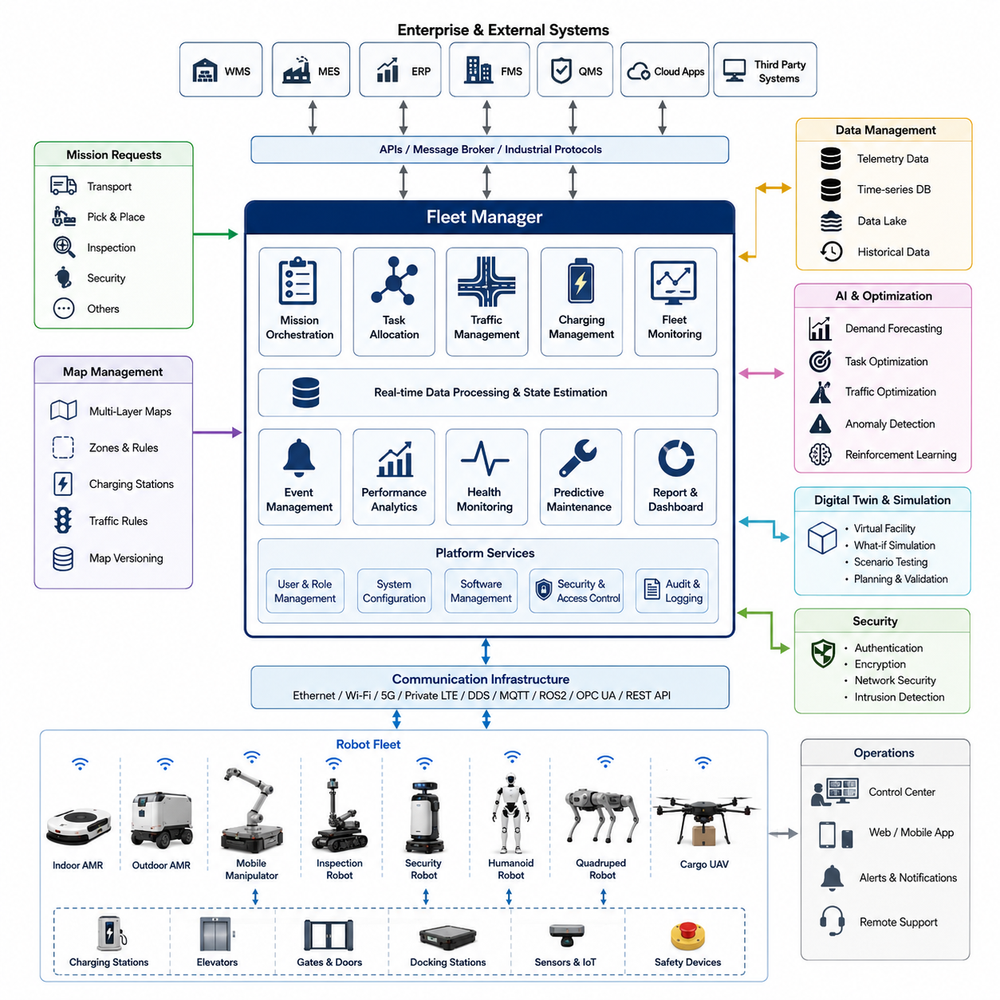
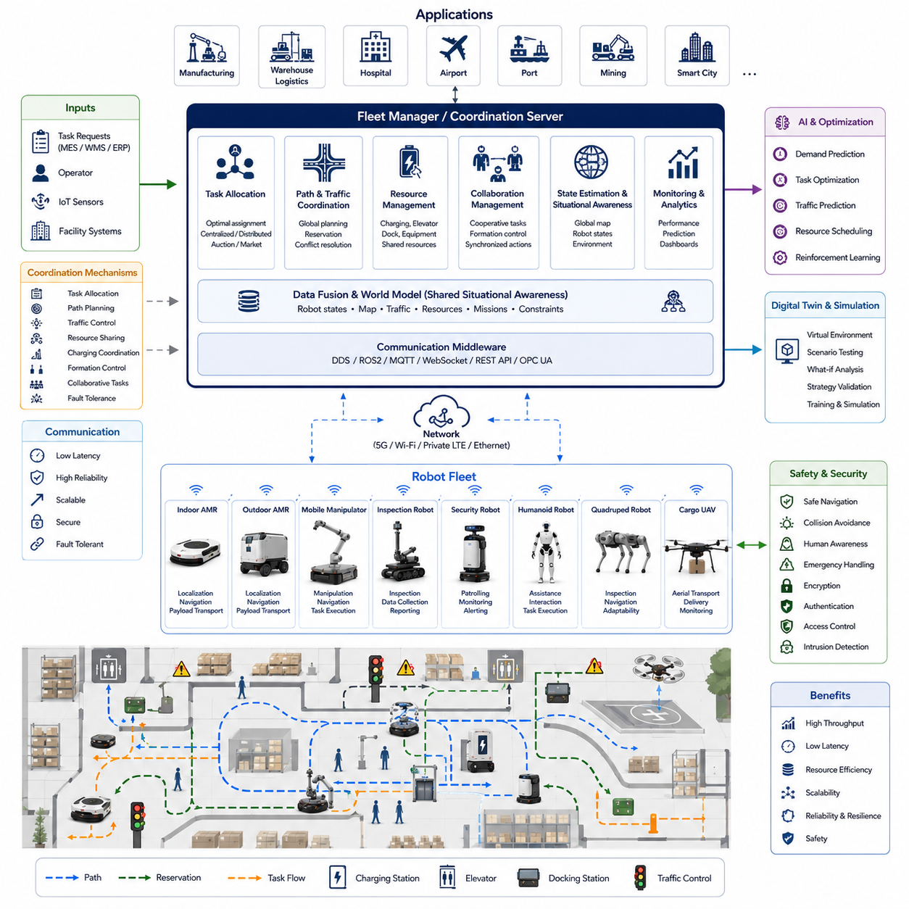
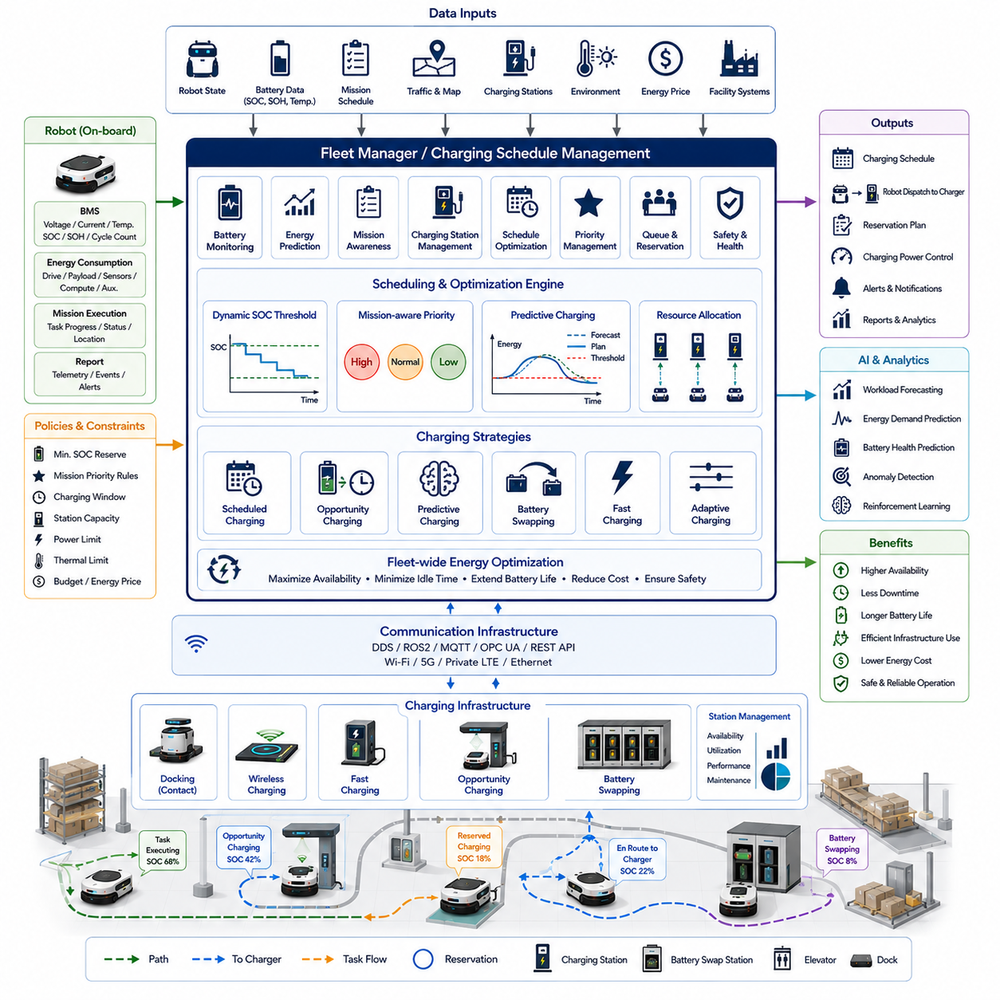
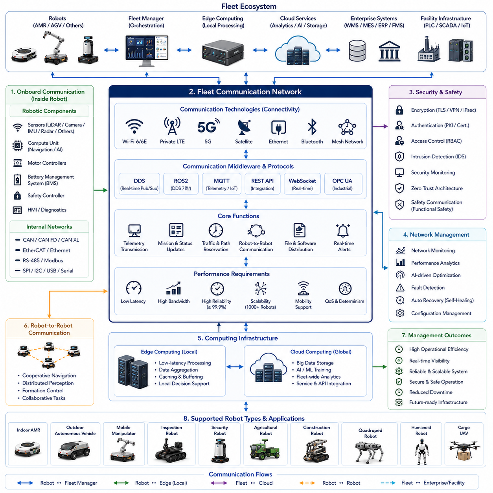
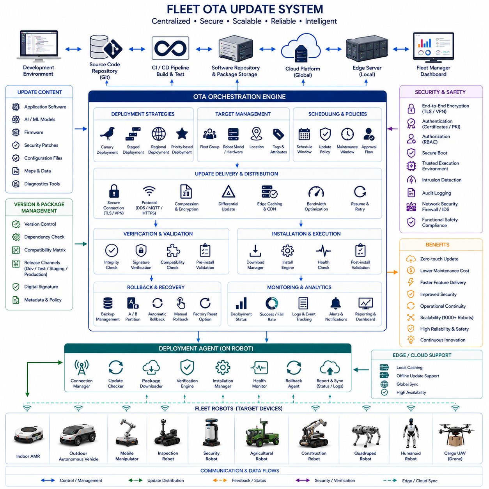

**Volume 13 AMR Electrical Architecture**

# Chapter 3. Fleet AMR

## 3.1 Fleet Manager Architecture

{width="7.268055555555556in" height="7.268055555555556in"}

Fleet Manager Architecture is the foundational control and coordination framework that enables multiple Autonomous Mobile Robots (AMRs) to operate as a unified intelligent transportation system rather than as isolated autonomous machines. As AMR deployments expand from a few robots to dozens, hundreds, or even thousands of units across factories, warehouses, logistics hubs, airports, hospitals, smart cities, and industrial campuses, the complexity of coordinating robot activities increases dramatically. The Fleet Manager serves as the central intelligence layer that supervises mission allocation, traffic control, charging management, resource utilization, performance monitoring, software deployment, security management, and operational optimization. In modern AMR ecosystems, the Fleet Manager functions as the equivalent of an air traffic control center for autonomous robots, ensuring that every robot contributes efficiently to overall operational objectives while maintaining safety, reliability, and scalability. The Fleet Manager Architecture forms the core infrastructure of Fleet AMR systems and provides the backbone for large-scale autonomous operations.

The architecture typically follows a hierarchical design model consisting of robot-level controllers, edge management systems, fleet coordination services, enterprise integration layers, and cloud-based analytics platforms. At the lowest level, each robot executes local navigation, obstacle avoidance, sensor fusion, localization, and motion control. These capabilities enable the robot to operate independently even if communication with the fleet server is temporarily interrupted. Above the robot layer resides the Fleet Manager, which maintains global awareness of all robot states, task assignments, environmental conditions, charging infrastructure, traffic flows, and operational priorities. The Fleet Manager continuously receives telemetry data from robots and generates optimized decisions that maximize overall fleet efficiency. This hierarchical approach balances local autonomy with centralized optimization and represents one of the most widely adopted architectures in industrial robotics.

A key function of Fleet Manager Architecture is mission orchestration. In large-scale deployments, transportation requests are generated continuously by manufacturing execution systems, warehouse management systems, enterprise resource planning systems, hospital logistics platforms, or custom operational software. These requests must be translated into executable robot missions. The Fleet Manager receives mission requests through APIs, message brokers, industrial protocols, or cloud interfaces. It analyzes task requirements, determines suitable robots, calculates priorities, and dispatches assignments accordingly. Mission orchestration engines evaluate robot location, battery state, current workload, travel distance, payload capacity, sensor configuration, operational restrictions, and maintenance status before assigning tasks. Through intelligent scheduling algorithms, the Fleet Manager minimizes idle time while maximizing throughput and resource utilization.

Task allocation mechanisms form one of the most sophisticated subsystems within the Fleet Manager. In simple deployments, task allocation may follow first-available assignment rules. However, large fleets require advanced optimization techniques. Market-based scheduling, auction-based allocation, Hungarian algorithms, mixed-integer optimization, reinforcement learning strategies, and predictive workload balancing can be employed to determine the most efficient robot-task pairing. These algorithms continuously adapt to changing operational conditions and support dynamic mission reassignment when unexpected events occur. Efficient task allocation directly impacts operational productivity and can significantly reduce travel distance, energy consumption, and mission completion times.

Traffic management is another critical responsibility of Fleet Manager Architecture. When multiple robots share common pathways, intersections, elevators, corridors, loading docks, or narrow aisles, traffic conflicts become inevitable. Without centralized coordination, robots may experience deadlocks, congestion, inefficient rerouting, or unsafe interactions. Fleet Managers maintain a global map of robot positions and planned trajectories. Reservation-based path planning mechanisms allocate path segments and intersection access rights. Virtual traffic lights, right-of-way policies, dynamic routing algorithms, and congestion prediction models enable smooth traffic flow across the facility. Advanced implementations use graph-based navigation frameworks and real-time occupancy maps to continuously optimize robot movements while minimizing delays.

Map management represents a fundamental architectural component. The Fleet Manager maintains one or more digital representations of operational environments. These maps contain navigation routes, restricted zones, charging stations, docking locations, safety boundaries, operational areas, speed limits, elevator interfaces, and traffic rules. As facilities evolve over time, maps must be updated without disrupting ongoing operations. Modern Fleet Manager systems support version-controlled maps, incremental updates, remote distribution, and multi-map environments. Large industrial campuses may require dozens of interconnected maps covering multiple buildings, floors, warehouses, and outdoor transportation corridors. Centralized map management ensures consistency across the entire fleet and simplifies deployment of environmental changes.

Battery management and charging coordination become increasingly important as fleet size grows. Without intelligent charging strategies, large numbers of robots may simultaneously seek charging resources, resulting in bottlenecks and reduced operational efficiency. Fleet Manager Architecture incorporates charging optimization engines that monitor battery health, state of charge, mission requirements, charging station availability, and future workload forecasts. Charging schedules are dynamically adjusted to prevent charging congestion while ensuring uninterrupted operation. Opportunity charging, predictive charging, battery swapping coordination, and energy-aware mission scheduling are often integrated into fleet management systems. These capabilities maximize fleet availability and extend battery lifespan.

Communication infrastructure forms the nervous system of the Fleet Manager Architecture. Reliable communication channels enable continuous information exchange between robots, edge servers, and cloud services. Various communication technologies may be employed, including Ethernet, Wi-Fi, private LTE, 5G, DDS, MQTT, REST APIs, WebSocket connections, OPC UA interfaces, and ROS2 communication frameworks. Communication architecture must address latency, bandwidth limitations, reliability requirements, cybersecurity concerns, and scalability constraints. Message prioritization mechanisms ensure that safety-critical information receives higher transmission priority than routine telemetry or diagnostic data. Robust communication design is essential for maintaining operational continuity in large-scale deployments.

Real-time monitoring capabilities provide operators with comprehensive visibility into fleet operations. Fleet dashboards display robot locations, mission status, battery conditions, sensor health, communication quality, utilization metrics, traffic conditions, and system alarms. Modern visualization systems incorporate interactive maps, digital twins, three-dimensional facility models, and analytics dashboards. Operators can monitor fleet activities from centralized control rooms, mobile devices, or web-based interfaces. Real-time visibility enables rapid identification of operational issues and supports informed decision-making during abnormal situations.

Event management systems handle the continuous stream of operational events generated by robots and infrastructure components. These events include mission completions, obstacle detections, emergency stops, communication failures, localization errors, charging requests, maintenance alerts, safety incidents, and performance anomalies. Fleet Managers classify, prioritize, correlate, and distribute events according to predefined workflows. Intelligent event processing reduces operator workload by filtering redundant notifications and highlighting critical issues requiring immediate attention. Event-driven architectures also facilitate integration with external monitoring systems and enterprise software platforms.

Scalability is a primary design objective in Fleet Manager Architecture. Small facilities may operate fewer than ten robots, while large logistics centers can deploy several hundred robots simultaneously. The architecture must support seamless growth without significant redesign. Microservice-based architectures are increasingly adopted because they allow independent scaling of mission management, traffic control, telemetry processing, analytics, and database services. Containerization technologies, orchestration platforms, and distributed databases enable horizontal scaling and high availability. As robot populations expand, computational resources can be dynamically allocated to maintain consistent performance.

Reliability and fault tolerance are essential requirements for industrial fleet management systems. Hardware failures, software bugs, network interruptions, and infrastructure outages must not disrupt critical operations. Redundant servers, failover mechanisms, database replication, backup communication channels, and distributed processing architectures enhance system resilience. Fleet Managers continuously monitor their own health and automatically recover from component failures whenever possible. High-availability deployments often achieve operational uptime targets exceeding 99.9%, ensuring reliable support for mission-critical industrial environments.

Cybersecurity plays an increasingly significant role in Fleet Manager Architecture. Because Fleet Managers connect robots, enterprise systems, cloud platforms, and operational technology networks, they represent a high-value target for cyber threats. Security mechanisms include mutual authentication, certificate-based identity management, encrypted communication channels, role-based access control, secure software updates, intrusion detection systems, audit logging, and security monitoring. Zero-trust security principles are increasingly adopted to protect autonomous robotic infrastructures against unauthorized access and malicious attacks.

Data management constitutes another major architectural domain. Every robot continuously generates operational data including sensor measurements, navigation information, mission histories, battery statistics, diagnostics, environmental observations, and performance metrics. Fleet Managers aggregate, store, process, and analyze this data to support operational optimization. Time-series databases, relational databases, data lakes, and analytics platforms are commonly employed to manage large-scale fleet data. Historical datasets provide valuable insights for maintenance planning, workflow optimization, infrastructure improvements, and machine learning development.

Artificial Intelligence is becoming deeply integrated into modern Fleet Manager systems. Machine learning models can predict mission demand, forecast battery degradation, detect anomalies, optimize traffic flow, improve scheduling efficiency, and anticipate maintenance requirements. Reinforcement learning approaches enable adaptive decision-making in complex operational environments. Predictive analytics help organizations identify emerging bottlenecks before they impact productivity. As Physical AI technologies mature, Fleet Managers increasingly evolve from reactive control systems into proactive operational intelligence platforms capable of autonomous optimization.

Digital Twin integration represents a significant advancement in fleet management technology. Digital Twins provide virtual representations of robots, facilities, infrastructure assets, and operational workflows. Fleet Managers synchronize real-world robot states with digital models in real time, enabling simulation, predictive analysis, operational planning, and what-if scenario evaluation. Digital Twin environments support testing of new routing strategies, facility modifications, robot deployments, and workflow changes without affecting live operations. This capability significantly reduces operational risk and accelerates system optimization.

Enterprise integration enables Fleet Managers to function as part of broader industrial ecosystems. Connections to Warehouse Management Systems, Manufacturing Execution Systems, Enterprise Resource Planning platforms, Facility Management Systems, Quality Control Systems, and Business Intelligence tools allow robotic operations to align with organizational objectives. Standardized APIs, industrial middleware platforms, and service-oriented architectures facilitate seamless data exchange across diverse software environments. Enterprise integration transforms autonomous robots from isolated automation tools into fully integrated operational assets.

Cloud and edge computing architectures further enhance Fleet Manager capabilities. Edge computing platforms provide low-latency processing close to operational environments, while cloud infrastructure supports large-scale analytics, long-term storage, machine learning training, and multi-site coordination. Hybrid cloud-edge architectures combine the advantages of both approaches. Time-critical functions remain at the edge to ensure deterministic performance, while computationally intensive analytics leverage cloud resources. This architecture supports scalability, resilience, and advanced intelligence capabilities across geographically distributed robotic fleets.

Future Fleet Manager Architectures will increasingly support heterogeneous robotic ecosystems consisting of indoor AMRs, outdoor autonomous vehicles, mobile manipulators, inspection robots, security robots, humanoids, quadrupeds, and cargo UAVs operating within a unified management framework. Rather than managing a single robot type, future fleet systems will coordinate diverse autonomous assets across complex operational environments. AI-driven orchestration, digital twin integration, predictive optimization, autonomous decision-making, and Physical AI coordination will become standard capabilities. Fleet Managers will evolve from simple mission dispatching platforms into intelligent autonomous operation centers that manage entire robotic enterprises. Within the Hills Robotics Mobility and Physical AI Engineering Library, Fleet Manager Architecture serves as the foundational framework upon which all large-scale multi-robot systems are built, enabling efficient, safe, scalable, and intelligent autonomous operations across future industrial and commercial environments.

## 3.2 Multi Robot Coordination

{width="7.268055555555556in" height="7.268055555555556in"}

Multi-Robot Coordination is the fundamental discipline that enables multiple Autonomous Mobile Robots (AMRs) to work together as a unified intelligent system rather than as independent autonomous machines. As industrial automation environments continue to evolve toward larger facilities, higher throughput requirements, and increasingly complex workflows, the ability for robots to cooperate efficiently becomes one of the most important factors determining overall system performance. In modern factories, warehouses, logistics centers, hospitals, airports, ports, mining operations, smart cities, and outdoor autonomous transportation networks, dozens or even hundreds of robots may operate simultaneously within the same environment. Without effective coordination mechanisms, these robots would compete for resources, create traffic congestion, generate operational inefficiencies, and potentially introduce safety risks. Multi-Robot Coordination provides the architectural framework, communication infrastructure, decision-making mechanisms, and optimization strategies required to transform a collection of autonomous robots into a coordinated robotic workforce.

The primary objective of Multi-Robot Coordination is to maximize overall system efficiency while ensuring safety, scalability, reliability, and operational flexibility. Unlike single-robot systems where decision-making is localized to one autonomous platform, multi-robot systems must consider interactions among all robots operating within the environment. Every robot movement, task assignment, path selection, charging decision, and resource allocation may influence the behavior of other robots. Consequently, coordination mechanisms must continuously evaluate both local objectives and global system goals. The challenge is not simply to make individual robots intelligent, but rather to make the entire robotic ecosystem intelligent.

At the core of Multi-Robot Coordination lies the concept of shared situational awareness. Every robot possesses its own local perception capabilities, including sensors such as LiDAR, cameras, radar, ultrasonic sensors, IMUs, GNSS receivers, depth cameras, and environmental monitoring devices. While local perception allows robots to understand their immediate surroundings, coordination requires a broader understanding of the entire operational environment. Shared situational awareness enables robots and fleet management systems to maintain a common representation of robot locations, mission states, environmental conditions, traffic patterns, resource availability, and operational constraints. This shared understanding forms the foundation upon which cooperative behaviors are built.

Communication plays a central role in enabling coordinated robotic operations. Multi-robot systems depend on continuous information exchange among robots, fleet managers, edge servers, cloud platforms, and facility infrastructure. Communication technologies such as DDS, ROS2 middleware, MQTT, WebSocket, REST APIs, OPC UA, Ethernet, Wi-Fi, private LTE, and 5G networks provide the channels through which coordination information is distributed. The communication architecture must support low latency, high reliability, fault tolerance, cybersecurity, and scalability. In large deployments, thousands of messages may be exchanged every second, including position updates, task assignments, path reservations, status reports, traffic notifications, charging requests, and safety alerts.

Task allocation represents one of the most important coordination mechanisms within a multi-robot system. As operational requests arrive from manufacturing execution systems, warehouse management systems, enterprise resource planning platforms, or human operators, tasks must be assigned to appropriate robots. The objective is to achieve the highest possible productivity while minimizing travel distance, energy consumption, task completion time, and resource conflicts. Various task allocation methodologies can be applied depending on system complexity and operational requirements.

Centralized task allocation relies on a Fleet Manager that maintains global knowledge of all robots and assigns tasks accordingly. This approach often produces globally optimized solutions because the Fleet Manager can evaluate the entire system before making decisions. However, centralized approaches may introduce computational bottlenecks and single points of failure in very large deployments.

Distributed task allocation allows robots to participate directly in the decision-making process. Robots negotiate task ownership through communication protocols and local decision-making algorithms. Market-based allocation systems, auction mechanisms, contract-net protocols, and consensus algorithms enable robots to dynamically distribute workloads among themselves. Distributed approaches improve scalability and resilience while reducing dependency on centralized infrastructure.

Path planning coordination is another critical aspect of multi-robot operation. In environments where multiple robots share transportation routes, traffic conflicts become inevitable. Without coordination, robots may block one another, create deadlocks, or generate unsafe conditions. Multi-Robot Coordination systems continuously monitor robot trajectories and ensure conflict-free navigation. Global path planning algorithms evaluate the movement plans of all robots and adjust routes when necessary. Reservation-based navigation systems allocate path segments, intersections, elevators, and docking stations to specific robots during designated time windows. By coordinating movement at the system level, overall traffic efficiency can be significantly improved.

Traffic management becomes increasingly complex as fleet size increases. Small facilities with a few robots may operate effectively using simple collision avoidance mechanisms. However, large industrial environments containing dozens or hundreds of robots require advanced traffic coordination strategies. Dynamic traffic control systems continuously monitor robot density, congestion levels, bottlenecks, and route utilization. Adaptive routing algorithms automatically redirect robots around congested areas while maintaining mission objectives. Virtual traffic signals, one-way pathways, priority lanes, and intersection control mechanisms further improve traffic flow and reduce delays.

Resource sharing represents another major challenge in multi-robot environments. Robots frequently compete for limited resources such as charging stations, elevators, loading docks, inspection equipment, maintenance facilities, docking stations, and narrow transportation corridors. Multi-Robot Coordination systems manage access to these shared resources through reservation mechanisms, scheduling algorithms, and priority management policies. Effective resource coordination ensures fair utilization while minimizing waiting times and maximizing overall productivity.

Charging coordination becomes particularly important in large robotic fleets. As battery-powered robots perform transportation, inspection, security, cleaning, and logistics tasks, battery energy becomes a shared operational resource. If numerous robots attempt to charge simultaneously, charging infrastructure may become overloaded. Multi-Robot Coordination systems continuously monitor battery levels, mission requirements, charging station availability, and projected workload demands. Charging schedules are optimized to prevent congestion while ensuring that sufficient robot capacity remains available to support operational objectives.

Collaborative task execution represents one of the most advanced forms of multi-robot coordination. Certain applications require multiple robots to work together on a single mission. Examples include transportation of oversized payloads, coordinated inspection operations, synchronized surveillance activities, distributed mapping missions, construction automation, warehouse inventory scanning, and autonomous material handling. Collaborative missions require precise synchronization of robot actions, shared mission planning, coordinated motion control, and continuous communication. The successful execution of collaborative tasks demonstrates the true power of coordinated robotic systems.

Formation control is frequently employed in applications involving cooperative movement. Multiple robots travel together while maintaining predefined geometric relationships. Formation control is widely used in autonomous vehicle convoys, security patrols, agricultural operations, military robotics, mining automation, and cargo transportation systems. Maintaining stable formations requires continuous adjustment of speed, heading, spacing, and trajectory based on real-time environmental conditions. Advanced formation control algorithms allow groups of robots to behave as a cohesive unit while remaining adaptable to dynamic environments.

Distributed mapping and localization provide another example of cooperative intelligence. Rather than having each robot independently construct maps of the environment, multiple robots can collectively contribute to a shared mapping framework. Sensor observations collected by individual robots are merged into a unified environmental model. This approach accelerates map creation, improves environmental coverage, and enhances localization accuracy. In large facilities, distributed mapping significantly reduces deployment time while increasing operational robustness.

Fault tolerance is an essential requirement within Multi-Robot Coordination Architecture. Industrial environments demand continuous operation even when individual robots experience failures. Coordinated systems must detect malfunctioning robots, isolate failures, redistribute tasks, and adapt operational plans accordingly. Redundant task assignment strategies ensure that mission completion remains possible despite equipment failures. By leveraging collective intelligence, multi-robot systems often exhibit greater resilience than single-robot solutions.

Scalability is a primary architectural consideration. Coordination strategies that function effectively with five robots may become impractical when scaled to hundreds or thousands of units. Communication overhead, computational complexity, decision latency, and resource contention increase dramatically as fleet size grows. Scalable architectures utilize hierarchical coordination models, distributed processing frameworks, edge computing infrastructure, and microservice-based fleet management platforms to maintain performance at large scales. The ability to scale efficiently is critical for future autonomous logistics and industrial automation systems.

Artificial Intelligence is becoming increasingly important within Multi-Robot Coordination systems. Machine learning models can predict traffic congestion, optimize task allocation, forecast battery usage, identify operational bottlenecks, and improve resource utilization. Reinforcement learning algorithms allow robotic fleets to learn coordination strategies through experience. Multi-agent reinforcement learning enables robots to develop cooperative behaviors that maximize collective performance rather than individual efficiency. These AI-driven coordination mechanisms continuously improve system performance over time.

Digital Twin technologies further enhance coordination capabilities. A Digital Twin provides a virtual representation of the robotic fleet, operational environment, facility infrastructure, and ongoing missions. Coordination algorithms can be tested within the digital environment before deployment in real operations. Simulation-based validation allows operators to evaluate new traffic rules, resource allocation strategies, fleet expansion plans, and workflow modifications without disrupting production. Digital Twins significantly reduce operational risk while accelerating continuous improvement initiatives.

Cybersecurity considerations become increasingly important as robotic fleets become more interconnected. Multi-Robot Coordination systems rely heavily on communication networks and shared decision-making frameworks. Unauthorized access, malicious data injection, communication spoofing, denial-of-service attacks, and software manipulation could compromise coordination effectiveness. Secure communication protocols, encryption mechanisms, identity management systems, intrusion detection platforms, and zero-trust architectures are essential components of modern coordination frameworks.

Human-robot coordination represents another emerging dimension of multi-robot operations. Industrial facilities often contain both autonomous robots and human workers operating within shared environments. Coordination systems must consider human movement patterns, safety zones, collaborative workflows, and ergonomic requirements. Human-aware navigation, predictive motion planning, adaptive speed control, and safety monitoring technologies enable robots to operate efficiently while maintaining safe interactions with personnel.

The future of Multi-Robot Coordination extends beyond traditional AMR fleets. Emerging Physical AI ecosystems will include Indoor AMRs, Outdoor Autonomous Vehicles, Mobile Manipulators, Security Robots, Inspection Robots, Agricultural Robots, Construction Robots, Quadrupeds, Humanoids, and Cargo UAVs operating simultaneously within integrated operational environments. Coordination platforms will evolve from simple traffic management systems into intelligent autonomous orchestration frameworks capable of managing heterogeneous robotic ecosystems. These systems will leverage AI, Digital Twins, cloud-edge computing, predictive analytics, distributed intelligence, and real-time optimization to achieve unprecedented levels of operational efficiency.

Within the Hills Robotics Mobility and Physical AI Engineering Library, Multi-Robot Coordination serves as one of the most critical enabling technologies for future autonomous operations. It bridges the gap between individual robot autonomy and enterprise-scale robotic intelligence. By enabling robots to cooperate, communicate, share resources, synchronize actions, and optimize collective performance, Multi-Robot Coordination establishes the foundation upon which future smart factories, autonomous logistics networks, intelligent infrastructure systems, and Physical AI ecosystems will be built. As robotic deployments continue to expand across industries, effective coordination will become the defining factor that determines whether autonomous systems operate merely as collections of robots or as truly intelligent robotic organizations.

## 3.3 Charging Schedule Management

{width="7.268055555555556in" height="7.268055555555556in"}

Charging Schedule Management is one of the most critical operational functions within a modern Autonomous Mobile Robot (AMR) fleet. As robotic deployments scale from a few units to dozens, hundreds, or even thousands of robots operating simultaneously, battery energy becomes a shared and limited resource that must be managed with the same level of intelligence as tasks, traffic, and computational resources. In large-scale industrial environments, charging infrastructure often represents a significant investment and is typically limited in quantity compared to the number of robots in operation. Without effective charging coordination, robots may experience unnecessary downtime, charging station congestion, mission interruptions, reduced battery lifespan, and overall reductions in fleet productivity. Charging Schedule Management provides the strategic and operational framework required to ensure that energy resources are utilized efficiently while maintaining continuous fleet availability.

Within a Fleet AMR Architecture, charging management extends far beyond simply directing robots to charging stations when battery levels become low. Modern charging systems continuously analyze robot energy consumption patterns, mission schedules, traffic conditions, charging station occupancy, battery health, environmental factors, operational priorities, and future workload forecasts. The objective is to transform charging operations from a reactive process into a proactive and predictive energy management system. Rather than waiting until a robot reaches a critical battery threshold, intelligent charging systems anticipate future energy requirements and coordinate charging activities to maximize operational efficiency.

The fundamental purpose of Charging Schedule Management is to guarantee that every robot has sufficient energy to complete assigned missions while minimizing idle time and preventing charging bottlenecks. In a small deployment containing only a few robots, charging decisions may be relatively straightforward. However, as fleet size increases, charging becomes a complex optimization problem involving numerous interconnected variables. Every charging decision influences fleet availability, task execution capability, traffic flow, battery degradation, infrastructure utilization, and overall operational performance.

A modern charging management architecture begins with continuous battery monitoring. Each robot contains a Battery Management System (BMS) responsible for measuring battery voltage, current, temperature, State of Charge (SOC), State of Health (SOH), cycle count, internal resistance, charging history, and operational status. This information is transmitted to the Fleet Manager through communication networks such as DDS, MQTT, ROS2, OPC UA, Ethernet, Wi-Fi, private LTE, or 5G infrastructure. The Fleet Manager aggregates battery information from all robots and constructs a fleet-wide energy profile that serves as the foundation for charging decisions.

State of Charge represents one of the most important parameters within charging management systems. SOC provides an estimate of the remaining energy available within a battery. Traditional charging systems often rely on fixed charging thresholds, instructing robots to recharge when SOC falls below predetermined levels such as twenty or thirty percent. While simple to implement, this approach frequently results in inefficient utilization of charging infrastructure. Advanced charging management systems employ dynamic SOC thresholds that adapt according to workload forecasts, mission priorities, traffic conditions, and charging station availability.

State of Health monitoring is equally important because battery performance changes throughout its operational lifetime. As batteries age, their capacity decreases, internal resistance increases, and charging efficiency declines. Charging Schedule Management systems continuously evaluate battery health indicators and adjust charging strategies accordingly. Batteries exhibiting signs of degradation may require modified charging profiles, reduced operational loads, or scheduled maintenance interventions. By integrating battery health information into charging decisions, organizations can maximize battery lifespan while minimizing replacement costs.

Energy consumption prediction forms another major component of Charging Schedule Management. Every mission requires a certain amount of energy depending on travel distance, payload weight, operating speed, terrain conditions, environmental temperature, sensor usage, computational workload, and mission duration. Predictive energy models estimate future battery consumption based on planned activities. These predictions allow charging systems to determine whether a robot can safely complete assigned missions before requiring recharging. Accurate energy forecasting reduces operational risk and prevents unexpected mission interruptions caused by insufficient battery reserves.

Mission-aware charging represents an advanced scheduling strategy widely adopted in modern fleet management systems. Rather than treating all robots equally, mission-aware charging prioritizes robots according to operational importance. Robots assigned to high-priority transportation tasks, emergency response missions, inspection operations, healthcare logistics, security patrols, or production-critical activities may receive preferential access to charging infrastructure. Less critical robots can defer charging until system demand decreases. This prioritization mechanism ensures that essential operational capabilities remain available during periods of limited charging capacity.

Charging station management is another essential element of the architecture. Industrial facilities may contain multiple charging stations distributed throughout operational environments. These charging stations may support various charging technologies, including contact-based charging, conductive docking, wireless charging, automated battery swapping, opportunity charging stations, and high-power fast charging systems. Charging Schedule Management continuously monitors station availability, utilization rates, charging performance, maintenance status, and queue lengths. Real-time visibility into charging infrastructure enables optimized scheduling decisions that balance charging demand across available resources.

Queue management becomes increasingly important as fleet size grows. When multiple robots simultaneously require charging, competition for charging resources can create operational bottlenecks. Intelligent scheduling algorithms prevent excessive queue formation by coordinating charging requests across the entire fleet. Reservation systems allow robots to secure charging slots before arrival, reducing waiting times and improving charging station utilization. Dynamic rescheduling mechanisms continuously adjust reservations in response to changing operational conditions.

Opportunity charging represents a highly effective strategy for improving fleet productivity. Rather than waiting until batteries reach low charge levels, robots perform short charging sessions whenever opportunities arise during normal operations. For example, a robot waiting for task assignments, loading operations, elevator access, or transportation requests may temporarily utilize nearby charging infrastructure. These brief charging intervals accumulate throughout the day and significantly reduce the need for lengthy charging sessions. Opportunity charging is particularly effective in environments with predictable workflows and distributed charging infrastructure.

Predictive charging extends this concept by leveraging artificial intelligence and operational forecasting. Machine learning algorithms analyze historical mission data, traffic patterns, workload fluctuations, battery behavior, environmental conditions, and facility schedules to anticipate future energy requirements. The charging system proactively schedules charging activities before battery shortages occur. Predictive charging reduces operational disruptions while maximizing fleet readiness. As AI technologies continue to mature, predictive charging systems are becoming increasingly sophisticated and capable of autonomous decision-making.

Battery swapping introduces an alternative approach to energy replenishment. Instead of recharging batteries within robots, depleted batteries are automatically replaced with fully charged units. Battery swapping significantly reduces robot downtime because exchange operations typically require only a few minutes. Charging Schedule Management systems coordinate battery inventory, charging cycles, swap station utilization, battery health tracking, and inventory forecasting. This approach is particularly attractive in high-throughput logistics facilities where operational continuity is a critical requirement.

Fast charging technologies further influence charging management strategies. High-power charging systems reduce charging durations but may accelerate battery degradation if used excessively. Charging Schedule Management systems must balance operational efficiency against long-term battery health considerations. Intelligent charging profiles adjust charging power according to battery condition, temperature, operational urgency, and expected future workload. Adaptive charging strategies maximize both productivity and battery longevity.

Thermal management plays a significant role in charging operations. Battery charging generates heat, and excessive temperatures can negatively impact battery safety, performance, and lifespan. Charging management systems continuously monitor battery temperature and environmental conditions during charging sessions. Thermal constraints may influence charging rates, charging schedules, cooling requirements, and operational availability. Advanced charging infrastructure often incorporates active cooling systems, thermal monitoring sensors, and predictive thermal models to ensure safe operation.

Fleet-wide energy optimization represents a higher-level objective within Charging Schedule Management. Rather than focusing solely on individual robots, modern systems optimize energy utilization across the entire fleet. This involves balancing energy consumption, charging demand, mission allocation, traffic management, and infrastructure utilization. Fleet-wide optimization algorithms continuously seek the most efficient allocation of energy resources while maintaining operational objectives. The result is improved throughput, reduced energy costs, and enhanced system reliability.

Energy-aware task allocation demonstrates the close relationship between charging management and mission scheduling. When assigning tasks, Fleet Managers consider not only robot location and workload but also available battery energy. Robots with low battery reserves may receive shorter missions or be directed toward nearby charging infrastructure. Robots with abundant energy reserves may receive longer or more demanding assignments. This integration between energy management and task allocation improves overall fleet efficiency and reduces unnecessary charging events.

Time-of-use energy pricing introduces additional complexity in certain deployments. Industrial facilities may experience varying electricity costs throughout the day. Charging Schedule Management systems can leverage these pricing structures by scheduling charging activities during low-cost periods whenever operational constraints permit. Smart charging strategies reduce energy expenses while maintaining fleet readiness. In facilities utilizing renewable energy sources such as solar power or wind generation, charging schedules may also align with periods of peak energy production.

Cloud and edge computing architectures significantly enhance charging management capabilities. Edge computing platforms provide low-latency decision-making close to operational environments, enabling rapid responses to changing conditions. Cloud platforms support large-scale analytics, machine learning model training, historical data storage, and enterprise-level optimization. Hybrid cloud-edge architectures combine the strengths of both approaches, creating highly scalable and intelligent charging ecosystems.

Digital Twin technologies provide powerful tools for charging infrastructure planning and optimization. Digital Twins create virtual representations of robots, batteries, charging stations, facility layouts, and operational workflows. Engineers can simulate charging strategies, evaluate infrastructure capacity, predict bottlenecks, and validate optimization algorithms before deploying changes to live operations. Simulation-driven charging management significantly reduces operational risk and accelerates continuous improvement efforts.

Cybersecurity considerations are increasingly important as charging systems become more connected and automated. Charging infrastructure represents a critical operational asset and may become a target for cyber attacks. Secure communication channels, authentication mechanisms, access control systems, encrypted data transmission, intrusion detection platforms, and cybersecurity monitoring are essential components of modern charging management architectures. Protecting charging infrastructure ensures operational continuity and prevents malicious disruptions.

The emergence of Physical AI systems further expands the scope of Charging Schedule Management. Future robotic ecosystems will include Indoor AMRs, Outdoor Autonomous Vehicles, Mobile Manipulators, Inspection Robots, Security Robots, Humanoids, Quadrupeds, and Cargo UAVs operating within shared energy infrastructures. Charging management platforms must evolve to support heterogeneous robotic fleets with diverse battery technologies, charging requirements, operational profiles, and mission characteristics. Unified charging architectures capable of coordinating energy resources across multiple robotic domains will become increasingly important.

Artificial Intelligence will continue to transform charging operations over the coming decade. Reinforcement learning, predictive analytics, autonomous optimization, adaptive scheduling, and self-learning energy management systems will enable fleets to continuously improve charging efficiency without human intervention. Future charging systems will not merely respond to energy demands but will actively anticipate operational requirements and optimize energy utilization at the fleet level.

Within the Fleet AMR Architecture, Charging Schedule Management serves as a strategic operational capability that directly influences productivity, availability, reliability, sustainability, and economic performance. It transforms battery charging from a simple maintenance activity into a sophisticated energy orchestration system that supports large-scale autonomous operations. As robotic deployments continue to expand across industrial, commercial, logistics, healthcare, infrastructure, and Physical AI environments, Charging Schedule Management will become one of the most important enabling technologies for achieving truly autonomous and continuously operating robotic ecosystems.

## 3.4 Fleet Communication Network

{width="7.268055555555556in" height="7.268055555555556in"}

Fleet Communication Network is the foundational communication infrastructure that enables all components of a robotic fleet ecosystem to exchange information reliably, securely, and in real time. In modern Autonomous Mobile Robot (AMR) deployments, communication is no longer a supporting function but a mission-critical operational capability. As robotic fleets expand from a handful of vehicles to hundreds or thousands of autonomous systems operating simultaneously across factories, warehouses, hospitals, airports, ports, mining sites, smart cities, and outdoor logistics networks, the complexity and importance of communication infrastructure increase dramatically. Every mission assignment, navigation update, battery status report, traffic reservation, software update, safety notification, and operational decision depends on the continuous exchange of data across the fleet. The Fleet Communication Network serves as the digital nervous system that connects robots, fleet managers, edge computing platforms, cloud services, enterprise systems, and facility infrastructure into a unified operational environment.

The primary objective of a Fleet Communication Network is to provide deterministic, scalable, secure, and resilient communication between all participating entities within the robotic ecosystem. Unlike traditional industrial networks that primarily support fixed automation equipment, robotic communication networks must accommodate highly mobile autonomous platforms operating in dynamic and unpredictable environments. Robots continuously change locations, network conditions fluctuate, environmental obstacles affect wireless connectivity, and operational priorities shift in real time. The communication architecture must therefore be designed to support mobility, adaptability, fault tolerance, and continuous operation under changing conditions.

At the lowest level of the architecture, communication begins within the robot itself. Modern AMRs contain dozens of interconnected electronic subsystems including motor controllers, battery management systems, safety controllers, perception sensors, navigation computers, AI accelerators, human-machine interfaces, and diagnostic modules. These components communicate through internal networks such as CAN, CAN FD, CAN XL, RS-485, Modbus, EtherCAT, Ethernet, SPI, I2C, USB, and serial communication buses. The internal communication architecture ensures that sensor data, control commands, safety signals, and diagnostic information are exchanged with low latency and high reliability.

Above the onboard communication layer resides the robot-to-fleet communication infrastructure. This layer enables robots to exchange information with Fleet Managers, edge servers, operational databases, cloud services, and other robots. Robot-to-fleet communication is responsible for transmitting telemetry data, localization updates, mission status reports, battery information, obstacle detections, maintenance alerts, and environmental observations. The efficiency of this communication layer directly impacts overall fleet performance and operational visibility.

Wireless communication technologies form the backbone of most Fleet Communication Networks. Wi-Fi remains one of the most widely deployed communication technologies in indoor industrial environments due to its relatively low cost, mature ecosystem, and high bandwidth capabilities. Modern Wi-Fi 6 and Wi-Fi 6E networks provide significantly improved throughput, lower latency, enhanced roaming performance, and better support for high-density robotic deployments. Warehouses, manufacturing facilities, hospitals, and distribution centers commonly rely on enterprise-grade Wi-Fi infrastructure to support robotic communication.

Private LTE networks provide an alternative communication solution for environments requiring larger coverage areas, improved mobility support, and enhanced reliability. Private LTE systems offer predictable performance, stronger interference resistance, and better support for mobile autonomous vehicles operating across large industrial campuses. Unlike public cellular networks, private LTE infrastructure remains under organizational control, allowing optimization for specific robotic applications.

The emergence of 5G technology introduces new possibilities for robotic communication. Ultra-Reliable Low-Latency Communication (URLLC), enhanced Mobile Broadband (eMBB), and massive Machine-Type Communication (mMTC) capabilities make 5G particularly attractive for large-scale robotic deployments. 5G networks can support thousands of simultaneously connected devices while maintaining low communication latency and high reliability. Applications such as remote teleoperation, distributed AI inference, real-time video streaming, cooperative perception, and large-scale autonomous vehicle coordination benefit significantly from advanced 5G capabilities.

Communication middleware plays a central role in abstracting underlying network technologies and enabling application-level interoperability. Within modern robotic systems, Data Distribution Service (DDS) has become one of the most important middleware technologies. DDS provides a publish-subscribe communication model that supports real-time data distribution, quality-of-service management, scalability, and fault tolerance. ROS2 utilizes DDS as its underlying communication framework, making DDS a fundamental component of many advanced robotic architectures.

MQTT represents another widely used communication protocol within Fleet Communication Networks. MQTT is particularly effective for telemetry transmission, event notification, IoT integration, and cloud communication due to its lightweight design and efficient bandwidth utilization. Fleet Managers often use MQTT brokers to aggregate telemetry data from large numbers of robots and distribute operational information throughout the system.

REST APIs provide standardized interfaces for integration with enterprise software platforms, cloud services, dashboards, reporting systems, and third-party applications. REST-based communication supports interoperability between robotic systems and external business applications such as Warehouse Management Systems, Manufacturing Execution Systems, Enterprise Resource Planning platforms, and Facility Management Systems. While REST communication is generally not suitable for hard real-time applications, it remains highly effective for transactional data exchange and system integration.

WebSocket communication enables persistent bidirectional communication channels between clients and servers. Fleet monitoring dashboards, operational control interfaces, digital twin platforms, and real-time visualization systems frequently utilize WebSocket technology to provide low-latency updates without requiring repeated polling requests. This approach improves responsiveness and reduces communication overhead.

OPC UA has emerged as a key communication technology for industrial interoperability. OPC UA enables secure and standardized communication between robotic fleets and industrial automation systems. Integration with PLCs, SCADA systems, production equipment, energy management systems, and facility infrastructure is often achieved through OPC UA interfaces. As Industry 4.0 initiatives continue to expand, OPC UA becomes increasingly important within robotic communication architectures.

Communication quality is typically evaluated using several critical performance metrics. Latency represents the time required for information to travel from source to destination. Many robotic applications require low-latency communication to support navigation updates, traffic management decisions, collision avoidance coordination, and safety notifications. High latency may result in delayed decision-making and degraded operational performance.

Bandwidth determines the volume of information that can be transmitted within a given period. Different robotic applications impose different bandwidth requirements. Telemetry data generally requires relatively low bandwidth, while video streaming, LiDAR point cloud transmission, digital twin synchronization, and distributed perception systems may require substantially greater network capacity. Fleet Communication Networks must be designed to accommodate diverse bandwidth demands without creating bottlenecks.

Reliability represents another fundamental requirement. Communication interruptions can negatively impact navigation, fleet coordination, mission execution, and operational visibility. Redundant communication paths, mesh networking, failover mechanisms, network monitoring systems, and adaptive routing strategies improve communication reliability. Mission-critical robotic environments often require communication availability exceeding 99.9 percent.

Scalability becomes increasingly important as fleet sizes expand. A communication architecture that functions effectively with ten robots may encounter significant challenges when supporting hundreds or thousands of autonomous systems. Scalable communication architectures employ distributed message brokers, hierarchical network topologies, edge computing infrastructure, load balancing mechanisms, and cloud-native services to accommodate future growth.

Cybersecurity has become one of the most critical considerations within Fleet Communication Networks. Autonomous robotic fleets exchange operationally sensitive information including location data, mission plans, production schedules, environmental observations, maintenance records, and software updates. Unauthorized access to communication infrastructure could compromise operational safety and business continuity. Consequently, communication networks incorporate encryption, authentication, certificate management, role-based access control, intrusion detection systems, security monitoring platforms, and zero-trust security architectures.

Encryption protects data confidentiality during transmission. Technologies such as TLS, VPN tunnels, IPsec, secure DDS implementations, and encrypted MQTT communication channels ensure that information remains protected from interception. Authentication mechanisms verify the identity of participating devices before communication is permitted. Certificate-based authentication and Public Key Infrastructure systems are increasingly utilized within modern robotic ecosystems.

Fleet Communication Networks must also support safety-related communication. Safety controllers, emergency stop systems, safety LiDARs, safety PLCs, and functional safety architectures exchange information that may directly influence human safety. Safety communication channels often employ specialized protocols and deterministic communication mechanisms designed to satisfy regulatory requirements and functional safety standards. Communication reliability and predictability become especially important within safety-critical applications.

Edge computing introduces a powerful architectural enhancement to fleet communication systems. Edge servers positioned near operational environments provide localized data processing, communication aggregation, caching services, and low-latency decision support. Rather than transmitting all information directly to cloud platforms, edge computing infrastructure processes data locally and forwards only relevant information to higher-level systems. This reduces bandwidth consumption while improving responsiveness.

Cloud communication enables fleet-wide analytics, long-term data storage, machine learning model training, software deployment, and enterprise integration. Hybrid cloud-edge architectures combine local responsiveness with global scalability. Time-critical communication remains at the edge while computationally intensive analytics leverage cloud resources. This architecture provides both operational efficiency and scalability.

Robot-to-robot communication represents an increasingly important aspect of advanced fleet operations. Cooperative navigation, distributed perception, formation control, collaborative manipulation, and multi-robot coordination often require direct communication among robots. Vehicle-to-Vehicle communication principles originally developed for autonomous transportation systems are increasingly being adapted for robotic fleets. Direct robot communication enables faster coordination and reduces dependency on centralized infrastructure.

Digital Twin systems further increase communication requirements by introducing continuous synchronization between physical assets and virtual representations. Robot states, environmental conditions, traffic flows, energy consumption, and mission execution data must be transmitted continuously to maintain accurate digital models. Communication architectures supporting Digital Twin applications must handle high data volumes while maintaining synchronization accuracy.

Artificial Intelligence increasingly influences communication network management itself. Machine learning algorithms analyze communication patterns, predict congestion, optimize bandwidth allocation, detect anomalies, and improve network performance. AI-driven network management systems dynamically adapt communication parameters according to operational conditions and application requirements. As robotic ecosystems become more complex, autonomous communication optimization will become increasingly important.

Future Fleet Communication Networks will support highly heterogeneous robotic ecosystems consisting of Indoor AMRs, Outdoor Autonomous Vehicles, Mobile Manipulators, Inspection Robots, Security Robots, Agricultural Robots, Construction Robots, Quadrupeds, Humanoids, and Cargo UAVs operating simultaneously within shared operational environments. Communication architectures must therefore evolve beyond simple connectivity solutions and become intelligent coordination infrastructures capable of supporting diverse robotic platforms, communication requirements, and operational objectives.

Within the Fleet AMR Architecture, Fleet Communication Network serves as the essential digital foundation upon which all higher-level capabilities depend. Mission orchestration, traffic management, charging coordination, predictive maintenance, cybersecurity, digital twins, artificial intelligence, and multi-robot collaboration all rely on robust communication infrastructure. As robotic systems continue to evolve toward increasingly autonomous and interconnected operations, Fleet Communication Networks will become one of the most strategic enabling technologies for future Physical AI ecosystems. Their ability to provide secure, scalable, reliable, and intelligent connectivity will determine the effectiveness of next-generation robotic enterprises operating across industrial, commercial, infrastructure, and smart-city environments.

## 3.5 Fleet OTA Update System

{width="7.268055555555556in" height="7.268055555555556in"}

Fleet OTA Update System is the centralized software deployment, lifecycle management, and remote maintenance framework that enables Autonomous Mobile Robot (AMR) fleets to receive software updates, security patches, configuration modifications, AI model upgrades, firmware revisions, and system optimizations without requiring physical access to individual robots. As robotic fleets continue to expand from a handful of autonomous vehicles to hundreds or thousands of interconnected robotic systems operating across factories, warehouses, hospitals, airports, ports, industrial campuses, smart cities, and outdoor autonomous transportation networks, manual software maintenance becomes increasingly impractical. Fleet OTA Update Systems transform software management from a labor-intensive operational activity into an automated, scalable, secure, and intelligent infrastructure capable of supporting continuous fleet evolution.

OTA, or Over-The-Air updating, originated in the telecommunications and automotive industries as a mechanism for remotely updating software through network connectivity. In modern robotics, OTA technology has become a foundational component of fleet management because robotic systems are highly software-dependent. Navigation algorithms, perception models, localization frameworks, motion controllers, safety systems, cybersecurity mechanisms, AI inference engines, digital twin interfaces, cloud connectivity services, and fleet coordination platforms all require periodic updates throughout their operational lifecycle. Fleet OTA Update Systems provide the infrastructure necessary to distribute these updates efficiently while minimizing operational disruption and maintaining system reliability.

The primary objective of a Fleet OTA Update System is to ensure that every robot within a fleet remains synchronized with the latest approved software versions while preserving operational continuity and safety. Unlike traditional software deployment methods that require technicians to physically connect to individual robots, OTA systems enable centralized software management from a Fleet Manager, Edge Server, Operations Center, or Cloud Platform. Updates can be deployed across geographically distributed fleets simultaneously, reducing maintenance costs and accelerating the introduction of new capabilities.

A modern Fleet OTA Update Architecture typically consists of several interconnected layers including development environments, software repositories, package management systems, update orchestration services, communication infrastructure, deployment agents, verification mechanisms, rollback systems, and monitoring platforms. Together these components create a complete software lifecycle management ecosystem capable of supporting large-scale robotic operations.

The software development layer serves as the origin point for OTA updates. Engineers continuously develop new software releases, bug fixes, security patches, performance improvements, AI models, configuration files, and firmware updates. Source code repositories such as Git-based version control systems manage software development workflows while continuous integration and continuous deployment pipelines automate testing and package generation. Every software release undergoes validation procedures before becoming eligible for fleet deployment.

Package management systems play a critical role within the OTA architecture. Rather than distributing complete software images for every update, modern systems often utilize modular package structures. Individual software components such as navigation modules, perception pipelines, AI inference models, communication middleware, diagnostics tools, and user interface elements can be updated independently. Modular package management reduces network bandwidth requirements, accelerates deployment times, and minimizes operational risk by limiting the scope of individual updates.

Software repositories function as centralized storage locations for update packages. These repositories maintain version histories, dependency information, digital signatures, release metadata, compatibility requirements, and deployment policies. Fleet Managers interact with repositories to identify available updates and determine deployment eligibility. Repository architectures frequently support multiple software channels including development releases, testing releases, staging deployments, production versions, and emergency security updates.

Version management is one of the most important aspects of Fleet OTA Update Systems. Robotic fleets often contain multiple hardware generations, software configurations, sensor packages, and operational profiles. Version control mechanisms ensure that each robot receives software compatible with its specific hardware and operational requirements. Dependency management systems verify that software components remain compatible with one another, preventing deployment errors caused by conflicting versions.

Update orchestration represents the central intelligence layer of the OTA system. The orchestration engine determines when, where, and how updates should be deployed. Rather than updating all robots simultaneously, sophisticated deployment strategies often utilize staged rollouts, phased deployments, canary releases, regional deployments, and priority-based scheduling. These techniques reduce operational risk by allowing organizations to validate updates on a limited number of robots before expanding deployment to the broader fleet.

Communication infrastructure forms the backbone of OTA delivery systems. Updates may be distributed through Ethernet, Wi-Fi, Private LTE, 5G, DDS, MQTT, HTTPS, VPN tunnels, cloud services, or edge computing platforms. Large software packages such as AI models, perception frameworks, mapping databases, and operating system images can require significant bandwidth. Fleet OTA architectures must therefore optimize package distribution through compression, caching, differential updates, and edge-based content delivery mechanisms.

Differential update technology significantly improves deployment efficiency. Instead of transmitting complete software images, differential updates distribute only the portions of software that have changed since the previous version. This approach dramatically reduces bandwidth consumption and shortens deployment times. Differential updating is particularly valuable in environments containing hundreds of robots operating across limited-bandwidth communication networks.

Edge computing infrastructure enhances OTA performance by reducing dependency on cloud connectivity. Edge servers located within operational facilities can cache update packages locally and distribute them to robots over local communication networks. This architecture reduces internet bandwidth requirements, accelerates deployment speeds, and improves resilience during cloud connectivity interruptions. Hybrid cloud-edge OTA architectures have become increasingly common within industrial robotic environments.

Deployment agents installed on individual robots manage local update execution. These agents communicate with Fleet Managers, verify package integrity, download update files, manage installation procedures, perform compatibility checks, and monitor deployment progress. The deployment agent acts as the robot-side component responsible for ensuring that updates are installed safely and correctly. Advanced deployment agents support autonomous decision-making and can postpone updates when operational conditions are unsuitable.

Safety considerations are fundamental within Fleet OTA Update Systems. Robots often operate in mission-critical environments where unexpected software failures could disrupt operations or create safety risks. Consequently, OTA systems incorporate extensive verification mechanisms before, during, and after deployment. Digital signatures verify software authenticity, integrity checks detect transmission errors, compatibility tests prevent unsupported installations, and pre-deployment validation procedures ensure system readiness.

Rollback capabilities provide an additional layer of protection. If a deployed update introduces unexpected behavior, performance degradation, or compatibility issues, the OTA system must be capable of restoring the previous software version automatically. Rollback mechanisms maintain backup software images and preserve critical configuration data to ensure rapid recovery. Automated rollback procedures significantly reduce operational risk and improve deployment confidence.

A/B partition architectures are commonly employed to support safe updates. In this approach, robots maintain two independent software partitions. One partition contains the currently active software while the second partition serves as a staging area for updates. New software is installed into the inactive partition and validated before activation. If validation fails, the robot continues operating from the original partition without interruption. This architecture provides robust fault tolerance and simplifies rollback operations.

Fleet-wide deployment strategies vary according to operational requirements. Canary deployment techniques update a small subset of robots first and monitor performance before broader rollout. Staged deployment strategies gradually increase deployment scope over time. Geographic deployment strategies update robots within specific facilities or regions. Priority-based deployment strategies focus on critical operational assets before updating secondary systems. These approaches minimize risk while supporting efficient fleet evolution.

Configuration management extends OTA capabilities beyond software updates. Modern robotic systems rely on numerous configuration parameters including navigation settings, traffic rules, charging policies, AI inference thresholds, sensor calibrations, safety limits, communication settings, and operational workflows. Fleet OTA Update Systems can distribute configuration changes independently from software releases, enabling rapid adaptation to changing operational requirements.

Artificial Intelligence introduces new dimensions to OTA management. Machine learning models used for perception, localization, object recognition, anomaly detection, predictive maintenance, and fleet optimization require periodic retraining and deployment. OTA systems provide the infrastructure necessary to distribute updated AI models across entire robotic fleets. Model version control, validation testing, performance benchmarking, and deployment monitoring ensure that AI upgrades improve operational effectiveness without introducing unintended consequences.

Cybersecurity represents one of the most critical aspects of Fleet OTA Update Systems. Because OTA infrastructure possesses the ability to modify robot behavior remotely, it becomes a high-value target for cyber attacks. Security architectures therefore incorporate end-to-end encryption, certificate-based authentication, role-based access control, secure boot mechanisms, trusted execution environments, hardware security modules, intrusion detection systems, and comprehensive audit logging. Every update package must be digitally signed and verified before installation.

Secure Boot technologies ensure that robots execute only authenticated software. During system startup, cryptographic verification mechanisms confirm the integrity and authenticity of software components before execution. This prevents malicious code from being introduced through compromised update channels. Secure OTA architectures form a critical component of modern robotic cybersecurity strategies.

Monitoring and analytics systems provide visibility into OTA deployment activities. Fleet operators can track deployment progress, installation success rates, rollback events, bandwidth consumption, software inventory, compliance status, and operational impacts through centralized dashboards. Real-time monitoring enables rapid identification of deployment issues and supports informed decision-making throughout the update process.

Digital Twin integration further enhances OTA capabilities. Virtual replicas of robots and operational environments can be used to evaluate software updates before deployment. Engineers can test new navigation algorithms, perception models, AI systems, communication frameworks, and safety features within simulation environments prior to introducing them into live operations. Digital Twin validation significantly reduces deployment risk and improves software quality.

Fleet OTA Update Systems also support predictive maintenance strategies. Diagnostic software updates, sensor calibration adjustments, health monitoring algorithms, and maintenance analytics models can be distributed remotely to improve equipment reliability. By continuously enhancing maintenance capabilities, OTA systems contribute directly to fleet availability and operational efficiency.

As robotic ecosystems evolve toward Physical AI architectures, OTA requirements continue to expand. Future robotic fleets will consist not only of Indoor AMRs but also Outdoor Autonomous Vehicles, Mobile Manipulators, Security Robots, Inspection Robots, Agricultural Robots, Construction Robots, Quadrupeds, Humanoids, and Cargo UAVs. Each platform may require unique software stacks, AI models, safety certifications, communication protocols, and operational configurations. Fleet OTA Update Systems must therefore support highly heterogeneous robotic environments while maintaining centralized management and governance.

Future OTA systems will increasingly leverage artificial intelligence to optimize deployment decisions. AI-driven orchestration engines will predict deployment risks, identify optimal deployment windows, evaluate operational impact, recommend rollback actions, and autonomously manage software lifecycles. Self-optimizing OTA infrastructures will continuously improve deployment efficiency while minimizing human intervention.

Within Fleet AMR Architecture, Fleet OTA Update Systems serve as the operational backbone for software lifecycle management. They enable continuous innovation, rapid feature deployment, proactive cybersecurity protection, AI model evolution, operational optimization, and large-scale fleet maintainability. As robotic fleets become increasingly software-defined and AI-driven, OTA systems will evolve from maintenance tools into strategic infrastructure platforms that support the continuous growth, adaptation, and intelligence of future autonomous robotic ecosystems.
