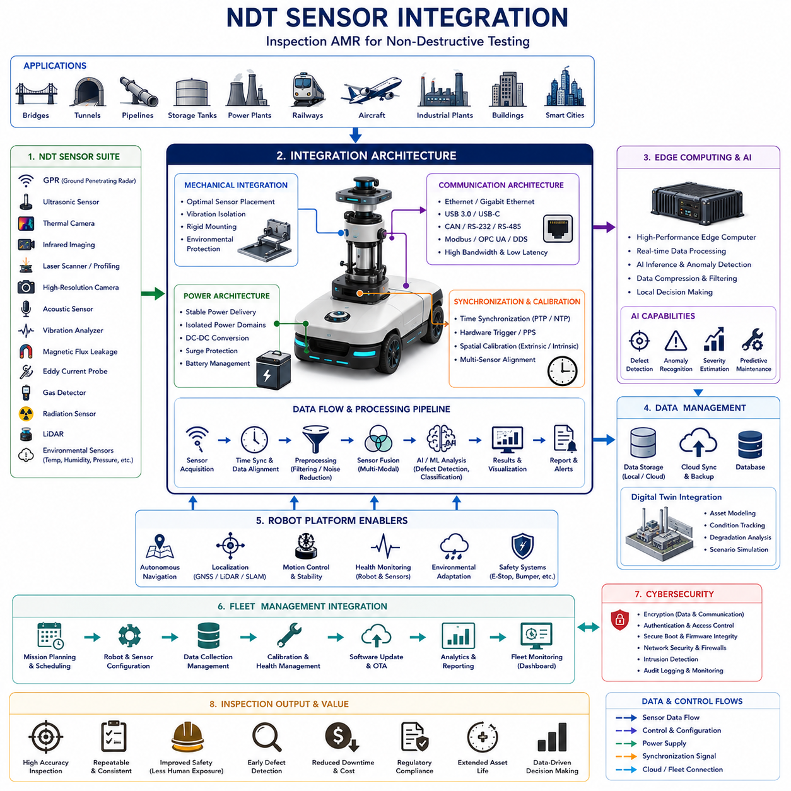
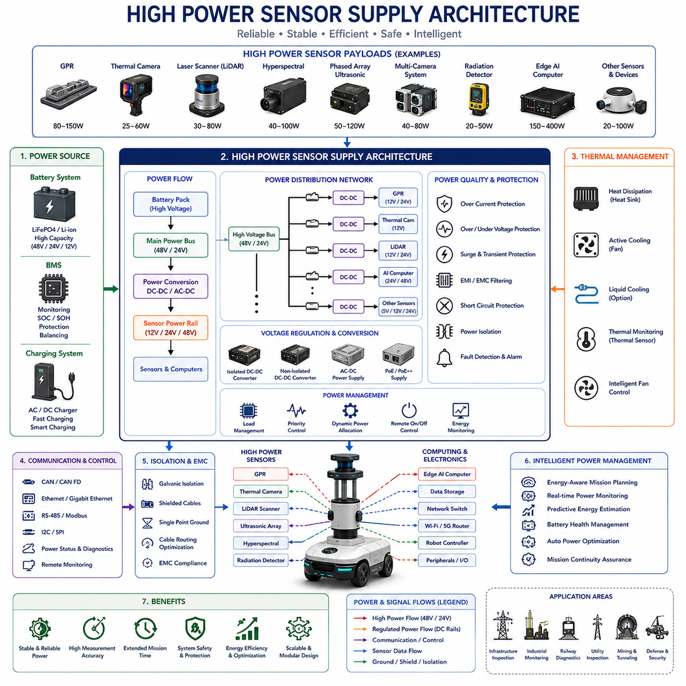
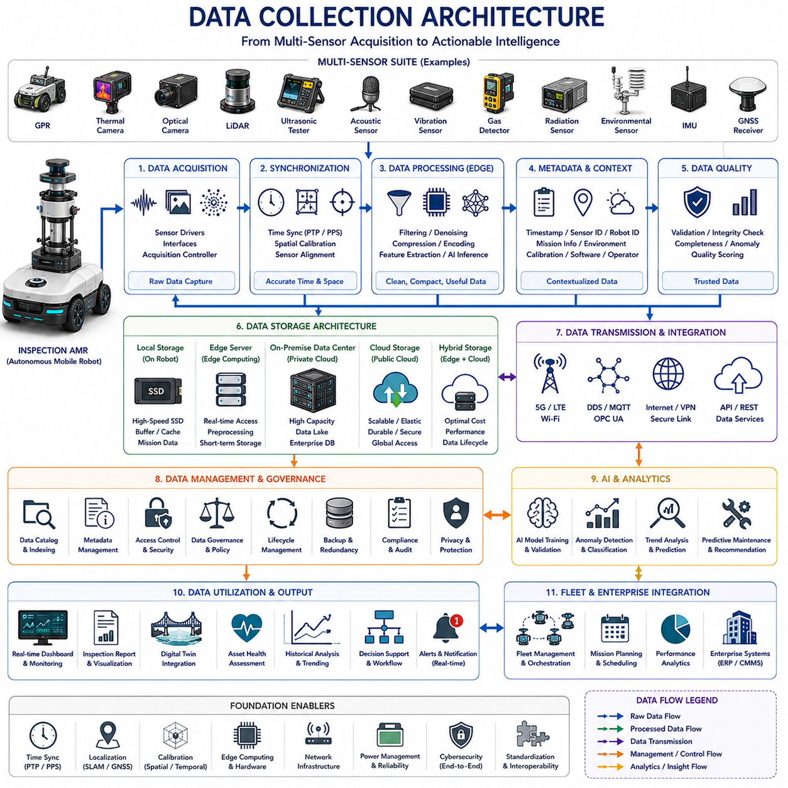
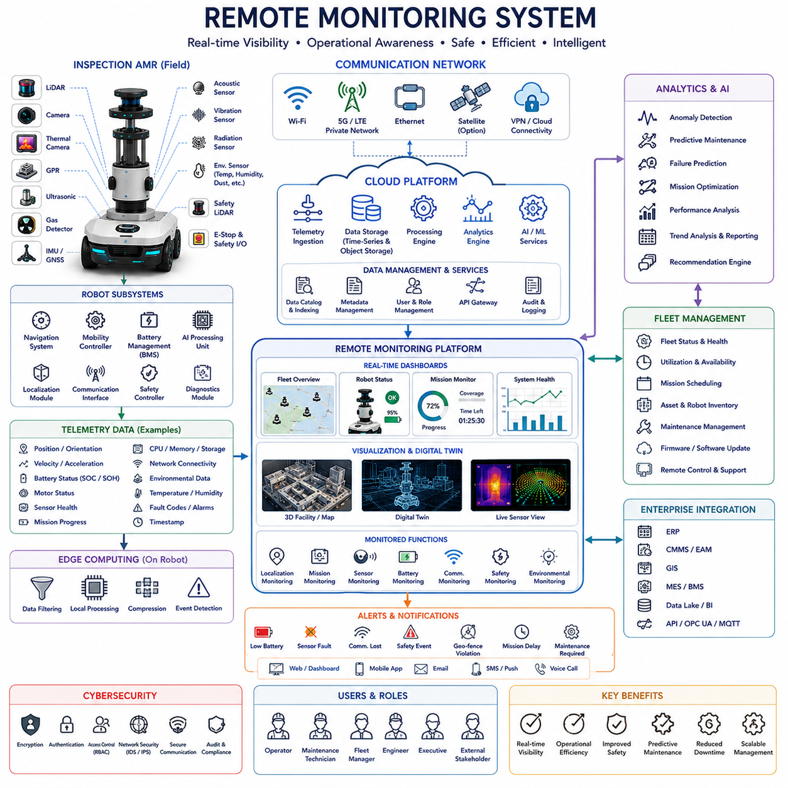
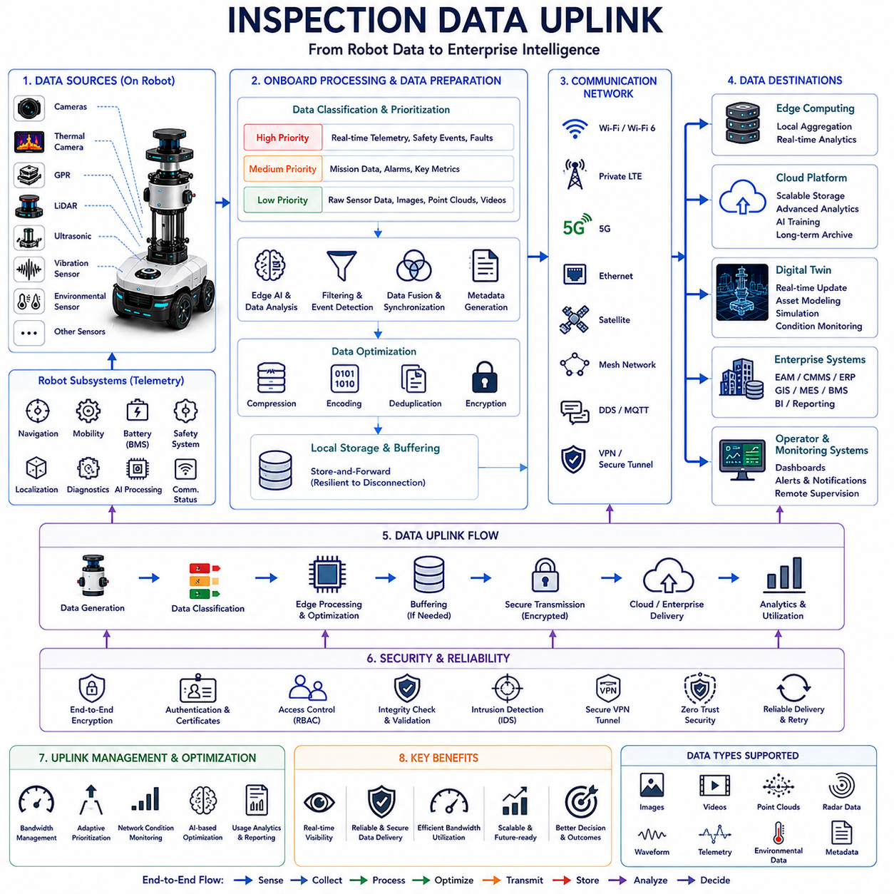

**Volume 13 AMR Electrical Architecture**

# Chapter 4. Inspection AMR

## 4.1 NDT Sensor Integration

{width="7.268055555555556in" height="7.268055555555556in"}

# 04_01 NDT Sensor Integration (비파괴 검사 센서 통합)

NDT Sensor Integration(비파괴 검사 센서 통합)은 현대 Inspection AMR(점검용 자율주행 이동로봇) 시스템에서 가장 중요한 핵심 기술 분야 중 하나이다. NDT(Non-Destructive Testing, 비파괴 검사)는 검사 대상에 손상을 주지 않으면서 구조적 건전성, 성능, 상태 및 결함 여부를 평가하는 기술들의 집합을 의미한다.

기존의 파괴 검사(Destructive Testing)가 절단, 분해, 천공 등의 과정을 통해 내부 상태를 확인하는 반면, NDT는 구조물이나 장비를 정상 운영 상태로 유지한 채 검사를 수행할 수 있다. 이러한 기술은 교량, 터널, 철도, 도로, 건축물, 송전 설비, 발전소, 파이프라인, 저장탱크, 항공기, 선박, 공장 설비 및 도시 인프라 관리에 널리 사용된다.

산업 현장이 Digital Transformation(디지털 전환), Predictive Maintenance(예지보전), Asset Management(자산 관리), AI 기반 상태 모니터링으로 발전함에 따라 NDT 센서를 로봇 플랫폼에 통합하는 기술은 점점 더 중요한 전략 기술이 되고 있다.

과거의 NDT 검사는 대부분 사람이 직접 장비를 들고 위험한 환경이나 접근하기 어려운 장소에서 수행하였다. 이러한 방식은 검사자의 숙련도에 따라 결과가 달라지고, 안전 위험이 높으며, 검사 빈도가 제한되고, 운영 비용이 증가하는 문제가 있었다.

Inspection AMR은 자율주행 기능을 활용하여 반복적이고 위험한 환경에서도 정밀한 센서 위치 제어, 지속적인 데이터 수집, 자동 보고서 생성 및 실시간 분석을 수행할 수 있다.

그러나 이러한 로봇의 성능은 다양한 NDT 센서를 얼마나 효과적으로 통합하느냐에 크게 좌우된다. 따라서 NDT Sensor Integration은 검사 성능, 데이터 품질, 측정 정확도, 시스템 신뢰성 및 확장성을 결정하는 핵심 기술이라고 할 수 있다.

NDT Sensor Integration의 가장 중요한 목표는 서로 다른 물리적 원리를 사용하는 센서들을 하나의 통합 검사 시스템으로 동작하도록 만드는 것이다.

현대 Inspection AMR에는 Ground Penetrating Radar(GPR, 지표투과레이더), Ultrasonic Sensor(초음파 센서), Thermal Camera(열화상 카메라), Infrared Imaging System(적외선 영상 시스템), Laser Profiling Sensor(레이저 프로파일링 센서), High-Resolution Optical Camera(고해상도 광학 카메라), Acoustic Monitoring System(음향 감시 시스템), Vibration Analyzer(진동 분석기), Magnetic Flux Leakage Sensor(자기 누설 센서), Eddy Current Probe(와전류 센서), Gas Detector(가스 감지기), Radiation Sensor(방사선 센서), Hyperspectral Camera(초분광 카메라), LiDAR 및 환경 센서들이 함께 사용된다.

각 센서는 서로 다른 전원 요구사항, 통신 방식, 데이터 형식, 샘플링 속도, 동기화 요구사항 및 계산 부하를 가진다. 따라서 통합 아키텍처는 이러한 이질적인 센서들을 하나의 통합된 검사 플랫폼으로 연결해야 한다.

NDT Sensor Integration의 첫 단계는 Sensor Selection and Mission Alignment(센서 선정 및 임무 정렬)이다.

검사 목적에 따라 필요한 센서가 달라진다.

구조물 균열 검사는 고해상도 카메라와 레이저 스캐너가 필요할 수 있다.

부식(Corrosion) 검사는 Ultrasonic Thickness Measurement(초음파 두께 측정)와 Thermal Imaging(열화상 검사)이 사용된다.

지하 매설물 탐지는 GPR이 필수적이다.

전기 설비 점검은 Thermal Camera와 Acoustic Sensor가 자주 사용된다.

파이프라인 점검은 Ultrasonic Testing(초음파 검사), Magnetic Flux Leakage 및 Visual Inspection(육안 검사)을 결합하기도 한다.

따라서 센서 통합은 검사 목표를 명확히 정의하는 것에서 시작된다.

System-Level Architecture Design(시스템 수준 아키텍처 설계)은 성공적인 센서 통합의 기반이 된다.

일반적으로 시스템은 Sensor Acquisition Layer(센서 수집 계층), Synchronization Layer(동기화 계층), Communication Layer(통신 계층), Edge Processing Layer(엣지 처리 계층), AI Analytics Layer(AI 분석 계층), Data Storage Layer(데이터 저장 계층), Fleet Integration Layer(플릿 통합 계층)로 구성된다.

각 센서는 원시 데이터(Raw Data)를 수집하고, 동기화 계층은 시간 및 공간 정보를 정렬하며, 처리 계층은 필터링과 데이터 융합을 수행한다. 이후 AI가 이상 탐지와 상태 분석을 수행하고 최종적으로 운영자에게 결과를 제공한다.

Mechanical Integration(기계적 통합)은 NDT Sensor Integration의 가장 눈에 띄는 부분이다.

센서는 적절한 위치에 장착되어야 하며, 진동, 충격, 먼지, 습기, 온도 변화 및 전자기 간섭으로부터 보호되어야 한다.

예를 들어 GPR 안테나는 지면과 일정한 높이를 유지해야 하며, Thermal Camera는 시야를 방해받지 않아야 하고, Laser Scanner는 높은 기하학적 정밀도를 유지할 수 있도록 강성(Rigidity)이 높은 구조물에 장착되어야 한다.

Structural Engineering(구조 설계)은 정밀 검사에서 매우 중요하다.

로봇은 주행 중 진동을 발생시키며 이러한 진동은 측정 정확도에 영향을 준다.

Thermal Camera는 영상 흔들림이 발생할 수 있고, Laser Scanner는 측정 오차가 증가할 수 있으며, GPR은 지하 영상 품질이 저하될 수 있다.

따라서 Vibration Isolation System(진동 절연 시스템), Shock Absorber(충격 흡수 장치), Damping Structure(감쇠 구조), Rigid Mounting Platform(고강성 장착 구조)이 적용된다.

Power Architecture(전원 아키텍처)는 센서 통합에서 매우 중요한 요소이다.

NDT 센서는 서로 다른 전압과 전류를 요구한다.

열화상 카메라, LiDAR, GPR, 산업용 카메라, Edge Computer(엣지 컴퓨터)는 모두 전력 요구사항이 다르다.

따라서 안정적인 전원 공급을 위해 Power Distribution Unit(PDU), Isolated Power Domain(절연 전원 영역), DC-DC Converter(전압 변환기), Surge Protection(서지 보호 회로)이 사용된다.

Communication Architecture(통신 아키텍처)는 센서 통합의 중심 역할을 수행한다.

현대 NDT 센서는 Ethernet, Gigabit Ethernet, USB 3.0, USB-C, CAN, RS-232, RS-422, RS-485, Modbus, EtherCAT, OPC UA, SPI, I2C 등을 사용한다.

시스템은 이들을 하나의 통합 통신 구조로 연결해야 하며, 실시간 데이터 수집과 고대역폭 전송을 지원해야 한다.

최근에는 Ethernet 기반 구조가 가장 많이 채택되고 있다.

Data Synchronization(데이터 동기화)은 가장 어려운 기술 중 하나이다.

Thermal Camera는 30fps 정도로 동작할 수 있고, 산업용 카메라는 120fps 이상, LiDAR는 초당 수백만 개의 포인트를 생성하며, GPR은 고주파 신호를 지속적으로 생성한다.

이러한 데이터가 서로 다른 시간 기준을 사용한다면 정확한 데이터 융합이 불가능해진다.

이를 해결하기 위해 Precision Time Protocol(PTP), Network Time Protocol(NTP), Hardware Trigger System(하드웨어 트리거), PPS(Pulse Per Second) 신호, Timing Controller(시간 제어기)가 사용된다.

특히 고정밀 검사에서는 수 밀리초(Millisecond)의 오차도 큰 영향을 줄 수 있기 때문에 하드웨어 기반 동기화가 선호된다.

Spatial Calibration(공간 보정)은 시간 동기화만큼 중요하다.

각 센서는 서로 다른 위치와 방향에서 데이터를 수집한다.

Extrinsic Calibration(외부 파라미터 보정)은 센서 간 상대 위치를 계산하고, Intrinsic Calibration(내부 파라미터 보정)은 센서 자체 특성을 보정한다.

정확한 보정을 통해 여러 센서 데이터를 동일한 좌표계에서 융합할 수 있다.

Sensor Fusion(센서 융합)은 NDT Sensor Integration이 제공하는 가장 강력한 기능 중 하나이다.

열화상 카메라는 온도 이상을 감지할 수 있지만 내부 균열은 발견하기 어렵다.

초음파 검사는 내부 결함을 탐지할 수 있지만 주변 환경 정보는 부족하다.

GPR은 지하 구조를 볼 수 있지만 재질 구분이 어려울 수 있다.

Visual Inspection은 직관적이지만 숨겨진 결함은 탐지하지 못한다.

Sensor Fusion은 이러한 센서들의 장점을 결합하여 검사 정확도를 높인다.

Artificial Intelligence(AI)는 최근 NDT Sensor Integration의 핵심 기술로 자리 잡고 있다.

Machine Learning(머신러닝)과 Deep Learning(딥러닝)은 열화상 이미지, 광학 영상, LiDAR Point Cloud, 음향 데이터, 진동 데이터 및 레이더 데이터를 분석하여 이상을 탐지한다.

AI 기반 Sensor Fusion은 사람이 발견하기 어려운 패턴까지 탐지할 수 있게 해준다.

Edge Computing(엣지 컴퓨팅)은 현대 검사 로봇에서 필수 요소가 되었다.

고해상도 카메라, Thermal Camera, GPR, LiDAR는 시간당 수 기가바이트(Gigabyte)의 데이터를 생성할 수 있다.

이 데이터를 모두 클라우드로 전송하는 것은 비효율적이다.

따라서 Edge Computer는 현장에서 데이터를 처리하고 필요한 결과만 Fleet Manager나 Cloud Platform으로 전송한다.

GPR Integration(GPR 통합)은 NDT Sensor Integration의 대표적인 사례이다.

GPR은 정확한 안테나 위치, 안정적인 전원, 정밀한 위치 추정(Localization), 고속 데이터 수집 및 강력한 신호 처리 능력을 필요로 한다.

또한 안테나 높이, 차량 속도, 전자기 간섭 및 환경 조건에 매우 민감하다.

따라서 기계, 전기, 통신, 위치 추정 및 AI 시스템이 긴밀하게 협력해야 한다.

Thermal Imaging Integration(열화상 통합)은 또 다른 중요한 분야이다.

열화상 카메라는 태양광, 기온 변화, 센서 드리프트에 영향을 받는다.

따라서 Thermal Compensation Algorithm(열 보정 알고리즘), 환경 모니터링 및 보정 절차가 함께 필요하다.

Laser Scanning Integration(레이저 스캐닝 통합)은 균열 측정, 변형 분석, 형상 측정 및 구조 분석에 사용된다.

정확한 Calibration, Localization 연동, 진동 보상 및 대용량 데이터 처리가 필수적이다.

Environmental Sensing(환경 센싱)도 점점 중요해지고 있다.

온도, 습도, 기압, 진동, 가스 농도, 전자기장, 기상 조건은 검사 결과에 영향을 줄 수 있다.

환경 센서는 이러한 영향을 분석하고 측정 결과를 보정하는 데 사용된다.

Cybersecurity(사이버보안)는 현대 NDT Sensor Integration에서 매우 중요한 요소가 되었다.

점검 로봇은 발전소, 철도, 항만, 공항, 국방 시설 및 국가 기반 시설에서 사용될 수 있다.

따라서 암호화(Encryption), 인증(Authentication), 접근 제어(Access Control), 보안 통신(Secure Communication) 및 지속적인 보안 모니터링이 필수적이다.

Fleet Integration(플릿 통합)은 NDT Sensor Integration을 개별 로봇 수준에서 대규모 운영 수준으로 확장시킨다.

여러 대의 점검 로봇이 동시에 운영될 경우 Fleet Manager는 검사 일정, 센서 구성, 데이터 수집, 소프트웨어 업데이트 및 AI 분석을 통합 관리한다.

Digital Twin(디지털 트윈)은 NDT Sensor Integration을 더욱 강력하게 만든다.

실제 구조물과 설비의 가상 모델을 구축하고, 센서 데이터가 실시간으로 디지털 모델을 업데이트한다.

이를 통해 상태 추적, 열화 분석, 수명 예측 및 유지보수 계획 수립이 가능해진다.

미래의 NDT Sensor Integration은 Physical AI(피지컬 AI), Autonomous Decision Making(자율 의사결정), Multi-Modal Sensor Fusion(다중 센서 융합), Edge-Cloud Computing(엣지-클라우드 컴퓨팅), Predictive Analytics(예측 분석), Self-Optimizing Inspection Workflow(자가 최적화 검사 워크플로우)와 결합될 것이다.

Inspection AMR Architecture(점검 AMR 아키텍처)에서 NDT Sensor Integration은 자율 점검, 디지털 자산 관리, 예지보전 및 지능형 인프라 모니터링을 가능하게 하는 핵심 기반 기술이다. 향후 에너지, 철도, 도로, 항만, 공장, 스마트시티 및 국가 기반 시설의 자동화가 확대될수록 NDT Sensor Integration의 중요성은 더욱 커질 것이며, 미래 로봇 점검 시스템의 핵심 기술 중 하나로 자리 잡게 될 것이다.

## 4.2 High Power Sensor Supply

{width="7.268055555555556in" height="7.268055555555556in"}

# 04_02 High Power Sensor Supply (고전력 센서 전원 공급)

High Power Sensor Supply(고전력 센서 전원 공급)는 현대 Inspection AMR(점검용 자율주행 이동로봇)에서 매우 중요한 핵심 하위 시스템이다. 특히 NDT(Non-Destructive Testing, 비파괴 검사), 인프라 점검, 산업 설비 모니터링, 지형 측량, 자율 지도 작성, 국방 정찰, 광산 자동화, 철도 진단, 공항 시설 점검, 유틸리티 설비 관리 및 스마트시티 모니터링과 같은 분야에서는 고전력 센서가 필수적으로 사용된다.

일반적인 AMR은 LiDAR, Camera, IMU, Ultrasonic Sensor(초음파 센서), GNSS 수신기와 같은 비교적 저전력 센서를 사용한다. 그러나 점검용 AMR은 Ground Penetrating Radar(GPR, 지표투과레이더), 고성능 Thermal Camera(열화상 카메라), 산업용 Laser Scanner(레이저 스캐너), Hyperspectral Imaging System(초분광 영상 시스템), Phased Array Ultrasonic System(위상배열 초음파 시스템), Electromagnetic Inspection Sensor(전자기 검사 센서), Radiation Detector(방사선 검출기), 다중 카메라 시스템 및 고성능 Edge AI Computing Platform(엣지 AI 컴퓨팅 플랫폼) 등을 탑재한다.

이러한 장비들은 일반 센서보다 훨씬 많은 전력을 요구하므로 High Power Sensor Supply는 단순한 전원 공급 기능을 넘어 전체 검사 시스템의 성능을 좌우하는 핵심 기술이 된다.

High Power Sensor Supply의 가장 중요한 목적은 모든 센서와 컴퓨팅 장치에 안정적이고 효율적이며 신뢰성 높은 전력을 공급하는 것이다. 일부 센서는 수 와트(Watt) 수준의 전력만 사용하지만, 산업용 검사 센서는 수십 와트에서 수백 와트까지 소비할 수 있다.

여러 개의 고전력 센서와 AI 컴퓨터, 통신 장치, 모터 제어기, 안전 장치가 동시에 동작할 경우 전체 전력 소비는 수백 와트에서 수 킬로와트(kW)에 이를 수 있다. 따라서 전원 공급 설계는 단순한 배선 작업이 아니라 시스템 엔지니어링(System Engineering)의 핵심 영역이 된다.

현대 점검 로봇은 일반적으로 배터리 기반 전원 시스템(Battery-Based Power System)을 사용한다. Lithium Iron Phosphate(LFP, 리튬인산철 배터리), Lithium-Ion Battery(리튬이온 배터리), Lithium Polymer Battery(리튬폴리머 배터리), 차세대 Solid-State Battery(전고체 배터리)가 대표적이다.

배터리는 로봇 주행뿐만 아니라 모든 센서, 컴퓨터, 통신 장치, 조명 장치, 냉각 장치 및 안전 장치에 필요한 에너지를 공급해야 한다. 따라서 배터리 용량 설계는 주행 에너지와 센서 에너지를 동시에 고려해야 한다.

High Power Sensor Supply 설계에서 가장 큰 과제 중 하나는 센서마다 전력 요구사항이 매우 다르다는 점이다.

GPR은 고주파 송신기와 신호처리 장치를 사용하므로 높은 전력을 요구한다.

Thermal Camera는 냉각 시스템을 필요로 할 수 있다.

산업용 Laser Scanner는 회전 광학계, 레이저 송신기, 고속 처리 장치를 포함한다.

Hyperspectral Imaging System은 복잡한 광학 장치와 대용량 데이터 처리 시스템을 사용한다.

고해상도 카메라 시스템은 AI 분석과 결합되면서 추가적인 전력 소비를 발생시킨다.

따라서 전원 시스템은 서로 다른 전압, 전류, 기동 전류(Start-Up Current), 순간 전력(Transient Power)을 요구하는 다양한 부하를 동시에 지원해야 한다.

일부 센서는 12V를 사용하고 다른 센서는 24V 또는 48V를 사용한다. 특수 장비는 별도의 전압 레벨을 요구하기도 한다.

Power Budgeting(전력 예산 설계)은 High Power Sensor Supply 설계의 시작점이다.

모든 센서, 컴퓨터, 통신 장치, 제어기 및 보조 장치의 평균 소비 전력, 최대 소비 전력, 기동 전류 및 운용 패턴을 분석해야 한다.

이를 통해 정상 운전, 최대 부하 및 최악의 상황에서의 총 전력 소비량을 계산할 수 있다.

이 계산 결과는 배터리 용량, 케이블 규격, 냉각 시스템, 충전 전략 및 전체 차량 아키텍처 설계에 영향을 준다.

Voltage Regulation(전압 안정화)은 매우 중요한 기능이다.

배터리 전압은 충전 상태, 방전 상태, 온도 및 부하 변화에 따라 지속적으로 변한다.

반면 대부분의 센서는 안정적인 전압 공급을 요구한다.

DC-DC Converter(직류-직류 변환기)는 배터리 전압 변화와 관계없이 안정적인 출력 전압을 제공한다.

고효율 Switching Regulator(스위칭 레귤레이터)는 에너지 손실을 최소화하면서 다양한 전압을 공급할 수 있다.

Power Distribution Architecture(전력 분배 아키텍처)는 배터리의 전력을 각 센서와 장치에 전달하는 구조이다.

현대 Inspection AMR은 일반적으로 계층형 전력 구조(Hierarchical Power Architecture)를 사용한다.

고전압 배터리 버스(High Voltage Battery Bus)가 주요 에너지를 공급하고, 각 센서 근처의 전력 변환 장치가 필요한 전압으로 변환한다.

이 방식은 전력 손실을 줄이고 배선을 단순화하며 시스템 확장성을 향상시킨다.

Electrical Isolation(전기적 절연)은 NDT 센서에서 매우 중요하다.

많은 비파괴 검사 센서는 전기적 노이즈(Electrical Noise), 접지 루프(Ground Loop), 전자기 간섭(Electromagnetic Interference)에 민감하다.

따라서 Galvanic Isolation(갈바닉 절연), Isolated DC-DC Converter(절연형 DC-DC 변환기), Differential Signaling(차동 신호), Shielded Cable(차폐 케이블), Dedicated Grounding Strategy(전용 접지 구조)가 사용된다.

이러한 절연 기술은 센서 측정 정확도를 향상시킨다.

Electromagnetic Compatibility(EMC, 전자파 적합성)는 고전력 시스템에서 반드시 고려해야 한다.

고전류 스위칭 회로, 모터 드라이버, 무선 통신 장치, 전력 변환기 및 레이더 송신기는 강한 전자파를 발생시킨다.

GPR은 매우 약한 반사 신호를 수신하기 때문에 전자파 간섭에 특히 민감하다.

따라서 Shielding(차폐), Filtering(필터링), Grounding(접지), Cable Routing Optimization(케이블 경로 최적화), EMC Testing(전자파 시험)이 필수적이다.

Thermal Management(열 관리)는 High Power Sensor Supply와 밀접하게 연결되어 있다.

모든 전력 소비는 결국 열로 변환된다.

고전력 센서, GPU 기반 AI 컴퓨터, 네트워크 스위치, 전력 변환기 및 배터리는 모두 열을 발생시킨다.

과도한 온도는 센서 정확도를 저하시킬 뿐 아니라 배터리 수명을 단축시키고 전자장비 고장을 유발할 수 있다.

따라서 열 해석(Thermal Analysis)과 냉각 시스템은 전원 설계의 필수 요소이다.

Active Cooling System(능동 냉각 시스템)은 고성능 점검 로봇에서 자주 사용된다.

Forced-Air Cooling(강제 공랭), Liquid Cooling(수랭), Heat Pipe(히트파이프), Vapor Chamber(베이퍼 챔버), Thermoelectric Cooler(열전 냉각기) 등이 대표적인 기술이다.

Thermal Camera는 정확한 온도 측정을 위해 센서 온도 안정화가 필요하며, GPU 기반 AI 컴퓨터는 수백 와트의 열을 발생시키므로 강력한 냉각 시스템이 필요하다.

Power Quality(전력 품질)도 매우 중요하다.

전압 리플(Voltage Ripple), 순간 전압 상승(Transient Spike), 고조파(Harmonic Distortion), Brownout(전압 강하), 전기 노이즈는 센서 성능을 저하시킬 수 있다.

따라서 Filter Circuit(필터 회로), Surge Protection Device(서지 보호 장치), Capacitive Energy Storage(커패시터 기반 에너지 저장 장치), Power Conditioning Module(전력 품질 보정 모듈)이 사용된다.

고품질 전력 공급은 검사 결과의 신뢰성을 높인다.

Ground Penetrating Radar(GPR)는 고전력 센서 통합의 대표적인 사례이다.

GPR은 강력한 전자기 펄스를 송신하고 반사 신호를 분석한다.

이를 위해 고출력 송신기, 증폭기, 디지털 신호처리기, 대용량 저장장치 및 동기화 장치가 필요하다.

또한 전압 변화가 발생하면 측정 품질이 크게 저하될 수 있기 때문에 별도의 전력 도메인(Power Domain)을 구성하는 경우가 많다.

Thermal Imaging System(열화상 시스템)도 상당한 전력을 요구한다.

적외선 센서, 냉각 장치, 영상 처리기, 보정 메커니즘 및 환경 보상 알고리즘이 모두 전력을 소비한다.

Laser Scanner System(레이저 스캐너 시스템)은 레이저 송신기, 수신기, 회전 장치 및 데이터 처리기를 포함하며 스캔 속도와 거리 등에 따라 전력 소비가 달라진다.

Hyperspectral Imaging System(초분광 영상 시스템)은 가장 전력 소모가 큰 센서 중 하나이다.

다수의 파장 대역을 동시에 촬영하며 특수 조명 장치, 냉각 시스템, 고성능 컴퓨팅 자원을 필요로 한다.

Edge AI Computing(엣지 AI 컴퓨팅)은 전체 시스템 전력 소비를 크게 증가시킨다.

현대 Inspection AMR은 Defect Detection(결함 탐지), Anomaly Recognition(이상 탐지), Object Classification(객체 분류), Condition Assessment(상태 평가), Predictive Maintenance(예지보전) 등을 위해 AI를 사용한다.

GPU, AI Accelerator(AI 가속기), 산업용 컴퓨터 및 고속 저장장치는 종종 센서보다 더 많은 전력을 소비한다.

따라서 센서와 컴퓨팅 시스템은 하나의 통합 에너지 생태계로 설계되어야 한다.

Battery Management System(BMS, 배터리 관리 시스템)은 에너지 관리의 핵심이다.

BMS는 전압, 전류, 온도, State of Charge(SOC, 충전 상태), State of Health(SOH, 건강 상태), 셀 밸런싱(Cell Balancing), 이상 상태를 지속적으로 모니터링한다.

지능형 BMS는 에너지 효율을 향상시키고 배터리 수명을 연장하며 위험 상황을 예방한다.

Energy-Aware Mission Planning(에너지 인식 임무 계획)은 최근 중요성이 높아지고 있다.

Fleet Manager는 센서 구성, 검사 경로, 환경 조건 및 AI 계산 부하를 고려하여 임무 수행에 필요한 에너지를 예측한다.

이를 통해 최적의 임무 배정, 충전 계획 및 자원 관리를 수행할 수 있다.

Redundancy(이중화)와 Fault Tolerance(장애 허용성)는 미션 크리티컬(Mission Critical) 점검 시스템에서 매우 중요하다.

전원 공급 장치 하나가 고장 나더라도 전체 시스템이 정지해서는 안 된다.

이를 위해 이중 전원 버스(Redundant Power Bus), 백업 전원(Backup Power Supply), Fault Isolation Mechanism(고장 격리 메커니즘), 지능형 전력 관리 시스템이 사용된다.

Cybersecurity(사이버보안)도 점점 중요해지고 있다.

스마트 전력 분배 장치, 네트워크 기반 충전 시스템, 원격 에너지 관리 장치는 사이버 공격의 대상이 될 수 있다.

따라서 암호화 통신, 인증(Authentication), 보안 펌웨어 업데이트 및 접근 제어가 필요하다.

Digital Twin(디지털 트윈)은 High Power Sensor Supply 설계에 강력한 도구를 제공한다.

배터리, 전력 변환기, 센서, 냉각 시스템 및 작업 부하를 가상 모델로 구축하여 에너지 소비, 열 거동, 고장 시나리오 및 임무 수행 능력을 사전에 분석할 수 있다.

미래의 Inspection AMR은 더욱 많은 센서, 더 큰 AI 모델, 더 복잡한 통신 시스템, 자율 의사결정 기능 및 협업 플릿 운영을 지원하게 될 것이다.

이에 따라 High Power Sensor Supply는 단순한 전원 공급 시스템이 아니라 실시간으로 발전(Generation), 저장(Storage), 분배(Distribution), 소비(Consumption), 열 관리(Thermal Control)를 최적화하는 Intelligent Energy Management Ecosystem(지능형 에너지 관리 생태계)으로 발전하게 될 것이다.

Inspection AMR Architecture(점검용 AMR 아키텍처) 관점에서 High Power Sensor Supply는 에너지 저장 장치와 고성능 검사 센서를 연결하는 핵심 기반 인프라이다. 안정적이고 지능적인 전력 공급은 모든 측정, 분석, AI 추론 및 자율 의사결정을 가능하게 한다. 향후 로봇 기반 점검, 디지털 자산 관리, 예지보전 및 Physical AI(피지컬 AI) 기술이 확대될수록 High Power Sensor Supply는 차세대 자율 점검 시스템을 가능하게 하는 가장 중요한 핵심 기술 중 하나가 될 것이다.

## 4.3 Data Collection Architecture

{width="7.268055555555556in" height="7.268055555555556in"}

# 04_03 Data Collection Architecture (데이터 수집 아키텍처)

Data Collection Architecture(데이터 수집 아키텍처)는 현대 Inspection AMR(점검용 자율주행 이동로봇) 시스템의 가장 핵심적인 구성 요소 중 하나이다. NDT(Non-Destructive Testing, 비파괴 검사), 인프라 모니터링, 산업 설비 점검, Predictive Maintenance(예지보전), Digital Asset Management(디지털 자산 관리), Physical AI(피지컬 AI) 환경에서 로봇의 궁극적인 가치는 이동 능력이나 센서 자체가 아니라 수집되는 데이터의 품질, 일관성, 확장성, 활용성에 의해 결정된다.

자율주행 기능과 다양한 센서는 데이터를 수집하기 위한 수단이며, 실제로 조직에 가치를 제공하는 것은 데이터를 기반으로 생성되는 정보와 지식이다. 따라서 Data Collection Architecture는 센서에서 생성되는 원시 데이터(Raw Data)를 구조화되고 동기화되며 추적 가능하고 분석 가능한 정보로 변환하는 핵심 프레임워크라고 할 수 있다.

과거의 점검 업무는 사람이 직접 측정값, 사진, 열화상 이미지, 검사 결과 및 메모를 수집하는 방식으로 수행되었다. 이러한 방식은 데이터 형식이 통일되지 않고, 기록 누락이 발생하며, 장기적인 분석이 어려운 문제가 있었다.

현대 Inspection AMR은 다양한 센서를 이용하여 대규모 데이터를 자동으로 수집할 수 있지만, 단순히 데이터를 저장하는 것만으로는 충분하지 않다. 수집된 데이터는 정확하고, 동기화되어 있으며, 검색 가능하고, 안전하게 보관되어야 하며, AI와 Digital Twin 시스템에서 활용할 수 있어야 한다.

Data Collection Architecture의 가장 중요한 목적은 센서로부터 시작하여 운영 의사결정까지 연결되는 완전한 데이터 파이프라인(Data Pipeline)을 구축하는 것이다.

이 파이프라인은 Sensor Acquisition(센서 수집), Data Synchronization(데이터 동기화), Data Processing(데이터 처리), Data Storage(데이터 저장), Data Transmission(데이터 전송), Analytics(분석), Visualization(시각화), Digital Twin Integration(디지털 트윈 연동), AI Training(AI 학습), Asset Management(자산 관리)까지 포함한다.

각 단계는 데이터의 무결성(Integrity)과 활용 가치를 유지하도록 설계되어야 한다.

현대 Inspection AMR은 Ground Penetrating Radar(GPR, 지표투과레이더), Thermal Camera(열화상 카메라), Optical Camera(광학 카메라), Hyperspectral Imaging System(초분광 영상 시스템), LiDAR, Ultrasonic Testing Device(초음파 검사 장치), Acoustic Sensor(음향 센서), Vibration Monitoring System(진동 모니터링 시스템), Gas Detector(가스 검출기), Radiation Sensor(방사선 센서), Environmental Monitoring Sensor(환경 모니터링 센서), IMU(Inertial Measurement Unit, 관성측정장치), GNSS 수신기 및 다양한 위치 추정 센서를 동시에 사용한다.

이러한 센서들은 서로 다른 데이터 형식, 샘플링 속도, 대역폭 요구사항 및 운용 특성을 가진다. Data Collection Architecture는 이 모든 이질적인 데이터 흐름을 하나의 통합 구조로 관리해야 한다.

가장 첫 번째 계층은 Data Acquisition Layer(데이터 수집 계층)이다.

이 계층은 물리적인 센서와 직접 연결되며 원시 데이터를 획득하는 역할을 담당한다.

Sensor Driver(센서 드라이버), Communication Interface(통신 인터페이스), Acquisition Controller(수집 제어기), Hardware Abstraction Layer(HAL, 하드웨어 추상화 계층)이 여기에 포함된다.

이 계층의 목표는 데이터 손실 없이 정확하게 데이터를 수집하는 것이다.

각 센서는 서로 다른 유형의 데이터를 생성한다.

카메라는 이미지 프레임(Image Frame)을 생성한다.

Thermal Camera는 온도 맵(Temperature Map)을 생성한다.

LiDAR는 Point Cloud(포인트 클라우드)를 생성한다.

GPR은 지하 레이더 프로파일(Subsurface Radar Profile)을 생성한다.

Ultrasonic Sensor는 Waveform Data(파형 데이터)를 생성한다.

환경 센서는 온도, 습도, 기압, 가스 농도 등의 Scalar Data(단일 값 데이터)를 생성한다.

데이터 수집 아키텍처는 이 모든 형식을 일관성 있게 처리해야 한다.

Time Synchronization(시간 동기화)은 Data Collection Architecture에서 가장 중요한 요소 중 하나이다.

수십 개의 센서가 동시에 동작하는 환경에서 정확한 시간 정보가 없으면 센서 간 데이터 연관성을 찾을 수 없다.

예를 들어 Thermal Camera가 감지한 온도 이상 현상은 같은 시점의 광학 이미지, LiDAR 데이터, 위치 정보 및 차량 자세 정보와 연결되어야 한다.

수 밀리초(Millisecond)의 오차도 데이터 품질을 저하시킬 수 있다.

이를 위해 Precision Time Protocol(PTP), Network Time Protocol(NTP), Pulse Per Second(PPS), Hardware Trigger System(하드웨어 트리거 시스템), Central Timing Controller(중앙 시간 제어기)가 사용된다.

고정밀 검사에서는 소프트웨어 방식보다 하드웨어 기반 동기화가 선호된다.

Spatial Synchronization(공간 동기화) 역시 중요하다.

각 센서는 서로 다른 위치와 방향에 장착되어 있다.

따라서 Data Collection Architecture는 Calibration Framework(보정 프레임워크)를 통해 센서 간 기하학적 관계를 정의해야 한다.

정확한 공간 보정은 여러 센서 데이터를 하나의 통합 환경 모델로 융합할 수 있게 해준다.

Localization Data(위치 정보)는 데이터 수집의 핵심 구성 요소이다.

측정 데이터는 정확한 위치 정보와 연결되지 않으면 장기적인 가치가 크게 감소한다.

따라서 모든 데이터에는 위치(Position), 방향(Orientation), 속도(Velocity), 지도 좌표(Map Coordinate)가 함께 기록된다.

실내에서는 SLAM 기반 위치 추정이 사용되고, 실외에서는 GNSS, RTK, Inertial Navigation System(INS, 관성항법시스템), Visual Odometry(비전 오도메트리), LiDAR Localization이 사용된다.

Metadata Management(메타데이터 관리)는 Data Collection Architecture의 중요한 부분이다.

메타데이터는 데이터에 대한 설명 정보이다.

여기에는 Timestamp(시간 정보), Sensor ID, Robot ID, Mission Information(임무 정보), Operator Information(운영자 정보), Environmental Condition(환경 조건), Calibration Status(보정 상태), Software Version(소프트웨어 버전), Inspection Objective(검사 목적) 등이 포함된다.

풍부한 메타데이터는 검색성과 추적성을 크게 향상시킨다.

Data Quality Management(데이터 품질 관리)는 필수 기능이다.

센서 고장, 통신 장애, 전자기 간섭, 보정 오차, 환경 변화 등으로 인해 데이터 품질이 저하될 수 있다.

따라서 Validation(검증), Integrity Check(무결성 검사), Completeness Verification(완전성 검증), Anomaly Detection(이상 탐지), Quality Scoring(품질 점수화)이 자동으로 수행된다.

Edge Computing(엣지 컴퓨팅)은 현대 점검 로봇에서 매우 중요하다.

고해상도 카메라, GPR, LiDAR, Hyperspectral Camera는 엄청난 양의 데이터를 생성한다.

이 모든 데이터를 실시간으로 서버에 전송하는 것은 비효율적이다.

따라서 Edge Computer는 현장에서 데이터 필터링, 압축, 특징 추출(Feature Extraction), 이상 탐지 및 AI 추론을 수행하고 필요한 결과만 전송한다.

Data Compression(데이터 압축)은 저장 공간과 통신 비용을 줄이는 데 중요한 역할을 한다.

Lossless Compression(무손실 압축)은 원본 데이터를 그대로 보존하므로 과학적 분석과 법적 증거 보존에 적합하다.

Lossy Compression(손실 압축)은 시각화 목적의 데이터에 사용될 수 있다.

Storage Architecture(저장소 아키텍처)는 대규모 검사 프로젝트에서 매우 중요하다.

데이터는 Robot Local Storage(로봇 로컬 저장소), Edge Server, On-Premise Data Center(온프레미스 데이터센터), Cloud Storage(클라우드 저장소), Hybrid Storage System(하이브리드 저장소)에 저장될 수 있다.

운영 요구사항과 보안 정책에 따라 저장 전략이 결정된다.

Database Architecture(데이터베이스 아키텍처)는 수집 데이터를 체계적으로 관리한다.

Time-Series Database(시계열 데이터베이스)는 센서 텔레메트리를 저장한다.

Relational Database(관계형 데이터베이스)는 메타데이터와 운영 기록을 저장한다.

Object Storage(객체 저장소)는 이미지, 영상, 포인트 클라우드, GPR 데이터를 저장한다.

Graph Database(그래프 데이터베이스)는 Digital Twin 및 자산 관계 모델링에 활용될 수 있다.

Communication Infrastructure(통신 인프라)는 데이터를 시스템 전체로 전달한다.

Ethernet, Wi-Fi, Private LTE, 5G, DDS, MQTT, OPC UA, REST API 및 Cloud Communication Service가 사용된다.

이 통신 구조는 실시간 데이터와 대용량 이력 데이터를 모두 처리해야 한다.

Cybersecurity(사이버보안)는 점점 더 중요해지고 있다.

점검 데이터는 발전소, 철도, 공항, 항만, 군사시설 및 국가 기반 시설에 대한 민감한 정보를 포함할 수 있다.

따라서 Encryption(암호화), Authentication(인증), Access Control(접근 제어), Audit Logging(감사 로그), Intrusion Detection(침입 탐지), Secure Communication Protocol(보안 통신 프로토콜)이 필수적으로 적용된다.

Data Governance(데이터 거버넌스)는 데이터의 소유권, 보관 기간, 접근 권한, 규정 준수 및 사용 정책을 정의한다.

대규모 조직에서는 여러 시설과 플릿이 동시에 운영되기 때문에 데이터 관리 정책의 표준화가 중요하다.

Artificial Intelligence(AI)는 Data Collection Architecture와 밀접하게 연결된다.

AI 모델은 대량의 고품질 학습 데이터를 필요로 한다.

Inspection AMR은 이미지, 열화상, 레이더 데이터, 진동 데이터, 환경 데이터 및 결함 사례를 지속적으로 생성한다.

따라서 데이터 수집 시스템은 AI 학습을 위한 Dataset Management(데이터셋 관리), Version Control(버전 관리), Annotation Framework(주석 프레임워크)를 지원해야 한다.

Ground Truth Generation(정답 데이터 생성)은 AI 개발에서 매우 중요하다.

전문 검사원이 수집 데이터를 검토하고 결함 유형, 상태 평가 및 유지보수 권고를 입력한다.

이 정보는 미래 AI 모델 학습의 기준 데이터가 된다.

Digital Twin Integration(디지털 트윈 통합)은 데이터의 가치를 더욱 확대한다.

Digital Twin은 실제 구조물과 설비의 가상 모델이다.

센서 데이터는 지속적으로 디지털 트윈을 업데이트하며 상태 모니터링, 열화 추적, 예지보전 및 시뮬레이션을 가능하게 한다.

Fleet-Wide Data Aggregation(플릿 전체 데이터 통합)은 대규모 운영 환경에서 중요한 기능이다.

수백 대의 로봇이 다양한 지역에서 수집한 데이터를 중앙 플랫폼으로 통합한다.

이 데이터를 활용하여 성능 분석, 유지보수 최적화 및 운영 개선이 가능해진다.

Real-Time Monitoring System(실시간 모니터링 시스템)은 수집 데이터를 기반으로 현재 상황을 운영자에게 제공한다.

운영자는 대시보드를 통해 로봇 상태, 센서 데이터, 검사 진행률 및 이상 탐지 결과를 확인할 수 있다.

Historical Analysis(이력 분석)는 데이터의 장기적 가치를 창출한다.

수개월 또는 수년에 걸쳐 반복 수집된 데이터는 구조물의 열화 추세, 고장 전조 현상, 환경 영향 및 유지보수 효과를 분석할 수 있게 해준다.

Scalability(확장성)는 매우 중요한 설계 원칙이다.

처음에는 몇 대의 로봇으로 시작하더라도 향후 수백 대의 로봇, 수십 개 시설, 새로운 센서 및 AI 시스템을 지원할 수 있어야 한다.

이를 위해 Cloud-Native Architecture(클라우드 네이티브 아키텍처), Distributed Storage System(분산 저장 시스템), Microservice Architecture(마이크로서비스 아키텍처), Container-Based Processing Environment(컨테이너 기반 처리 환경)이 활용된다.

미래의 Data Collection Architecture는 Autonomous Data Management(자율 데이터 관리) 기능을 포함하게 될 것이다.

AI는 자동으로 데이터 중요도를 평가하고 저장 정책을 결정하며 품질을 분석하고 메타데이터를 생성하게 된다.

Physical AI 시대의 Inspection AMR은 단순한 데이터 수집 장비가 아니라 지식을 생성하는 시스템으로 발전하게 된다.

Inspection AMR Architecture 관점에서 Data Collection Architecture는 Sensor System(센서 시스템), Edge Computing Platform(엣지 컴퓨팅 플랫폼), Fleet Management System(플릿 관리 시스템), Digital Twin, AI Model(인공지능 모델), Enterprise Software(기업용 소프트웨어), Operational Decision System(운영 의사결정 시스템)을 연결하는 중앙 신경망(Central Nervous System) 역할을 수행한다.

결국 모든 자율 점검 기능은 데이터를 얼마나 정확하게 수집하고, 동기화하고, 저장하고, 보호하고, 분석하고, 활용할 수 있는가에 달려 있다. 산업 설비, 철도, 도로, 항만, 공항, 에너지 시설, 국방 및 스마트시티 분야에서 로봇 점검이 확대될수록 Data Collection Architecture는 미래 자율 점검 생태계의 가장 중요한 기반 기술 중 하나로 자리잡게 될 것이다.

## 4.4 Remote Monitoring System

{width="7.268055555555556in" height="7.268055555555556in"}

# 04_04 Remote Monitoring System (원격 모니터링 시스템)

Remote Monitoring System(원격 모니터링 시스템)은 현대 Inspection AMR(점검용 자율주행 이동로봇) 아키텍처에서 가장 중요한 구성 요소 중 하나이다. 점검 로봇이 산업 설비, 철도, 공항, 항만, 발전소, 유틸리티 시설, 스마트시티, 건설 현장, 광산 및 국가 기반 시설로 확대 적용됨에 따라 원격지에서 로봇의 상태를 지속적으로 관찰하고 관리하는 능력이 필수 요소가 되고 있다.

Remote Monitoring System은 자율주행 로봇을 단순한 이동 장비가 아닌 기업 전체 자산 관리 체계의 일부로 통합해주는 역할을 수행한다. 이를 통해 운영자는 현장에 직접 가지 않고도 로봇 상태, 검사 진행 상황, 센서 성능, 환경 정보 및 이상 현상을 실시간으로 확인할 수 있다.

과거에는 검사자가 직접 현장에 방문하여 설비 상태를 확인하고 측정값을 기록하며 보고서를 작성하였다. 이러한 방식은 소규모 환경에서는 가능하지만 대규모 인프라와 수백 개 이상의 자산을 관리하는 환경에서는 매우 비효율적이다.

Inspection AMR은 자동으로 데이터를 수집할 수 있지만, 수집된 데이터와 로봇 상태를 지속적으로 확인할 수 있는 체계가 없다면 운영 효율은 크게 떨어진다. Remote Monitoring System은 이러한 문제를 해결하기 위해 실시간 가시성(Visibility)과 운영 인지 능력(Operational Awareness)을 제공한다.

Remote Monitoring System의 가장 중요한 목적은 현장에 배치된 로봇과 운영자를 디지털로 연결하는 것이다.

운영자, 유지보수 엔지니어, Fleet Manager(플릿 관리자), 자산 관리자 및 의사결정자는 물리적으로 떨어진 장소에서도 로봇의 상태를 확인하고 운영 상황을 관리할 수 있다.

현대 Remote Monitoring System은 일반적으로 Data Acquisition Infrastructure(데이터 수집 인프라), Communication Network(통신 네트워크), Edge Computing System(엣지 컴퓨팅 시스템), Telemetry Management Service(텔레메트리 관리 서비스), Visualization Platform(시각화 플랫폼), Alerting Mechanism(알림 시스템), Analytics Engine(분석 엔진), Fleet Management Interface(플릿 관리 인터페이스), Cybersecurity Framework(사이버보안 프레임워크), Enterprise Integration Service(기업 시스템 연동 서비스)로 구성된다.

모니터링은 로봇 내부에서 시작된다.

Inspection AMR은 Navigation System(항법 시스템), Mobility Controller(주행 제어기), Battery Management System(BMS), Environmental Sensor(환경 센서), Localization Module(위치 추정 모듈), Communication Interface(통신 인터페이스), Inspection Sensor(검사 센서), AI Processing Unit(AI 처리 장치), Safety Controller(안전 제어기) 및 Diagnostic Module(진단 모듈)로부터 지속적으로 데이터를 생성한다.

Remote Monitoring System은 이러한 데이터를 수집하고 통합하여 로봇 상태를 종합적으로 보여준다.

Telemetry(원격 측정 데이터)는 원격 모니터링의 핵심이다.

Telemetry는 로봇이 자신의 상태를 자동으로 전송하는 데이터이다.

일반적으로 Position(위치), Orientation(방향), Velocity(속도), Battery Status(배터리 상태), Motor Status(모터 상태), CPU Usage(CPU 사용률), Memory Usage(메모리 사용량), Storage Capacity(저장 공간), Network Connectivity(네트워크 연결 상태), Sensor Health(센서 상태), Mission Progress(작업 진행 상황), Environmental Data(환경 데이터), Fault Code(고장 코드)가 포함된다.

Localization Monitoring(위치 모니터링)은 매우 중요한 기능이다.

Inspection AMR은 공장, 철도, 공항 활주로, 파이프라인, 고속도로, 발전소 및 대규모 산업단지와 같은 넓은 지역에서 운용된다.

운영자는 로봇이 어디에 있는지, 어떤 경로로 이동하고 있는지 지속적으로 파악해야 한다.

이를 위해 Remote Monitoring System은 Facility Map(시설 지도), Digital Floor Plan(디지털 평면도), GIS(Geographic Information System, 지리정보시스템), Digital Twin(디지털 트윈), Satellite Map(위성 지도), 3D Environment Model(3차원 환경 모델)을 이용하여 로봇 위치를 시각화한다.

Mission Monitoring(임무 모니터링)은 검사 진행 상황을 관리하는 기능이다.

운영자는 현재 임무 상태, 완료된 작업, 남은 작업, 검사 범위, 예상 완료 시간 및 발견된 이상 현상을 확인할 수 있다.

이를 통해 작업 지연을 조기에 발견하고 운영 계획을 최적화할 수 있다.

Sensor Monitoring(센서 모니터링)은 Inspection AMR에서 매우 중요하다.

GPR(Ground Penetrating Radar), Thermal Camera(열화상 카메라), Ultrasonic Sensor(초음파 센서), Laser Scanner(레이저 스캐너), Hyperspectral Camera(초분광 카메라), Acoustic Sensor(음향 센서), Vibration Sensor(진동 센서), Gas Detector(가스 감지기), Radiation Sensor(방사선 센서)는 모두 고가의 전문 장비이다.

센서 상태를 지속적으로 감시함으로써 Calibration Drift(보정 오차), Communication Failure(통신 장애), Sensor Degradation(센서 성능 저하), Environmental Interference(환경 간섭)를 조기에 발견할 수 있다.

Battery Monitoring(배터리 모니터링)은 운영 연속성을 유지하기 위해 필수적이다.

배터리 상태는 임무 수행 시간, 플릿 가용성 및 충전 계획에 직접적인 영향을 준다.

Remote Monitoring System은 State of Charge(SOC, 충전 상태), State of Health(SOH, 배터리 건강 상태), 배터리 온도, 충전 상태, 방전 속도 및 에너지 소비 패턴을 지속적으로 추적한다.

AI 기반 분석을 통해 남은 운용 시간을 예측할 수도 있다.

Communication Monitoring(통신 모니터링)은 로봇과 관제 시스템 간 연결 상태를 관리한다.

Inspection AMR은 Wi-Fi, Ethernet, Private LTE(사설 LTE), 5G, DDS, MQTT, VPN 및 Cloud Connectivity Service(클라우드 연결 서비스)를 사용할 수 있다.

Remote Monitoring System은 Signal Strength(신호 강도), Bandwidth Utilization(대역폭 사용률), Packet Loss(패킷 손실), Latency(지연시간), Connection Stability(연결 안정성)을 지속적으로 분석한다.

Safety Monitoring(안전 모니터링)은 가장 중요한 기능 중 하나이다.

Inspection AMR은 사람, 산업 설비, 전력 시설 및 위험 환경 근처에서 운용될 수 있다.

따라서 Safety Controller, Emergency Stop(E-Stop, 비상 정지), Obstacle Detection System(장애물 감지 시스템), Collision Avoidance System(충돌 회피 시스템), Safety LiDAR, Operational Boundary(운영 경계)를 지속적으로 감시해야 한다.

안전 관련 이상 상황이 발생하면 즉시 운영자에게 경고가 전달된다.

Environmental Monitoring(환경 모니터링)은 운영 상황을 이해하는 데 중요한 역할을 한다.

기온, 습도, 먼지 농도, 진동 수준, 조도, 가스 농도, 전자기 간섭 및 기상 조건은 검사 결과에 영향을 줄 수 있다.

환경 데이터는 검사 데이터와 함께 분석되어 보다 정확한 상태 판단을 가능하게 한다.

Visualization System(시각화 시스템)은 복잡한 데이터를 이해하기 쉬운 형태로 제공한다.

대시보드(Dashboard), Digital Twin, GIS 지도, 3D 시각화, 성능 그래프, 상태 표시기, 트렌드 차트, 히트맵(Heat Map), 작업 타임라인(Timeline) 등이 사용된다.

효율적인 시각화는 운영자가 방대한 데이터를 빠르게 이해하도록 도와준다.

Digital Twin Integration(디지털 트윈 통합)은 시각화 기능을 크게 향상시킨다.

Digital Twin은 실제 로봇과 시설의 가상 복제본(Virtual Replica)이다.

실시간 데이터가 디지털 모델을 지속적으로 업데이트하며, 운영자는 가상 공간에서 로봇 상태를 직관적으로 확인할 수 있다.

Alert and Notification System(경고 및 알림 시스템)은 능동적인 운영 관리를 가능하게 한다.

시스템은 지속적으로 데이터를 분석하며 설정된 조건이나 AI 모델이 이상 상황을 감지하면 알림을 생성한다.

예를 들어 Low Battery(배터리 부족), Communication Failure(통신 장애), Localization Error(위치 오차), Sensor Failure(센서 고장), Environmental Hazard(환경 위험), Mission Delay(작업 지연), Safety Event(안전 사고), Cybersecurity Incident(보안 사고), Maintenance Requirement(유지보수 필요) 등이 감지될 수 있다.

Artificial Intelligence(AI)는 Remote Monitoring System의 핵심 기술로 발전하고 있다.

AI는 대량의 운영 데이터를 분석하여 Anomaly Detection(이상 탐지), Fault Prediction(고장 예측), Mission Optimization(임무 최적화), Failure Probability Estimation(고장 확률 예측), Corrective Action Recommendation(대응 방안 추천)을 수행할 수 있다.

Predictive Maintenance(예지보전)는 AI 기반 모니터링의 대표적인 응용 사례이다.

모터, 배터리, 센서, 커넥터, 저장장치 및 컴퓨팅 장치는 시간이 지나면서 성능이 저하된다.

Remote Monitoring System은 이러한 데이터를 분석하여 고장이 발생하기 전에 유지보수를 수행하도록 지원한다.

Edge Computing(엣지 컴퓨팅)은 모니터링 성능을 향상시킨다.

모든 데이터를 클라우드로 전송하는 대신 현장에서 데이터를 분석하여 핵심 정보만 전송한다.

이 방식은 네트워크 사용량을 줄이고 응답 속도를 높인다.

Cloud Infrastructure(클라우드 인프라)는 대규모 플릿 모니터링을 지원한다.

클라우드는 중앙 데이터 저장, 장기 분석, AI 학습, 대시보드 제공, 사용자 관리 및 기업 시스템 연동을 담당한다.

수백 대 이상의 Inspection AMR을 운영하는 환경에서는 클라우드 기반 모니터링이 필수적이다.

Cybersecurity(사이버보안)는 Remote Monitoring System의 핵심 요구사항이다.

모니터링 시스템은 시설 구조, 검사 결과, 로봇 위치, 유지보수 정보 및 기업 데이터를 포함한 민감한 정보를 다룬다.

따라서 Encryption(암호화), Authentication(인증), Role-Based Access Control(RBAC, 역할 기반 접근 제어), Audit Logging(감사 로그), Intrusion Detection System(IDS, 침입 탐지 시스템), Zero Trust Security Architecture(제로 트러스트 보안 아키텍처)가 적용된다.

Role-Based Access Management(역할 기반 접근 관리)는 사용자별로 다른 정보 접근 권한을 제공한다.

운영자, 관리자, 유지보수 엔지니어, 경영진, 보안 담당자는 각자의 역할에 맞는 정보만 확인할 수 있다.

Fleet-Level Monitoring(플릿 수준 모니터링)은 개별 로봇이 아닌 전체 로봇 그룹을 관리하는 기능이다.

Fleet Utilization(플릿 활용도), Availability(가용성), Inspection Coverage(검사 범위), Energy Consumption(에너지 소비), Maintenance Status(유지보수 상태), Mission Performance(임무 성능)를 분석하여 전체 운영 효율을 최적화한다.

Enterprise Integration(기업 시스템 연동)은 Remote Monitoring System을 ERP(Enterprise Resource Planning), CMMS(Computerized Maintenance Management System), EAM(Enterprise Asset Management), GIS, MES(Manufacturing Execution System), BMS(Building Management System)와 연결한다.

이를 통해 로봇 데이터가 기업 운영 전반에 활용될 수 있다.

향후 Physical AI(피지컬 AI) 시대에는 Remote Monitoring System이 단순히 상태를 보여주는 시스템을 넘어 자율적인 운영 지원 플랫폼으로 발전하게 될 것이다.

AI는 운영 상황을 이해하고, 미래 이벤트를 예측하며, 플릿 운영을 최적화하고, 유지보수 우선순위를 추천하게 된다.

Inspection AMR Architecture 관점에서 Remote Monitoring System은 로봇, 센서, 운영자, 엔지니어, Fleet Manager, 기업 시스템 및 디지털 인프라를 연결하는 중앙 관제센터(Central Command Center) 역할을 수행한다.

이는 대규모 자율 점검 시스템의 가시성(Visibility), 상황 인식(Situational Awareness), 운영 지능(Operational Intelligence) 및 제어(Control)를 제공하는 핵심 플랫폼이며, 향후 산업 시설, 철도, 항만, 공항, 에너지 시설, 국방 및 스마트시티 분야에서 자율 점검 시스템을 운영하기 위한 필수 기술로 자리잡게 될 것이다.

## 4.5 Inspection Data Uplink

{width="7.268055555555556in" height="7.268055555555556in"}

# 04_05 Inspection Data Uplink (점검 데이터 업링크)

Inspection Data Uplink(점검 데이터 업링크)은 현대 Inspection AMR(점검용 자율주행 이동로봇) 아키텍처에서 매우 중요한 핵심 하위 시스템이다. 이 시스템은 현장에서 수집된 검사 데이터를 Edge Computing System(엣지 컴퓨팅 시스템), Fleet Management Platform(플릿 관리 플랫폼), Enterprise Database(기업 데이터베이스), Cloud Infrastructure(클라우드 인프라), Digital Twin Environment(디지털 트윈 환경), Artificial Intelligence Analytics Platform(AI 분석 플랫폼)으로 전송하는 역할을 수행한다.

센서가 로봇의 눈과 귀 역할을 하고 Data Collection Architecture(데이터 수집 아키텍처)가 데이터를 체계적으로 정리한다면, Inspection Data Uplink는 이러한 데이터를 필요한 시스템으로 전달하는 디지털 운송망(Digital Transportation Layer)의 역할을 담당한다.

현대 산업 환경에서는 Asset Management(자산 관리), Predictive Maintenance(예지보전), Infrastructure Monitoring(인프라 모니터링), AI 기반 의사결정이 실시간 데이터에 의존하기 때문에 Inspection Data Uplink는 매우 중요한 기술로 자리잡고 있다.

과거에는 점검 결과를 종이 보고서, USB 저장장치, 수기 기록 또는 로컬 파일 형태로 전달하였다. 이러한 방식은 데이터 손실 위험이 높고, 처리 시간이 오래 걸리며, 대규모 운영에 적합하지 않았다.

철도, 도로, 공항, 항만, 파이프라인, 발전소, 공장 및 스마트시티와 같이 광범위한 지역에서 점검이 수행되면서 자동화된 데이터 전송 체계의 필요성이 크게 증가하였다.

Inspection Data Uplink의 가장 중요한 목적은 로봇이 생성한 검사 데이터를 적절한 사용자와 시스템에 정확하고 안전하며 신속하게 전달하는 것이다.

데이터의 수신자는 Operator(운영자), Maintenance Team(유지보수 팀), Fleet Manager(플릿 관리자), Digital Twin Platform(디지털 트윈 플랫폼), AI Analytics Engine(AI 분석 엔진), Enterprise Asset Management System(EAM, 기업 자산 관리 시스템), Regulatory Reporting System(규제 보고 시스템), Executive Dashboard(경영진 대시보드) 등 매우 다양하다.

따라서 업링크 아키텍처는 다양한 데이터 유형과 다양한 운영 요구사항을 동시에 지원해야 한다.

현대 Inspection AMR은 방대한 양의 데이터를 생성한다.

High-Resolution Camera(고해상도 카메라)는 지속적으로 이미지 데이터를 생성한다.

Thermal Camera(열화상 카메라)는 온도 분포 정보를 제공한다.

Ground Penetrating Radar(GPR, 지표투과레이더)는 지하 구조물 정보를 생성한다.

LiDAR는 3차원 Point Cloud(포인트 클라우드)를 생성한다.

Ultrasonic Sensor(초음파 센서)는 파형 데이터를 생성한다.

Vibration Monitoring System(진동 모니터링 시스템)은 기계 상태 데이터를 생성한다.

Environmental Sensor(환경 센서)는 온도, 습도, 기압, 가스 농도 등의 정보를 제공한다.

장시간 점검 임무에서는 수 기가바이트(Gigabyte)에서 수 테라바이트(Terabyte)에 이르는 데이터가 생성될 수 있다.

Inspection Data Uplink Architecture(점검 데이터 업링크 아키텍처)는 이러한 데이터를 효율적으로 분류하고 전송해야 한다.

업링크 과정은 로봇 내부 데이터 생성 단계에서 시작된다.

Navigation System(항법 시스템), Mobility Controller(주행 제어기), Inspection Sensor(검사 센서), Safety System(안전 시스템), AI Processing Unit(AI 처리 장치)이 각각 데이터를 생성한다.

이 데이터들은 Onboard Computer(온보드 컴퓨터)에서 통합된 후 업링크를 위한 준비 과정을 거친다.

Data Classification(데이터 분류)은 업링크의 첫 번째 핵심 기능이다.

모든 데이터가 동일한 중요도를 가지는 것은 아니다.

Battery Status(배터리 상태), Robot Position(로봇 위치), Communication Health(통신 상태), Mission Progress(임무 진행 상황)과 같은 Telemetry Data(텔레메트리 데이터)는 실시간 전송이 필요하다.

Safety Event(안전 이벤트)는 즉시 전송되어야 한다.

반면 고해상도 이미지나 대용량 Point Cloud는 지연 전송이 가능할 수 있다.

Data Classification은 네트워크 자원을 효율적으로 사용하도록 도와준다.

Real-Time Telemetry Uplink(실시간 텔레메트리 업링크)는 원격 관제의 기본 기능이다.

Telemetry Data에는 위치, 방향, 속도, 배터리 상태, 센서 상태, 환경 정보, 네트워크 품질, CPU 사용률, 저장 공간 사용량 및 고장 코드가 포함된다.

이 데이터는 일반적으로 크기가 작기 때문에 지속적으로 전송될 수 있다.

이를 통해 Fleet Manager와 운영자는 로봇 상태를 실시간으로 확인할 수 있다.

Inspection Data Uplink는 텔레메트리보다 훨씬 큰 데이터를 다루기도 한다.

Thermal Image(열화상 이미지), Inspection Image(검사 이미지), LiDAR Point Cloud, Radar Profile(레이더 프로파일), Ultrasonic Recording(초음파 기록), Video Stream(영상 스트림)은 높은 대역폭을 요구한다.

따라서 현대 업링크 시스템은 Intelligent Filtering(지능형 필터링)과 Prioritization(우선순위 관리)을 사용한다.

Edge Computing은 업링크 최적화의 핵심 기술이다.

Inspection AMR은 강력한 컴퓨팅 자원을 탑재하고 있으며, 현장에서 AI 분석과 이상 탐지를 수행할 수 있다.

모든 원시 데이터를 전송하는 대신 결함 정보, 특징 데이터, AI 분석 결과 및 압축된 데이터만 전송함으로써 네트워크 사용량을 줄일 수 있다.

Communication Network(통신 네트워크)는 업링크의 기반 인프라이다.

Inspection AMR은 Ethernet, Wi-Fi, Wi-Fi 6, Private LTE(사설 LTE), 5G, Satellite Communication(위성 통신), Mesh Network(메시 네트워크), DDS, MQTT, VPN 및 Cloud Connectivity Service를 사용할 수 있다.

각 기술은 커버리지, 대역폭, 지연시간, 신뢰성 및 비용 측면에서 장단점이 존재한다.

Wi-Fi는 실내 환경에서 가장 널리 사용되는 기술이다.

공장, 창고, 병원, 공항 및 물류센터는 일반적으로 Wi-Fi 인프라를 보유하고 있으며 높은 대역폭을 제공한다.

하지만 넓은 지역에서는 커버리지 제한이 존재할 수 있다.

Private LTE와 5G는 대규모 실외 환경에 적합하다.

철도, 도로, 항만, 광산 및 에너지 시설에서는 넓은 지역을 안정적으로 커버할 수 있기 때문이다.

특히 5G는 높은 대역폭과 낮은 지연시간을 동시에 제공하므로 대용량 검사 데이터 전송에 매우 적합하다.

Satellite Communication은 원격 지역에서 중요한 역할을 한다.

에너지 탐사 지역, 해상 시설, 산악 지역, 국방 시설과 같이 통신 인프라가 부족한 환경에서도 데이터를 전송할 수 있다.

다만 높은 비용과 높은 지연시간이 단점이다.

Data Buffering(데이터 버퍼링)은 안정적인 업링크를 위해 필수적이다.

터널, 지하 시설, 산업 구조물 및 악천후 환경에서는 통신이 일시적으로 끊길 수 있다.

Inspection AMR은 이러한 상황에 대비하여 로컬 저장장치에 데이터를 임시 저장한다.

Store-and-Forward Architecture(저장 후 전송 아키텍처)는 이러한 방식의 대표적인 예이다.

통신이 불가능한 동안 데이터는 저장되고, 연결이 복구되면 자동으로 전송된다.

이를 통해 데이터 손실을 방지할 수 있다.

Data Compression(데이터 압축)은 업링크 효율을 높이는 중요한 기술이다.

Lossless Compression(무손실 압축)은 원본 데이터를 그대로 유지하므로 과학적 분석과 규제 보고에 적합하다.

Lossy Compression(손실 압축)은 시각화와 모니터링 목적으로 사용할 수 있다.

Metadata(메타데이터)는 업링크 데이터의 가치를 크게 높인다.

Timestamp(시간 정보), Robot ID, Sensor ID, Mission ID, 위치 좌표, Calibration Information(보정 정보), Environmental Condition(환경 조건), Software Version(소프트웨어 버전) 등이 함께 전송된다.

풍부한 메타데이터는 데이터 검색성과 분석 가능성을 향상시킨다.

Cloud Integration(클라우드 통합)은 Inspection Data Uplink의 주요 목적지 중 하나이다.

클라우드는 대규모 저장 공간, 중앙 관리, AI 학습, Digital Twin 운영, 장기 데이터 보관 및 고급 분석 기능을 제공한다.

대규모 플릿 운영 환경에서는 클라우드 기반 데이터 관리가 필수적이다.

Digital Twin Integration(디지털 트윈 통합)은 업링크 데이터의 중요성을 더욱 높인다.

실제 자산의 상태는 Inspection AMR이 수집한 데이터를 통해 디지털 트윈에 반영된다.

이를 통해 상태 모니터링, 열화 분석, 수명 예측, 유지보수 계획 및 시뮬레이션이 가능해진다.

Cybersecurity(사이버보안)는 Inspection Data Uplink 설계에서 매우 중요한 요소이다.

점검 데이터에는 시설 구조, 자산 상태, 운영 정보 및 유지보수 기록과 같은 민감한 정보가 포함될 수 있다.

따라서 Encryption(암호화), Authentication(인증), Certificate Management(인증서 관리), Secure Communication Protocol(보안 통신 프로토콜), Role-Based Access Control(RBAC, 역할 기반 접근 제어), Intrusion Detection System(IDS, 침입 탐지 시스템), VPN 및 Zero Trust Security(제로 트러스트 보안)가 적용된다.

Artificial Intelligence(AI)는 업링크 최적화에도 활용된다.

AI는 네트워크 상태를 예측하고, 데이터 우선순위를 조정하며, 압축 전략을 최적화하고, 이상 통신을 탐지할 수 있다.

이를 통해 제한된 네트워크 자원을 효율적으로 활용할 수 있다.

대규모 플릿 환경에서는 수백 대의 로봇이 동시에 데이터를 생성한다.

Fleet Management System은 네트워크 혼잡을 방지하고, 중요한 데이터를 우선 전송하며, 전체 통신 자원을 효율적으로 분배해야 한다.

이를 위해 Edge Gateway(엣지 게이트웨이), Local Aggregation Server(로컬 데이터 집계 서버), Cloud Platform을 포함하는 계층형 통신 구조가 사용된다.

Enterprise Integration(기업 시스템 연동)은 Inspection Data Uplink의 가치를 극대화한다.

점검 데이터는 ERP(Enterprise Resource Planning), CMMS(Computerized Maintenance Management System), EAM, GIS, MES(Manufacturing Execution System), BMS(Building Management System), BI(Business Intelligence) 시스템과 연계될 수 있다.

이를 통해 검사 결과가 실제 유지보수 및 운영 의사결정에 활용된다.

미래의 Physical AI(피지컬 AI) 시대에는 Inspection Data Uplink가 더욱 지능화될 것이다.

AI는 어떤 데이터를 언제 전송할지, 어디에 저장할지, 어떤 방식으로 분석할지를 자동으로 결정하게 된다.

또한 네트워크 사용량을 최적화하면서도 최대한의 운영 가치를 제공하는 방향으로 발전할 것이다.

Inspection AMR Architecture 관점에서 Inspection Data Uplink는 로봇과 디지털 운영 생태계를 연결하는 디지털 순환계(Digital Circulatory System) 역할을 수행한다. 센서에서 생성된 데이터를 Fleet Manager, Digital Twin, AI Analytics Platform, Enterprise System 및 의사결정자에게 전달함으로써 단순한 데이터가 조직 전체가 활용할 수 있는 지식(Knowledge)으로 변환된다. 향후 산업, 철도, 항만, 공항, 에너지, 국방 및 스마트시티 분야에서 자율 점검 시스템이 확대될수록 Inspection Data Uplink는 가장 중요한 핵심 기반 기술 중 하나로 자리잡게 될 것이다.
