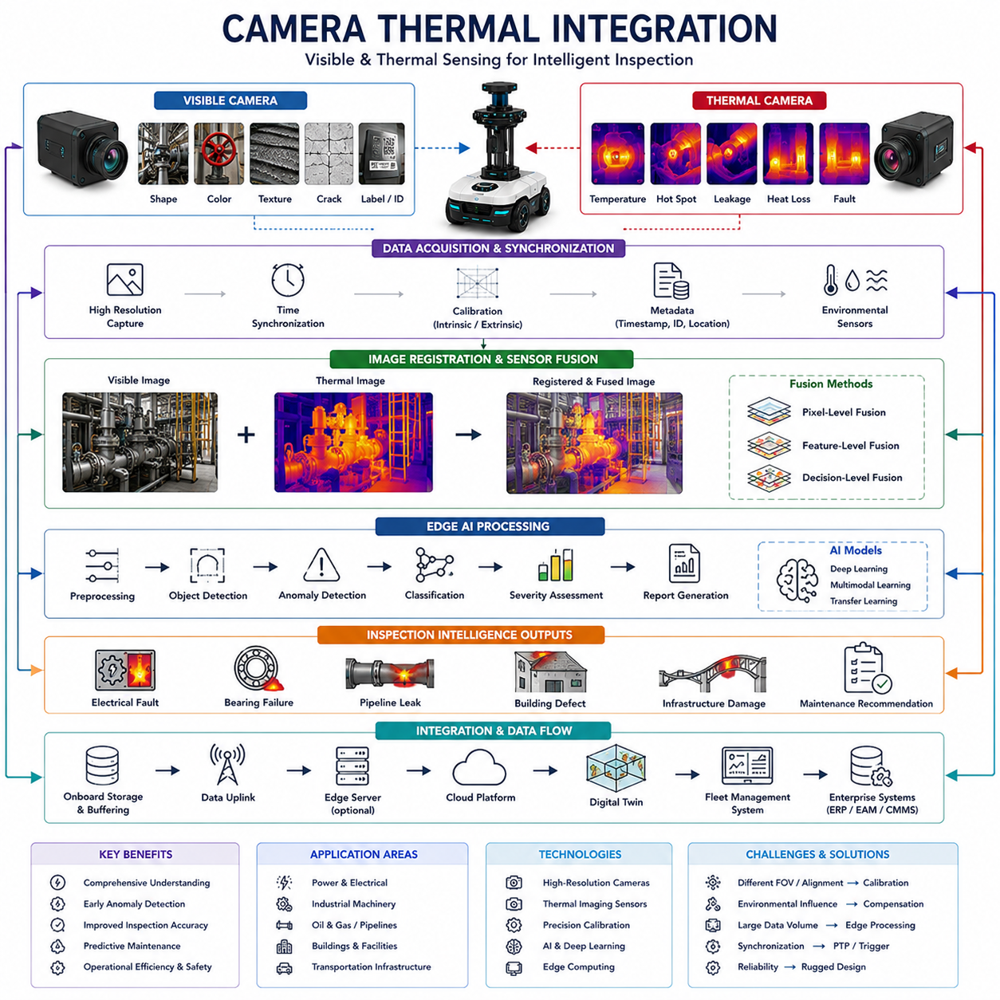
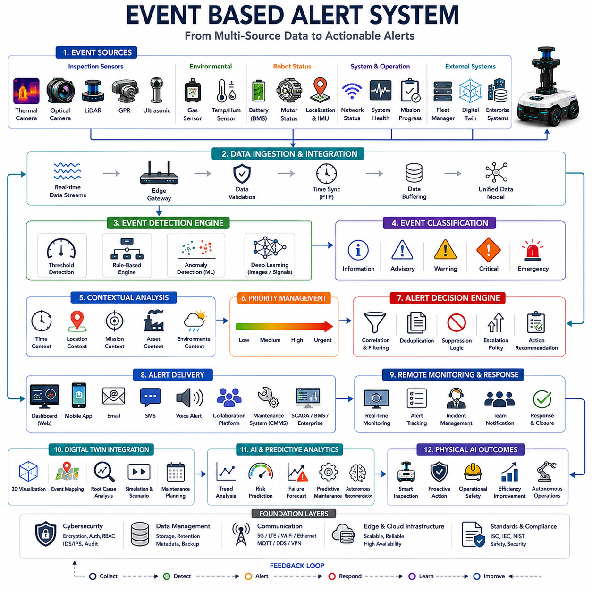
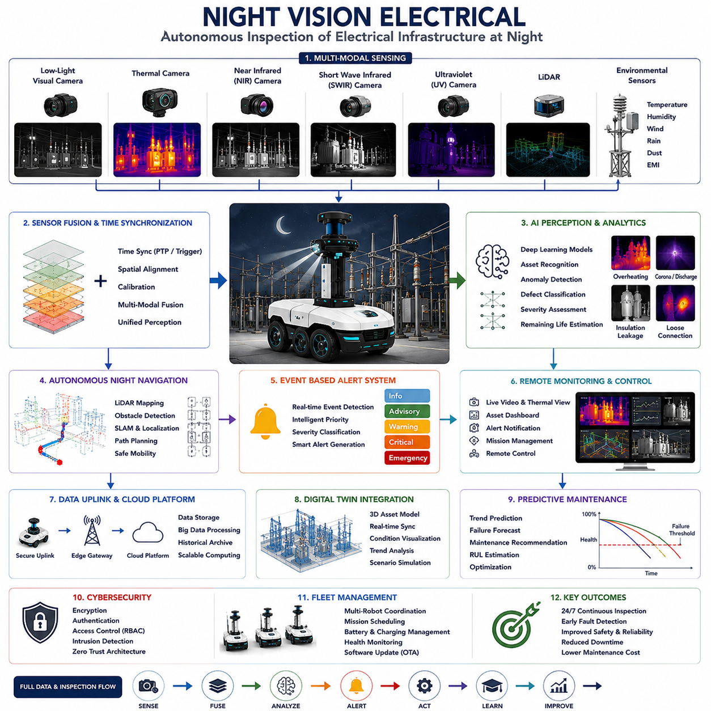
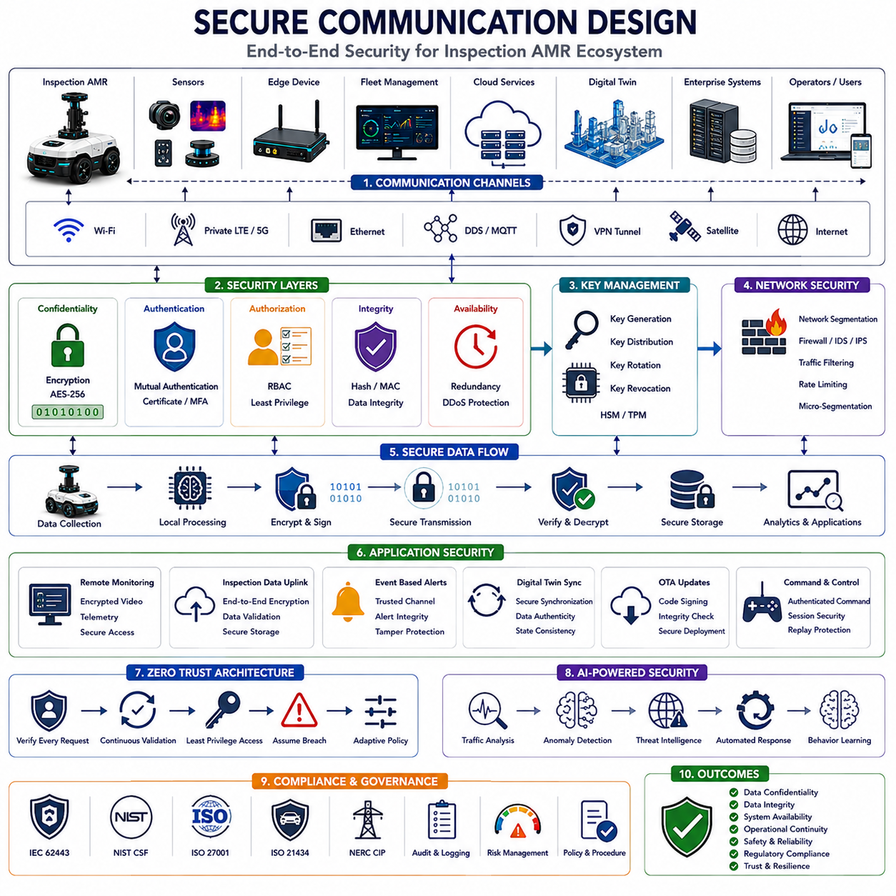
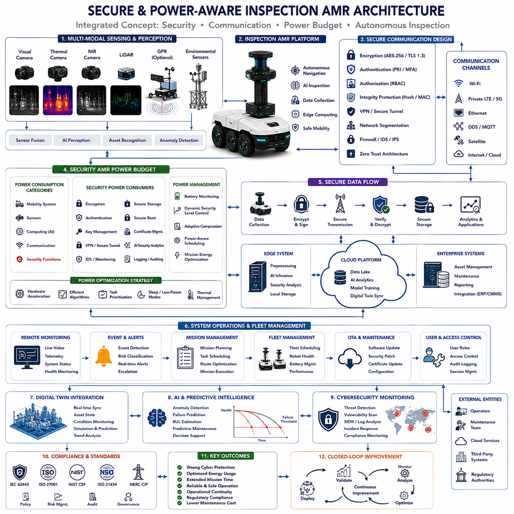

**Volume 13 AMR Electrical Architecture**

# Chapter 5. Security AMR

## 5.1 Camera Thermal Integration

{width="7.268055555555556in" height="7.268055555555556in"}

# 05_01 Camera Thermal Integration (카메라-열화상 통합)

Camera Thermal Integration(카메라-열화상 통합)은 현대 Inspection AMR(점검용 자율주행 이동로봇) 시스템에서 가장 중요한 센서 통합 아키텍처 중 하나이다. 산업 설비, 철도, 공항, 발전소, 물류센터, 스마트시티, 에너지 시설 및 국가 기반 시설에서 자율 점검 기술이 확대되면서 가시광 카메라(Visible-Light Camera)와 Thermal Camera(열화상 카메라)를 결합하는 기술은 지능형 상태 모니터링과 Predictive Maintenance(예지보전)의 핵심 요소가 되고 있다.

일반 카메라는 대상의 형상, 색상, 표면 상태, 구조적 특징 및 환경 정보를 제공한다. 반면 Thermal Camera는 사람의 눈으로 볼 수 없는 온도 분포와 열적 이상 현상을 탐지할 수 있다. 이 두 센서를 결합하면 단일 센서로는 확인할 수 없는 다양한 결함과 이상 현상을 발견할 수 있다.

과거에는 육안 검사(Visual Inspection)와 열화상 검사(Thermal Inspection)가 별도의 장비와 별도의 검사자에 의해 수행되었다. 육안 검사는 균열, 부식, 변형, 누유, 오염 및 구조적 손상을 확인하는 데 사용되었다. 열화상 검사는 과열된 전기 설비, 절연 불량, 베어링 마모, 마찰열 증가, 유체 누출 및 숨겨진 결함을 탐지하는 데 활용되었다.

그러나 두 검사가 분리되어 수행되면 검사 효율이 낮아지고 데이터 간 연관성을 확보하기 어렵다. Camera Thermal Integration은 이러한 문제를 해결하기 위해 가시광 영상과 열화상 영상을 동시에 수집하고 분석하는 통합 점검 체계를 제공한다.

Camera Thermal Integration의 가장 중요한 목적은 가시광 정보와 열 정보를 하나의 통합 환경 모델로 만드는 것이다.

이를 통해 시스템은 단순히 대상이 어떻게 보이는지를 이해하는 수준을 넘어 대상이 어떤 열적 상태를 가지는지까지 동시에 이해할 수 있게 된다.

Visible-Light Camera(가시광 카메라)는 인간의 눈이 인식할 수 있는 파장의 빛을 감지한다.

이를 통해 형상, 색상, 텍스처(Texture), 표면 손상, 라벨 정보 및 구조적 특징을 고해상도로 기록할 수 있다.

현대 산업용 카메라는 수백만 화소(Megapixel) 이상의 해상도를 제공하며 자동 결함 탐지와 객체 인식에 활용된다.

Thermal Camera는 적외선(Infrared Radiation)을 측정한다.

절대온도 0K 이상인 모든 물체는 적외선을 방출하며, Thermal Camera는 이를 측정하여 온도 분포를 영상으로 표현한다.

따라서 Thermal Camera는 일반 카메라가 볼 수 없는 과열, 냉각 이상, 단열 불량, 마찰열 증가 및 열 누설 현상을 탐지할 수 있다.

두 센서를 결합하면 강력한 검사 능력을 얻을 수 있다.

예를 들어 일반 카메라는 파이프 표면의 부식을 식별할 수 있으며, Thermal Camera는 내부 유체 누출로 인해 발생하는 비정상적인 온도 변화를 동시에 확인할 수 있다.

전기 설비에서는 Thermal Camera가 과열 부위를 찾고, 일반 카메라는 해당 부품의 식별 정보를 제공할 수 있다.

현대 Camera Thermal Integration Architecture(카메라-열화상 통합 아키텍처)는 센서 선정 단계에서부터 시작된다.

각 응용 분야에 따라 해상도, 시야각(Field of View), Thermal Sensitivity(열 감도), 프레임 속도(Frame Rate), 내환경성(Environmental Durability), 통신 인터페이스 및 보정 요구사항이 달라진다.

따라서 두 센서는 개별 성능뿐 아니라 통합 운용을 고려하여 선정되어야 한다.

Mechanical Integration(기계적 통합)은 가장 먼저 해결해야 할 과제이다.

일반 카메라와 Thermal Camera는 동일한 영역을 관찰할 수 있도록 장착되어야 한다.

이를 위해 구조물은 진동, 충격, 먼지, 습기 및 온도 변화에 강해야 하며 장기간 안정성을 유지해야 한다.

Field-of-View Matching(시야각 일치)은 매우 중요하다.

두 카메라가 서로 다른 영역을 바라본다면 데이터 융합이 어렵다.

따라서 렌즈 선정과 장착 위치를 최적화하여 가능한 한 동일한 영역을 촬영하도록 설계한다.

일부 산업용 시스템은 가시광 카메라와 열화상 카메라를 하나의 하우징(Housing)에 통합하여 제공하기도 한다.

Calibration(보정)은 Camera Thermal Integration의 핵심 요소이다.

Intrinsic Calibration(내부 보정)은 렌즈 왜곡, 초점거리, 광학 특성을 보정한다.

Extrinsic Calibration(외부 보정)은 두 센서 사이의 상대 위치와 방향을 계산한다.

정확한 보정을 통해 열화상 데이터와 가시광 데이터를 정확히 겹쳐서 표현할 수 있다.

Time Synchronization(시간 동기화)도 매우 중요하다.

일반 카메라와 Thermal Camera는 서로 다른 프레임 속도로 동작하는 경우가 많다.

동일한 순간에 촬영되지 않으면 움직이는 대상의 위치가 달라질 수 있다.

이를 해결하기 위해 Precision Time Protocol(PTP), Hardware Trigger(하드웨어 트리거), Pulse Synchronization(펄스 동기화) 등이 사용된다.

Data Acquisition Architecture(데이터 수집 아키텍처)는 두 종류의 영상을 동시에 처리해야 한다.

일반 카메라는 고해상도 영상을 제공하며 수십에서 수백 fps(Frame Per Second)로 동작할 수 있다.

Thermal Camera는 일반적으로 더 낮은 해상도를 가지지만 온도 정보를 제공한다.

수집 소프트웨어는 두 데이터를 동기화하고 메타데이터를 유지하면서 효율적으로 저장해야 한다.

Thermal Image Interpretation(열화상 해석)은 일반 영상 처리보다 복잡하다.

열화상 데이터는 Emissivity(방사율), 대기 상태, 촬영 각도, 표면 재질 및 센서 보정 상태의 영향을 받는다.

따라서 정확한 온도 분석을 위해 Environmental Sensor(환경 센서)와 보정 알고리즘이 함께 사용된다.

Image Registration(영상 정합)은 두 영상을 정렬하는 과정이다.

열화상 이미지와 일반 이미지를 동일한 좌표계에 맞추어야 한다.

이를 위해 Feature-Based Registration(특징 기반 정합), Geometric Transformation(기하학 변환), Machine Learning(머신러닝) 기반 정합 기술이 사용된다.

Sensor Fusion(센서 융합)은 Camera Thermal Integration의 핵심 기능이다.

Pixel-Level Fusion(픽셀 수준 융합)은 두 이미지를 직접 결합한다.

Feature-Level Fusion(특징 수준 융합)은 특징점을 추출하여 결합한다.

Decision-Level Fusion(결정 수준 융합)은 각각의 분석 결과를 결합한다.

각 방식은 계산량과 성능 측면에서 장단점이 존재한다.

Artificial Intelligence(AI)는 Camera Thermal Integration 발전의 핵심 동력이다.

Deep Learning(딥러닝)은 열화상 데이터와 가시광 데이터를 동시에 분석하여 결함을 탐지하고 이상을 분류하며 유지보수 필요성을 예측할 수 있다.

멀티모달 AI(Multimodal AI)는 단일 센서 기반 AI보다 높은 정확도를 제공한다.

Electrical Infrastructure Inspection(전기 설비 점검)은 대표적인 응용 분야이다.

Thermal Camera는 과열된 전선, 접속부, 변압기 및 배전반을 탐지한다.

일반 카메라는 해당 장비의 위치와 식별 정보를 제공한다.

AI는 이 정보를 결합하여 자동 점검 보고서를 생성할 수 있다.

Industrial Machinery Inspection(산업 기계 점검)에서도 큰 효과를 제공한다.

베어링, 모터, 기어박스, 펌프 및 컨베이어 시스템은 고장 전 과도한 열을 발생시키는 경우가 많다.

Thermal Camera는 열 이상을 감지하고 일반 카메라는 물리적 손상이나 오염 상태를 확인한다.

Building Inspection(건물 점검)에서는 단열 불량, 습기 침투, 공기 누설, 지붕 결함 및 구조물 열화를 분석할 수 있다.

열화상 데이터는 에너지 손실 위치를 보여주며, 일반 영상은 해당 위치를 정확히 식별하게 해준다.

Pipeline Inspection(파이프라인 점검)에서는 누출, 부식, 단열재 손상 및 온도 이상을 탐지할 수 있다.

Thermal Camera는 온도 변화를 감지하고 일반 카메라는 실제 결함 위치를 기록한다.

Transportation Infrastructure Inspection(교통 인프라 점검)에서도 활용된다.

철도, 교량, 터널, 도로, 공항 및 항만 시설은 열 이상을 통해 숨겨진 구조적 문제를 발견할 수 있다.

Edge Computing(엣지 컴퓨팅)은 Camera Thermal Integration의 실시간 처리를 가능하게 한다.

로봇 내부 GPU와 AI Accelerator(인공지능 가속기)는 영상 수집, 정합, 센서 융합, 이상 탐지 및 AI 추론을 현장에서 수행한다.

이를 통해 통신량을 줄이고 즉각적인 의사결정을 가능하게 한다.

Data Management(데이터 관리)는 점점 더 중요해지고 있다.

열화상 이미지, 일반 이미지, 융합 데이터, AI 결과, 위치 정보, 보정 정보 및 메타데이터를 체계적으로 관리해야 한다.

이를 위해 Data Collection Architecture(데이터 수집 아키텍처), Inspection Data Uplink(점검 데이터 업링크), Remote Monitoring System(원격 모니터링 시스템)이 함께 동작한다.

Cybersecurity(사이버보안)도 필수적이다.

산업 시설, 국가 기반 시설 및 군사 시설의 이미지 데이터는 민감한 정보를 포함할 수 있다.

따라서 Encryption(암호화), Authentication(인증), Access Control(접근 제어), Audit Logging(감사 로그)이 적용된다.

Digital Twin Integration(디지털 트윈 통합)은 Camera Thermal Integration의 가치를 더욱 높인다.

열화상 데이터와 일반 영상은 Digital Twin을 지속적으로 업데이트한다.

이를 통해 상태 추적, 열화 분석, 수명 예측 및 유지보수 계획 수립이 가능해진다.

Fleet Management(플릿 관리) 환경에서는 여러 대의 Inspection AMR이 동시에 열화상 및 일반 영상을 수집한다.

Fleet Manager는 센서 구성, 보정 상태, 데이터 품질, AI 모델 버전 및 점검 결과를 통합 관리한다.

미래에는 Physical AI(피지컬 AI), Foundation Model(파운데이션 모델), Multimodal Learning(멀티모달 학습), Autonomous Decision Making(자율 의사결정) 기술과 결합되어 더욱 발전하게 될 것이다.

AI는 영상과 온도 간의 복잡한 관계를 학습하여 고장을 조기에 탐지하고 보다 정확한 상태 평가를 수행하게 된다.

Inspection AMR Architecture(점검용 AMR 아키텍처) 관점에서 Camera Thermal Integration은 보이는 세계와 보이지 않는 세계를 연결하는 핵심 인지 계층(Perception Layer)이다. 일반 영상이 제공하는 시각 정보와 Thermal Intelligence(열 기반 지능)를 결합함으로써 로봇은 설비 상태를 보다 정확하게 이해하고, 문제를 조기에 발견하며, 유지보수 효율을 향상시킬 수 있다. 향후 Autonomous Inspection(자율 점검), Digital Twin, Predictive Maintenance 및 Physical AI 생태계가 확대될수록 Camera Thermal Integration은 가장 가치 있는 핵심 센서 기술 중 하나로 자리잡게 될 것이다.

## 5.2 Event Based Alert System

{width="7.268055555555556in" height="7.268055555555556in"}

# 05_02 Event Based Alert System (이벤트 기반 경보 시스템)

Event Based Alert System(이벤트 기반 경보 시스템)은 현대 Inspection AMR(점검용 자율주행 이동로봇) 아키텍처에서 가장 중요한 운영 지능(Operational Intelligence) 구성 요소 중 하나이다. 점검 로봇이 산업 설비, 철도, 공항, 항만, 발전소, 물류센터, 스마트시티 및 국가 기반 시설에 광범위하게 적용되면서 중요한 사건(Event)을 자동으로 감지하고 적절한 사용자에게 즉시 알리는 기능은 필수 요소가 되고 있다.

Inspection AMR은 수많은 센서를 통해 지속적으로 데이터를 수집하지만, 모든 데이터가 즉각적인 사람의 개입을 필요로 하는 것은 아니다. 실제로 대부분의 데이터는 정상 상태를 나타내며, 극히 일부만이 운영자나 유지보수 담당자의 주의를 필요로 한다.

Event Based Alert System의 가장 중요한 목적은 지속적으로 생성되는 데이터 스트림(Data Stream) 속에서 의미 있는 사건을 찾아내고, 중요도를 판단하며, 적절한 사용자에게 적절한 시점에 전달하는 것이다.

과거에는 운영자가 직접 센서 화면을 관찰하면서 이상 여부를 판단해야 했다. 그러나 현대 Inspection AMR은 Thermal Camera(열화상 카메라), Optical Camera(광학 카메라), LiDAR, Ultrasonic Sensor(초음파 센서), Vibration Monitoring System(진동 모니터링 시스템), Ground Penetrating Radar(GPR, 지표투과레이더), Gas Detector(가스 감지기), Environmental Sensor(환경 센서), Battery Management System(BMS), Localization System(위치 추정 시스템), AI Inference Engine(AI 추론 엔진) 등을 동시에 운영한다.

이처럼 수십 개의 센서가 생성하는 데이터를 사람이 직접 모니터링하는 것은 사실상 불가능하다. Event Based Alert System은 이러한 과정을 자동화하여 중요한 상황을 실시간으로 식별한다.

이 시스템의 핵심 목적은 단순히 알림(Notification)을 생성하는 것이 아니다.

올바른 정보를, 올바른 사람에게, 올바른 시점에 전달하는 것이 가장 중요하다.

경보가 지나치게 많으면 Alert Fatigue(경보 피로 현상)가 발생하여 운영자가 중요한 경보를 놓칠 수 있다.

반대로 경보가 부족하면 실제 위험 상황이 감지되지 않을 수 있다.

따라서 Event Based Alert System은 민감도(Sensitivity), 정확도(Accuracy), 우선순위(Priority), 운영 가치(Operational Relevance) 사이의 균형을 유지해야 한다.

Inspection AMR 환경에서 Event(이벤트)는 시스템 상태 변화, 이상 현상, 센서 관측 결과, 안전 사고, 환경 변화, 운영 상태 변화, 검사 결과 또는 유지보수 필요성을 의미한다.

이벤트는 센서, 소프트웨어, 통신 네트워크, AI 분석 엔진, Digital Twin(디지털 트윈), Fleet Management System(플릿 관리 시스템), Enterprise System(기업 시스템) 등 다양한 소스에서 발생할 수 있다.

Sensor Event(센서 이벤트)는 가장 일반적인 이벤트 유형이다.

Thermal Camera는 비정상적인 온도 상승을 감지할 수 있다.

Optical Camera는 균열, 부식, 누유, 구조 손상 및 결함을 발견할 수 있다.

LiDAR는 예상치 못한 장애물이나 환경 변화를 감지할 수 있다.

Gas Sensor는 유해 가스 누출을 발견할 수 있다.

Vibration Monitoring System은 기계의 이상 진동을 탐지할 수 있다.

GPR은 지하 공동(Void), 매설물 이상, 구조물 열화를 발견할 수 있다.

이러한 관측 결과는 모두 이벤트가 될 수 있다.

Operational Event(운영 이벤트)는 로봇 자체 상태와 관련된다.

배터리 잔량 부족, 위치 추정 실패, 임무 지연, 경로 이탈, 통신 장애, 센서 오류, 저장 공간 부족, CPU 과열, 하드웨어 성능 저하 등이 이에 해당한다.

운영 이벤트는 로봇 가용성(Availability)과 임무 성공률을 유지하기 위해 매우 중요하다.

Safety Event(안전 이벤트)는 가장 높은 우선순위를 가진다.

Inspection AMR은 사람, 차량, 산업 장비, 전력 설비 및 위험 지역 근처에서 운용될 수 있다.

Emergency Stop(E-Stop, 비상 정지), 충돌 위험, 안전 구역 침범, 위험 물질 감지, 작업자 접근, 안전 센서 고장 등은 즉각적인 대응이 필요한 이벤트이다.

이벤트 기반 경보 시스템은 일반적으로 Continuous Data Ingestion(연속 데이터 수집) 단계에서 시작된다.

센서, 로봇 제어기, Fleet Manager, Edge Computer(엣지 컴퓨터), Cloud Service(클라우드 서비스), Digital Twin 및 기업 시스템으로부터 데이터가 지속적으로 수집된다.

이후 Event Detection Engine(이벤트 탐지 엔진)이 정상 상태와 비정상 상태를 구분한다.

가장 단순한 방식은 Threshold-Based Detection(임계값 기반 탐지)이다.

예를 들어 배터리 잔량이 20% 이하가 되면 경고를 발생시킬 수 있다.

모터 온도가 허용 범위를 초과하면 과열 경보를 생성할 수 있다.

통신 지연시간이 기준치를 넘으면 네트워크 이상 경보를 생성할 수 있다.

Threshold-Based Detection은 단순하고 이해하기 쉽기 때문에 여전히 널리 사용된다.

보다 발전된 방식은 Rule-Based Engine(규칙 기반 엔진)이다.

온도 상승과 진동 증가가 동시에 발생하면 베어링 마모를 의심할 수 있다.

전류 증가와 온도 상승이 함께 발생하면 전기 설비 고장을 추정할 수 있다.

이처럼 여러 조건을 결합하여 경보 정확도를 높일 수 있다.

Machine Learning(머신러닝)은 더욱 강력한 탐지 능력을 제공한다.

머신러닝 모델은 정상 상태를 학습하고 이상 패턴을 자동으로 탐지할 수 있다.

이를 통해 사람이 정의하지 못한 복잡한 이상 현상도 발견할 수 있다.

Predictive Maintenance(예지보전) 분야에서 특히 큰 효과를 제공한다.

Deep Learning(딥러닝)은 더욱 복잡한 멀티모달 데이터(Multimodal Data)를 처리할 수 있다.

Thermal Image(열화상 이미지), Visual Image(광학 이미지), Vibration Signal(진동 신호), Acoustic Data(음향 데이터), Environmental Data(환경 데이터)를 동시에 분석할 수 있다.

이를 통해 특정 고장 유형과 연관된 복합 패턴을 인식할 수 있다.

Event Classification(이벤트 분류)은 탐지 이후 수행된다.

모든 이벤트가 동일한 중요도를 가지는 것은 아니다.

일반적으로 Informational(정보), Advisory(주의), Warning(경고), Critical(심각), Emergency(비상) 단계로 분류된다.

분류 결과는 대응 우선순위를 결정하는 데 사용된다.

Prioritization(우선순위 관리)은 매우 중요하다.

예를 들어 네트워크 속도 저하는 정보 수준 이벤트일 수 있지만, 유독 가스 누출은 비상 수준 이벤트가 될 수 있다.

적절한 우선순위 설정은 운영자가 가장 중요한 문제에 집중하도록 도와준다.

Context Awareness(상황 인식)는 최신 Event Based Alert System의 핵심 기능이다.

같은 이벤트라도 상황에 따라 의미가 달라질 수 있다.

예를 들어 고부하 운전 중 발생한 온도 상승은 정상일 수 있지만, 정지 상태에서 발생한 온도 상승은 심각한 문제일 수 있다.

따라서 시스템은 운영 상황, 환경 조건, 임무 상태, 장비 특성을 함께 고려한다.

Temporal Analysis(시간 기반 분석)는 이벤트 해석 정확도를 향상시킨다.

일시적인 온도 상승은 문제가 아닐 수 있지만 지속적으로 증가하는 온도 추세는 고장 전조 현상일 수 있다.

따라서 시스템은 변화율(Rate of Change), 추세(Trend), 과거 데이터(Historical Data)를 함께 분석한다.

Spatial Awareness(공간 인식)도 중요하다.

Inspection Event는 특정 설비, 특정 위치, 특정 자산과 연결된다.

정확한 위치 정보는 경보의 가치를 크게 향상시킨다.

GIS(Geographic Information System), Facility Map(시설 지도), Digital Twin과의 연동은 문제 위치를 직관적으로 표시할 수 있게 해준다.

Digital Twin Integration(디지털 트윈 통합)은 Event Based Alert System의 강력한 기능이다.

실제 설비에서 발생한 이벤트는 Digital Twin 상에서 즉시 표시될 수 있다.

운영자는 가상 환경에서 문제 위치를 확인하고 원인을 분석할 수 있다.

Notification Delivery Architecture(알림 전달 아키텍처)는 이벤트를 사용자에게 전달하는 역할을 한다.

Dashboard(대시보드), Mobile App(모바일 애플리케이션), Email, SMS, Voice Notification(음성 알림), Collaboration Platform(협업 플랫폼), Maintenance Management System(유지보수 관리 시스템) 등 다양한 채널을 사용할 수 있다.

Role-Based Notification(역할 기반 알림)은 사용자별 맞춤 경보를 제공한다.

유지보수 엔지니어는 장비 관련 경보를 받는다.

안전 담당자는 위험 상황 경보를 받는다.

Fleet Manager는 운영 상태 경보를 받는다.

경영진은 KPI 및 운영 성과 정보를 받을 수 있다.

Remote Monitoring System(원격 모니터링 시스템)은 Event Based Alert System과 밀접하게 연결된다.

모니터링 시스템이 전체 상태를 보여준다면, 경보 시스템은 즉각적인 대응이 필요한 사항을 강조한다.

Fleet Management System은 여러 대의 로봇에서 발생한 이벤트를 통합 분석할 수 있다.

이를 통해 개별 문제가 아닌 시스템 수준의 문제를 발견할 수 있다.

Inspection-Specific Alerting(검사 특화 경보)은 점검 로봇의 특징적인 기능이다.

Inspection AMR은 단순히 자신의 상태만 감시하는 것이 아니라 검사 대상의 상태도 평가한다.

따라서 균열(Crack), 부식(Corrosion), 절연 불량, 열화, 누설, 구조 손상 등의 검사 결과가 이벤트로 생성될 수 있다.

Cybersecurity Monitoring(사이버보안 모니터링)도 중요한 분야이다.

인증 실패, 비정상 네트워크 활동, 무단 접근 시도, 소프트웨어 무결성 오류 및 침입 징후를 감지하여 경보를 생성할 수 있다.

Scalability(확장성)는 필수 요구사항이다.

대규모 조직에서는 수백 대의 로봇이 하루 수백만 건의 이벤트를 생성할 수 있다.

따라서 Cloud-Native Architecture(클라우드 네이티브 아키텍처), Distributed Analytics Engine(분산 분석 엔진), Microservice Architecture(마이크로서비스 아키텍처), Message Broker(메시지 브로커)가 활용된다.

Human Factors Engineering(인간공학 설계)도 중요하다.

경보는 명확하고 이해하기 쉬워야 한다.

운영자는 무엇이 발생했는지, 어디에서 발생했는지, 왜 중요한지, 무엇을 해야 하는지를 즉시 이해할 수 있어야 한다.

미래의 Event Based Alert System은 Physical AI(피지컬 AI), Foundation Model(파운데이션 모델), Autonomous Reasoning Engine(자율 추론 엔진), Predictive Analytics(예측 분석)와 결합될 것이다.

단순히 이벤트를 보고하는 수준을 넘어 미래 상황을 예측하고 위험을 평가하며 대응 전략을 추천하게 될 것이다.

Inspection AMR Architecture 관점에서 Event Based Alert System은 운영 신경망(Operational Nervous System) 역할을 수행한다. 이 시스템은 센서가 생성한 데이터를 실행 가능한 정보(Actionable Intelligence)로 변환하고, 중요한 사건을 탐지하고 해석하며 우선순위를 부여한 뒤 적절한 사용자에게 전달한다. 향후 산업 설비, 철도, 항만, 공항, 에너지 시설, 국방 및 스마트시티 분야에서 자율 점검 시스템이 확대될수록 Event Based Alert System은 안전성, 운영 효율성 및 자율성을 보장하는 핵심 기술로 자리잡게 될 것이다.

## 5.3 Night Vision Electrical

{width="7.268055555555556in" height="7.268055555555556in"}

# 05_03 Night Vision Electrical (야간 전기 설비 점검 시스템)

Night Vision Electrical(야간 전기 설비 점검 시스템)은 저조도 영상 기술(Low-Light Imaging), Thermal Imaging(열화상 기술), 지능형 조명 제어(Intelligent Illumination Control), Artificial Intelligence(AI), 그리고 Inspection AMR(점검용 자율주행 이동로봇)을 결합하여 야간 또는 저조도 환경에서 전기 설비를 점검하는 전문 기술 분야이다.

현대 산업은 24시간 연속 운영 체계로 발전하고 있으며, 이에 따라 전기 설비 점검 역시 주간에만 수행될 수 없다. 변전소(Substation), 배전 설비(Power Distribution System), 철도 전력 시스템(Railway Power System), 공항 전기 설비(Airport Electrical Network), 제조 공장(Manufacturing Plant), 물류센터(Logistics Center), 스마트시티(Smart City), 신재생 에너지 시설(Renewable Energy Facility) 및 국가 기반 시설(Critical Infrastructure)은 주야간 구분 없이 지속적인 점검이 필요하다.

Night Vision Electrical 시스템은 어두운 환경에서도 Inspection AMR이 안정적으로 전기 설비를 점검할 수 있도록 지원하며, 높은 탐지 정확도와 운영 효율성을 제공한다.

과거 야간 전기 설비 점검은 손전등(Flashlight), 휴대용 조명 장비(Portable Lighting System) 및 육안 검사(Visual Inspection)에 의존하였다. 이러한 방식은 작업 효율이 낮고 안전 위험이 높으며 미세한 결함을 발견하기 어려웠다.

야간에는 시각적 기준점이 부족하기 때문에 작업자의 피로도가 증가하며, 일부 결함은 오히려 발견하기 어려워질 수 있다. 그러나 반대로 특정 전기 현상은 어두운 환경에서 더욱 잘 관찰된다.

Corona Discharge(코로나 방전), Electrical Arc(전기 아크), Insulation Leakage(절연 누설), Overheated Conductor(과열된 전선), Thermal Anomaly(열 이상), Ultraviolet Emission(자외선 방출) 등은 야간 환경에서 더욱 쉽게 관찰될 수 있다.

따라서 Night Vision Electrical 시스템은 단순히 어둠을 극복하는 기술이 아니라 야간 환경이 제공하는 고유한 검사 이점을 적극 활용하는 기술이라고 할 수 있다.

Night Vision Electrical Architecture(야간 전기 설비 점검 아키텍처)의 주요 목표는 모든 조도 환경에서 안정적이고 지능적인 전기 설비 모니터링을 수행하는 것이다.

이를 위해 가시광 카메라(Visible-Light Camera), Thermal Camera(열화상 카메라), Near Infrared Camera(NIR, 근적외선 카메라), Short Wave Infrared Camera(SWIR, 단파장 적외선 카메라), Ultraviolet Camera(UV Camera, 자외선 카메라), LiDAR, Environmental Sensor(환경 센서) 및 AI 기반 인지 시스템을 통합한다.

Visible-Light Camera는 여전히 중요한 역할을 수행한다.

최신 산업용 저조도 카메라는 CMOS Sensor(상보성 금속 산화막 반도체 센서), Large Pixel Technology(대형 픽셀 기술), HDR(High Dynamic Range), Image Stacking(영상 누적 기술), Noise Reduction Algorithm(노이즈 제거 알고리즘)을 이용하여 매우 낮은 조도에서도 유용한 영상을 생성할 수 있다.

이를 통해 설비 외관, 부식, 라벨, 장비 식별 정보, 구조 손상 및 주변 환경 정보를 확인할 수 있다.

Near Infrared Imaging(NIR 영상)은 일반 카메라보다 어두운 환경에서 더 뛰어난 성능을 제공한다.

근적외선 카메라는 사람이 인식하지 못하는 파장을 활용하여 어두운 환경에서도 선명한 영상을 제공할 수 있다.

Active Infrared Illumination(능동형 적외선 조명)을 함께 사용하면 작업자에게 방해를 주지 않으면서도 안정적인 영상 확보가 가능하다.

Thermal Imaging(열화상 영상)은 Night Vision Electrical의 가장 중요한 기술 중 하나이다.

열화상 카메라는 빛을 반사하여 측정하는 것이 아니라 물체가 방출하는 적외선 에너지를 직접 측정한다.

따라서 조도와 무관하게 동작할 수 있다.

전기 설비는 동작 과정에서 열을 발생시키며, 비정상적인 온도 상승은 고장의 초기 징후인 경우가 많다.

Thermal Camera는 과부하된 전선, 접속 불량, 절연 열화, 변압기 이상, 차단기 고장, 냉각 시스템 문제 등을 조기에 탐지할 수 있다.

특히 야간에는 태양광에 의한 열 영향이 줄어들어 열화상 대비(Thermal Contrast)가 증가하므로 더욱 정확한 분석이 가능하다.

Ultraviolet Detection(자외선 탐지)은 고전압 설비 점검에서 매우 중요한 역할을 한다.

전기 설비의 Corona Discharge, Partial Discharge(부분 방전), Arc Fault(아크 결함) 및 절연 열화는 자외선 방출을 동반하는 경우가 많다.

특수 UV Camera는 이러한 현상을 감지하여 고장이 발생하기 전에 문제를 발견할 수 있다.

야간에는 태양광 자외선이 존재하지 않기 때문에 탐지 성능이 크게 향상된다.

특히 송전선, 변전소, 절연체 및 고전압 장비 점검에서 매우 유용하다.

Short Wave Infrared Imaging(SWIR 영상)은 안개, 연기, 먼지 및 특정 대기 조건을 통과하는 능력이 우수하다.

따라서 혹독한 환경에서도 안정적인 전기 설비 점검을 수행할 수 있다.

Sensor Fusion(센서 융합)은 Night Vision Electrical 시스템의 핵심 기술이다.

열화상 카메라는 온도 정보를 제공하지만 장비 식별에는 한계가 있다.

가시광 카메라는 장비를 식별할 수 있지만 온도를 측정할 수 없다.

UV Camera는 방전을 감지할 수 있지만 구조 정보를 제공하지 못한다.

AI 기반 Sensor Fusion은 이러한 정보를 통합하여 하나의 종합적인 상태 정보를 생성한다.

Time Synchronization(시간 동기화)은 매우 중요하다.

여러 센서가 동시에 동작하므로 Precision Time Protocol(PTP), Hardware Trigger(하드웨어 트리거), Central Timing Controller(중앙 시간 제어기)를 이용하여 데이터를 정확히 동기화해야 한다.

이를 통해 동일한 장비에 대한 열 정보, 영상 정보, 자외선 정보 및 환경 정보를 하나의 사건으로 연결할 수 있다.

Electrical Asset Identification(전기 자산 식별)은 자동 점검 시스템에서 필수 기능이다.

대규모 변전소나 공장에는 수천 개의 전기 설비가 존재한다.

AI 기반 Computer Vision(컴퓨터 비전)은 Transformer(변압기), Circuit Breaker(차단기), Switchgear(개폐장치), Insulator(절연체), Cable Termination(케이블 단말), Battery System(배터리 시스템) 등을 자동으로 식별할 수 있다.

Artificial Intelligence(AI)는 Night Vision Electrical 기술 발전의 핵심 요소이다.

AI는 Thermal Image, Visible Image, UV Image, 환경 정보 및 운용 데이터를 동시에 분석하여 결함을 탐지하고 위험도를 평가하며 유지보수 우선순위를 제안할 수 있다.

Deep Learning(딥러닝)은 과열 접속부, 절연 열화, 오염, 습기 침투, 부분 방전 및 장비 노후화 패턴을 자동으로 인식할 수 있다.

Predictive Maintenance(예지보전)는 Night Vision Electrical 시스템의 가장 큰 가치 중 하나이다.

전기 설비는 일반적으로 갑자기 고장 나지 않는다.

대부분은 온도 상승, 부분 방전, 진동 증가, 환경 영향 및 전기적 스트레스와 같은 전조 현상을 보인다.

AI는 이러한 데이터를 분석하여 남은 수명(Remaining Useful Life)을 예측하고 유지보수 시점을 추천할 수 있다.

Autonomous Navigation(자율주행)은 야간 점검의 또 다른 핵심 기술이다.

Inspection AMR은 어두운 환경에서도 안전하게 이동해야 한다.

이를 위해 LiDAR, Stereo Vision(스테레오 비전), Depth Camera(깊이 카메라), IMU(Inertial Measurement Unit), Radar 및 Localization Algorithm(위치 추정 알고리즘)이 사용된다.

Environmental Awareness(환경 인식)도 중요하다.

온도, 습도, 풍속, 강수량, 먼지, 안개 및 전자기 간섭은 전기 설비 상태와 센서 성능에 영향을 미친다.

환경 센서는 이러한 정보를 제공하며 AI는 이를 고려하여 보다 정확한 분석을 수행한다.

Remote Monitoring System(원격 모니터링 시스템)은 Night Vision Electrical 시스템과 긴밀하게 연동된다.

Inspection AMR은 실시간으로 Telemetry Data(텔레메트리 데이터), Thermal Image, Inspection Result(점검 결과), Sensor Status(센서 상태)를 중앙 관제 시스템으로 전송한다.

운영자는 여러 대의 로봇을 동시에 모니터링할 수 있다.

Event Based Alert System(이벤트 기반 경보 시스템)은 중요한 이상 상황을 자동으로 보고한다.

과열 전선, 변압기 이상, 절연 열화, 무단 침입, 장비 고장 및 안전 위험이 발견되면 즉시 경보가 발생한다.

Inspection Data Uplink(점검 데이터 업링크)는 수집된 데이터를 Enterprise System(기업 시스템)과 Cloud Platform(클라우드 플랫폼)으로 전송한다.

고해상도 영상, 열화상 데이터, AI 분석 결과 및 Digital Twin 업데이트 정보가 중앙 서버로 전달된다.

Digital Twin Integration(디지털 트윈 통합)은 Night Vision Electrical의 가치를 더욱 높인다.

실제 전기 설비의 상태가 Digital Twin에 실시간으로 반영된다.

운영자는 설비 상태를 시각적으로 확인하고 열화 추세, 유지보수 계획 및 운영 시나리오를 분석할 수 있다.

Cybersecurity(사이버보안)는 필수 요구사항이다.

전기 설비는 국가 기반 시설인 경우가 많기 때문에 설비 상태, 점검 데이터 및 운영 정보는 반드시 보호되어야 한다.

이를 위해 Encryption(암호화), Authentication(인증), Secure Communication Protocol(보안 통신 프로토콜), Role-Based Access Control(RBAC), Intrusion Detection System(IDS) 및 Zero Trust Architecture(제로 트러스트 아키텍처)가 적용된다.

Fleet Management System(플릿 관리 시스템)은 여러 대의 점검 로봇을 통합 관리한다.

임무 스케줄링, 충전 관리, 소프트웨어 업데이트, 데이터 집계 및 운영 분석이 중앙에서 수행된다.

향후 Night Vision Electrical 시스템은 Physical AI(피지컬 AI), Foundation Model(파운데이션 모델), Multimodal Reasoning(멀티모달 추론), Autonomous Decision Making(자율 의사결정)과 결합될 것이다.

Inspection AMR은 단순한 데이터 수집 장비가 아니라 전기 설비를 이해하고 위험을 예측하며 유지보수 전략을 제안하는 지능형 인프라 관리 시스템으로 발전하게 될 것이다.

Inspection AMR Architecture 관점에서 Night Vision Electrical은 야간 및 저조도 환경에서 전기 설비를 감시하는 특화된 인지 및 분석 계층(Perception and Intelligence Layer)이다. Thermal Imaging, Low-Light Vision, Infrared Sensing, Ultraviolet Detection, AI Analytics, Autonomous Navigation 및 Digital Infrastructure Management를 통합함으로써 기존 점검 방식으로는 불가능했던 수준의 안전성, 신뢰성 및 자율성을 제공한다. 향후 전력 인프라와 스마트 에너지 시스템이 확대될수록 Night Vision Electrical은 차세대 자율 점검 생태계의 핵심 기술로 자리잡게 될 것이다.

## 5.4 Secure Communication Design

{width="7.268055555555556in" height="7.268055555555556in"}

# 05_04 Secure Communication Design (보안 통신 설계)

Secure Communication Design(보안 통신 설계)은 현대 Inspection AMR(점검용 자율주행 이동로봇) 시스템에서 가장 중요한 아키텍처 영역 중 하나이다. 점검 로봇이 Cloud Infrastructure(클라우드 인프라), Edge Computing System(엣지 컴퓨팅 시스템), Fleet Management Platform(플릿 관리 플랫폼), Digital Twin Environment(디지털 트윈 환경), Enterprise Network(기업 네트워크), Artificial Intelligence Ecosystem(AI 생태계)와 지속적으로 연결되면서 통신 보안은 선택 사항이 아니라 필수 요소가 되었다.

Inspection AMR은 산업 설비, 발전소, 철도, 공항, 항만, 스마트시티, 제조 공장, 국방 시설 및 국가 기반 시설에서 운영되며 대량의 센서 데이터, 진단 정보, 위치 정보, 운영 데이터 및 검사 결과를 지속적으로 교환한다. 강력한 보안 체계가 없다면 이러한 시스템은 Cyber Attack(사이버 공격), Unauthorized Access(무단 접근), Data Manipulation(데이터 변조), Operational Disruption(운영 방해), Intellectual Property Theft(지적 재산 탈취) 및 Infrastructure Compromise(인프라 침해)에 노출될 수 있다.

과거 산업 자동화 시스템은 외부 네트워크와 분리된 상태에서 운영되었다. 그러나 Industry 4.0(인더스트리 4.0), Industrial Internet of Things(산업용 사물인터넷), Cloud Analytics(클라우드 분석), Remote Monitoring(원격 모니터링), Digital Twin, Predictive Maintenance(예지보전), Autonomous Robotics(자율 로봇)의 등장으로 연결성이 급격히 증가하였다.

이로 인해 Inspection AMR은 Cyber-Physical System(사이버 물리 시스템)의 대표적인 형태가 되었으며, Secure Communication Design은 전체 시스템의 안전성과 신뢰성을 보장하는 핵심 기술이 되었다.

Secure Communication Design의 가장 중요한 목적은 로봇, 센서, 엣지 장치, 클라우드, 운영자 및 기업 시스템 사이에서 교환되는 모든 정보가 Confidentiality(기밀성), Integrity(무결성), Authenticity(진위성), Availability(가용성)을 유지하도록 보장하는 것이다.

이는 데이터 보호뿐 아니라 운영 연속성, 안전성, 자산 보호, 규제 준수 및 조직 신뢰성까지 포함하는 개념이다.

현대 Inspection AMR은 다양한 시스템과 통신한다.

센서는 Onboard Computer(온보드 컴퓨터)로 데이터를 전송한다.

Telemetry Data(텔레메트리 데이터)는 Remote Monitoring Platform(원격 모니터링 플랫폼)으로 전달된다.

Inspection Result(검사 결과)는 Cloud Analytics Platform(클라우드 분석 플랫폼)으로 업로드된다.

Fleet Manager는 Mission Assignment(임무 할당)를 로봇에 전송한다.

OTA(Over-the-Air) Update System은 소프트웨어를 배포한다.

Operator(운영자)는 Remote Control Interface(원격 제어 인터페이스)를 통해 로봇을 관리한다.

이 모든 통신 경로는 잠재적인 공격 대상이 될 수 있다.

Confidentiality(기밀성)는 보안 설계의 가장 기본적인 요구사항이다.

Inspection AMR은 산업 공정, 설비 상태, 시설 구조, 유지보수 정보, 운영 일정 및 기업 기밀과 관련된 데이터를 수집할 수 있다.

이러한 정보가 외부에 유출되면 심각한 경제적 손실과 보안 위협이 발생할 수 있다.

이를 방지하기 위해 Encryption(암호화)이 적용된다.

Encryption은 읽을 수 있는 데이터를 암호문으로 변환하여 권한이 있는 사용자만 접근할 수 있도록 한다.

현대 로봇 시스템은 일반적으로 AES(Advanced Encryption Standard) 기반 암호화를 사용한다.

특히 AES-256은 높은 수준의 보안을 제공하면서도 실시간 처리 성능을 유지할 수 있기 때문에 널리 사용된다.

암호화는 저장 데이터와 전송 데이터 모두에 적용될 수 있다.

Transport Layer Security(TLS)는 가장 널리 사용되는 보안 통신 프로토콜이다.

TLS는 로봇과 클라우드, Fleet Management System, Digital Twin, Enterprise Application(기업 애플리케이션) 간 통신을 보호한다.

TLS는 Encryption, Authentication(인증), Integrity Verification(무결성 검증), Secure Key Exchange(보안 키 교환)를 제공한다.

현재는 TLS 1.3 이상이 권장된다.

Authentication은 통신하는 개체가 실제로 신뢰할 수 있는 대상인지 확인하는 과정이다.

로봇은 명령을 보내는 시스템이 실제 Fleet Manager인지 확인해야 한다.

클라우드는 연결을 시도하는 장치가 실제 로봇인지 확인해야 한다.

인증 방식으로는 Password(비밀번호), Digital Certificate(디지털 인증서), Cryptographic Key(암호키), Hardware Security Module(HSM), Multi-Factor Authentication(MFA, 다중 인증)이 사용된다.

Public Key Infrastructure(PKI, 공개키 기반 구조)는 현대 인증 체계의 핵심이다.

PKI는 비대칭 암호화(Asymmetric Cryptography)를 사용하여 분산된 시스템 간 신뢰를 구축한다.

Certificate Authority(CA, 인증기관)가 발급한 인증서를 통해 로봇과 서버는 서로를 검증할 수 있다.

Authorization(권한 관리)은 인증 이후 수행되는 과정이다.

인증이 "누구인가"를 확인하는 것이라면, 권한 관리는 "무엇을 할 수 있는가"를 결정한다.

운영자, 유지보수 엔지니어, Fleet Manager, 보안 관리자, AI 시스템은 각각 다른 권한을 가져야 한다.

Role-Based Access Control(RBAC, 역할 기반 접근 제어)은 이러한 권한 관리를 구현하는 대표적인 방법이다.

Integrity Protection(무결성 보호)은 데이터가 전송 중 변조되지 않았음을 보장한다.

공격자는 검사 결과, 경로 정보, 소프트웨어 업데이트 파일, 유지보수 기록 등을 변경하려고 시도할 수 있다.

Hash Function(해시 함수)과 Message Authentication Code(MAC)는 데이터 변경 여부를 검증하는 데 사용된다.

특히 안전 관련 시스템에서는 무결성이 매우 중요하다.

Availability(가용성)는 시스템이 정상적으로 동작할 수 있는 능력을 의미한다.

아무리 강력한 보안 체계가 있더라도 시스템을 사용할 수 없다면 의미가 없다.

Denial of Service(DoS, 서비스 거부 공격)는 네트워크를 마비시키는 대표적인 공격이다.

이를 방어하기 위해 Traffic Filtering(트래픽 필터링), Rate Limiting(속도 제한), Redundant Communication Path(이중 통신 경로), Distributed Architecture(분산 아키텍처)가 사용된다.

Network Segmentation(네트워크 분리)은 산업 환경에서 매우 중요한 보안 전략이다.

Inspection Robot Network, Fleet Management Network, Cloud Service Network, Enterprise Network 및 OT(Operational Technology) Network를 분리하여 운영한다.

이를 통해 공격이 한 영역에서 다른 영역으로 확산되는 것을 방지할 수 있다.

Virtual Private Network(VPN)는 공용 네트워크에서 안전한 통신을 제공한다.

Inspection AMR은 종종 Cellular Network(셀룰러 네트워크), Wi-Fi, Satellite Communication(위성 통신)을 사용한다.

VPN은 암호화된 터널을 생성하여 데이터 도청을 방지한다.

Wireless Communication Security(무선 통신 보안)는 특별히 중요하다.

Inspection AMR은 Wi-Fi, Private LTE, 5G, DDS(Data Distribution Service), MQTT(Message Queuing Telemetry Transport), Bluetooth 및 Mesh Network(메시 네트워크)를 사용할 수 있다.

무선 통신은 본질적으로 외부에 노출되므로 강력한 암호화와 인증 체계가 필요하다.

Secure Key Management(보안 키 관리)는 보안 설계에서 가장 어려운 문제 중 하나이다.

암호화 시스템은 Key Generation(키 생성), Key Distribution(키 배포), Key Rotation(키 교체), Key Revocation(키 폐기)이 안전하게 수행되어야 한다.

Hardware Security Module(HSM)과 Trusted Platform Module(TPM)은 암호키를 하드웨어 수준에서 보호한다.

Edge Computing Environment(엣지 컴퓨팅 환경)도 공격 대상이 될 수 있다.

엣지 장치는 여러 로봇의 데이터를 수집하고 클라우드로 전달하는 중간 허브 역할을 수행한다.

따라서 Secure Boot(보안 부팅), Runtime Integrity Monitoring(실행 무결성 감시), Access Control Policy(접근 제어 정책)가 필요하다.

Autonomous Navigation System(자율주행 시스템)도 보안 통신의 중요한 대상이다.

위치 정보, 지도 데이터, 경로 계획 정보가 변조되면 로봇이 잘못된 위치로 이동하거나 충돌 위험이 발생할 수 있다.

따라서 Navigation Communication Channel(항법 통신 채널)은 특별한 보호가 필요하다.

Inspection Data Uplink(점검 데이터 업링크)는 Secure Communication Design과 밀접하게 연결된다.

열화상 데이터, LiDAR Point Cloud, GPR 데이터, 검사 보고서 및 AI 분석 결과는 모두 민감한 정보일 수 있다.

End-to-End Encryption(종단간 암호화)은 데이터가 생성된 순간부터 저장될 때까지 보호되도록 한다.

Remote Monitoring System(원격 모니터링 시스템) 역시 강력한 보안 통신을 필요로 한다.

운영자는 실시간 영상, 텔레메트리 데이터, 경보 정보 및 진단 정보를 확인한다.

보안이 취약하면 공격자가 시스템 상태를 확인하거나 원격 제어 기능을 악용할 수 있다.

Event Based Alert System(이벤트 기반 경보 시스템)은 안전 사고, 설비 고장, 보안 위협 등을 전달한다.

경보 정보가 변조되거나 차단되면 심각한 운영 문제가 발생할 수 있다.

따라서 경보 채널 역시 신뢰성이 보장되어야 한다.

Digital Twin Environment는 지속적으로 실제 설비와 데이터를 교환한다.

Digital Twin이 공격받으면 잘못된 상태 정보가 전달될 수 있으므로 통신 보안이 필수적이다.

Cybersecurity Monitoring(사이버보안 모니터링)도 Secure Communication Design의 일부이다.

Security Information and Event Management(SIEM), Intrusion Detection System(IDS), Threat Intelligence Platform(위협 인텔리전스 플랫폼), Vulnerability Scanner(취약점 스캐너)는 지속적으로 보안 상태를 분석한다.

Zero Trust Architecture(제로 트러스트 아키텍처)는 최근 가장 중요한 보안 개념 중 하나이다.

과거에는 내부 네트워크 사용자를 신뢰하는 방식이었다.

그러나 Zero Trust는 모든 사용자와 장치를 항상 검증한다.

네트워크 내부에 있더라도 자동으로 신뢰하지 않는다.

모든 접근 요청은 지속적으로 평가된다.

Artificial Intelligence(AI)는 보안 분야에서도 활용되고 있다.

AI는 네트워크 트래픽을 분석하여 이상 행동을 탐지하고, 공격 패턴을 인식하며, 자동 대응을 수행할 수 있다.

이를 통해 탐지 정확도와 대응 속도를 크게 향상시킬 수 있다.

Regulatory Compliance(규제 준수)도 중요하다.

Inspection AMR은 에너지, 철도, 제조, 국방 및 국가 기반 시설 분야에서 사용되므로 다양한 보안 규정을 준수해야 한다.

대표적으로 IEC 62443, NIST Cybersecurity Framework, ISO 27001, ISO 21434, NERC CIP 등이 있다.

미래의 Secure Communication Design은 Quantum-Resistant Cryptography(양자내성 암호), Decentralized Identity(분산 신원관리), Autonomous Trust Management(자율 신뢰 관리), AI-Assisted Threat Detection(AI 기반 위협 탐지), Adaptive Security Policy(적응형 보안 정책), Self-Healing Network(자가 복구 네트워크) 방향으로 발전할 것이다.

Inspection AMR Architecture 관점에서 Secure Communication Design은 전체 로봇 생태계를 보호하는 디지털 면역체계(Digital Immune System) 역할을 수행한다. 센서, 로봇, 엣지 장치, 클라우드, Digital Twin, Enterprise System 및 운영자 간의 모든 정보 교환을 보호하며 기밀성, 무결성, 진위성, 가용성 및 신뢰성을 보장한다. 향후 산업, 철도, 항만, 공항, 에너지, 국방 및 스마트시티 분야에서 자율 점검 시스템이 확대될수록 Secure Communication Design은 가장 중요한 핵심 기반 기술 중 하나로 자리잡게 될 것이다.

## 5.5 Security AMR Power Budget

{width="7.268055555555556in" height="7.268055555555556in"}

# 05_05 Security AMR Power Budget (보안 AMR 전력 예산)

Security AMR Power Budget(보안 AMR 전력 예산)은 현대 Inspection AMR(점검용 자율주행 이동로봇) 시스템에서 Cybersecurity(사이버보안) 요구사항과 Power Consumption(전력 소비) 제약 조건 사이의 균형을 관리하는 전문 아키텍처 분야이다.

Inspection AMR이 점점 더 Cloud Infrastructure(클라우드 인프라), Fleet Management System(플릿 관리 시스템), Digital Twin(디지털 트윈), Remote Monitoring Platform(원격 모니터링 플랫폼), Enterprise System(기업 시스템) 및 Artificial Intelligence(AI) 생태계와 연결되면서 보안 기능은 지속적으로 증가하고 있다.

Encryption(암호화), Authentication(인증), Intrusion Detection System(IDS, 침입 탐지 시스템), Secure Communication Protocol(보안 통신 프로토콜), AI Security Analytics(AI 보안 분석), Secure Storage(보안 저장소), Digital Certificate Management(디지털 인증서 관리), Trusted Computing Environment(신뢰 실행 환경), Continuous Monitoring(지속 모니터링)과 같은 기능은 모두 전력을 소비한다.

따라서 보안은 단순한 소프트웨어 문제가 아니라 시스템 수준의 전력 설계, 하드웨어 아키텍처, 운영 전략 및 임무 계획과 밀접하게 연결된 요소가 되었다.

과거 산업 시스템에서는 보안 기능의 전력 소비가 거의 무시될 수 있었다.

대부분의 산업 장비는 외부 네트워크와 연결되지 않았고 통신량도 적었기 때문이다.

그러나 Industry 4.0(인더스트리 4.0), Industrial Internet of Things(IIoT, 산업용 사물인터넷), Cloud Connected Robotics(클라우드 연결 로봇), Digital Twin, Remote Monitoring, Fleet Management 및 Autonomous Inspection(자율 점검) 환경이 확대되면서 보안 기능이 사용하는 전력은 점점 증가하고 있다.

Security AMR Power Budget Architecture(보안 AMR 전력 예산 아키텍처)의 가장 중요한 목표는 충분한 수준의 보안을 제공하면서도 Mission Duration(임무 시간), Operational Availability(운용 가능 시간), Safety Performance(안전 성능), Computing Efficiency(컴퓨팅 효율성), Inspection Effectiveness(점검 성능)에 부정적인 영향을 주지 않는 것이다.

보안 수준이 지나치게 높으면 배터리 소모가 증가하여 운용 시간이 줄어들 수 있다.

반대로 보안 수준이 너무 낮으면 심각한 보안 위협에 노출될 수 있다.

따라서 보안 강도와 전력 소비 간의 균형이 중요하다.

Inspection AMR 내부에서 전력은 여러 하위 시스템에 의해 소비된다.

Mobility System(주행 시스템)은 이동과 조향을 위해 전력을 사용한다.

Sensor System(센서 시스템)은 데이터를 수집하기 위해 전력을 사용한다.

Computing Platform(컴퓨팅 플랫폼)은 자율주행, 위치 추정, AI 추론 및 데이터 분석을 수행한다.

Communication System(통신 시스템)은 외부와의 연결을 유지한다.

Cybersecurity Function(사이버보안 기능)은 이러한 모든 영역에 걸쳐 추가적인 전력 소비를 발생시킨다.

Security Power Budget(보안 전력 예산)의 첫 번째 단계는 보안 관련 전력 소비원을 식별하는 것이다.

Communication Encryption(통신 암호화), Authentication Processing(인증 처리), Secure Key Management(보안 키 관리), Certificate Validation(인증서 검증), VPN Tunnel(VPN 터널), Intrusion Detection System, Endpoint Protection Software(엔드포인트 보호 소프트웨어), Secure Boot(보안 부팅), Storage Encryption(저장소 암호화), Integrity Monitoring(무결성 감시), AI Threat Analysis(AI 위협 분석), Firewall(방화벽), Security Logging(보안 로그) 등이 모두 전력을 소비한다.

각 기능의 전력 소비는 크지 않을 수 있지만 장시간 임무에서는 누적 효과가 매우 커질 수 있다.

Encryption은 가장 대표적인 보안 전력 소비 요소이다.

현대 로봇은 AES-256, TLS, VPN 및 End-to-End Encryption(종단간 암호화)을 사용하여 데이터를 보호한다.

암호화 연산은 CPU 또는 GPU 자원을 사용하며 이에 따라 전력을 소비한다.

고해상도 이미지, Thermal Image(열화상 이미지), LiDAR Point Cloud(라이다 포인트 클라우드), Inspection Report(점검 보고서)를 지속적으로 전송하는 로봇은 수백만 번의 암호화 연산을 수행할 수 있다.

Communication Security Architecture(통신 보안 아키텍처)는 전력 소비에 직접적인 영향을 준다.

Wi-Fi, Private LTE, 5G, DDS(Data Distribution Service), MQTT(Message Queuing Telemetry Transport), Satellite Communication(위성 통신), VPN은 각각 서로 다른 전력 특성을 가진다.

강력한 암호화와 빈번한 인증 절차는 전력 소비를 증가시킨다.

Authentication System(인증 시스템) 역시 전력을 소비한다.

Digital Certificate Verification(디지털 인증서 검증), Public Key Infrastructure(PKI), Cryptographic Handshake(암호화 핸드셰이크), Multi-Factor Authentication(MFA) 등은 모두 계산 자원을 요구한다.

네트워크 연결이 자주 끊어졌다가 재연결되는 환경에서는 인증 과정이 반복되어 추가적인 전력 소모가 발생할 수 있다.

Secure Key Management(보안 키 관리)는 종종 간과되지만 중요한 요소이다.

암호키는 생성, 배포, 교체, 검증 및 폐기 과정을 거친다.

Hardware Security Module(HSM), Trusted Platform Module(TPM), Secure Enclave(보안 영역)는 보안을 향상시키지만 추가적인 전력 소비를 발생시킨다.

Secure Boot(보안 부팅)는 시스템 시작 시 전력을 소비한다.

로봇이 부팅될 때 펌웨어, 운영체제, 애플리케이션 및 보안 모듈의 무결성을 검증한다.

이 과정은 자주 발생하지는 않지만 시작 시간과 전력 소비에 영향을 준다.

Secure Storage Architecture(보안 저장소 아키텍처)는 또 다른 중요한 요소이다.

Inspection AMR은 점검 데이터, 열화상 이미지, 위치 지도, AI 모델, 운영 로그 및 인증서를 저장한다.

저장 데이터 암호화는 지속적인 암호화 및 복호화 작업을 요구하며 추가적인 전력 소비를 발생시킨다.

Intrusion Detection System은 현대 AMR 보안 시스템의 핵심 구성 요소이다.

IDS는 네트워크 트래픽, 시스템 동작, 인증 이벤트, 파일 무결성 및 애플리케이션 활동을 지속적으로 감시한다.

이러한 분석은 임무 전체 기간 동안 계속 수행되므로 장기적으로 상당한 전력 소비를 발생시킬 수 있다.

Artificial Intelligence는 보안 분야에서도 중요한 역할을 하고 있다.

AI 기반 Threat Detection System(위협 탐지 시스템)은 네트워크 패턴, 로그 데이터, 사용자 행동 및 시스템 상태를 분석하여 잠재적인 공격을 탐지한다.

Deep Learning Model(딥러닝 모델), Anomaly Detection(이상 탐지), Predictive Security Analytics(예측 보안 분석)은 상당한 계산 자원을 요구한다.

따라서 보안 AI는 전력 예산에서 중요한 항목이 된다.

Edge Computing Platform(엣지 컴퓨팅 플랫폼)은 보안 전력 소비 문제를 더욱 복잡하게 만든다.

NVIDIA Orin, GPU, AI Accelerator 및 Multi-Core Processor(멀티코어 프로세서)는 자율주행, 센서 처리, AI 분석, Digital Twin Synchronization(디지털 트윈 동기화), Fleet Management 및 보안 기능을 동시에 수행한다.

보안 작업은 다른 임무 작업과 전력 자원을 공유해야 한다.

Power-Aware Cybersecurity Strategy(전력 인지형 사이버보안 전략)는 최근 중요성이 커지고 있다.

모든 상황에서 동일한 수준의 보안을 적용할 필요는 없다.

위험도가 낮은 환경에서는 일부 보안 기능을 저전력 모드로 운영할 수 있다.

반대로 위험도가 높은 환경에서는 보안 수준을 자동으로 강화할 수 있다.

Mission Planning(임무 계획)과 Security Power Budget은 밀접하게 연결된다.

Inspection Mission(점검 임무)은 일반적으로 이동, 센서, AI, 통신 및 예비 전력에 대한 전력 예산을 미리 계산한다.

보안 기능 역시 이 전력 예산에 포함되어야 한다.

그렇지 않으면 실제 운용 시간이 예상보다 짧아질 수 있다.

예를 들어 Thermal Video Streaming(열화상 영상 스트리밍), Inspection Image Upload(점검 이미지 업로드), Digital Twin Synchronization 및 실시간 원격 모니터링을 수행하는 경우 암호화와 인증 작업이 지속적으로 발생한다.

이러한 작업은 상당한 전력을 소비한다.

Battery Management System(BMS)은 점점 더 보안 전력 소비까지 고려하게 되고 있다.

최신 BMS는 단순히 배터리 상태만 관리하는 것이 아니라 보안 관련 컴퓨팅 부하까지 모니터링하여 전체 에너지 사용량을 분석한다.

Fleet Level Power Optimization(플릿 수준 전력 최적화)은 여러 대의 로봇을 운영하는 환경에서 중요하다.

Fleet Management System은 보안 정책, 인증서 갱신, 데이터 동기화 및 소프트웨어 업데이트를 중앙에서 조정함으로써 전체 전력 소비를 줄일 수 있다.

OTA(Over-the-Air) Update System 역시 상당한 전력을 소비할 수 있다.

보안 패치, 인증서 업데이트, AI 모델 교체, 취약점 수정은 다운로드, 검증, 설치 및 테스트 과정을 필요로 한다.

따라서 OTA 업데이트는 전력 예산에 반드시 포함되어야 한다.

Remote Monitoring System은 전력 인지형 보안 전략의 혜택을 받을 수 있다.

배터리 상태, 네트워크 품질 및 임무 중요도에 따라 데이터 전송 빈도와 보안 수준을 조절할 수 있기 때문이다.

Zero Trust Architecture(제로 트러스트 아키텍처)는 높은 보안성을 제공하지만 추가적인 전력 소비를 요구한다.

지속적인 사용자 검증, 장치 검증, 세션 모니터링 및 접근 제어가 필요하기 때문이다.

그러나 현대의 복잡한 사이버 위협 환경에서는 매우 중요한 보안 전략이다.

Digital Twin Environment 역시 전력 소비에 영향을 준다.

실제 로봇과 가상 모델 간의 지속적인 데이터 동기화는 암호화, 인증 및 무결성 검증을 요구한다.

대규모 Digital Twin 운영 환경에서는 상당한 보안 전력이 필요할 수 있다.

Hardware Acceleration(하드웨어 가속)은 보안 전력 소비를 줄이는 가장 효과적인 방법 중 하나이다.

Dedicated Cryptographic Processor(전용 암호 프로세서), Hardware Encryption Engine(하드웨어 암호화 엔진), TPM, HSM 및 AI Accelerator는 일반 CPU보다 훨씬 적은 전력으로 보안 작업을 수행할 수 있다.

Cybersecurity Risk Assessment(사이버보안 위험 평가)는 이제 전력 소비까지 고려해야 한다.

어떤 보안 기능이 가장 높은 보호 효과를 제공하는지, 그리고 그 기능이 얼마나 많은 전력을 소비하는지를 함께 평가해야 한다.

Environmental Condition(환경 조건)도 간접적으로 영향을 미친다.

고온, 악천후, 전자기 간섭, 통신 품질 저하 환경에서는 재전송, 인증 재시도 및 오류 수정 작업이 증가하여 전력 소비가 늘어날 수 있다.

미래의 Security AMR Power Budget Architecture는 더욱 지능화될 것이다.

Artificial Intelligence는 임무 목표, 배터리 상태, 위협 수준, 네트워크 상태 및 환경 조건을 분석하여 보안 수준을 자동으로 조정하게 될 것이다.

Quantum-Resistant Cryptography(양자내성 암호), Decentralized Identity(분산 신원관리), Autonomous Trust Management(자율 신뢰 관리), Confidential Computing(기밀 컴퓨팅), Adaptive Security Orchestration(적응형 보안 오케스트레이션), Self-Healing Cyber-Physical System(자가 복구 사이버 물리 시스템)은 향후 보안과 전력 관리의 관계를 더욱 긴밀하게 만들 것이다.

Inspection AMR Architecture 관점에서 Security AMR Power Budget은 Cybersecurity Protection(사이버보안 보호)과 Operational Endurance(운용 지속성) 사이의 균형을 유지하는 전략적 프레임워크이다. 통신 보안, 인증, 암호화, 침입 탐지, AI 보안 분석, Digital Twin 동기화 및 Enterprise Connectivity(기업 시스템 연결)가 제한된 배터리 자원 내에서 효율적으로 동작하도록 보장한다. 향후 산업 설비, 철도, 에너지 인프라, 스마트시티, 국방 및 국가 기반 시설에서 Inspection AMR이 확대될수록 Security AMR Power Budget은 안전성, 보안성, 효율성 및 지속 가능성을 동시에 확보하기 위한 핵심 기술 분야로 자리잡게 될 것이다.
