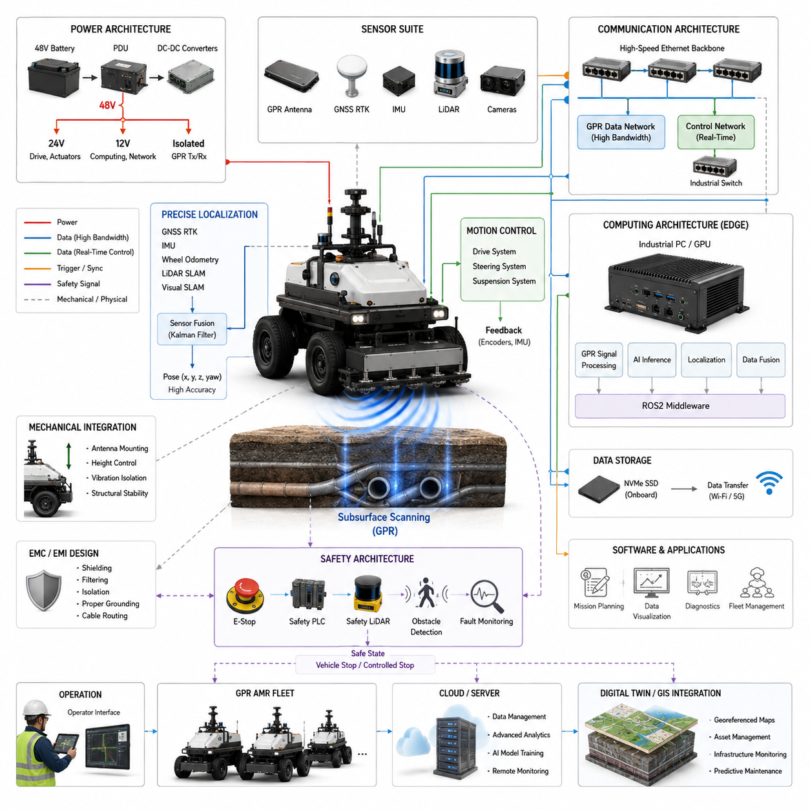
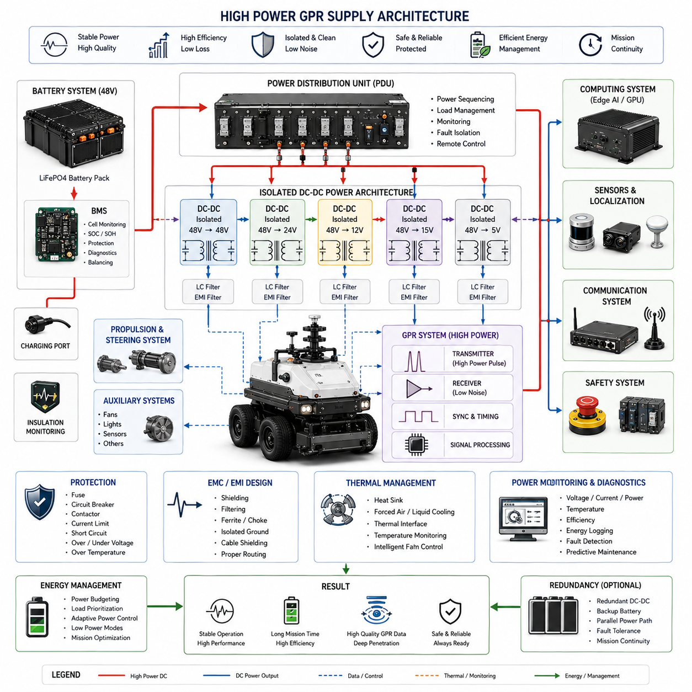
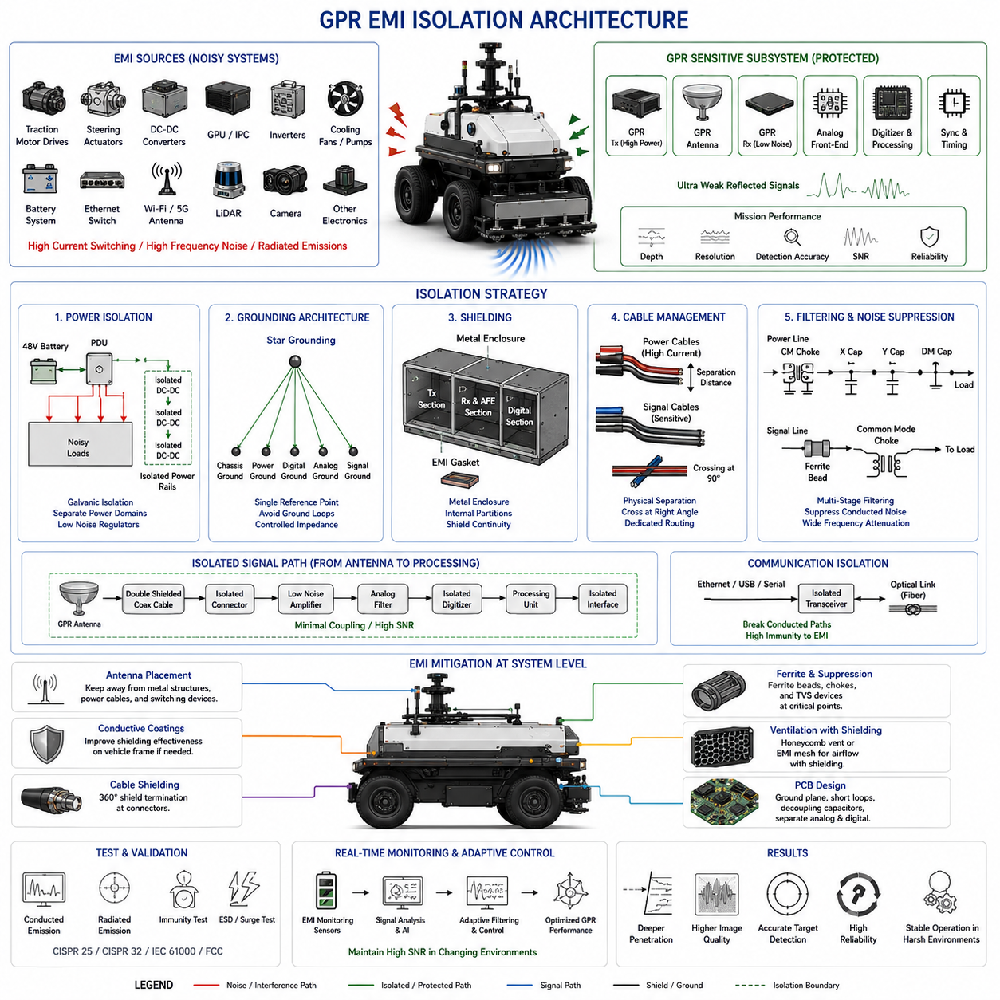
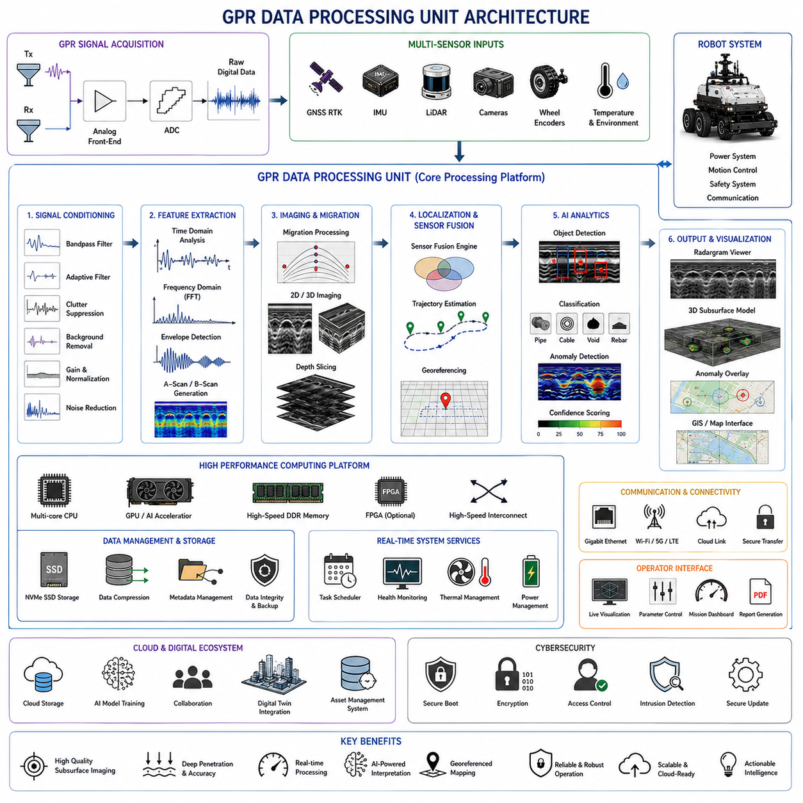
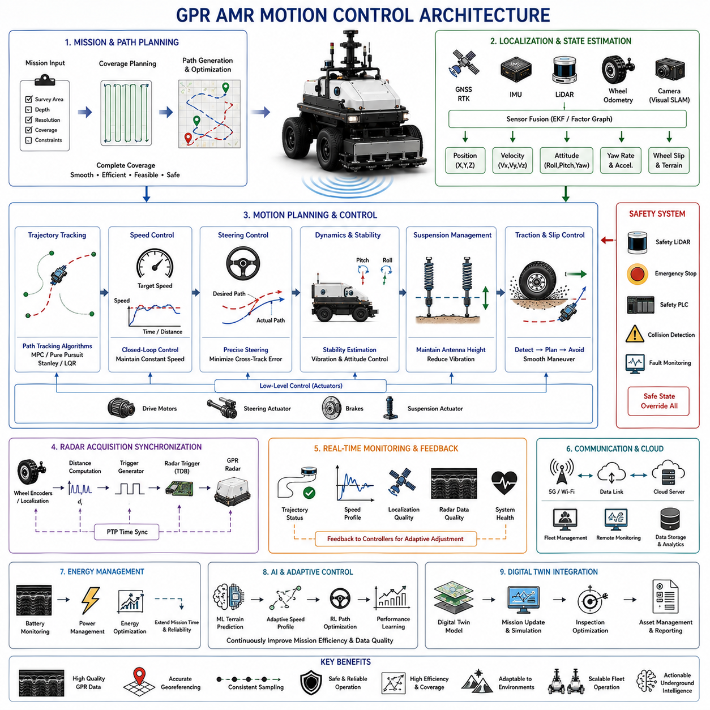

**Volume 13 AMR Electrical Architecture**


# Chapter 6. GPR AMR

##  

## 6.1 GPR System Integration

{width="7.268055555555556in" height="7.268055555555556in"}

Ground Penetrating Radar (GPR) System Integration is one of the most critical disciplines in modern inspection-oriented Autonomous Mobile Robot (AMR) electrical architecture because it combines high-power electromagnetic sensing systems, precision positioning technologies, real-time computing platforms, autonomous navigation software, data acquisition subsystems, and fleet-level management infrastructures into a single operational platform. Unlike conventional AMRs that primarily focus on material transportation, logistics automation, or surveillance tasks, GPR-based AMRs are designed to perform subsurface sensing and digital inspection of hidden infrastructure assets. These assets may include buried pipelines, utility cables, underground tunnels, geological formations, pavement layers, structural foundations, unexploded objects, and various civil engineering elements that cannot be visually inspected from the surface.

The integration challenge begins with understanding that a GPR sensor is not merely another perception device similar to a camera or LiDAR. A GPR system operates by transmitting high-frequency electromagnetic waves into the ground and analyzing reflected signals that return from subsurface interfaces. The quality of these signals is highly sensitive to electrical noise, vibration, motion instability, timing synchronization errors, power supply disturbances, environmental interference, and positioning inaccuracies. Therefore, successful GPR system integration requires a multidisciplinary architecture that addresses electrical, mechanical, software, networking, and operational considerations simultaneously. The GPR subsystem must function as an integral part of the AMR platform rather than as an externally attached sensor.

At the highest system level, a GPR-enabled AMR consists of several tightly coupled domains. These include the power distribution architecture, motion control architecture, sensor architecture, communication architecture, computing architecture, safety architecture, localization architecture, and data processing architecture. Each domain contributes to the overall performance of the underground sensing mission. The system architecture must be designed so that the operation of one subsystem does not negatively affect the performance of another subsystem. For example, high-current motor drivers may generate electromagnetic interference that directly impacts GPR signal quality. Similarly, unstable localization can introduce positioning errors into underground mapping datasets, reducing the accuracy of infrastructure inspection results.

The electrical integration process typically begins with power architecture design. Most industrial GPR AMRs operate using a 48V battery system because it provides an effective balance between power efficiency, component availability, safety, and scalability. The primary battery supplies energy to the propulsion system, steering system, onboard computers, networking equipment, localization sensors, and GPR electronics. Dedicated DC-DC converters are commonly used to generate isolated voltage rails required by different subsystems. Typical architectures include 48V to 24V conversion for industrial devices, 48V to 12V conversion for networking equipment, and specialized isolated power supplies for GPR transmitters and receivers. Electrical isolation is particularly important because GPR receivers often detect extremely weak reflected signals that can be corrupted by switching noise from motor controllers or computing systems.

Power distribution units play a central role in GPR integration. Intelligent PDUs provide controlled startup sequencing, power monitoring, overload protection, remote diagnostics, and fault isolation. Startup sequencing is particularly important because high-power GPR electronics may generate transient currents during initialization. The system must ensure that power-on events do not destabilize other critical components such as navigation computers or safety controllers. Continuous monitoring of voltage, current, temperature, and insulation resistance improves system reliability and simplifies maintenance activities.

The mechanical integration of the GPR subsystem requires careful consideration of antenna placement, sensor geometry, vibration isolation, and environmental protection. GPR antennas are typically mounted close to the ground surface because signal penetration depth and reflection quality depend on maintaining consistent coupling with the terrain. Variations in antenna height can significantly affect data quality. Therefore, suspension systems, adjustable mounting mechanisms, and vibration damping structures are frequently incorporated into the design. The antenna platform must remain mechanically stable while the AMR traverses uneven surfaces, road irregularities, construction sites, or industrial facilities.

Mechanical integration also affects navigation performance. The placement of GPR antennas changes the vehicle center of gravity and mass distribution. Large antenna arrays may introduce additional aerodynamic loads or structural vibrations. Consequently, chassis designers must coordinate closely with electrical and software engineers to ensure that GPR hardware does not degrade vehicle mobility, obstacle avoidance capability, or localization accuracy. Structural analysis is often performed to evaluate dynamic loads experienced during acceleration, braking, turning, and rough-terrain operation.

Localization integration represents another essential element of GPR system architecture. Underground anomalies detected by GPR have little value if their geographic locations cannot be accurately determined. Modern GPR AMRs therefore combine multiple positioning technologies including GNSS RTK, IMU, wheel odometry, visual SLAM, LiDAR SLAM, and sensor fusion algorithms. High-accuracy localization enables every radar scan to be associated with a precise spatial coordinate. This allows engineers to generate georeferenced underground maps that can be compared across multiple inspection campaigns.

In outdoor environments, GNSS RTK often serves as the primary positioning reference, delivering centimeter-level accuracy. However, GNSS signals may become unreliable near buildings, bridges, tunnels, or dense urban environments. Sensor fusion systems therefore integrate IMU measurements, wheel encoder information, and LiDAR-based localization to maintain continuous positioning performance. Advanced Kalman filtering techniques combine information from multiple sensors to achieve robust localization under challenging operational conditions.

Time synchronization is equally important. GPR data, LiDAR data, camera data, IMU data, and GNSS measurements must share a common time reference to support accurate sensor fusion. Precision Time Protocol (PTP) is commonly used to distribute synchronized timestamps throughout the vehicle network. Hardware-triggered synchronization mechanisms may also be implemented to ensure deterministic data acquisition. Without proper synchronization, underground features may appear spatially distorted, making interpretation difficult and reducing inspection reliability.

The communication architecture of a GPR AMR must support large volumes of sensor data while maintaining deterministic performance for vehicle control systems. Ethernet-based networks are typically used as the primary communication backbone because GPR sensors can generate substantial data streams during operation. Gigabit Ethernet and multi-gigabit Ethernet connections are commonly employed between radar electronics, edge computers, storage devices, and networking switches. Meanwhile, real-time control systems may utilize CAN FD, EtherCAT, or industrial Ethernet protocols to support motion control and safety functions.

Network segmentation is frequently implemented to isolate mission-critical control traffic from high-bandwidth inspection data. This separation improves reliability and prevents communication bottlenecks from affecting vehicle safety. Managed industrial Ethernet switches provide VLAN support, Quality of Service mechanisms, redundancy protocols, and diagnostic capabilities that enhance overall system robustness.

Computing architecture represents the central intelligence of the integrated platform. Modern GPR systems increasingly rely on edge computing technologies to perform real-time signal processing, anomaly detection, feature extraction, and data visualization. Raw radar signals undergo multiple processing stages including filtering, amplification, background removal, gain compensation, migration correction, and subsurface imaging. These computational tasks require significant processing resources, particularly when high-resolution radar arrays are employed.

Industrial edge computers equipped with high-performance CPUs and GPUs are therefore becoming standard components within advanced GPR AMRs. GPU acceleration enables real-time execution of signal processing algorithms and machine learning models. Artificial intelligence can assist in automatically identifying underground anomalies, classifying detected objects, estimating burial depth, and prioritizing inspection results. As Physical AI technologies continue to mature, autonomous interpretation of underground structures is expected to become a major capability within future GPR platforms.

Data storage architecture must also accommodate the substantial volume of information generated during inspection missions. High-speed NVMe solid-state drives are commonly used for onboard storage because they provide sufficient throughput for continuous recording of radar, localization, and vehicle telemetry data. Redundant storage configurations may be employed in critical applications to prevent data loss. In many systems, collected datasets are periodically transferred to centralized servers or cloud platforms for long-term storage, collaborative analysis, and digital twin integration.

Safety integration remains a fundamental design requirement throughout the system architecture. The GPR subsystem must not compromise the safety performance of the AMR platform. Emergency stop systems, safety PLCs, safety-rated LiDAR sensors, obstacle detection mechanisms, and fault monitoring systems operate independently of the GPR mission payload. If any critical fault is detected, the vehicle must transition to a safe state regardless of ongoing inspection activities. Functional safety principles derived from industrial automation and autonomous vehicle engineering are often applied to achieve predictable system behavior.

Electromagnetic compatibility is particularly important in GPR applications because radar systems intentionally generate electromagnetic emissions. Comprehensive EMI and EMC engineering practices are required to ensure coexistence between radar electronics and other onboard subsystems. Shielded cables, isolated grounds, filtered power supplies, proper enclosure design, and controlled cable routing reduce interference risks. Extensive validation testing is typically conducted to verify compliance with applicable industrial and regulatory standards.

Software integration forms the operational layer that unifies all hardware subsystems. Modern implementations frequently utilize ROS2-based architectures because they provide scalable communication frameworks, modular software components, and support for distributed computing. Software modules manage mission planning, vehicle control, localization, radar acquisition, data processing, operator interfaces, diagnostics, and fleet connectivity. Middleware technologies enable seamless information exchange between components while maintaining scalability for future upgrades.

Mission management software allows operators to define inspection routes, survey areas, scan parameters, and operational objectives. During autonomous operation, the vehicle navigates through predefined paths while continuously collecting underground sensing data. Progress monitoring, fault reporting, and performance metrics are presented through graphical user interfaces that simplify operational workflows. Fleet management systems further extend these capabilities by coordinating multiple GPR AMRs across large inspection sites.

The emergence of digital twin technologies is transforming the role of GPR system integration. Instead of treating inspection results as standalone datasets, modern architectures integrate radar-derived information into geospatial databases, asset management platforms, and infrastructure digital twins. Underground features detected by the AMR become part of a continuously updated digital representation of the physical environment. This integration supports predictive maintenance, infrastructure lifecycle management, and long-term planning activities.

Future GPR AMR platforms are expected to incorporate increasingly sophisticated AI capabilities, larger antenna arrays, higher-resolution sensing technologies, cloud-edge collaborative processing, autonomous mission adaptation, and fleet-level cooperative inspection strategies. The convergence of robotics, artificial intelligence, digital twins, and advanced sensing technologies will enable underground infrastructure inspection to become more autonomous, scalable, and accurate than ever before.

Ultimately, GPR System Integration is not merely the process of connecting a radar sensor to a robot. It is the comprehensive engineering discipline that transforms a collection of independent electrical, mechanical, computational, and software subsystems into a unified intelligent inspection platform capable of generating reliable underground intelligence. The success of a GPR AMR depends on how effectively these subsystems are integrated, synchronized, protected, and optimized to operate as a single cohesive system within demanding real-world environments. This chapter belongs to the GPR AMR section of the AMR Electrical Architecture volume and establishes the foundational framework for subsequent discussions on power supply design, EMI isolation, data processing architecture, and motion control integration.

# 06_01 GPR 시스템 통합(GPR System Integration)

지표투과레이더(Ground Penetrating Radar, GPR) 시스템 통합(System Integration)은 현대 검사형 자율이동로봇(Autonomous Mobile Robot, AMR) 전기 아키텍처(Electrical Architecture)에서 가장 중요한 분야 중 하나이다. 이는 고출력 전자기 센싱 시스템(Electromagnetic Sensing System), 정밀 위치결정 기술(Positioning Technology), 실시간 컴퓨팅 플랫폼(Real-Time Computing Platform), 자율주행 소프트웨어(Autonomous Navigation Software), 데이터 수집 서브시스템(Data Acquisition Subsystem), 그리고 플릿 관리 인프라(Fleet Management Infrastructure)를 하나의 운영 플랫폼으로 통합하는 작업이기 때문이다.

일반적인 물류용 AMR이 자재 이송이나 자동화 운반에 초점을 맞추는 것과 달리, GPR 기반 AMR은 지하에 존재하는 다양한 구조물과 인프라를 탐지하고 분석하기 위해 설계된다. 이러한 대상에는 매설 배관(Pipeline), 전력 케이블(Utility Cable), 지하 터널(Tunnel), 지질 구조(Geological Formation), 도로 포장층(Pavement Layer), 건축 기초 구조물(Foundation), 매설 장애물(Buried Object) 등이 포함된다. 이러한 구조물은 지표면에서 직접 확인할 수 없기 때문에 정밀한 전자기 탐사가 필요하다.

GPR 시스템은 단순한 카메라(Camera)나 라이다(LiDAR)와 같은 일반 센서와는 본질적으로 다르다. GPR은 고주파 전자기파를 지면으로 송신하고, 지하 경계면이나 물체에서 반사되어 돌아오는 신호를 분석한다. 따라서 신호 품질은 전기적 노이즈(Electrical Noise), 진동(Vibration), 이동 안정성(Motion Stability), 시간 동기화(Time Synchronization), 전원 품질(Power Quality), 전자기 간섭(Electromagnetic Interference), 위치 오차(Position Error) 등에 매우 민감하게 영향을 받는다. 이러한 이유로 GPR 시스템 통합은 전기(Electrical), 기계(Mechanical), 소프트웨어(Software), 네트워크(Network), 운영(Operation) 영역을 동시에 고려하는 종합적인 엔지니어링 작업이 된다.

시스템 수준(System Level)에서 GPR AMR은 전원 분배 아키텍처(Power Distribution Architecture), 주행 제어 아키텍처(Motion Control Architecture), 센서 아키텍처(Sensor Architecture), 통신 아키텍처(Communication Architecture), 컴퓨팅 아키텍처(Compute Architecture), 안전 아키텍처(Safety Architecture), 위치결정 아키텍처(Localization Architecture), 데이터 처리 아키텍처(Data Processing Architecture)로 구성된다. 각 영역은 독립적으로 존재하는 것이 아니라 서로 긴밀하게 연결되어 있다. 예를 들어 모터 드라이버(Motor Driver)에서 발생하는 전자기 잡음이 GPR 신호 품질을 저하시킬 수 있으며, 위치결정 오차는 지하 지도 생성 정확도를 직접적으로 떨어뜨릴 수 있다.

전기적 통합(Electrical Integration)은 일반적으로 전원 시스템 설계에서 시작된다. 산업용 GPR AMR은 대부분 48V 배터리 시스템(Battery System)을 사용한다. 이는 효율성(Efficiency), 안전성(Safety), 확장성(Scalability) 측면에서 균형이 우수하기 때문이다. 메인 배터리는 구동 시스템(Propulsion System), 조향 시스템(Steering System), 온보드 컴퓨터(Onboard Computer), 통신 장비(Network Equipment), 위치결정 센서(Localization Sensor), GPR 전자장치(GPR Electronics)에 전력을 공급한다.

각 장치는 요구 전압이 다르므로 DC-DC 컨버터(DC-DC Converter)를 사용하여 다양한 전압 레일(Voltage Rail)을 생성한다. 일반적으로 48V에서 24V, 12V로 변환되며, GPR 송신기(Transmitter)와 수신기(Receiver)는 별도의 절연 전원(Isolated Power Supply)을 사용하는 경우가 많다. 이는 매우 미약한 반사 신호를 측정하는 수신부가 모터 제어기(Motor Controller)나 컴퓨터 시스템에서 발생하는 스위칭 노이즈(Switching Noise)의 영향을 받지 않도록 하기 위함이다.

전력분배장치(Power Distribution Unit, PDU)는 GPR 통합의 핵심 역할을 수행한다. 지능형 PDU는 전원 시퀀싱(Power Sequencing), 전류 모니터링(Current Monitoring), 과부하 보호(Overload Protection), 원격 진단(Remote Diagnostics), 고장 격리(Fault Isolation) 기능을 제공한다. 특히 GPR 전자장치는 초기 부팅 시 높은 돌입전류(Inrush Current)를 발생시킬 수 있으므로 전원 관리가 매우 중요하다.

기계적 통합(Mechanical Integration)에서는 안테나(Antenna) 배치와 진동 제어가 핵심이다. GPR 안테나는 지면에 가까울수록 높은 성능을 발휘한다. 안테나 높이가 변하면 신호 특성도 변화하므로 일정한 간격을 유지해야 한다. 이를 위해 서스펜션 시스템(Suspension System), 진동 절연 구조(Vibration Isolation Structure), 높이 조절 메커니즘(Height Adjustment Mechanism)이 적용된다.

안테나 배열은 차량의 무게중심(Center of Gravity)과 질량 분포(Mass Distribution)에도 영향을 준다. 대형 안테나 어레이(Antenna Array)는 차량의 주행 성능과 안정성에 영향을 줄 수 있기 때문에 기구 설계자(Mechanical Engineer)와 전장 설계자(Electrical Engineer)가 긴밀하게 협력해야 한다. 가속(Acceleration), 제동(Braking), 선회(Turning), 비포장 노면(Rough Terrain) 주행 시 구조적 하중(Structural Load)에 대한 해석도 수행된다.

위치결정(Localization)은 GPR 시스템의 핵심 요소이다. 지하에서 이상 징후(Anomaly)를 발견하더라도 정확한 위치를 알 수 없다면 실제 활용 가치는 크게 감소한다. 따라서 GPR AMR은 GNSS RTK, 관성측정장치(IMU), 휠 오도메트리(Wheel Odometry), 비전 슬램(Visual SLAM), 라이다 슬램(LiDAR SLAM)을 통합적으로 활용한다.

실외 환경에서는 GNSS RTK가 수 센티미터 수준의 위치 정확도를 제공한다. 그러나 건물 밀집 지역이나 터널과 같은 환경에서는 GNSS 품질이 저하될 수 있다. 따라서 IMU, 엔코더(Encoder), LiDAR 기반 위치결정 정보를 결합한 센서 융합(Sensor Fusion) 알고리즘이 사용된다. 일반적으로 칼만 필터(Kalman Filter)가 적용되어 안정적인 위치 추정을 수행한다.

시간 동기화(Time Synchronization) 역시 매우 중요하다. GPR 데이터, LiDAR 데이터, 카메라 데이터, IMU 데이터, GNSS 데이터는 동일한 시간 기준(Time Reference)을 가져야 한다. 이를 위해 정밀시간프로토콜(Precision Time Protocol, PTP)이 사용되며, 경우에 따라 하드웨어 트리거(Hardware Trigger)가 적용된다. 시간 동기화가 정확하지 않으면 지하 지도(Subsurface Map)에 왜곡이 발생할 수 있다.

통신 아키텍처(Communication Architecture)는 대용량 센서 데이터를 처리하면서도 차량 제어(Control System)의 실시간성을 유지해야 한다. GPR 데이터는 매우 큰 대역폭(Bandwidth)을 요구하기 때문에 기가비트 이더넷(Gigabit Ethernet) 또는 멀티기가비트 이더넷(Multi-Gigabit Ethernet)이 일반적으로 사용된다. 반면 차량 제어에는 CAN FD, EtherCAT, 산업용 이더넷(Industrial Ethernet) 등이 사용된다.

실시간 제어 트래픽(Control Traffic)과 GPR 데이터 트래픽(Data Traffic)은 네트워크 분리(Network Segmentation)를 통해 관리된다. 이를 통해 데이터 전송량 증가가 차량 안전성에 영향을 미치지 않도록 한다. 관리형 산업용 스위치(Managed Industrial Switch)는 VLAN, QoS, 네트워크 이중화(Redundancy) 기능을 제공하여 시스템 신뢰성을 향상시킨다.

컴퓨팅 아키텍처(Compute Architecture)는 전체 시스템의 두뇌 역할을 수행한다. 최신 GPR AMR은 실시간 신호처리(Signal Processing), 이상 탐지(Anomaly Detection), 특징 추출(Feature Extraction), 시각화(Visualization)를 수행하기 위해 고성능 엣지 컴퓨팅(Edge Computing)을 활용한다.

GPR 원시 데이터(Raw Data)는 필터링(Filtering), 증폭(Amplification), 배경 제거(Background Removal), 이득 보상(Gain Compensation), 마이그레이션 보정(Migration Correction), 지하 영상화(Subsurface Imaging) 과정을 거친다. 이러한 계산은 상당한 연산 성능을 요구하므로 산업용 엣지 컴퓨터(Industrial Edge Computer)와 GPU(Graphics Processing Unit)가 활용된다.

최근에는 인공지능(AI) 기반 분석 기술이 적용되어 자동 이상 탐지(Automatic Anomaly Detection), 객체 분류(Object Classification), 매설 깊이 추정(Burial Depth Estimation), 우선순위 평가(Priority Assessment)가 가능해지고 있다. 향후 피지컬 AI(Physical AI) 기술과 결합되면 지하 구조물의 자동 해석 능력이 크게 향상될 것으로 기대된다.

데이터 저장 아키텍처(Data Storage Architecture)는 대용량 데이터를 안정적으로 기록해야 한다. 이를 위해 NVMe SSD가 주로 사용되며, 필요에 따라 이중화 저장(Redundant Storage)이 적용된다. 수집된 데이터는 온프레미스 서버(On-Premise Server)나 클라우드 플랫폼(Cloud Platform)으로 전송되어 장기 보관 및 후처리에 활용된다.

안전 통합(Safety Integration)은 모든 시스템 설계의 기본 요소이다. 비상정지(Emergency Stop), 안전 PLC(Safety PLC), 안전 라이다(Safety LiDAR), 장애물 감지 시스템(Obstacle Detection System)은 GPR 기능과 독립적으로 동작해야 한다. 시스템 오류 발생 시 차량은 즉시 안전 상태(Safe State)로 전환되어야 한다.

전자파 적합성(Electromagnetic Compatibility, EMC)은 GPR 시스템에서 특히 중요하다. GPR은 의도적으로 전자기파를 송신하기 때문에 차폐(Shielding), 필터링(Filtering), 절연(Isolation), 접지(Grounding), 케이블 라우팅(Cable Routing)에 대한 철저한 설계가 필요하다. 또한 산업 표준 및 규제 기준을 만족하기 위한 EMC 시험도 수행되어야 한다.

소프트웨어 통합(Software Integration)은 하드웨어를 하나의 지능형 시스템으로 결합하는 역할을 수행한다. 최근에는 ROS2 기반 구조가 널리 사용되며, 미션 계획(Mission Planning), 차량 제어(Vehicle Control), 위치결정(Localization), GPR 데이터 수집(Data Acquisition), 신호처리(Signal Processing), 사용자 인터페이스(User Interface), 진단(Diagnostics), 플릿 연결(Fleet Connectivity) 기능을 제공한다.

운영자는 미션 관리 시스템(Mission Management System)을 통해 탐사 구역(Survey Area), 주행 경로(Route), 스캔 설정(Scan Parameter)을 정의할 수 있다. 차량은 이를 기반으로 자율적으로 이동하면서 지하 데이터를 수집한다. 플릿 관리 시스템(Fleet Management System)은 여러 대의 GPR AMR을 동시에 운영할 수 있도록 지원한다.

최근 디지털 트윈(Digital Twin) 기술은 GPR 시스템 통합의 새로운 방향을 제시하고 있다. GPR로 획득한 데이터는 단순 보고서 형태가 아니라 지리정보시스템(Geographic Information System, GIS), 자산관리 시스템(Asset Management System), 디지털 트윈 플랫폼(Digital Twin Platform)에 통합된다. 이를 통해 지하 인프라 상태를 지속적으로 관리하고 예측 유지보수(Predictive Maintenance)를 수행할 수 있다.

향후 GPR AMR은 더욱 고해상도 안테나 배열, AI 기반 자동 해석, 클라우드-엣지 협업 처리(Cloud-Edge Collaborative Processing), 자율 임무 최적화(Autonomous Mission Optimization), 다중 로봇 협업(Multi-Robot Cooperation) 기능을 갖추게 될 것이다.

결론적으로 GPR 시스템 통합(GPR System Integration)은 단순히 레이더를 로봇에 장착하는 작업이 아니다. 이는 전기, 기계, 소프트웨어, 통신, 컴퓨팅, 안전, 데이터 분석 기술을 하나의 통합 플랫폼으로 결합하여 신뢰성 높은 지하 정보(Underground Intelligence)를 생성하는 종합 엔지니어링 분야이다. 성공적인 GPR AMR 개발은 각 서브시스템(Subsystem)이 얼마나 효율적으로 통합되고 동기화되며 최적화되는지에 달려 있다. 본 장은 이후의 고출력 GPR 전원 설계(High Power GPR Supply), 전자파 간섭 차폐(EMI Isolation), GPR 데이터 처리 장치(Data Processing Unit), GPR 기반 주행 제어(Motion Control) 설계를 위한 기초 아키텍처를 제공한다.

##  

## 6.2 High Power GPR Supply

{width="7.268055555555556in" height="7.268055555555556in"}

High Power Ground Penetrating Radar (GPR) Supply is one of the most important subsystems within a GPR-enabled Autonomous Mobile Robot (AMR) because the overall performance of the radar system is directly dependent on the quality, stability, availability, and reliability of the electrical power delivered to the radar electronics. While many robotic sensors such as cameras, IMUs, GNSS receivers, and LiDAR systems consume relatively modest amounts of electrical power, industrial-grade GPR systems often require significantly higher energy levels to generate electromagnetic pulses capable of penetrating deep underground structures. As a result, the electrical architecture supporting a high-power GPR platform must be engineered with greater attention to power distribution, voltage stability, electromagnetic compatibility, thermal management, fault protection, energy efficiency, and operational reliability.

The primary objective of a High Power GPR Supply architecture is to ensure that the radar transmitter, receiver, processing electronics, synchronization modules, and communication interfaces receive clean and uninterrupted power under all operating conditions. The quality of radar measurements depends heavily on power quality because even minor fluctuations in supply voltage can introduce distortion, noise, timing instability, or signal degradation within the radar acquisition chain. Therefore, the power subsystem cannot be treated as a simple utility function. Instead, it becomes a mission-critical component of the overall inspection platform.

Modern GPR AMRs are typically powered by lithium battery systems operating at 48V, although larger outdoor inspection platforms may utilize 72V or higher voltage architectures. The use of a higher system voltage reduces current requirements for the same power level, minimizing cable losses, improving efficiency, reducing conductor size, and enhancing overall electrical performance. In large-scale inspection vehicles operating for extended durations, power demand may exceed several kilowatts when propulsion systems, onboard computers, environmental sensors, communication equipment, and GPR electronics operate simultaneously.

The battery system forms the foundation of the power architecture. Lithium Iron Phosphate (LFP) batteries are increasingly preferred for GPR applications because they provide excellent cycle life, thermal stability, operational safety, and predictable discharge characteristics. Unlike some alternative chemistries, LFP batteries maintain relatively stable output voltages across a broad state-of-charge range, which contributes to improved power quality for sensitive radar electronics. The battery pack is typically integrated with a Battery Management System (BMS) that continuously monitors cell voltages, current flow, temperature conditions, insulation status, and overall battery health.

The Battery Management System plays a crucial role in ensuring safe and reliable operation. It protects against overvoltage, undervoltage, overcurrent, thermal runaway, short circuits, and abnormal charging conditions. Advanced BMS implementations also provide diagnostic information to the vehicle control system, allowing predictive maintenance and energy management functions to optimize mission planning and operational efficiency.

Power Distribution Units (PDUs) serve as the central power management hub within the vehicle. The PDU receives energy from the battery system and distributes it to propulsion systems, steering systems, computing platforms, communication networks, localization sensors, safety systems, and GPR electronics. In a High Power GPR architecture, the PDU must support intelligent load management capabilities because the radar subsystem can consume substantial power during active scanning operations.

Power sequencing becomes particularly important when high-power radar transmitters are involved. The startup current associated with transmitter initialization can be significantly higher than normal operating current. If startup events are not carefully managed, voltage sag may affect other vehicle systems including motion controllers, navigation computers, and safety devices. Intelligent startup sequencing allows critical systems to initialize in a controlled order, minimizing electrical disturbances and improving overall system stability.

One of the defining characteristics of a High Power GPR Supply architecture is the presence of isolated power domains. Radar transmitters generate high-energy electromagnetic pulses that can create electrical noise within shared power networks. To prevent this interference from affecting other subsystems, dedicated isolated DC-DC converters are commonly employed. These converters electrically separate radar electronics from propulsion systems, computing hardware, and communication equipment.

Isolation serves multiple purposes. It improves signal quality, reduces conducted electromagnetic interference, minimizes ground loop formation, enhances fault containment, and simplifies electromagnetic compatibility certification. In many advanced systems, separate isolated power rails are provided for the radar transmitter, radar receiver, synchronization electronics, and signal processing hardware. This level of segregation ensures that high-energy pulse generation does not compromise the sensitivity of low-noise receiving circuits.

Voltage regulation represents another critical design consideration. High-performance GPR systems require stable supply voltages because transmitter pulse characteristics are directly influenced by power supply conditions. Variations in supply voltage may alter transmitted signal amplitude, timing accuracy, pulse shape, and penetration performance. Precision voltage regulation circuits therefore maintain tightly controlled output levels regardless of battery condition, environmental temperature, or load fluctuations.

Power quality requirements become increasingly demanding as radar resolution increases. Modern GPR systems often utilize sophisticated digital receivers capable of detecting extremely weak reflected signals. These receivers are highly susceptible to noise introduced through power supplies. Consequently, low-noise regulators, multi-stage filtering networks, common-mode chokes, ferrite suppression devices, and shielded power distribution architectures are widely employed.

The design of high-current wiring infrastructure is another important engineering challenge. Large radar systems may require substantial peak currents during pulse transmission events. Conductors must therefore be sized appropriately to minimize voltage drop and thermal buildup. Wire gauge selection, connector ratings, contact resistance characteristics, and cable routing strategies all influence system performance. Excessive voltage drop can reduce transmitter effectiveness and degrade inspection quality.

Industrial connectors used in High Power GPR applications must satisfy demanding environmental requirements. Outdoor inspection vehicles may operate in rain, dust, vibration, extreme temperatures, and corrosive environments. Connectors must therefore provide adequate ingress protection, vibration resistance, current carrying capability, and long-term durability. Waterproof connectors, locking mechanisms, and environmental sealing technologies are commonly incorporated into the electrical design.

Thermal management becomes increasingly important as power levels increase. Every electrical conversion stage introduces losses that generate heat. DC-DC converters, power distribution modules, radar transmitters, computing systems, and battery packs all contribute to thermal loading within the vehicle. Excessive temperatures can reduce component lifespan, alter electrical characteristics, and compromise operational reliability.

Thermal engineering strategies typically include passive cooling, forced-air cooling, liquid cooling, heat spreaders, thermal interface materials, and intelligent thermal monitoring systems. Temperature sensors distributed throughout the electrical architecture provide continuous feedback to vehicle management software. If abnormal thermal conditions are detected, power consumption can be reduced or mission activities adjusted to protect critical hardware.

Electromagnetic Compatibility (EMC) engineering is particularly significant in High Power GPR systems because radar transmitters intentionally generate electromagnetic energy. The power architecture must be designed to prevent unwanted coupling between high-power radar electronics and other vehicle systems. Shielded enclosures, filtered power entry modules, isolated grounds, cable shielding, and proper grounding strategies all contribute to successful EMC performance.

Grounding architecture requires special attention because improper grounding can introduce measurement errors, signal distortion, and unpredictable electromagnetic behavior. A carefully designed grounding strategy minimizes ground loops while maintaining safety and electromagnetic performance. In many systems, separate analog grounds, digital grounds, chassis grounds, and power grounds are implemented with controlled interconnection points.

Energy management plays an increasingly important role as inspection missions become larger and more autonomous. Mission planners must understand how power consumption varies during operation. Vehicle propulsion, onboard computing, communication systems, environmental sensing, and radar scanning all compete for limited battery energy. Intelligent energy management software continuously evaluates battery state, mission requirements, environmental conditions, and operational priorities.

Advanced energy management systems can dynamically allocate power resources according to mission objectives. For example, radar transmission power may be adjusted based on inspection depth requirements. Computing workloads may be redistributed between edge processors and remote servers. Nonessential systems may enter low-power operating modes when battery reserves become limited. These strategies maximize mission duration while preserving critical functionality.

The integration of high-performance computing platforms introduces additional power supply challenges. Modern GPR systems increasingly rely on AI-assisted signal processing, machine learning-based anomaly detection, digital twin generation, and real-time subsurface visualization. These computational workloads often require industrial GPUs, high-performance CPUs, and advanced storage systems that significantly increase electrical demand.

Industrial edge computers equipped with GPUs such as NVIDIA RTX-class accelerators may consume hundreds of watts during intensive processing operations. The power architecture must therefore accommodate both radar-related loads and computational loads simultaneously. Proper load balancing, voltage regulation, and thermal management become essential for maintaining stable operation.

Redundancy considerations are also important in mission-critical applications. Infrastructure inspection vehicles operating in remote environments may require fault-tolerant power architectures capable of continuing operation despite component failures. Redundant power supplies, backup batteries, dual DC-DC converters, parallel power paths, and fault isolation mechanisms improve system availability and reduce operational risk.

Safety remains a fundamental design requirement throughout the High Power GPR Supply architecture. Electrical faults can potentially damage equipment, interrupt missions, or create hazardous conditions. Comprehensive protection mechanisms including fuses, circuit breakers, contactors, current limiting devices, insulation monitoring systems, and emergency shutdown functions are integrated throughout the power network.

Fault monitoring systems continuously evaluate electrical health indicators. Abnormal voltage levels, excessive current consumption, overheating conditions, insulation degradation, and communication failures are detected and reported to vehicle management software. Automated fault response strategies allow the system to isolate affected subsystems while preserving overall vehicle safety.

Data acquisition and diagnostic capabilities further enhance maintainability. Modern power systems continuously record voltage, current, temperature, battery status, converter efficiency, and energy consumption metrics. Historical data supports root-cause analysis, predictive maintenance, lifecycle optimization, and fleet-level performance management. These capabilities become increasingly valuable as inspection fleets scale to larger deployments.

The future of High Power GPR Supply architecture will be strongly influenced by advances in battery technology, power electronics, artificial intelligence, and autonomous inspection systems. Higher energy density batteries, wide-bandgap semiconductor devices, intelligent power management algorithms, and adaptive energy optimization strategies will enable longer operational durations, improved efficiency, and enhanced inspection performance.

Emerging technologies such as silicon carbide power electronics, gallium nitride converters, solid-state batteries, distributed power architectures, and AI-driven energy management systems are expected to redefine how future GPR platforms are designed. These innovations will support higher radar power levels, deeper penetration capabilities, greater computational performance, and more autonomous operational behaviors.

Ultimately, High Power GPR Supply is far more than an electrical utility subsystem. It serves as the energy backbone of the entire GPR AMR platform, directly influencing sensing performance, localization accuracy, computational capability, mission duration, safety, reliability, and inspection quality. A properly engineered power architecture enables every component of the inspection vehicle to operate at peak performance while maintaining stability under demanding real-world conditions. Within the broader GPR AMR electrical architecture, the High Power GPR Supply subsystem provides the critical foundation upon which advanced underground sensing, autonomous inspection, digital infrastructure mapping, and future Physical AI applications are built.

# 06_02 고출력 GPR 전원 공급(High Power GPR Supply)

고출력 GPR 전원 공급(High Power GPR Supply)은 GPR 기반 자율이동로봇(Autonomous Mobile Robot, AMR)에서 가장 중요한 서브시스템 중 하나이다. 이는 레이더(Radar) 시스템의 성능이 전력 품질(Power Quality), 전압 안정성(Voltage Stability), 전력 가용성(Power Availability), 그리고 전원 공급 신뢰성(Reliability)에 직접적으로 의존하기 때문이다. 일반적인 카메라(Camera), 관성측정장치(IMU), 위성항법장치(GNSS), 라이다(LiDAR)와 같은 센서는 비교적 적은 전력을 소비하지만, 산업용 GPR 시스템은 지하 깊숙한 곳까지 전자기파를 투과시키기 위해 훨씬 높은 수준의 에너지를 필요로 한다. 따라서 GPR용 전원 아키텍처(Power Architecture)는 전력 분배(Power Distribution), 전압 안정화(Voltage Regulation), 전자파 적합성(Electromagnetic Compatibility, EMC), 열 관리(Thermal Management), 고장 보호(Fault Protection), 에너지 효율(Energy Efficiency), 운영 신뢰성(Operation Reliability)을 종합적으로 고려하여 설계되어야 한다.

고출력 GPR 전원 시스템의 가장 중요한 목적은 레이더 송신기(Transmitter), 수신기(Receiver), 신호처리 장치(Signal Processing Unit), 시간 동기화 모듈(Synchronization Module), 통신 인터페이스(Communication Interface)에 깨끗하고 안정적인 전력을 공급하는 것이다. GPR은 미세한 반사 신호를 분석하는 시스템이므로 전압의 작은 변동이나 전원 노이즈조차 측정 정확도에 영향을 줄 수 있다. 따라서 전원 시스템은 단순한 보조 장치가 아니라 검사 임무(Inspection Mission)의 핵심 요소로 간주된다.

현대의 GPR AMR은 일반적으로 48V 배터리(Battery)를 사용하며, 대형 실외 플랫폼은 72V 이상의 전압 아키텍처를 채택하기도 한다. 높은 전압을 사용할수록 동일한 전력을 더 작은 전류로 공급할 수 있기 때문에 전력 손실(Power Loss)을 줄이고 케이블 크기를 감소시키며 시스템 효율을 향상시킬 수 있다. 대형 검사 차량에서는 구동 시스템(Drive System), 조향 시스템(Steering System), 컴퓨팅 장치(Computing Platform), 통신 장비(Network Equipment), 각종 센서(Sensor), GPR 시스템이 동시에 동작하므로 수 킬로와트(kW) 수준의 전력이 요구될 수 있다.

배터리 시스템(Battery System)은 전체 전원 구조의 기반이 된다. 최근에는 리튬인산철 배터리(Lithium Iron Phosphate, LFP)가 가장 많이 사용된다. LFP 배터리는 긴 수명(Cycle Life), 높은 안전성(Safety), 우수한 열 안정성(Thermal Stability), 그리고 안정적인 방전 특성(Discharge Characteristic)을 제공한다. 특히 충전 상태(State of Charge)가 변화해도 출력 전압이 비교적 일정하게 유지되므로 민감한 GPR 장비에 안정적인 전력을 공급할 수 있다.

배터리 관리 시스템(Battery Management System, BMS)은 배터리 팩의 상태를 지속적으로 모니터링한다. 셀 전압(Cell Voltage), 전류(Current), 온도(Temperature), 절연 상태(Insulation Status), 배터리 건강도(State of Health)를 감시하며 과전압(Overvoltage), 저전압(Undervoltage), 과전류(Overcurrent), 단락(Short Circuit), 과열(Overheating)로부터 시스템을 보호한다. 또한 차량 제어 시스템(Vehicle Control System)에 진단 정보를 제공하여 예지정비(Predictive Maintenance)와 에너지 최적화(Energy Optimization)를 가능하게 한다.

전력분배장치(Power Distribution Unit, PDU)는 차량 내 전력 흐름의 중심 역할을 수행한다. PDU는 배터리에서 공급되는 전력을 추진 시스템(Propulsion System), 조향 시스템(Steering System), 컴퓨팅 플랫폼(Computing Platform), 위치결정 시스템(Localization System), 안전 시스템(Safety System), GPR 전자장치(Electronics)에 분배한다. 고출력 GPR 시스템에서는 레이더 송신부가 순간적으로 많은 전력을 소비하기 때문에 지능형 부하 관리(Intelligent Load Management) 기능이 필요하다.

특히 전원 시퀀싱(Power Sequencing)은 매우 중요하다. GPR 송신기는 초기 부팅 시 돌입전류(Inrush Current)를 발생시킬 수 있다. 만약 이러한 전류를 적절히 제어하지 못하면 전압 강하(Voltage Sag)가 발생하여 차량 제어기(Motion Controller), 자율주행 컴퓨터(Autonomous Driving Computer), 안전 제어기(Safety Controller)에 영향을 줄 수 있다. 따라서 시스템은 중요 장비를 순차적으로 기동하는 방식으로 설계된다.

고출력 GPR 전원 시스템의 가장 큰 특징 중 하나는 절연 전원 도메인(Isolated Power Domain) 구조이다. GPR 송신기는 강력한 전자기 펄스(Electromagnetic Pulse)를 발생시키며, 이는 다른 장치에 노이즈를 유입시킬 수 있다. 이를 방지하기 위해 절연형 DC-DC 컨버터(Isolated DC-DC Converter)를 사용하여 GPR 전원을 차량의 다른 전원 계통과 분리한다.

전기적 절연(Isolation)은 여러 가지 장점을 제공한다. 신호 품질(Signal Quality)을 향상시키고, 전도성 전자파 간섭(Conducted EMI)을 감소시키며, 접지 루프(Ground Loop)를 방지하고, 고장 전파(Fault Propagation)를 차단한다. 고급 시스템에서는 송신기, 수신기, 동기화 회로, 신호처리 회로 각각에 독립적인 전원 레일(Power Rail)을 제공하기도 한다.

전압 조정(Voltage Regulation)은 또 다른 핵심 설계 요소이다. GPR 송신기의 출력 성능은 공급 전압에 매우 민감하다. 전압 변동은 송신 신호의 세기(Amplitude), 펄스 형태(Pulse Shape), 시간 정확도(Timing Accuracy), 탐지 깊이(Penetration Depth)에 영향을 미친다. 따라서 정밀 전압 조정 회로는 배터리 상태나 부하 변화에 관계없이 일정한 출력 전압을 유지해야 한다.

고해상도 GPR 시스템일수록 전원 품질 요구사항은 더욱 엄격해진다. 최신 GPR 수신기는 매우 약한 반사 신호를 검출하기 때문에 전원 노이즈에 매우 민감하다. 따라서 저잡음 전압 조정기(Low Noise Regulator), 다단계 필터(Multi-Stage Filter), 공통모드 초크(Common Mode Choke), 페라이트 비드(Ferrite Bead), 차폐 구조(Shielding Structure)가 널리 사용된다.

고전류 배선(High Current Wiring) 설계 역시 중요한 과제이다. GPR 송신기는 순간적으로 매우 큰 전류를 요구할 수 있다. 따라서 적절한 전선 굵기(Wire Gauge)를 선택해야 하며, 전압 강하(Voltage Drop)와 발열(Heat Generation)을 최소화해야 한다. 케이블(Cable), 커넥터(Connector), 접점(Contact)의 저항 특성도 전체 성능에 영향을 준다.

산업용 커넥터(Industrial Connector)는 방수(Waterproof), 방진(Dustproof), 내진동(Vibration Resistance), 내환경성(Environmental Resistance)을 만족해야 한다. 실외 검사 차량은 비(Rain), 먼지(Dust), 극한 온도(Extreme Temperature), 부식 환경(Corrosive Environment)에서 운용될 수 있기 때문이다. 따라서 IP67 또는 IP68 수준의 보호 등급이 일반적으로 요구된다.

열 관리(Thermal Management)는 전력 수준이 증가할수록 중요성이 커진다. DC-DC 컨버터, 전력 분배 장치, 레이더 송신기, GPU 서버, 배터리 등은 모두 열을 발생시킨다. 과도한 온도는 부품 수명을 단축시키고 성능 저하를 유발할 수 있다.

이를 해결하기 위해 자연 냉각(Passive Cooling), 강제 공랭(Forced Air Cooling), 수랭식 냉각(Liquid Cooling), 히트싱크(Heat Sink), 열전도 재료(Thermal Interface Material)가 사용된다. 차량 내부에는 다양한 온도 센서(Temperature Sensor)가 설치되어 지속적으로 상태를 모니터링한다.

전자파 적합성(EMC) 설계는 GPR 시스템에서 특히 중요하다. GPR은 본질적으로 강력한 전자기파를 송신하는 장치이므로, 다른 시스템과의 간섭을 최소화해야 한다. 이를 위해 차폐 케이스(Shielded Enclosure), 필터(Filter), 절연(Isolation), 접지(Grounding), 케이블 차폐(Cable Shielding) 등이 적용된다.

접지 구조(Grounding Architecture)는 매우 신중하게 설계되어야 한다. 잘못된 접지는 측정 오류와 신호 왜곡을 유발할 수 있다. 따라서 아날로그 접지(Analog Ground), 디지털 접지(Digital Ground), 섀시 접지(Chassis Ground), 전력 접지(Power Ground)를 구분하여 설계하는 경우가 많다.

에너지 관리(Energy Management)는 대규모 자율 검사 시스템에서 점점 더 중요해지고 있다. 차량 주행, GPU 연산, 통신, 센서, GPR 스캔은 모두 배터리 에너지를 소비한다. 따라서 시스템은 배터리 상태, 임무 우선순위, 환경 조건을 고려하여 전력을 최적화해야 한다.

지능형 에너지 관리 시스템(Intelligent Energy Management System)은 검사 깊이에 따라 GPR 출력 전력을 조절할 수 있으며, 일부 계산 작업을 클라우드(Cloud)나 서버(Server)로 분산할 수 있다. 또한 비필수 장비를 저전력 모드(Low Power Mode)로 전환하여 임무 시간을 연장할 수 있다.

최근에는 GPU(Graphics Processing Unit)를 활용한 AI 기반 신호 분석(AI Signal Analysis)이 증가하고 있다. 실시간 지하 영상화(Subsurface Imaging), 이상 탐지(Anomaly Detection), 객체 분류(Object Classification), 디지털 트윈(Digital Twin) 생성에는 상당한 연산 성능이 필요하다. 이에 따라 산업용 GPU 서버(GPU Server)나 엣지 컴퓨터(Edge Computer)의 전력 소비가 크게 증가하고 있다.

고성능 GPU가 장착된 산업용 컴퓨터는 수백 와트(Watt)의 전력을 소비할 수 있다. 따라서 전원 시스템은 GPR 장비뿐 아니라 AI 컴퓨팅 장비의 전력 요구사항까지 동시에 만족해야 한다.

미션 크리티컬(Mission Critical) 환경에서는 이중화(Redundancy) 설계도 중요하다. 원격 지역에서 운용되는 검사 차량은 전원 고장에도 계속 동작할 수 있어야 한다. 이를 위해 이중 전원공급장치(Redundant Power Supply), 백업 배터리(Backup Battery), 이중 DC-DC 컨버터(Dual DC-DC Converter), 병렬 전원 경로(Parallel Power Path)가 사용된다.

안전성(Safety)은 모든 전원 설계의 기본 원칙이다. 전기적 결함은 장비 손상뿐 아니라 화재나 사고를 유발할 수 있다. 따라서 퓨즈(Fuse), 회로 차단기(Circuit Breaker), 컨택터(Contactor), 전류 제한 장치(Current Limiter), 절연 감시 장치(Insulation Monitoring System), 비상 차단 기능(Emergency Shutdown)이 적용된다.

고장 감시 시스템(Fault Monitoring System)은 전압, 전류, 온도, 절연 상태, 통신 상태를 지속적으로 감시한다. 이상이 감지되면 문제 구역을 자동으로 격리하여 차량 전체의 안전성을 유지한다.

현대 전원 시스템은 진단 데이터(Diagnostic Data)를 지속적으로 기록한다. 전압, 전류, 온도, 배터리 상태, 컨버터 효율, 에너지 소비량 등의 데이터는 원인 분석(Root Cause Analysis), 예지정비(Predictive Maintenance), 수명 최적화(Lifecycle Optimization)에 활용된다.

미래의 고출력 GPR 전원 시스템은 배터리 기술(Battery Technology), 전력전자(Power Electronics), 인공지능(AI), 자율 검사 기술(Autonomous Inspection Technology)의 발전에 의해 크게 변화할 것이다. 더 높은 에너지 밀도(Energy Density), 더 긴 운용 시간(Operation Time), 더 높은 효율(Efficiency)을 제공하는 시스템이 등장할 것으로 예상된다.

실리콘 카바이드(Silicon Carbide, SiC) 전력 반도체, 질화갈륨(Gallium Nitride, GaN) 컨버터, 전고체 배터리(Solid-State Battery), 분산 전원 구조(Distributed Power Architecture), AI 기반 에너지 최적화(AI-Based Energy Optimization)는 차세대 GPR 플랫폼의 핵심 기술이 될 것이다.

결론적으로 고출력 GPR 전원 공급(High Power GPR Supply)은 단순한 전원 장치가 아니다. 이는 GPR AMR 전체의 에너지 백본(Energy Backbone)으로서 센싱 성능(Sensing Performance), 위치결정 정확도(Localization Accuracy), AI 연산 성능(Computing Performance), 임무 지속 시간(Mission Duration), 안전성(Safety), 신뢰성(Reliability), 검사 품질(Inspection Quality)을 결정하는 핵심 아키텍처이다. 우수한 전원 설계는 지하 탐사(Underground Exploration), 인프라 검사(Infrastructure Inspection), 디지털 매핑(Digital Mapping), 미래 피지컬 AI(Physical AI) 응용을 가능하게 하는 기반 기술이라 할 수 있다.

##  

## 6.3 GPR EMI Isolation

{width="7.268055555555556in" height="7.268055555555556in"}

Ground Penetrating Radar (GPR) EMI Isolation is one of the most important engineering disciplines within a GPR-enabled Autonomous Mobile Robot (AMR) because the radar system simultaneously performs two fundamentally conflicting operations. The transmitter generates high-energy electromagnetic pulses that propagate into the ground, while the receiver attempts to detect extremely weak reflected signals returning from underground structures. The energy difference between transmitted and received signals can exceed several orders of magnitude. Consequently, even small amounts of electromagnetic interference (EMI) generated within the vehicle can significantly degrade radar performance. Effective EMI isolation is therefore not merely a design optimization but a core requirement for achieving reliable underground sensing, deep penetration capability, accurate target identification, and consistent inspection quality.

A modern GPR AMR integrates numerous electrical subsystems including battery systems, motor drives, steering controllers, DC-DC converters, industrial computers, GPUs, Ethernet switches, wireless communication devices, LiDAR sensors, cameras, GNSS receivers, IMUs, safety controllers, and high-power radar electronics. Each subsystem generates its own electromagnetic emissions. The challenge of GPR EMI isolation lies in preventing these emissions from coupling into sensitive radar signal paths while maintaining overall vehicle functionality and operational efficiency.

The fundamental objective of EMI isolation is to preserve the signal-to-noise ratio of the radar system. Since reflected radar signals may be extremely weak after propagating through soil, asphalt, concrete, rock, or underground infrastructure, any externally induced noise can obscure important subsurface information. Reduced signal quality directly affects detection depth, target classification accuracy, underground imaging resolution, and anomaly detection capability. Therefore, the entire AMR electrical architecture must be designed with electromagnetic compatibility as a primary consideration from the earliest stages of system development.

Electromagnetic interference can be categorized into conducted emissions and radiated emissions. Conducted EMI propagates through power cables, signal lines, communication networks, and grounding systems. Radiated EMI propagates through free space and can couple directly into nearby circuits, antennas, enclosures, and wiring harnesses. Both forms of interference must be addressed simultaneously because they often interact with each other within complex robotic systems.

The GPR transmitter itself is a major source of electromagnetic energy. During operation, high-frequency pulses are generated and delivered to the antenna system. Depending on the radar design, pulse frequencies may range from several megahertz to multiple gigahertz. The associated switching electronics generate large transient currents and high-frequency harmonics. These emissions can propagate throughout the vehicle if proper isolation techniques are not implemented. Ironically, the radar system can become one of the largest sources of interference affecting its own receiver.

The receiver section of a GPR system is particularly sensitive because it must detect reflections that may be millions of times weaker than the transmitted signal. Low-noise amplifiers, analog front-end circuits, high-speed digitizers, and synchronization electronics operate near the limits of signal detection capability. Small disturbances introduced through power supplies, ground paths, communication interfaces, or electromagnetic coupling can produce false targets, measurement errors, image artifacts, and reduced penetration depth.

One of the first principles of GPR EMI isolation is electrical segmentation. The vehicle architecture should separate noisy power systems from sensitive radar electronics. High-current motor drives, traction inverters, steering actuators, hydraulic pumps, cooling systems, and high-performance computing platforms should be electrically isolated from the radar subsystem whenever possible. Dedicated power domains allow disturbances generated by one subsystem to remain confined within that subsystem.

Power supply isolation plays a central role in EMI mitigation. Isolated DC-DC converters provide galvanic separation between the radar subsystem and the remainder of the vehicle. The radar transmitter often receives power from a dedicated isolated supply designed specifically to support high-energy pulse generation. The receiver and analog front-end circuits typically utilize separate low-noise isolated power supplies with extremely low ripple characteristics. This architecture prevents switching noise from propagating across common power rails.

Multiple power domains are frequently employed in advanced systems. Separate isolated rails may be allocated to the transmitter, receiver, synchronization electronics, digitizers, processing units, and communication interfaces. This layered approach reduces the possibility that disturbances generated within one functional block can affect another. The result is improved measurement stability and greater resistance to environmental noise.

Grounding architecture represents another critical aspect of EMI isolation. Poor grounding is among the most common causes of electromagnetic compatibility problems. Ground loops create unintended current paths that introduce noise into sensitive circuits. In GPR systems, even small ground potential differences can generate measurement artifacts. A carefully engineered grounding strategy establishes controlled reference points while minimizing circulating currents.

Star grounding architectures are commonly used because they provide a single reference point for multiple subsystems. Hybrid grounding approaches may also be employed depending on the operational frequency range and system topology. Chassis grounds, signal grounds, analog grounds, digital grounds, and power grounds must be managed carefully to avoid unwanted coupling mechanisms. Ground return currents associated with high-power transmitters should never share impedance paths with sensitive receiver circuits.

Shielding is another fundamental technique used to achieve EMI isolation. Radar electronics are typically enclosed within conductive metallic housings that provide attenuation of external electromagnetic fields. Aluminum and steel enclosures are widely used because they combine structural strength with excellent shielding performance. The effectiveness of a shield depends not only on the enclosure material but also on the quality of seams, joints, connectors, and cable entry points.

Shield continuity is essential for maintaining shielding effectiveness. Small gaps, openings, or poorly bonded seams can significantly reduce attenuation performance at higher frequencies. EMI gaskets, conductive seals, and bonded enclosure interfaces are therefore commonly incorporated into industrial GPR designs. Ventilation openings often utilize honeycomb structures or conductive mesh materials that allow airflow while maintaining electromagnetic protection.

Internal shielding structures may also be used within radar electronics. The transmitter, receiver, analog processing circuits, digital processing circuits, and communication interfaces can be physically separated by conductive partitions. These partitions reduce internal coupling and improve isolation between functional blocks. Multi-compartment enclosure designs are frequently used in high-performance radar systems.

Cable management is another major factor influencing EMI performance. Cables often serve as unintended antennas capable of both transmitting and receiving electromagnetic energy. Power cables, signal cables, communication lines, synchronization networks, and antenna connections must therefore be routed according to strict electromagnetic compatibility principles. Sensitive signal cables should be physically separated from high-current power cables and switching devices.

When cable crossings are unavoidable, conductors should intersect at right angles to minimize coupling. Parallel routing of noisy and sensitive cables should be avoided whenever possible. Cable trays, segregated harness channels, and dedicated routing zones help maintain consistent electromagnetic performance throughout the vehicle.

Antenna cable design is particularly important in GPR systems. Signals traveling between antennas and receiver electronics often exhibit extremely low amplitudes. Double-shielded coaxial cables, phase-stable transmission lines, and low-loss RF cables are commonly used to preserve signal integrity. Shield termination techniques must provide continuous electrical contact around the entire cable circumference to prevent leakage and susceptibility.

Filtering technologies provide another layer of protection against electromagnetic interference. EMI filters attenuate unwanted signals before they reach sensitive electronics. Common-mode chokes suppress noise currents flowing along cable shields and conductors. Differential-mode filters reduce disturbances appearing between signal lines. Ferrite beads provide broadband attenuation of high-frequency noise components. Multi-stage filtering architectures are often employed in critical radar subsystems.

Power input filtering is especially important because conducted noise frequently enters electronic systems through power distribution networks. Multi-stage filter designs may include inductors, capacitors, common-mode chokes, transient suppression devices, and damping networks. These components collectively reduce both internally generated and externally induced interference.

Communication interfaces also require special attention. Ethernet networks, USB connections, serial communication links, and synchronization networks can all serve as pathways for EMI propagation. Isolated transceivers, digital isolators, and optical communication links help break conductive coupling paths. Fiber optic communication is particularly attractive because it provides complete electrical isolation while supporting high data rates.

Time synchronization systems are highly sensitive to electromagnetic disturbances. GPR imaging accuracy often depends on precise synchronization between transmitters, receivers, localization sensors, and data acquisition systems. Noise-induced timing jitter can distort radar measurements and reduce image quality. Differential signaling, shielded twisted pair cables, isolated drivers, and controlled impedance routing help maintain synchronization accuracy.

Antenna isolation represents a unique challenge within GPR systems because the antenna functions simultaneously as a transmitter and receiver. Proper antenna design minimizes self-interference while maximizing subsurface penetration. Antenna placement must account for nearby metallic structures, vehicle components, power systems, and communication devices. Improper placement can create reflections, resonances, and unwanted coupling effects.

Vehicle-level EMI isolation extends beyond individual components. The mechanical structure of the AMR can influence electromagnetic behavior. Large metallic surfaces may function as unintended antennas or resonant structures. Vehicle frames, mounting brackets, equipment racks, and protective enclosures should be evaluated as part of the electromagnetic design process. Computational electromagnetic simulations are increasingly used to predict system-level behavior before physical prototypes are constructed.

Printed Circuit Board (PCB) design plays a critical role in radar performance. High-speed digital circuits, switching power supplies, analog front-end circuits, and RF signal paths must coexist within compact electronic assemblies. Proper layer stackups, ground planes, power distribution networks, impedance control, and component placement strategies are essential for minimizing electromagnetic coupling.

Decoupling capacitors positioned near integrated circuits suppress local noise generation and improve power stability. Continuous ground planes provide low-impedance return paths. Controlled impedance routing preserves signal integrity. Sensitive analog circuits are often physically separated from noisy digital circuits. These design practices collectively improve electromagnetic performance at the board level.

Environmental factors further complicate EMI isolation. Industrial facilities, utility corridors, transportation infrastructure, and urban environments contain numerous sources of electromagnetic noise. Power lines, radio transmitters, wireless networks, electric vehicles, industrial machinery, and communication systems all contribute to the electromagnetic environment surrounding the AMR. Robust EMI isolation must therefore address both internally generated and externally generated interference sources.

Testing and validation are essential components of EMI engineering. Laboratory measurements evaluate conducted emissions, radiated emissions, conducted immunity, radiated immunity, electrostatic discharge resistance, surge immunity, and transient response characteristics. Compliance testing often follows standards such as CISPR 25, CISPR 32, IEC 61000 series, FCC regulations, and applicable industrial electromagnetic compatibility requirements.

Pre-compliance testing is frequently performed during development to identify potential issues before formal certification activities begin. Near-field probes, spectrum analyzers, EMI receivers, current probes, and anechoic chambers provide valuable diagnostic information. Early identification of electromagnetic problems significantly reduces development costs and project risks.

Modern GPR platforms increasingly incorporate adaptive EMI mitigation technologies. Real-time noise monitoring systems continuously evaluate the electromagnetic environment and adjust operating parameters accordingly. Adaptive filtering algorithms can suppress specific interference sources without affecting legitimate radar reflections. Machine learning techniques are beginning to assist in distinguishing between genuine underground targets and electromagnetic artifacts.

As artificial intelligence becomes more integrated into inspection systems, advanced signal processing algorithms can compensate for certain types of interference that would previously have rendered data unusable. Nevertheless, software-based mitigation should never replace proper electromagnetic engineering. The most effective strategy remains preventing interference from reaching sensitive circuits in the first place.

Future GPR systems will likely employ increasingly sophisticated EMI isolation architectures as radar resolution, computational performance, and system complexity continue to increase. Emerging technologies such as optical interconnects, distributed radar architectures, intelligent power management systems, advanced shielding materials, and AI-assisted electromagnetic optimization will further improve system performance.

Ultimately, GPR EMI Isolation is not simply a supporting design activity but a foundational requirement for high-performance underground sensing. Every aspect of the vehicle, including power systems, grounding architecture, shielding structures, communication networks, cable routing, enclosure design, antenna placement, PCB layout, and software architecture, contributes to electromagnetic behavior. Successful EMI isolation enables deeper penetration, higher image quality, improved detection accuracy, greater operational reliability, and more consistent inspection results. Within the overall GPR AMR electrical architecture, EMI isolation forms the invisible protective framework that allows sensitive radar measurements to coexist with powerful robotic systems operating in challenging real-world environments.

# 06_03 GPR 전자파 간섭 차폐(GPR EMI Isolation)

지표투과레이더(Ground Penetrating Radar, GPR)의 전자파 간섭 차폐(Electromagnetic Interference Isolation, EMI Isolation)는 GPR 기반 자율이동로봇(Autonomous Mobile Robot, AMR)에서 가장 중요한 엔지니어링 분야 중 하나이다. 이는 GPR 시스템이 서로 상반되는 두 가지 동작을 동시에 수행하기 때문이다. 하나는 지하로 강력한 전자기 펄스(Electromagnetic Pulse)를 송신하는 것이고, 다른 하나는 지하 구조물에서 반사되어 돌아오는 매우 미약한 신호를 수신하는 것이다. 송신 신호와 수신 신호의 에너지 차이는 수백만 배에서 수억 배 이상 차이가 날 수 있다. 따라서 차량 내부에서 발생하는 아주 작은 전자파 잡음조차도 레이더 성능을 크게 저하시킬 수 있다. 이러한 이유로 EMI 차폐는 단순한 성능 향상 기술이 아니라 지하 탐지 성능, 탐사 깊이, 영상 품질, 탐지 정확도를 확보하기 위한 필수 설계 요소이다.

현대의 GPR AMR은 배터리 시스템(Battery System), 모터 드라이브(Motor Drive), 조향 제어기(Steering Controller), DC-DC 컨버터(DC-DC Converter), 산업용 컴퓨터(Industrial Computer), GPU(Graphics Processing Unit), 이더넷 스위치(Ethernet Switch), 무선 통신 장치(Wireless Communication Device), 라이다(LiDAR), 카메라(Camera), GNSS 수신기(GNSS Receiver), 관성측정장치(IMU), 안전 제어기(Safety Controller), 고출력 레이더 전자장치(Radar Electronics) 등 수많은 전기 시스템을 포함한다. 이들 장치는 모두 전자파를 발생시키며, EMI 차폐의 핵심 목표는 이러한 전자파가 민감한 레이더 수신 회로에 영향을 주지 못하도록 하는 것이다.

EMI 차폐의 궁극적인 목적은 신호 대 잡음비(Signal-to-Noise Ratio, SNR)를 최대한 높게 유지하는 것이다. 지하를 통과한 반사 신호는 토양(Soil), 아스팔트(Asphalt), 콘크리트(Concrete), 암반(Rock), 매설 구조물(Buried Structure)을 통과하면서 매우 약해진다. 따라서 작은 전자파 간섭도 중요한 지하 정보를 가려버릴 수 있다. 결과적으로 EMI는 탐지 깊이(Detection Depth), 지하 영상 해상도(Subsurface Imaging Resolution), 목표물 분류(Target Classification), 이상 탐지(Anomaly Detection) 성능에 직접적인 영향을 준다.

전자파 간섭은 크게 전도성 간섭(Conducted EMI)과 방사성 간섭(Radiated EMI)으로 구분된다. 전도성 간섭은 전원선(Power Line), 신호선(Signal Line), 통신 케이블(Communication Cable), 접지 시스템(Ground System)을 따라 전달된다. 방사성 간섭은 공기 중을 통해 전파되며 주변 회로(Circuit), 안테나(Antenna), 케이블(Cable), 금속 구조물(Metal Structure)에 직접 영향을 준다. 실제 시스템에서는 두 종류의 간섭이 동시에 존재하기 때문에 종합적인 EMI 설계가 필요하다.

GPR 송신기(Transmitter)는 차량 내에서 가장 강력한 전자파 발생원 중 하나이다. 송신기는 수 MHz에서 수 GHz 범위의 고주파 펄스를 생성하여 안테나를 통해 지하로 방사한다. 이 과정에서 고전류 스위칭(High Current Switching)이 발생하며 다양한 고조파(Harmonic)가 생성된다. 적절한 차폐가 없다면 이러한 전자파는 차량 전체로 확산될 수 있다. 아이러니하게도 GPR 시스템 자체가 자기 자신의 수신기(Receiver)를 방해하는 가장 큰 간섭원이 될 수 있다.

수신기 영역은 특히 민감하다. 저잡음 증폭기(Low Noise Amplifier), 아날로그 프론트엔드(Analog Front-End), 고속 디지타이저(High-Speed Digitizer), 시간 동기화 회로(Synchronization Circuit)는 매우 미약한 신호를 처리해야 한다. 따라서 전원 노이즈(Power Noise), 접지 잡음(Ground Noise), 통신 간섭(Communication Interference), 전자기 결합(Electromagnetic Coupling)이 발생하면 허위 목표물(False Target), 영상 왜곡(Image Artifact), 탐지 성능 저하가 발생할 수 있다.

EMI 차폐의 첫 번째 원칙은 전기적 분리(Electrical Segmentation)이다. 차량 내부에서 고출력 장치와 민감한 레이더 장치를 분리해야 한다. 모터 드라이브, 추진 시스템(Propulsion System), 조향 액추에이터(Steering Actuator), 유압 펌프(Hydraulic Pump), 냉각 장치(Cooling System), GPU 서버 등은 가능하면 레이더 전자장치와 별도의 전원 도메인(Power Domain)을 사용해야 한다.

전원 절연(Power Isolation)은 EMI 차폐에서 가장 중요한 기술 중 하나이다. 절연형 DC-DC 컨버터(Isolated DC-DC Converter)는 레이더 시스템과 차량의 다른 시스템 사이에 갈바닉 절연(Galvanic Isolation)을 제공한다. 일반적으로 송신기는 독립적인 고출력 전원을 사용하며, 수신기와 아날로그 회로는 별도의 저잡음 전원(Low Noise Power Supply)을 사용한다. 이러한 구조는 스위칭 노이즈가 공통 전원선을 통해 전달되는 것을 방지한다.

고급 시스템에서는 여러 개의 독립 전원 레일(Isolated Power Rail)을 사용한다. 송신기, 수신기, 동기화 모듈(Synchronization Module), 디지타이저(Digitizer), 신호처리 장치(Signal Processing Unit), 통신 장치(Communication Module)가 각각 독립적인 전원을 사용하는 경우도 있다. 이를 통해 한 영역에서 발생한 노이즈가 다른 영역으로 전파되는 것을 차단할 수 있다.

접지 아키텍처(Grounding Architecture)는 EMI 설계의 핵심 요소이다. 부적절한 접지는 접지 루프(Ground Loop)를 발생시키며 이는 노이즈 문제의 주요 원인이 된다. GPR 시스템에서는 아주 작은 접지 전위 차이(Ground Potential Difference)도 측정 오류를 유발할 수 있다.

스타 접지(Star Grounding)는 가장 널리 사용되는 방법이다. 여러 시스템이 하나의 기준 접점(Single Reference Point)을 공유하도록 설계한다. 경우에 따라 하이브리드 접지(Hybrid Grounding)가 사용되기도 한다. 섀시 접지(Chassis Ground), 신호 접지(Signal Ground), 아날로그 접지(Analog Ground), 디지털 접지(Digital Ground), 전력 접지(Power Ground)를 명확히 구분하여 설계해야 한다. 특히 송신기에서 발생하는 고전류 반환 경로(Return Path)는 수신기 회로와 절대 공유되어서는 안 된다.

차폐(Shielding)는 EMI 차폐의 대표적인 방법이다. 레이더 전자장치는 일반적으로 알루미늄(Aluminum) 또는 강철(Steel) 재질의 금속 케이스(Metal Enclosure)에 수납된다. 이러한 케이스는 외부 전자파를 차단하고 내부 전자파의 방출을 줄인다.

차폐 성능은 재질(Material)뿐만 아니라 접합부(Joint), 이음부(Seam), 커넥터(Connector), 케이블 입구(Cable Entry Point)의 품질에 의해 결정된다. 작은 틈(Gap)만 존재해도 고주파 환경에서는 차폐 성능이 크게 저하될 수 있다. 이를 방지하기 위해 EMI 가스켓(EMI Gasket), 전도성 실링(Conductive Seal), 접지 브라켓(Ground Bracket)이 사용된다.

고성능 레이더 시스템은 내부 차폐 구조(Internal Shielding Structure)를 사용하기도 한다. 송신기, 수신기, 아날로그 회로, 디지털 회로를 금속 격벽(Shielding Partition)으로 분리하여 내부 전자기 결합을 최소화한다.

케이블 관리(Cable Management) 역시 매우 중요하다. 케이블은 의도하지 않은 안테나 역할을 수행할 수 있다. 따라서 전원 케이블(Power Cable), 신호 케이블(Signal Cable), 통신 케이블(Communication Cable), 동기화 케이블(Synchronization Cable), 안테나 케이블(Antenna Cable)은 엄격한 규칙에 따라 배선되어야 한다.

민감한 신호선은 고전류 전원선과 물리적으로 분리되어야 하며, 교차가 필요한 경우에는 직각(Right Angle)으로 교차하는 것이 좋다. 장거리 평행 배선(Parallel Routing)은 피해야 한다. 별도의 케이블 트레이(Cable Tray)와 전용 하네스 채널(Harness Channel)을 사용하는 것이 바람직하다.

안테나 케이블(Antenna Cable)은 특히 중요하다. 안테나와 수신기 사이를 연결하는 신호는 매우 약하기 때문에 이중 차폐 동축 케이블(Double Shielded Coaxial Cable), 위상 안정 케이블(Phase Stable Cable), 저손실 RF 케이블(Low Loss RF Cable)이 사용된다. 차폐층은 360도 전 방향으로 완전하게 접지되어야 한다.

필터(Filter)는 EMI를 억제하는 또 다른 핵심 기술이다. EMI 필터는 원하지 않는 주파수 성분을 제거한다. 공통모드 초크(Common Mode Choke)는 공통 모드 노이즈(Common Mode Noise)를 제거하고, 차동모드 필터(Differential Mode Filter)는 신호선 사이의 간섭을 줄인다. 페라이트 비드(Ferrite Bead)는 고주파 노이즈를 효과적으로 감쇠시킨다.

전원 입력부(Power Input)는 EMI가 가장 많이 유입되는 경로 중 하나이다. 따라서 다단계 필터(Multi-Stage Filter), 인덕터(Inductor), 커패시터(Capacitor), 과도전압 보호기(Transient Suppressor), 감쇠 네트워크(Damping Network)를 사용하여 전원 노이즈를 제거한다.

통신 인터페이스(Communication Interface) 역시 EMI 전파 경로가 될 수 있다. 이더넷(Ethernet), USB, 시리얼 통신(Serial Communication), 동기화 네트워크(Synchronization Network)는 모두 노이즈 전달 통로가 될 수 있다. 따라서 디지털 절연기(Digital Isolator), 절연 트랜시버(Isolated Transceiver), 광통신(Fiber Optic Communication)이 사용된다. 특히 광섬유(Fiber Optic)는 완전한 전기적 절연을 제공한다.

시간 동기화(Time Synchronization) 시스템은 EMI에 매우 민감하다. GPR 영상 품질은 송신기, 수신기, GNSS, IMU, 데이터 수집 시스템의 시간 정확도에 크게 의존한다. 전자파 노이즈에 의해 발생하는 지터(Jitter)는 측정 정확도를 떨어뜨린다. 이를 방지하기 위해 차동 신호(Differential Signaling), 차폐 꼬임선(Shielded Twisted Pair), 절연 드라이버(Isolated Driver)가 사용된다.

안테나 격리(Antenna Isolation)는 GPR 시스템의 특수한 과제이다. 안테나는 송신기와 수신기의 역할을 동시에 수행하기 때문이다. 안테나는 금속 구조물(Metal Structure), 전원 장치(Power Equipment), 통신 장치(Communication Device)와 충분한 거리를 두어 배치해야 한다. 그렇지 않으면 반사(Reflection), 공진(Resonance), 전자기 결합(Coupling)이 발생할 수 있다.

차량 전체 수준(System Level)의 EMI 설계도 중요하다. 차량 프레임(Frame), 브래킷(Bracket), 랙(Rack), 보호 구조물(Protective Structure)은 의도하지 않은 안테나 역할을 수행할 수 있다. 최근에는 전자기 시뮬레이션(Electromagnetic Simulation)을 통해 차량 전체의 EMI 특성을 분석하는 경우가 많다.

인쇄회로기판(Printed Circuit Board, PCB) 설계 역시 매우 중요하다. 고속 디지털 회로(High-Speed Digital Circuit), 스위칭 전원(Switching Power Supply), 아날로그 회로(Analog Circuit), RF 회로(RF Circuit)는 동일한 PCB에 존재하는 경우가 많다. 따라서 적절한 레이어 구조(Layer Stackup), 접지면(Ground Plane), 전원 분배 네트워크(Power Distribution Network), 임피던스 제어(Impedance Control)가 필요하다.

현장 환경(Environment) 역시 EMI 성능에 영향을 준다. 산업시설(Industrial Facility), 도시 환경(Urban Environment), 철도(Railway), 전력선(Power Line), 무선 기지국(Base Station), 전기차(Electric Vehicle), 산업용 장비(Industrial Equipment)는 모두 전자파를 발생시킨다. 따라서 GPR 시스템은 내부 EMI뿐만 아니라 외부 EMI에도 견딜 수 있어야 한다.

EMI 검증(EMI Validation)은 설계만큼 중요하다. 전도 방출 시험(Conducted Emission Test), 방사 방출 시험(Radiated Emission Test), 내성 시험(Immunity Test), 정전기 방전 시험(Electrostatic Discharge Test), 서지 시험(Surge Test) 등이 수행된다. 일반적으로 CISPR 25, CISPR 32, IEC 61000 시리즈와 같은 EMC 표준을 따른다.

최근에는 적응형 EMI 저감 기술(Adaptive EMI Mitigation Technology)도 등장하고 있다. 실시간 노이즈 모니터링(Real-Time Noise Monitoring), 적응형 필터링(Adaptive Filtering), AI 기반 신호 분석(AI-Based Signal Analysis)을 통해 간섭 신호를 제거하고 실제 반사 신호를 구분하는 기술이 발전하고 있다.

그러나 소프트웨어 기반 보정은 근본적인 EMI 설계를 대체할 수 없다. 가장 좋은 방법은 처음부터 전자파가 민감한 회로에 도달하지 못하도록 차단하는 것이다.

결론적으로 GPR 전자파 간섭 차폐(GPR EMI Isolation)는 단순한 부가 기능이 아니라 고성능 지하 탐사 시스템의 기반 기술이다. 전원 시스템(Power System), 접지 구조(Grounding Architecture), 차폐 구조(Shielding Structure), 통신 네트워크(Communication Network), 케이블 배선(Cable Routing), 안테나 배치(Antenna Placement), PCB 설계(PCB Design), 소프트웨어 아키텍처(Software Architecture)까지 모든 요소가 EMI 성능에 영향을 미친다. 우수한 EMI 설계는 더 깊은 탐사 깊이(Deep Penetration), 더 높은 영상 품질(Image Quality), 더 정확한 탐지 성능(Detection Accuracy), 더 높은 신뢰성(Reliability)을 제공하며, GPR AMR이 실제 산업 환경에서 안정적으로 운용될 수 있도록 하는 보이지 않는 핵심 인프라라 할 수 있다.

##  

## 6.4 GPR Data Processing Unit

{width="7.268055555555556in" height="7.268055555555556in"}

The GPR Data Processing Unit serves as the computational core of a Ground Penetrating Radar (GPR) Autonomous Mobile Robot (AMR) and is responsible for transforming raw electromagnetic reflections into meaningful underground intelligence. While the antenna subsystem generates and receives radar signals, and the localization subsystem determines spatial position, it is the Data Processing Unit that converts these large volumes of raw data into actionable information that can be used for infrastructure inspection, subsurface mapping, anomaly detection, asset management, digital twin generation, and autonomous decision making. In modern inspection robots, the GPR Data Processing Unit has evolved from a simple signal acquisition computer into a sophisticated real-time computing platform integrating high-performance processors, artificial intelligence accelerators, sensor fusion engines, storage subsystems, communication interfaces, and cloud connectivity mechanisms.

The fundamental mission of the GPR Data Processing Unit is to process radar signals with sufficient speed, accuracy, and reliability to support operational inspection objectives. During operation, the GPR transmitter continuously emits electromagnetic pulses into the ground. These pulses interact with underground structures and return to the receiver as reflected signals containing information about buried objects, geological layers, voids, pipes, cables, cracks, moisture variations, and subsurface discontinuities. The reflected signals are often extremely weak and contaminated by environmental noise, electromagnetic interference, multipath reflections, and signal attenuation effects. Consequently, extensive computational processing is required before useful information can be extracted.

The data processing chain begins immediately after signal acquisition. The analog receiver captures reflected electromagnetic energy and converts it into electrical signals. These analog signals are subsequently digitized using high-speed Analog-to-Digital Converters (ADCs). Depending on the radar design, sampling rates may range from hundreds of megasamples per second to multiple gigasamples per second. High-resolution digitization preserves signal fidelity and enables advanced downstream processing. The resulting digital data streams represent the raw input to the GPR Data Processing Unit.

The first stage of processing typically involves signal conditioning. Raw radar signals often contain noise introduced by the environment, electronic components, vehicle motion, power systems, and external electromagnetic sources. Signal conditioning algorithms remove unwanted artifacts while preserving meaningful subsurface information. Common techniques include bandpass filtering, adaptive filtering, clutter suppression, baseline correction, noise reduction, gain normalization, and background subtraction. These operations improve signal quality and increase the probability of detecting buried targets.

Background removal is particularly important because many reflections originate from predictable structures such as the ground surface, pavement layers, or static environmental features. By removing these consistent reflections, the system can emphasize anomalies and subsurface objects of interest. Adaptive filtering techniques dynamically adjust processing parameters according to changing soil conditions, moisture levels, and environmental characteristics. This adaptability improves performance across diverse operating environments.

Following signal conditioning, the system performs time-domain and frequency-domain analysis. Time-domain processing evaluates signal propagation delays to estimate target depth and spatial location. Frequency-domain analysis examines spectral characteristics that may reveal information about material composition, object geometry, or subsurface structure. Fast Fourier Transform (FFT) algorithms are commonly employed to convert signals between time and frequency domains. These analyses provide valuable information that supports subsequent interpretation and classification tasks.

A critical function of the GPR Data Processing Unit is radar image generation. Individual radar reflections provide limited information when viewed in isolation. By combining measurements collected along a vehicle trajectory, the system constructs comprehensive subsurface images. These images reveal underground structures in two-dimensional and three-dimensional representations. Advanced imaging algorithms compensate for signal propagation effects, geometric distortions, antenna characteristics, and vehicle motion. The resulting visualizations significantly improve interpretability and operational value.

Migration processing is frequently used to improve image quality. Radar reflections often appear displaced due to wave propagation physics. Migration algorithms reposition reflected energy to its correct spatial location, producing more accurate representations of underground objects. This process becomes increasingly important when detecting pipelines, utility corridors, structural defects, and buried infrastructure. Accurate migration enhances target localization accuracy and improves engineering decision making.

Localization data plays a central role in radar data processing. Every radar measurement must be associated with a precise geographic coordinate. The GPR Data Processing Unit therefore integrates information from GNSS RTK systems, IMUs, wheel encoders, LiDAR localization systems, visual SLAM systems, and sensor fusion algorithms. This integration enables georeferenced mapping in which each radar reflection is linked to a physical location in the real world. Accurate georeferencing is essential for infrastructure management, maintenance planning, excavation activities, and digital twin applications.

Sensor fusion significantly enhances overall system performance. Radar data alone may reveal the presence of subsurface anomalies, but combining radar information with LiDAR scans, camera imagery, thermal data, inertial measurements, and localization information creates a richer understanding of the environment. The Data Processing Unit acts as the central integration platform where diverse sensor streams are synchronized, aligned, and fused into unified datasets. Precision Time Protocol (PTP) synchronization is often employed to ensure temporal consistency among all sensor sources.

Modern GPR systems increasingly rely on high-performance computing architectures. Traditional CPU-based processing is often insufficient for handling the large data volumes generated by high-resolution radar systems. Industrial-grade edge computers equipped with multi-core processors, Graphics Processing Units (GPUs), and AI accelerators are therefore becoming standard components. GPU acceleration dramatically reduces processing latency and enables real-time operation even when processing complex radar datasets.

Artificial Intelligence has become a transformative capability within modern GPR Data Processing Units. Historically, interpretation of radar images required highly trained specialists who manually analyzed subsurface features. AI-based systems now automate many aspects of this process. Deep learning models can identify buried objects, classify infrastructure assets, detect anomalies, estimate object dimensions, predict material types, and prioritize inspection findings. Machine learning algorithms continuously improve performance as additional training data becomes available.

Convolutional Neural Networks (CNNs) are frequently applied to radar image interpretation tasks. These models analyze spatial patterns within radargrams and identify features associated with specific underground structures. Transformer-based architectures and foundation models are also beginning to emerge in advanced inspection systems. Such approaches enable more sophisticated contextual understanding and support autonomous interpretation capabilities.

Anomaly detection represents one of the most valuable applications of AI within GPR systems. Many inspection missions focus on identifying conditions that deviate from expected norms. Examples include underground voids, sinkholes, damaged pipelines, utility conflicts, structural deterioration, and hidden obstacles. AI algorithms can automatically flag suspicious patterns and direct operator attention to areas requiring further investigation. This capability significantly improves inspection efficiency and reduces dependence on manual review.

Object classification capabilities further extend system functionality. The Data Processing Unit may distinguish between metallic pipes, plastic conduits, electrical cables, reinforced concrete structures, geological layers, and naturally occurring features. Classification confidence scores provide quantitative assessments that support decision making. As AI models continue to improve, automated classification accuracy is expected to approach or exceed human expert performance in many operational scenarios.

The storage subsystem forms another essential component of the GPR Data Processing Unit. High-resolution radar systems generate substantial amounts of data. Continuous operation over extended inspection missions may produce hundreds of gigabytes or even terabytes of information. High-speed NVMe solid-state drives are therefore commonly employed to provide sufficient storage throughput and capacity. Storage architectures must support simultaneous data acquisition, processing, visualization, and transmission activities without introducing bottlenecks.

Data compression techniques are frequently applied to reduce storage requirements while preserving critical information. Intelligent compression strategies selectively retain high-value data while minimizing redundant information. Metadata management systems maintain relationships between radar measurements, localization records, sensor observations, environmental conditions, and operational events. Effective metadata organization greatly simplifies post-processing and analysis workflows.

Real-time visualization capabilities are increasingly important. Operators require immediate access to inspection results while the vehicle remains in the field. The Data Processing Unit generates radargrams, depth slices, three-dimensional subsurface models, anomaly overlays, and geographic information displays. Interactive visualization interfaces allow operators to inspect underground structures, adjust processing parameters, annotate findings, and verify mission progress. These capabilities improve operational awareness and support rapid decision making.

Communication interfaces enable integration with broader infrastructure management ecosystems. Processed data may be transmitted to remote servers, cloud platforms, fleet management systems, and engineering databases. High-bandwidth Ethernet networks provide internal communication among vehicle subsystems, while wireless technologies such as Wi-Fi, 5G, and private LTE support external connectivity. Communication architectures must balance bandwidth requirements, latency constraints, cybersecurity considerations, and operational reliability.

Cloud integration expands the capabilities of the Data Processing Unit beyond the limitations of onboard computing resources. Large-scale machine learning training, historical trend analysis, collaborative interpretation, and digital twin synchronization may be performed within centralized cloud environments. Edge-cloud collaboration architectures distribute computational workloads according to available resources and operational priorities. Critical real-time processing remains onboard, while computationally intensive analytics can be offloaded to remote infrastructure.

Cybersecurity considerations have become increasingly important as inspection systems become more connected. The Data Processing Unit often handles sensitive infrastructure information that may have operational, commercial, or national security significance. Secure boot mechanisms, encrypted storage, authenticated communications, access control systems, intrusion detection capabilities, and secure update frameworks protect data integrity and system reliability. Cybersecurity must be integrated throughout the architecture rather than added as an afterthought.

Reliability and fault tolerance are essential design objectives. Inspection vehicles frequently operate in remote, harsh, and mission-critical environments. Hardware failures, storage corruption, communication disruptions, power fluctuations, and software errors must not compromise data integrity. Redundant storage systems, watchdog mechanisms, fault monitoring modules, backup processing paths, and graceful degradation strategies improve system robustness. Continuous health monitoring allows emerging issues to be detected before they result in operational failures.

Thermal management represents a significant engineering challenge within high-performance processing systems. CPUs, GPUs, AI accelerators, storage devices, and networking hardware generate substantial heat during operation. Excessive temperatures can reduce computational performance, accelerate component aging, and increase failure rates. The Data Processing Unit therefore incorporates thermal sensors, active cooling systems, heat sinks, airflow management structures, and intelligent thermal control algorithms. These measures maintain stable operating conditions even during prolonged inspection missions.

Power management is closely linked to processing performance. High-end computing hardware may consume hundreds of watts during intensive workloads. The Data Processing Unit must balance computational demands against available battery capacity and mission duration requirements. Dynamic power scaling techniques adjust processing performance according to workload intensity. Intelligent resource management maximizes operational efficiency while preserving critical functionality.

The emergence of Digital Twin technology is fundamentally changing the role of the GPR Data Processing Unit. Rather than simply generating inspection reports, modern systems contribute to continuously evolving digital representations of physical infrastructure. Radar-derived information is integrated with GIS databases, asset management systems, Building Information Modeling (BIM) platforms, and infrastructure digital twins. This integration enables predictive maintenance, lifecycle management, condition monitoring, and long-term planning activities.

Future developments are expected to further increase the importance of the Data Processing Unit within GPR AMRs. Advances in semiconductor technology, AI accelerators, edge computing, cloud computing, sensor fusion, and autonomous robotics will enable increasingly sophisticated inspection capabilities. Real-time three-dimensional underground reconstruction, autonomous anomaly interpretation, fleet-level collaborative mapping, self-optimizing radar operation, and AI-native subsurface intelligence systems are likely to become standard features in next-generation platforms.

Ultimately, the GPR Data Processing Unit functions as the intelligence center of the entire GPR AMR architecture. It transforms raw electromagnetic reflections into meaningful information that can support engineering decisions, infrastructure management, public safety, and autonomous inspection operations. Without advanced data processing capabilities, even the most sophisticated radar hardware would produce little practical value. The effectiveness of underground sensing depends not only on signal acquisition but also on the computational systems that interpret, organize, visualize, and distribute the resulting information. Within the broader GPR AMR Electrical Architecture, the Data Processing Unit provides the essential bridge between radar physics and actionable underground intelligence, enabling the transition from simple sensing to intelligent infrastructure understanding.

# 06_04 GPR 데이터 처리 장치(GPR Data Processing Unit)

GPR 데이터 처리 장치(GPR Data Processing Unit)는 지표투과레이더(Ground Penetrating Radar, GPR) 기반 자율이동로봇(Autonomous Mobile Robot, AMR)의 계산 중심부(Computational Core) 역할을 수행한다. 안테나 시스템(Antenna System)이 전자기 신호를 송수신하고 위치결정 시스템(Localization System)이 정확한 위치를 제공한다면, 데이터 처리 장치는 방대한 원시 데이터(Raw Data)를 실제 활용 가능한 지하 정보(Underground Intelligence)로 변환하는 역할을 담당한다. 현대의 검사 로봇(Inspection Robot)에서 데이터 처리 장치는 단순한 데이터 수집 컴퓨터(Data Acquisition Computer)를 넘어 고성능 프로세서(Processor), 인공지능 가속기(AI Accelerator), 센서 융합 엔진(Sensor Fusion Engine), 저장 장치(Storage Subsystem), 통신 인터페이스(Communication Interface), 클라우드 연결 기능(Cloud Connectivity)을 포함하는 지능형 컴퓨팅 플랫폼(Intelligent Computing Platform)으로 발전하고 있다.

GPR 데이터 처리 장치의 가장 중요한 임무는 레이더 신호(Radar Signal)를 신속하고 정확하며 신뢰성 있게 처리하여 실제 검사 목적에 활용할 수 있도록 만드는 것이다. GPR 송신기(Transmitter)는 지속적으로 전자기 펄스(Electromagnetic Pulse)를 지하로 송출하며, 이 신호는 지하 구조물(Underground Structure), 배관(Pipeline), 케이블(Cable), 공동(Void), 균열(Crack), 수분층(Moisture Layer), 지질층(Geological Layer) 등에 의해 반사된다. 수신기(Receiver)는 이러한 반사 신호를 수집하지만, 실제 수신되는 신호는 매우 약하며 환경 잡음(Environmental Noise), 전자파 간섭(Electromagnetic Interference), 다중 반사(Multipath Reflection), 신호 감쇠(Signal Attenuation)의 영향을 받는다. 따라서 유용한 정보를 추출하기 위해서는 복잡한 데이터 처리 과정이 필요하다.

데이터 처리 과정은 신호 획득(Signal Acquisition) 직후부터 시작된다. 아날로그 수신기(Analog Receiver)는 반사된 전자기 에너지를 전기 신호로 변환한다. 이후 고속 아날로그-디지털 변환기(Analog-to-Digital Converter, ADC)가 신호를 디지털 데이터(Digital Data)로 변환한다. 시스템에 따라 수백 메가샘플(Mega Sample)에서 수 기가샘플(Giga Sample) 수준의 샘플링 속도(Sampling Rate)가 사용된다. 이러한 고해상도 디지털화는 원본 신호의 품질을 유지하면서 후속 처리의 정확성을 높여준다.

초기 처리 단계는 신호 보정(Signal Conditioning)이다. 원시 데이터에는 다양한 잡음이 포함되어 있으므로 필터링(Filter), 적응형 필터링(Adaptive Filtering), 클러터 제거(Clutter Suppression), 기준선 보정(Baseline Correction), 잡음 제거(Noise Reduction), 이득 정규화(Gain Normalization), 배경 제거(Background Subtraction) 등의 기법이 적용된다. 이를 통해 실제 지하 구조물에 해당하는 유효 신호를 강조할 수 있다.

배경 제거는 특히 중요하다. 대부분의 레이더 반사는 지표면(Ground Surface), 포장층(Pavement Layer), 토양 경계층(Soil Interface) 등 예측 가능한 구조물에서 발생한다. 이러한 신호를 제거하면 이상 구조물(Anomaly)이나 매설물(Buried Object)을 더욱 명확하게 식별할 수 있다. 적응형 필터링은 토양 특성(Soil Property), 수분 함량(Moisture Content), 환경 변화(Environmental Condition)에 따라 자동으로 필터 파라미터를 조정하여 다양한 현장 환경에서 안정적인 성능을 제공한다.

신호 보정 이후에는 시간 영역 분석(Time Domain Analysis)과 주파수 영역 분석(Frequency Domain Analysis)이 수행된다. 시간 영역 분석은 신호가 왕복하는 시간을 계산하여 목표물의 깊이(Depth)와 위치(Location)를 추정한다. 주파수 영역 분석은 신호의 스펙트럼(Spectrum)을 분석하여 재질(Material), 구조(Structure), 형상(Geometry)에 대한 정보를 추출한다. 일반적으로 고속 푸리에 변환(Fast Fourier Transform, FFT)이 사용되며, 이를 통해 신호를 시간 영역과 주파수 영역 사이에서 자유롭게 변환할 수 있다.

데이터 처리 장치의 핵심 기능 중 하나는 레이더 영상 생성(Radar Image Generation)이다. 단일 반사 신호만으로는 충분한 정보를 얻기 어렵기 때문에 차량이 이동하면서 수집한 데이터를 결합하여 2차원 및 3차원 지하 영상(Subsurface Image)을 생성한다. 이 과정에서는 신호 전파 효과(Propagation Effect), 안테나 특성(Antenna Characteristic), 차량 움직임(Motion Effect), 기하학적 왜곡(Geometric Distortion)을 보정하는 다양한 알고리즘이 적용된다.

특히 마이그레이션 처리(Migration Processing)는 영상 품질 향상에 중요한 역할을 한다. 전자기파는 실제 위치와 다른 위치에서 반사된 것처럼 보일 수 있기 때문에, 마이그레이션 알고리즘은 반사 에너지를 올바른 위치로 재배치한다. 이를 통해 파이프라인(Pipeline), 전력 케이블(Power Cable), 구조적 결함(Structural Defect), 지하 시설물(Underground Infrastructure)의 위치를 더욱 정확하게 추정할 수 있다.

위치결정 데이터(Localization Data)는 GPR 데이터 처리에서 매우 중요한 역할을 한다. 모든 레이더 데이터는 정확한 위치 정보와 연결되어야 한다. 이를 위해 GNSS RTK, 관성측정장치(IMU), 휠 엔코더(Wheel Encoder), 라이다 기반 위치결정(LiDAR Localization), 비전 슬램(Visual SLAM) 등의 정보가 통합된다. 결과적으로 모든 반사 신호는 실제 지리적 위치(Geographic Coordinate)에 연결되며, 이를 통해 지리참조 지도(Georeferenced Map)를 생성할 수 있다.

센서 융합(Sensor Fusion)은 전체 시스템 성능을 크게 향상시킨다. GPR 데이터만으로도 지하 이상 구조를 탐지할 수 있지만, 여기에 라이다(LiDAR), 카메라(Camera), 열화상(Thermal Imaging), GNSS, IMU 데이터를 결합하면 훨씬 풍부한 정보를 얻을 수 있다. 데이터 처리 장치는 이러한 다양한 센서 데이터를 시간적으로 동기화(Time Synchronize)하고 공간적으로 정렬(Spatial Alignment)하여 통합 데이터셋(Integrated Dataset)을 생성한다. 이를 위해 정밀시간프로토콜(Precision Time Protocol, PTP)이 자주 사용된다.

현대 GPR 시스템은 점점 더 고성능 컴퓨팅 아키텍처(High Performance Computing Architecture)에 의존하고 있다. 기존 CPU 기반 처리만으로는 고해상도 레이더 데이터의 실시간 처리가 어렵다. 따라서 산업용 엣지 컴퓨터(Industrial Edge Computer), 멀티코어 CPU(Multi-Core CPU), 그래픽처리장치(GPU), AI 가속기(AI Accelerator)가 적극적으로 활용된다. 특히 GPU는 대규모 병렬 연산(Parallel Computing)에 적합하여 데이터 처리 시간을 획기적으로 단축시킨다.

인공지능(Artificial Intelligence, AI)은 최근 GPR 데이터 처리 장치의 핵심 기능으로 자리 잡고 있다. 과거에는 숙련된 전문가가 레이더 영상을 직접 분석해야 했지만, 현재는 AI 모델이 매설 구조물(Buried Structure), 이상 신호(Anomaly), 공동(Void), 배관(Pipeline), 케이블(Cable)을 자동으로 식별할 수 있다.

합성곱 신경망(Convolutional Neural Network, CNN)은 레이더 영상 분석에 널리 사용된다. CNN은 레이더그램(Radargram)에서 특정 패턴을 학습하여 지하 구조물을 자동으로 탐지한다. 최근에는 트랜스포머(Transformer) 기반 모델과 파운데이션 모델(Foundation Model)도 적용되기 시작했으며, 보다 정교한 맥락 이해(Context Understanding)와 자동 해석(Autonomous Interpretation)이 가능해지고 있다.

이상 탐지(Anomaly Detection)는 AI 활용 분야 중 가장 중요한 기능 중 하나이다. 공동(Void), 싱크홀(Sinkhole), 손상된 배관(Damaged Pipeline), 구조물 열화(Structural Deterioration), 미확인 장애물(Hidden Obstacle) 등을 자동으로 탐지할 수 있다. 이를 통해 검사 효율성을 크게 향상시키고 전문가 의존도를 줄일 수 있다.

객체 분류(Object Classification) 기능도 중요한 역할을 한다. 데이터 처리 장치는 금속 배관(Metal Pipe), 플라스틱 관로(Plastic Conduit), 전력 케이블(Electrical Cable), 철근 콘크리트 구조물(Reinforced Concrete Structure), 자연 지질층(Natural Geological Layer)을 구분할 수 있다. 또한 분류 신뢰도(Classification Confidence)를 제공하여 의사결정을 지원한다.

저장 장치(Storage Subsystem)는 데이터 처리 장치의 또 다른 핵심 요소이다. 고해상도 GPR 시스템은 매우 많은 데이터를 생성한다. 장시간 운용 시 수백 기가바이트(Gigabyte)에서 수 테라바이트(Terabyte)의 데이터가 발생할 수 있다. 이를 처리하기 위해 NVMe SSD와 같은 고속 저장장치가 사용된다.

데이터 압축(Data Compression) 기술도 중요하다. 불필요한 데이터를 줄이면서 핵심 정보를 유지하여 저장 효율을 높인다. 또한 메타데이터 관리(Metadata Management)를 통해 레이더 데이터, 위치 정보, 센서 정보, 환경 정보 간의 관계를 유지한다.

실시간 시각화(Real-Time Visualization)는 현장 운용에서 필수적인 기능이다. 데이터 처리 장치는 레이더그램(Radargram), 깊이 지도(Depth Slice), 3차원 지하 모델(3D Subsurface Model), 이상 탐지 결과(Anomaly Overlay)를 생성한다. 운영자(Operator)는 이를 통해 현장에서 즉시 결과를 확인하고 추가 조사를 결정할 수 있다.

통신 인터페이스(Communication Interface)는 데이터 처리 장치를 외부 시스템과 연결한다. 처리된 데이터는 원격 서버(Remote Server), 클라우드 플랫폼(Cloud Platform), 플릿 관리 시스템(Fleet Management System), 엔지니어링 데이터베이스(Engineering Database)로 전송될 수 있다. 내부 통신은 고속 이더넷(Ethernet)이 담당하며, 외부 연결은 Wi-Fi, 5G, LTE 등이 활용된다.

클라우드 통합(Cloud Integration)은 데이터 처리 장치의 확장성을 높여준다. AI 모델 학습(Model Training), 장기 추세 분석(Long-Term Trend Analysis), 협업 분석(Collaborative Interpretation), 디지털 트윈(Digital Twin) 동기화는 클라우드에서 수행될 수 있다. 반면 실시간 처리는 엣지 컴퓨팅(Edge Computing)에서 수행된다.

사이버보안(Cybersecurity)도 점점 중요해지고 있다. GPR 데이터는 국가 기반시설(National Infrastructure)이나 중요 자산(Critical Asset)에 대한 정보를 포함할 수 있다. 따라서 보안 부팅(Secure Boot), 데이터 암호화(Data Encryption), 인증 통신(Authentication Communication), 접근 제어(Access Control), 침입 탐지(Intrusion Detection)가 필수적이다.

신뢰성(Reliability)과 고장 허용성(Fault Tolerance)은 필수 설계 요소이다. 원격 환경(Remote Environment)이나 미션 크리티컬(Mission Critical) 환경에서는 하드웨어 고장(Hardware Failure), 통신 장애(Communication Failure), 저장 장치 오류(Storage Failure), 전원 이상(Power Failure)이 발생할 수 있다. 이를 대비하여 이중화 저장(Redundant Storage), 워치독(Watchdog), 고장 감시(Fault Monitoring), 백업 처리 경로(Backup Processing Path)가 적용된다.

열 관리(Thermal Management)는 고성능 데이터 처리 장치에서 매우 중요한 과제이다. CPU, GPU, AI 가속기, 저장 장치, 네트워크 장비는 상당한 열을 발생시킨다. 이를 위해 히트싱크(Heat Sink), 냉각팬(Cooling Fan), 공기 흐름 설계(Airflow Design), 액체 냉각(Liquid Cooling)이 사용된다.

전력 관리(Power Management) 또한 중요한 요소이다. 고성능 GPU 시스템은 수백 와트의 전력을 소비할 수 있기 때문에 배터리 용량과 임무 지속 시간(Mission Duration)을 고려하여 연산 성능을 조정해야 한다. 동적 전력 제어(Dynamic Power Control)는 작업 부하에 따라 소비 전력을 최적화한다.

최근 디지털 트윈(Digital Twin) 기술은 GPR 데이터 처리 장치의 역할을 크게 확장시키고 있다. 데이터 처리 장치는 단순히 검사 결과를 생성하는 것이 아니라 GIS(Geographic Information System), 자산 관리 시스템(Asset Management System), BIM(Building Information Modeling), 디지털 트윈 플랫폼(Digital Twin Platform)과 연계되어 지하 인프라의 디지털 모델을 구축한다.

미래의 GPR 데이터 처리 장치는 더욱 강력한 AI, 엣지 컴퓨팅, 센서 융합, 자율 로봇 기술과 결합될 것이다. 실시간 3차원 지하 재구성(Real-Time 3D Underground Reconstruction), 자율 이상 해석(Autonomous Anomaly Interpretation), 다중 로봇 협업 지도 생성(Multi-Robot Collaborative Mapping), AI 기반 자동 탐사(AI-Native Underground Intelligence)가 일반화될 것으로 예상된다.

결론적으로 GPR 데이터 처리 장치(GPR Data Processing Unit)는 전체 GPR AMR 시스템의 지능 센터(Intelligence Center)이다. 이 장치는 단순한 반사 신호를 실제 엔지니어링 의사결정(Engineering Decision Making)에 활용 가능한 정보로 변환한다. 아무리 우수한 레이더 하드웨어가 존재하더라도 강력한 데이터 처리 능력이 없다면 실제 가치는 제한적이다. 따라서 데이터 처리 장치는 레이더 물리학(Radar Physics)과 실제 활용 가능한 지하 정보(Underground Intelligence)를 연결하는 핵심 플랫폼이며, GPR AMR 전기 아키텍처(Electrical Architecture)에서 가장 중요한 두뇌 역할을 수행한다고 할 수 있다.

##  

## 6.5 GPR AMR Motion Control

{width="7.268055555555556in" height="7.268055555555556in"}

Ground Penetrating Radar Autonomous Mobile Robot Motion Control is a specialized discipline within robotic inspection systems that combines vehicle dynamics, autonomous navigation, precision positioning, trajectory control, sensor synchronization, and radar acquisition management into a unified operational framework. Unlike conventional logistics AMRs whose primary objective is transporting materials from one location to another, a GPR AMR must move in a manner that maximizes radar data quality while simultaneously maintaining safety, localization accuracy, operational efficiency, and mission reliability. The movement of the vehicle directly influences the quality of subsurface measurements, making motion control a critical factor in the overall effectiveness of underground inspection operations.

The primary objective of GPR AMR Motion Control is not merely to move the vehicle from one point to another. Instead, it must maintain stable, predictable, repeatable, and precisely controlled motion while the radar system continuously scans the underground environment. Every acceleration event, steering correction, vibration, wheel slip, suspension movement, and terrain disturbance can affect the quality of radar measurements. Consequently, motion control and radar performance are tightly coupled and must be designed as an integrated system rather than independent subsystems.

At the system level, the GPR AMR Motion Control architecture consists of multiple interconnected layers. These include mission planning, path generation, trajectory optimization, localization, vehicle state estimation, motion planning, low-level control, actuator management, sensor synchronization, and radar triggering. Each layer contributes to the overall objective of maintaining accurate and consistent data collection during inspection operations. The effectiveness of underground imaging often depends as much on vehicle motion quality as on radar hardware performance.

The mission planning layer defines the inspection objectives and operational boundaries. Before a scanning mission begins, operators specify survey areas, desired coverage density, inspection depth requirements, scanning resolution, and operational constraints. The motion control system converts these requirements into executable routes that ensure complete coverage of the target area. Unlike standard navigation tasks where efficiency is the primary objective, GPR missions prioritize data completeness and measurement consistency.

Coverage planning becomes particularly important in large infrastructure inspection projects. Utility corridors, roadways, airport runways, bridges, industrial facilities, and urban environments often require systematic scanning patterns. The motion control system generates trajectories that guarantee adequate overlap between adjacent scan lines. Consistent overlap improves image reconstruction quality and enables more accurate interpretation of underground structures.

Path generation algorithms produce geometric routes that satisfy mission objectives while respecting vehicle constraints. These algorithms consider turning radius limitations, obstacle locations, terrain characteristics, accessibility restrictions, and inspection requirements. Straight-line trajectories are often preferred because they simplify radar interpretation and improve localization accuracy. However, real-world environments frequently require curved paths, obstacle avoidance maneuvers, and adaptive route modifications.

Trajectory optimization further refines planned routes by considering dynamic vehicle behavior. Sharp steering inputs, rapid acceleration, and abrupt braking can introduce vibrations that degrade radar measurements. Therefore, optimized trajectories emphasize smooth motion, gradual transitions, and predictable vehicle behavior. Advanced optimization algorithms balance productivity, safety, energy consumption, and data quality objectives simultaneously.

Localization serves as the foundation of motion control. Every radar measurement must be associated with a precise geographic location. Consequently, vehicle positioning accuracy directly influences the accuracy of underground maps. Modern GPR AMRs typically combine GNSS RTK, Inertial Measurement Units, wheel odometry, LiDAR localization, visual SLAM, and sensor fusion algorithms to achieve centimeter-level positioning performance.

GNSS RTK systems provide highly accurate positioning in outdoor environments and often serve as the primary localization source. However, satellite visibility may be degraded by buildings, trees, bridges, tunnels, or industrial infrastructure. Sensor fusion systems therefore integrate multiple positioning technologies to maintain continuous operation. Extended Kalman Filters and factor graph optimization techniques are commonly employed to combine measurements from diverse sensors into a unified vehicle state estimate.

Vehicle state estimation extends beyond position determination. The motion control system continuously estimates velocity, acceleration, heading, yaw rate, wheel slip, suspension displacement, and dynamic stability characteristics. These variables provide essential information for maintaining precise vehicle control under changing environmental conditions. Accurate state estimation enables adaptive control strategies that compensate for disturbances before they degrade inspection quality.

Motion planning transforms desired trajectories into executable control commands. The planner considers vehicle kinematics, dynamic constraints, obstacle information, localization uncertainty, and mission objectives. For GPR applications, motion planning must additionally consider radar acquisition requirements. Excessive vehicle speed can reduce spatial sampling density, while inconsistent speed may introduce distortions into reconstructed underground images. Therefore, motion planners often prioritize measurement consistency over maximum travel efficiency.

Speed control represents one of the most important aspects of GPR motion management. The radar system collects measurements at specific spatial intervals. Maintaining constant vehicle speed simplifies synchronization between motion and radar acquisition. Variations in speed can create uneven sampling distributions that complicate data processing and reduce image quality. Consequently, closed-loop speed controllers continuously regulate vehicle velocity to maintain desired operating conditions.

Inspection speed is influenced by radar frequency, desired resolution, target depth, terrain conditions, and processing capability. High-resolution surveys often require slower motion to achieve sufficient measurement density. Deep penetration inspections may also necessitate reduced speed to improve signal integration quality. Motion control systems dynamically adjust velocity according to operational requirements while maintaining overall mission efficiency.

Steering control directly affects trajectory accuracy and radar measurement consistency. Small steering errors can accumulate over long inspection paths and introduce positional inaccuracies into underground maps. Precision steering systems therefore utilize feedback from localization sensors, vehicle state estimators, and trajectory tracking algorithms. Model Predictive Control, Pure Pursuit algorithms, Stanley controllers, and advanced path tracking techniques are commonly employed to maintain accurate trajectory following.

The interaction between steering and radar performance is particularly important. Excessive steering oscillations can create lateral movement artifacts that degrade image quality. Smooth steering behavior reduces vibration and improves measurement consistency. Consequently, steering controllers are often tuned specifically for inspection applications rather than general autonomous navigation tasks.

Suspension dynamics significantly influence radar performance. GPR antennas typically operate close to the ground surface. Variations in antenna height alter electromagnetic coupling characteristics and affect signal penetration depth. Uneven terrain, vehicle pitch, roll motion, and suspension travel can therefore influence measurement quality. Motion control systems may incorporate suspension feedback to compensate for these effects.

Advanced vehicles sometimes employ active suspension systems that maintain consistent antenna height during operation. Height sensors, accelerometers, gyroscopes, and suspension displacement measurements provide real-time information about vehicle attitude. This information may be used both for motion control and for radar data correction during post-processing.

Wheel slip management becomes increasingly important in challenging terrain conditions. Mud, gravel, wet pavement, sand, and uneven surfaces can introduce positioning errors and trajectory deviations. Wheel slip not only affects navigation accuracy but also compromises the spatial registration of radar measurements. Motion controllers continuously monitor traction conditions and adjust torque distribution, acceleration limits, and control gains to maintain stability.

Four-wheel drive and six-wheel drive GPR AMRs frequently utilize advanced traction control systems derived from automotive and off-road vehicle technologies. These systems improve mobility while preserving measurement accuracy. Differential control strategies ensure that wheel behavior remains predictable even under varying surface conditions.

Radar acquisition synchronization is one of the unique aspects of GPR motion control. The radar system and vehicle motion system must operate as a coordinated unit. Radar measurements are often triggered according to distance traveled rather than elapsed time. Distance-based triggering ensures consistent spatial sampling regardless of vehicle speed variations. Wheel encoders, localization systems, and trigger distribution hardware generate synchronization signals that coordinate radar acquisition with vehicle movement.

Precision Time Protocol synchronization may also be employed to align radar measurements with localization data, IMU readings, LiDAR scans, and camera images. Accurate synchronization improves sensor fusion performance and enables precise georeferencing of underground features. Timing errors can introduce spatial distortions that reduce mapping accuracy.

Obstacle avoidance presents additional challenges for GPR operations. Conventional autonomous vehicles prioritize collision avoidance above all other objectives. GPR AMRs must achieve the same safety standards while minimizing disruptions to inspection quality. Sudden avoidance maneuvers can create gaps in survey coverage and distort radar datasets. Motion planners therefore attempt to generate smooth obstacle avoidance trajectories that preserve measurement continuity whenever possible.

Safety systems operate independently of mission objectives and retain ultimate authority over vehicle motion. Emergency stop systems, safety LiDARs, safety PLCs, collision detection sensors, and fault monitoring systems continuously evaluate operational conditions. If hazardous situations are detected, the motion control system immediately transitions to a safe state regardless of inspection requirements. Functional safety principles derived from industrial automation and autonomous vehicle engineering ensure predictable behavior under fault conditions.

Energy efficiency also influences motion control strategy. GPR systems, computing platforms, communication equipment, and propulsion systems collectively consume significant amounts of electrical power. Motion planning algorithms often consider battery state, terrain characteristics, mission duration, and energy consumption profiles when selecting operating parameters. Efficient trajectories maximize mission duration while preserving inspection quality.

Artificial Intelligence is increasingly being integrated into motion control architectures. Machine learning algorithms can predict terrain characteristics, optimize speed profiles, improve traction management, and adapt control parameters according to environmental conditions. Reinforcement learning techniques are being investigated for autonomous survey optimization and adaptive path planning. AI-enabled motion controllers may eventually learn optimal inspection behaviors directly from operational experience.

Multi-robot coordination introduces additional complexity in large-scale inspection operations. Multiple GPR AMRs may cooperate to survey extensive infrastructure networks. Fleet-level motion control systems coordinate vehicle assignments, route planning, collision avoidance, communication management, and data synchronization. Collaborative mapping approaches enable large areas to be inspected more rapidly while maintaining consistent data quality.

Cloud connectivity further enhances motion control capabilities. Fleet management systems monitor vehicle performance, mission progress, localization quality, energy consumption, and radar acquisition status in real time. Remote operators can adjust mission parameters, review inspection results, and provide supervisory control when necessary. Edge-cloud collaboration architectures distribute computational workloads while maintaining local autonomy.

Digital Twin integration is becoming an increasingly important application of GPR motion control systems. Vehicle trajectories, radar measurements, localization information, and environmental observations contribute to continuously evolving digital representations of physical infrastructure. Motion planning algorithms may utilize Digital Twin models to optimize future inspection missions, prioritize areas of concern, and improve asset management workflows.

Future GPR AMR Motion Control systems will likely incorporate increasingly sophisticated autonomy capabilities. Autonomous survey generation, self-optimizing trajectories, predictive terrain adaptation, AI-guided inspection prioritization, collaborative fleet intelligence, and fully integrated subsurface mapping workflows are expected to become standard features. Advances in sensing, computing, artificial intelligence, and vehicle dynamics will further improve both operational efficiency and data quality.

Ultimately, GPR AMR Motion Control serves as the physical execution layer that transforms inspection objectives into high-quality underground measurements. It connects mission planning, localization, vehicle dynamics, sensor synchronization, radar acquisition, safety management, and autonomous navigation into a unified operational framework. The quality of underground intelligence depends not only on radar hardware and signal processing algorithms but also on the precision, stability, and consistency with which the vehicle moves through the environment. Within the overall GPR AMR Electrical Architecture, Motion Control provides the critical link between robotic mobility and subsurface sensing, enabling reliable, repeatable, and high-accuracy underground inspection operations.

# 06_05 GPR AMR 모션 제어(GPR AMR Motion Control)

지표투과레이더(Ground Penetrating Radar, GPR) 기반 자율이동로봇(Autonomous Mobile Robot, AMR)의 모션 제어(Motion Control)는 차량 동역학(Vehicle Dynamics), 자율주행(Autonomous Navigation), 정밀 위치결정(Precision Localization), 궤적 제어(Trajectory Control), 센서 동기화(Sensor Synchronization), 레이더 데이터 획득(Radar Acquisition)을 하나의 통합된 운영 체계로 결합하는 전문 분야이다. 일반적인 물류용 AMR이 물품을 한 장소에서 다른 장소로 이동시키는 것이 목적이라면, GPR AMR은 지하 데이터를 가장 높은 품질로 수집할 수 있도록 이동해야 한다는 점에서 큰 차이가 있다. 차량의 움직임 자체가 레이더 데이터 품질에 직접적인 영향을 주기 때문에 모션 제어는 단순한 주행 기능이 아니라 지하 탐사의 핵심 기술이 된다.

GPR AMR 모션 제어의 목적은 단순히 차량을 이동시키는 것이 아니다. 차량이 이동하는 동안 레이더가 지속적으로 지하를 스캔하므로, 차량은 안정적이고 예측 가능하며 반복 가능하고 정밀하게 제어되어야 한다. 가속(Acceleration), 감속(Deceleration), 조향(Steering), 진동(Vibration), 휠 슬립(Wheel Slip), 서스펜션 움직임(Suspension Movement), 노면 충격(Terrain Disturbance)은 모두 레이더 측정 품질에 영향을 준다. 따라서 모션 제어 시스템과 GPR 시스템은 독립적인 장치가 아니라 하나의 통합 시스템으로 설계되어야 한다.

시스템 수준(System Level)에서 GPR AMR 모션 제어 아키텍처는 임무 계획(Mission Planning), 경로 생성(Path Generation), 궤적 최적화(Trajectory Optimization), 위치결정(Localization), 차량 상태 추정(Vehicle State Estimation), 모션 계획(Motion Planning), 저수준 제어(Low-Level Control), 액추에이터 제어(Actuator Management), 센서 동기화(Sensor Synchronization), 레이더 트리거링(Radar Triggering)으로 구성된다. 각 계층은 지하 데이터의 정확한 수집이라는 공통 목표를 위해 협력한다.

임무 계획 계층은 검사 목표를 정의하는 단계이다. 운영자는 검사 구역(Survey Area), 검사 깊이(Inspection Depth), 스캔 해상도(Scan Resolution), 데이터 밀도(Data Density), 안전 제한 조건(Safety Constraint)을 지정한다. 모션 제어 시스템은 이를 기반으로 차량이 따라야 할 경로를 생성한다. 일반적인 자율주행에서는 효율성이 중요하지만 GPR 검사에서는 데이터 완전성(Data Completeness)과 측정 일관성(Measurement Consistency)이 더 중요하다.

대규모 인프라 검사에서는 커버리지 계획(Coverage Planning)이 매우 중요하다. 지하 매설물 검사, 도로 검사, 활주로 검사, 교량 검사, 산업 시설 검사 등에서는 전체 영역을 빠짐없이 스캔해야 한다. 따라서 차량은 일정한 간격으로 중첩(Overlap)을 유지하며 주행해야 한다. 이러한 중첩 데이터는 지하 영상 재구성(Image Reconstruction) 품질을 향상시키고 해석 정확도를 높인다.

경로 생성(Path Generation)은 차량이 따라야 할 기하학적 경로를 생성하는 과정이다. 이 과정에서는 회전 반경(Turning Radius), 장애물 위치(Obstacle Location), 지형 특성(Terrain Characteristic), 접근 가능 구역(Accessible Area), 검사 요구사항(Inspection Requirement)을 고려한다. GPR 검사에서는 직선 주행(Straight-Line Motion)이 선호된다. 직선 경로는 위치 오차를 최소화하고 레이더 데이터 해석을 단순화하기 때문이다. 그러나 실제 환경에서는 곡선 경로(Curved Path)와 장애물 회피(Obstacle Avoidance)가 필요하다.

궤적 최적화(Trajectory Optimization)는 차량의 동적 특성(Dynamic Behavior)을 고려하여 경로를 더욱 정교하게 조정한다. 급격한 조향, 급가속, 급제동은 진동을 발생시키고 레이더 측정 품질을 저하시킨다. 따라서 최적화된 궤적은 부드러운 움직임(Smooth Motion), 점진적 변화(Gradual Transition), 안정적인 차량 거동(Predictable Vehicle Behavior)을 우선적으로 고려한다.

위치결정(Localization)은 GPR 모션 제어의 핵심 기반 기술이다. 모든 레이더 데이터는 정확한 위치와 연결되어야 한다. 이를 위해 GNSS RTK, 관성측정장치(IMU), 휠 오도메트리(Wheel Odometry), 라이다 위치결정(LiDAR Localization), 비전 슬램(Visual SLAM), 센서 융합(Sensor Fusion)이 사용된다.

GNSS RTK는 실외 환경에서 센티미터 수준(Centimeter-Level Accuracy)의 위치 정확도를 제공한다. 그러나 터널(Tunnel), 교량(Bridge), 산업 시설(Industrial Facility), 도심 협곡(Urban Canyon)에서는 GNSS 품질이 저하될 수 있다. 따라서 확장 칼만 필터(Extended Kalman Filter, EKF)나 팩터 그래프 최적화(Factor Graph Optimization)를 사용하여 다양한 센서 정보를 통합한다.

차량 상태 추정(Vehicle State Estimation)은 단순한 위치 계산을 넘어 차량 속도(Velocity), 가속도(Acceleration), 자세(Attitude), 요레이트(Yaw Rate), 휠 슬립(Wheel Slip), 서스펜션 변위(Suspension Displacement) 등을 실시간으로 계산한다. 이러한 정보는 정밀한 차량 제어를 가능하게 한다.

모션 계획(Motion Planning)은 목표 궤적을 실제 차량 제어 명령으로 변환한다. 일반 자율주행에서는 목적지 도달이 중요하지만, GPR 검사에서는 데이터 품질 유지가 더 중요하다. 차량 속도가 너무 빠르면 공간 샘플링 밀도(Spatial Sampling Density)가 낮아지고, 속도가 일정하지 않으면 지하 영상이 왜곡될 수 있다.

속도 제어(Speed Control)는 GPR 모션 제어에서 가장 중요한 기능 중 하나이다. 레이더는 일정한 공간 간격(Spatial Interval)으로 데이터를 수집해야 한다. 따라서 차량은 일정한 속도를 유지해야 하며, 폐루프 제어(Closed-Loop Control)를 통해 속도를 지속적으로 조정한다.

검사 속도(Inspection Speed)는 레이더 주파수(Radar Frequency), 해상도 요구사항(Resolution Requirement), 탐사 깊이(Penetration Depth), 지형 상태(Terrain Condition)에 따라 달라진다. 고해상도 검사일수록 더 느린 속도가 요구된다. 깊은 탐사가 필요한 경우에도 데이터 품질 향상을 위해 저속 주행이 필요하다.

조향 제어(Steering Control)는 궤적 정확도(Trajectory Accuracy)에 직접적인 영향을 준다. 작은 조향 오차도 장거리 주행에서는 큰 위치 오차로 누적될 수 있다. 이를 위해 모델 예측 제어(Model Predictive Control, MPC), 퓨어 퍼슈트(Pure Pursuit), 스탠리 제어기(Stanley Controller)와 같은 경로 추종 알고리즘(Path Tracking Algorithm)이 사용된다.

조향과 레이더 성능 사이의 관계도 중요하다. 조향 진동(Steering Oscillation)은 지하 영상에 왜곡을 유발할 수 있다. 따라서 GPR 차량의 조향 제어기는 일반 자율주행 차량보다 더욱 부드럽고 안정적으로 튜닝된다.

서스펜션 동역학(Suspension Dynamics)은 GPR 데이터 품질에 큰 영향을 준다. GPR 안테나는 지면 가까이에 위치하기 때문에 안테나 높이(Antenna Height)가 변하면 전자기 결합(Electromagnetic Coupling)이 달라진다. 차량의 피치(Pitch), 롤(Roll), 서스펜션 움직임은 모두 탐사 성능에 영향을 준다.

고급 차량은 능동 서스펜션(Active Suspension)을 적용하여 안테나 높이를 일정하게 유지한다. 높이 센서(Height Sensor), 가속도계(Accelerometer), 자이로스코프(Gyroscope), 서스펜션 센서(Suspension Sensor)가 실시간으로 자세 정보를 제공한다.

휠 슬립 관리(Wheel Slip Management)는 비포장 도로, 진흙, 자갈, 젖은 노면과 같은 환경에서 중요하다. 휠 슬립은 위치 오차를 발생시키고 레이더 데이터의 공간 정합성(Spatial Registration)을 손상시킨다. 따라서 시스템은 트랙션 제어(Traction Control)를 통해 바퀴의 미끄러짐을 최소화한다.

4륜 구동(Four-Wheel Drive) 및 6륜 구동(Six-Wheel Drive) GPR AMR은 자동차 산업(Automotive Industry)에서 발전된 고급 트랙션 제어 기술을 활용한다. 이를 통해 주행 안정성과 측정 정확성을 동시에 확보한다.

레이더 데이터 획득 동기화(Radar Acquisition Synchronization)는 GPR 모션 제어의 가장 독특한 특징 중 하나이다. 레이더와 차량은 하나의 통합 시스템처럼 동작해야 한다. 레이더는 일반적으로 시간(Time)이 아니라 이동 거리(Distance)를 기준으로 데이터를 획득한다. 이를 거리 기반 트리거링(Distance-Based Triggering)이라고 한다.

휠 엔코더(Wheel Encoder), 위치결정 시스템(Localization System), 트리거 분배 장치(Trigger Distribution Board, TDB)는 레이더 데이터 수집과 차량 이동을 정확히 동기화한다. 또한 정밀시간프로토콜(Precision Time Protocol, PTP)을 이용하여 GNSS, IMU, LiDAR, 카메라 데이터와도 시간 동기화를 수행한다.

장애물 회피(Obstacle Avoidance)는 또 다른 중요한 과제이다. 일반 자율주행에서는 충돌 회피가 최우선 목표이지만, GPR 검사에서는 데이터 품질도 함께 고려해야 한다. 갑작스러운 회피 기동은 검사 누락 구간(Data Gap)을 발생시킬 수 있다. 따라서 시스템은 가능한 한 부드러운 회피 경로(Smooth Avoidance Trajectory)를 생성한다.

안전 시스템(Safety System)은 모든 경우에 최우선 권한을 가진다. 비상정지(Emergency Stop), 안전 라이다(Safety LiDAR), 안전 PLC(Safety PLC), 충돌 감지 시스템(Collision Detection System), 고장 감시 시스템(Fault Monitoring System)은 검사 임무보다 우선하여 동작한다. 위험 상황이 발생하면 차량은 즉시 안전 상태(Safe State)로 전환된다.

에너지 효율(Energy Efficiency)도 모션 제어 전략에 영향을 준다. GPR, GPU 서버, 통신 장치, 추진 시스템은 상당한 전력을 소비한다. 따라서 시스템은 배터리 상태(State of Charge), 지형 정보(Terrain Information), 임무 길이(Mission Duration)를 고려하여 에너지 효율적인 주행 전략을 선택한다.

최근에는 인공지능(AI)이 모션 제어에도 적용되고 있다. 머신러닝(Machine Learning)은 지형 특성을 예측하고 최적 속도 프로파일(Optimal Speed Profile)을 생성할 수 있다. 강화학습(Reinforcement Learning)은 자율 검사 경로 최적화(Autonomous Survey Optimization)와 적응형 경로 계획(Adaptive Path Planning)에 활용되고 있다.

다중 로봇 협업(Multi-Robot Coordination)은 대규모 검사 환경에서 중요한 기능이다. 여러 대의 GPR AMR이 동시에 작업하면서 검사 영역을 분담하고 데이터를 공유할 수 있다. 플릿 수준 모션 제어(Fleet-Level Motion Control)는 임무 분배(Task Allocation), 경로 조정(Route Coordination), 충돌 방지(Collision Avoidance), 데이터 동기화(Data Synchronization)를 수행한다.

클라우드 연결(Cloud Connectivity)은 모션 제어 기능을 더욱 확장시킨다. 플릿 관리 시스템은 차량 상태, 검사 진행 상황, 위치 정확도, 에너지 소비량, 레이더 상태를 실시간으로 모니터링한다. 원격 운영자(Remote Operator)는 필요 시 임무를 수정하거나 감독할 수 있다.

디지털 트윈(Digital Twin)은 미래 GPR 모션 제어의 중요한 응용 분야이다. 차량의 이동 경로(Trajectory), 레이더 데이터(Radar Data), 위치 정보(Localization Data)는 모두 디지털 트윈 모델에 반영된다. 향후 검사 계획은 기존 디지털 트윈 정보를 활용하여 더욱 효율적으로 수립될 수 있다.

미래의 GPR AMR 모션 제어 시스템은 자율 검사 생성(Autonomous Survey Generation), 자가 최적화 경로(Self-Optimizing Trajectory), 예측형 지형 적응(Predictive Terrain Adaptation), AI 기반 검사 우선순위(AI-Guided Inspection Prioritization), 플릿 협업 지능(Fleet Intelligence)을 갖추게 될 것이다.

결론적으로 GPR AMR 모션 제어(GPR AMR Motion Control)는 단순한 차량 주행 기술이 아니라 검사 목표를 실제 지하 데이터로 변환하는 실행 계층(Execution Layer)이다. 임무 계획(Mission Planning), 위치결정(Localization), 차량 동역학(Vehicle Dynamics), 센서 동기화(Sensor Synchronization), 레이더 데이터 획득(Radar Acquisition), 안전 관리(Safety Management), 자율주행(Autonomous Navigation)을 하나의 통합 프레임워크로 연결한다. 지하 정보의 품질은 레이더 하드웨어뿐 아니라 차량이 얼마나 정밀하고 안정적으로 움직이는가에 의해 결정된다. 따라서 모션 제어는 GPR AMR 전기 아키텍처(Electrical Architecture)에서 로봇 이동성(Robotic Mobility)과 지하 탐사(Subsurface Sensing)를 연결하는 핵심 기술이라고 할 수 있다.
