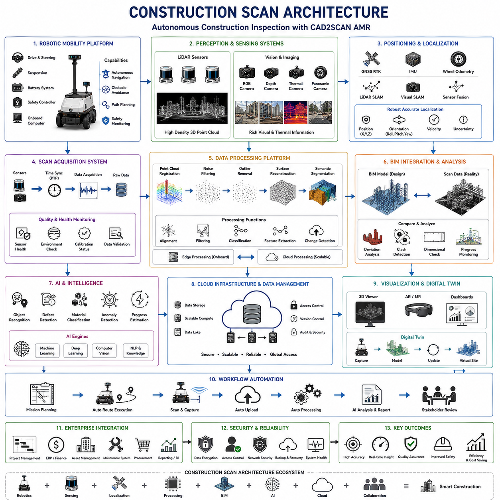
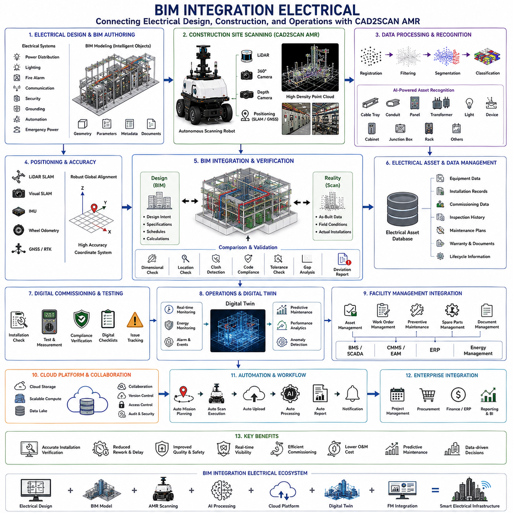
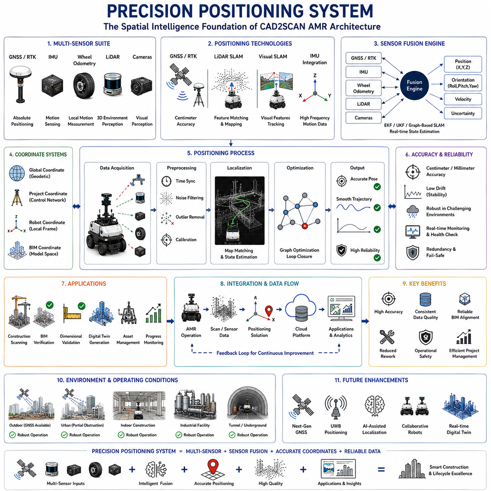
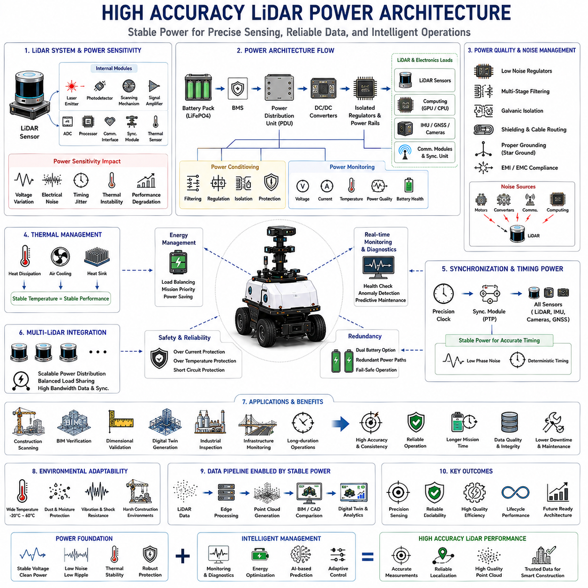
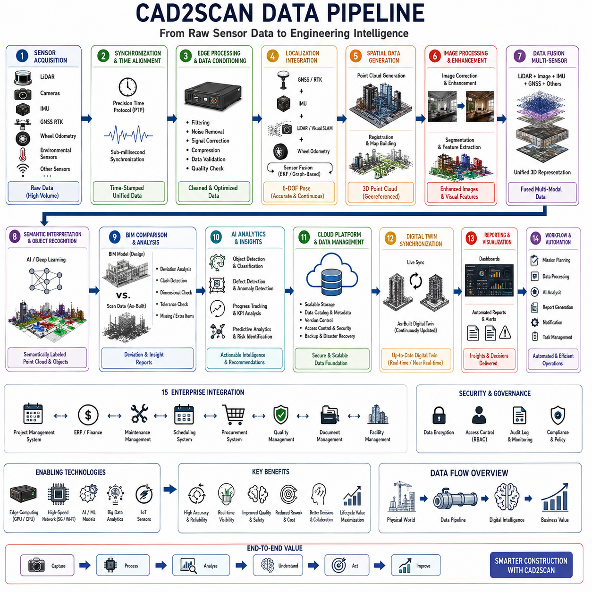

**Volume 13 AMR Electrical Architecture**

# Chapter 7. CAD2SCAN AMR

## 7.1 Construction Scan Architecture

{width="7.268055555555556in" height="7.268055555555556in"}

# 07_01 건설 스캔 아키텍처(Construction Scan Architecture)

건설 스캔 아키텍처(Construction Scan Architecture)는 자율형(Autonomous), 반자율형(Semi-Autonomous), 운영자 지원형(Operator-Assisted) 디지털 건설 검사(Digital Construction Inspection)를 가능하게 하는 핵심 시스템 프레임워크이다. 이 아키텍처는 로봇공학(Robotics), 레이저 스캐닝(Laser Scanning), 컴퓨터 비전(Computer Vision), 위치결정 인프라(Positioning Infrastructure), 건축정보모델(Building Information Modeling, BIM), 클라우드 컴퓨팅(Cloud Computing), 인공지능(Artificial Intelligence, AI)을 통합하여 물리적인 건설 현장을 지속적으로 갱신되는 디지털 공간으로 변환한다.

CAD2SCAN 기반 자율이동로봇(Autonomous Mobile Robot, AMR) 환경에서 건설 스캔 아키텍처는 실제 건설 현장과 디지털 엔지니어링 모델을 연결하는 핵심 역할을 수행한다. 이를 통해 설계 의도(Design Intent)와 실제 시공 상태(As-Built Condition)를 자동으로 비교할 수 있으며, 건설 품질(Quality), 진행 상황(Progress), 정확성(Accuracy)을 지속적으로 관리할 수 있다.

현대 건설 프로젝트는 생애주기(Lifecycle) 전반에 걸쳐 막대한 양의 공간 데이터(Spatial Data)를 생성한다. 전통적인 측량(Surveying) 및 수동 검사(Manual Inspection)는 많은 인력과 시간이 필요하며 전문 인력에 대한 의존도가 높다. 또한 건설 현장은 구조물(Structure), 기계 설비(Mechanical System), 전기 설비(Electrical System), 배관(Piping System), 건축 요소(Architectural Component)가 지속적으로 변화하는 동적인 환경이다. 건설 스캔 아키텍처는 이러한 환경을 자동으로 측정, 분석, 관리하여 실시간에 가까운 수준의 현장 가시성(Site Visibility)을 제공한다.

시스템 수준(System Level)에서 건설 스캔 아키텍처는 이동 플랫폼(Mobility Platform), 인지 시스템(Perception System), 위치결정 시스템(Localization System), 스캔 수집 시스템(Scan Acquisition System), 데이터 처리 플랫폼(Data Processing Platform), BIM 통합 계층(BIM Integration Layer), 클라우드 인프라(Cloud Infrastructure), AI 엔진(AI Engine), 시각화 환경(Visualization Environment), 업무 관리 시스템(Workflow Management System), 기업 통합 프레임워크(Enterprise Integration Framework)로 구성된다.

이동 플랫폼은 건설 스캔 아키텍처의 물리적 기반이다. 기존의 고정형 지상 레이저 스캐너(Terrestrial Laser Scanner)는 반복적인 설치와 이동이 필요하지만, AMR 기반 스캔 시스템은 건설 현장을 자율적으로 이동하면서 지속적으로 데이터를 수집할 수 있다. 이동 플랫폼은 구동 시스템(Drive System), 조향 시스템(Steering System), 서스펜션 시스템(Suspension System), 배터리 관리 시스템(Battery Management System), 안전 제어기(Safety Controller), 온보드 컴퓨팅(Onboard Computing)으로 구성된다.

건설 현장에서의 이동은 일반적인 물류 환경보다 훨씬 복잡하다. 건설 현장에는 임시 장애물(Temporary Obstacle), 미완성 바닥(Unfinished Surface), 이동 장비(Moving Equipment), 작업 인력(Personnel)이 존재한다. 따라서 로봇은 장애물 감지(Obstacle Detection), 충돌 회피(Collision Avoidance), 경로 계획(Path Planning), 위치결정(Localization), 안전 모니터링(Safety Monitoring)을 수행해야 한다.

인지 시스템은 공간 정보의 주요 공급원이다. 가장 중요한 센서는 라이다(LiDAR)이다. 고해상도 라이다는 조명 조건에 관계없이 정밀한 3차원 측정(3D Measurement)을 수행할 수 있다. 최신 건설 스캔 플랫폼은 여러 개의 라이다를 사용하여 시야(Field of View)를 확대하고 가려짐(Occlusion)을 최소화한다.

라이다와 함께 머신 비전(Machine Vision) 시스템도 중요한 역할을 수행한다. 고해상도 카메라(Camera)는 색상(Color), 질감(Texture), 표지(Signage), 장비 정보(Equipment Identification), 시공 상태(Construction Detail)를 기록한다. 스테레오 카메라(Stereo Camera), 깊이 카메라(Depth Camera), 파노라마 카메라(Panoramic Camera), 열화상 카메라(Thermal Camera)도 프로젝트 요구사항에 따라 활용될 수 있다.

다양한 센서의 결합은 건설 스캔의 가치를 크게 향상시킨다. 라이다는 정밀한 기하학적 정보(Geometric Information)를 제공하고, 카메라는 의미 정보(Semantic Information)를 제공하며, 열화상 카메라는 숨겨진 문제(Hidden Condition)를 탐지한다. 센서 융합(Sensor Fusion)은 이들 데이터를 하나의 통합된 디지털 모델로 결합한다.

정확한 위치결정은 건설 스캔의 필수 요소이다. 모든 측정 데이터는 정확한 공간 좌표(Spatial Coordinate)에 연결되어야 한다. 실내 환경에서는 동시 위치추정 및 지도작성(Simultaneous Localization and Mapping, SLAM)이 주로 사용된다. 이는 라이다, 카메라, 관성측정장치(IMU), 휠 오도메트리(Wheel Odometry)를 결합하여 위치를 추정한다. 실외 환경에서는 GNSS RTK를 추가하여 센티미터 수준(Centimeter-Level Accuracy)의 위치 정확도를 확보한다.

위치결정 정확도는 BIM 정합(BIM Alignment) 품질에 직접적인 영향을 준다. 작은 위치 오차도 BIM 모델과 실제 스캔 데이터 간의 큰 차이를 발생시킬 수 있다. 따라서 고급 센서 융합 알고리즘(Sensor Fusion Algorithm)은 위치(Position), 방향(Orientation), 속도(Velocity), 불확실성(Uncertainty)을 지속적으로 계산한다.

스캔 수집 시스템은 센서 데이터 획득을 담당한다. 고밀도 라이다는 초당 수백만 개의 포인트(Point)를 생성하며, 카메라는 동시에 고해상도 이미지를 생성한다. 따라서 데이터 수집 시스템은 센서 동기화(Sensor Synchronization), 버퍼 관리(Buffer Management), 저장 관리(Storage Management)를 수행해야 한다.

정밀시간프로토콜(Precision Time Protocol, PTP)은 여러 센서 간의 시간 정렬(Time Alignment)을 유지하기 위해 널리 사용된다. 또한 데이터 수집 단계에서부터 센서 상태(Sensor Health), 환경 조건(Environmental Condition), 캘리브레이션 상태(Calibration Status)를 모니터링하여 데이터 품질을 보장한다.

수집된 원시 데이터(Raw Data)는 데이터 처리 시스템(Data Processing System)으로 전달된다. 이 시스템은 포인트 클라우드 정합(Point Cloud Registration), 노이즈 제거(Noise Filtering), 이상치 제거(Outlier Removal), 표면 재구성(Surface Reconstruction), 의미론적 분할(Semantic Segmentation)을 수행한다.

포인트 클라우드 처리(Point Cloud Processing)는 가장 많은 계산 자원을 요구하는 작업 중 하나이다. 대규모 건설 프로젝트는 수십억 개의 포인트를 생성할 수 있으므로 GPU(Graphics Processing Unit)를 포함한 고성능 컴퓨팅(HPC)이 필요하다. 현장에서는 산업용 엣지 컴퓨터(Industrial Edge Computer)가 초기 처리를 수행하고, 클라우드에서는 대규모 분석이 수행된다.

건설 스캔 아키텍처의 핵심 차별화 요소는 BIM 통합(Building Information Modeling Integration)이다. BIM은 설계 모델(Design Model)을 표현하고, 스캔 데이터는 실제 시공 상태를 표현한다. 두 데이터를 비교함으로써 시공 오차(Construction Deviation), 품질 문제(Quality Issue), 진행 상황(Progress Status)을 자동으로 확인할 수 있다.

스캔-투-BIM(Scan-to-BIM) 프로세스는 포인트 클라우드를 엔지니어링 정보로 변환한다. 벽(Wall), 기둥(Column), 보(Beam), 덕트(Duct), 배관(Pipe), 케이블 트레이(Cable Tray), 설비(Equipment) 등을 자동으로 인식하고 BIM 객체와 연결한다. 이를 통해 수작업 모델링의 부담을 크게 줄일 수 있다.

진행 상황 모니터링(Progress Monitoring)은 건설 스캔 아키텍처의 가장 중요한 응용 분야 중 하나이다. 기존 방식은 현장 점검과 수작업 보고서에 의존했지만, 자동 스캔 시스템은 객관적인 진행률 데이터를 제공한다. AI 알고리즘은 현재 스캔 데이터와 BIM 모델, 공정 일정(Project Schedule)을 비교하여 공정 완료율(Completion Rate)을 계산한다.

인공지능은 건설 스캔 시스템의 핵심 요소로 발전하고 있다. 머신러닝(Machine Learning)과 딥러닝(Deep Learning)은 구조물 인식(Structure Recognition), 자재 분류(Material Classification), 결함 탐지(Defect Detection), 이상 탐지(Anomaly Detection)를 자동화한다.

결함 탐지(Defect Detection)는 AI의 대표적인 활용 사례이다. 시스템은 치수 오차(Dimensional Error), 정렬 불량(Misalignment), 누락된 설비(Missing Installation), 구조적 결함(Structural Defect), 시공 충돌(Construction Clash)을 자동으로 식별할 수 있다. 이를 통해 문제가 확대되기 전에 수정 조치를 수행할 수 있다.

안전 모니터링(Safety Monitoring) 또한 중요한 기능이다. 건설 현장에는 굴착 구역(Excavation Zone), 중장비(Machinery), 가설 구조물(Temporary Structure), 고소 작업 구역(Elevated Work Area) 등 다양한 위험 요소가 존재한다. AI는 스캔 데이터를 분석하여 위험 상황(Hazard Condition), 무단 접근(Unauthorized Access), 안전 장치 누락(Missing Safety Barrier)을 탐지할 수 있다.

클라우드 인프라(Cloud Infrastructure)는 중앙 집중형 데이터 관리(Centralized Data Management)를 가능하게 한다. 건축가(Architect), 엔지니어(Engineer), 시공사(Contractor), 발주처(Owner), 감리자(Inspector), 운영자(Operator)는 동일한 데이터 환경에서 정보를 공유할 수 있다.

클라우드 컴퓨팅은 대규모 데이터 분석과 AI 학습도 지원한다. 또한 버전 관리(Version Control), 접근 제어(Access Control), 감사 기록(Audit Trail)을 제공하여 데이터 신뢰성을 보장한다.

시각화 환경(Visualization Environment)은 복잡한 데이터를 이해하기 쉬운 형태로 변환한다. 사용자는 3차원 뷰어(3D Viewer)를 통해 건설 현장을 가상으로 탐색할 수 있다. 포인트 클라우드(Point Cloud), BIM 모델, 사진(Photo), 일정 정보(Schedule Information), 분석 결과(Analytics Result)를 하나의 화면에서 확인할 수 있다.

최근에는 증강현실(Augmented Reality, AR)과 혼합현실(Mixed Reality, MR)이 도입되면서 디지털 정보를 실제 현장에 직접 투영할 수 있게 되었다.

디지털 트윈(Digital Twin)은 건설 스캔 아키텍처의 미래 방향이다. 개별 스캔 데이터를 단순히 저장하는 것이 아니라 지속적으로 갱신되는 가상 자산(Virtual Asset)을 구축한다. 모든 스캔 데이터는 디지털 트윈에 반영되며 설계, 시공, 운영, 유지보수 전 과정을 지원한다.

업무 자동화(Workflow Automation)는 운영 효율성을 크게 향상시킨다. 로봇은 자동 임무 스케줄링(Automatic Mission Scheduling)에 따라 정기적으로 현장을 검사하고, 데이터를 자동 업로드(Auto Upload)하며, AI 기반 보고서(AI-Generated Report)를 생성한다. 이를 통해 건설 스캔은 단순한 측량 작업이 아니라 지속적인 정보 서비스(Continuous Information Service)로 발전하게 된다.

기업 통합(Enterprise Integration)은 건설 데이터를 프로젝트 관리 시스템(Project Management System), 전사적 자원 관리 시스템(Enterprise Resource Planning, ERP), 자산 관리 시스템(Asset Management System), 유지보수 시스템(Maintenance System), 조달 시스템(Procurement System)과 연결한다. 이를 통해 조직 전체가 데이터 기반 의사결정(Data-Driven Decision Making)을 수행할 수 있다.

사이버보안(Cybersecurity)은 점점 더 중요해지고 있다. 건설 스캔 데이터에는 시설 구조(Facility Layout), 기반시설 정보(Infrastructure Information), 설계 정보(Design Information), 운영 정보(Operational Information)가 포함될 수 있다. 따라서 데이터 암호화(Data Encryption), 접근 제어(Access Control), 인증(Authentication), 침입 탐지(Intrusion Detection)가 필수적이다.

미래의 건설 스캔 아키텍처는 자율 로봇 플릿(Autonomous Robot Fleet), AI 기반 현장 해석(AI Site Interpretation), 실시간 디지털 트윈(Real-Time Digital Twin), 다중 로봇 협업(Multi-Robot Collaboration)을 중심으로 발전할 것이다. 로봇은 지속적으로 현장을 순찰하며 스캔 데이터를 수집하고, AI는 공정 상태를 자동으로 분석하며, 디지털 트윈은 실제 건설 현장과 실시간으로 동기화될 것이다.

결론적으로 건설 스캔 아키텍처(Construction Scan Architecture)는 현대 건설 산업의 디지털 신경망(Digital Nervous System)이라고 할 수 있다. 이는 로봇 이동성(Robotic Mobility), 공간 데이터 수집(Spatial Data Acquisition), BIM 통합(BIM Integration), AI 분석(AI Analytics), 클라우드 컴퓨팅(Cloud Computing), 프로젝트 관리(Project Management)를 하나의 통합 생태계(Integrated Ecosystem)로 연결한다. CAD2SCAN AMR 관점에서 볼 때 건설 스캔 아키텍처는 자율 현실 캡처(Autonomous Reality Capture), 지능형 공정 모니터링(Intelligent Progress Monitoring), 데이터 기반 건설 관리(Data-Driven Construction Management)를 실현하는 핵심 기반 기술이라고 할 수 있다.

## 7.2 BIM Integration Electrical

{width="7.268055555555556in" height="7.268055555555556in"}

# 07_02 BIM 통합 전기(BIM Integration Electrical)

건축정보모델(Building Information Modeling, BIM) 통합 전기(BIM Integration Electrical)는 전기 설비 시스템(Electrical System), 디지털 건물 모델(Digital Building Model), 건설 스캐닝 기술(Construction Scanning Technology), 산업용 로봇(Industrial Robot), 시설 관리 플랫폼(Facility Management Platform), 운영 인텔리전스(Operational Intelligence)를 하나의 통합된 디지털 생태계(Digital Ecosystem)로 연결하는 종합적인 프로세스이다. CAD2SCAN 기반 자율이동로봇(Autonomous Mobile Robot, AMR) 아키텍처에서 BIM 전기 통합은 실제 전기 인프라(Electrical Infrastructure)와 디지털 표현(Digital Representation)을 연결하는 핵심 역할을 수행한다. 이를 통해 실시간 설치 검증(Real-Time Installation Verification), 공정 추적(Progress Tracking), 디지털 시운전(Digital Commissioning), 자산 관리(Asset Management), 예지보전(Predictive Maintenance)을 건물 전체 생애주기(Lifecycle)에 걸쳐 수행할 수 있다.

전통적인 전기 엔지니어링 프로젝트는 2차원 도면(2D Drawing), 수작업 문서화(Manual Documentation), 현장 점검(Field Inspection)에 의존해 왔다. 그러나 현대 건축물과 산업 시설은 점점 복잡해지고 있으며, 대형 상업시설(Commercial Building), 제조공장(Manufacturing Plant), 물류센터(Logistics Center), 반도체 공장(Semiconductor Factory), 공항(Airport), 병원(Hospital), 데이터센터(Data Center), 스마트 인프라(Smart Infrastructure)에는 수많은 전력 분배 시스템(Power Distribution System), 케이블 트레이(Cable Tray), 변압기(Transformer), 배전반(Switchboard), 통신 네트워크(Communication Network), 접지 시스템(Grounding System), 조명 시스템(Lighting System), 안전 설비(Safety Device), 자동화 장비(Automation Equipment)가 설치된다.

이러한 복잡한 전기 시스템을 기존 방식으로 관리하는 경우 설계 충돌(Coordinational Conflict), 시공 오류(Installation Error), 일정 지연(Schedule Delay), 재작업(Rework) 발생 가능성이 높아진다. BIM 전기 통합은 설계 단계부터 운영 단계까지 전기 인프라 전체를 디지털로 표현함으로써 이러한 문제를 최소화한다.

BIM 모델은 전기 시스템의 중앙 정보 저장소(Central Information Repository) 역할을 수행한다. 여기에는 전기 설비 배치(Layout), 장비 사양(Specification), 케이블 경로(Cable Routing), 부하 계산(Load Calculation), 유지보수 계획(Maintenance Requirement), 운영 파라미터(Operational Parameter), 수명 주기 정보(Lifecycle Data)가 포함된다. CAD2SCAN과 같은 로봇 기반 스캐닝 시스템은 이러한 BIM 모델과 실제 시공 상태를 지속적으로 비교하여 설계와 현실의 차이를 확인한다.

시스템 수준(System Level)에서 BIM 전기 통합은 전기 설계 시스템(Electrical Design System), BIM 저작 플랫폼(BIM Authoring Platform), 건설 스캐닝 시스템(Construction Scanning System), 위치결정 시스템(Localization System), 자산 데이터베이스(Asset Database), 현장 검증 시스템(Field Verification System), 클라우드 인프라(Cloud Infrastructure), 디지털 트윈 플랫폼(Digital Twin Platform), 시설 관리 시스템(Facility Management System), 기업 정보 시스템(Enterprise Information System)으로 구성된다.

전기 설계 영역(Electrical Design Domain)은 BIM 통합의 출발점이다. 전기 엔지니어는 중전압 시스템(Medium Voltage System), 저전압 시스템(Low Voltage System), 조명 시스템(Lighting System), 비상 전원 시스템(Emergency Power System), 통신 시스템(Communication Infrastructure), 화재 경보 시스템(Fire Alarm System), 보안 시스템(Security System), 산업 제어 시스템(Industrial Control System), 빌딩 자동화 시스템(Building Automation System)을 BIM 환경에서 설계한다.

전통적인 CAD 도면과 달리 BIM 객체(Object)는 단순한 형상이 아니라 다양한 엔지니어링 정보를 포함한다. 예를 들어 변압기 객체는 정격 용량(Capacity Rating), 효율(Efficiency), 제조사 정보(Manufacturer Information), 유지보수 일정(Maintenance Schedule), 예상 수명(Service Life), 모니터링 인터페이스(Monitoring Interface)를 포함할 수 있다. 케이블 트레이 객체는 허용 하중(Load Capacity), 충전율(Fill Ratio), 지지 조건(Support Requirement), 시공 공차(Installation Tolerance)를 포함한다.

이러한 BIM 모델은 다분야 협업(Multidisciplinary Coordination)에 중요한 역할을 한다. 현대 건설 프로젝트에서는 건축(Architecture), 구조(Structure), 기계(Mechanical), 배관(Plumbing), 소방(Fire Protection), 통신(Communication), 전기(Electrical)가 동일 공간을 공유한다. BIM은 자동 충돌 검토(Automated Clash Detection)를 수행하여 시공 전에 잠재적인 문제를 발견할 수 있도록 한다.

CAD2SCAN 환경에서는 자율 스캐닝 시스템이 실제 시공 상태를 지속적으로 측정한다. 고해상도 라이다(LiDAR), 머신 비전(Machine Vision), 깊이 카메라(Depth Camera), 위치결정 시스템(Positioning System)은 설치된 케이블 트레이, 전선관(Conduit), 배전반, 변압기, 조명기구(Lighting Fixture), 통신 캐비닛(Communication Cabinet), 전기실(Electrical Room)을 높은 정확도로 스캔한다.

스캔 데이터와 BIM의 관계는 시공 검증(Construction Verification)의 핵심이다. BIM은 설계 의도(Design Intent)를 나타내고, 스캔 데이터는 실제 시공 결과(As-Built Reality)를 나타낸다. 자동 비교 알고리즘(Comparison Algorithm)은 두 데이터셋을 비교하여 차이를 식별한다. 설치된 장비가 설계 위치에서 벗어나거나 사양이 다를 경우 자동으로 경고(Alert)를 생성할 수 있다.

전기 검증(Electrical Verification)은 단순한 치수 확인(Dimensional Validation)을 넘어선다. 최신 BIM 통합 시스템은 장비 배치(Equipment Placement), 방향(Orientation), 유지보수 공간(Maintenance Clearance), 접근성(Accessibility), 케이블 경로 적합성(Cable Routing Compliance), 안전 거리(Safety Separation Distance), 규정 준수(Regulatory Compliance)를 자동으로 평가할 수 있다.

위치결정 정확도(Localization Accuracy)는 BIM 전기 통합에서 매우 중요하다. 모든 스캔 데이터는 BIM 객체와 정확하게 정렬되어야 한다. 이를 위해 라이다 슬램(LiDAR SLAM), 비전 슬램(Visual SLAM), 관성측정장치(IMU), 휠 오도메트리(Wheel Odometry), GNSS를 조합한 하이브리드 위치결정(Hybrid Localization)이 사용된다.

포인트 클라우드(Point Cloud) 처리는 스캔 데이터와 BIM을 연결하는 중간 단계이다. 원시 데이터(Raw Data)는 필터링(Filter), 정합(Registration), 분할(Segmentation), 분류(Classification)를 거친 후 BIM 비교 작업에 사용된다. 인공지능(AI)은 포인트 클라우드에서 전기 설비를 자동 인식하고 해당 BIM 객체와 연결한다. 이러한 과정을 스캔-투-BIM(Scan-to-BIM)이라고 한다.

전기 자산 인식(Electrical Asset Recognition)은 BIM 통합에서 가장 가치 있는 AI 응용 분야 중 하나이다. 딥러닝(Deep Learning) 모델은 배전반(Switchboard), 모터 제어반(Motor Control Center), 변압기, 케이블 트레이, 전선관, 전기 캐비닛(Electrical Cabinet), 접속함(Junction Box), 조명 장치, 통신 랙(Communication Rack)을 자동으로 식별할 수 있다.

메타데이터(Metadata) 통합은 BIM의 가치를 더욱 향상시킨다. 모든 전기 자산은 설계 사양(Engineering Specification), 시공 기록(Installation Record), 시운전 보고서(Commissioning Report), 점검 이력(Inspection History), 유지보수 계획(Maintenance Schedule), 보증 정보(Warranty Information), 운영 매뉴얼(Operation Manual)과 연결될 수 있다.

디지털 시운전(Digital Commissioning)은 BIM 전기 통합이 제공하는 중요한 발전이다. 전통적인 시운전은 사람이 직접 설계 문서와 실제 설치 상태를 비교해야 했지만, BIM 기반 시운전은 스캔 데이터와 디지털 체크리스트(Digital Checklist)를 활용하여 대부분의 검증 과정을 자동화할 수 있다.

전기 시험 및 검증(Electrical Testing and Validation) 또한 BIM과 통합될 수 있다. 절연 시험(Insulation Test), 연속성 시험(Continuity Test), 접지 시험(Grounding Verification), 열화상 검사(Thermal Imaging Inspection), 전력 품질 분석(Power Quality Analysis), 보호 계전기 시험(Protection System Testing) 결과는 BIM 객체와 직접 연결된다.

시설 관리 시스템(Facility Management System)은 BIM 전기 통합의 가장 중요한 운영 단계이다. 건설이 완료되면 BIM 모델은 자산 관리 플랫폼(Asset Management Platform)으로 전환된다. 운영자는 BIM을 통해 장비 위치를 확인하고, 유지보수 이력을 조회하며, 운영 문서를 즉시 확인할 수 있다.

디지털 트윈(Digital Twin)은 BIM 통합을 더욱 발전시킨 개념이다. BIM이 정적인 모델이라면 디지털 트윈은 실시간으로 갱신되는 가상 모델(Virtual Model)이다. 전압(Voltage), 전류(Current), 장비 온도(Equipment Temperature), 차단기 상태(Breaker Status), 전력 소비(Power Consumption), 에너지 효율(Energy Efficiency), 고장 상태(Fault Condition)가 실시간으로 BIM 모델에 반영된다.

실시간 모니터링(Real-Time Monitoring)은 예지보전(Predictive Maintenance)을 가능하게 한다. 머신러닝 알고리즘은 운영 데이터를 분석하여 이상 상태(Abnormal Condition)를 조기에 발견한다. 변압기, 배전반, UPS, 비상 발전기(Backup Generator), 전력분배장치(PDU) 등의 핵심 장비를 지속적으로 감시할 수 있다.

에너지 관리(Energy Management) 역시 BIM 전기 통합의 중요한 장점이다. 전력 계량 시스템(Metering System), 빌딩 자동화 시스템(Building Automation System), BIM 모델을 통합함으로써 시설 관리자는 에너지 사용 패턴(Energy Consumption Pattern)을 상세하게 분석할 수 있다. 이를 통해 비효율적인 설비를 찾아내고 운영을 최적화할 수 있다.

산업용 사물인터넷(Industrial Internet of Things, IIoT)은 BIM 통합을 더욱 지능적으로 만든다. 스마트 센서(Smart Sensor)는 실시간 데이터를 수집하고, 무선 통신망(Wireless Communication Network)을 통해 중앙 시스템으로 전송한다. BIM은 이러한 정보를 시각화하는 인터페이스 역할을 수행한다.

사이버보안(Cybersecurity)은 BIM 전기 통합에서 점점 더 중요해지고 있다. 전기 시스템은 국가 기반시설(Critical Infrastructure)과 직결될 수 있기 때문에 설계 정보, 운영 데이터, 제어 시스템에 대한 무단 접근을 방지해야 한다. 이를 위해 인증(Authentication), 역할 기반 접근 제어(Role-Based Access Control), 암호화 통신(Encrypted Communication), 보안 클라우드(Security Cloud), 침입 탐지(Intrusion Detection)가 필요하다.

클라우드 컴퓨팅(Cloud Computing)은 대규모 BIM 통합을 가능하게 한다. 건설 프로젝트와 운영 시설은 방대한 양의 데이터를 생성하므로 확장 가능한 저장소(Storage), 연산 자원(Compute Resource), 협업 환경(Collaboration Environment)이 필요하다. 클라우드는 이를 효율적으로 제공한다.

기업 통합(Enterprise Integration)은 BIM의 가치를 조직 전체로 확장한다. BIM은 전사적 자원 관리(Enterprise Resource Planning, ERP), 유지보수 관리 시스템(Maintenance Management System), 구매 시스템(Procurement System), 프로젝트 관리 시스템(Project Management System), 재고 관리 시스템(Inventory System), 재무 관리 시스템(Financial Reporting System)과 연결될 수 있다.

자동화 워크플로우(Automation Workflow)는 운영 효율성을 극대화한다. 자율 로봇은 정기적으로 점검을 수행하고, 스캔 데이터를 업로드하며, BIM 비교를 수행하고, 이상 보고서를 생성하며, 담당자에게 자동으로 알림을 보낼 수 있다.

인공지능의 역할은 앞으로 더욱 확대될 것이다. 미래의 BIM 전기 통합 시스템은 설계 검증(Design Verification), 시공 검증(Construction Validation), 이상 탐지(Anomaly Detection), 자산 인식(Asset Recognition), 유지보수 계획(Maintenance Planning), 운영 최적화(Operational Optimization)를 대부분 자동으로 수행하게 될 것이다.

궁극적으로 BIM 통합 전기(BIM Integration Electrical)는 현대 전기 인프라 관리의 디지털 백본(Digital Backbone)이라고 할 수 있다. 이는 전기 설계(Electrical Design), 로봇 스캐닝(Robotic Scanning), 시공 검증(Construction Verification), 자산 관리(Asset Management), 운영 모니터링(Operational Monitoring), 디지털 트윈(Digital Twin)을 하나의 통합 프레임워크로 연결한다. CAD2SCAN AMR 아키텍처에서 BIM 전기 통합은 전기 설비를 단순한 물리적 자산이 아닌, 지속적으로 갱신되고 학습하는 지능형 디지털 자산(Intelligent Digital Asset)으로 전환시키는 핵심 기술이라고 할 수 있다.

## 7.3 Precision Positioning System

{width="7.268055555555556in" height="7.268055555555556in"}

# 07_03 정밀 위치결정 시스템(Precision Positioning System)

정밀 위치결정 시스템(Precision Positioning System)은 CAD2SCAN 자율이동로봇(Autonomous Mobile Robot, AMR) 아키텍처에서 가장 중요한 핵심 서브시스템 중 하나이다. 로봇이 생성하는 모든 스캔 데이터(Scan Data), 이미지(Image), 측정 결과(Measurement), 검사 기록(Inspection Record), 디지털 자산(Digital Asset)은 반드시 정확한 공간 위치(Spatial Location)와 연결되어야 하기 때문이다. 건설 스캐닝(Construction Scanning), 산업 설비 검사(Industrial Inspection), 인프라 매핑(Infrastructure Mapping), 디지털 트윈(Digital Twin), 건축정보모델(Building Information Modeling, BIM) 검증, 자산 관리(Asset Management)와 같은 분야에서는 위치 정확도(Positioning Accuracy)가 최종 결과물의 품질을 결정한다. 아무리 우수한 라이다(LiDAR), 카메라(Camera), 인공지능(AI) 기술을 사용하더라도 위치 정보가 부정확하면 데이터의 가치가 크게 감소한다. 따라서 정밀 위치결정 시스템은 건설 스캐닝 생태계 전체를 지탱하는 공간적 기반(Spatial Foundation)이라고 할 수 있다.

정밀 위치결정 시스템의 가장 중요한 목적은 로봇이 복잡하고 변화하는 환경 속에서 이동하는 동안 자신의 위치(Position), 자세(Orientation), 속도(Velocity), 운동 상태(Motion State)를 지속적으로 계산하는 것이다. 일반적인 내비게이션 시스템(Navigation System)이 목적지까지의 이동을 지원하는 수준이라면, 정밀 위치결정 시스템은 센티미터(Centimeter) 수준 또는 경우에 따라 밀리미터(Millimeter) 수준의 정확도를 제공해야 한다. 이러한 정확도는 BIM 검증, 치수 검사(Dimensional Validation), 공차 분석(Tolerance Analysis), 디지털 트윈 구축과 같은 엔지니어링 작업에 필수적이다.

건설 현장은 위치결정 측면에서 매우 어려운 환경이다. 공사 중인 건물(Building Under Construction)은 완성된 구조물이 없으며, 임시 구조물(Temporary Structure), 자재(Material), 중장비(Heavy Equipment), 크레인(Crane), 비계(Scaffolding), 작업자(Personnel)가 지속적으로 이동한다. 실내 환경에서는 위성 신호(Satellite Signal)가 차단될 수 있으며, 실외 환경에서는 다중 경로 반사(Multipath Reflection), 신호 차폐(Signal Obstruction), 기상 변화(Environmental Variation) 등이 발생한다. 따라서 단일 기술만으로는 충분하지 않으며 여러 위치결정 기술을 통합해야 한다.

시스템 아키텍처(System Architecture) 수준에서 정밀 위치결정 시스템은 위성항법시스템(Global Navigation Satellite System, GNSS), 실시간 이동측위(Real-Time Kinematic, RTK), 관성측정장치(Inertial Measurement Unit, IMU), 휠 오도메트리(Wheel Odometry), 라이다 기반 위치결정(LiDAR Localization), 비전 기반 위치결정(Visual Localization), 동시 위치추정 및 지도작성(Simultaneous Localization and Mapping, SLAM), 센서 융합 엔진(Sensor Fusion Engine), 좌표계 관리 시스템(Coordinate Management System), 캘리브레이션 프레임워크(Calibration Framework), 오차 보정 시스템(Error Correction Mechanism)으로 구성된다.

GNSS는 실외 환경에서 절대 위치(Absolute Position)를 제공하는 기본 기술이다. 최신 GNSS 수신기는 GPS, GLONASS, Galileo, BeiDou 등 여러 위성 시스템을 동시에 활용한다. 이를 통해 위성 가용성(Availability)과 정확도(Accuracy)를 향상시킬 수 있다. 하지만 일반적인 GNSS는 수 미터(Meter) 수준의 오차를 가지므로 건설 스캐닝에는 충분하지 않다.

이를 해결하기 위해 RTK 기술이 사용된다. RTK는 기준국(Base Station)에서 생성된 보정 데이터(Correction Data)를 활용하여 대기 오차(Atmospheric Error), 위성 시계 오차(Satellite Clock Error), 궤도 오차(Orbital Error)를 제거한다. RTK가 정상적으로 동작하면 센티미터 수준의 정확도를 제공할 수 있다. 이러한 정확도 덕분에 스캔 데이터는 프로젝트 기준 좌표계(Project Coordinate System)와 직접 연결될 수 있다.

최근에는 네트워크 RTK(Network RTK) 서비스도 널리 사용된다. 별도의 기준국을 설치하지 않고 이동통신망(Mobile Network)을 통해 보정 정보를 수신할 수 있다. 이를 통해 넓은 건설 현장이나 인프라 프로젝트에서도 높은 정확도를 유지할 수 있다.

그러나 GNSS RTK는 모든 환경에서 사용할 수 있는 것은 아니다. 건물(Building), 교량(Bridge), 터널(Tunnel), 공장(Industrial Facility), 지하 공간(Underground Area)에서는 위성 신호가 차단되거나 품질이 크게 저하될 수 있다. 따라서 이를 보완하기 위한 기술이 필요하다.

관성측정장치(IMU)는 가장 중요한 보조 센서 중 하나이다. IMU는 가속도계(Accelerometer)와 자이로스코프(Gyroscope)를 포함하며, 차량의 선형 가속도(Linear Acceleration)와 각속도(Angular Velocity)를 측정한다. 이를 적분하여 위치 변화(Position Change)와 자세 변화(Orientation Change)를 추정할 수 있다.

IMU는 GNSS 신호가 일시적으로 끊기는 상황에서 매우 중요한 역할을 수행한다. IMU 단독으로는 시간이 지남에 따라 드리프트(Drift)가 발생하지만, 짧은 시간 동안은 안정적인 위치 추정을 제공한다. 따라서 실내와 실외를 이동하는 환경이나 GNSS 음영지역(Shadow Area)에서 매우 유용하다.

휠 오도메트리(Wheel Odometry)는 또 다른 위치 정보 공급원이다. 바퀴에 장착된 엔코더(Encoder)가 회전량을 측정하여 차량 이동 거리를 계산한다. 오도메트리는 높은 해상도의 이동 정보를 제공하지만, 바퀴 미끄러짐(Wheel Slip), 노면 상태(Road Surface), 기계적 마모(Mechanical Wear) 등의 영향을 받는다. 따라서 일반적으로 단독 사용보다는 다른 센서와 결합하여 활용된다.

라이다 기반 위치결정(LiDAR Localization)은 건설 스캐닝 분야에서 매우 강력한 기술이다. 라이다는 주변 환경의 3차원 형상(3D Geometry)을 측정한다. 위치결정 알고리즘은 현재 스캔한 데이터와 기존 지도(Map)를 비교하여 차량 위치를 계산한다.

라이다 위치결정의 장점은 실내와 실외 모두에서 사용할 수 있고 조명 조건(Lighting Condition)의 영향을 거의 받지 않는다는 점이다. 건설 현장은 복잡한 구조물과 풍부한 기하학적 특징(Geometric Feature)을 가지고 있기 때문에 라이다 기반 정합(Matching)에 매우 적합하다.

비전 기반 위치결정(Visual Localization)은 카메라 영상을 활용한다. 컴퓨터 비전(Computer Vision) 알고리즘은 이미지 속 특징점(Feature Point)을 추적하여 차량의 위치와 방향을 계산한다. 카메라는 단순한 위치 정보뿐 아니라 주변 환경에 대한 의미 정보(Semantic Information)도 제공할 수 있다.

비전 SLAM(Visual SLAM)은 위치결정과 지도 생성을 동시에 수행한다. 로봇이 이동하면서 환경 지도를 생성하고 동시에 자신의 위치를 계산한다. 건설 현장처럼 사전 지도가 없는 환경에서 매우 유용하다.

라이다 SLAM(LiDAR SLAM)은 카메라 대신 라이다 데이터를 활용하는 방식이다. 일반적으로 더 높은 기하학적 정확도를 제공하며 조명 변화에 강하다. 최신 CAD2SCAN 플랫폼은 비전 SLAM과 라이다 SLAM을 동시에 사용하는 경우가 많다.

센서 융합(Sensor Fusion)은 위치결정 시스템의 두뇌 역할을 수행한다. 어떤 센서도 모든 상황에서 완벽한 성능을 제공하지 못한다. GNSS는 차폐 문제를 겪고, IMU는 드리프트가 발생하며, 오도메트리는 슬립 영향을 받고, 카메라는 조명 영향을 받는다. 센서 융합 알고리즘은 모든 센서 정보를 종합하여 최적의 위치를 계산한다.

확장 칼만 필터(Extended Kalman Filter, EKF)는 가장 널리 사용되는 센서 융합 방법이다. 최근에는 무향 칼만 필터(Unscented Kalman Filter), 파티클 필터(Particle Filter), 팩터 그래프 최적화(Factor Graph Optimization), 그래프 기반 SLAM(Graph-Based SLAM)도 활용되고 있다.

좌표계 관리(Coordinate Management)는 또 다른 중요한 요소이다. 건설 프로젝트에서는 여러 좌표계가 동시에 사용된다. 전역 좌표계(Global Coordinate System), 프로젝트 좌표계(Project Coordinate System), 로봇 좌표계(Robot Coordinate System), BIM 좌표계(BIM Coordinate System)가 존재할 수 있다. 정밀 위치결정 시스템은 이들 좌표계 간의 변환(Transformation)을 정확하게 수행해야 한다.

캘리브레이션(Calibration)은 위치 정확도를 유지하기 위한 필수 과정이다. 라이다, 카메라, IMU, GNSS 안테나, 엔코더 등 모든 센서는 로봇 기준 좌표계(Robot Coordinate Frame)에 대해 정확히 정렬되어야 한다. 작은 캘리브레이션 오차도 전체 위치결정 정확도에 영향을 줄 수 있다.

환경 조건(Environmental Condition)은 위치결정 성능에 큰 영향을 준다. 온도 변화(Temperature Variation), 진동(Vibration), 먼지(Dust), 습기(Moisture), 비(Rain), 안개(Fog), 전자파 간섭(Electromagnetic Interference)은 모두 센서 성능을 저하시킬 수 있다. 따라서 시스템은 환경 상태를 지속적으로 모니터링하고 적응해야 한다.

오차 모델링(Error Modeling)과 오차 보정(Error Correction)은 엔지니어링 수준의 정확도를 확보하기 위해 필요하다. 위치결정 시스템은 모든 측정값에 대해 신뢰도(Confidence Level)와 불확실성(Uncertainty)을 계산한다. 이를 통해 BIM 검증이나 품질 검사에서 데이터 신뢰성을 판단할 수 있다.

건설 스캐닝은 수개월 또는 수년에 걸쳐 반복적으로 수행되는 경우가 많다. 따라서 순간 정확도뿐만 아니라 장기 일관성(Long-Term Consistency)도 중요하다. 오늘 수집한 데이터와 몇 달 후 수집한 데이터가 동일한 좌표계에서 정확히 정렬되어야 한다.

BIM 통합(BIM Integration)은 정밀 위치결정 시스템의 가치를 더욱 높여준다. 위치 정보가 정확할수록 스캔 데이터와 BIM 객체(BIM Object)를 자동으로 연결할 수 있다. 이를 통해 자동 공정 관리(Automated Progress Tracking), 시공 오차 검출(Construction Deviation Detection), 품질 검증(Quality Verification)이 가능해진다.

디지털 트윈(Digital Twin) 역시 정밀 위치결정에 크게 의존한다. 디지털 트윈은 실제 자산(Physical Asset)의 가상 복제본(Virtual Representation)이다. 모든 센서 데이터와 검사 정보는 정확한 위치 정보와 연결되어야 디지털 트윈의 신뢰성이 유지된다.

최근에는 인공지능(AI)이 위치결정 기술에도 적용되고 있다. 머신러닝(Machine Learning)은 센서 융합을 개선하고, 위치 오류를 예측하며, 캘리브레이션을 자동화하고, 환경에 따라 최적의 위치결정 전략을 선택할 수 있다.

클라우드 연결(Cloud Connectivity)은 또 다른 발전 방향이다. 여러 대의 로봇이 동일한 현장에서 작업할 경우 지도 정보(Map Information)를 공유하고 협업 위치결정(Collaborative Localization)을 수행할 수 있다. 이를 통해 정확도와 운영 효율성을 동시에 향상시킬 수 있다.

안전 시스템(Safety System) 역시 위치결정에 의존한다. 충돌 회피(Collision Avoidance), 지오펜싱(Geofencing), 출입 제한 구역 관리(Restricted Area Management), 비상 대응(Emergency Response)은 모두 정확한 위치 정보를 필요로 한다. 따라서 위치결정 시스템에는 이중화(Redundancy), 고장 감지(Fault Detection), 상태 모니터링(Health Monitoring), 페일세이프(Fail-Safe) 기능이 포함된다.

미래의 정밀 위치결정 시스템은 더욱 높은 정확도와 자율성을 제공하게 될 것이다. 다중 센서 융합(Multi-Sensor Fusion), AI 기반 위치결정(AI-Assisted Localization), 차세대 GNSS(Next-Generation GNSS), 초광대역 위치결정(Ultra-Wideband, UWB), 비전-관성 항법(Visual-Inertial Navigation), 협업 로봇(Collaborative Robotics), 디지털 트윈 통합(Digital Twin Integration)이 지속적으로 발전할 것으로 예상된다.

결론적으로 정밀 위치결정 시스템(Precision Positioning System)은 CAD2SCAN AMR 아키텍처의 공간 지능 백본(Spatial Intelligence Backbone)이다. 다양한 센서 데이터를 하나의 통합된 위치 정보로 변환하며, 모든 스캔 데이터, 이미지, BIM 비교 결과, 디지털 트윈 업데이트, 엔지니어링 의사결정의 기반이 된다. 건설 스캐닝 생태계에서 정밀 위치결정 시스템은 현실 세계(Physical World)와 디지털 세계(Digital World)를 정확하게 연결하는 핵심 기술이며, 자율 현실 캡처(Autonomous Reality Capture), 자동 검증(Automated Verification), 디지털 건설 관리(Digital Construction Management), 지능형 자산 생애주기 관리(Intelligent Asset Lifecycle Management)를 가능하게 하는 가장 중요한 기반 기술 중 하나이다.

## 7.4 High Accuracy LiDAR Power

{width="7.268055555555556in" height="7.268055555555556in"}

# 07_04 고정밀 라이다 전원 시스템(High Accuracy LiDAR Power)

고정밀 라이다 전원 시스템(High Accuracy LiDAR Power)은 건설 자동화(Construction Automation), 디지털 트윈(Digital Twin), BIM 검증(Building Information Modeling Validation), 산업 설비 검사(Industrial Inspection), CAD2SCAN 자율이동로봇(Autonomous Mobile Robot, AMR) 환경에서 사용되는 정밀 라이다(LiDAR) 스캐닝 플랫폼을 지원하기 위한 전력 아키텍처(Power Architecture), 에너지 관리(Energy Management), 전원 품질 제어(Power Quality Control), 운영 신뢰성 시스템(Operational Reliability System)을 의미한다. 라이다는 일반적으로 센서 기술(Sensor Technology)로 인식되지만 실제 측정 정확도(Measurement Accuracy), 스캔 거리(Scanning Range), 포인트 클라우드 품질(Point Cloud Quality), 동기화 정밀도(Synchronization Precision), 장기 안정성(Long-Term Reliability)은 전원 시스템의 품질에 직접적으로 의존한다. 따라서 고정밀 스캐닝 시스템에서 전력은 단순한 에너지 공급원이 아니라 측정 성능을 결정하는 핵심 요소이다.

현대의 건설 스캐닝 로봇은 고해상도 라이다를 주요 인지 센서(Perception Sensor)로 사용한다. 고성능 라이다는 초당 수백만 개 이상의 측정값을 생성하며 거리(Distance), 반사율(Reflectivity), 강도(Intensity), 공간 좌표(Spatial Coordinate)를 계산한다. 이러한 데이터는 위치결정(Localization), 지도 생성(Mapping), 객체 인식(Object Recognition), BIM 검증(BIM Validation), 치수 검증(Dimensional Verification), 디지털 트윈 생성(Digital Twin Generation)의 기반이 된다. 모든 라이다 측정은 광학(Optics), 전자회로(Electronics), 계산 시스템(Computing System)의 연속적인 동작을 통해 생성되므로 전원 품질은 결과 데이터 품질에 직접적인 영향을 준다.

고정밀 라이다 전원 시스템의 주요 목적은 환경 변화(Environmental Condition), 연산 부하(Computational Load), 운용 시간(Operation Duration), 로봇 이동 상태(Motion State)에 관계없이 깨끗하고(Clean), 안정적이며(Stable), 효율적이고(Efficient), 끊김 없는(Uninterrupted) 전력을 제공하는 것이다. 특히 BIM 검증이나 정밀 시공 검사와 같이 수 밀리미터 수준의 오차도 허용되지 않는 엔지니어링 환경에서는 전원 품질이 매우 중요하다.

CAD2SCAN AMR 아키텍처에서 라이다 전원 시스템은 배터리 시스템(Battery System), 전력 분배 장치(Power Distribution Unit), DC/DC 컨버터(DC/DC Converter), 센서 인터페이스(Sensor Interface), 동기화 네트워크(Synchronization Network), 엣지 컴퓨팅 시스템(Edge Computing System), 통신 장치(Communication Device), 안전 제어기(Safety Controller), 모터 드라이버(Motor Driver), 충전 시스템(Charging System), 환경 모니터링 시스템(Environment Monitoring System)과 함께 하나의 통합 전기 생태계(Electrical Ecosystem)를 구성한다.

하드웨어 수준(Hardware Level)에서 라이다는 레이저 송신기(Laser Emitter), 광 검출기(Photo Detector), 스캐닝 메커니즘(Scanning Mechanism), 신호 증폭기(Signal Amplifier), 아날로그-디지털 변환기(Analog-to-Digital Converter, ADC), 임베디드 프로세서(Embedded Processor), 통신 제어기(Communication Controller), 동기화 인터페이스(Synchronization Interface), 열 관리 시스템(Thermal Management System) 등으로 구성된다. 각 구성 요소는 서로 다른 전압과 전류를 요구하며 전원 품질에 대한 민감도도 다르다.

레이저 송신기는 가장 전원 품질에 민감한 구성 요소 중 하나이다. 레이저 펄스(Laser Pulse)는 일정한 에너지(Energy), 펄스 폭(Pulse Width), 타이밍 정밀도(Timing Precision)를 유지해야 한다. 전압 변동(Voltage Fluctuation)이 발생하면 레이저 출력 특성이 변화할 수 있으며 이는 거리 측정 정확도에 영향을 줄 수 있다. 특히 장거리 스캐닝(Long Range Scanning)에서는 작은 출력 변화도 측정 오차로 이어질 수 있다.

광 검출기(Photo Detector) 또한 매우 민감하다. 수신부는 먼 거리에서 반사되어 돌아오는 매우 약한 광 신호를 감지해야 한다. 따라서 전원선(Power Line)을 통해 유입되는 전기적 노이즈(Electrical Noise)는 실제 측정 신호와 함께 증폭될 수 있으며 결과적으로 탐지 감도(Detection Sensitivity)를 저하시킨다.

신호 처리 전자장치(Signal Processing Electronics) 역시 안정적인 전원을 필요로 한다. 최신 라이다는 거리 계산(Distance Calculation), 강도 분석(Intensity Analysis), 환경 보정(Environmental Compensation), 필터링(Filter Processing), 통신 제어(Communication Control)를 수행하기 위해 고속 디지털 프로세서를 사용한다. 전원 이상은 계산 오류(Computational Error), 통신 장애(Communication Failure), 시스템 재시작(System Reset) 등을 유발할 수 있다.

라이다 거리 측정은 시간 비행(Time-of-Flight) 원리를 기반으로 한다. 나노초(Nanosecond) 수준의 시간 오차가 밀리미터 수준의 거리 오차로 이어질 수 있다. 따라서 발진기(Oscillator), 클록 회로(Clock Circuit), 동기화 모듈(Synchronization Module)은 매우 안정적인 전원을 필요로 한다. 이러한 회로는 일반적으로 별도의 저노이즈 전원(Low Noise Power Supply)을 사용한다.

전원 시스템 설계는 에너지 저장(Energy Storage)에서 시작된다. 대부분의 CAD2SCAN AMR은 리튬 기반 배터리(Lithium Battery)를 사용한다. 특히 리튬인산철 배터리(Lithium Iron Phosphate Battery, LFP)는 높은 안전성(Safety), 긴 수명(Long Cycle Life), 우수한 열 안정성(Thermal Stability)을 제공하기 때문에 산업용 플랫폼에서 널리 사용된다.

배터리는 직접 라이다에 전력을 공급하지 않는다. 배터리 전압은 충전 상태(State of Charge), 온도(Temperature), 부하(Load)에 따라 변동하기 때문이다. 따라서 전원 변환(Power Conversion) 과정이 필요하다.

DC/DC 컨버터는 배터리 전압을 라이다와 전자장치에 적합한 안정적인 전압으로 변환한다. 일반적으로 여러 개의 전압 레일(Voltage Rail)이 사용된다. 아날로그 회로(Analog Circuit)는 독립적인 저노이즈 전원을 사용하고 디지털 회로(Digital Circuit)는 별도의 전압 조정기(Voltage Regulator)를 사용한다. 이러한 분리는 전기적 간섭(Electrical Interference)을 최소화한다.

전압 안정화(Voltage Regulation)는 측정 일관성(Measurement Consistency)을 유지하는 핵심 기술이다. 고성능 전압 조정기는 입력 전압 변화에도 불구하고 밀리볼트(Millivolt) 수준의 안정성을 유지할 수 있다. 이를 통해 환경 변화와 부하 변화가 발생하더라도 일정한 성능을 유지할 수 있다.

노이즈 관리(Noise Management)는 고정밀 라이다 전원 설계에서 가장 중요한 요소 중 하나이다. AMR에는 모터 제어기(Motor Controller), 스위칭 전원(Switching Power Supply), 무선 통신 장치(Wireless Communication Device), 산업용 이더넷(Industrial Ethernet), GPU, CPU 등이 존재하며 모두 전자파 간섭(Electromagnetic Interference, EMI)을 발생시킨다. 이러한 간섭은 라이다 성능을 저하시킬 수 있다.

이를 방지하기 위해 절연(Isolation) 기술이 사용된다. 갈바닉 절연(Galvanic Isolation)은 센서 회로와 고전력 추진 시스템(Propulsion System)을 분리한다. 절연형 DC/DC 컨버터(Isolated DC/DC Converter)는 공통 모드 노이즈(Common Mode Noise)를 차단하며 접지 루프(Ground Loop)를 방지한다.

접지 설계(Grounding Architecture) 또한 매우 중요하다. 잘못된 접지는 노이즈 경로를 형성하고 측정 오차를 증가시킬 수 있다. 고정밀 라이다 플랫폼은 센서 접지(Sensor Ground), 섀시 접지(Chassis Ground), 전력 접지(Power Ground), 신호 접지(Signal Ground)를 분리하여 설계하는 경우가 많다.

전자기 적합성(Electromagnetic Compatibility, EMC)은 전원 공급 장치뿐 아니라 케이블(Cable), 커넥터(Connector), 차폐(Shielding), 인쇄회로기판(Printed Circuit Board, PCB) 설계에도 영향을 받는다. 고전류 배선은 민감한 아날로그 회로와 최대한 분리하여 배치해야 한다.

열 관리(Thermal Management)는 전원 시스템과 라이다 성능을 동시에 좌우한다. 전자 부품은 작동 중 열을 발생시키며 높은 온도는 전압 안정성, 배터리 효율, 레이저 출력 안정성, 검출기 감도, 클록 정확도를 저하시킨다. 따라서 열 관리와 전원 관리는 함께 설계되어야 한다.

고급 라이다는 온도 보상(Temperature Compensation) 기능을 포함한다. 내부 온도 센서(Temperature Sensor)는 환경 변화를 감지하고 자동으로 보정값을 적용한다. 전원 관리 시스템도 과열(Thermal Overload)을 방지하기 위해 동작 모드를 조정할 수 있다.

전력 모니터링(Power Monitoring)은 최근 더욱 중요해지고 있다. 시스템은 전압(Voltage), 전류(Current), 전력 품질(Power Quality), 온도(Thermal Condition), 배터리 상태(Battery Health)를 실시간으로 감시한다. 이러한 정보는 예방 정비(Predictive Maintenance)와 고장 진단(Fault Diagnosis)에 활용된다.

에너지 관리(Energy Management)는 장시간 검사 임무(Long-Duration Mission)에서 매우 중요하다. 공항(Airport), 터널(Tunnel), 산업 단지(Industrial Facility), 대형 건설 현장(Large Construction Site)은 수 시간 이상 연속 운용이 필요할 수 있다. 지능형 에너지 관리 시스템은 남은 배터리 용량과 임무 우선순위를 고려하여 전력을 효율적으로 분배한다.

신뢰성을 높이기 위해 이중화(Redundancy)가 적용되기도 한다. 중요한 프로젝트에서는 이중 전원(Dual Power Supply), 이중 전압 조정기(Dual Regulator), 이중 배터리(Dual Battery Architecture), 고장 허용 네트워크(Fault-Tolerant Network)가 사용된다.

동기화 인프라(Synchronization Infrastructure) 또한 안정적인 전원을 필요로 한다. CAD2SCAN 시스템은 여러 대의 라이다, 카메라, IMU, GNSS 수신기를 사용하며 이들 장비는 정밀하게 시간 동기화(Time Synchronization)되어야 한다. 이를 위해 정밀시간프로토콜(Precision Time Protocol, PTP) 기반의 동기화 모듈이 사용되며, 매우 안정적인 전원 환경이 요구된다.

다중 라이다(Multi-LiDAR) 구조에서는 전원 설계가 더욱 복잡해진다. 여러 개의 센서를 동시에 운영해야 하므로 소비 전력(Power Consumption), 발열(Heat Generation), 통신 부하(Communication Load)가 증가한다. 따라서 전원 시스템은 확장성(Scalability)을 고려하여 설계되어야 한다.

엣지 컴퓨팅(Edge Computing)은 라이다보다 더 많은 전력을 소비하는 경우도 많다. 포인트 클라우드 처리(Point Cloud Processing), 위치결정(Localization), 객체 인식(Object Recognition), BIM 비교(BIM Comparison), AI 분석(AI Analysis)은 GPU와 AI 가속기를 필요로 한다. 따라서 전원 설계는 센서뿐 아니라 전체 데이터 처리 파이프라인(Data Processing Pipeline)을 고려해야 한다.

BIM 검증(BIM Validation)은 밀리미터 수준의 공차(Tolerance)를 요구하기 때문에 전원 안정성의 중요성이 더욱 커진다. 측정 과정에서 전압 변동이나 동기화 오류가 발생하면 BIM 비교 결과의 신뢰성이 저하될 수 있다.

디지털 트윈(Digital Twin) 응용에서도 장기 일관성(Long-Term Consistency)이 중요하다. 수개월 또는 수년에 걸쳐 수집된 데이터가 동일한 품질을 유지해야 하기 때문이다. 안정적인 전원 아키텍처는 이러한 일관성을 유지하는 핵심 요소이다.

최근에는 인공지능 기반 전력 관리(AI-Based Power Management)도 등장하고 있다. AI는 전력 소비 패턴(Power Consumption Pattern)을 학습하고, 이상 상태를 예측하며, 에너지 분배를 최적화할 수 있다.

미래의 전원 시스템은 더욱 지능화될 것이다. 차세대 배터리(Next-Generation Battery), 고효율 전력 변환기(High-Efficiency Power Converter), AI 기반 진단(AI Diagnostics), 분산 에너지 관리(Distributed Energy Management), 적응형 센서 운용(Adaptive Sensor Operation)이 적용될 것으로 예상된다.

결론적으로 고정밀 라이다 전원 시스템(High Accuracy LiDAR Power)은 건설 스캐닝 생태계 전체를 지탱하는 보이지 않는 기반 기술이다. 사람들은 주로 라이다 센서 자체에 주목하지만, 실제 성능은 전원 시스템의 품질에 의해 결정된다. CAD2SCAN AMR에서 고정밀 라이다 전원 시스템은 정밀 센싱(Precision Sensing), 안정적인 위치결정(Reliable Localization), 정확한 BIM 검증(Accurate BIM Validation), 신뢰성 높은 디지털 트윈 생성(Robust Digital Twin Generation), 지능형 건설 생애주기 관리(Intelligent Construction Lifecycle Management)를 가능하게 하는 핵심 인프라라고 할 수 있다.

## 7.5 CAD2SCAN Data Pipeline

{width="7.268055555555556in" height="7.268055555555556in"}

# 07_05 CAD2SCAN 데이터 파이프라인(CAD2SCAN Data Pipeline)

CAD2SCAN 데이터 파이프라인(CAD2SCAN Data Pipeline)은 자율 스캐닝 로봇(Autonomous Scanning Robot)이 수집한 원시 센서 데이터(Raw Sensor Data)를 BIM 검증(Building Information Modeling Validation), 디지털 트윈(Digital Twin), 시공 품질 관리(Quality Management), 자산 추적(Asset Tracking), 공정 모니터링(Progress Monitoring), 생애주기 관리(Lifecycle Management)에 활용할 수 있는 엔지니어링 정보(Engineering Intelligence)로 변환하는 전체 데이터 처리 구조를 의미한다. CAD2SCAN 자율이동로봇(Autonomous Mobile Robot, AMR) 생태계에서 데이터 파이프라인은 센서(Sensor), 컴퓨팅 시스템(Computing System), 인공지능(Artificial Intelligence), 클라우드 플랫폼(Cloud Platform), 엔지니어링 응용 시스템(Engineering Application)을 연결하는 디지털 신경망(Digital Nervous System)의 역할을 수행한다.

현대 건설 프로젝트는 엄청난 양의 데이터를 생성한다. 고해상도 라이다(LiDAR)는 지속적으로 3차원 공간 정보를 수집하고, 산업용 카메라(Industrial Camera)는 현장 이미지를 획득하며, 관성측정장치(Inertial Measurement Unit, IMU)는 이동 정보를 측정한다. GNSS 수신기(GNSS Receiver)는 위치 정보를 제공하고, 환경 센서(Environment Sensor)는 온도, 습도, 진동 등의 상태를 측정한다. 로봇이 단 몇 초 동안만 운용되더라도 수백만 개의 데이터 포인트(Data Point)가 생성된다. 이러한 데이터를 효과적으로 관리하기 위해서는 체계적인 데이터 파이프라인이 반드시 필요하다.

CAD2SCAN 데이터 파이프라인의 핵심 목적은 실제 현장(Physical World)에서 획득된 모든 정보를 정확성(Accuracy), 추적성(Traceability), 동기화(Synchronization), 의미 정보(Semantic Information), 엔지니어링 활용성(Engineering Relevance)을 유지하면서 신뢰할 수 있는 디지털 자산(Digital Asset)으로 변환하는 것이다. 또한 실시간 의사결정(Real-Time Decision Making)과 장기 보관(Long-Term Archiving)을 동시에 지원해야 한다.

아키텍처 수준(Architecture Level)에서 CAD2SCAN 데이터 파이프라인은 센서 수집 계층(Sensor Acquisition Layer), 동기화 인프라(Synchronization Infrastructure), 엣지 처리(Edge Processing), 위치결정 통합(Localization Integration), 포인트 클라우드 생성(Point Cloud Generation), 이미지 처리(Image Processing), 데이터 융합(Data Fusion), 의미 분석(Semantic Interpretation), BIM 비교(BIM Comparison), AI 분석(AI Analytics), 클라우드 저장소(Cloud Storage), 디지털 트윈 동기화(Digital Twin Synchronization), 보고 시스템(Reporting System), 워크플로우 관리(Workflow Management), 기업 시스템 연동(Enterprise Integration)으로 구성된다.

데이터 파이프라인은 센서 수집 계층에서 시작된다. 이 계층은 물리적 환경과 디지털 시스템을 연결하는 인터페이스 역할을 수행한다. 라이다는 공간 형상(Spatial Geometry)을 수집하고, 카메라는 시각 정보(Visual Information)를 수집하며, 깊이 카메라(Depth Camera)는 추가적인 거리 정보를 제공한다. GNSS는 위치 정보를 제공하고 IMU는 자세(Orientation)와 가속도(Acceleration)를 측정한다. 필요에 따라 열화상 카메라(Thermal Camera), 레이저 프로파일러(Laser Profiler), 레이더(Radar), 환경 센서도 포함될 수 있다.

각 센서는 서로 다른 샘플링 주파수(Sampling Frequency), 통신 프로토콜(Communication Protocol), 데이터 형식(Data Format), 처리 특성(Processing Characteristic)을 가지고 동작한다. 따라서 데이터 파이프라인의 첫 번째 중요한 기능은 센서 동기화(Sensor Synchronization)이다.

센서 동기화는 서로 다른 장비에서 생성된 데이터가 정확하게 동일한 시간 기준(Time Reference)에 연결되도록 한다. 건설 스캐닝 시스템에서는 일반적으로 정밀시간프로토콜(Precision Time Protocol, PTP)이 사용된다. PTP는 분산된 장비 간에도 매우 높은 시간 정확도를 제공한다.

동기화는 이동형 스캐닝 환경(Mobile Scanning Environment)에서 특히 중요하다. 로봇이 이동하는 동안 라이다, 카메라, 위치결정 시스템, IMU는 모두 서로 다른 시점에 데이터를 생성한다. 시간 정보가 정확하지 않으면 포인트 클라우드(Point Cloud), 이미지(Image), 위치 정보(Position Information)가 서로 맞지 않게 되며 결과적으로 지도(Map) 품질과 BIM 비교 결과가 저하된다.

데이터가 수집되고 동기화되면 엣지 처리 계층(Edge Processing Layer)으로 전달된다. 엣지 컴퓨팅 시스템(Edge Computing System)은 산업용 컴퓨터(Industrial Computer), GPU(Graphics Processing Unit), SSD(Storage Device), 고속 네트워크 인터페이스(Network Interface)를 사용하여 초기 데이터 처리를 수행한다.

원시 데이터에는 노이즈(Noise), 측정 오류(Measurement Error), 중복 데이터(Redundant Data), 일시적인 이상값(Transient Outlier)이 포함될 수 있다. 필터링(Filter), 신호 보정(Signal Conditioning), 데이터 압축(Data Compression)을 통해 데이터를 정제한다. 이 과정을 통해 저장 공간(Storage Space)을 줄이고 후속 처리의 효율성을 높일 수 있다.

위치결정 통합(Localization Integration)은 데이터 파이프라인에서 가장 중요한 기능 중 하나이다. 모든 센서 데이터는 정확한 위치 정보와 연결되어야 한다. 이를 위해 GNSS RTK, IMU, 휠 오도메트리(Wheel Odometry), 라이다 위치결정(LiDAR Localization), 비전 슬램(Visual SLAM), 센서 융합(Sensor Fusion)이 사용된다.

위치 정보는 데이터 파이프라인 전체에서 지속적으로 활용된다. 포인트 클라우드, 이미지, 검사 결과, BIM 비교 데이터는 모두 위치 정보와 연결되어 저장된다. 따라서 위치결정 정확도는 전체 데이터 품질을 결정하는 핵심 요소가 된다.

포인트 클라우드 생성(Point Cloud Generation)은 데이터 파이프라인의 핵심 처리 단계이다. 라이다가 생성한 개별 거리 측정값은 하나의 통합된 3차원 공간 모델로 변환된다. 여러 번의 스캔 결과를 결합하여 건물(Building), 설비(Equipment), 구조물(Structure), 배관(Pipeline), 전기 시스템(Electrical System)을 표현하는 공간 데이터를 생성한다.

포인트 클라우드 처리에는 정합(Registration), 노이즈 제거(Noise Removal), 이상치 제거(Outlier Detection), 표면 재구성(Surface Reconstruction), 특징 추출(Feature Extraction) 등이 포함된다. 이러한 과정을 통해 원시 센서 데이터가 엔지니어링 품질(Engineering Grade)의 공간 데이터로 변환된다.

이미지 처리(Image Processing)는 포인트 클라우드 처리와 병행된다. 고해상도 이미지(High Resolution Image)는 보정(Correction), 향상(Enhancement), 캘리브레이션(Calibration), 분할(Segmentation), 특징 추출(Feature Extraction) 과정을 거친다. 컴퓨터 비전 알고리즘은 표지판(Signage), 장비 라벨(Label), 시공 상태(Construction Condition), 결함(Defect)을 인식할 수 있다.

데이터 융합(Data Fusion)은 다양한 센서 데이터를 하나의 통합된 정보로 결합하는 과정이다. 라이다는 정밀한 형상을 제공하고, 카메라는 색상과 질감을 제공하며, GNSS는 위치를 제공하고, IMU는 운동 정보를 제공한다. 데이터 융합은 이러한 다양한 정보를 통합하여 더욱 풍부한 환경 이해(Environment Understanding)를 제공한다.

의미 분석(Semantic Interpretation)은 단순한 데이터를 실제 엔지니어링 정보로 변환하는 과정이다. 인공지능은 벽(Wall), 기둥(Column), 보(Beam), 케이블 트레이(Cable Tray), 배관(Pipe), 전기 캐비닛(Electrical Cabinet), 기계 장비(Mechanical Equipment), 안전 장치(Safety Device)를 자동으로 인식한다.

머신러닝(Machine Learning)과 딥러닝(Deep Learning)은 이 단계에서 중요한 역할을 한다. AI는 객체 인식(Object Recognition), 결함 탐지(Defect Detection), 설치 검증(Installation Verification), 이상 탐지(Anomaly Detection), 공정 분석(Progress Assessment)을 자동으로 수행할 수 있다.

BIM 비교(BIM Comparison)는 CAD2SCAN 데이터 파이프라인의 가장 중요한 기능 중 하나이다. BIM 모델은 설계 의도(Design Intent)를 표현하고, 스캔 데이터는 실제 시공 상태(As-Built Condition)를 표현한다. 자동 비교 알고리즘은 두 데이터셋 간의 차이를 계산한다.

이를 통해 시공 진행률(Construction Progress)을 자동으로 계산할 수 있으며, 설치 품질(Quality Verification), 누락된 구성품(Missing Component), 치수 오차(Dimensional Error), 규정 준수(Compliance Verification)를 확인할 수 있다. 또한 향후 재작업(Rework)이 발생할 가능성을 조기에 발견할 수 있다.

데이터 파이프라인은 디지털 트윈 동기화(Digital Twin Synchronization)도 지원한다. 디지털 트윈은 실제 시설의 지속적으로 갱신되는 가상 모델(Virtual Model)이다. 새로운 스캔 데이터가 입력될 때마다 디지털 트윈도 함께 업데이트된다.

클라우드 인프라(Cloud Infrastructure)는 대규모 프로젝트를 지원하기 위한 핵심 요소이다. 건설 스캐닝 프로젝트는 수 테라바이트(Terabyte) 이상의 데이터를 생성할 수 있다. 클라우드는 중앙 집중형 데이터 관리(Centralized Data Management)를 제공하며, 건축가(Architect), 엔지니어(Engineer), 시공사(Contractor), 감리자(Inspector), 발주처(Owner)가 동일한 정보를 공유할 수 있도록 한다.

AI 분석(AI Analytics)은 단순한 데이터 해석을 넘어 예측(Prediction)과 최적화(Optimization)를 수행한다. AI는 과거 데이터를 분석하여 위험 요소(Risk Factor)를 식별하고, 공정 완료 시점을 예측하며, 우선 점검 대상(Priority Inspection Target)을 선정할 수 있다.

워크플로우 관리(Workflow Management)는 데이터 흐름 전체를 자동화한다. 검사 일정(Schedule), 데이터 업로드(Data Upload), 분석 실행(Analysis Execution), 보고서 생성(Report Generation), 알림(Notification) 전달 등이 자동으로 수행될 수 있다.

보고 시스템(Reporting System)은 복잡한 데이터를 이해하기 쉬운 형태로 변환한다. 대시보드(Dashboard)는 실시간 현황을 제공하며, 자동 보고서(Auto Report)는 공정 상태, 품질 지표(Quality Metric), 결함 정보(Defect Information), 프로젝트 성과(Project Performance)를 요약한다.

기업 시스템 통합(Enterprise Integration)은 데이터의 가치를 더욱 높인다. CAD2SCAN 데이터는 프로젝트 관리 시스템(Project Management System), 전사적 자원 관리(Enterprise Resource Planning, ERP), 유지보수 관리 시스템(Maintenance Management System), 구매 시스템(Procurement System), 일정 관리 시스템(Scheduling System), 재무 시스템(Financial System)과 연동될 수 있다.

사이버보안(Cybersecurity)은 데이터 파이프라인 전반에서 매우 중요하다. 건설 프로젝트에는 설계 정보(Design Information), 인프라 정보(Infrastructure Information), 운영 정보(Operational Information), 지적재산권(Intellectual Property)이 포함될 수 있다. 따라서 암호화(Encryption), 인증(Authentication), 접근 제어(Access Control), 지속적인 보안 모니터링(Security Monitoring)이 필수적이다.

확장성(Scalability) 또한 중요한 설계 요소이다. 데이터 파이프라인은 단일 건물뿐만 아니라 공항(Airport), 항만(Port), 철도(Railway), 발전소(Power Plant), 스마트 시티(Smart City) 규모의 프로젝트까지 지원할 수 있어야 한다.

신뢰성(Reliability)과 장애 허용성(Fault Tolerance)도 필수적이다. 데이터 손실(Data Loss), 통신 장애(Communication Failure), 센서 오류(Sensor Failure), 처리 시스템 장애(Processing Failure)는 프로젝트에 큰 영향을 줄 수 있다. 이를 방지하기 위해 이중화 저장소(Redundant Storage), 백업 통신망(Backup Communication Network), 장애 복구(Fault Recovery)가 적용된다.

미래의 CAD2SCAN 데이터 파이프라인은 더욱 지능화될 것이다. 엣지 AI(Edge AI)는 로봇 내부에서 실시간 분석을 수행하고, 다중 로봇 플릿(Multi-Robot Fleet)은 데이터를 공유하며, 대규모 파운데이션 모델(Foundation Model)은 엔지니어링 의사결정을 지원하게 될 것이다. 디지털 트윈은 거의 실시간으로 갱신되며, 데이터 파이프라인은 단순한 정보 전달 체계를 넘어 자율적인 엔지니어링 인텔리전스 플랫폼(Engineering Intelligence Platform)으로 발전할 것이다.

결론적으로 CAD2SCAN 데이터 파이프라인(CAD2SCAN Data Pipeline)은 전체 건설 스캐닝 시스템의 정보 백본(Information Backbone)이다. 원시 센서 데이터(Raw Sensor Data)를 수집(Acquisition), 동기화(Synchronization), 처리(Processing), 융합(Fusion), 해석(Interpretation), 분석(Analytics), 통합(Integration)하는 일련의 과정을 통해 실제 현장의 정보를 엔지니어링 의사결정에 활용 가능한 디지털 자산으로 변환한다. CAD2SCAN AMR 아키텍처에서 데이터 파이프라인은 현실 캡처(Reality Capture), BIM 자동 검증(Automated BIM Verification), 지능형 건설 모니터링(Intelligent Construction Monitoring), 디지털 트윈 동기화(Digital Twin Synchronization), 예측 분석(Predictive Analytics), 자산 생애주기 관리(Asset Lifecycle Management)를 가능하게 하는 핵심 정보 인프라라고 할 수 있다.
