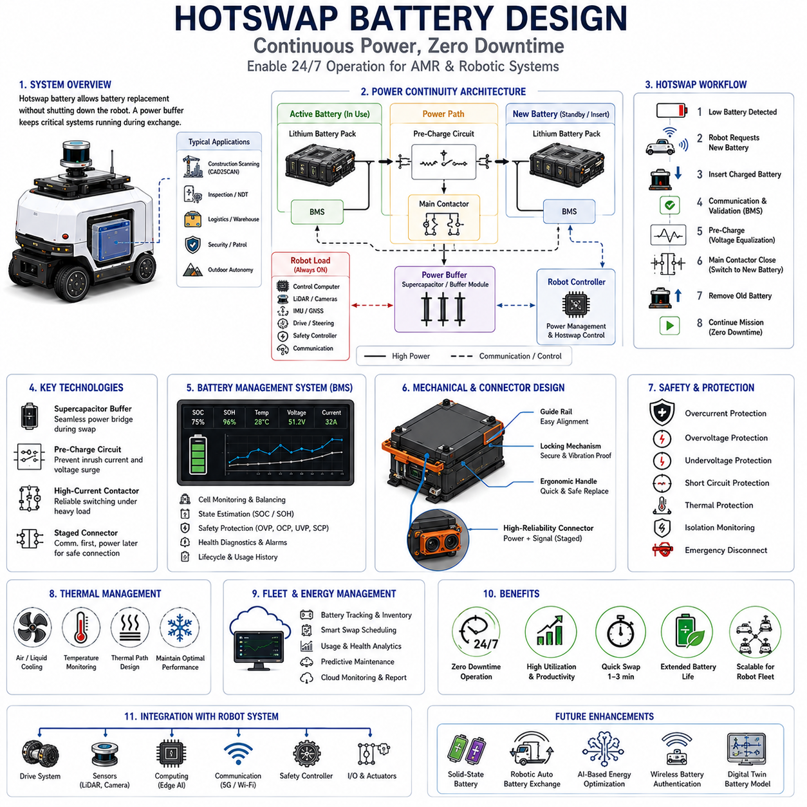
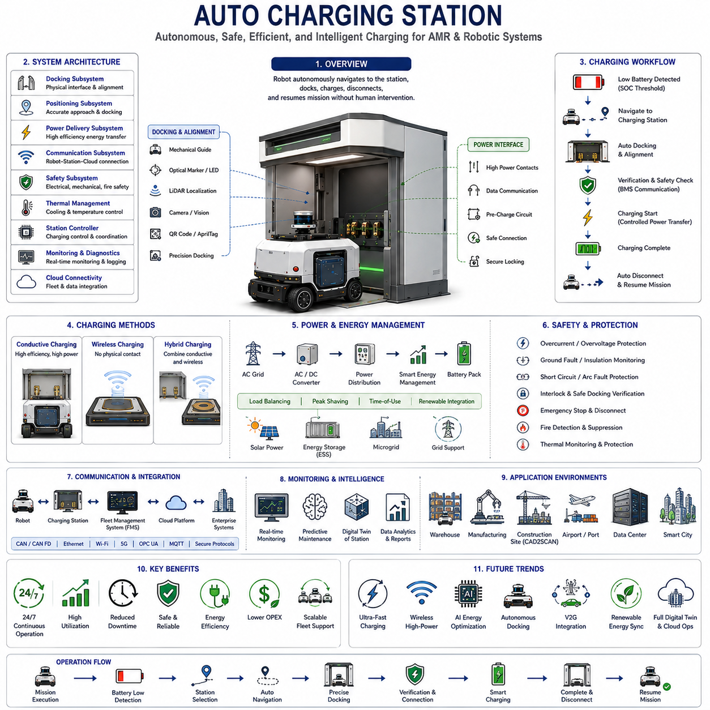
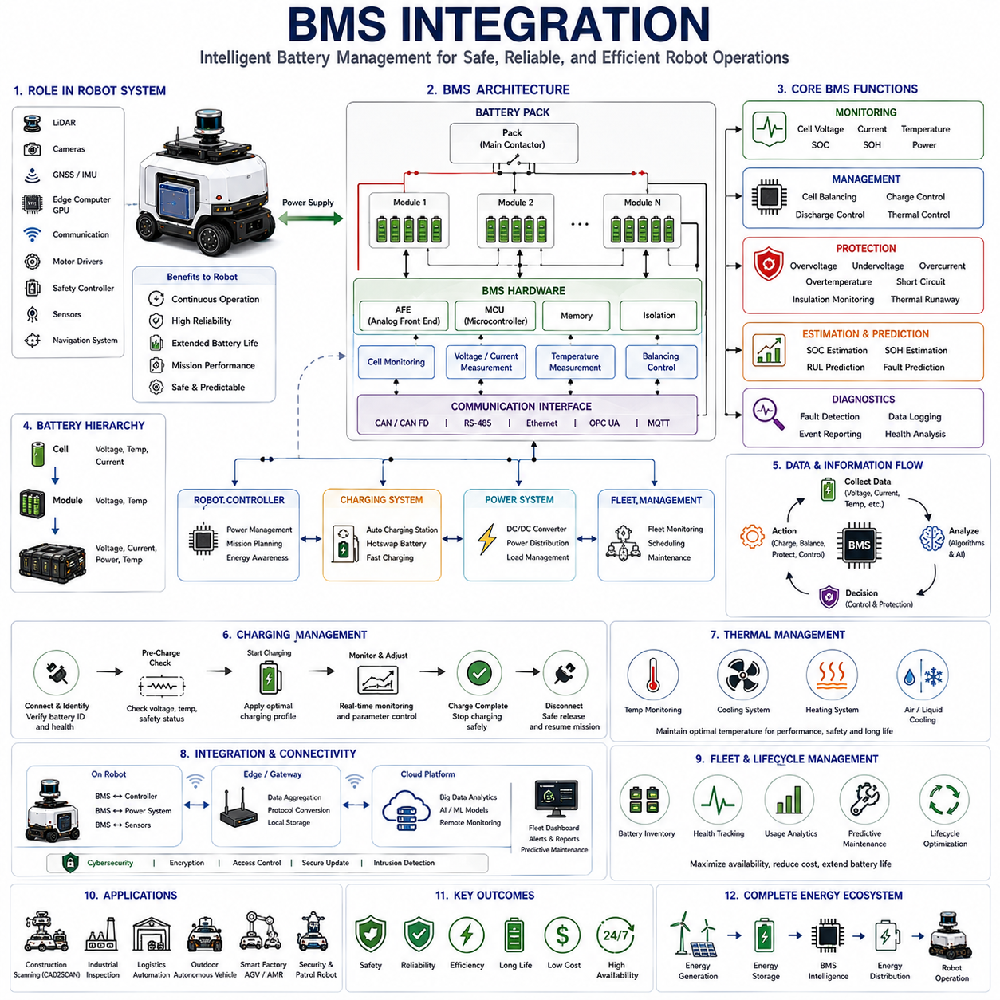
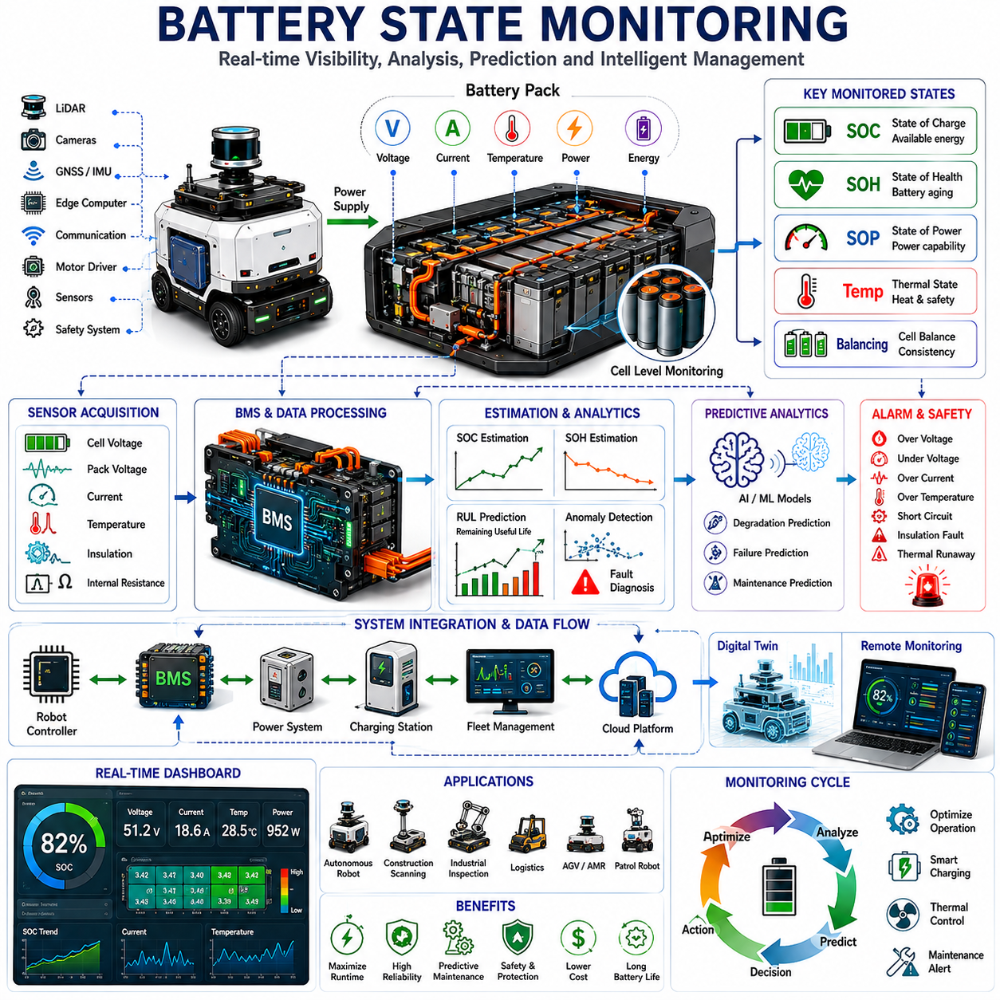
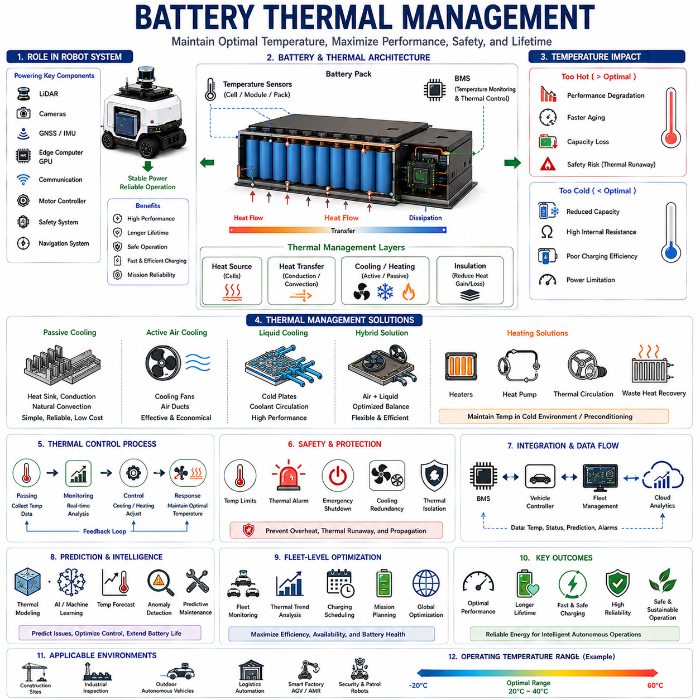

**Volume 13 AMR Electrical Architecture**

# Chapter 8. Battery Architecture

## 8.1 Hotswap Battery Design

{width="7.268055555555556in" height="7.268055555555556in"}

Hotswap Battery Design is a critical enabling technology for modern Autonomous Mobile Robots (AMRs), construction scanning platforms, industrial inspection systems, logistics robots, outdoor autonomous vehicles, and CAD2SCAN mobile scanning solutions. Unlike conventional battery architectures that require system shutdown during battery replacement, a hotswap battery system allows energy modules to be removed and replaced while the robot continues operating without interruption. This capability significantly increases operational availability, improves fleet utilization, reduces charging downtime, and enables continuous mission execution in environments where productivity and uptime are essential.

In large-scale construction projects, infrastructure inspection operations, digital twin generation programs, warehouse automation systems, airport logistics environments, semiconductor factories, industrial facilities, and outdoor autonomous operations, robot downtime directly impacts productivity. Traditional battery charging approaches require robots to suspend operations for extended periods while batteries recharge. Although automatic charging stations can reduce human intervention, charging still consumes valuable operational time. Hotswap battery technology addresses this limitation by transforming battery replacement into a rapid maintenance activity measured in seconds or minutes rather than hours.

The fundamental objective of Hotswap Battery Design is to provide uninterrupted power continuity while allowing energy storage modules to be exchanged safely, efficiently, and repeatedly. Achieving this objective requires careful integration of electrical architecture, battery management systems, power electronics, mechanical interfaces, safety systems, thermal management, communication networks, operational workflows, and energy management algorithms.

Within a modern robotic platform, the hotswap battery subsystem operates as part of a larger electrical ecosystem consisting of propulsion systems, motor controllers, LiDAR sensors, cameras, GNSS receivers, inertial measurement units, edge computing platforms, communication devices, safety controllers, industrial networking infrastructure, and charging systems. The hotswap architecture must support all of these subsystems without introducing voltage instability, communication interruptions, or operational disturbances during battery exchange events.

The primary challenge associated with hotswap operation is maintaining continuous electrical power during the transition between battery modules. If power delivery is interrupted even briefly, critical systems may reboot, sensor synchronization may be lost, localization systems may reset, and active missions may be disrupted. Therefore, hotswap systems require carefully engineered transition mechanisms that ensure seamless energy transfer between outgoing and incoming battery modules.

Most hotswap architectures incorporate an intermediate energy buffer. This buffer may consist of supercapacitors, auxiliary batteries, high-capacity capacitors, or dedicated reserve power modules. During battery replacement, the buffer temporarily supplies energy to critical systems. Once a new battery is connected, power delivery transitions smoothly back to the primary energy source. This approach eliminates voltage interruptions and maintains system continuity throughout the exchange process.

Supercapacitor technology has become increasingly attractive for hotswap applications. Unlike conventional batteries, supercapacitors can deliver extremely high power over short durations while supporting millions of charge-discharge cycles. Their rapid response characteristics make them ideal for bridging brief transition periods during battery replacement. In many systems, supercapacitors maintain operation for several seconds or minutes, providing sufficient time for battery exchange activities.

Battery Management Systems play a central role within hotswap architectures. Every battery module contains embedded electronics responsible for monitoring cell voltages, current flow, temperature, state of charge, state of health, balancing conditions, and safety parameters. During insertion and removal events, the Battery Management System coordinates communication with the robot controller to ensure safe transition procedures.

The Battery Management System continuously evaluates battery health and operational readiness. Before a battery module is accepted into the power system, verification procedures confirm electrical compatibility, charge status, thermal conditions, firmware integrity, and communication availability. These validation mechanisms reduce operational risk and prevent faulty battery modules from disrupting system performance.

Electrical power transfer during hotswap operations requires sophisticated power electronics. Direct connection of large battery modules can generate significant inrush currents capable of damaging connectors, power converters, and battery cells. Consequently, hotswap systems often employ pre-charge circuits that gradually equalize voltage differences before full electrical connection occurs.

Pre-charge circuits typically utilize controlled resistive pathways, intelligent switching devices, or active current limiting mechanisms. These systems ensure that voltage transients remain within acceptable limits while protecting sensitive electronic equipment. Once voltage levels are stabilized, high-current contactors establish the primary power connection.

Contactors and power switches represent critical components within the hotswap architecture. These devices must support repeated switching operations under substantial electrical loads while maintaining low contact resistance and high reliability. Industrial-grade contactors are frequently selected due to their durability, fault tolerance, and operational longevity.

Mechanical design considerations are equally important. Battery modules must be exchanged rapidly while maintaining secure electrical connections and structural integrity. Hotswap battery packs often utilize guided insertion mechanisms, alignment features, locking systems, and ergonomic handling interfaces. These features reduce replacement time while minimizing the risk of incorrect installation.

Construction scanning robots, logistics AMRs, and industrial inspection platforms frequently operate in demanding environments where dust, vibration, moisture, temperature variation, and mechanical shock are present. Battery enclosures must therefore provide appropriate environmental protection. High ingress protection ratings, reinforced housings, vibration-resistant connectors, and secure retention mechanisms contribute to long-term operational reliability.

Connector design significantly influences hotswap performance. Power connectors must support high current levels while maintaining low electrical resistance. They must also tolerate thousands of insertion and removal cycles without degradation. Advanced connector systems often incorporate staged engagement mechanisms where communication contacts establish connectivity before high-current power contacts engage.

This staged connection approach improves system intelligence and safety. Communication interfaces allow the Battery Management System to exchange information with the robot controller before power transfer begins. The system can verify battery compatibility, confirm operational readiness, and coordinate transition procedures automatically.

Communication architecture forms an important element of modern hotswap systems. Battery modules frequently communicate through CAN Bus, CAN FD, RS-485, Ethernet, or proprietary industrial communication protocols. Data exchanged between battery modules and robot controllers may include charge levels, health indicators, thermal conditions, identification information, operational history, maintenance requirements, and diagnostic status.

State of Charge estimation becomes particularly important in hotswap environments. Accurate knowledge of remaining energy capacity enables intelligent battery replacement scheduling. Advanced algorithms combine voltage measurements, current integration, temperature compensation, and predictive modeling to estimate available energy with high accuracy.

Fleet-level battery management introduces additional complexity. Large robotic fleets may contain dozens or hundreds of battery modules operating simultaneously. Centralized fleet management systems track battery locations, usage patterns, charging status, health metrics, maintenance history, and lifecycle characteristics. These systems optimize battery utilization while minimizing operational interruptions.

Thermal management represents another critical design domain. Battery performance, charging efficiency, safety characteristics, and operational lifetime are strongly influenced by temperature. Hotswap battery modules may incorporate passive cooling systems, forced-air cooling architectures, liquid cooling loops, thermal interface materials, and integrated temperature monitoring sensors.

Thermal considerations become particularly important during rapid charging operations. Many hotswap strategies rely upon external charging stations capable of preparing replacement batteries while robots remain operational. High-rate charging generates substantial heat that must be controlled to preserve battery health and ensure safety.

Safety engineering forms a foundational aspect of hotswap battery design. Battery systems contain significant amounts of stored energy and must operate safely under both normal and fault conditions. Safety mechanisms include overcurrent protection, overvoltage protection, undervoltage protection, thermal shutdown systems, short-circuit protection, isolation monitoring, emergency disconnect mechanisms, and fault diagnostics.

Lithium Iron Phosphate chemistry has become increasingly popular for industrial hotswap applications due to its favorable safety characteristics. Compared to some alternative lithium chemistries, Lithium Iron Phosphate batteries offer improved thermal stability, reduced thermal runaway risk, long cycle life, and robust operational performance. These characteristics align well with the reliability requirements of industrial robotic systems.

Redundancy strategies further improve operational continuity. Some platforms incorporate dual-battery architectures in which two independent battery modules operate simultaneously. One battery can be removed while the other continues supplying power. This approach eliminates dependence on temporary energy buffers and provides enhanced fault tolerance.

Modular battery architecture supports scalability across multiple robot platforms. A standardized battery module can be utilized across various vehicle types including indoor AMRs, outdoor autonomous vehicles, construction scanning robots, industrial inspection platforms, and service robots. Standardization simplifies logistics, reduces inventory requirements, and improves maintenance efficiency.

The relationship between hotswap battery systems and mission planning is becoming increasingly sophisticated. Intelligent energy management software continuously evaluates mission requirements, battery status, operational priorities, environmental conditions, and charging infrastructure availability. Battery replacement schedules can be optimized automatically to maximize productivity and minimize disruption.

Artificial Intelligence is beginning to influence hotswap battery management. Machine learning algorithms analyze operational data to predict battery degradation, estimate remaining useful life, optimize charging schedules, identify emerging faults, and improve energy utilization efficiency. Predictive maintenance strategies reduce unexpected failures while extending battery lifespan.

Cloud-connected battery management systems provide additional operational visibility. Remote monitoring platforms collect battery performance data from distributed robotic fleets and generate analytics regarding energy consumption, charging behavior, maintenance requirements, and lifecycle trends. This information supports strategic planning and continuous operational improvement.

Digital Twin integration further extends hotswap battery capabilities. Virtual battery models continuously synchronize with physical battery systems, enabling simulation, predictive analysis, lifecycle optimization, and performance forecasting. Digital Twin technology allows operators to evaluate future scenarios and optimize energy infrastructure investments.

Construction scanning applications impose particularly demanding requirements on battery systems. CAD2SCAN robots often carry high-power LiDAR systems, industrial cameras, GNSS receivers, edge computing platforms, GPU accelerators, wireless communication systems, and environmental sensors. These subsystems collectively create substantial energy demands. Hotswap battery architectures enable continuous scanning operations without requiring lengthy charging interruptions that could impact project schedules.

As autonomous systems continue expanding into logistics, construction, infrastructure inspection, industrial automation, mining, agriculture, transportation, and smart city applications, the importance of hotswap battery technology will continue increasing. Operational uptime, fleet productivity, energy efficiency, and maintenance optimization all depend upon effective energy management strategies.

Future hotswap battery architectures will likely incorporate solid-state battery technologies, advanced supercapacitor integration, AI-driven energy optimization, robotic battery exchange mechanisms, wireless battery authentication, predictive lifecycle management, and fully autonomous energy logistics networks. These developments will further reduce downtime while increasing operational efficiency and sustainability.

Ultimately, Hotswap Battery Design serves as a foundational enabling technology for continuous robotic operation. By eliminating energy-related interruptions, hotswap systems transform battery replacement from a disruptive maintenance activity into a seamless operational process. Within CAD2SCAN AMR platforms and advanced autonomous robotic ecosystems, hotswap battery architectures provide the energy continuity necessary to support persistent sensing, uninterrupted localization, continuous BIM verification, real-time digital twin updates, and long-duration autonomous missions. The result is a more productive, reliable, scalable, and intelligent robotic platform capable of meeting the demanding requirements of modern industrial and construction environments.

## 8.2 Auto Charging Station

{width="7.268055555555556in" height="7.268055555555556in"}

The Auto Charging Station represents one of the most important infrastructure components within modern autonomous robot ecosystems. In CAD2SCAN Autonomous Mobile Robot (AMR) environments, the charging station is not simply a battery charging device but rather a fully integrated energy management platform that enables continuous operation, autonomous mission execution, fleet coordination, and long-term operational sustainability. As autonomous robots become increasingly deployed across construction sites, manufacturing facilities, logistics centers, transportation hubs, industrial plants, smart cities, and infrastructure inspection projects, the ability to maintain uninterrupted operation becomes a critical success factor. The Auto Charging Station provides the foundation for achieving this objective.

In traditional robotic systems, operators manually connect robots to charging equipment when battery levels become low. While this approach may be acceptable for small deployments, it becomes inefficient and costly when managing large fleets of autonomous vehicles. Human intervention introduces delays, increases labor requirements, and limits the scalability of robotic operations. Autonomous charging technology eliminates these limitations by enabling robots to independently navigate to charging stations, connect automatically, manage charging operations, disconnect safely, and resume missions without human assistance.

Within the CAD2SCAN architecture, the Auto Charging Station functions as an extension of the robot itself. Rather than being viewed as separate equipment, the charging station operates as an integral component of the overall autonomous ecosystem. Fleet Management Systems continuously monitor battery status, mission schedules, environmental conditions, operational priorities, and charging station availability. When battery levels reach predefined thresholds, intelligent scheduling algorithms coordinate charging activities to maximize operational efficiency while minimizing downtime.

The fundamental purpose of an Auto Charging Station is to provide safe, reliable, efficient, and autonomous energy replenishment. However, achieving this objective requires significantly more than simply transferring electrical energy from the grid to a battery. The charging station must incorporate positioning systems, communication networks, docking mechanisms, safety controls, thermal management systems, power conversion equipment, cybersecurity protections, predictive maintenance functions, and integration interfaces capable of supporting complex robotic workflows.

At the system architecture level, an Auto Charging Station typically consists of a docking subsystem, positioning subsystem, power delivery subsystem, communication subsystem, safety subsystem, thermal management subsystem, station controller, monitoring infrastructure, and cloud connectivity framework. Each subsystem contributes to overall charging reliability and operational effectiveness.

The docking subsystem serves as the physical interface between the robot and the charging station. Accurate docking is essential because electrical connections must be established safely and consistently. Construction scanning robots often carry expensive sensors, high-performance computing equipment, precision localization systems, and sensitive inspection instruments. Therefore, docking operations must be executed with high precision to prevent mechanical damage and ensure reliable power transfer.

Modern docking systems employ multiple alignment technologies. Mechanical guides provide physical positioning assistance. Optical markers support visual alignment. LiDAR-based localization enables centimeter-level positioning accuracy. Camera systems verify alignment quality. Reflective targets, fiducial markers, QR codes, AprilTags, and machine vision algorithms may all contribute to docking accuracy depending on operational requirements.

The positioning subsystem continuously assists the robot during approach and docking operations. Unlike traditional charging equipment where humans manually align connectors, autonomous robots must perform this task independently. The charging station therefore acts as an active participant in the docking process by providing localization references, communication feedback, and guidance information.

As the robot approaches the charging station, localization systems refine position estimates using multiple sensor inputs. GNSS positioning may provide initial navigation guidance in outdoor environments. LiDAR localization supports final positioning. Visual localization systems verify alignment conditions. Sensor fusion algorithms combine these observations to achieve precise docking accuracy.

Power delivery represents the central function of the Auto Charging Station. Electrical energy is transferred from facility power infrastructure to robot battery systems through carefully controlled charging circuits. Depending on application requirements, charging power may range from several hundred watts for small indoor robots to tens of kilowatts for large outdoor autonomous vehicles and construction scanning platforms.

Most industrial charging systems utilize conductive charging methods. Conductive charging employs direct electrical contact between charging terminals on the robot and corresponding connectors within the charging station. This approach provides high efficiency, robust performance, and predictable charging behavior. Conductive systems are particularly suitable for high-power applications where charging speed is critical.

Wireless charging technologies represent an alternative approach. Inductive charging systems transfer energy through electromagnetic fields without direct physical contact. While wireless charging simplifies mechanical alignment and reduces connector wear, energy transfer efficiency is generally lower than conductive methods. Consequently, wireless charging is often reserved for applications prioritizing convenience over charging speed.

Hybrid charging architectures combine multiple charging technologies within a single platform. Conductive charging may support rapid energy replenishment while wireless charging maintains battery levels during standby periods. Such flexibility allows operators to optimize charging strategies according to mission requirements and operational priorities.

The charging process itself involves multiple phases. Initial connection verification confirms electrical compatibility between the robot and the charging station. Communication systems exchange information regarding battery chemistry, state of charge, state of health, temperature conditions, charging limits, and safety status. Only after successful verification does power transfer begin.

Battery Management Systems play a critical role throughout charging operations. Modern batteries require sophisticated charging profiles tailored to specific cell chemistries. Charging parameters vary according to battery type, temperature, age, health condition, and operational history. The charging station continuously coordinates with the robot's Battery Management System to ensure optimal charging performance.

Lithium Iron Phosphate batteries are widely used in industrial AMR platforms because of their safety, longevity, and operational stability. Charging algorithms for Lithium Iron Phosphate systems differ from those used for other battery chemistries. The charging station must therefore support chemistry-specific charging strategies capable of maximizing battery lifespan while minimizing charging time.

Thermal management becomes increasingly important as charging power levels increase. High-current charging generates heat within batteries, connectors, power electronics, and charging infrastructure. Excessive temperatures can reduce charging efficiency, accelerate battery degradation, and create safety risks. Consequently, charging stations incorporate temperature monitoring systems, cooling systems, airflow management, and thermal protection mechanisms.

Advanced charging stations continuously monitor battery temperatures throughout the charging cycle. Charging current may be adjusted dynamically according to thermal conditions. Active cooling systems employing forced air, liquid cooling, or hybrid thermal management technologies maintain safe operating temperatures while maximizing charging performance.

Safety systems form one of the most important elements of Auto Charging Station design. Industrial charging systems handle substantial electrical power and operate without direct human supervision. Comprehensive safety architectures therefore protect personnel, robots, facilities, batteries, and electrical infrastructure from potential hazards.

Electrical safety mechanisms include overcurrent protection, overvoltage protection, ground fault detection, insulation monitoring, short-circuit protection, emergency disconnect systems, arc fault detection, and isolation verification. These protections operate continuously and automatically respond to abnormal conditions.

Mechanical safety systems prevent charging operations from occurring unless proper docking alignment has been achieved. Interlock mechanisms verify connector engagement before enabling power transfer. Emergency stop systems allow immediate shutdown in response to hazardous situations. Obstacle detection systems prevent collisions between robots and charging infrastructure.

Cybersecurity has emerged as an increasingly important consideration within autonomous charging ecosystems. Charging stations are often connected to fleet management systems, enterprise networks, cloud platforms, and operational databases. Unauthorized access could potentially disrupt charging schedules, compromise fleet operations, or create safety risks. Consequently, modern charging stations incorporate authentication systems, encrypted communications, access controls, intrusion detection capabilities, and cybersecurity monitoring frameworks.

Communication infrastructure enables coordination between robots, charging stations, fleet managers, cloud services, and operational databases. Communication protocols may include CAN Bus, CAN FD, Ethernet, Industrial Ethernet, OPC UA, MQTT, Wi-Fi, 5G, and proprietary industrial communication frameworks. Reliable communication is essential for scheduling, monitoring, diagnostics, and operational optimization.

Fleet management integration significantly increases charging system value. Rather than operating independently, charging stations participate within larger operational ecosystems. Fleet managers continuously evaluate battery levels, mission priorities, robot availability, station occupancy, and charging schedules. Intelligent scheduling algorithms allocate charging resources efficiently across multiple robots and stations.

Construction scanning operations frequently involve multiple autonomous robots operating across large geographic areas. Some robots may be performing LiDAR scanning, others may be conducting visual inspections, and others may be transporting equipment or collecting environmental data. Coordinated charging ensures that critical missions remain uninterrupted while maximizing overall fleet productivity.

Energy management functions extend beyond individual charging operations. Modern facilities often operate multiple charging stations simultaneously. Uncontrolled charging could create significant electrical loads capable of exceeding facility power capacity. Energy management systems therefore coordinate charging activities to balance electrical demand while maintaining operational effectiveness.

Load balancing algorithms distribute charging activity across available infrastructure. Charging schedules may be adjusted according to electricity pricing, grid availability, renewable energy production, operational priorities, and battery conditions. Smart charging strategies reduce operational costs while supporting sustainability objectives.

Renewable energy integration represents a growing trend within autonomous charging infrastructure. Solar panels, battery energy storage systems, microgrids, and renewable energy sources can supplement traditional electrical supplies. Charging stations increasingly function as intelligent energy nodes capable of optimizing energy consumption according to available resources.

Predictive maintenance capabilities improve charging station reliability and reduce operational disruptions. Sensors continuously monitor connector wear, electrical performance, thermal conditions, communication quality, power conversion efficiency, mechanical alignment accuracy, and component health. Artificial intelligence algorithms analyze operational data to identify emerging issues before failures occur.

Digital Twin technology further enhances operational visibility. Virtual representations of charging stations continuously synchronize with physical infrastructure. Operators can monitor performance, simulate future scenarios, evaluate maintenance strategies, and optimize infrastructure deployment using Digital Twin platforms.

Construction scanning applications impose unique requirements upon charging systems. CAD2SCAN robots often consume significantly more energy than conventional logistics robots because they operate high-power LiDAR sensors, industrial cameras, GNSS RTK systems, edge computing platforms, GPUs, communication networks, and advanced localization systems. Charging stations must therefore support higher power levels while maintaining exceptional reliability.

Future Auto Charging Stations will become increasingly intelligent, autonomous, and interconnected. AI-driven energy optimization, robotic docking assistance, wireless high-power charging, autonomous maintenance diagnostics, vehicle-to-grid integration, renewable energy coordination, and cloud-based fleet orchestration will further improve operational efficiency.

The integration of autonomous charging with hotswap battery systems may also create hybrid energy architectures. Robots could utilize automatic charging during routine operations while supporting battery exchange during high-intensity mission periods. Such flexibility would maximize operational availability across diverse deployment scenarios.

Ultimately, the Auto Charging Station serves as a foundational infrastructure element within the CAD2SCAN ecosystem. It transforms energy replenishment from a manual maintenance activity into a fully autonomous operational process. By combining precise docking, intelligent charging control, advanced safety systems, fleet coordination, predictive maintenance, and energy optimization technologies, the Auto Charging Station enables continuous robotic operation, maximizes fleet productivity, reduces operational costs, and supports the long-duration autonomous missions required by modern construction scanning, industrial inspection, and digital infrastructure management applications.

## 8.3 BMS Integration

{width="7.268055555555556in" height="7.268055555555556in"}

Battery Management System (BMS) Integration represents one of the most critical architectural components within modern Autonomous Mobile Robots (AMRs), construction scanning robots, industrial inspection platforms, outdoor autonomous vehicles, logistics automation systems, and CAD2SCAN mobile scanning solutions. While batteries provide the energy required to operate robotic systems, the Battery Management System serves as the intelligence layer responsible for monitoring, controlling, protecting, optimizing, and coordinating battery behavior throughout the entire operational lifecycle. In advanced robotic platforms, the BMS is no longer an isolated battery protection device but rather an integrated cyber-physical subsystem that interacts continuously with vehicle controllers, power distribution systems, charging infrastructure, fleet management platforms, cloud services, digital twins, and artificial intelligence applications.

The primary purpose of BMS Integration is to ensure safe, reliable, efficient, and predictable energy utilization while maximizing battery lifespan and operational availability. As robotic platforms become increasingly dependent upon high-performance computing, artificial intelligence processing, LiDAR sensing, precision localization, high-speed communication networks, and autonomous decision-making systems, the importance of battery intelligence continues to increase. Modern robots may consume hundreds or even thousands of watts continuously during operation, making energy management a fundamental engineering discipline rather than a secondary support function.

Within the CAD2SCAN ecosystem, the battery subsystem powers LiDAR sensors, industrial cameras, GNSS RTK receivers, Inertial Measurement Units, edge computing systems, GPU accelerators, wireless communication networks, safety controllers, motor drivers, environmental monitoring devices, and autonomous navigation systems. Any interruption, instability, or degradation within the energy system can directly influence operational reliability, localization accuracy, scan quality, data collection continuity, BIM verification performance, and digital twin synchronization. Consequently, BMS Integration must extend beyond battery monitoring to encompass comprehensive energy ecosystem management.

At the system architecture level, BMS Integration includes battery cell monitoring, module management, pack-level supervision, charging coordination, thermal management, safety protection, energy forecasting, communication networking, diagnostics, predictive maintenance, cloud integration, digital twin synchronization, fleet-level battery optimization, and AI-assisted decision support. These capabilities collectively transform battery systems into intelligent energy platforms capable of supporting autonomous robotic operations.

The foundation of any Battery Management System begins at the cell level. Modern robotic platforms typically utilize lithium-based battery technologies due to their high energy density, favorable power characteristics, and operational flexibility. Lithium Iron Phosphate batteries have become particularly popular within industrial robotics because of their excellent thermal stability, long cycle life, safety performance, and predictable behavior under demanding operating conditions.

Individual battery cells exhibit small manufacturing variations that influence voltage characteristics, internal resistance, thermal behavior, aging rates, and charging performance. Over time, these differences can accumulate and create imbalances within battery packs. If left unmanaged, cell imbalance can reduce usable capacity, accelerate degradation, compromise safety, and shorten battery lifespan. Consequently, continuous cell monitoring forms one of the most important functions of the BMS.

The Battery Management System continuously measures cell voltages, current flow, temperature conditions, charge levels, discharge rates, and operational health indicators. High-resolution measurement circuits capture data from every cell within the battery pack. This information provides visibility into battery behavior while supporting advanced control strategies capable of maintaining optimal performance throughout the battery lifecycle.

Cell balancing represents another essential BMS function. During charging and discharging operations, individual cells may drift apart in terms of voltage and state of charge. Balancing systems redistribute energy or selectively control charging behavior to maintain consistency among cells. Balanced batteries provide improved efficiency, greater usable capacity, enhanced safety, and longer operational life.

Battery pack management extends beyond individual cell supervision. Modern robotic battery packs often contain dozens or even hundreds of interconnected cells organized into modules and subsystems. The BMS aggregates information from these components and generates a comprehensive understanding of overall battery condition. Pack-level management includes voltage supervision, current monitoring, insulation verification, thermal assessment, fault detection, and operational control.

State of Charge estimation serves as one of the most visible outputs of the Battery Management System. Operators, fleet managers, mission planners, and autonomous controllers all rely upon accurate energy availability estimates. However, determining remaining battery capacity is significantly more complex than simply measuring voltage. Battery behavior varies according to temperature, age, load conditions, chemistry, discharge history, and operational environment.

Modern BMS platforms utilize advanced estimation algorithms combining Coulomb counting, voltage analysis, temperature compensation, impedance measurement, and model-based estimation techniques. These algorithms continuously refine charge estimates and provide increasingly accurate predictions regarding remaining operational endurance.

State of Health estimation represents another critical capability. While State of Charge describes current energy availability, State of Health evaluates long-term battery condition. Factors such as capacity fade, resistance growth, thermal stress, charge cycle history, and environmental exposure influence battery aging. The BMS continuously evaluates these factors to estimate remaining useful life and predict maintenance requirements.

For autonomous robotic systems, accurate State of Health information enables proactive maintenance planning and reduces the risk of unexpected battery failures. Fleet operators can schedule battery replacements based upon actual condition rather than fixed service intervals, thereby reducing operational costs while improving reliability.

Thermal management integration forms another major responsibility of the Battery Management System. Battery performance is strongly influenced by temperature. Excessive temperatures accelerate aging, reduce efficiency, increase degradation rates, and may create safety hazards. Extremely low temperatures reduce available capacity and charging efficiency. Consequently, the BMS continuously monitors thermal conditions throughout the battery pack.

Temperature sensors distributed across battery modules provide real-time thermal visibility. The BMS coordinates with cooling systems, heating systems, ventilation mechanisms, and charging controllers to maintain optimal operating conditions. Active thermal management becomes particularly important in high-power robotic platforms where significant energy flows occur during operation and charging.

Charging management represents one of the most sophisticated functions within modern BMS architectures. Different battery chemistries require different charging strategies. Charging behavior must adapt dynamically according to temperature, State of Charge, State of Health, operational requirements, and environmental conditions. The BMS communicates continuously with charging infrastructure to ensure safe and efficient energy transfer.

Within CAD2SCAN environments, charging systems may include automatic charging stations, hotswap battery platforms, fast-charging infrastructure, wireless charging systems, and fleet-level charging management frameworks. The BMS acts as the central coordination authority responsible for managing interactions among these systems.

During charging operations, the BMS verifies battery identity, evaluates thermal conditions, monitors voltage limits, supervises current flow, detects abnormal behavior, and controls charging progression. Charging parameters may be adjusted dynamically to optimize battery longevity while maintaining operational efficiency. Advanced charging algorithms balance competing objectives including charging speed, energy efficiency, thermal stability, and battery lifespan.

Safety protection remains one of the most fundamental responsibilities of BMS Integration. Lithium battery systems contain significant amounts of stored energy and must be protected against abnormal conditions. Safety mechanisms include overvoltage protection, undervoltage protection, overcurrent protection, overtemperature protection, short-circuit protection, insulation monitoring, thermal runaway detection, emergency disconnect functions, and fault isolation mechanisms.

The BMS continuously evaluates safety conditions and responds automatically when abnormalities are detected. Protective actions may include reducing power output, limiting charging rates, activating cooling systems, disconnecting battery modules, issuing warnings, or initiating emergency shutdown procedures. These protections safeguard both the robotic platform and surrounding infrastructure.

Communication architecture plays an increasingly important role in modern BMS Integration. The Battery Management System rarely operates independently. Instead, it functions as part of a broader cyber-physical ecosystem involving robot controllers, power management systems, charging stations, fleet management software, cloud services, and digital twin platforms.

Industrial communication protocols such as CAN Bus, CAN FD, RS-485, Ethernet, OPC UA, MQTT, and proprietary communication frameworks support information exchange across these systems. The BMS continuously publishes operational status information including State of Charge, State of Health, voltage levels, current flow, thermal conditions, fault status, charging progress, and diagnostic indicators.

Vehicle Energy Management Systems utilize this information to optimize power consumption. Mission planning software adjusts task assignments according to available energy resources. Charging infrastructure coordinates charging schedules based upon battery condition. Fleet management systems optimize energy utilization across multiple vehicles. The result is an integrated energy ecosystem capable of supporting intelligent autonomous operations.

Fleet-level BMS Integration introduces additional complexity. Large robotic deployments may involve dozens, hundreds, or even thousands of battery systems operating simultaneously. Centralized management platforms aggregate battery information from across the fleet and generate insights regarding energy utilization, battery health trends, charging requirements, maintenance planning, and operational efficiency.

Predictive maintenance capabilities emerge naturally from large-scale battery monitoring. Machine learning algorithms analyze historical battery data to identify degradation patterns, predict future failures, estimate remaining useful life, and recommend maintenance actions. These capabilities reduce downtime while improving operational reliability.

Artificial Intelligence increasingly enhances BMS functionality. Traditional battery management algorithms rely upon predefined mathematical models and engineering assumptions. AI-driven approaches supplement these methods by learning from real-world operational data. Machine learning systems can improve charge estimation accuracy, predict thermal behavior, identify abnormal patterns, optimize charging schedules, and forecast battery degradation more effectively than traditional methods alone.

Digital Twin integration further expands the value of BMS data. Virtual battery models continuously synchronize with physical battery systems and provide comprehensive visibility into battery behavior. Engineers can evaluate future operating scenarios, simulate charging strategies, predict maintenance requirements, and optimize fleet operations using digital representations of energy infrastructure.

Cloud connectivity enables advanced analytics, remote diagnostics, centralized monitoring, and enterprise-level energy management. Battery information collected across distributed robotic fleets can be aggregated within cloud platforms and analyzed using large-scale computational resources. This capability supports strategic planning, operational optimization, and continuous improvement initiatives.

Cybersecurity considerations have become increasingly important as battery systems become more connected. Unauthorized access to BMS functions could potentially disrupt charging operations, compromise safety systems, manipulate energy availability, or impact mission execution. Secure communication channels, authentication mechanisms, access controls, encrypted data storage, and cybersecurity monitoring therefore form essential components of modern BMS architectures.

The future of BMS Integration will likely involve even deeper levels of intelligence and autonomy. Solid-state battery technologies, distributed energy architectures, AI-driven battery optimization, autonomous charging coordination, predictive lifecycle management, cloud-native battery analytics, and fully integrated digital energy ecosystems will continue transforming battery systems into strategic operational assets.

Within the CAD2SCAN framework, BMS Integration serves as far more than a battery monitoring solution. It functions as the central intelligence layer governing energy generation, storage, distribution, protection, optimization, and lifecycle management. By integrating battery systems with robotics, artificial intelligence, fleet management, charging infrastructure, cloud services, and digital twin technologies, the BMS enables reliable long-duration autonomous operation while maximizing safety, efficiency, and operational sustainability. As construction scanning, autonomous inspection, and industrial robotics continue to evolve, BMS Integration will remain one of the foundational technologies supporting intelligent, resilient, and energy-aware robotic ecosystems.

## 8.4 Battery State Monitoring

{width="7.268055555555556in" height="7.268055555555556in"}

Battery State Monitoring is one of the most fundamental and strategically important functions within modern battery-powered robotic systems. In autonomous mobile robots, outdoor autonomous vehicles, industrial inspection robots, construction scanning platforms, logistics automation systems, and CAD2SCAN mobile scanning solutions, the ability to continuously observe, evaluate, predict, and manage battery conditions directly influences operational reliability, mission duration, safety, maintenance planning, and overall system performance. While batteries are often perceived simply as energy storage devices, modern robotic platforms increasingly view batteries as intelligent assets whose condition must be continuously monitored and interpreted throughout their operational lifecycle.

The primary objective of Battery State Monitoring is to provide accurate, real-time visibility into the energy condition, health status, performance capability, safety margin, and future behavior of the battery system. Unlike conventional battery monitoring approaches that focus only on voltage measurement, modern battery state monitoring systems analyze a wide range of parameters including cell voltages, pack voltages, charging status, discharge behavior, current consumption, thermal conditions, internal resistance, energy throughput, aging characteristics, fault conditions, and predictive health indicators. These measurements collectively create a comprehensive understanding of battery behavior and enable intelligent operational decision-making.

Within the CAD2SCAN ecosystem, batteries supply energy to LiDAR systems, industrial cameras, GNSS RTK receivers, inertial navigation sensors, edge computing platforms, GPU accelerators, wireless communication networks, motor controllers, safety systems, environmental monitoring devices, and autonomous navigation functions. Any degradation in battery performance can influence localization accuracy, scan quality, BIM verification operations, digital twin synchronization, autonomous mission execution, and fleet productivity. Battery State Monitoring therefore serves not merely as a maintenance function but as a core operational capability.

At the system architecture level, Battery State Monitoring consists of sensor acquisition systems, Battery Management Systems (BMS), data collection infrastructure, estimation algorithms, diagnostic engines, predictive analytics modules, communication frameworks, visualization platforms, fleet management integration, cloud connectivity, and digital twin synchronization services. These components work together to transform raw electrical measurements into actionable intelligence.

The monitoring process begins at the cell level. Modern industrial battery packs typically contain numerous interconnected lithium-based cells organized into modules and pack structures. Each individual cell contributes to the overall performance of the battery system. Small differences between cells can accumulate over time and influence capacity, efficiency, thermal behavior, and operational safety. Consequently, high-resolution monitoring at the cell level forms the foundation of battery state awareness.

Voltage measurement represents one of the most basic yet important monitoring functions. Cell voltage provides insight into charge status, balance conditions, and overall operational health. Continuous voltage monitoring allows the Battery Management System to detect abnormal conditions such as overvoltage events, undervoltage conditions, cell imbalance, degradation trends, and charging anomalies. Accurate voltage measurement becomes particularly important during charging operations where improper voltage control may compromise safety or accelerate battery aging.

Current monitoring provides another essential dimension of battery awareness. Current measurements reveal energy flow into and out of the battery system. Charging current, discharge current, peak power demand, regenerative energy recovery, standby consumption, and transient load conditions all contribute valuable information regarding battery utilization. Accurate current monitoring enables precise energy accounting and supports advanced estimation algorithms responsible for determining remaining battery capacity.

Temperature monitoring plays a central role in battery state assessment. Battery performance is highly sensitive to thermal conditions. Elevated temperatures accelerate chemical degradation and reduce battery lifespan. Excessively low temperatures limit available energy and reduce charging efficiency. Thermal imbalances between battery modules may indicate emerging faults or cooling system deficiencies. Consequently, temperature sensors are typically distributed throughout battery packs to provide comprehensive thermal visibility.

Battery state monitoring extends beyond direct measurement and includes estimation processes that derive meaningful operational indicators. State of Charge estimation represents one of the most widely recognized outputs of battery monitoring systems. State of Charge describes the amount of usable energy currently available within the battery. However, accurately determining State of Charge is significantly more complex than measuring voltage alone.

Battery voltage varies according to load conditions, temperature, battery age, charging history, and chemistry characteristics. Modern State of Charge estimation therefore combines multiple techniques including Coulomb counting, open-circuit voltage analysis, Kalman filtering, model-based estimation, and machine learning approaches. These methods continuously refine energy estimates and provide reliable information for autonomous mission planning.

State of Health estimation serves a different but equally important purpose. Whereas State of Charge reflects current energy availability, State of Health evaluates long-term battery condition. Over time, batteries experience capacity reduction, internal resistance growth, thermal stress accumulation, and chemical aging. State of Health monitoring quantifies these effects and provides insight into remaining battery lifespan.

Accurate State of Health assessment enables predictive maintenance strategies. Instead of replacing batteries according to fixed schedules, maintenance decisions can be based upon actual battery condition. This approach reduces operational costs, minimizes unexpected failures, and maximizes utilization of battery assets. For large robotic fleets, predictive battery maintenance can produce substantial economic benefits.

State of Power estimation further enhances battery awareness. While State of Charge indicates available energy and State of Health indicates long-term condition, State of Power estimates the battery's ability to deliver or absorb power under current operating conditions. This capability becomes particularly important in robotic systems requiring high transient power levels for acceleration, climbing, payload transport, or intensive computational processing.

Energy throughput monitoring provides additional operational insight. Every charging and discharging cycle contributes to battery aging. By tracking cumulative energy throughput, charge cycles, depth of discharge patterns, and operational history, monitoring systems can evaluate battery usage characteristics and estimate long-term degradation trends. This information supports lifecycle management and infrastructure planning.

Cell balancing monitoring represents another important function. Lithium battery packs perform optimally when individual cells remain closely matched in terms of voltage and charge status. Monitoring systems continuously evaluate cell balance conditions and identify deviations requiring corrective action. Significant imbalance may indicate aging differences, manufacturing variations, thermal inconsistencies, or emerging faults.

Fault detection capabilities form a critical component of Battery State Monitoring. Modern robotic systems often operate autonomously for extended periods without direct human supervision. Monitoring systems must therefore identify abnormal conditions early and initiate appropriate responses before safety or operational reliability become compromised.

Common fault conditions include overvoltage events, undervoltage conditions, excessive current draw, thermal anomalies, communication failures, insulation degradation, sensor malfunctions, unexpected self-discharge, charging abnormalities, and cell failures. Detection algorithms continuously analyze operational data and compare observed behavior against expected performance models.

Anomaly detection has become increasingly sophisticated through the application of artificial intelligence and machine learning technologies. Traditional monitoring systems rely primarily upon fixed thresholds and rule-based logic. AI-enhanced monitoring systems can identify subtle patterns and correlations that may indicate emerging issues before conventional alarms are triggered. These capabilities improve fault detection sensitivity while reducing false alarm rates.

Thermal state monitoring deserves particular attention because thermal behavior influences nearly every aspect of battery performance. Advanced thermal monitoring systems track temperature gradients, heat generation rates, cooling effectiveness, thermal response characteristics, and environmental influences. Predictive thermal models estimate future temperature behavior and support proactive thermal management strategies.

Charging state monitoring forms another major aspect of battery supervision. Modern charging systems interact closely with Battery Management Systems to ensure safe and efficient energy replenishment. Monitoring functions evaluate charging progress, charging efficiency, voltage stability, current regulation, thermal conditions, and charger compatibility. Dynamic charging control algorithms adjust charging parameters according to battery condition and environmental circumstances.

In CAD2SCAN platforms, charging infrastructure may include automatic charging stations, hotswap battery systems, fast charging equipment, wireless charging solutions, and fleet-level charging coordination frameworks. Battery State Monitoring serves as the information backbone connecting these systems and enabling intelligent charging decisions.

Communication infrastructure enables battery monitoring information to be distributed throughout the robotic ecosystem. Industrial communication protocols such as CAN Bus, CAN FD, RS-485, Ethernet, OPC UA, and MQTT support data exchange between battery systems, vehicle controllers, fleet managers, cloud platforms, and maintenance applications. Reliable communication ensures that energy-related decisions are based upon accurate and timely information.

Fleet-level battery monitoring expands visibility beyond individual robots. Large robotic deployments may contain hundreds of battery systems operating simultaneously across diverse environments. Fleet monitoring platforms aggregate battery data, identify trends, compare performance across assets, evaluate energy utilization patterns, and optimize charging schedules. Centralized visibility improves operational planning and resource allocation.

Cloud integration further enhances monitoring capabilities. Cloud platforms provide scalable storage, advanced analytics, historical trend analysis, predictive modeling, and enterprise-level reporting. Battery data collected over months or years can be analyzed to identify degradation mechanisms, optimize operational strategies, and support infrastructure investment decisions.

Digital Twin integration represents an emerging frontier in Battery State Monitoring. Digital battery twins maintain virtual representations of physical battery systems and continuously synchronize with real-world operating conditions. These virtual models enable simulation, predictive analysis, lifecycle forecasting, maintenance optimization, and scenario evaluation. Engineers can explore future operational outcomes without affecting physical assets.

Cybersecurity considerations are increasingly important as battery monitoring systems become more connected. Unauthorized access to battery information or control functions could potentially disrupt operations, compromise safety, or impact mission execution. Secure communications, authentication mechanisms, access controls, encrypted data storage, and continuous cybersecurity monitoring therefore form essential components of modern battery monitoring architectures.

Artificial Intelligence continues to expand the capabilities of Battery State Monitoring systems. Machine learning models improve State of Charge estimation accuracy, predict battery degradation, identify abnormal behavior, forecast maintenance requirements, optimize charging schedules, and support autonomous decision-making. AI systems learn continuously from operational data and become increasingly effective over time.

Future Battery State Monitoring architectures will likely incorporate advanced sensing technologies, solid-state battery diagnostics, distributed monitoring networks, AI-native analytics platforms, autonomous maintenance orchestration, cloud-scale predictive modeling, and real-time digital twin synchronization. These advancements will transform battery monitoring from a passive observation function into an active intelligence system capable of optimizing energy resources across entire robotic ecosystems.

Within the CAD2SCAN architecture, Battery State Monitoring serves as the foundation for intelligent energy management. It enables accurate mission planning, reliable autonomous operation, predictive maintenance, optimized charging, enhanced safety, fleet coordination, and long-term lifecycle management. By continuously transforming electrical measurements into actionable operational intelligence, Battery State Monitoring ensures that batteries function not merely as energy storage devices but as intelligent, observable, and manageable assets supporting the entire autonomous scanning ecosystem. As robotics, artificial intelligence, and autonomous infrastructure continue to evolve, Battery State Monitoring will remain a cornerstone technology enabling reliable, efficient, and sustainable robotic operations.

## 8.5 Battery Thermal Management

{width="7.268055555555556in" height="7.268055555555556in"}

Battery Thermal Management is one of the most important engineering disciplines within modern Autonomous Mobile Robots (AMRs), outdoor autonomous vehicles, construction scanning robots, industrial inspection platforms, logistics automation systems, and CAD2SCAN mobile scanning ecosystems. Although batteries are primarily designed to store and deliver electrical energy, their actual performance, reliability, safety, charging efficiency, operational lifetime, and long-term sustainability are fundamentally governed by temperature. As robotic platforms become increasingly dependent on high-performance computing, artificial intelligence workloads, high-power sensing systems, autonomous navigation functions, and long-duration autonomous missions, thermal management has evolved from a supporting subsystem into a mission-critical architecture component.

The primary objective of Battery Thermal Management is to maintain battery cells, modules, and complete battery packs within an optimal operating temperature range regardless of environmental conditions, power demand, charging behavior, mission profile, or system aging. Achieving this objective requires the integration of thermal sensing, heat transfer engineering, cooling systems, heating systems, insulation technologies, control algorithms, battery management systems, predictive analytics, fleet management platforms, and digital twin infrastructures.

Within the CAD2SCAN ecosystem, batteries supply energy to LiDAR sensors, industrial cameras, GNSS RTK receivers, inertial measurement systems, edge computing platforms, GPU accelerators, communication networks, motor controllers, safety systems, and autonomous navigation software. These components collectively generate substantial electrical loads that result in heat production throughout the energy system. Without effective thermal control, battery performance degrades, charging becomes less efficient, localization reliability decreases, sensor operation becomes unstable, and overall mission success may be compromised.

At a system architecture level, Battery Thermal Management consists of thermal sensing infrastructure, thermal modeling systems, cooling subsystems, heating subsystems, insulation layers, Battery Management System integration, thermal control algorithms, fault detection mechanisms, predictive maintenance functions, cloud monitoring services, and fleet-level thermal optimization frameworks. These components operate together to maintain thermal stability under a wide variety of operating conditions.

Battery temperature directly influences electrochemical performance. Every battery chemistry exhibits an optimal temperature range where energy efficiency, power delivery capability, charging performance, and operational safety are maximized. When batteries operate outside this range, internal chemical reactions become less efficient, resulting in performance degradation and accelerated aging.

High temperatures are particularly harmful. Excessive heat accelerates chemical degradation processes inside battery cells. Electrolyte decomposition, electrode deterioration, separator aging, and resistance growth occur more rapidly under elevated temperatures. While a battery may continue functioning under such conditions, its long-term lifespan can be significantly reduced. In severe cases, excessive heat may create safety hazards including thermal runaway events.

Low temperatures create a different set of challenges. Chemical reactions slow considerably as temperature decreases. Available capacity is reduced, voltage stability deteriorates, charging efficiency decreases, and internal resistance increases. A battery operating at very low temperatures may appear partially depleted even when substantial energy remains stored internally. Furthermore, charging batteries at low temperatures can damage cell structures and accelerate degradation.

Battery Thermal Management therefore seeks to maintain temperatures within a carefully controlled operational envelope. For many industrial lithium battery systems, the preferred operating range lies between approximately 20°C and 40°C, although exact values vary according to battery chemistry, application requirements, and manufacturer specifications.

Heat generation within batteries occurs through multiple mechanisms. Internal resistance converts electrical energy into heat whenever current flows through battery cells. High-power acceleration, rapid charging, intensive computing workloads, steep terrain navigation, heavy payload transport, and prolonged operation all contribute to increased heat generation. In CAD2SCAN platforms, simultaneous operation of LiDAR systems, industrial cameras, GPU processing units, localization systems, and communication infrastructure further increases overall thermal loading.

Thermal sensing represents the foundation of any thermal management architecture. Temperature sensors are distributed throughout battery packs to provide continuous visibility into thermal conditions. Sensors may be installed at cell level, module level, pack level, connector interfaces, power electronics assemblies, and cooling system components. High-resolution thermal monitoring enables rapid detection of abnormal conditions before significant damage occurs.

Modern thermal monitoring systems often incorporate multiple sensor technologies. Thermistors provide cost-effective temperature measurement. Resistance Temperature Detectors offer higher accuracy. Semiconductor temperature sensors support digital integration. Infrared sensors provide non-contact measurements. Thermal imaging systems may be used in advanced diagnostic applications. Collectively, these sensing technologies create a comprehensive thermal awareness framework.

The Battery Management System serves as the central intelligence layer coordinating thermal management activities. Temperature measurements are continuously analyzed to determine thermal status, identify trends, evaluate safety margins, and initiate corrective actions. Thermal data is integrated with voltage measurements, current measurements, charging information, State of Charge estimates, and State of Health assessments to create a holistic understanding of battery behavior.

Passive thermal management represents the simplest thermal control strategy. Passive systems rely upon thermal conduction, natural convection, radiation, thermal mass, and insulation materials to regulate temperature. Heat generated within battery cells is transferred through conductive pathways into battery enclosures, structural components, or dedicated heat spreaders. Natural airflow removes thermal energy without requiring active cooling devices.

Passive systems offer several advantages including simplicity, low cost, high reliability, reduced maintenance requirements, and minimal energy consumption. However, passive approaches may become insufficient in high-power applications where heat generation exceeds passive dissipation capabilities. Consequently, many industrial robotic platforms employ active thermal management systems.

Active cooling systems utilize mechanical or fluid-based technologies to remove heat from battery assemblies. Forced-air cooling represents one of the most common approaches. Cooling fans circulate air through battery compartments, increasing convective heat transfer and reducing cell temperatures. Air-cooled systems are relatively inexpensive, lightweight, and easy to maintain, making them attractive for many industrial applications.

Liquid cooling provides significantly greater thermal performance than air cooling. Coolant circulates through dedicated channels, cooling plates, or thermal manifolds positioned adjacent to battery modules. Heat is transferred from battery cells into the coolant and subsequently dissipated through heat exchangers or radiators. Liquid cooling enables precise thermal control and supports high-power operation in demanding environments.

CAD2SCAN platforms operating in construction environments may experience substantial thermal loading due to continuous scanning activities, intensive computing workloads, and outdoor environmental exposure. Liquid cooling solutions may therefore become increasingly attractive for large-scale deployment scenarios requiring extended mission durations and high operational reliability.

Hybrid thermal management architectures combine multiple cooling techniques. Passive heat spreading may reduce localized hotspots while active airflow removes accumulated heat. Liquid cooling systems may manage battery temperatures while air cooling supports power electronics. Such combinations provide flexibility and optimize thermal performance across diverse operating conditions.

Heating systems represent an equally important component of Battery Thermal Management. In cold environments, batteries may require active heating to maintain operational effectiveness. Heating elements, resistive heaters, heat pumps, thermal circulation systems, and waste heat recovery mechanisms can all contribute to low-temperature thermal regulation.

Battery preconditioning has become increasingly common within advanced robotic systems. Prior to mission deployment or charging operations, thermal management systems may actively adjust battery temperatures to optimal levels. Preconditioning improves energy efficiency, charging performance, power availability, and operational reliability.

Thermal insulation further enhances thermal management effectiveness. Insulation materials reduce unwanted heat transfer between battery systems and surrounding environments. In cold climates, insulation helps retain heat generated internally. In hot climates, insulation limits external thermal loading from solar radiation and ambient conditions. Proper insulation design contributes significantly to thermal stability.

Thermal modeling supports predictive thermal management. Mathematical models estimate heat generation, temperature distribution, cooling effectiveness, and future thermal behavior under varying operating conditions. These models enable proactive thermal control strategies that anticipate thermal challenges before they occur.

Artificial Intelligence is increasingly applied to thermal management applications. Machine learning algorithms analyze historical operational data to identify thermal patterns, predict future temperatures, optimize cooling strategies, and improve energy efficiency. AI-driven thermal management systems continuously adapt to changing conditions and become increasingly effective through operational experience.

Charging operations introduce significant thermal challenges. Rapid charging generates substantial heat within battery cells due to increased current flow. If temperatures rise excessively during charging, battery degradation accelerates and safety margins decrease. Thermal management systems therefore coordinate closely with charging infrastructure to regulate charging rates according to thermal conditions.

Automatic Charging Stations and Hotswap Battery Systems within CAD2SCAN environments rely heavily upon accurate thermal information. Charging schedules, charging power levels, battery replacement decisions, and fleet energy strategies all depend upon thermal status information supplied by Battery Thermal Management systems.

Thermal safety remains one of the most important design considerations. Excessive temperatures can initiate thermal runaway events in lithium battery systems. Thermal runaway involves uncontrolled heat generation that propagates between cells and may result in catastrophic failure. Consequently, thermal management architectures incorporate multiple layers of protection including temperature limits, thermal alarms, emergency shutdown procedures, cooling system redundancy, thermal isolation barriers, and fault detection mechanisms.

Thermal propagation prevention has become a major focus within battery engineering. Advanced battery pack designs include thermal barriers, fire-resistant materials, compartmentalization structures, venting mechanisms, and isolation strategies intended to prevent localized failures from spreading throughout the battery system.

Communication infrastructure enables thermal information to be distributed throughout the robotic ecosystem. Temperature data, cooling system status, thermal forecasts, alarm conditions, and maintenance recommendations are shared with vehicle controllers, fleet management systems, cloud platforms, and digital twin environments. This information supports operational decision-making at both vehicle and enterprise levels.

Fleet-level thermal management extends thermal awareness beyond individual robots. Large robotic deployments operating across multiple facilities or geographic regions generate substantial thermal data. Centralized analytics platforms identify performance trends, compare thermal behavior across assets, optimize charging schedules, and support infrastructure planning.

Cloud-based thermal analytics provide long-term visibility into battery performance. Historical temperature records, cooling system efficiency metrics, degradation trends, and environmental influences can be analyzed using advanced computational tools. Insights derived from cloud analytics support predictive maintenance, lifecycle optimization, and operational improvement initiatives.

Digital Twin integration represents a significant advancement in Battery Thermal Management. Virtual battery models continuously synchronize with real-world operating conditions and simulate thermal behavior under future scenarios. Engineers can evaluate cooling strategies, charging policies, environmental impacts, and operational plans without affecting physical systems.

Cybersecurity considerations are increasingly important as thermal management systems become connected to cloud platforms, fleet management infrastructures, and enterprise networks. Secure communication channels, authentication systems, encrypted storage mechanisms, and continuous monitoring help protect thermal management functions from unauthorized access or manipulation.

Future Battery Thermal Management architectures will likely incorporate advanced cooling materials, phase-change thermal systems, solid-state battery technologies, AI-native thermal optimization, distributed thermal sensing networks, autonomous maintenance orchestration, and fully integrated digital energy ecosystems. These developments will further improve safety, efficiency, reliability, and operational sustainability.

Within the CAD2SCAN framework, Battery Thermal Management serves as the foundation for reliable energy utilization. It protects battery assets, maximizes operational lifespan, improves charging efficiency, enhances safety, supports autonomous mission execution, and enables continuous operation across diverse environmental conditions. By maintaining optimal thermal conditions throughout the battery lifecycle, Battery Thermal Management transforms energy storage systems into robust, reliable, and intelligent power sources capable of supporting the demanding requirements of next-generation autonomous construction scanning and industrial robotic ecosystems.
