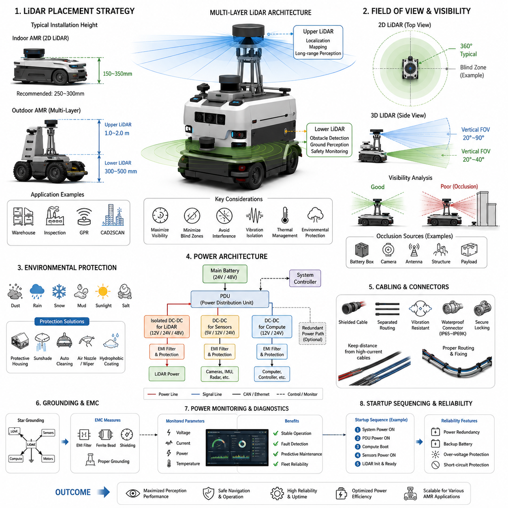
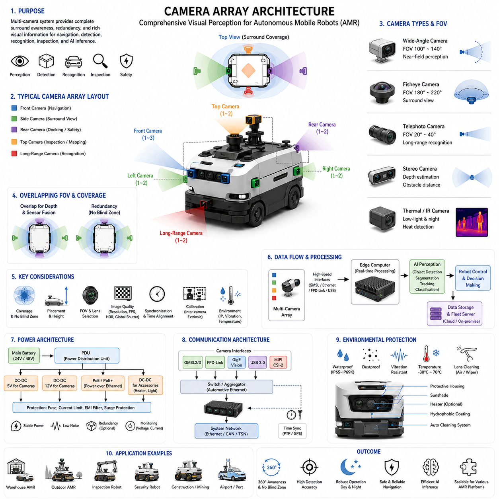
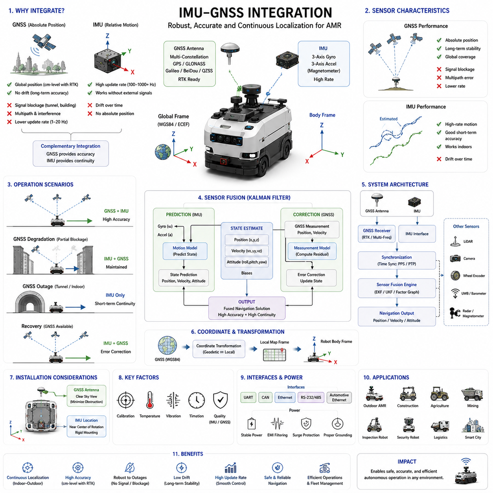
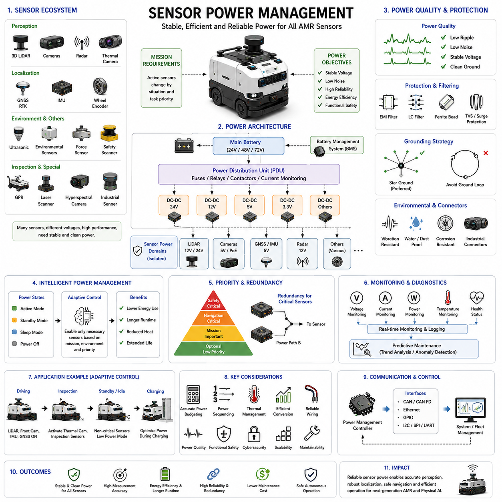
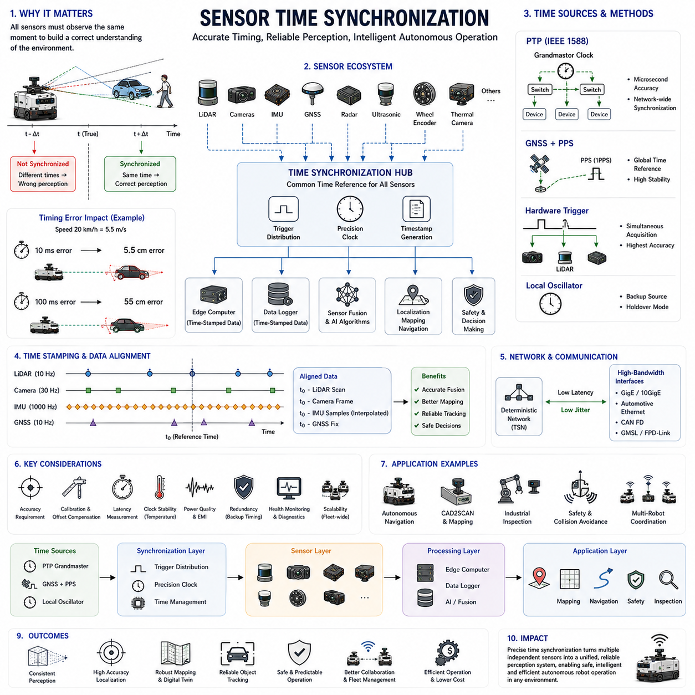

**Volume 13 AMR Electrical Architecture**


# Chapter 9. Sensor Architecture

##  

## 9.1 LiDAR Placement and Power

{width="7.268055555555556in" height="7.268055555555556in"}

LiDAR Placement and Power is one of the most critical topics in Autonomous Mobile Robot (AMR) electrical architecture because the performance of navigation, localization, mapping, obstacle detection, safety monitoring, and autonomous decision-making is heavily influenced by where LiDAR sensors are physically installed and how they are electrically powered. Within the Sensor Architecture domain of AMR Electrical Architecture, LiDAR systems serve as the primary perception devices that provide high-resolution spatial awareness. While software algorithms such as SLAM, localization, sensor fusion, and path planning often receive significant attention, the effectiveness of these algorithms depends greatly on proper LiDAR placement, mechanical integration, power quality, electromagnetic compatibility, thermal behavior, and environmental protection. A poorly positioned LiDAR or an unstable power supply can dramatically reduce system performance even when advanced software is employed.

The primary objective of LiDAR placement engineering is to maximize environmental visibility while minimizing blind zones, sensor interference, vibration effects, contamination risks, and mechanical damage. In AMR systems, LiDAR sensors are typically classified into 2D LiDAR, 3D LiDAR, Solid-State LiDAR, Flash LiDAR, and Hybrid LiDAR systems. Each sensor category has different field-of-view characteristics, power requirements, mounting constraints, and integration strategies.

For indoor AMRs operating in warehouses, hospitals, factories, and logistics centers, 2D LiDAR sensors are commonly installed near the lower portion of the robot chassis. Typical installation heights range from 150 mm to 350 mm above ground level. This position allows the sensor to effectively detect pallets, boxes, walls, human legs, machinery, and other ground-level obstacles. Mounting the LiDAR too low may expose it to dust accumulation, water ingress, impacts, and floor reflections. Mounting it too high may reduce detection capability for low obstacles such as pallet forks and equipment protrusions.

The installation height of a 2D LiDAR must be selected according to the operational environment. In warehouse applications, a height between 250 mm and 300 mm often provides an effective compromise between obstacle detection and sensor protection. In hospital environments where carts, beds, and equipment have varying heights, multiple LiDAR layers may be used to improve safety coverage.

Outdoor AMRs face significantly greater challenges. Uneven terrain, vegetation, weather conditions, and larger operational spaces require wider sensing coverage. Outdoor systems often utilize multiple LiDAR sensors mounted at different heights. A lower LiDAR may be positioned approximately 300 mm to 500 mm above the ground for near-field obstacle detection, while an upper LiDAR may be installed at heights ranging from 1.0 m to 2.0 m to support localization, mapping, and long-range perception.

Multi-layer LiDAR architectures are increasingly common in outdoor autonomous platforms. A low-mounted sensor can detect rocks, curbs, potholes, and small obstacles, while a higher-mounted sensor can observe trees, buildings, fences, and landmarks required for localization. This layered approach improves perception robustness and reduces blind spots.

For autonomous inspection robots, LiDAR placement must account for both navigation and inspection requirements. Inspection robots operating in industrial plants, substations, refineries, or utility corridors frequently require LiDAR sensors mounted at elevated positions to improve visibility over equipment and infrastructure. The mounting location must ensure that the sensor field of view is not obstructed by cameras, antennas, thermal imaging devices, communication modules, or mechanical structures.

In GPR-based AMR systems, LiDAR placement becomes even more important because electromagnetic interference and sensor occlusion can affect both perception and subsurface sensing performance. Ground Penetrating Radar antennas are usually positioned near the ground surface, while LiDAR sensors are mounted above the GPR assembly. Proper separation distances help minimize mutual interference and simplify maintenance access.

CAD2SCAN systems require highly accurate LiDAR placement because point cloud accuracy directly affects digital twin generation, BIM integration, and construction verification processes. Mechanical tolerances, vibration isolation, and sensor alignment become critical engineering considerations. Even small angular deviations can introduce significant errors when scanning large structures.

The field of view of the LiDAR must always be analyzed before finalizing sensor placement. Every LiDAR sensor has horizontal and vertical viewing limitations. A typical 2D LiDAR may provide a 270-degree or 360-degree horizontal field of view. Modern 3D LiDAR systems often provide horizontal coverage between 120 degrees and 360 degrees and vertical coverage between 20 degrees and 90 degrees depending on the technology used.

The robot body itself can create occlusion zones. Battery enclosures, protective covers, communication antennas, cameras, lighting systems, manipulators, and payload structures can block portions of the LiDAR field of view. Engineers must perform visibility analysis during the design phase to identify and eliminate potential blind zones.

Computer-aided engineering tools are frequently used to evaluate LiDAR coverage. Digital twins allow designers to simulate sensor placement and calculate visibility maps. This process helps determine whether all critical operating regions are covered by the perception system. Blind zones can then be addressed by relocating sensors or adding additional sensing devices.

Vibration isolation is another important consideration. LiDAR sensors rely on precise optical measurements. Excessive vibration can degrade measurement accuracy and shorten sensor lifespan. Outdoor robots, construction robots, and mining vehicles often experience substantial vibration from rough terrain. Mechanical isolation mounts, dampers, elastomer supports, and shock absorbers are commonly incorporated into LiDAR mounting systems.

Thermal management also influences LiDAR placement decisions. High-performance 3D LiDAR units can generate significant heat during operation. Internal electronic components, laser emitters, receivers, and processing units require thermal stability for accurate measurements. Placement locations must provide adequate airflow while preventing excessive exposure to direct sunlight or heat-generating components.

Environmental protection is particularly important for outdoor robots. Dust, mud, rain, snow, ice, and salt contamination can degrade LiDAR performance. Placement strategies often incorporate protective housings, sunshades, cleaning systems, and environmental covers. However, these protective structures must not obstruct the sensor field of view.

Many industrial systems include automated cleaning mechanisms. Air nozzles, compressed air systems, windshield-wiper style cleaners, and hydrophobic coatings are commonly used to maintain sensor performance. These systems become increasingly important in mining, agriculture, construction, and utility inspection environments.

Power architecture is equally critical to LiDAR system performance. Most LiDAR sensors operate using regulated DC power supplies. Common operating voltages include 5V, 12V, 24V, and 48V depending on the manufacturer and sensor class. Power consumption varies significantly between sensor types.

Compact indoor 2D LiDAR units may consume only 5 W to 15 W. Mid-range 3D LiDAR sensors often require 15 W to 50 W. High-performance long-range automotive and industrial LiDAR systems may consume 50 W to 150 W or more. Therefore, power budgeting becomes a fundamental part of AMR electrical architecture.

The electrical design process begins by determining the total sensor power budget. Engineers calculate maximum power consumption, startup current, transient conditions, and fault scenarios. Power distribution units must be sized appropriately to support all connected devices while maintaining voltage stability.

Voltage regulation quality is especially important for LiDAR systems. Laser emitters, photodetectors, and signal-processing electronics require stable operating voltages. Excessive voltage ripple or transient fluctuations may introduce measurement errors or system instability. Dedicated DC-DC converters are frequently used to isolate LiDAR power from motor drives and other noisy electrical loads.

Motor controllers, traction inverters, and high-current switching devices generate electrical noise that can propagate through power distribution networks. Without proper filtering, this noise may affect LiDAR operation. Engineers therefore implement EMI filters, common-mode chokes, ferrite beads, shielded cables, and isolated power supplies.

Grounding architecture plays a significant role in sensor performance. Improper grounding can create ground loops that introduce noise into sensor measurements. A carefully designed grounding strategy ensures stable operation and improves electromagnetic compatibility. Star grounding configurations are commonly employed in AMR platforms to minimize interference.

Power redundancy becomes important in mission-critical systems. Security robots, inspection robots, mining vehicles, and outdoor autonomous platforms may require continuous perception capabilities even during partial power failures. Redundant power paths, backup batteries, and fault-tolerant power distribution systems are often incorporated into high-reliability architectures.

Startup sequencing is another consideration. Some LiDAR sensors require controlled initialization procedures. Power should be applied in a defined sequence to prevent communication errors and ensure proper sensor calibration. System controllers frequently manage startup timing using dedicated power-management modules.

Cable routing significantly affects both power integrity and sensor reliability. Power cables should be separated from high-current motor cables whenever possible. Shielded wiring and proper cable management reduce electromagnetic interference. Connector selection must consider vibration resistance, environmental sealing, current capacity, and maintenance accessibility.

Industrial AMRs commonly use IP65, IP67, or IP69K-rated connectors for LiDAR power interfaces. Connector reliability directly influences system uptime because intermittent power interruptions can cause perception failures and navigation instability.

Power monitoring is increasingly integrated into modern AMR platforms. Voltage, current, temperature, and power consumption data can be continuously monitored by the robot management system. Predictive maintenance algorithms analyze these measurements to identify developing failures before operational disruptions occur.

In fleet-scale deployments, centralized monitoring platforms collect sensor health information from multiple robots. Operators can track LiDAR power consumption trends, detect abnormal behavior, and schedule maintenance proactively. This approach improves fleet reliability and reduces downtime.

Future LiDAR architectures are expected to incorporate higher integration levels, lower power consumption, and improved sensing performance. Advances in solid-state technology, silicon photonics, integrated processing, and AI-assisted perception will continue reducing power requirements while increasing sensing capability. Emerging sensor architectures may integrate perception processing directly within the LiDAR module, reducing communication bandwidth and computational overhead.

As AMRs evolve toward Physical AI systems, LiDAR placement and power engineering will become even more important. Autonomous systems operating in factories, cities, mines, ports, airports, warehouses, construction sites, and agricultural environments will rely on increasingly sophisticated perception architectures. The successful deployment of these systems requires careful coordination of mechanical design, electrical engineering, thermal management, EMI control, safety architecture, and sensor integration. Proper LiDAR placement ensures maximum environmental awareness, while robust power architecture guarantees stable and reliable sensor operation. Together, these disciplines form the foundation of modern AMR perception systems and enable safe, efficient, and intelligent autonomous operation across a wide range of robotic applications.

(Volume 13 → 13_09 Sensor Architecture → 09_01 LiDAR Placement and Power)

# 09_01 LiDAR 배치 및 전원 (LiDAR Placement and Power)

LiDAR 배치 및 전원(LiDAR Placement and Power)은 자율이동로봇(AMR, Autonomous Mobile Robot) 전장 아키텍처(Electrical Architecture)에서 가장 중요한 주제 중 하나이다. 내비게이션(Navigation), 위치추정(Localization), 지도작성(Mapping), 장애물 감지(Obstacle Detection), 안전 감시(Safety Monitoring), 자율 의사결정(Autonomous Decision-Making)의 성능은 LiDAR 센서가 어디에 설치되는지와 어떤 방식으로 전원을 공급받는지에 크게 영향을 받는다. 센서 아키텍처(Sensor Architecture) 영역에서 LiDAR는 로봇이 주변 환경을 인식하는 핵심 센서로서 고해상도 공간 정보를 제공한다. 일반적으로 SLAM, 위치추정, 센서 융합(Sensor Fusion), 경로 계획(Path Planning)과 같은 소프트웨어 알고리즘이 주목받지만, 이러한 알고리즘의 성능은 LiDAR의 기계적 배치와 전원 품질에 크게 의존한다. 부적절한 위치에 설치된 LiDAR나 불안정한 전원 시스템은 아무리 우수한 소프트웨어가 적용되더라도 전체 시스템 성능을 크게 저하시킬 수 있다.

LiDAR 배치 설계의 가장 중요한 목적은 환경에 대한 가시성을 최대화하면서 사각지대(Blind Zone), 센서 간 간섭, 진동 영향, 오염 위험, 기계적 손상을 최소화하는 것이다. AMR 시스템에서 사용되는 LiDAR는 일반적으로 2D LiDAR, 3D LiDAR, 고체형 LiDAR(Solid-State LiDAR), 플래시 LiDAR(Flash LiDAR), 하이브리드 LiDAR(Hybrid LiDAR)로 구분된다. 각각은 시야각(Field of View), 소비전력, 설치 조건 및 통합 방식이 다르다.

창고, 병원, 공장, 물류센터와 같은 실내 환경에서 사용되는 AMR은 일반적으로 차체 하부에 2D LiDAR를 설치한다. 설치 높이는 보통 지면으로부터 150mm에서 350mm 사이가 적절하다. 이러한 위치는 팔레트(Pallet), 박스(Box), 벽(Wall), 사람의 다리, 설비와 같은 저고도 장애물을 효과적으로 감지할 수 있게 한다. 너무 낮게 설치하면 먼지, 물, 충격, 바닥 반사에 취약해지며, 너무 높게 설치하면 팔레트 포크(Fork)와 같은 낮은 장애물을 감지하지 못할 가능성이 커진다.

실내 창고에서는 일반적으로 250mm에서 300mm 정도의 높이가 감지 성능과 센서 보호 측면에서 균형이 좋은 위치로 평가된다. 병원 환경에서는 침대, 카트, 의료장비의 높이가 다양하기 때문에 다중 높이의 LiDAR를 사용하는 경우도 많다.

실외 AMR은 훨씬 더 복잡한 환경에 직면한다. 불규칙한 지형, 식생, 날씨 변화, 넓은 작업 공간으로 인해 더욱 넓은 감지 범위가 필요하다. 따라서 실외 AMR은 서로 다른 높이에 여러 개의 LiDAR를 배치하는 경우가 많다. 하부 LiDAR는 약 300mm\~500mm 높이에 설치되어 근거리 장애물을 감지하고, 상부 LiDAR는 1m\~2m 높이에 설치되어 위치추정과 장거리 환경 인식을 수행한다.

다층 LiDAR 아키텍처(Multi-Layer LiDAR Architecture)는 실외 자율주행 플랫폼에서 점점 더 일반화되고 있다. 하단 LiDAR는 돌, 연석(Curb), 포트홀(Pothole), 작은 장애물을 감지하고, 상단 LiDAR는 건물, 나무, 울타리, 랜드마크(Landmark)를 인식하여 위치추정에 활용한다. 이러한 계층 구조는 사각지대를 줄이고 인식 안정성을 높인다.

산업용 점검 로봇(Inspection Robot)의 경우 LiDAR는 내비게이션뿐 아니라 점검 임무도 고려하여 설치되어야 한다. 발전소, 변전소, 정유공장, 플랜트와 같은 환경에서는 높은 위치에 LiDAR를 설치하여 설비 위까지 시야를 확보하는 경우가 많다. 이때 카메라(Camera), 열화상 카메라(Thermal Camera), 안테나(Antenna), 통신 모듈, 기계 구조물이 LiDAR 시야를 가리지 않도록 주의해야 한다.

GPR AMR(Ground Penetrating Radar AMR)에서는 LiDAR 배치가 더욱 중요하다. GPR 안테나는 지면 가까이에 위치하며 LiDAR는 그 위쪽에 설치된다. 적절한 이격 거리(Separation Distance)를 확보하면 전자기 간섭(Electromagnetic Interference)을 줄이고 유지보수를 용이하게 할 수 있다.

CAD2SCAN 시스템에서는 LiDAR의 배치 정밀도가 디지털 트윈(Digital Twin), BIM(Building Information Modeling), 시공 검증 정확도에 직접적인 영향을 미친다. 기계적 공차(Mechanical Tolerance), 진동 절연(Vibration Isolation), 센서 정렬(Sensor Alignment)이 매우 중요하다. 작은 각도 오차도 대형 구조물 스캔에서는 상당한 위치 오차를 발생시킬 수 있다.

LiDAR의 시야각(Field of View)은 설치 전 반드시 분석되어야 한다. 대부분의 2D LiDAR는 270도 또는 360도의 수평 시야각을 제공한다. 최신 3D LiDAR는 수평 방향으로 120도에서 360도, 수직 방향으로 20도에서 90도 범위의 시야각을 제공한다.

로봇 자체의 구조물이 LiDAR 시야를 가리는 경우도 많다. 배터리 케이스(Battery Enclosure), 보호 커버, 안테나, 카메라, 조명장치, 매니퓰레이터(Manipulator), 적재물(Payload)이 시야를 방해할 수 있다. 따라서 설계 단계에서 가시성 분석(Visibility Analysis)을 수행하여 사각지대를 제거해야 한다.

이를 위해 디지털 트윈 기반의 시뮬레이션이 자주 활용된다. 설계자는 가상 환경에서 LiDAR 커버리지(Coverage)를 분석하고, 시야가 확보되지 않는 영역을 발견하면 센서를 재배치하거나 추가 센서를 설치할 수 있다.

진동 제어도 중요한 요소이다. LiDAR는 매우 정밀한 광학 측정을 수행하므로 과도한 진동은 측정 정확도를 저하시킬 수 있다. 광산용 로봇, 건설 로봇, 실외 AMR은 거친 지형을 주행하기 때문에 진동 절연 마운트(Isolation Mount), 댐퍼(Damper), 탄성 지지대(Elastomer Support), 충격 흡수기(Shock Absorber)를 적용하는 경우가 많다.

열관리(Thermal Management) 또한 LiDAR 배치에 영향을 준다. 고성능 3D LiDAR는 상당한 열을 발생시키며, 내부 레이저 송신기(Laser Emitter), 수신기(Receiver), 처리장치(Processor)는 안정적인 온도 조건에서 동작해야 한다. 따라서 충분한 공기 흐름(Airflow)을 확보하면서도 직사광선과 고열 부품을 피하는 위치에 설치해야 한다.

실외 환경에서는 먼지(Dust), 진흙(Mud), 비(Rain), 눈(Snow), 얼음(Ice), 염분(Salt) 등이 LiDAR 성능을 저하시킬 수 있다. 따라서 보호 하우징(Protective Housing), 차광판(Sunshade), 자동 세척 시스템(Cleaning System), 환경 보호 커버가 적용된다. 그러나 이러한 구조물은 LiDAR 시야를 방해하지 않도록 설계되어야 한다.

많은 산업용 로봇은 자동 세척 기능을 갖춘다. 압축공기 노즐(Air Nozzle), 와이퍼(Wiper), 발수 코팅(Hydrophobic Coating) 등을 사용하여 렌즈 오염을 제거한다. 광산, 농업, 건설 분야에서는 이러한 기능이 거의 필수적이다.

전원 아키텍처(Power Architecture)는 LiDAR 성능에 직접적인 영향을 미친다. 대부분의 LiDAR는 안정적인 직류 전원(DC Power)을 요구한다. 일반적으로 5V, 12V, 24V, 48V 전원을 사용하며, 제조사와 센서 종류에 따라 차이가 있다.

실내용 소형 2D LiDAR는 약 5W\~15W를 소비한다. 중형 3D LiDAR는 15W\~50W 수준의 소비전력을 가지며, 장거리용 산업 및 자동차용 LiDAR는 50W\~150W 이상의 전력을 요구할 수 있다. 따라서 전력 예산(Power Budget) 계산은 전장 설계의 핵심 요소가 된다.

전기 설계는 전체 센서 소비전력 산출에서 시작된다. 최대 소비전력, 시동 전류(Inrush Current), 과도 상태(Transient Condition), 고장 상태(Fault Condition)를 고려하여 전력 분배 장치(PDU, Power Distribution Unit)를 설계해야 한다.

전압 안정성(Voltage Stability)은 LiDAR에서 특히 중요하다. 레이저 송신기, 광검출기(Photo Detector), 신호처리 회로는 안정적인 전압을 요구한다. 전압 리플(Ripple)이나 순간적인 전압 변동은 측정 오차를 유발할 수 있다. 따라서 독립적인 DC-DC 컨버터(DC-DC Converter)를 사용하여 모터 구동계와 LiDAR 전원을 분리하는 경우가 많다.

모터 드라이버(Motor Driver), 인버터(Inverter), 고전류 스위칭 장치는 강한 전기적 노이즈를 발생시킨다. 이를 방지하기 위해 EMI 필터(EMI Filter), 공통모드 초크(Common Mode Choke), 페라이트 비드(Ferrite Bead), 차폐 케이블(Shielded Cable), 절연 전원(Isolated Power Supply)이 적용된다.

접지 아키텍처(Grounding Architecture) 역시 중요하다. 잘못된 접지는 접지 루프(Ground Loop)를 발생시켜 센서 노이즈를 증가시킬 수 있다. 많은 AMR 시스템은 스타 접지(Star Grounding) 구조를 적용하여 간섭을 최소화한다.

보안 로봇(Security Robot), 점검 로봇, 광산 차량과 같은 고신뢰성 시스템은 전원 이중화(Power Redundancy)를 적용하기도 한다. 이중 전원 경로, 백업 배터리, 장애 허용 전력 시스템(Fault-Tolerant Power System)을 통해 일부 전원 장애 상황에서도 LiDAR가 지속적으로 동작할 수 있도록 설계한다.

시동 순서(Startup Sequencing)도 중요하다. 일부 LiDAR는 특정 순서로 전원이 인가되어야 정상 초기화가 가능하다. 이를 위해 전원 관리 모듈(Power Management Module)이 시동 시퀀스를 제어한다.

케이블 배선(Cable Routing)은 전원 품질과 센서 신뢰성에 직접적인 영향을 준다. LiDAR 전원선은 가능한 한 모터 전원선과 분리하여 배치해야 하며, 적절한 차폐와 케이블 관리가 필요하다. 커넥터(Connector)는 진동 저항성, 방수 성능, 전류 용량, 유지보수성을 고려하여 선정해야 한다.

산업용 AMR은 일반적으로 IP65, IP67, IP69K 등급의 방수 커넥터를 사용한다. 커넥터의 신뢰성은 시스템 가동률(Uptime)에 직접적인 영향을 미치며, 순간적인 전원 단절도 자율주행 성능을 크게 저하시킬 수 있다.

최근에는 전력 모니터링(Power Monitoring)이 적극적으로 적용되고 있다. 전압, 전류, 온도, 소비전력을 실시간으로 모니터링하고 예지보전(Predictive Maintenance) 알고리즘을 통해 이상 상태를 조기에 감지한다.

대규모 플릿(Fleet) 운영 환경에서는 중앙 관제 시스템이 다수의 로봇으로부터 LiDAR 상태 데이터를 수집한다. 운영자는 전력 소비 추세를 분석하고 이상 징후를 사전에 발견하여 유지보수를 계획할 수 있다.

향후 LiDAR 기술은 더욱 높은 집적도와 낮은 소비전력을 제공하게 될 것이다. 고체형 LiDAR, 실리콘 포토닉스(Silicon Photonics), 내장형 AI 처리 기술은 전력 소모를 줄이면서 성능을 향상시킬 것으로 예상된다. 미래의 LiDAR는 자체적으로 인공지능 기반 전처리를 수행하여 통신 대역폭과 중앙 컴퓨팅 부하를 줄일 가능성이 높다.

AMR이 물리 AI(Physical AI) 시스템으로 발전함에 따라 LiDAR 배치 및 전원 설계의 중요성은 더욱 커질 것이다. 공장, 도시, 광산, 항만, 공항, 농업, 건설 현장에서 운용되는 자율 시스템은 점점 더 복잡한 인지 능력을 요구하게 된다. 이러한 시스템의 성공적인 구현을 위해서는 기계 설계(Mechanical Design), 전장 설계(Electrical Design), 열관리(Thermal Management), EMC(Electromagnetic Compatibility), 기능 안전(Functional Safety), 센서 통합(Sensor Integration)이 유기적으로 결합되어야 한다.

결국 적절한 LiDAR 배치는 환경 인식 능력을 극대화하고, 안정적인 전원 아키텍처는 센서의 신뢰성과 정확성을 보장한다. 이 두 요소는 현대 AMR 인지 시스템(Perception System)의 핵심 기반이며, 안전하고 효율적이며 지능적인 자율주행 로봇 구현을 가능하게 하는 필수 기술이다.

##  

## 9.2 Camera Array Architecture

{width="7.268055555555556in" height="7.268055555555556in"}

Camera Array Architecture is a fundamental component of modern Autonomous Mobile Robot (AMR) electrical and perception architecture because cameras have become one of the most important sensing modalities for navigation, localization, obstacle detection, object recognition, inspection, safety monitoring, artificial intelligence inference, and digital twin generation. While LiDAR provides accurate geometric measurements and radar offers robust environmental sensing under adverse weather conditions, cameras provide rich visual information that enables robots to understand the semantic meaning of their surroundings. As autonomous systems evolve toward Physical AI platforms, camera systems are increasingly deployed not as individual sensors but as coordinated camera arrays designed to capture comprehensive environmental information from multiple viewpoints simultaneously.

A camera array refers to a collection of multiple cameras integrated into a unified sensing architecture. These cameras may be positioned around the robot body, mounted at different heights, configured with different optical characteristics, or optimized for specific sensing tasks. The primary objective of a camera array architecture is to eliminate visual blind zones, improve perception redundancy, enhance spatial awareness, support sensor fusion, and provide reliable visual information across diverse operational scenarios.

In traditional robotic systems, a single forward-facing camera was often sufficient for basic navigation and obstacle detection. However, modern autonomous systems require significantly greater environmental awareness. Warehouses, factories, outdoor logistics centers, construction sites, airports, ports, mining operations, and smart city environments contain dynamic obstacles, human workers, moving vehicles, complex structures, and continuously changing operational conditions. To safely operate within these environments, robots require multi-directional visual perception capabilities.

Camera array architecture begins with defining system objectives. Different AMR applications require different camera configurations. Indoor logistics robots may prioritize obstacle detection and docking assistance, while outdoor autonomous vehicles require long-range perception and situational awareness. Inspection robots require detailed imaging of equipment and infrastructure, whereas security robots require continuous surveillance and event detection. Therefore, the architecture of a camera array must always be driven by mission requirements.

A typical indoor AMR often employs four to eight cameras distributed around the robot chassis. Front cameras provide navigation and obstacle detection. Rear cameras assist with reverse movement and docking operations. Side cameras monitor adjacent areas and reduce blind spots. Overhead cameras may be used for pallet detection, shelf identification, barcode reading, or inventory management. Together, these cameras create a near-complete visual representation of the robot\'s surroundings.

Outdoor AMRs typically require larger and more sophisticated camera arrays. Environmental complexity increases significantly outdoors due to varying terrain, lighting conditions, weather effects, and higher operating speeds. Multiple forward-facing cameras may be used simultaneously, with each camera optimized for a different sensing range. Wide-angle cameras monitor nearby obstacles, while telephoto cameras provide long-range perception. Additional side and rear cameras improve situational awareness and safety.

The concept of overlapping fields of view is central to camera array design. Cameras should not simply cover separate regions of space. Instead, their fields of view should overlap sufficiently to enable stereo vision, depth estimation, sensor fusion, and redundancy. Overlapping coverage also ensures that critical regions remain visible even if one camera becomes obstructed or experiences temporary failure.

Stereo camera systems represent one of the most widely used camera array configurations. Two cameras separated by a known baseline capture images simultaneously. By analyzing differences between the images, depth information can be calculated through triangulation. Stereo vision provides a cost-effective method for estimating distances to obstacles, detecting free space, and supporting localization algorithms.

Advanced AMR platforms frequently employ multi-stereo architectures in which several stereo camera pairs are distributed throughout the vehicle. This configuration increases perception coverage and improves robustness in challenging environments. Some systems combine stereo cameras with depth cameras, LiDAR sensors, radar systems, and inertial measurement units to create comprehensive sensor fusion architectures.

Camera placement is one of the most important design decisions within a camera array architecture. Placement directly affects visibility, depth perception, calibration complexity, maintenance accessibility, environmental exposure, and overall system performance. Cameras should be positioned to maximize environmental coverage while minimizing occlusions caused by the robot structure itself.

Robot components such as battery enclosures, payload modules, communication antennas, manipulators, safety structures, protective housings, and sensor towers can create visual obstructions. Engineers must carefully analyze potential blind zones during the design process. Digital twin simulations are frequently used to evaluate visibility and optimize camera placement before physical prototypes are constructed.

Camera mounting height also significantly influences system performance. Cameras mounted close to ground level are highly effective at detecting low obstacles, pallet forks, floor markings, and small objects. Cameras mounted at elevated positions provide wider environmental visibility and improved localization performance. Many AMR platforms therefore employ cameras at multiple heights to maximize perception capability.

Field of view selection is another important aspect of camera array architecture. Different camera lenses provide different viewing characteristics. Wide-angle lenses offer large coverage areas but introduce geometric distortion and reduced resolution at long distances. Narrow-angle lenses provide higher detail and longer detection ranges but cover smaller regions. Successful camera architectures often combine multiple lens types to balance coverage and detail.

Fisheye cameras are commonly used for near-field perception and surround-view systems. Their extremely wide field of view allows a small number of cameras to cover large areas around the robot. However, fisheye images require distortion correction before they can be used effectively by perception algorithms.

Long-range cameras support object recognition, traffic awareness, infrastructure detection, and route planning. These cameras are particularly important in outdoor autonomous systems operating at higher speeds. High-resolution sensors combined with telephoto optics enable the detection of distant objects and environmental features.

Image quality plays a critical role in overall camera system performance. Camera selection must consider resolution, frame rate, dynamic range, sensitivity, noise characteristics, color accuracy, shutter technology, and environmental robustness. Higher image quality generally improves perception performance but also increases computational requirements and communication bandwidth.

Global shutter cameras are frequently preferred for robotics applications because they capture all pixels simultaneously. This prevents motion distortion that can occur when robots move rapidly or when objects travel through the camera field of view. Rolling shutter cameras are often less expensive but may introduce image artifacts that negatively affect localization and perception algorithms.

Dynamic range is particularly important in outdoor environments. Autonomous robots frequently encounter challenging lighting conditions including direct sunlight, shadows, reflections, tunnels, warehouses, and nighttime operation. High Dynamic Range (HDR) imaging technologies improve visibility across these diverse lighting conditions.

Night operation introduces additional challenges. Standard RGB cameras may experience reduced performance in low-light environments. To address this limitation, camera arrays often incorporate infrared cameras, thermal cameras, low-light imaging sensors, or active illumination systems. These technologies extend operational capability and improve safety during nighttime missions.

Thermal imaging cameras provide unique advantages for inspection robots, security robots, industrial monitoring systems, and autonomous infrastructure assessment platforms. Thermal sensors can detect heat signatures, equipment failures, electrical abnormalities, and human presence even in complete darkness.

Synchronization is a fundamental requirement in multi-camera systems. Cameras must capture images at precisely coordinated times to support stereo vision, sensor fusion, and accurate environmental reconstruction. Even small timing differences can introduce significant perception errors.

Hardware synchronization is generally preferred for high-performance robotic systems. Trigger distribution boards, synchronization controllers, and Precision Time Protocol (PTP) networks are commonly employed to maintain timing accuracy. Hardware-triggered camera systems ensure that all sensors capture data simultaneously.

Time synchronization becomes even more critical when cameras are integrated with LiDAR, radar, IMU, GNSS, and other sensors. Accurate timestamp alignment enables reliable sensor fusion and improves localization, mapping, and perception performance.

Calibration represents one of the most challenging aspects of camera array architecture. Each camera possesses unique intrinsic parameters including focal length, optical center, distortion coefficients, and sensor characteristics. Additionally, the relative positions and orientations between cameras must be accurately determined through extrinsic calibration.

Multi-camera calibration establishes the geometric relationships between all cameras within the array. Accurate calibration is essential for depth estimation, panoramic image generation, surround-view systems, visual odometry, and simultaneous localization and mapping.

Calibration accuracy must be maintained throughout the operational life of the robot. Mechanical vibration, thermal expansion, maintenance activities, and accidental impacts can alter sensor alignment. Periodic recalibration procedures are therefore often incorporated into maintenance programs.

Camera arrays generate substantial data volumes. A single Full HD camera operating at sixty frames per second may generate hundreds of megabits per second of raw image data. Systems containing six, eight, or twelve cameras can easily produce gigabits of data per second. Consequently, communication architecture becomes an important design consideration.

Gigabit Ethernet, Automotive Ethernet, GMSL, FPD-Link, USB 3.0, and high-speed serial interfaces are commonly used for camera connectivity. Communication architecture must provide sufficient bandwidth while maintaining reliability and minimizing latency.

Power architecture is equally important. Modern industrial cameras typically operate using 5V, 12V, or Power over Ethernet configurations. Large camera arrays may consume significant power, particularly when integrated with active illumination systems, onboard processing hardware, or thermal imaging modules.

Power distribution systems must provide stable voltage and current under all operating conditions. Voltage fluctuations can degrade image quality or cause sensor instability. Dedicated power regulators, EMI filters, isolated supplies, and surge protection devices are often incorporated into camera power architectures.

Electromagnetic compatibility is particularly important because cameras frequently operate near motor controllers, inverters, wireless communication systems, and high-current electrical equipment. Shielded cables, proper grounding strategies, filtered power supplies, and robust connector designs improve system reliability.

Environmental protection requirements vary according to application. Indoor systems may only require basic dust protection, while outdoor autonomous vehicles often require IP65, IP67, or IP69K protection ratings. Camera housings must resist water, dust, vibration, temperature extremes, ultraviolet exposure, and chemical contamination.

Camera lens contamination represents a major operational challenge. Dust accumulation, rain, mud, snow, condensation, and insects can degrade image quality and perception accuracy. Automated cleaning systems including air nozzles, wipers, hydrophobic coatings, and heated lens covers are increasingly incorporated into industrial robotic platforms.

Artificial intelligence has become deeply integrated with camera array architectures. Modern perception systems use deep learning algorithms for object detection, semantic segmentation, lane detection, human recognition, activity analysis, defect identification, and behavioral prediction. Camera arrays provide the rich visual information necessary to support these AI-driven capabilities.

In inspection applications, camera arrays enable comprehensive asset monitoring. Multiple viewpoints allow detailed examination of equipment, infrastructure, pipelines, electrical systems, and structural components. Digital twin platforms can combine camera imagery with LiDAR point clouds to generate highly accurate virtual representations of physical environments.

Fleet-scale deployments introduce additional architectural considerations. Camera data may be processed locally on edge computers, transmitted to centralized servers, or shared across multiple robots. Hybrid edge-cloud architectures are increasingly common because they balance computational efficiency, bandwidth utilization, and operational flexibility.

Future camera array architectures will continue evolving toward higher resolution, increased sensor integration, improved synchronization, lower power consumption, and tighter integration with artificial intelligence. Event-based cameras, neuromorphic vision systems, computational imaging technologies, and AI-enabled smart sensors will further enhance robotic perception capabilities.

As autonomous systems progress toward Physical AI and embodied intelligence, camera arrays will become increasingly important as primary sources of environmental understanding. Successful implementation requires careful coordination of sensor placement, optical design, electrical architecture, synchronization systems, calibration processes, communication infrastructure, power distribution, environmental protection, and artificial intelligence integration. A well-designed camera array architecture enables robots to perceive, understand, and interact with complex environments safely and efficiently, forming a foundational element of next-generation autonomous robotic systems.

# 09_02 카메라 배열 아키텍처 (Camera Array Architecture)

카메라 배열 아키텍처(Camera Array Architecture)는 현대 자율이동로봇(AMR, Autonomous Mobile Robot)의 전장 아키텍처(Electrical Architecture) 및 인지 아키텍처(Perception Architecture)를 구성하는 핵심 요소이다. 카메라는 내비게이션(Navigation), 위치추정(Localization), 장애물 감지(Obstacle Detection), 객체 인식(Object Recognition), 시설 점검(Inspection), 안전 감시(Safety Monitoring), 인공지능 추론(AI Inference), 디지털 트윈(Digital Twin) 생성에 이르기까지 매우 다양한 역할을 수행한다. LiDAR가 정확한 기하학적 거리 정보를 제공하고 레이더(Radar)가 악천후 환경에서 강점을 가진다면, 카메라는 주변 환경의 의미적 정보(Semantic Information)를 제공하여 로봇이 환경을 이해하도록 돕는다.

최근의 자율주행 로봇은 단일 카메라가 아닌 다수의 카메라를 하나의 통합된 시스템으로 구성하는 카메라 배열 구조를 채택하고 있다. 이러한 구조는 사각지대(Blind Zone)를 제거하고, 인식 정확도를 향상시키며, 센서 이중화(Redundancy)를 확보하고, 다양한 환경에서 안정적인 시각 정보를 제공하는 것을 목표로 한다.

초기의 로봇은 전방을 바라보는 단일 카메라만으로도 기본적인 장애물 감지와 주행이 가능했다. 그러나 현대의 물류창고, 공장, 항만, 공항, 건설 현장, 광산, 스마트시티와 같은 환경은 훨씬 복잡하다. 사람, 차량, 장비, 구조물 등이 지속적으로 움직이며 환경이 변화하기 때문에 전방만 바라보는 단일 카메라로는 충분한 인식 성능을 확보하기 어렵다.

카메라 배열 아키텍처 설계는 시스템 목표(System Objective)를 정의하는 것에서 시작된다. 실내 물류 AMR은 팔레트(Pallet) 인식과 도킹(Docking)을 중요하게 생각할 수 있고, 실외 자율주행 AMR은 장거리 환경 인식(Long Range Perception)을 우선시할 수 있다. 점검 로봇(Inspection Robot)은 설비 상태를 정밀하게 촬영해야 하며, 보안 로봇(Security Robot)은 24시간 감시 기능을 요구할 수 있다. 따라서 카메라 배열은 반드시 임무 중심(Mission-Oriented)으로 설계되어야 한다.

일반적인 실내 AMR은 4개에서 8개 정도의 카메라를 사용한다. 전방 카메라는 주행과 장애물 감지를 담당하고, 후방 카메라는 후진 및 도킹을 지원한다. 측면 카메라는 사각지대를 줄이며, 상부 카메라는 팔레트 인식, 선반 인식, 바코드(Barcode) 판독, 재고 관리 등을 수행한다. 이러한 카메라들이 함께 동작하면서 로봇 주변의 거의 모든 영역을 시각적으로 인식할 수 있게 된다.

실외 AMR은 더욱 복잡한 카메라 배열을 요구한다. 다양한 지형, 날씨, 조명 환경, 높은 주행 속도에 대응하기 위해 서로 다른 용도의 카메라를 동시에 사용한다. 광각 카메라(Wide-Angle Camera)는 근거리 장애물을 감시하고, 망원 카메라(Telephoto Camera)는 먼 거리의 물체를 인식한다. 측면과 후면 카메라는 전방 카메라가 놓칠 수 있는 영역을 보완한다.

카메라 배열 설계에서 중요한 개념 중 하나는 중첩 시야(Overlapping Field of View)이다. 카메라들은 단순히 서로 다른 영역을 촬영하는 것이 아니라 일부 영역을 함께 촬영하도록 설계된다. 이를 통해 스테레오 비전(Stereo Vision), 깊이 추정(Depth Estimation), 센서 융합(Sensor Fusion), 이중화 기능을 구현할 수 있다. 또한 특정 카메라가 일시적으로 가려지거나 고장나더라도 다른 카메라가 동일 영역을 관측할 수 있어 시스템 안정성이 향상된다.

스테레오 카메라 시스템(Stereo Camera System)은 가장 널리 사용되는 카메라 배열 형태 중 하나이다. 두 개의 카메라를 일정 간격(Baseline)으로 배치하고 동시에 촬영하여 거리 정보를 계산한다. 삼각측량(Triangulation)을 통해 장애물까지의 거리, 주행 가능 영역, 공간 구조를 파악할 수 있다.

고급 AMR 플랫폼은 여러 개의 스테레오 카메라 쌍을 사용하는 다중 스테레오 아키텍처(Multi-Stereo Architecture)를 채택하기도 한다. 또한 스테레오 카메라와 깊이 카메라(Depth Camera), LiDAR, 레이더, IMU(Inertial Measurement Unit)를 함께 사용하는 복합 센서 융합 구조가 점차 보편화되고 있다.

카메라 배치(Camera Placement)는 카메라 배열 아키텍처에서 가장 중요한 설계 요소 중 하나이다. 카메라 위치는 가시성(Visibility), 깊이 인식 성능, 보정(Calibration) 난이도, 유지보수성(Maintainability), 환경 내구성(Environmental Robustness)에 직접적인 영향을 준다.

배터리 박스(Battery Box), 안테나(Antenna), 매니퓰레이터(Manipulator), 적재물(Payload), 보호 구조물(Protective Structure)은 카메라 시야를 가릴 수 있다. 따라서 설계 단계에서 디지털 트윈(Digital Twin)을 활용한 가시성 분석(Visibility Analysis)을 수행하여 사각지대를 최소화해야 한다.

카메라 높이 또한 중요한 요소이다. 낮은 위치에 설치된 카메라는 팔레트 포크, 바닥 표시, 작은 장애물을 잘 감지할 수 있다. 반면 높은 위치에 설치된 카메라는 더 넓은 시야를 확보하고 위치추정 성능을 향상시킨다. 따라서 많은 AMR은 서로 다른 높이에 카메라를 설치하여 다양한 정보를 수집한다.

시야각(Field of View) 선택도 중요하다. 광각 렌즈(Wide-Angle Lens)는 넓은 영역을 볼 수 있지만 먼 거리에서는 해상도가 낮아진다. 협각 렌즈(Narrow-Angle Lens)는 먼 거리의 세부 정보를 제공하지만 관측 범위가 좁다. 따라서 실제 시스템에서는 다양한 렌즈를 혼합하여 사용한다.

어안 카메라(Fisheye Camera)는 주변 감시(Surround View) 시스템에서 널리 사용된다. 매우 넓은 시야를 제공하여 적은 수의 카메라로도 넓은 영역을 감시할 수 있다. 그러나 왜곡 보정(Distortion Correction)이 필요하다.

장거리 카메라는 교통 상황 인식, 인프라 감지, 경로 계획에 사용된다. 특히 실외 자율주행 시스템에서는 고해상도 이미지 센서(Image Sensor)와 망원 렌즈를 결합하여 수십 미터에서 수백 미터 떨어진 물체를 인식할 수 있다.

영상 품질(Image Quality)은 전체 시스템 성능에 직접적인 영향을 준다. 해상도(Resolution), 프레임 속도(Frame Rate), 동적 범위(Dynamic Range), 감도(Sensitivity), 노이즈 특성(Noise Characteristics), 색상 정확도(Color Accuracy), 셔터 기술(Shutter Technology)을 종합적으로 고려해야 한다.

산업용 로봇에서는 글로벌 셔터(Global Shutter) 카메라가 선호된다. 모든 픽셀이 동시에 촬영되므로 고속 이동 시에도 영상 왜곡이 발생하지 않는다. 롤링 셔터(Rolling Shutter)는 저렴하지만 움직이는 환경에서 영상 왜곡이 발생할 수 있다.

동적 범위(Dynamic Range)는 실외 환경에서 특히 중요하다. 직사광선, 그림자, 터널, 실내외 전환 구간과 같은 극단적인 조명 조건에서는 HDR(High Dynamic Range) 기술이 필수적이다.

야간 환경에서는 일반 RGB 카메라의 성능이 제한될 수 있다. 이를 보완하기 위해 적외선 카메라(Infrared Camera), 열화상 카메라(Thermal Camera), 저조도 카메라(Low-Light Camera), 능동 조명 시스템(Active Illumination System)이 사용된다.

열화상 카메라는 점검 로봇과 보안 로봇에서 특히 중요하다. 설비 과열, 전기적 이상, 사람의 존재를 어두운 환경에서도 감지할 수 있다.

다중 카메라 시스템에서는 동기화(Synchronization)가 매우 중요하다. 카메라가 동일한 시점에 영상을 촬영해야 정확한 스테레오 비전과 센서 융합이 가능하다. 작은 시간 오차도 거리 계산과 환경 모델링에 큰 영향을 줄 수 있다.

고성능 시스템에서는 하드웨어 동기화(Hardware Synchronization)를 사용한다. 트리거 분배 보드(Trigger Distribution Board), 동기화 컨트롤러(Synchronization Controller), PTP(Precision Time Protocol) 네트워크를 활용하여 마이크로초(Microsecond) 수준의 시간 정합(Time Alignment)을 달성한다.

카메라가 LiDAR, 레이더, IMU, GNSS와 함께 사용될 경우 정확한 타임스탬프(Time Stamp) 정렬이 필수적이다. 이를 통해 센서 융합 성능이 크게 향상된다.

보정(Calibration)은 카메라 배열 시스템에서 가장 어려운 작업 중 하나이다. 각 카메라는 초점 거리(Focal Length), 광학 중심(Optical Center), 왜곡 계수(Distortion Coefficient)와 같은 고유 파라미터(Intrinsic Parameter)를 가진다. 또한 카메라 간 상대 위치와 방향을 나타내는 외부 파라미터(Extrinsic Parameter)도 정확하게 측정되어야 한다.

다중 카메라 보정(Multi-Camera Calibration)은 전체 카메라 배열의 기하학적 관계를 정의한다. 이는 깊이 계산, 파노라마(Panorama) 생성, 서라운드 뷰(Surround View), 비주얼 오도메트리(Visual Odometry), SLAM 성능에 직접적인 영향을 미친다.

장기간 운영되는 로봇에서는 진동, 열팽창(Thermal Expansion), 충격으로 인해 보정값이 변할 수 있으므로 주기적인 재보정(Recalibration)이 필요하다.

카메라 배열은 매우 많은 데이터를 생성한다. Full HD 카메라 한 대가 초당 60프레임으로 동작할 경우 수백 Mbps 수준의 데이터를 생성한다. 6\~12개의 카메라를 사용하는 경우 수 Gbps 규모의 데이터가 발생할 수 있다.

이를 처리하기 위해 기가비트 이더넷(Gigabit Ethernet), 자동차 이더넷(Automotive Ethernet), GMSL(Gigabit Multimedia Serial Link), FPD-Link, USB 3.0 등의 고속 인터페이스가 사용된다.

전원 아키텍처(Power Architecture)도 중요하다. 산업용 카메라는 일반적으로 5V, 12V 또는 PoE(Power over Ethernet)를 사용한다. 카메라 수가 증가할수록 소비전력도 증가하며, 조명 시스템과 열화상 카메라가 추가되면 전력 요구량은 더욱 커진다.

전력 분배 시스템(Power Distribution System)은 모든 상황에서 안정적인 전압과 전류를 제공해야 한다. 전압 변동은 영상 품질 저하와 카메라 오류를 유발할 수 있다. 따라서 DC-DC 컨버터, EMI 필터, 절연 전원 장치(Isolated Power Supply), 서지 보호기(Surge Protector)가 적용된다.

전자기 적합성(EMC, Electromagnetic Compatibility)도 매우 중요하다. 카메라는 모터 드라이버(Motor Driver), 인버터(Inverter), 무선 통신 장치와 가까운 위치에 설치되는 경우가 많기 때문이다. 차폐 케이블(Shielded Cable), 적절한 접지(Grounding), EMI 필터를 통해 안정성을 확보해야 한다.

환경 보호(Environmental Protection)는 적용 분야에 따라 달라진다. 실내용은 기본적인 방진(Dust Protection) 정도면 충분할 수 있지만, 실외 자율주행 차량은 IP65, IP67, IP69K 등급의 보호 성능이 요구된다.

렌즈 오염(Lens Contamination)은 실제 운영에서 매우 중요한 문제이다. 먼지, 비, 진흙, 눈, 결로(Condensation), 벌레 등이 영상 품질을 저하시킬 수 있다. 이를 해결하기 위해 공기 분사 노즐(Air Nozzle), 와이퍼(Wiper), 발수 코팅(Hydrophobic Coating), 렌즈 히터(Lens Heater) 등이 적용된다.

최근 카메라 배열은 인공지능(AI, Artificial Intelligence)과 긴밀하게 결합되고 있다. 객체 검출(Object Detection), 의미론적 분할(Semantic Segmentation), 차선 인식(Lane Detection), 사람 인식(Human Recognition), 결함 검출(Defect Detection), 행동 예측(Behavior Prediction) 등이 카메라 기반 딥러닝(Deep Learning) 기술을 통해 수행된다.

점검 로봇에서는 다중 시점(Multi-View) 카메라를 이용해 설비, 배관, 구조물, 전기 시스템을 상세하게 관찰할 수 있다. 또한 LiDAR 포인트 클라우드(Point Cloud)와 결합하여 고정밀 디지털 트윈을 구축할 수 있다.

플릿(Fleet) 규모의 운영 환경에서는 카메라 데이터를 엣지 컴퓨터(Edge Computer)에서 처리할 수도 있고 중앙 서버(Central Server)로 전송할 수도 있다. 최근에는 엣지-클라우드 하이브리드(Edge-Cloud Hybrid) 구조가 주류가 되고 있다.

미래의 카메라 배열 아키텍처는 더욱 높은 해상도, 더욱 정밀한 동기화, 더 낮은 소비전력, 더욱 강력한 AI 통합을 제공하게 될 것이다. 이벤트 카메라(Event Camera), 뉴로모픽 비전(Neuromorphic Vision), 계산 영상(Computational Imaging), AI 내장 스마트 센서(Smart Sensor)는 차세대 로봇 인지 기술의 핵심이 될 것으로 예상된다.

물리 AI(Physical AI)와 체화 지능(Embodied Intelligence) 시대로 발전함에 따라 카메라 배열은 로봇이 세상을 이해하는 가장 중요한 정보원 중 하나가 될 것이다. 성공적인 카메라 배열 아키텍처는 센서 배치, 광학 설계, 전장 설계, 시간 동기화, 보정, 통신 구조, 전원 설계, 환경 보호, 인공지능 통합이 유기적으로 결합될 때 비로소 구현될 수 있다. 이러한 통합 구조는 미래의 자율 로봇이 복잡한 환경을 안전하고 효율적으로 인식하고 상호작용할 수 있도록 하는 핵심 기반 기술이 된다.

##  

## 9.3 IMU GNSS Integration

{width="7.268055555555556in" height="7.268055555555556in"}

IMU GNSS Integration is one of the most important technologies within modern Autonomous Mobile Robot (AMR) sensor architecture because it enables accurate localization, navigation, motion estimation, trajectory tracking, and autonomous decision-making under real-world operating conditions. While individual sensors such as Inertial Measurement Units (IMUs) and Global Navigation Satellite Systems (GNSS) provide valuable information independently, neither sensor alone can satisfy the reliability, accuracy, and continuity requirements demanded by advanced autonomous systems. The integration of IMU and GNSS technologies combines the strengths of both sensing modalities while compensating for their individual weaknesses, creating a robust positioning solution suitable for indoor-outdoor transition environments, large-scale autonomous navigation, industrial inspection robots, security robots, construction robots, mining vehicles, agricultural platforms, and future Physical AI systems.

The fundamental purpose of IMU GNSS Integration is to provide continuous and accurate estimates of a robot\'s position, velocity, orientation, acceleration, and movement trajectory. Autonomous systems must continuously understand where they are, how they are moving, and where they are heading. This information is required by navigation algorithms, path planners, perception systems, sensor fusion frameworks, obstacle avoidance modules, fleet management systems, and safety architectures.

A GNSS receiver determines global position by receiving signals from multiple satellites. Modern GNSS systems commonly utilize GPS, GLONASS, Galileo, BeiDou, QZSS, and regional augmentation systems. By measuring the time required for radio signals to travel from satellites to the receiver, the system calculates geographic coordinates, altitude, velocity, and timing information. GNSS provides absolute positioning information referenced to a global coordinate system.

An IMU operates differently. Instead of measuring absolute position, an IMU measures angular velocity and linear acceleration. Gyroscopes detect rotational motion around multiple axes, while accelerometers measure linear acceleration. Some IMUs also include magnetometers to estimate heading relative to the Earth\'s magnetic field. By integrating these measurements over time, the system estimates orientation, velocity, and relative motion.

Although GNSS provides global positioning, it has limitations. Satellite signals may be blocked by buildings, tunnels, bridges, dense vegetation, industrial structures, or urban canyons. Signal reflections from surrounding objects can introduce multipath errors that degrade positioning accuracy. Atmospheric disturbances, satellite geometry, and radio interference can further affect measurement quality.

IMUs possess complementary characteristics. Since IMUs do not rely on external signals, they continue operating even when satellite visibility is lost. IMUs provide extremely high update rates, often ranging from hundreds to thousands of measurements per second. This allows rapid detection of motion dynamics and vehicle attitude changes. However, IMUs also suffer from drift. Small measurement errors accumulate over time, causing position estimates to diverge from reality if not corrected.

The integration of IMU and GNSS creates a complementary system. GNSS provides long-term accuracy and absolute position references, while the IMU supplies high-frequency motion updates and short-term continuity. Together, they form a navigation solution that is significantly more reliable than either sensor operating independently.

In outdoor AMRs, GNSS often serves as the primary global positioning source. High-accuracy GNSS receivers combined with Real-Time Kinematic (RTK) corrections can achieve centimeter-level positioning performance. RTK systems utilize correction data from reference stations to reduce satellite-related errors and improve location accuracy. Modern RTK systems frequently achieve positioning accuracies between one and three centimeters under favorable conditions.

For autonomous outdoor vehicles, GNSS RTK serves as a foundation for route planning, map alignment, geofencing, fleet coordination, and mission execution. However, RTK performance can still degrade due to signal blockage, multipath effects, and communication interruptions. IMU integration helps maintain stable navigation during these periods.

When a robot enters an area with poor satellite visibility, the IMU continues tracking vehicle motion. During temporary GNSS outages, the navigation system relies on inertial measurements to estimate position and orientation. Once GNSS signals become available again, accumulated inertial errors are corrected using updated satellite observations.

This process is often described as dead reckoning. Dead reckoning estimates vehicle movement based on measured acceleration and rotation. While highly effective for short durations, dead reckoning alone cannot maintain long-term accuracy because sensor drift continuously accumulates. GNSS corrections therefore play a critical role in resetting accumulated errors.

Indoor-outdoor transition environments present particularly challenging navigation scenarios. Logistics centers, industrial campuses, airports, ports, warehouses, and manufacturing facilities often require robots to move between indoor and outdoor spaces. GNSS signals may be available outdoors but unavailable indoors. IMU GNSS Integration allows smooth transitions between these environments.

Many advanced AMR platforms employ multi-layer localization architectures. GNSS provides global position outdoors, while LiDAR SLAM, Visual SLAM, UWB positioning, or map-based localization assume responsibility indoors. The IMU serves as a common motion reference throughout the entire transition process, ensuring continuity across different localization methods.

Coordinate system management becomes an important aspect of IMU GNSS Integration. GNSS measurements are typically referenced to global coordinate systems such as WGS84. Autonomous robots, however, often operate using local map coordinate systems. Transformation algorithms convert GNSS coordinates into robot-centric reference frames suitable for navigation and control.

Heading estimation represents another critical challenge. GNSS receivers can determine position accurately, but heading estimation may become unreliable when vehicle speed is low. IMU gyroscopes provide high-resolution rotational measurements that improve heading estimation and stabilize navigation performance during low-speed operations.

High-quality IMUs typically contain three-axis gyroscopes and three-axis accelerometers. Advanced navigation-grade systems may include additional sensors, temperature compensation circuits, vibration isolation mechanisms, and sophisticated calibration algorithms. The quality of IMU measurements significantly influences overall navigation performance.

IMU classification generally ranges from consumer-grade sensors to tactical-grade and navigation-grade systems. Consumer-grade IMUs are widely used in mobile devices and low-cost robots but exhibit higher noise and drift. Tactical-grade sensors offer improved stability and accuracy. Navigation-grade IMUs provide exceptional performance but are significantly more expensive.

Sensor calibration is essential for successful integration. Manufacturing tolerances introduce bias, scale-factor errors, axis misalignment, and temperature-dependent variations. Calibration procedures identify these errors and generate correction parameters. Without proper calibration, navigation performance may degrade substantially.

Temperature effects are particularly important. IMU performance often varies with temperature because gyroscope and accelerometer characteristics change as electronic components heat or cool. Advanced systems incorporate temperature compensation models that continuously adjust sensor parameters during operation.

Mechanical installation significantly influences IMU accuracy. The IMU should ideally be mounted near the vehicle\'s center of rotation to minimize rotational effects. Rigid mounting structures reduce measurement errors caused by mechanical flexing. Vibration isolation systems may also be incorporated to reduce high-frequency disturbances generated by motors, terrain, and machinery.

GNSS antenna placement is equally important. Antennas should be installed with clear sky visibility and minimal obstruction. Metallic structures, antennas, LiDAR towers, communication equipment, and payload modules can block satellite signals or create reflections. Careful placement improves signal quality and positioning accuracy.

Dual-antenna GNSS systems are increasingly popular in autonomous vehicles. By measuring the relative position between two antennas, these systems directly estimate vehicle heading without requiring movement. This capability improves navigation performance during low-speed maneuvers, stationary operations, and precision positioning tasks.

Time synchronization forms a critical component of IMU GNSS Integration. Sensor fusion algorithms require accurate temporal alignment between IMU measurements and GNSS observations. Even small timing errors can introduce significant localization inaccuracies. Precision Time Protocol, Pulse Per Second signals, hardware triggers, and dedicated synchronization networks are commonly employed to maintain accurate timing.

The core of IMU GNSS Integration is the sensor fusion algorithm. Sensor fusion combines measurements from multiple sensors to generate a unified estimate of vehicle state. The most widely used approach is the Kalman Filter and its variants. Extended Kalman Filters, Unscented Kalman Filters, Error-State Kalman Filters, and Factor Graph Optimization methods are commonly applied in autonomous robotics.

The Kalman Filter continuously predicts vehicle motion using IMU measurements and corrects accumulated errors using GNSS observations. This prediction-correction cycle enables robust localization even when individual sensors experience temporary degradation.

Modern autonomous systems increasingly employ advanced fusion architectures that integrate additional sensors beyond IMU and GNSS. LiDAR, cameras, wheel encoders, radar systems, barometric altimeters, magnetometers, and UWB positioning systems may all contribute information to the localization framework.

LiDAR-assisted GNSS Integration is particularly common in outdoor robotics. LiDAR SLAM provides highly accurate relative localization, while GNSS supplies global positioning references. The IMU bridges these systems by providing continuous motion estimates between observations.

Visual-Inertial Navigation Systems combine cameras and IMUs to estimate motion through image tracking and inertial sensing. When GNSS is available, global positioning information further improves localization accuracy and robustness.

Agricultural robots frequently utilize IMU GNSS Integration for precision farming operations. Tasks such as autonomous planting, spraying, harvesting, and crop monitoring require accurate navigation across large fields. RTK GNSS provides centimeter-level positioning, while IMUs maintain continuity during temporary signal interruptions.

Mining vehicles face particularly challenging operating environments characterized by steep terrain, dust, vibration, and limited satellite visibility. IMU GNSS Integration improves reliability and supports safe autonomous operation under these demanding conditions.

Construction robots similarly benefit from integrated navigation systems. Large construction sites often contain changing environments, heavy equipment, temporary structures, and signal obstructions. Sensor fusion architectures improve localization accuracy and operational efficiency.

Security and inspection robots rely on integrated navigation to patrol facilities, monitor infrastructure, inspect assets, and respond to events. Continuous localization ensures accurate reporting, repeatable inspections, and reliable mission execution.

Power architecture considerations are important because both IMU and GNSS systems require stable electrical power. Voltage fluctuations, electromagnetic interference, and grounding issues can degrade sensor performance. Dedicated power supplies, EMI filtering, surge protection, and proper grounding practices improve system reliability.

Communication interfaces commonly include UART, RS-232, RS-422, RS-485, CAN, CAN FD, Ethernet, and Automotive Ethernet. Interface selection depends on bandwidth requirements, system architecture, environmental conditions, and reliability objectives.

Environmental protection is essential for field-deployed robots. GNSS antennas, IMU modules, connectors, and cables must withstand dust, moisture, vibration, temperature extremes, shock, and long-term exposure to outdoor environments. Industrial and automotive-grade components are typically preferred.

Functional safety considerations are becoming increasingly important as autonomous systems assume greater operational responsibility. Navigation failures can create hazardous situations. Redundant sensors, fault-detection algorithms, health monitoring systems, and degraded-mode operating strategies improve system safety and reliability.

Fleet-scale deployments introduce additional requirements. Centralized fleet management platforms may monitor GNSS quality, IMU health, localization confidence, correction service status, and navigation performance across hundreds of robots simultaneously. Predictive maintenance systems can identify developing sensor issues before operational failures occur.

Future IMU GNSS Integration architectures will continue evolving alongside advances in satellite navigation, inertial sensing, artificial intelligence, and sensor fusion technologies. Multi-frequency GNSS receivers, next-generation RTK services, MEMS sensor improvements, AI-assisted localization algorithms, and tightly coupled sensor fusion architectures will further improve navigation accuracy and robustness.

As AMRs evolve into highly autonomous Physical AI platforms operating across factories, ports, airports, smart cities, agricultural fields, construction sites, and industrial facilities, IMU GNSS Integration will remain one of the foundational technologies enabling reliable localization and navigation. By combining the global positioning capability of GNSS with the high-frequency motion awareness of IMUs, autonomous systems achieve continuous situational awareness, operational resilience, and navigation accuracy necessary for safe and intelligent robotic operation.

# 09_03 IMU-GNSS 통합 (IMU-GNSS Integration)

IMU-GNSS 통합(IMU-GNSS Integration)은 현대 자율이동로봇(AMR, Autonomous Mobile Robot)의 센서 아키텍처(Sensor Architecture)에서 가장 중요한 기술 중 하나이다. 이는 정확한 위치추정(Localization), 내비게이션(Navigation), 운동 추정(Motion Estimation), 궤적 추종(Trajectory Tracking), 자율 의사결정을 가능하게 하는 핵심 기반 기술이다. 관성측정장치(IMU, Inertial Measurement Unit)와 위성항법시스템(GNSS, Global Navigation Satellite System)은 각각 독립적으로도 유용한 정보를 제공하지만, 어느 하나만으로는 실제 자율주행 시스템이 요구하는 정확도, 신뢰성, 연속성을 만족시키기 어렵다. IMU와 GNSS를 통합하면 각각의 장점을 활용하고 단점을 보완할 수 있으며, 이를 통해 실내·실외 전환 환경, 대규모 산업 현장, 점검 로봇, 보안 로봇, 건설 로봇, 광산 차량, 농업 로봇, 미래의 물리 AI(Physical AI) 시스템에 적합한 강인한 위치추정 체계를 구축할 수 있다.

IMU-GNSS 통합의 기본 목적은 로봇의 위치(Position), 속도(Velocity), 자세(Orientation), 가속도(Acceleration), 이동 궤적(Trajectory)을 지속적으로 추정하는 것이다. 자율 시스템은 현재 어디에 있는지, 어떤 방향으로 움직이고 있는지, 앞으로 어디로 이동할 것인지를 실시간으로 알아야 한다. 이러한 정보는 경로 계획(Path Planning), 내비게이션 알고리즘, 장애물 회피(Obstacle Avoidance), 센서 융합(Sensor Fusion), 플릿 관리(Fleet Management), 기능 안전(Functional Safety) 시스템에 필수적으로 사용된다.

GNSS 수신기는 여러 위성으로부터 신호를 수신하여 위치를 계산한다. 현대 GNSS 시스템은 GPS, GLONASS, Galileo, BeiDou, QZSS 등 다양한 위성군을 동시에 활용한다. 위성에서 송신된 신호가 수신기에 도달하는 시간을 측정하여 위도, 경도, 고도, 속도, 시간 정보를 계산한다. GNSS는 절대 위치(Absolute Position)를 제공하는 대표적인 센서이다.

반면 IMU는 절대 위치를 측정하지 않는다. IMU는 자이로스코프(Gyroscope)를 이용하여 각속도(Angular Velocity)를 측정하고, 가속도계(Accelerometer)를 이용하여 선형 가속도(Linear Acceleration)를 측정한다. 일부 IMU는 자기장 센서(Magnetometer)를 포함하여 지구 자기장을 기준으로 방향 정보를 제공하기도 한다. IMU는 이러한 데이터를 적분하여 자세와 상대적인 이동량을 계산한다.

GNSS는 절대 위치를 제공하지만 여러 한계를 가진다. 고층 건물이 많은 도심(Urban Canyon), 터널(Tunnel), 교량(Bridge), 공장 내부, 밀집된 숲, 항만 구조물 등에서는 위성 신호가 차단될 수 있다. 또한 신호 반사(Multipath Error), 대기 영향(Atmospheric Disturbance), 전파 간섭(Radio Interference)으로 인해 위치 오차가 발생할 수 있다.

IMU는 이러한 상황에서도 동작한다. 외부 신호에 의존하지 않기 때문에 GNSS가 끊겨도 계속 위치 변화를 추정할 수 있다. 또한 IMU는 일반적으로 수백 Hz에서 수천 Hz의 매우 높은 업데이트 속도를 제공하므로 차량의 움직임을 빠르게 감지할 수 있다. 그러나 IMU는 드리프트(Drift)라는 치명적인 단점을 가진다. 작은 측정 오차가 시간이 지남에 따라 누적되어 위치 오차가 계속 증가한다.

IMU와 GNSS를 통합하면 이러한 문제가 해결된다. GNSS는 장기적으로 정확한 절대 위치를 제공하고, IMU는 고주파수 운동 정보를 제공한다. 결과적으로 두 센서는 서로의 약점을 보완하는 관계가 된다.

실외 AMR에서는 GNSS가 기본적인 위치 정보 제공 장치로 사용된다. 특히 RTK(Real-Time Kinematic) 기술을 적용하면 센티미터(Centimeter) 수준의 위치 정확도를 달성할 수 있다. RTK는 기준국(Base Station)으로부터 보정 정보를 수신하여 위성 오차를 제거한다. 일반적으로 1\~3cm 수준의 위치 정확도를 제공한다.

자율주행 차량이나 실외 AMR에서는 GNSS RTK가 지도 정렬(Map Alignment), 경로 생성(Route Planning), 지오펜싱(Geofencing), 플릿 운영(Fleet Operation)의 기반이 된다. 그러나 RTK 또한 신호 차단이나 통신 장애에 취약하다. 이때 IMU가 중요한 역할을 수행한다.

로봇이 위성 신호가 약한 구역으로 진입하면 IMU가 차량의 움직임을 계속 추적한다. GNSS가 일시적으로 끊어진 동안에는 IMU를 이용해 위치와 자세를 추정한다. 이후 GNSS 신호가 복구되면 누적된 IMU 오차를 다시 보정한다.

이 과정을 관성항법(Dead Reckoning)이라고 한다. 관성항법은 가속도와 회전량을 기반으로 이동 경로를 추정하는 방법이다. 단기적으로는 매우 효과적이지만 장기적으로는 오차가 누적되므로 GNSS 보정이 반드시 필요하다.

실내와 실외가 연결된 환경은 특히 어려운 문제를 제공한다. 물류센터, 공장 단지, 공항, 항만과 같은 환경에서는 로봇이 실외와 실내를 반복적으로 이동해야 한다. 실외에서는 GNSS를 사용할 수 있지만 실내에서는 사용할 수 없다. IMU-GNSS 통합은 이러한 전환을 부드럽게 수행할 수 있도록 지원한다.

최신 AMR은 다층 위치추정 아키텍처(Multi-Layer Localization Architecture)를 사용한다. 실외에서는 GNSS를 이용하고, 실내에서는 LiDAR SLAM, 비전 SLAM(Visual SLAM), UWB(Ultra-Wideband), 지도 기반 위치추정(Map-Based Localization)을 사용한다. 이 과정에서 IMU는 모든 시스템을 연결하는 공통 기준 센서 역할을 수행한다.

좌표계(Coordinate System) 관리도 중요한 요소이다. GNSS는 WGS84와 같은 전역 좌표계(Global Coordinate System)를 사용하지만, 로봇은 일반적으로 로컬 지도 좌표계(Local Coordinate System)를 사용한다. 따라서 좌표 변환(Coordinate Transformation)이 필요하다.

방향 추정(Heading Estimation) 또한 중요하다. GNSS는 차량이 움직일 때 방향을 계산할 수 있지만 저속 주행이나 정지 상태에서는 정확도가 떨어진다. IMU의 자이로스코프는 정밀한 회전 정보를 제공하므로 방향 추정을 안정화할 수 있다.

고성능 IMU는 일반적으로 3축 자이로스코프와 3축 가속도계를 포함한다. 고급 항법용 IMU는 온도 보상(Temperature Compensation), 진동 절연(Vibration Isolation), 고정밀 보정 알고리즘을 추가로 포함한다.

IMU는 소비자용(Consumer Grade), 전술용(Tactical Grade), 항법용(Navigation Grade)으로 구분된다. 소비자용 IMU는 저렴하지만 오차가 크고, 전술용은 중간 수준의 성능을 제공한다. 항법용 IMU는 매우 높은 정확도를 제공하지만 가격이 매우 비싸다.

센서 보정(Calibration)은 통합 시스템에서 필수적이다. 제조 공정의 한계로 인해 바이어스(Bias), 스케일 팩터 오차(Scale Factor Error), 축 정렬 오차(Axis Misalignment), 온도 의존성(Temperature Dependency)이 존재한다. 보정을 통해 이러한 오차를 제거해야 한다.

온도 변화는 IMU 성능에 큰 영향을 미친다. 전자 부품 특성은 온도에 따라 변하기 때문에 고급 시스템은 온도 보상 모델을 사용하여 실시간으로 오차를 수정한다.

IMU의 설치 위치도 중요하다. 일반적으로 차량의 회전 중심(Center of Rotation) 근처에 설치하는 것이 가장 이상적이다. 강성이 높은 구조물에 고정해야 하며, 필요에 따라 진동 절연 장치를 사용한다.

GNSS 안테나 배치도 매우 중요하다. 안테나는 하늘을 넓게 볼 수 있는 위치에 설치해야 한다. LiDAR 타워, 안테나, 카메라, 적재물, 금속 구조물은 GNSS 신호를 차단하거나 반사시킬 수 있으므로 주의해야 한다.

최근에는 듀얼 안테나 GNSS(Dual-Antenna GNSS)가 널리 사용된다. 두 개의 안테나 사이의 상대 위치를 이용하여 차량의 방향을 직접 계산할 수 있기 때문이다. 이 기술은 저속 주행과 정지 상태에서 특히 유용하다.

시간 동기화(Time Synchronization)는 IMU-GNSS 통합에서 매우 중요하다. 센서 융합 알고리즘은 IMU 데이터와 GNSS 데이터를 정확히 같은 시간 기준으로 처리해야 한다. 이를 위해 PPS(Pulse Per Second), PTP(Precision Time Protocol), 하드웨어 트리거(Hardware Trigger)가 사용된다.

IMU-GNSS 통합의 핵심은 센서 융합 알고리즘(Sensor Fusion Algorithm)이다. 가장 널리 사용되는 방법은 칼만 필터(Kalman Filter) 계열이다. 확장 칼만 필터(EKF, Extended Kalman Filter), 무향 칼만 필터(UKF, Unscented Kalman Filter), 오차 상태 칼만 필터(Error-State Kalman Filter), 팩터 그래프 최적화(Factor Graph Optimization)가 대표적이다.

칼만 필터는 IMU 데이터를 이용하여 차량의 움직임을 예측(Prediction)하고, GNSS 데이터를 이용하여 오차를 수정(Correction)한다. 이 반복 과정이 안정적인 위치추정을 가능하게 한다.

최신 자율주행 시스템은 IMU와 GNSS 외에도 LiDAR, 카메라(Camera), 휠 엔코더(Wheel Encoder), 레이더(Radar), 기압계(Barometric Altimeter), 자기장 센서(Magnetometer), UWB 등을 함께 사용한다.

특히 LiDAR-SLAM과 GNSS의 결합은 실외 자율주행 로봇에서 매우 일반적이다. LiDAR는 상대 위치를 정밀하게 계산하고, GNSS는 절대 위치를 제공하며, IMU는 두 시스템을 연결하는 역할을 한다.

비전-관성 항법 시스템(VINS, Visual-Inertial Navigation System)은 카메라와 IMU를 결합하여 위치를 추정한다. 여기에 GNSS가 추가되면 더욱 높은 정확도를 얻을 수 있다.

농업용 로봇은 파종(Planting), 방제(Spraying), 수확(Harvesting)과 같은 작업을 위해 IMU-GNSS 통합을 사용한다. RTK를 이용하면 수 cm 수준의 정밀 작업이 가능하다.

광산 차량은 경사면, 먼지, 진동, 신호 차단 환경에서 운행되므로 IMU-GNSS 통합이 필수적이다. 건설 로봇 또한 복잡하고 지속적으로 변하는 환경에서 높은 위치 정확도를 요구한다.

보안 로봇(Security Robot)과 점검 로봇(Inspection Robot)은 시설 순찰과 설비 점검 시 정확한 위치 기록이 필요하다. 지속적인 위치추정은 반복 점검과 이상 분석에 매우 중요하다.

전원 아키텍처(Power Architecture) 역시 중요하다. IMU와 GNSS는 안정적인 전원을 요구한다. 전압 변동, 전자기 간섭(EMI), 접지 문제는 센서 성능을 저하시킬 수 있다. 따라서 EMI 필터, 절연 전원, 서지 보호(Surge Protection), 적절한 접지 설계가 필요하다.

통신 인터페이스는 UART, RS-232, RS-422, RS-485, CAN, CAN FD, Ethernet, Automotive Ethernet 등이 사용된다. 선택 기준은 대역폭, 신뢰성, 환경 조건에 따라 달라진다.

실외 환경에서는 GNSS 안테나와 IMU 모듈이 먼지, 습기, 충격, 진동, 극한 온도에 견딜 수 있어야 한다. 따라서 산업용(Industrial Grade) 또는 자동차용(Automotive Grade) 부품이 선호된다.

기능 안전(Functional Safety)의 중요성도 증가하고 있다. 위치추정 실패는 자율주행 시스템의 안전 문제로 직결될 수 있기 때문이다. 따라서 이중화 센서(Redundant Sensor), 고장 감지(Fault Detection), 상태 모니터링(Health Monitoring), 안전 모드(Safe Mode)가 적용된다.

대규모 플릿 운영에서는 중앙 관제 시스템이 GNSS 품질, IMU 상태, 위치 신뢰도(Localization Confidence), RTK 상태를 지속적으로 모니터링한다. 예지보전(Predictive Maintenance)을 통해 고장 가능성을 사전에 감지할 수도 있다.

향후 IMU-GNSS 통합 기술은 더욱 발전할 것이다. 다중 주파수 GNSS(Multi-Frequency GNSS), 차세대 RTK 서비스, MEMS 센서 성능 향상, AI 기반 위치추정(AI-Assisted Localization), 고도화된 센서 융합 알고리즘이 적용될 것이다.

AMR이 공장, 항만, 공항, 스마트시티, 농업, 건설, 광산 등 다양한 환경에서 활동하는 물리 AI 플랫폼으로 발전함에 따라 IMU-GNSS 통합은 가장 핵심적인 위치추정 기술 중 하나로 남게 될 것이다. GNSS가 제공하는 절대 위치 정보와 IMU가 제공하는 고주파 운동 정보를 결합함으로써 자율 시스템은 지속적인 상황 인식(Situational Awareness), 높은 신뢰성(Reliability), 정밀한 내비게이션(Navigation Accuracy)을 확보할 수 있으며, 이는 안전하고 지능적인 자율주행 로봇 구현의 핵심 기반이 된다.

##  

## 9.4 Sensor Power Management

{width="7.268055555555556in" height="7.268055555555556in"}

Sensor Power Management is a critical discipline within Autonomous Mobile Robot (AMR) electrical architecture because every perception, localization, navigation, safety, inspection, and artificial intelligence function ultimately depends on the availability of stable electrical power. Modern AMRs increasingly rely on complex sensor suites consisting of LiDAR systems, camera arrays, GNSS receivers, IMUs, radars, ultrasonic sensors, thermal cameras, environmental sensors, force sensors, safety scanners, and specialized inspection instruments. While these sensors collectively enable autonomous operation, they also introduce significant power consumption, electrical complexity, thermal challenges, and reliability concerns. Sensor Power Management provides the framework for delivering stable, efficient, reliable, and intelligent power distribution throughout the sensing subsystem while maximizing operational availability and minimizing energy consumption.

In traditional industrial systems, sensors often represented a relatively small portion of overall power consumption. However, modern autonomous robots may contain dozens of sensors operating simultaneously. High-performance 3D LiDARs, multi-camera arrays, edge AI modules, GNSS RTK receivers, radar systems, thermal imaging devices, and industrial inspection sensors can collectively consume hundreds of watts. As AMRs evolve toward Physical AI platforms with increasingly sophisticated perception capabilities, sensor power architecture becomes a major design consideration rather than a secondary electrical concern.

The primary objective of Sensor Power Management is to ensure that every sensor receives clean, stable, and appropriately regulated electrical power under all operating conditions. Sensor systems often contain highly sensitive electronic components that require precise voltage levels and low-noise electrical environments. Voltage fluctuations, electromagnetic interference, current surges, transient disturbances, and grounding issues can significantly degrade sensor performance, resulting in inaccurate measurements, communication failures, or complete sensor outages.

Sensor Power Management begins with a comprehensive understanding of the robot's sensing architecture. Engineers must identify every sensor installed within the system, determine its operating voltage, current consumption, startup characteristics, communication interface requirements, environmental constraints, and mission-critical importance. Only after understanding the complete sensor ecosystem can an effective power architecture be designed.

Most AMR platforms utilize centralized battery systems operating at voltages such as 24V, 48V, or 72V. Sensors, however, often require different operating voltages. Cameras may operate at 5V, industrial LiDAR systems may require 12V or 24V, GNSS receivers may utilize 5V, radar systems may operate at 12V, and specialized industrial inspection sensors may require unique supply voltages. Sensor Power Management therefore relies heavily on voltage conversion and regulation mechanisms.

DC-DC converters form the backbone of sensor power distribution architectures. These converters transform battery voltage into the specific operating voltages required by individual sensors. High-efficiency converters minimize energy losses while maintaining voltage stability across varying load conditions. In large sensor architectures, multiple isolated power domains are often established to separate sensitive sensors from high-noise electrical systems.

Power quality is one of the most important considerations in sensor operation. Sensors such as IMUs, GNSS receivers, high-resolution cameras, and LiDAR systems are highly susceptible to electrical noise. Motor controllers, traction inverters, servo drives, switching power supplies, wireless communication modules, and onboard computers generate electromagnetic disturbances that can propagate through power networks.

Electrical noise may manifest as voltage ripple, transient spikes, common-mode interference, differential-mode interference, harmonic distortion, or grounding-related disturbances. These effects can degrade measurement accuracy, introduce communication errors, increase sensor drift, or reduce overall system reliability.

To mitigate these risks, sensor power architectures incorporate filtering mechanisms. EMI filters, LC filters, ferrite beads, common-mode chokes, transient voltage suppressors, and noise-isolation circuits are frequently deployed throughout the power distribution network. These components help maintain stable electrical environments and improve measurement fidelity.

Grounding architecture is equally important. Improper grounding can introduce ground loops that create unwanted current paths and measurement errors. Sensor systems typically employ carefully designed grounding strategies that separate noisy power circuits from precision sensing electronics. Star grounding configurations are frequently used because they minimize shared return-current paths and reduce interference between subsystems.

Power budgeting is a foundational aspect of Sensor Power Management. Engineers must estimate the total power consumption of all sensors under normal, peak, startup, and fault conditions. Different sensors exhibit different power profiles. Some sensors maintain relatively constant power consumption, while others experience substantial fluctuations depending on operating mode.

A high-performance rotating LiDAR may consume significantly more power during startup than during steady-state operation. Thermal cameras may increase power consumption when activating internal temperature stabilization mechanisms. GNSS receivers may exhibit different power requirements depending on satellite-tracking conditions. Active illumination systems may introduce large transient loads during operation.

Accurate power budgeting ensures that power distribution systems are properly sized. Underestimating sensor power requirements may result in voltage drops, unstable operation, overheating, or system failures. Overestimating requirements can increase system cost, weight, and complexity unnecessarily.

Power sequencing represents another critical design consideration. Many advanced sensors require specific startup sequences to ensure reliable operation. Improper power sequencing may result in communication failures, calibration errors, initialization problems, or unexpected sensor behavior.

LiDAR systems, camera arrays, GNSS receivers, and radar modules often require controlled startup procedures. Power-management controllers coordinate activation sequences, monitor startup status, and verify successful initialization before higher-level software systems begin operation.

Modern AMRs frequently employ intelligent power-management controllers capable of dynamically managing sensor power states. Rather than operating every sensor continuously, the system selectively activates or deactivates sensors based on mission requirements. This approach significantly reduces energy consumption and extends operational endurance.

For example, an outdoor inspection robot may operate long-range cameras and LiDAR sensors while navigating between inspection sites. Upon arriving at a target location, additional thermal cameras, inspection sensors, and specialized measurement equipment may be activated. Once inspection activities are completed, nonessential sensors can be powered down to conserve energy.

Power-state management becomes increasingly important for battery-powered robots. Autonomous systems often operate for many hours without recharging opportunities. Intelligent sensor power management helps maximize mission duration while maintaining required sensing capabilities.

Sleep modes, standby modes, low-power operating modes, and adaptive sensing strategies are commonly employed. Certain sensors may remain in low-power monitoring states until specific events trigger full activation. This event-driven approach improves energy efficiency while maintaining situational awareness.

Sensor prioritization is another important aspect of power management. Not all sensors possess equal operational importance. Safety-related sensors such as safety LiDARs, emergency detection systems, collision-avoidance sensors, and navigation-critical localization sensors typically receive the highest power-priority classifications.

If power shortages occur, lower-priority sensors may be selectively disabled while critical systems remain operational. This hierarchical power-allocation strategy improves system resilience and ensures safe operation during degraded conditions.

Redundancy plays an important role in mission-critical robots. Inspection robots operating in hazardous environments, security robots conducting continuous surveillance, mining vehicles, and autonomous industrial platforms may require redundant power paths for critical sensors. Redundant supplies improve fault tolerance and reduce the likelihood of catastrophic sensing failures.

Power monitoring is a key capability within modern Sensor Power Management systems. Voltage, current, temperature, power consumption, efficiency, and fault status are continuously monitored throughout the sensor network. This information enables real-time diagnostics and predictive maintenance.

Current sensors and voltage-monitoring circuits provide detailed visibility into sensor health. Unexpected changes in power consumption may indicate contamination, hardware degradation, cable damage, thermal issues, communication failures, or impending sensor malfunction.

Predictive maintenance systems analyze power-consumption trends to identify developing problems before operational failures occur. This approach improves fleet reliability and reduces maintenance costs.

Thermal management and power management are closely related disciplines. Every sensor converts a portion of consumed electrical energy into heat. High-performance LiDAR systems, camera arrays, radar modules, AI accelerators, and industrial inspection sensors may generate substantial thermal loads.

Excessive temperatures can reduce sensor accuracy, accelerate component aging, increase noise levels, and shorten operational lifespan. Sensor Power Management therefore often incorporates thermal monitoring and dynamic power-control mechanisms.

Temperature sensors are commonly integrated into power-distribution systems. If thermal thresholds are exceeded, power-management controllers may reduce operating frequencies, lower illumination intensity, decrease sensor update rates, activate cooling systems, or selectively disable noncritical devices.

Environmental considerations significantly influence sensor power architecture. Outdoor robots must operate across wide temperature ranges while withstanding vibration, moisture, dust, salt exposure, and mechanical shock. Power-distribution systems must maintain stable operation despite these challenging conditions.

Connector selection becomes particularly important. Sensor power connectors must provide secure electrical connections while resisting vibration-induced loosening, corrosion, water ingress, and environmental degradation. Industrial and automotive-grade connectors are frequently selected for high-reliability robotic platforms.

Cable design also influences power-management performance. Long cable runs introduce voltage drops that can affect sensor operation. Cable sizing, conductor selection, shielding strategies, and routing practices must be carefully evaluated to ensure reliable power delivery.

Power over Ethernet (PoE) has become increasingly popular in modern robotic systems. PoE allows both power and data to be transmitted through a single Ethernet cable, simplifying wiring and reducing system complexity. Many industrial cameras, edge sensors, and network-connected devices support PoE-based operation.

PoE architectures offer several advantages including centralized power management, simplified installation, reduced connector count, and easier maintenance. However, engineers must carefully evaluate cable losses, power budgets, thermal effects, and network reliability when implementing PoE systems.

Functional safety requirements increasingly influence Sensor Power Management design. Autonomous systems operating near humans must ensure that safety-critical sensors remain operational under fault conditions. Power-distribution systems therefore incorporate fault detection, isolation mechanisms, redundancy, and health-monitoring capabilities.

Safety-certified power architectures may utilize redundant regulators, independent power channels, fail-safe shutdown mechanisms, and continuous self-diagnostic functions. These measures improve compliance with industrial safety standards and reduce operational risk.

Cybersecurity considerations are also emerging within sensor power architectures. Modern intelligent power-management systems are often connected to onboard networks. Unauthorized access could potentially disrupt sensor operation or compromise system safety. Secure communication protocols, authentication mechanisms, and protected control interfaces help mitigate these risks.

Fleet-scale operations introduce additional complexity. Hundreds of robots may operate simultaneously across warehouses, factories, airports, ports, or industrial facilities. Centralized fleet-management platforms often monitor sensor power consumption, battery utilization, thermal status, and energy efficiency metrics across the entire fleet.

Data collected from sensor power-management systems provides valuable operational insights. Fleet operators can identify inefficient subsystems, optimize mission planning, improve battery utilization, and reduce maintenance costs. Machine-learning algorithms increasingly assist with energy optimization and predictive diagnostics.

Specialized inspection robots often contain unique sensor requirements. GPR systems, thermal imaging equipment, laser scanners, hyperspectral cameras, ultrasonic sensors, and industrial measurement devices may possess significantly different power characteristics. Sensor Power Management architectures must accommodate these diverse requirements while maintaining system stability.

CAD2SCAN robots represent a particularly demanding application. Multiple high-resolution cameras, precision LiDAR systems, synchronization hardware, edge-computing platforms, and positioning systems must operate simultaneously while maintaining strict timing accuracy and measurement quality. Power integrity directly influences scanning accuracy and digital-twin quality.

Future Sensor Power Management architectures will become increasingly intelligent, adaptive, and autonomous. Artificial intelligence will optimize sensor activation schedules, predict power requirements, detect anomalies, and coordinate energy usage across perception systems. Dynamic power allocation will enable robots to adjust sensing capabilities according to environmental conditions and mission priorities.

Advances in semiconductor technology, power electronics, battery systems, and sensor integration will further improve energy efficiency. Future sensors will consume less power while providing greater sensing capability. Integrated power-management circuits will become more sophisticated, enabling finer control over sensor operation.

As autonomous systems evolve toward Physical AI platforms capable of understanding and interacting with complex real-world environments, Sensor Power Management will remain a foundational engineering discipline. Reliable sensing requires reliable power. The ability to deliver stable electrical energy, maintain power quality, optimize energy consumption, support safety requirements, and ensure long-term operational reliability directly determines the effectiveness of the entire perception architecture. A well-designed Sensor Power Management system enables every sensor to operate at peak performance, providing the accurate environmental awareness necessary for safe, intelligent, and efficient autonomous robotic operation.

# 09_04 센서 전원 관리 (Sensor Power Management)

센서 전원 관리(Sensor Power Management)는 자율이동로봇(AMR, Autonomous Mobile Robot) 전장 아키텍처(Electrical Architecture)에서 매우 중요한 분야이다. 모든 인지(Perception), 위치추정(Localization), 내비게이션(Navigation), 안전(Safety), 점검(Inspection), 인공지능(AI) 기능은 결국 안정적인 전력 공급에 의존하기 때문이다. 현대 AMR은 LiDAR, 카메라 배열(Camera Array), GNSS 수신기, IMU(Inertial Measurement Unit), 레이더(Radar), 초음파 센서(Ultrasonic Sensor), 열화상 카메라(Thermal Camera), 환경 센서(Environmental Sensor), 힘 센서(Force Sensor), 안전 스캐너(Safety Scanner), 특수 점검 장비 등 매우 다양한 센서를 탑재하고 있다. 이러한 센서들은 자율주행을 가능하게 하지만 동시에 전력 소비 증가, 전기적 복잡성, 발열 문제, 신뢰성 문제를 발생시킨다. 센서 전원 관리는 이러한 센서들에게 안정적이고 효율적이며 신뢰성 높은 전력을 공급하고 에너지 사용을 최적화하는 기술 체계이다.

과거 산업 시스템에서는 센서의 전력 소비가 전체 시스템에서 차지하는 비중이 크지 않았다. 그러나 현대 AMR은 수십 개의 센서를 동시에 운용한다. 고성능 3D LiDAR, 다중 카메라 배열, GNSS RTK 수신기, 레이더, 열화상 장비, 산업용 검사 센서 등을 모두 포함하면 센서만으로도 수백 와트(W)의 전력을 소비할 수 있다. 물리 AI(Physical AI) 플랫폼으로 발전할수록 센서 전원 아키텍처는 더 이상 부수적인 요소가 아니라 핵심 설계 항목이 되고 있다.

센서 전원 관리의 가장 중요한 목적은 모든 센서에 깨끗하고 안정적이며 적절하게 제어된 전력을 공급하는 것이다. 대부분의 센서는 정밀 전자 장비로 구성되어 있어 정확한 전압과 저노이즈(Low Noise) 환경을 필요로 한다. 전압 변동(Voltage Fluctuation), 전자기 간섭(EMI, Electromagnetic Interference), 과전류(Current Surge), 과도현상(Transient Disturbance), 접지 문제(Grounding Issue)는 센서 성능을 크게 저하시킬 수 있다.

센서 전원 관리는 먼저 전체 센서 구조를 이해하는 것에서 시작한다. 설계자는 각 센서의 동작 전압, 소비 전류, 시동 특성(Startup Characteristic), 통신 인터페이스, 환경 조건, 중요도를 분석해야 한다. 이러한 정보를 기반으로 전원 아키텍처를 설계한다.

대부분의 AMR은 24V, 48V 또는 72V 배터리 시스템을 사용한다. 그러나 센서는 서로 다른 전압을 요구한다. 카메라는 5V, LiDAR는 12V 또는 24V, GNSS는 5V, 레이더는 12V, 일부 산업용 센서는 별도의 특수 전압을 사용할 수 있다. 따라서 전압 변환(Voltage Conversion)과 전압 조정(Voltage Regulation)이 필수적이다.

DC-DC 컨버터(DC-DC Converter)는 센서 전원 아키텍처의 핵심 장치이다. 배터리 전압을 센서가 요구하는 전압으로 변환한다. 고효율 DC-DC 컨버터는 전력 손실을 최소화하면서 안정적인 전압을 유지한다. 대규모 센서 시스템에서는 노이즈 민감도가 높은 센서와 고전력 장비를 분리하기 위해 여러 개의 전원 도메인(Power Domain)을 구성하기도 한다.

전력 품질(Power Quality)은 센서 성능에 직접적인 영향을 미친다. IMU, GNSS, 고해상도 카메라, LiDAR와 같은 정밀 센서는 전기적 노이즈에 매우 민감하다. 모터 드라이버(Motor Driver), 인버터(Inverter), 서보 드라이브(Servo Drive), 무선 통신 장비, 온보드 컴퓨터(Onboard Computer)는 상당한 전자기 잡음을 발생시킨다.

이러한 노이즈는 전압 리플(Voltage Ripple), 과도 전압(Transient Spike), 공통 모드 노이즈(Common Mode Noise), 차동 모드 노이즈(Differential Mode Noise), 고조파 왜곡(Harmonic Distortion)의 형태로 나타날 수 있다. 결과적으로 센서 오차 증가, 통신 오류, IMU 드리프트 증가, 측정 정확도 저하가 발생할 수 있다.

이를 방지하기 위해 EMI 필터(EMI Filter), LC 필터(LC Filter), 페라이트 비드(Ferrite Bead), 공통 모드 초크(Common Mode Choke), 과도 전압 보호기(TVS, Transient Voltage Suppressor) 등을 적용한다. 이러한 장치는 센서 전원 품질을 향상시키고 측정 안정성을 높여준다.

접지 설계(Grounding Design) 또한 중요하다. 부적절한 접지는 접지 루프(Ground Loop)를 발생시키고 측정 오차를 증가시킨다. 센서 시스템은 일반적으로 노이즈가 많은 전력 회로와 정밀 측정 회로를 분리한다. 스타 접지(Star Grounding)는 가장 널리 사용되는 방법 중 하나이다.

전력 예산(Power Budget) 수립은 센서 전원 관리의 기본이다. 설계자는 정상 상태(Normal Condition), 최대 부하(Peak Load), 시동 상태(Startup Condition), 고장 상태(Fault Condition)에서의 소비 전력을 모두 계산해야 한다.

센서마다 소비 전력 특성이 다르다. 일부 센서는 일정한 전력을 사용하지만, 일부는 동작 모드에 따라 크게 변한다. 예를 들어 회전형 LiDAR는 시동 시 많은 전류를 요구하며, 열화상 카메라는 내부 온도 제어를 수행할 때 소비전력이 증가한다. GNSS 수신기 또한 위성 수신 상태에 따라 소비전력이 변할 수 있다.

정확한 전력 예산 계산은 전원 분배 장치(PDU, Power Distribution Unit)의 적절한 설계를 가능하게 한다. 과소 설계는 전압 강하(Voltage Drop), 과열(Overheating), 시스템 불안정성을 초래하고, 과대 설계는 비용과 중량 증가를 유발한다.

전원 시퀀싱(Power Sequencing)도 매우 중요하다. 많은 고성능 센서는 특정 순서로 전원이 인가되어야 정상적으로 초기화된다. LiDAR, 카메라 배열, GNSS 수신기, 레이더 모듈은 종종 제어된 시동 절차를 요구한다.

이를 위해 전원 관리 컨트롤러(Power Management Controller)가 각 센서의 활성화 순서를 관리한다. 초기화가 성공적으로 완료된 후에만 상위 소프트웨어가 센서를 사용하도록 한다.

최신 AMR은 지능형 전원 관리(Intelligent Power Management)를 적극적으로 활용한다. 모든 센서를 항상 동작시키는 것이 아니라 상황에 따라 필요한 센서만 활성화한다.

예를 들어 실외 점검 로봇은 이동 중에는 LiDAR와 내비게이션 카메라만 사용하다가 점검 지점에 도착하면 열화상 카메라와 특수 검사 장비를 활성화할 수 있다. 점검이 끝나면 해당 장비를 다시 비활성화하여 배터리 사용 시간을 늘릴 수 있다.

이러한 방식은 특히 배터리 기반 로봇에서 중요하다. 장시간 운용해야 하는 AMR은 전력 절약이 곧 운용 시간 증가로 이어지기 때문이다.

저전력 모드(Low Power Mode), 대기 모드(Standby Mode), 절전 모드(Sleep Mode), 이벤트 기반 활성화(Event-Driven Activation)도 널리 사용된다. 특정 이벤트가 발생할 때만 고전력 센서를 활성화함으로써 에너지 효율을 높인다.

센서 우선순위(Sensor Prioritization) 역시 중요하다. 모든 센서가 동일한 중요도를 가지는 것은 아니다. 안전 LiDAR(Safety LiDAR), 충돌 회피 센서(Collision Avoidance Sensor), 핵심 위치추정 센서(Localization Sensor)는 가장 높은 우선순위를 가진다.

전력 부족 상황에서는 중요도가 낮은 센서를 먼저 차단하고 핵심 센서는 계속 동작하도록 설계한다. 이러한 계층적 전력 관리(Hierarchical Power Allocation)는 시스템의 생존성을 높여준다.

광산 차량, 보안 로봇, 산업 점검 로봇과 같은 미션 크리티컬(Mission Critical) 시스템은 전원 이중화(Power Redundancy)를 적용한다. 이중 전원 공급 장치(Redundant Power Supply)는 고장 상황에서도 핵심 센서가 계속 동작하도록 보장한다.

전력 모니터링(Power Monitoring)은 현대 센서 전원 관리의 핵심 기능이다. 전압, 전류, 온도, 소비전력, 효율, 고장 상태를 지속적으로 감시한다.

전류 센서(Current Sensor)와 전압 모니터링 회로는 센서 상태를 실시간으로 분석한다. 예상과 다른 전력 소비는 오염, 케이블 손상, 열 문제, 통신 오류 또는 센서 고장의 전조일 수 있다.

예지보전(Predictive Maintenance)은 이러한 데이터를 활용한다. 전력 소비 패턴을 분석하여 실제 고장이 발생하기 전에 문제를 발견할 수 있다.

열관리(Thermal Management)와 전원 관리는 밀접한 관계를 가진다. 모든 센서는 소비 전력의 일부를 열로 변환한다. LiDAR, 카메라 배열, 레이더, AI 가속기(AI Accelerator)는 상당한 발열을 발생시킨다.

과도한 온도는 센서 정확도 저하, 부품 노화 가속화, 노이즈 증가, 수명 단축을 초래한다. 따라서 전원 관리 시스템은 온도 모니터링 기능을 포함하는 경우가 많다.

온도가 임계값을 초과하면 동작 주파수(Frequency)를 낮추거나 조명 강도(Illumination Intensity)를 줄이고, 센서 업데이트 속도(Update Rate)를 낮추거나 냉각 장치(Cooling System)를 활성화할 수 있다.

실외 로봇은 먼지(Dust), 습기(Moisture), 염분(Salt), 충격(Shock), 진동(Vibration), 극한 온도(Extreme Temperature)와 같은 환경에 노출된다. 따라서 전원 분배 시스템도 이러한 조건에서 안정적으로 동작해야 한다.

커넥터(Connector)는 진동, 부식(Corrosion), 수분 침투(Water Ingress)를 견딜 수 있어야 한다. 따라서 산업용 및 자동차용 등급의 커넥터가 주로 사용된다.

케이블 설계(Cable Design)도 중요하다. 긴 케이블은 전압 강하를 유발할 수 있다. 적절한 전선 굵기(Wire Gauge), 차폐(Shielding), 배선 경로(Routing)를 설계해야 안정적인 전원 공급이 가능하다.

최근에는 PoE(Power over Ethernet)가 많이 사용된다. PoE는 하나의 이더넷(Ethernet) 케이블로 전력과 데이터를 동시에 전송한다. 산업용 카메라와 네트워크 센서에서 매우 유용하다.

PoE는 배선 단순화, 유지보수 용이성, 중앙 집중식 전원 관리 등의 장점을 제공한다. 하지만 케이블 손실(Cable Loss), 발열(Thermal Effect), 네트워크 신뢰성(Network Reliability)을 충분히 고려해야 한다.

기능 안전(Functional Safety)은 센서 전원 관리에 점점 더 큰 영향을 미치고 있다. 사람과 함께 작업하는 로봇은 안전 관련 센서가 항상 동작해야 한다.

이를 위해 안전 인증 전원 구조(Safety-Certified Power Architecture)는 이중 전압 조정기(Redundant Regulator), 독립 전원 채널(Independent Power Channel), 고장 진단(Self-Diagnostic Function), 안전 정지(Fail-Safe Shutdown) 기능을 포함한다.

사이버 보안(Cybersecurity)도 새로운 고려 사항이다. 지능형 전원 관리 시스템은 네트워크와 연결되는 경우가 많다. 악의적인 접근은 센서 동작을 방해하거나 안전 문제를 유발할 수 있다. 따라서 인증(Authentication), 암호화(Encryption), 보안 통신(Secure Communication)이 중요해지고 있다.

플릿(Fleet) 규모의 운영에서는 수백 대의 로봇이 동시에 동작할 수 있다. 중앙 관제 시스템은 센서 소비전력, 배터리 상태, 열 상태, 에너지 효율을 지속적으로 모니터링한다.

수집된 데이터는 에너지 최적화(Energy Optimization), 배터리 활용도 개선, 유지보수 비용 절감에 활용된다. 최근에는 머신러닝(Machine Learning) 기반의 전력 최적화 기술도 적용되고 있다.

GPR 시스템, 열화상 장비, 레이저 스캐너(Laser Scanner), 초분광 카메라(Hyperspectral Camera), 초음파 검사 장비(Ultrasonic Inspection System)와 같은 특수 센서는 매우 다양한 전력 특성을 가진다. 따라서 센서 전원 관리 구조는 이러한 장비들을 안정적으로 지원해야 한다.

특히 CAD2SCAN 로봇은 다수의 고해상도 카메라, 정밀 LiDAR, 동기화 장치, 엣지 컴퓨터(Edge Computer), 위치추정 시스템을 동시에 운영해야 한다. 전원 품질은 스캔 정확도와 디지털 트윈 품질에 직접적인 영향을 미친다.

미래의 센서 전원 관리 시스템은 더욱 지능화될 것이다. 인공지능은 센서 활성화 시점을 자동으로 결정하고, 전력 사용을 예측하며, 이상 상태를 감지하고, 환경 변화에 따라 전력 분배를 최적화하게 될 것이다.

반도체(Semiconductor), 전력 전자(Power Electronics), 배터리(Battery), 센서 통합 기술의 발전은 에너지 효율을 더욱 향상시킬 것이다. 미래 센서는 더 적은 전력을 소비하면서 더 높은 성능을 제공하게 된다.

AMR이 복잡한 현실 세계를 이해하고 상호작용하는 물리 AI 플랫폼으로 발전함에 따라 센서 전원 관리는 핵심 기반 기술로 남게 될 것이다. 안정적인 센싱은 안정적인 전력 공급에서 시작된다. 전원 품질 유지(Power Quality), 에너지 최적화(Energy Optimization), 기능 안전 지원(Functional Safety Support), 장기 신뢰성(Long-Term Reliability)을 보장하는 센서 전원 관리 시스템은 전체 인지 아키텍처(Perception Architecture)의 성능을 결정하는 중요한 요소이며, 안전하고 지능적이며 효율적인 자율주행 로봇 구현의 핵심 기반이 된다.

##  

## 9.5 Sensor Time Synchronization

{width="7.268055555555556in" height="7.268055555555556in"}

Sensor Time Synchronization is one of the most fundamental technologies within modern Autonomous Mobile Robot (AMR) sensor architecture because every perception, localization, navigation, mapping, safety, inspection, and artificial intelligence function depends on the accurate temporal alignment of sensor data. As robotic systems become increasingly sophisticated, they rely on large numbers of heterogeneous sensors operating simultaneously. LiDARs, cameras, IMUs, GNSS receivers, radars, ultrasonic sensors, wheel encoders, thermal cameras, force sensors, environmental sensors, and specialized industrial inspection instruments continuously generate streams of information at different rates and through different communication interfaces. While each sensor independently provides valuable measurements, meaningful interpretation of the environment requires that all observations be referenced to a common timeline. Sensor Time Synchronization provides the framework that enables multiple sensors to observe the same event at the same moment and allows autonomous systems to construct a coherent representation of reality.

The importance of time synchronization becomes evident when considering how autonomous robots perceive motion. Every object in the environment may be moving. The robot itself is moving. Sensors are mounted at different locations and often operate at different frequencies. If measurements are not synchronized, sensor fusion algorithms may combine observations captured at different times, resulting in incorrect interpretations of the environment. Even relatively small timing errors can significantly affect localization accuracy, obstacle detection performance, object tracking reliability, and autonomous decision-making.

A simple example illustrates the problem. Consider an outdoor AMR traveling at 20 km/h. At this speed, the robot moves approximately 5.5 meters every second. A timing mismatch of only 10 milliseconds corresponds to a positional discrepancy of approximately 5.5 centimeters. In high-precision applications such as CAD2SCAN systems, industrial inspection robots, autonomous construction platforms, or mapping systems, such errors can become unacceptable. If timing offsets increase to 50 milliseconds or 100 milliseconds, sensor alignment errors can reach levels that significantly degrade perception performance.

Time synchronization becomes even more critical in systems utilizing high-resolution LiDARs and multi-camera arrays. Modern 3D LiDAR sensors generate millions of points per second. Camera arrays may capture high-resolution images at frame rates ranging from 30 to 120 frames per second. IMUs may operate at frequencies exceeding 1000 Hz. GNSS receivers may provide updates at rates between 1 Hz and 100 Hz. Combining these measurements into a unified environmental model requires precise temporal coordination.

Sensor Time Synchronization is fundamentally concerned with ensuring that measurements from different sensors can be associated with the same physical moment. The synchronization process establishes a common time reference throughout the robotic system. Every sensor observation receives a timestamp indicating exactly when the measurement was acquired. These timestamps allow software systems to align measurements accurately and reconstruct events in their correct temporal order.

The concept of timestamps lies at the center of synchronization architecture. A timestamp represents a numerical description of measurement time. Modern robotic systems frequently use microsecond or nanosecond resolution timestamps to achieve sufficient accuracy. The timestamp may be generated by the sensor itself, by a synchronization controller, or by a central computing platform depending on the architecture employed.

There are two primary approaches to sensor synchronization: software synchronization and hardware synchronization. Software synchronization relies on operating system clocks and software-generated timestamps. This approach is relatively simple to implement but may suffer from latency variations, scheduling delays, communication jitter, and operating system timing uncertainties.

Hardware synchronization provides significantly higher accuracy. Dedicated synchronization signals, trigger lines, precision clocks, and specialized timing hardware ensure that measurements occur simultaneously across multiple sensors. Hardware synchronization is widely used in high-performance autonomous systems because it minimizes timing uncertainty and improves sensor-fusion quality.

One of the most common synchronization mechanisms is the hardware trigger. A trigger signal is distributed to multiple sensors simultaneously. Upon receiving the trigger pulse, all sensors capture measurements at the same instant. Camera arrays frequently utilize hardware triggering to ensure simultaneous image acquisition. This approach is particularly important for stereo vision systems, where depth estimation depends on images captured at precisely the same time.

Trigger Distribution Boards often serve as central timing hubs within robotic platforms. These devices generate synchronized trigger signals and distribute them to cameras, LiDARs, inspection sensors, and other measurement devices. By controlling acquisition timing centrally, the system achieves highly accurate temporal alignment.

Precision Time Protocol (PTP) has become one of the most important synchronization technologies in modern robotics. Defined by IEEE 1588, PTP enables precise clock synchronization across Ethernet networks. Unlike traditional network timing methods, PTP can achieve synchronization accuracy in the microsecond range and, under optimized conditions, even sub-microsecond performance.

PTP architectures typically include a Grandmaster Clock that serves as the primary time reference. Other devices continuously adjust their local clocks to match the Grandmaster. Switches, computers, sensors, and controllers participate in the synchronization process, maintaining a unified system-wide time base.

Time Sensitive Networking (TSN) technologies are increasingly integrated with PTP architectures. TSN extends standard Ethernet with deterministic communication capabilities. By combining TSN and PTP, robotic systems can achieve both predictable communication latency and highly accurate time synchronization, improving overall system performance.

Global Navigation Satellite Systems provide another important source of timing information. GNSS satellites contain highly accurate atomic clocks and continuously broadcast timing references. Many robotic systems utilize GNSS-derived timing as a global synchronization source. The Pulse Per Second signal generated by GNSS receivers is widely used to synchronize distributed sensors and computing platforms.

A PPS signal provides an electrical pulse precisely aligned with a known time reference. This pulse can synchronize cameras, LiDAR systems, IMUs, edge computers, and data acquisition systems. PPS-based synchronization is particularly valuable in outdoor autonomous systems where GNSS availability is reliable.

IMU synchronization deserves special attention because inertial measurements are often used as the temporal backbone of localization systems. IMUs typically operate at very high frequencies and provide continuous motion information. Many sensor-fusion algorithms use IMU measurements to interpolate motion between observations from slower sensors such as cameras and GNSS receivers.

Visual-Inertial Navigation Systems depend heavily on precise synchronization between cameras and IMUs. If image acquisition and inertial measurements are not accurately aligned, motion estimation errors can accumulate rapidly. Small synchronization errors may lead to degraded localization performance, inaccurate mapping, and unstable navigation behavior.

LiDAR synchronization presents unique challenges. Rotating LiDARs acquire point clouds over finite time intervals rather than capturing the entire environment instantaneously. During a scan, both the robot and surrounding objects may move. Accurate timestamping of LiDAR points enables motion compensation algorithms to correct these effects and improve point-cloud accuracy.

Motion distortion correction becomes especially important in high-speed autonomous systems. Without accurate synchronization, point clouds may appear warped, resulting in localization errors and reduced mapping quality. Time synchronization enables accurate reconstruction of the environment despite motion occurring during sensor acquisition.

Multi-camera arrays also rely heavily on synchronization. Autonomous vehicles frequently employ multiple cameras covering forward, rearward, lateral, and overhead views. Stereo vision, surround-view systems, panoramic imaging, and visual perception algorithms all require consistent temporal alignment across cameras.

Industrial inspection robots often utilize synchronized camera arrays combined with laser scanners, thermal cameras, and measurement devices. Inspection tasks frequently require highly accurate correlation between multiple sensing modalities. Synchronization ensures that all measurements correspond to the same physical condition of the inspected object.

CAD2SCAN systems represent one of the most demanding synchronization applications. Multiple cameras, precision LiDARs, GNSS receivers, IMUs, and positioning systems operate simultaneously to generate high-accuracy digital twins. Temporal misalignment between sensors can introduce geometric distortions and reduce measurement accuracy. Therefore, synchronization architectures are treated as critical system components.

Sensor fusion algorithms fundamentally depend on accurate synchronization. Extended Kalman Filters, Unscented Kalman Filters, Factor Graph Optimization methods, Particle Filters, and deep-learning-based fusion frameworks all assume that measurements are correctly aligned in time. Synchronization errors directly propagate into estimation errors.

Object tracking systems are particularly sensitive to timing discrepancies. Autonomous robots must continuously estimate the positions and velocities of moving objects. Pedestrians, vehicles, forklifts, robots, and machinery may move rapidly through the environment. Accurate temporal alignment ensures that observations from multiple sensors describe the same object state.

Safety systems also rely on synchronization. Safety LiDARs, emergency stop systems, obstacle-detection sensors, and collision-avoidance modules must operate with predictable timing behavior. Delayed or misaligned sensor information can compromise safety performance and increase operational risk.

Communication architecture plays an important role in synchronization performance. Different communication interfaces introduce different timing characteristics. Ethernet, Gigabit Ethernet, Automotive Ethernet, CAN FD, RS-485, USB, GMSL, and FPD-Link each exhibit unique latency profiles and synchronization capabilities.

Deterministic communication architectures simplify synchronization because message transmission delays remain predictable. Non-deterministic networks may introduce variable latency and jitter, increasing synchronization complexity. Therefore, many advanced robotic systems prioritize deterministic communication technologies.

Synchronization accuracy requirements vary according to application. Basic monitoring systems may tolerate millisecond-level timing errors. General navigation systems often require sub-millisecond synchronization. High-precision mapping systems, machine vision applications, industrial metrology platforms, and digital twin generation systems may require microsecond-level alignment.

Calibration procedures frequently incorporate synchronization verification. Engineers measure timing offsets between sensors, evaluate timestamp consistency, and characterize latency behavior. These measurements support correction algorithms and ensure reliable operation.

Latency compensation is often employed when perfect synchronization cannot be achieved. Mathematical models estimate communication delays, processing times, and sensor latencies. Compensation algorithms adjust timestamps accordingly, improving temporal alignment.

Power architecture can indirectly influence synchronization performance. Voltage fluctuations, power disturbances, and electromagnetic interference may affect clock stability and communication timing. Stable power supplies, EMI filtering, proper grounding, and robust electrical design therefore contribute to synchronization reliability.

Environmental conditions may also affect timing systems. Temperature variations influence oscillator frequencies and clock stability. High-accuracy synchronization architectures often incorporate temperature-compensated oscillators or oven-controlled crystal oscillators to maintain timing precision across varying environmental conditions.

Redundancy is increasingly incorporated into synchronization architectures. Mission-critical systems may utilize multiple timing sources including GNSS, PTP Grandmasters, local oscillators, and backup clocks. If one synchronization source fails, the system can continue operating with minimal performance degradation.

Health monitoring plays an important role in maintaining synchronization integrity. Synchronization controllers continuously evaluate clock offsets, timing drift, packet delays, trigger signals, and timestamp consistency. Abnormal conditions can be detected and corrected before affecting operational performance.

Fleet-scale robotic deployments introduce additional synchronization challenges. Multiple robots operating within the same environment may need to share sensor data, coordinate actions, and maintain common temporal references. Network-wide synchronization supports collaborative perception, coordinated navigation, and distributed decision-making.

Cloud-connected robotic systems further extend synchronization requirements. Edge computers, cloud servers, fleet management systems, and autonomous robots may all participate in a distributed timing ecosystem. Accurate synchronization enables reliable event reconstruction, remote diagnostics, performance analysis, and operational auditing.

Artificial intelligence systems increasingly benefit from synchronized sensor data. Deep-learning models trained using multimodal sensor datasets require consistent temporal alignment. Synchronization improves data quality, training effectiveness, and inference reliability. Future Physical AI systems will depend heavily on synchronized perception architectures to understand complex environments.

Future synchronization technologies will continue advancing alongside robotics, networking, and sensing innovations. Sub-microsecond synchronization, integrated timing-aware sensors, AI-assisted synchronization management, deterministic communication networks, and next-generation distributed timing architectures will further improve autonomous system performance.

As AMRs evolve toward highly autonomous Physical AI platforms capable of operating across factories, warehouses, ports, airports, construction sites, smart cities, agricultural fields, and industrial facilities, Sensor Time Synchronization will remain a foundational enabling technology. Every perception algorithm, localization framework, mapping system, safety architecture, and autonomous decision process ultimately depends on accurate temporal alignment. By ensuring that all sensors observe the world according to a common timeline, Sensor Time Synchronization transforms independent measurements into a coherent and reliable understanding of reality, enabling safe, intelligent, and efficient autonomous robotic operation.

# 09_05 센서 시간 동기화 (Sensor Time Synchronization)

센서 시간 동기화(Sensor Time Synchronization)는 현대 자율이동로봇(AMR, Autonomous Mobile Robot)의 센서 아키텍처(Sensor Architecture)에서 가장 근본적이고 중요한 기술 중 하나이다. 모든 인지(Perception), 위치추정(Localization), 내비게이션(Navigation), 지도작성(Mapping), 안전(Safety), 점검(Inspection), 인공지능(AI) 기능은 결국 여러 센서 데이터가 동일한 시간 기준(Time Reference)으로 정렬되는 것에 의존하기 때문이다. 현대 로봇은 LiDAR, 카메라(Camera), IMU(Inertial Measurement Unit), GNSS(Global Navigation Satellite System), 레이더(Radar), 초음파 센서(Ultrasonic Sensor), 휠 엔코더(Wheel Encoder), 열화상 카메라(Thermal Camera), 힘 센서(Force Sensor), 환경 센서(Environmental Sensor) 등 다양한 센서를 동시에 사용한다. 각 센서는 서로 다른 주기와 인터페이스를 통해 데이터를 생성하며, 이러한 데이터가 동일한 시간 기준으로 정렬되지 않으면 로봇은 현실 세계를 정확하게 이해할 수 없다.

시간 동기화의 중요성은 움직이는 환경을 생각하면 쉽게 이해할 수 있다. 로봇은 움직이고 있으며, 주변 사람과 차량도 움직이고 있다. 각 센서는 서로 다른 위치에 설치되어 있고, 서로 다른 속도로 데이터를 생성한다. 만약 센서 데이터가 서로 다른 시점에 획득되었다면 센서 융합(Sensor Fusion) 과정에서 잘못된 환경 모델(Environment Model)이 만들어질 수 있다. 아주 작은 시간 오차조차도 위치추정, 장애물 감지, 객체 추적(Object Tracking), 자율주행 의사결정에 큰 영향을 미칠 수 있다.

예를 들어 실외 AMR이 시속 20km로 이동한다고 가정하면 초당 약 5.5m를 이동한다. 이때 단지 10밀리초(ms)의 시간 오차만 발생해도 약 5.5cm의 위치 차이가 발생한다. CAD2SCAN 시스템, 산업용 검사 로봇, 디지털 트윈(Digital Twin) 구축 시스템과 같은 고정밀 응용에서는 이러한 오차조차 허용하기 어렵다. 만약 시간 오차가 50ms 또는 100ms 수준으로 증가하면 센서 정합(Sensor Alignment) 오차는 훨씬 커지게 된다.

시간 동기화는 특히 고해상도 LiDAR와 다중 카메라 배열(Multi-Camera Array)에서 매우 중요하다. 최신 3D LiDAR는 초당 수백만 개의 포인트(Point)를 생성하며, 카메라는 초당 30\~120프레임(Frame)을 생성한다. IMU는 1000Hz 이상의 주기로 데이터를 생성할 수 있으며, GNSS는 1Hz\~100Hz 수준의 업데이트를 제공한다. 이러한 서로 다른 데이터 스트림을 하나의 환경 모델로 통합하기 위해서는 정밀한 시간 정렬(Time Alignment)이 필수적이다.

센서 시간 동기화의 목적은 모든 센서 측정값이 동일한 물리적 시점(Physical Moment)을 기준으로 해석될 수 있도록 하는 것이다. 이를 위해 시스템 전체에 공통 시간 기준(Common Time Reference)을 구축한다. 모든 센서 데이터에는 정확한 측정 시각을 나타내는 타임스탬프(Timestamp)가 부여된다. 이러한 타임스탬프를 기반으로 소프트웨어는 서로 다른 센서 데이터를 동일한 시점으로 정렬할 수 있다.

타임스탬프는 시간 동기화 아키텍처의 핵심 요소이다. 타임스탬프는 특정 데이터가 생성된 시점을 숫자로 표현한 것이다. 현대 로봇 시스템은 일반적으로 마이크로초(Microsecond) 또는 나노초(Nanosecond) 수준의 정밀도를 사용한다. 타임스탬프는 센서 내부에서 생성될 수도 있고, 동기화 컨트롤러(Synchronization Controller) 또는 중앙 컴퓨터에서 생성될 수도 있다.

센서 동기화는 크게 소프트웨어 동기화(Software Synchronization)와 하드웨어 동기화(Hardware Synchronization)로 구분된다. 소프트웨어 동기화는 운영체제(Operating System)의 시간을 이용해 타임스탬프를 생성한다. 구현은 쉽지만 스케줄링 지연(Scheduling Delay), 통신 지터(Jitter), 운영체제 지연 때문에 오차가 발생할 수 있다.

하드웨어 동기화는 훨씬 높은 정확도를 제공한다. 전용 클록(Clock), 트리거(Trigger), 동기화 신호(Synchronization Signal)를 사용하여 여러 센서를 동일한 시점에 동작시킨다. 고성능 자율주행 시스템은 대부분 하드웨어 동기화를 사용한다.

대표적인 방법은 하드웨어 트리거(Hardware Trigger)이다. 중앙 제어 장치가 동시에 여러 센서에 트리거 신호를 전송하면 모든 센서가 동일한 순간에 데이터를 획득한다. 카메라 배열은 스테레오 비전(Stereo Vision)과 깊이 추정(Depth Estimation)을 위해 하드웨어 트리거를 자주 사용한다.

트리거 분배 보드(Trigger Distribution Board)는 센서 동기화의 중심 역할을 수행한다. 이 장치는 여러 센서에 정확하게 동기화된 트리거 신호를 분배하여 모든 센서가 동일한 시간 기준으로 동작하도록 한다.

현대 로봇에서 가장 중요한 시간 동기화 기술 중 하나는 PTP(Precision Time Protocol)이다. IEEE 1588 표준으로 정의된 PTP는 이더넷(Ethernet) 네트워크를 통해 매우 높은 정확도의 시간 동기화를 제공한다. 일반적으로 마이크로초 수준의 정확도를 제공하며 최적화된 환경에서는 서브 마이크로초(Sub-Microsecond) 수준까지 가능하다.

PTP 시스템은 일반적으로 그랜드마스터 클록(Grandmaster Clock)을 중심으로 구성된다. 네트워크에 연결된 모든 장치는 자신의 내부 시계를 그랜드마스터와 일치하도록 지속적으로 보정한다. 스위치(Switch), 컴퓨터, 센서, 제어기(Controller)는 모두 동일한 시간 기준을 공유하게 된다.

최근에는 TSN(Time Sensitive Networking)과 PTP를 결합하는 경우가 증가하고 있다. TSN은 일반 이더넷에 결정론적 통신(Deterministic Communication)을 추가한 기술이다. TSN과 PTP를 함께 사용하면 통신 지연과 시간 오차를 모두 최소화할 수 있다.

GNSS는 매우 중요한 시간 기준(Time Reference) 역할도 수행한다. GNSS 위성은 원자시계(Atomic Clock)를 탑재하고 있으며 매우 정확한 시간 정보를 제공한다. 많은 자율주행 시스템은 GNSS 기반 시간을 전체 시스템의 기준 시간으로 사용한다.

GNSS 수신기에서 출력되는 PPS(Pulse Per Second) 신호는 가장 널리 사용되는 동기화 신호 중 하나이다. PPS는 정확한 1초 간격으로 출력되는 펄스로, 카메라, LiDAR, IMU, 엣지 컴퓨터(Edge Computer), 데이터 수집 장치(Data Acquisition System)를 동기화하는 데 사용된다.

IMU 동기화는 특히 중요하다. IMU는 일반적으로 수백 Hz에서 수천 Hz 수준의 매우 높은 주기로 데이터를 생성하며, 많은 위치추정 알고리즘에서 시간 기준 역할을 수행한다. 카메라와 GNSS처럼 상대적으로 느린 센서 사이를 IMU 데이터가 연결해 주기 때문이다.

비전-관성 항법 시스템(VINS, Visual-Inertial Navigation System)은 카메라와 IMU를 결합하여 위치를 추정한다. 이 경우 카메라 영상과 IMU 데이터가 정확하게 동기화되지 않으면 위치 오차가 급격히 증가할 수 있다.

LiDAR 동기화는 또 다른 특별한 문제를 가진다. 회전형 LiDAR는 하나의 포인트 클라우드(Point Cloud)를 생성하는 데 일정 시간이 소요된다. 이 과정에서 로봇과 주변 물체가 움직일 수 있다. 정확한 타임스탬프는 모션 보상(Motion Compensation)을 가능하게 하며, 이를 통해 왜곡 없는 포인트 클라우드를 생성할 수 있다.

고속 주행 환경에서는 모션 왜곡(Motion Distortion) 보정이 매우 중요하다. 정확한 시간 동기화가 없다면 LiDAR 데이터는 휘어진 형태로 나타날 수 있으며 지도작성과 위치추정 정확도가 크게 저하된다.

다중 카메라 시스템(Multi-Camera System) 또한 시간 동기화에 크게 의존한다. 전방, 후방, 측면, 상부 카메라를 동시에 사용하는 경우 각 카메라의 이미지가 동일한 시점에 촬영되어야 한다. 스테레오 비전, 서라운드 뷰(Surround View), 파노라마(Panorama) 생성은 모두 시간 동기화를 기반으로 한다.

산업용 검사 로봇은 카메라, 레이저 스캐너(Laser Scanner), 열화상 카메라, 측정 센서를 동시에 사용한다. 검사 대상의 동일한 상태를 여러 센서가 동시에 관측해야 하기 때문에 정밀한 시간 동기화가 필수적이다.

CAD2SCAN 시스템은 가장 높은 수준의 시간 동기화를 요구하는 응용 분야 중 하나이다. 여러 대의 카메라, 정밀 LiDAR, GNSS, IMU가 동시에 동작하여 디지털 트윈을 생성한다. 시간 오차는 곧 기하학적 왜곡(Geometric Distortion)으로 이어지며 결과 품질을 저하시킨다.

센서 융합 알고리즘은 시간 동기화에 전적으로 의존한다. 확장 칼만 필터(EKF, Extended Kalman Filter), 무향 칼만 필터(UKF, Unscented Kalman Filter), 팩터 그래프 최적화(Factor Graph Optimization), 파티클 필터(Particle Filter), 딥러닝 기반 융합 알고리즘은 모두 데이터가 정확히 시간 정렬되어 있다고 가정한다.

객체 추적(Object Tracking) 시스템은 시간 오차에 특히 민감하다. 사람, 차량, 지게차(Forklift), 다른 로봇은 계속 움직이고 있다. 여러 센서가 동일한 객체를 추적할 때 시간 정렬이 정확해야 동일한 상태(State)를 관측할 수 있다.

안전 시스템(Safety System)도 시간 동기화에 의존한다. 안전 LiDAR(Safety LiDAR), 비상 정지(E-Stop), 충돌 방지 시스템(Collision Avoidance System)은 항상 예측 가능한 시간 특성을 유지해야 한다. 시간 지연이나 데이터 불일치는 안전 성능을 저하시킬 수 있다.

통신 아키텍처(Communication Architecture)는 동기화 성능에 큰 영향을 준다. Ethernet, Gigabit Ethernet, Automotive Ethernet, CAN FD, RS-485, USB, GMSL, FPD-Link는 각각 다른 지연 특성을 가진다.

결정론적 네트워크(Deterministic Network)는 동기화를 단순화한다. 반면 비결정론적 네트워크(Non-Deterministic Network)는 지연과 지터가 변동하기 때문에 시간 정렬이 어려워진다.

동기화 정확도 요구사항은 응용 분야에 따라 다르다. 일반 모니터링 시스템은 밀리초 수준이면 충분할 수 있다. 일반적인 자율주행은 서브 밀리초(Sub-Millisecond) 수준을 요구한다. 고정밀 측량(Metrology), 디지털 트윈 생성, 산업용 머신 비전(Machine Vision)은 마이크로초 수준의 동기화를 요구할 수 있다.

보정(Calibration) 과정에서도 시간 동기화 검증이 수행된다. 설계자는 센서 간 시간 오프셋(Time Offset), 지연(Latency), 타임스탬프 일관성(Timestamp Consistency)을 측정하여 보정한다.

완벽한 동기화가 어려운 경우에는 지연 보상(Latency Compensation)을 사용한다. 알고리즘이 통신 지연, 처리 지연, 센서 지연을 추정하여 타임스탬프를 수정한다.

전원 아키텍처(Power Architecture)도 동기화에 영향을 줄 수 있다. 전압 변동, EMI, 접지 문제는 클록 안정성(Clock Stability)에 영향을 미친다. 따라서 안정적인 전원 공급, EMI 필터링, 적절한 접지가 중요하다.

환경 조건(Environmental Condition) 또한 영향을 준다. 온도 변화는 발진기(Oscillator)의 주파수를 변화시킬 수 있다. 고정밀 시스템은 TCXO(Temperature Compensated Crystal Oscillator) 또는 OCXO(Oven Controlled Crystal Oscillator)를 사용하여 안정성을 확보한다.

최근에는 동기화 이중화(Synchronization Redundancy)도 적용되고 있다. GNSS, PTP 그랜드마스터, 내부 클록(Local Oscillator), 백업 클록(Backup Clock)을 동시에 사용하여 하나의 시간 기준이 고장 나더라도 시스템이 계속 동작하도록 한다.

상태 모니터링(Health Monitoring)은 시간 동기화의 무결성(Integrity)을 유지하는 데 중요하다. 시스템은 클록 오프셋(Clock Offset), 드리프트(Drift), 패킷 지연(Packet Delay), 트리거 신호 상태를 지속적으로 감시한다.

대규모 플릿(Fleet) 환경에서는 여러 로봇이 동일한 시간 기준을 공유해야 한다. 이를 통해 협업 인지(Cooperative Perception), 군집 주행(Coordinated Navigation), 분산 의사결정(Distributed Decision Making)이 가능해진다.

클라우드(Cloud)와 연결된 시스템에서는 동기화 범위가 더욱 확장된다. 로봇, 엣지 서버(Edge Server), 클라우드 서버, 플릿 관리 시스템이 동일한 시간 기준을 공유함으로써 이벤트 분석(Event Analysis), 원격 진단(Remote Diagnostics), 성능 평가(Performance Evaluation)를 정확하게 수행할 수 있다.

인공지능 시스템도 시간 동기화의 혜택을 받는다. 딥러닝(Deep Learning) 기반 다중 센서 데이터셋은 정확한 시간 정렬이 필요하다. 시간 동기화는 데이터 품질을 향상시키고 학습 성능과 추론 정확도를 높여준다.

미래의 동기화 기술은 더욱 발전할 것이다. 서브 마이크로초 수준의 동기화, 시간 인식 센서(Time-Aware Sensor), AI 기반 동기화 관리, 차세대 결정론적 네트워크가 등장할 것으로 예상된다.

AMR이 공장, 창고, 항만, 공항, 건설 현장, 스마트시티, 농업, 광산 등에서 동작하는 물리 AI(Physical AI) 플랫폼으로 발전함에 따라 센서 시간 동기화는 가장 핵심적인 기반 기술 중 하나로 남게 될 것이다. 모든 인지 알고리즘, 위치추정 시스템, 지도작성 시스템, 안전 아키텍처, 자율 의사결정은 결국 정확한 시간 정렬에 의존한다. 센서 시간 동기화는 독립적으로 존재하는 센서 데이터를 하나의 일관된 현실 모델(Coherent Reality Model)로 통합함으로써 안전하고 지능적이며 효율적인 자율주행 로봇을 가능하게 하는 핵심 기술이다.
