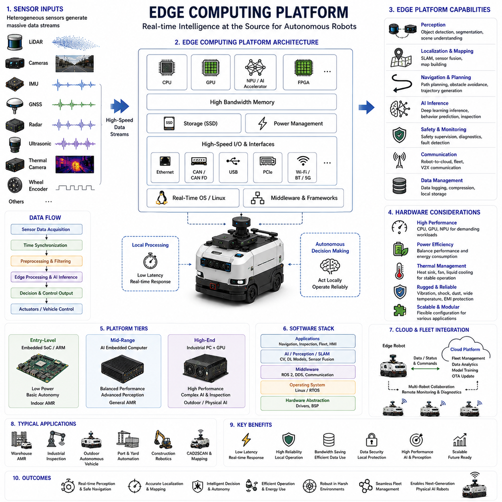
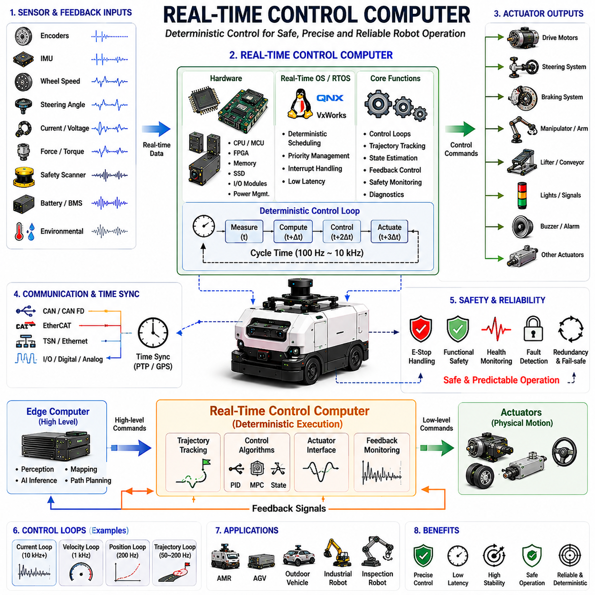
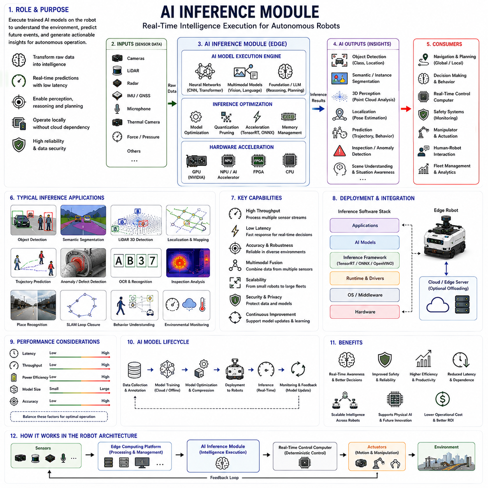
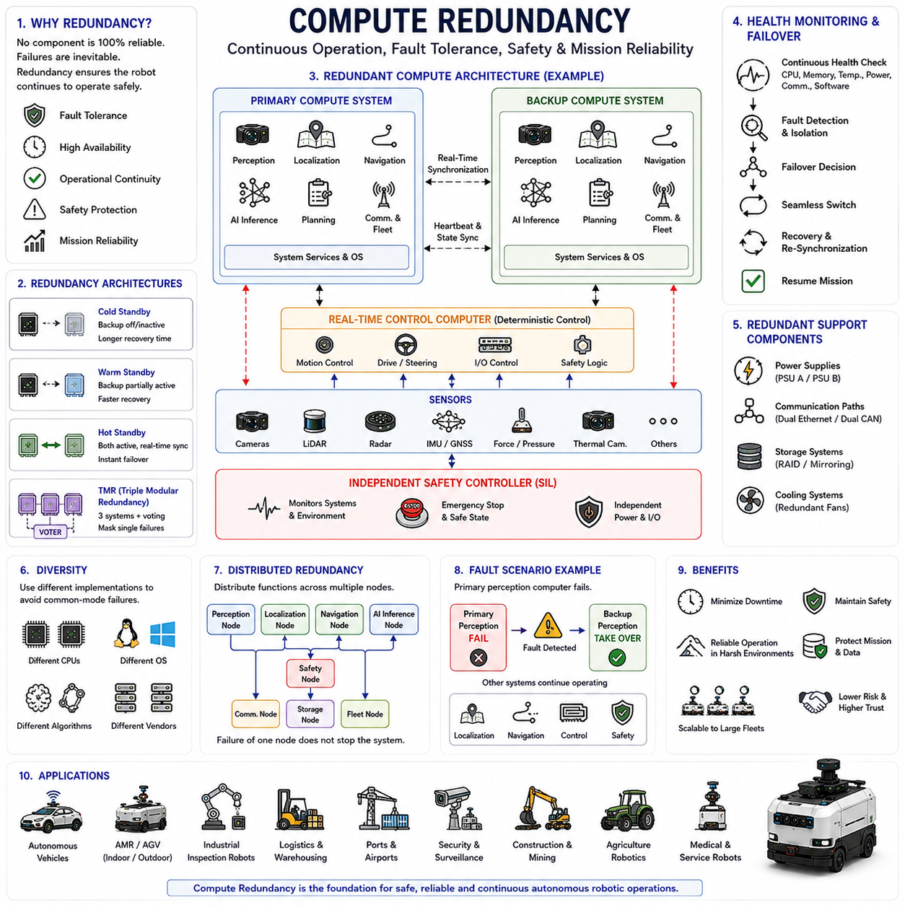
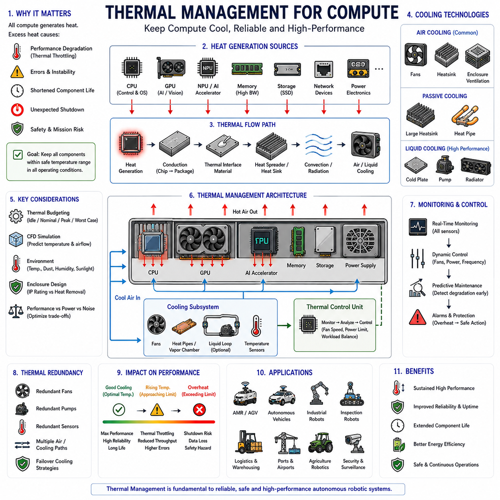

**Volume 13 AMR Electrical Architecture**

# Chapter 10. Compute Architecture

## 10.1 Edge Computing Platform

{width="7.268055555555556in" height="7.268055555555556in"}

# 10_01 엣지 컴퓨팅 플랫폼 (Edge Computing Platform)

엣지 컴퓨팅 플랫폼(Edge Computing Platform)은 현대 자율이동로봇(AMR, Autonomous Mobile Robot)의 컴퓨팅 아키텍처(Compute Architecture)에서 가장 중요한 요소 중 하나이다. 이는 인지(Perception), 위치추정(Localization), 지도작성(Mapping), 내비게이션(Navigation), 경로 계획(Path Planning), 인공지능 추론(AI Inference), 안전 감시(Safety Monitoring), 플릿 통신(Fleet Communication), 자율 의사결정(Autonomous Decision-Making)을 가능하게 하는 계산 자원의 중심이기 때문이다. 물리 AI(Physical AI) 기반의 자율 시스템으로 발전함에 따라 로봇이 생성하는 데이터의 양은 폭발적으로 증가하고 있다. 현대 로봇은 다수의 LiDAR, 카메라 배열(Camera Array), GNSS 수신기, IMU(Inertial Measurement Unit), 레이더(Radar), 초음파 센서(Ultrasonic Sensor), 열화상 카메라(Thermal Camera), 산업용 검사 장비(Inspection Device) 등을 동시에 운용한다. 이러한 센서들은 초당 수 기가바이트(Gigabytes)의 데이터를 생성하며, 엣지 컴퓨팅 플랫폼은 이 데이터를 센서 근처에서 실시간으로 처리함으로써 클라우드 의존성을 줄이고 자율성을 확보한다.

엣지 컴퓨팅 플랫폼의 가장 기본적인 목적은 센서 데이터를 최소 지연(Low Latency)으로 현장에서 처리하는 것이다. 자율주행 로봇은 창고, 공장, 항만, 공항, 건설 현장, 광산, 도시 환경과 같은 동적인 공간에서 실시간으로 반응해야 한다. 장애물이 나타났을 때 데이터를 클라우드로 전송하고 결과를 기다리는 것은 현실적으로 불가능하다. 따라서 엣지 컴퓨팅 플랫폼은 로봇 내부에서 인지 알고리즘, 위치추정, 센서 융합(Sensor Fusion), 경로 계획, AI 추론, 안전 기능을 직접 수행하는 로컬 지능(Local Intelligence)의 중심 역할을 한다.

초기의 로봇 시스템은 중앙 집중형 컴퓨팅(Centralized Computing) 구조를 사용하였다. 센서가 데이터를 수집한 후 중앙 서버로 전송하고 서버가 이를 처리하는 방식이었다. 단순 자동화에는 적합했지만 지연(Latency), 대역폭(Bandwidth), 통신 장애(Communication Failure), 확장성 문제 때문에 고도화된 자율주행에는 한계가 있었다. 엣지 컴퓨팅은 계산 자원을 로봇 내부로 이동시킴으로써 이러한 문제를 해결하였다.

엣지 컴퓨팅 플랫폼은 프로세서(Processor), 메모리(Memory), 저장장치(Storage), 통신 인터페이스(Communication Interface), 전원 관리 회로(Power Management Circuit), 운영체제(Operating System), 미들웨어(Middleware), 하드웨어 가속기(Hardware Accelerator)로 구성된다. 이들 요소가 통합되어 센서 근처에서 실시간 계산을 수행한다.

현대 AMR은 일반적으로 계층형 컴퓨팅 아키텍처(Hierarchical Computing Architecture)를 사용한다. 최하위 계층은 마이크로컨트롤러(Microcontroller)가 모터 제어(Motor Control), 액추에이터 제어(Actuator Control), 전원 관리, 안전 감시를 담당한다. 중간 계층은 엣지 컴퓨터(Edge Computer)가 인지, 위치추정, 내비게이션, 임무 수행(Mission Execution)을 담당한다. 최상위 계층은 클라우드 플랫폼(Cloud Platform)이 플릿 관리(Fleet Management), 데이터 분석(Data Analytics), 장기 저장(Long-Term Storage), AI 모델 학습(Model Training)을 담당한다. 엣지 컴퓨팅 플랫폼은 물리 센서와 지능형 의사결정을 연결하는 핵심 계층이다.

센서 데이터 처리는 엣지 컴퓨팅의 가장 중요한 역할 중 하나이다. 카메라는 초당 수백 MB의 영상을 생성하며, 3D LiDAR는 초당 수백만 개의 포인트를 생성한다. IMU는 고주파수 운동 데이터를 제공하고 GNSS는 위치 정보를 제공한다. 엣지 컴퓨터는 이러한 데이터를 수집하고 동기화(Time Synchronization)하며 필터링(Filter)하고 분석해야 한다.

인지 시스템은 엣지 컴퓨팅 자원을 가장 많이 사용하는 분야 중 하나이다. 컴퓨터 비전(Computer Vision)은 객체 검출(Object Detection), 의미론적 분할(Semantic Segmentation), 인스턴스 분할(Instance Segmentation), 차선 인식(Lane Recognition), 사람 인식(Human Detection), 장면 이해(Scene Understanding)를 수행한다. 이러한 알고리즘은 수백만 개 이상의 파라미터(Parameter)를 가진 딥러닝(Deep Learning) 모델을 사용하며 상당한 계산 능력을 요구한다.

LiDAR 처리 또한 매우 복잡하다. 원시 포인트 클라우드(Raw Point Cloud)는 필터링, 좌표 변환(Transformation), 정합(Registration), 분할(Segmentation), 분석 과정을 거쳐야 한다. 장애물 검출, 자유 공간 추정(Free Space Estimation), 지도 생성, 위치추정은 모두 높은 계산 성능을 요구한다.

위치추정(Localization) 역시 엣지 플랫폼의 핵심 기능이다. SLAM(Simultaneous Localization and Mapping), 비전 SLAM(Visual SLAM), LiDAR SLAM, GNSS 통합, 센서 융합 엔진이 지속적으로 동작하며 로봇의 위치와 자세(Pose)를 추정한다. 위치추정이 정확하지 않으면 모든 자율주행 기능이 실패하게 된다.

센서 융합(Sensor Fusion)은 엣지 컴퓨팅의 또 다른 핵심 작업이다. 카메라, LiDAR, 레이더, IMU, GNSS, 휠 엔코더(Wheel Encoder) 데이터를 통합하여 하나의 환경 모델(Environment Model)을 생성한다. 확장 칼만 필터(EKF, Extended Kalman Filter), 팩터 그래프 최적화(Factor Graph Optimization), 베이지안 추정(Bayesian Estimation) 등이 사용되며 상당한 계산량을 요구한다.

경로 계획(Path Planning)과 내비게이션 역시 엣지 컴퓨터에서 수행된다. 전역 경로 계획기(Global Planner)는 최적 경로를 계산하고, 지역 경로 계획기(Local Planner)는 실시간 장애물 회피와 주행 궤적(Trajectory)을 생성한다. 이러한 계산은 수십 밀리초 수준에서 반복적으로 수행되어야 한다.

인공지능 추론(AI Inference)은 최근 가장 큰 계산 부하를 차지하는 작업 중 하나이다. 객체 인식, 결함 검출(Defect Detection), 행동 예측(Behavior Prediction), 음성 인식(Speech Recognition), 자연어 이해(Natural Language Understanding), 조작 계획(Manipulation Planning), 검사 분석(Inspection Analysis) 등에 딥러닝 모델이 사용된다.

AI 학습(AI Training)과 AI 추론(AI Inference)은 구분된다. AI 학습은 일반적으로 대규모 GPU 클러스터(GPU Cluster)를 갖춘 데이터센터(Data Center)에서 수행된다. 학습된 모델은 이후 엣지 컴퓨터에 배포되어 실시간 추론을 수행한다. 이를 통해 로봇은 클라우드 연결 없이도 고급 AI 기능을 활용할 수 있다.

엣지 컴퓨팅 플랫폼은 성능에 따라 여러 등급으로 구분된다. 엔트리급(Entry-Level)은 ARM 기반 SoC(System on Chip)를 사용하여 기본적인 자율주행 기능을 제공한다. 중급(Mid-Range)은 고성능 AI 프로세서를 사용하여 복잡한 인지와 AI 추론을 수행한다. 고급(High-End)은 산업용 컴퓨터와 GPU를 사용하여 자율주행, 검사, 물리 AI 기능을 수행한다.

힐스로보틱스(Hills Robotics)의 플랫폼 구조를 기준으로 보면 다양한 컴퓨팅 티어(Tier)를 적용할 수 있다. 실내 AMR은 저전력 임베디드 컴퓨팅을 사용하고, 실외 자율주행 플랫폼은 더 강력한 연산 성능을 필요로 한다. 산업용 검사 로봇과 물리 AI 플랫폼은 워크스테이션급(Workstation-Class) GPU 기반 구조가 요구된다.

GPU(Graphics Processing Unit)는 현대 엣지 컴퓨팅의 핵심 부품이다. GPU는 대규모 병렬 처리(Massively Parallel Processing)에 최적화되어 있으며 딥러닝 추론, 컴퓨터 비전, 포인트 클라우드 처리에 매우 효과적이다. NVIDIA GPU는 현재 가장 널리 사용되는 플랫폼 중 하나이다.

GPU를 활용하면 CPU만 사용하는 경우보다 훨씬 높은 처리 성능을 얻을 수 있다. CPU에서 수백 밀리초가 걸리는 연산을 GPU는 훨씬 짧은 시간 안에 처리할 수 있다. 따라서 실시간 자율주행이 가능해진다.

CPU(Central Processing Unit)와 GPU는 경쟁 관계가 아니라 상호 보완 관계이다. CPU는 운영체제, 통신, 제어 로직, 스케줄링을 담당하고 GPU는 딥러닝과 병렬 계산을 담당한다.

메모리 아키텍처(Memory Architecture)도 중요하다. 고해상도 영상, LiDAR 데이터, AI 모델, 지도 데이터(Map Data), 운영 데이터베이스(Database)는 대량의 메모리를 요구한다. 메모리 부족은 심각한 성능 저하를 초래할 수 있다.

저장장치(Storage System)는 센서 로그(Log), 진단 정보(Diagnostic Information), 지도, AI 모델, 검사 기록 등을 저장한다. 대부분의 자율주행 시스템은 SSD(Solid State Drive)를 사용한다. SSD는 진동에 강하고 빠른 읽기·쓰기 성능을 제공한다.

통신 인터페이스는 엣지 컴퓨터를 센서 및 외부 시스템과 연결한다. Ethernet, Gigabit Ethernet, Automotive Ethernet, USB, CAN, CAN FD, RS-485, RS-232, Wi-Fi, Bluetooth, 5G 등이 사용된다. 엣지 컴퓨터는 이러한 인터페이스를 통합 관리하는 중심 허브(Hub) 역할을 수행한다.

시간 동기화(Time Synchronization)도 중요한 기능이다. 센서 융합을 위해서는 모든 센서가 동일한 시간 기준을 사용해야 한다. 이를 위해 PTP(Precision Time Protocol), GNSS 기반 동기화, 하드웨어 트리거(Hardware Trigger)가 사용된다.

전원 관리(Power Management)는 엣지 컴퓨팅 플랫폼 설계에서 매우 중요한 문제이다. 고성능 CPU와 GPU는 수백 와트의 전력을 소비할 수 있다. 따라서 계산 성능과 배터리 사용 시간 사이의 균형을 맞추는 것이 중요하다.

열관리(Thermal Management)도 필수적이다. CPU와 GPU는 많은 열을 발생시킨다. 과열은 성능 저하(Throttling), 신뢰성 저하, 수명 단축을 초래한다. 히트파이프(Heat Pipe), 방열판(Heat Sink), 강제 공랭(Forced-Air Cooling), 액체 냉각(Liquid Cooling) 등이 사용된다.

산업용 환경에서는 견고성(Ruggedness)이 중요하다. 엣지 컴퓨터는 창고, 광산, 건설 현장, 농업 환경, 항만 등에서 사용되므로 진동, 충격, 먼지, 습기, 전자기 간섭(EMI)에 견딜 수 있어야 한다.

산업용 엣지 컴퓨터(Industrial Edge Computer)는 넓은 온도 범위(Wide Temperature Range), 진동 저항(Vibration Resistance), 산업 인증(Industrial Certification)을 제공한다. Neousys와 같은 산업용 컴퓨터 플랫폼이 대표적인 예이다.

사이버 보안(Cybersecurity)도 점점 중요해지고 있다. 엣지 컴퓨터는 민감한 데이터를 처리하고 자율주행을 직접 제어하기 때문에 보안 부팅(Secure Boot), 하드웨어 암호화(Hardware Encryption), 신뢰 실행 환경(Trusted Execution Environment), 침입 탐지(Intrusion Detection)가 필요하다.

기능 안전(Functional Safety) 또한 중요하다. 사람과 함께 작업하는 자율주행 시스템은 일부 하드웨어가 고장나더라도 안전하게 동작해야 한다. 이를 위해 워치독(Watchdog), 이중 프로세서(Redundant Processor), 고장 감지(Fault Monitoring), 안전 소프트웨어 프레임워크(Safety Software Framework)가 사용된다.

플릿 관리(Fleet Management)에서도 엣지 컴퓨팅은 핵심 역할을 한다. 각 로봇은 현장에서 실시간 계산을 수행하고, 중앙 시스템은 운영 상태와 데이터를 관리한다. 이러한 하이브리드 아키텍처(Hybrid Architecture)는 엣지의 실시간성과 클라우드의 확장성을 동시에 활용할 수 있게 한다.

산업용 검사 로봇은 특히 높은 계산 성능을 요구한다. 고해상도 영상, 열화상 분석, 레이저 스캐닝, AI 기반 결함 검출이 동시에 수행되기 때문이다. 실시간 분석을 통해 즉시 이상 상태를 발견할 수 있다.

CAD2SCAN 시스템 역시 강력한 엣지 컴퓨팅 플랫폼을 요구한다. 다수의 동기화된 카메라, 고해상도 LiDAR, 위치추정 장치, 디지털 트윈 생성 소프트웨어가 동시에 동작한다. 엣지 컴퓨팅은 현장에서 품질을 검증하고 데이터 전송량을 줄여준다.

실외 자율주행 플랫폼은 더욱 복잡한 환경에서 동작한다. 장애물 감지, 센서 융합, 위치추정, 경로 계획, 안전 감시, AI 추론이 동시에 수행되어야 하므로 고성능 컴퓨팅 구조가 필수적이다.

미래의 엣지 컴퓨팅 플랫폼은 반도체(Semiconductor), AI, 네트워크(Network), 로봇 기술 발전과 함께 더욱 발전할 것이다. 더 높은 성능과 더 낮은 소비전력을 제공하는 프로세서가 등장할 것이며, NPU(Neural Processing Unit), FPGA(Field Programmable Gate Array), AI 전용 가속기(AI Accelerator)를 포함한 이기종 컴퓨팅(Heterogeneous Computing)이 확대될 것이다.

향후에는 AI가 엣지 컴퓨터 자체를 관리하는 역할도 수행하게 될 것이다. AI 기반 스케줄러(Scheduler)는 계산 자원을 동적으로 분배하고, 전력을 최적화하며, 장애를 예측하고, 임무에 따라 우선순위를 조정할 수 있다.

결국 물리 AI 기반 자율 로봇이 현실 세계를 이해하고 상호작용하기 위해서는 강력한 엣지 컴퓨팅 플랫폼이 필수적이다. 엣지 컴퓨팅 플랫폼은 원시 센서 데이터(Raw Sensor Data)를 의미 있는 지능(Actionable Intelligence)으로 변환하는 계산 엔진이며, 안전한 자율주행, 지능적 의사결정, 적응형 행동(Adaptive Behavior), 효율적 운영(Efficient Operation)을 가능하게 하는 핵심 기술이다. 즉, 엣지 컴퓨팅 플랫폼은 물리 센싱(Physical Sensing)과 자율 지능(Autonomous Intelligence)을 연결하는 다리이며, 차세대 AMR과 물리 AI 로봇 시스템의 심장(Heart of the Robot) 역할을 수행한다.

## 10.2 Real Time Control Computer

{width="7.268055555555556in" height="7.268055555555556in"}

# 10_02 실시간 제어 컴퓨터 (Real-Time Control Computer)

실시간 제어 컴퓨터(Real-Time Control Computer)는 자율이동로봇(AMR, Autonomous Mobile Robot)의 컴퓨팅 아키텍처(Compute Architecture)에서 가장 중요한 하위 시스템 중 하나이다. 이는 물리적 구동(Motion), 액추에이터 제어(Actuator Control), 안전 기능(Safety Function), 센서 수집(Sensor Acquisition), 기계 동작(Machine Behavior)과 같은 시간 민감형(Time-Critical) 작업을 결정론적(Deterministic)으로 수행하는 제어 중심 역할을 담당하기 때문이다. 엣지 컴퓨팅 플랫폼(Edge Computing Platform)이 인지(Perception), 인공지능 추론(AI Inference), 위치추정(Localization), 지도작성(Mapping), 내비게이션(Navigation), 플릿 통신(Fleet Communication)을 담당한다면, 실시간 제어 컴퓨터는 실제 로봇이 움직이고 반응하며 안전하게 동작하도록 만드는 핵심 시스템이다.

실시간 제어 컴퓨터의 가장 중요한 목적은 시스템 부하와 관계없이 제어 명령을 정확한 주기로 실행하는 것이다. 자율주행 로봇은 복잡하고 변화하는 환경에서 동작하며, 단 몇 밀리초(ms)의 지연도 안전성, 경로 정확도, 모터 안정성, 위치추정 성능에 영향을 줄 수 있다. 일반 컴퓨터가 평균 성능(Average Performance)을 최적화하는 것을 목표로 한다면, 실시간 제어 컴퓨터는 예측 가능한 시간 응답(Predictable Timing Behavior)을 보장하는 것을 최우선 목표로 한다.

실시간 제어 컴퓨터는 일반적인 컴퓨터와 근본적으로 다르다. Windows나 일반 Linux는 사용자 응답성과 처리량(Throughput)을 최적화하기 위해 설계되었다. 따라서 작업(Task)의 실행 시점이 CPU 부하에 따라 달라질 수 있다. 하지만 모터 제어와 같은 시스템에서는 이러한 불확실성이 허용되지 않는다. 제어 루프(Control Loop)는 항상 동일한 주기로 실행되어야 한다.

로봇 시스템에서 실시간 제어는 반복적인 제어 루프를 기반으로 한다. 제어 루프는 현재 상태를 측정하고, 제어량을 계산한 후, 액추에이터에 명령을 전달하는 과정을 반복 수행한다. 일반적으로 모터 전류 제어(Current Control)는 10kHz 이상, 속도 제어(Velocity Control)는 약 1kHz, 차량 수준의 경로 제어(Trajectory Control)는 50Hz\~200Hz 정도로 동작한다. 실시간 제어 컴퓨터는 이러한 루프가 항상 일정한 주기로 실행되도록 보장한다.

실시간 제어 아키텍처의 핵심 개념은 결정론성(Determinism)이다. 결정론성이란 특정 입력에 대해 시스템이 예측 가능한 시간 내에 응답하는 능력을 의미한다. 즉, 엔지니어가 어떤 작업이 언제 실행되고 언제 완료될지를 정확히 예측할 수 있어야 한다. 이러한 특성이 자율주행 시스템의 안전성과 신뢰성의 기반이 된다.

실시간 시스템은 일반적으로 하드 실시간(Hard Real-Time), 펌 실시간(Firm Real-Time), 소프트 실시간(Soft Real-Time)으로 구분된다. 하드 실시간은 기한(Deadline)을 한 번이라도 놓치면 시스템 실패로 간주된다. 비상 제동(Emergency Braking), 모터 전류 제어, 기능 안전(Function Safety) 시스템이 대표적이다. 펌 실시간은 가끔의 지연은 허용하지만 성능이 저하된다. 소프트 실시간은 지연이 발생해도 전체 시스템에는 큰 영향을 주지 않는다.

현대 AMR은 세 가지 유형을 모두 사용한다. 안전 기능은 하드 실시간 환경에서 동작하고, 모션 제어(Motion Control)는 펌 실시간 환경에서 동작하며, 사용자 인터페이스(User Interface), 데이터 로깅(Data Logging), 클라우드 통신은 소프트 실시간 환경에서 동작한다.

실시간 제어 컴퓨터는 로봇과 환경의 물리적 상호작용을 담당한다. 모터(Motor), 조향 장치(Steering System), 제동 장치(Brake System), 서스펜션(Suspension), 로봇 팔(Manipulator), 그리퍼(Gripper), 리프터(Lifter), 컨베이어(Conveyor), 안전 장치(Safety Device)는 모두 실시간 제어 명령에 의해 동작한다.

모터 제어는 실시간 제어 컴퓨터의 가장 중요한 역할 중 하나이다. 전기 모터는 속도(Speed), 토크(Torque), 위치(Position)를 정밀하게 제어하기 위해 지속적인 피드백 제어(Feedback Control)가 필요하다. 엔코더(Encoder), 리졸버(Resolver), 전류 센서(Current Sensor), 전압 센서(Voltage Sensor)의 데이터를 실시간으로 수집하고 제어 명령을 생성한다.

현대 AMR은 다수의 모터를 동시에 제어한다. 4WD(Four Wheel Drive), 6WD(Six Wheel Drive), 전방향 이동 플랫폼(Omnidirectional Platform), 차동 구동(Differential Drive), 다축 차량(Multi-Axle Vehicle)은 모두 다수의 모터를 정밀하게 동기화해야 한다. 실시간 제어 컴퓨터는 이를 통해 부드럽고 안정적인 차량 거동(Vehicle Dynamics)을 구현한다.

조향 제어(Steering Control)도 결정론적 실행이 필요하다. 실외 AMR은 전자식 조향(Electronic Steering)을 사용하며, 내비게이션 명령과 차량 상태에 따라 지속적으로 조향각(Steering Angle)을 조정한다. 작은 시간 오차도 차량의 궤적 오차(Trajectory Error)를 증가시킬 수 있다.

제동 시스템은 더욱 높은 수준의 실시간성을 요구한다. 비상 정지(Emergency Stop) 기능은 위험 상황이 발생했을 때 즉시 동작해야 한다. 따라서 기능 안전 아키텍처는 종종 별도의 실시간 프로세서(Real-Time Processor)를 이용하여 독립적인 제동 경로를 구성한다.

센서 수집(Sensor Acquisition)도 중요한 역할이다. 고수준 인지 처리는 엣지 컴퓨터에서 수행되지만, 엔코더, IMU, 힘 센서(Force Sensor), 압력 센서(Pressure Sensor), 배터리 모니터(Battery Monitor), 안전 스캐너(Safety Scanner)의 데이터 수집은 실시간 환경에서 수행되는 경우가 많다.

시간 동기화(Time Synchronization)는 실시간 제어 시스템과 밀접하게 연결되어 있다. 센서와 액추에이터가 동일한 시간 기준(Common Time Reference)을 사용해야만 정확한 제어가 가능하다. 이를 위해 PTP(Precision Time Protocol), 하드웨어 트리거(Hardware Trigger), 결정론적 이더넷(Deterministic Ethernet) 기술이 사용된다.

실시간 제어 컴퓨터와 엣지 컴퓨팅 플랫폼의 관계는 상호 보완적이다. 엣지 컴퓨터는 AI와 인지 기능을 수행하고, 실시간 제어 컴퓨터는 물리적 제어를 담당한다. 이러한 분리는 AI 연산 부하가 증가하더라도 핵심 제어 기능이 영향을 받지 않도록 보장한다.

예를 들어 실외 자율주행 차량은 GPU 기반 AI 시스템을 통해 장애물을 인식하고 경로를 생성한다. 이후 생성된 경로는 실시간 제어 컴퓨터로 전달되며, 실시간 제어 컴퓨터는 이를 실제 조향, 가속, 제동 명령으로 변환한다. AI 연산량이 순간적으로 증가하더라도 차량 안정성은 유지된다.

현대 로봇은 분산 제어 시스템(Distributed Control System)을 사용하는 경우가 많다. 추진 제어(Propulsion Control), 조향 제어, 제동 제어, 배터리 관리(Battery Management), 매니퓰레이터 제어, 안전 시스템 제어를 각각 별도의 제어기(Controller)가 담당하며, 통신 네트워크를 통해 상호 연결된다.

CAN(Controller Area Network), CAN FD, EtherCAT, Ethernet/IP, PROFINET, TSN(Time Sensitive Networking)은 대표적인 실시간 제어 통신 프로토콜이다. 이들은 예측 가능한 지연 시간을 제공한다.

특히 EtherCAT은 산업용 로봇에서 매우 널리 사용된다. 마이크로초(Microsecond) 수준의 동기화 정확도를 제공하며, 서보 시스템(Servo System)과 매니퓰레이터 제어에 적합하다.

운영체제(Operating System)는 실시간 성능에 직접적인 영향을 미친다. RTOS(Real-Time Operating System)는 결정론적 스케줄링을 위해 설계되었다. 일반 운영체제와 달리 실행 시간 보장(Timing Guarantee)을 제공한다.

대표적인 RTOS로는 FreeRTOS, VxWorks, QNX, Zephyr, ThreadX, RTEMS 등이 있다. Linux 기반 시스템에서는 PREEMPT_RT 패치를 적용하여 실시간 기능을 구현하기도 한다.

실시간 제어 컴퓨터의 작업 스케줄링(Task Scheduling)은 일반 컴퓨터와 다르다. 중요도가 높은 작업은 우선순위(Priority)가 높게 설정되며, 필요 시 낮은 우선순위 작업을 중단시키고 실행된다.

인터럽트 관리(Interrupt Management)도 핵심 요소이다. 엔코더 신호, 비상 정지 신호, 센서 트리거, 통신 이벤트, 하드웨어 오류는 모두 즉각적인 처리가 필요하다. 실시간 제어 시스템은 이러한 이벤트를 정해진 시간 안에 처리할 수 있어야 한다.

안전 시스템은 종종 별도의 실시간 프로세서를 사용한다. 기능 안전 요구사항에 따라 독립적인 모니터링(Monitoring)이 필요하기 때문이다. 안전 제어기는 비상 정지 회로, 장애물 감지 시스템, 액추에이터 상태, 통신 상태를 지속적으로 감시한다.

배터리 관리 시스템(BMS, Battery Management System)도 실시간 제어 컴퓨터와 밀접하게 연계된다. 전압, 전류, 셀 온도(Cell Temperature), 충전 상태(State of Charge)를 실시간으로 모니터링하고 보호 기능을 수행한다.

산업용 검사 로봇은 매우 정밀한 제어를 요구한다. 카메라 배열, LiDAR, 레이저 스캐너, 검사 장비는 정확한 경로를 따라 이동해야 한다. 실시간 제어는 반복 가능한 측정(Repeatable Measurement)과 높은 검사 품질(Inspection Quality)을 보장한다.

CAD2SCAN 시스템은 실시간 제어의 중요성을 잘 보여주는 사례이다. 차량의 이동, 센서 수집, 위치추정, 스캐닝 장비가 모두 정밀하게 동기화되어야 고품질 디지털 트윈을 생성할 수 있다.

매니퓰레이터 시스템은 더욱 복잡하다. 6축 이상의 로봇 팔은 각 관절(Joint)의 위치, 속도, 토크를 지속적으로 제어해야 한다. 실시간 제어 컴퓨터는 초당 수백\~수천 번의 계산을 수행하여 부드럽고 안전한 움직임을 구현한다.

궤적 추종(Trajectory Tracking)은 또 다른 중요한 기능이다. 내비게이션 시스템이 생성한 경로를 실제 차량이 정확하게 따라가도록 만드는 역할을 수행한다. 노면 상태, 미끄러짐(Slip), 적재물 변화(Payload Variation), 외란(Disturbance)을 실시간으로 보상한다.

PID 제어(PID Control), 모델 예측 제어(MPC, Model Predictive Control), 적응 제어(Adaptive Control), 상태공간 제어(State-Space Control)는 대표적인 실시간 제어 알고리즘이다.

실시간 제어 컴퓨터는 산업 환경의 진동(Vibration), 충격(Shock), 먼지(Dust), 습기(Moisture), EMI(Electromagnetic Interference), 극한 온도(Extreme Temperature)에서도 안정적으로 동작해야 한다.

하드웨어 플랫폼은 마이크로컨트롤러(Microcontroller), ARM 프로세서, STM32, NXP 프로세서, TI 제어 프로세서, 산업용 PC, FPGA(Field Programmable Gate Array) 등 다양하다.

FPGA는 매우 낮은 지연 시간(Low Latency)과 높은 결정론성을 제공한다. 따라서 모터 제어, 센서 인터페이스, 통신 게이트웨이, 기능 안전 시스템에서 자주 사용된다.

사이버 보안(Cybersecurity)도 중요성이 증가하고 있다. 실시간 제어기는 실제 차량 움직임을 직접 제어하기 때문이다. 인증(Authentication), 암호화(Encryption), 보안 부팅(Secure Boot), 신뢰 하드웨어(Trusted Hardware)가 필수적으로 적용된다.

현대 실시간 제어 컴퓨터는 진단(Diagnostics)과 상태 모니터링(Health Monitoring) 기능도 제공한다. CPU 부하, 메모리 사용량, 통신 지연, 센서 상태, 액추에이터 상태를 지속적으로 감시한다. 이를 통해 예지보전(Predictive Maintenance)이 가능해진다.

미래의 실시간 제어 컴퓨터는 인공지능과 더욱 밀접하게 결합될 것이다. AI 기반 제어(AI-Assisted Control), 자동 파라미터 튜닝(Automatic Parameter Tuning), 고장 예측(Fault Prediction), 지능형 모션 최적화(Intelligent Motion Optimization)가 적용될 것으로 예상된다.

AMR이 공장, 창고, 항만, 공항, 건설 현장, 농업 환경, 스마트시티 등에서 동작하는 물리 AI 플랫폼으로 발전할수록 결정론적 제어의 중요성은 더욱 커질 것이다. 아무리 뛰어난 AI와 인지 기능이 있더라도 실제 물리 세계에서 정확하게 실행되지 않으면 의미가 없다.

결국 엣지 컴퓨팅 플랫폼이 인지, 추론, 판단을 담당한다면, 실시간 제어 컴퓨터는 실행(Execution), 액추에이터 제어, 안전 보장, 모션 제어를 담당한다. 두 시스템은 함께 동작하여 안전하고 신뢰성 높은 자율주행 로봇을 구현한다. 실시간 제어 컴퓨터는 상위 AI가 생성한 명령을 실제 물리적 행동으로 변환하는 핵심 장치이며, 미래 자율주행 로봇의 신뢰성과 안전성을 결정하는 가장 중요한 기반 기술 중 하나이다.

## 10.3 AI Inference Module

{width="7.268055555555556in" height="7.268055555555556in"}

# 10_03 AI 추론 모듈 (AI Inference Module)

AI 추론 모듈(AI Inference Module)은 현대 자율이동로봇(AMR, Autonomous Mobile Robot)의 컴퓨팅 아키텍처(Compute Architecture)에서 가장 중요한 구성 요소 중 하나이다. 이 모듈은 학습된 인공지능 모델(Artificial Intelligence Model)을 실제 운영 환경에서 실행하여 실시간 의사결정 능력으로 변환하는 역할을 수행한다. AI 학습(AI Training)은 일반적으로 클라우드(Cloud)나 대규모 GPU 클러스터(GPU Cluster)에서 수행되지만, 추론(Inference)은 로봇 내부에서 실행되며 분류(Classification), 검출(Detection), 예측(Prediction), 추천(Recommendation), 제어 판단(Control Guidance)을 지속적으로 생성한다. 로봇이 단순 자동화 장비를 넘어 물리 AI(Physical AI) 시스템으로 발전할수록 AI 추론 모듈은 인지(Perception), 추론(Reasoning), 계획(Planning), 행동(Action)을 연결하는 핵심 계층이 된다.

AI 추론 모듈의 가장 중요한 목적은 학습된 머신러닝(Machine Learning) 및 딥러닝(Deep Learning) 모델을 로봇의 제약된 하드웨어 환경에서 효율적으로 실행하는 것이다. 자율 시스템은 실시간으로 대량의 센서 데이터를 처리하면서도 낮은 지연 시간(Low Latency), 예측 가능한 응답 시간(Predictable Response Time), 높은 신뢰성(Reliability)을 유지해야 한다. 카메라(Camera), LiDAR, 레이더(Radar), GNSS, IMU(Inertial Measurement Unit), 마이크로폰(Microphone), 힘 센서(Force Sensor), 열화상 카메라(Thermal Camera), 환경 센서(Environmental Sensor)는 지속적으로 데이터를 생성하며, AI 추론 모듈은 이러한 원시 데이터(Raw Data)를 의미 있는 정보(Meaningful Information)로 변환한다.

인공지능은 일반적으로 학습(Training)과 추론(Inference)의 두 단계로 구성된다. 학습 단계에서는 신경망(Neural Network)이 대규모 데이터셋(Data Set)으로부터 패턴(Pattern)을 학습한다. 이 과정은 막대한 GPU 자원과 저장장치(Storage)를 요구한다. 반면 추론은 학습된 모델을 새로운 데이터에 적용하는 과정이다. 학습보다 계산량은 적지만 실시간성과 신뢰성이 매우 중요하다.

로봇 관점에서 추론은 지능(Intelligence)이 실제로 작동하는 단계이다. 객체 검출(Object Detection) 모델은 장애물을 식별하고, 의미론적 분할(Semantic Segmentation) 모델은 주행 가능 영역을 구분하며, 위치추정(Localization) 모델은 현재 위치를 계산하고, 예측(Prediction) 모델은 보행자(Pedestrian)의 움직임을 예측한다. 결함 검출(Defect Detection) 모델은 설비 이상을 발견한다. 이러한 결과는 모두 로봇의 행동 결정에 직접적으로 영향을 미친다.

AI 추론 모듈은 일반적으로 엣지 컴퓨팅 플랫폼(Edge Computing Platform) 내부에서 실행된다. 로컬(Local)에서 추론을 수행하면 여러 장점이 있다. 클라우드 연결 없이도 의사결정이 가능하며, 지연 시간이 최소화되고, 신뢰성이 향상되며, 민감한 데이터가 외부로 전송되지 않는다. 이러한 특성은 산업용 로봇, 군사용 로봇, 보안 로봇, 의료 로봇, 농업 로봇, 광산 로봇, 물류 로봇에서 매우 중요하다.

인지 시스템은 AI 추론의 가장 큰 응용 분야 중 하나이다. 현대 로봇 인지 시스템은 딥 뉴럴 네트워크(Deep Neural Network)에 크게 의존한다. CNN(Convolutional Neural Network), 비전 트랜스포머(Vision Transformer), 멀티모달 모델(Multimodal Model), 파운데이션 모델(Foundation Model), 대규모 언어 모델(LLM, Large Language Model)이 환경 이해(Environment Understanding)에 사용되고 있다. AI 추론 모듈은 센서 데이터가 입력될 때마다 이러한 모델을 실행한다.

객체 검출은 가장 일반적인 추론 작업 중 하나이다. 자율주행 로봇은 사람, 차량, 장비, 시설물, 동물, 장애물, 위험 요소를 식별해야 한다. YOLO, Faster R-CNN, RetinaNet, DETR와 같은 모델은 객체 종류(Class), 위치(Location), 신뢰도(Confidence Score), 추적 정보(Tracking Information)를 출력한다.

의미론적 분할은 환경을 더욱 깊이 이해하도록 돕는다. 단순히 객체를 찾는 것이 아니라 영상의 모든 픽셀(Pixel)에 의미를 부여한다. 바닥(Floor), 벽(Wall), 도로(Road), 보도(Sidewalk), 식생(Vegetation), 건물(Building), 기계(Machinery), 작업자(Worker), 위험 구역(Hazard Area)을 구분할 수 있다. 이러한 정보는 내비게이션과 안전성을 크게 향상시킨다.

인스턴스 분할(Instance Segmentation)은 동일한 종류의 객체를 개별적으로 식별한다. 예를 들어 창고 내 여러 대의 지게차(Forklift)를 각각 구분하고 추적할 수 있다. 이는 보다 고도화된 상황 인식(Situational Awareness)을 가능하게 한다.

LiDAR 기반 AI 추론 또한 매우 중요하다. 3차원 포인트 클라우드(Point Cloud)는 풍부한 기하학적 정보(Geometric Information)를 제공하지만 처리 난이도가 높다. PointNet, PointPillars, PV-RCNN, CenterPoint와 같은 모델은 포인트 클라우드를 분석하여 객체 검출, 지형 분류(Terrain Classification), 자유 공간 추정(Free Space Estimation), 구조물 인식(Structural Feature Detection)을 수행한다.

멀티센서 융합(Multi-Sensor Fusion)은 점점 AI 추론에 의존하고 있다. 기존의 센서 융합은 칼만 필터(Kalman Filter)와 확률 기반 알고리즘을 사용했지만, 최근에는 딥러닝을 활용하여 센서 간의 복잡한 관계를 학습한다. AI 기반 융합은 정확도와 강건성(Robustness)을 향상시킨다.

위치추정 시스템도 AI 추론의 도움을 받는다. 비전 위치추정(Visual Localization), 장소 인식(Place Recognition), 지도 정합(Map Matching), 루프 클로저 검출(Loop Closure Detection), GNSS 불가 환경(GPS-Denied Environment) 내비게이션에 신경망이 활용된다.

내비게이션 시스템은 경로 계획(Route Planning)과 행동 결정(Behavior Decision)에 AI 추론을 사용한다. 기존 시스템은 규칙 기반(Rule-Based) 접근법을 사용했지만, 최근에는 강화학습(Reinforcement Learning), 모방학습(Imitation Learning), 행동 복제(Behavior Cloning)를 이용하여 더 지능적인 주행이 가능해지고 있다.

예측 지능(Predictive Intelligence)은 또 다른 중요한 기능이다. 자율주행 로봇은 단순히 현재 상황을 이해하는 것에 그치지 않고 미래를 예측해야 한다. 보행자 이동 경로, 차량의 움직임, 장비의 행동, 환경 변화 등을 예측함으로써 안전성과 효율성을 향상시킨다.

산업용 검사 로봇은 AI 추론에 크게 의존한다. 공장과 발전소에는 정기 점검이 필요한 설비가 많다. AI는 영상(Image), 열 데이터(Thermal Data), 음향 데이터(Acoustic Data), 진동 데이터(Vibration Data)를 분석하여 균열(Crack), 부식(Corrosion), 누수(Leak), 과열(Overheating), 마모(Wear), 오염(Contamination), 구조적 결함(Structural Defect)을 자동 검출할 수 있다.

CAD2SCAN 시스템은 특히 높은 수준의 AI 추론을 요구한다. 고해상도 카메라와 LiDAR가 생성하는 방대한 데이터를 분석하여 객체 분류(Object Classification), 결함 인식(Defect Recognition), 기하학 검증(Geometric Validation), 품질 평가(Quality Assessment), 자동 보고서 생성(Automated Reporting)을 수행한다. 이를 통해 수작업 분석 시간을 크게 줄일 수 있다.

물리 AI 시스템은 AI 추론을 단순한 인지 수준에서 추론과 행동으로 확장한다. 최신 AI 구조는 인지, 기억(Memory), 계획(Planning), 의사결정(Decision-Making)을 통합된 프레임워크(Framework) 안에서 수행한다.

대규모 언어 모델(LLM)은 로봇 추론 구조에 점점 더 많이 적용되고 있다. 원래는 텍스트(Text) 처리를 위해 개발되었지만 현재는 작업 계획(Task Planning), 명령 이해(Instruction Understanding), 절차 추론(Procedural Reasoning), 임무 수행(Mission Execution), 인간-로봇 상호작용(Human-Robot Interaction)에 활용되고 있다.

비전-언어 모델(VLM, Vision-Language Model)은 영상과 언어를 동시에 이해할 수 있다. 이를 통해 로봇은 자연어 명령(Natural Language Instruction)을 이해하면서 주변 환경도 동시에 분석할 수 있다. 이는 더욱 직관적인 인간-기계 인터페이스(Human-Machine Interface)를 가능하게 한다.

AI 추론 성능은 하드웨어 가속(Hardware Acceleration)에 크게 의존한다. CPU(Central Processing Unit)는 범용 계산에는 적합하지만 대규모 딥러닝 연산에는 한계가 있다. GPU(Graphics Processing Unit)는 병렬 처리 능력이 뛰어나므로 현재 가장 널리 사용되는 AI 추론 플랫폼이다.

최신 GPU는 객체 검출, 분할, 위치추정, 지도작성, 계획, 멀티모달 추론을 동시에 실시간으로 수행할 수 있다. 그러나 모델이 점점 복잡해짐에 따라 계산 요구사항도 지속적으로 증가하고 있다.

전용 AI 가속기(AI Accelerator)는 효율성을 더욱 향상시킨다. NPU(Neural Processing Unit), TPU(Tensor Processing Unit), FPGA(Field Programmable Gate Array), 전용 추론 칩(Inference Chip)은 전력 소비를 줄이면서도 높은 성능을 제공한다.

하드웨어 선택은 응용 분야에 따라 달라진다. 소형 실내 AMR은 임베디드 AI 프로세서(Embedded AI Processor)를 사용할 수 있지만, 실외 자율주행 차량은 훨씬 높은 계산 성능을 요구한다. 검사 로봇과 물리 AI 플랫폼은 산업용 GPU 기반 시스템을 사용하는 경우가 많다.

추론 지연(Inference Latency)은 매우 중요한 성능 지표이다. 센서 데이터 입력부터 AI 결과 출력까지의 시간이 짧아야 한다. 지연이 증가하면 안전성과 운영 효율성이 저하된다.

처리량(Throughput) 또한 중요하다. 로봇은 여러 센서 스트림(Stream)을 동시에 처리해야 하므로 충분한 처리량을 유지해야 한다. 처리량이 높을수록 더욱 풍부한 인지 기능을 구현할 수 있다.

모델 최적화(Model Optimization)는 실제 적용에서 매우 중요하다. 클라우드에서 학습된 모델은 너무 크기 때문에 그대로 배포하기 어렵다. 가지치기(Pruning), 양자화(Quantization), 지식 증류(Knowledge Distillation), 그래프 최적화(Graph Optimization)를 통해 계산량을 줄인다.

TensorRT, ONNX Runtime, OpenVINO, TVM, TensorFlow Lite, PyTorch Deployment Framework는 대표적인 추론 최적화 프레임워크이다. 이러한 도구는 성능을 향상시키고 다양한 하드웨어에 대한 배포를 단순화한다.

메모리 관리(Memory Management)는 매우 중요한 설계 요소이다. 최신 AI 모델은 수십억 개의 파라미터(Parameter)를 포함할 수 있으며 높은 메모리 대역폭(Memory Bandwidth)을 요구한다. 효율적인 메모리 할당과 캐시(Cache) 관리가 필요하다.

열관리(Thermal Management)도 중요하다. AI 추론은 많은 열을 발생시키며, 과열은 성능 저하(Thermal Throttling)와 신뢰성 저하를 초래한다. 따라서 적절한 냉각 시스템(Cooling System)이 필요하다.

전력 소비(Power Consumption)는 배터리 기반 로봇에서 매우 중요하다. AI 추론은 전체 전력 사용량의 상당 부분을 차지한다. 따라서 성능과 운용 시간(Operational Endurance) 사이의 균형이 필요하다.

사이버 보안(Cybersecurity)도 중요한 요소이다. AI 모델은 기업의 핵심 지식재산(IP, Intellectual Property)이며 로봇의 의사결정에 직접 영향을 미친다. 암호화된 모델 저장(Model Encryption), 인증된 업데이트(Authenticated Update), 신뢰 실행 환경(Trusted Execution Environment)이 필요하다.

안전(Safety)은 항상 최우선 고려사항이다. AI 모델은 확률 기반(Probabilistic) 시스템이기 때문에 잘못된 결과를 출력할 수 있다. 따라서 AI 추론 모듈은 결정론적 안전 시스템(Deterministic Safety System)과 함께 사용된다. 이중 센서(Redundant Sensor), 신뢰도 평가(Confidence Estimation), 규칙 기반 검증(Rule-Based Validation), 안전 모니터(Safety Monitor)가 함께 적용된다.

플릿 관리 시스템(Fleet Management System)은 분산 AI 추론(Distributed AI Inference)을 활용하기 시작하고 있다. 일부 추론은 로봇 내부에서 수행되고, 일부는 엣지 서버(Edge Server)나 클라우드에서 수행된다. 이러한 하이브리드 구조(Hybrid Architecture)는 자원 활용도를 최적화한다.

미래의 AI 추론 모듈은 더욱 강력해질 것이다. 멀티모달 파운데이션 모델(Multimodal Foundation Model), 월드 모델(World Model), 체화 지능(Embodied Intelligence), 로봇 파운데이션 모델(Robot Foundation Model)은 로봇의 능력을 획기적으로 향상시킬 것이다.

물리 AI 시대로의 전환은 이러한 발전을 더욱 가속화할 것이다. 미래의 로봇은 환경을 이해하고, 결과를 예측하며, 지속적으로 학습하고, 사람과 협력하며, 복잡한 임무를 자율적으로 수행해야 한다. AI 추론 모듈은 이러한 능력을 실제로 실행하는 엔진이 된다.

전체 로봇 컴퓨팅 아키텍처에서 AI 추론 모듈은 지능 실행 계층(Intelligence Execution Layer)에 해당한다. 센서는 데이터를 제공하고, 엣지 컴퓨팅 플랫폼은 계산 자원을 제공하며, 실시간 제어 컴퓨터(Real-Time Control Computer)는 실제 행동을 실행한다. AI 추론 모듈은 이들 사이에서 데이터를 의미 있는 지능으로 변환한다.

AMR이 공장, 창고, 공항, 항만, 병원, 농업 현장, 건설 현장, 스마트시티, 산업 시설에서 동작하는 물리 AI 플랫폼으로 발전함에 따라 AI 추론 모듈은 로봇 소프트웨어 스택(Robot Software Stack)에서 가장 핵심적인 기술 중 하나로 남게 될 것이다. AI 추론 모듈은 학습된 지능을 실제 운영 능력으로 변환하는 엔진이며, 로봇이 복잡한 환경을 이해하고, 올바른 결정을 내리며, 안전하고 효율적으로 자율 작업을 수행할 수 있도록 만드는 핵심 기술이다.

## 10.4 Compute Redundancy

{width="7.268055555555556in" height="7.268055555555556in"}

# 10_04 컴퓨팅 이중화 (Compute Redundancy)

컴퓨팅 이중화(Compute Redundancy)는 현대 자율주행 로봇 시스템의 핵심 설계 원칙 중 하나로, 개별 컴퓨팅 구성 요소에 장애가 발생하더라도 시스템이 지속적으로 동작하고, 안전성을 유지하며, 임무를 수행할 수 있도록 보장하는 기술이다. 자율이동로봇(AMR, Autonomous Mobile Robot), 자율주행 차량(Autonomous Vehicle), 산업용 검사 로봇(Industrial Inspection Robot), 물류 시스템(Logistics System), 보안 로봇(Security Robot), 그리고 미래의 물리 AI(Physical AI) 플랫폼은 점점 더 복잡한 컴퓨팅 아키텍처에 의존하고 있다. 이러한 환경에서 인지 컴퓨터(Perception Computer), 내비게이션 프로세서(Navigation Processor), AI 가속기(AI Accelerator), 통신 제어기(Communication Controller), 안전 프로세서(Safety Processor) 중 하나라도 고장 나면 임무 실패, 운영 효율 저하, 심지어 안전사고로 이어질 수 있다. 컴퓨팅 이중화는 이러한 위험을 최소화하고 장애 상황에서도 시스템이 안전하게 동작할 수 있도록 만드는 기반 기술이다.

이중화(Redundancy) 개념은 항공우주(Aerospace), 철도(Railway), 산업 자동화(Industrial Automation), 원자력 발전(Nuclear Power), 의료 시스템(Medical System), 군사 시스템(Military Platform)과 같은 안전 필수(Safety-Critical) 산업에서 발전해 왔다. 이러한 산업에서는 어떠한 부품도 100% 신뢰성을 가질 수 없다는 사실을 전제로 설계한다. 프로세서(Processor), 메모리(Memory), 저장장치(Storage), 통신 인터페이스(Communication Interface), 전원공급장치(Power Supply), 운영체제(Operating System), 소프트웨어(Software)는 모두 일정 확률로 고장 날 수 있다. 따라서 고장을 없애는 것이 아니라 고장이 발생하더라도 시스템이 정상 동작하도록 설계하는 것이 이중화의 핵심 철학이다.

로봇 시스템에서 컴퓨팅 이중화는 핵심 기능이 유지될 수 있도록 계산 자원을 중복 배치하거나 분산 배치하는 것을 의미한다. 이는 추가 프로세서, 백업 컴퓨터, 분산 컴퓨팅 노드(Distributed Computing Node), 이중 통신 경로(Redundant Communication Path), 이중 전원공급장치, 복제된 소프트웨어 서비스(Replicated Software Service), 병렬 처리 구조(Parallel Processing Architecture) 등을 통해 구현된다. 목표는 단순히 고장을 방지하는 것이 아니라 고장 시에도 성능 저하를 최소화하면서 안전하게 운영하는 것이다.

현대 자율주행 로봇은 다양한 컴퓨팅 서브시스템에 의존한다. 인지 엔진(Perception Engine)은 카메라와 LiDAR 데이터를 처리하고, 위치추정 시스템(Localization System)은 현재 위치와 자세(Pose)를 계산한다. 내비게이션 플래너(Navigation Planner)는 경로를 생성하고, AI 추론 엔진(AI Inference Engine)은 신경망(Neural Network)을 실행한다. 플릿 통신 시스템(Fleet Communication System)은 외부 인프라와 정보를 교환하며, 안전 제어기(Safety Controller)는 위험을 감시하고 보호 기능을 수행한다. 이러한 구성 요소 중 하나라도 중단되면 전체 시스템에 영향을 줄 수 있다.

이중화가 없는 경우 단일 장애점(Single Point of Failure)이 전체 시스템을 정지시킬 수 있다. 예를 들어 주 위치추정 컴퓨터가 고장 나면 로봇은 자신의 위치를 알 수 없게 된다. AI 인지 시스템이 중단되면 장애물 인식이 불가능해질 수 있다. 통신 제어기가 고장 나면 플릿 관리 시스템과의 연결이 끊길 수 있다. 컴퓨팅 이중화는 이러한 문제를 예방하기 위해 대체 컴퓨팅 경로를 제공한다.

가장 단순한 형태는 콜드 스탠바이 아키텍처(Cold Standby Architecture)이다. 백업 컴퓨터는 평상시에는 꺼져 있거나 비활성 상태로 유지된다. 주 시스템이 고장 나면 백업 시스템이 활성화되어 기능을 이어받는다. 이 방식은 전력 소비가 적고 장비 수명을 연장할 수 있지만 복구 시간이 길다는 단점이 있다.

웜 스탠바이 아키텍처(Warm Standby Architecture)는 백업 시스템이 부분적으로 활성화된 상태를 유지한다. 주요 소프트웨어가 메모리에 로드되어 있으며 주 시스템 상태를 지속적으로 동기화한다. 따라서 장애 발생 시 훨씬 빠르게 전환할 수 있다.

핫 스탠바이 아키텍처(Hot Standby Architecture)는 가장 높은 수준의 가용성(Availability)을 제공한다. 주 시스템과 백업 시스템이 동시에 동작하며, 백업 시스템은 항상 주 시스템 상태를 실시간으로 복제한다. 장애 발생 시 수 밀리초 또는 수 마이크로초 수준으로 전환이 가능하다.

듀얼 컴퓨터 아키텍처(Dual-Computer Architecture)는 로봇에서 가장 많이 사용되는 이중화 방식 중 하나이다. 두 대의 컴퓨터가 동일하거나 상호 보완적인 기능을 수행한다. 주 컴퓨터는 실제 작업을 수행하고, 보조 컴퓨터는 시스템 상태를 감시하면서 동기화 상태를 유지한다. 장애가 발생하면 자동으로 제어권을 넘겨받는다.

더 높은 신뢰성을 위해 TMR(Triple Modular Redundancy, 삼중 모듈 이중화)이 사용될 수 있다. 세 개의 독립적인 컴퓨터가 동일한 계산을 수행하고 결과를 비교한다. 다수결 투표(Voting Mechanism)를 통해 올바른 결과를 선택한다. 하나의 컴퓨터가 오류를 발생시키더라도 나머지 두 개가 이를 무시할 수 있다. TMR은 항공우주 및 안전 필수 산업에서 널리 사용되며, 미래 자율주행 로봇에서도 중요성이 증가하고 있다.

분산 이중화 아키텍처(Distributed Redundancy Architecture)는 또 다른 접근 방식이다. 하나의 중앙 컴퓨터에 의존하지 않고 기능을 여러 노드(Node)에 분산한다. 인지, 위치추정, 내비게이션, AI 추론, 플릿 통신, 안전 모니터링이 각각 독립적인 컴퓨팅 자원에서 실행된다. 특정 노드가 고장 나더라도 전체 시스템이 정지하지 않는다.

이러한 구조는 ROS2(ROS 2), DDS(Data Distribution Service), 마이크로서비스 아키텍처(Microservice Architecture)와 잘 결합된다. 각 서비스는 여러 노드에 복제될 수 있으며, 특정 노드가 고장 나면 다른 노드가 기능을 이어받는다.

컴퓨팅 이중화는 프로세서뿐만 아니라 메모리에도 적용된다. 메모리는 비트 오류(Bit Error), 전기적 간섭(Electrical Disturbance), 방사선(Radiation), 노화(Aging) 등에 의해 오류가 발생할 수 있다. ECC 메모리(ECC Memory, Error Correcting Code Memory)는 이러한 오류를 자동으로 검출하고 수정하여 시스템 안정성을 높인다.

저장장치(Storage)도 중요한 이중화 대상이다. 자율주행 로봇은 지도(Map), AI 모델(Model), 미션 로그(Mission Log), 센서 데이터(Sensor Data), 진단 기록(Diagnostic Record)을 저장한다. 저장장치 고장은 데이터 손실과 운영 중단을 초래할 수 있다. RAID(Redundant Array of Independent Disks), 미러링(Mirroring), 분산 저장 시스템(Distributed Storage System)을 통해 신뢰성을 향상시킬 수 있다.

통신 이중화(Communication Redundancy)는 현대 로봇에서 매우 중요하다. 로봇 내부 컴퓨터, 센서, 액추에이터, 클라우드, 플릿 관리 시스템 간의 통신이 중단되면 운영이 불가능해질 수 있다. 이중 이더넷(Dual Ethernet), 이중 CAN 버스(Dual CAN Bus), 이중 무선 링크(Redundant Wireless Link)를 통해 통신 경로를 중복 구성한다.

전원 이중화(Power Redundancy)는 컴퓨팅 이중화와 밀접한 관련이 있다. 아무리 강력한 컴퓨터도 전원이 공급되지 않으면 무용지물이다. 따라서 고신뢰성 로봇은 이중 전원공급장치(Redundant Power Supply), 이중 배터리 시스템(Dual Battery System), 이중 전압 조정기(Redundant Voltage Regulator)를 사용한다.

기능 안전(Function Safety)은 독립적인 계산 경로를 요구한다. 안전 제어기는 일반 제어 컴퓨터와 별도로 동작하며, 비상 정지(Emergency Stop), 장애물 감지(Obstacle Detection), 통신 무결성(Communication Integrity)을 지속적으로 감시한다.

이중화에서 종종 간과되는 개념이 다양성(Diversity)이다. 동일한 하드웨어와 동일한 소프트웨어를 단순히 복제하면 공통 원인 고장(Common Mode Failure)이 발생할 수 있다. 예를 들어 동일한 소프트웨어 버그가 주 시스템과 백업 시스템에 동시에 존재한다면 두 시스템이 함께 실패할 수 있다.

이를 방지하기 위해 다양한 프로세서, 운영체제, 프로그래밍 언어, 알고리즘, 하드웨어 공급업체를 사용하는 다양성 이중화(Diverse Redundancy)가 적용된다. 하나의 구현이 실패하더라도 다른 구현은 정상 동작할 가능성이 높다.

예를 들어 카메라 기반 객체 인식(Camera-Based Object Detection), LiDAR 기반 인지(LiDAR-Based Perception), 레이더 기반 추적(Radar-Based Tracking)을 동시에 사용하는 것은 대표적인 다양성 이중화 사례이다.

헬스 모니터링(Health Monitoring)은 이중화의 핵심이다. 장애를 감지하지 못하면 백업 시스템으로 전환할 수 없기 때문이다. 시스템은 CPU 사용률, 메모리 상태, 통신 지연, 전원 상태, 온도 상태, 소프트웨어 응답성을 지속적으로 감시한다.

워치독 타이머(Watchdog Timer)는 가장 널리 사용되는 장애 감지 장치 중 하나이다. 소프트웨어가 정상 동작하고 있다는 신호를 주기적으로 보내지 않으면 자동으로 재시작하거나 백업 시스템으로 전환한다.

고장 감지 및 격리(Fault Detection and Isolation)는 문제를 발견하고 장애가 다른 시스템으로 전파되는 것을 방지한다. 이후 복구 전략(Recovery Strategy)을 통해 기능을 다른 컴퓨터로 재배치한다.

가상화(Virtualization) 기술도 컴퓨팅 이중화에 활용된다. 가상 머신(Virtual Machine)과 컨테이너(Container)는 워크로드(Workload)를 다른 하드웨어로 빠르게 이동시킬 수 있다. 특정 프로세서가 문제를 일으키면 애플리케이션을 다른 컴퓨터에서 재시작할 수 있다.

컨테이너 오케스트레이션(Container Orchestration)은 자동 복구 기능을 제공한다. 장애가 발생한 서비스를 자동으로 재시작하거나 다른 노드에서 실행할 수 있다.

AI 시스템은 특별한 이중화 과제를 가진다. AI 추론 엔진(AI Inference Engine)은 GPU와 같은 특수 하드웨어에 의존한다. 따라서 여러 개의 AI 추론 엔진을 서로 다른 GPU에서 실행하는 이중화 구조가 사용될 수 있다.

미래의 물리 AI 시스템은 온보드 컴퓨터(Onboard Computer), 엣지 서버(Edge Server), 클라우드 서버(Cloud Server)에 걸친 분산 AI 구조를 사용할 가능성이 높다. 이 경우 이중화 시스템은 가용 자원에 따라 작업을 동적으로 재배치하게 된다.

실외 자율주행 플랫폼은 컴퓨팅 이중화의 중요성이 특히 크다. 사람이 즉시 개입하기 어려운 환경에서 동작하기 때문에 하드웨어 장애가 발생해도 스스로 안전 상태로 전환해야 한다.

산업용 검사 로봇 또한 장시간 무중단 운용이 필요하다. 검사 도중 장애가 발생하면 생산성 저하와 데이터 손실이 발생할 수 있다. 이중화는 이러한 위험을 줄여준다.

CAD2SCAN 플랫폼 역시 이중화가 필수적이다. 디지털 트윈(Digital Twin) 생성 과정은 카메라, LiDAR, 위치추정 모듈, 저장장치, 컴퓨터가 모두 정상 동작해야 한다. 이중화 구조는 장애 발생 시에도 데이터 수집을 계속할 수 있도록 한다.

플릿 규모(Fleet Scale)가 커질수록 이중화의 중요성은 더욱 커진다. 수백\~수천 대의 로봇이 운영되는 환경에서는 개별 부품의 고장이 반드시 발생한다. 이중화는 전체 운영 가용성을 유지하는 핵심 기술이다.

열관리(Thermal Management) 역시 간접적으로 이중화에 기여한다. 과도한 온도는 고장률을 증가시킨다. 이중 냉각 시스템(Redundant Cooling System), 온도 모니터링, 작업 부하 분산은 신뢰성을 향상시킨다.

사이버 보안(Cybersecurity)도 컴퓨팅 이중화 설계에 영향을 미친다. 공격자가 특정 컴퓨팅 자원을 손상시키더라도 나머지 시스템이 안전하게 운영될 수 있도록 격리(Isolation)와 이중화가 필요하다.

미래의 컴퓨팅 이중화는 더욱 지능화될 것이다. 자가 치유(Self-Healing) 아키텍처, AI 기반 고장 예측(AI-Driven Fault Prediction), 동적 자원 관리(Dynamic Resource Management), 자동 워크로드 이동(Automatic Workload Migration)이 적용될 것이다. 시스템은 장애가 발생한 후 대응하는 것이 아니라, 장애를 예측하고 미리 재구성하는 방향으로 발전할 것이다.

AMR이 공장, 창고, 항만, 공항, 병원, 농업 현장, 건설 현장, 광산, 스마트시티 등에서 운용되는 물리 AI 플랫폼으로 발전할수록 컴퓨팅 이중화는 선택 사항이 아니라 필수 요구사항이 된다.

전체 로봇 컴퓨팅 아키텍처 관점에서 보면 엣지 컴퓨팅 플랫폼(Edge Computing Platform)은 계산 능력을 제공하고, 실시간 제어 컴퓨터(Real-Time Control Computer)는 결정론적 실행을 담당하며, AI 추론 모듈(AI Inference Module)은 지능을 제공한다. 그리고 컴퓨팅 이중화는 이 모든 기능이 하드웨어 고장, 소프트웨어 오류, 통신 장애, 전원 이상, 환경적 문제 발생 시에도 계속 동작하도록 보장하는 보호 계층(Protective Layer) 역할을 수행한다.

결국 컴퓨팅 이중화는 장애 허용(Fault Tolerance), 성능 저하 운영(Graceful Degradation), 연속 운용(Operational Continuity), 기능 안전(Function Safety)을 가능하게 하는 핵심 기술이며, 미래 자율주행 로봇과 물리 AI 시스템의 신뢰성을 결정하는 가장 중요한 기반 기술 중 하나이다.

## 10.5 Thermal Management Compute

{width="7.268055555555556in" height="7.268055555555556in"}

# 10_05 컴퓨팅 열관리 (Thermal Management for Compute)

컴퓨팅 열관리(Thermal Management for Compute)는 현대 로봇 컴퓨팅 아키텍처에서 가장 중요한 공학 분야 중 하나이다. 모든 계산 연산은 결국 열(Heat)을 발생시키기 때문이다. 자율이동로봇(AMR, Autonomous Mobile Robot), 자율주행 차량(Autonomous Vehicle), 산업용 검사 로봇(Industrial Inspection Robot), 물류 플랫폼(Logistics Platform), 보안 시스템(Security System), 그리고 미래의 물리 AI(Physical AI) 시스템이 점점 더 고성능 컴퓨팅에 의존하게 되면서 열관리는 단순한 부가 기능이 아니라 필수 설계 요소가 되고 있다. 현대 로봇은 멀티코어 CPU(Central Processing Unit), GPU(Graphics Processing Unit), AI 가속기(AI Accelerator), 엣지 컴퓨터(Edge Computer), 실시간 제어기(Real-Time Controller), 네트워크 장비(Network Equipment), 저장장치(Storage Device), 전력 변환 장치(Power Electronics)를 포함하고 있으며, 이러한 장치들은 상당한 양의 열을 발생시킨다. 따라서 열을 효과적으로 관리하는 것은 성능, 신뢰성, 안전성, 수명을 보장하는 핵심 요소가 된다.

컴퓨팅 열관리의 가장 중요한 목적은 모든 컴퓨팅 하드웨어를 허용된 동작 온도 범위 내에서 유지하는 것이다. 온도가 지나치게 높아지면 프로세서 성능이 저하되고, 오류율(Error Rate)이 증가하며, 부품 수명이 단축되고, 시스템 신뢰성이 감소한다. 심한 경우 예기치 않은 종료(Unexpected Shutdown)가 발생하여 자율주행 기능이 중단될 수 있다. 따라서 열관리는 컴퓨팅 자원이 장기간 안정적으로 동작할 수 있도록 보장하는 역할을 수행한다.

열 발생은 전력 소비(Power Consumption)와 직접적으로 연결되어 있다. 프로세서가 연산을 수행할 때 전기 에너지(Electrical Energy)는 계산 작업과 열 에너지(Thermal Energy)로 변환된다. 계산 부하가 증가할수록 전력 소비가 증가하고 이에 따라 열 발생량도 증가한다. 특히 AI 추론(AI Inference), 컴퓨터 비전(Computer Vision), 포인트 클라우드 처리(Point Cloud Processing), 위치추정(Localization), 센서 융합(Sensor Fusion)은 초당 수십억 번의 연산을 수행하기 때문에 상당한 열을 발생시킨다.

과거의 로봇은 비교적 단순한 프로세서를 사용했기 때문에 열 문제가 상대적으로 작았다. 그러나 현대 자율주행 플랫폼은 수백 와트(Watt)를 소비하는 산업용 컴퓨터와 GPU를 탑재한다. 인지(Perception), 지도작성(Mapping), 내비게이션(Navigation), 경로 계획(Path Planning), AI 추론, 플릿 통신(Fleet Communication), 진단(Diagnostics), 데이터 로깅(Data Logging)이 동시에 수행되면서 열 부하는 매우 커진다.

컴퓨팅 성능과 열 특성은 밀접하게 연결되어 있다. 프로세서 제조사는 허용 가능한 열 설계 한계(Thermal Design Limit)를 정의한다. 온도가 이를 초과하면 보호 기능이 활성화된다. 이때 클록 주파수(Clock Frequency)를 낮추거나 전압(Voltage)을 감소시키고 일부 연산 유닛을 비활성화한다. 이러한 기능은 하드웨어를 보호하지만 동시에 성능을 감소시킨다.

대표적인 현상이 열 스로틀링(Thermal Throttling)이다. 프로세서 온도가 임계값(Critical Threshold)에 도달하면 자동으로 성능이 제한된다. 이는 하드웨어를 보호하지만 인지 성능, 장애물 검출 성능, 검사 품질, 자율주행 성능을 저하시킬 수 있다.

현대 로봇에는 다양한 발열 부품이 존재한다. CPU는 운영체제 관리와 제어 로직을 수행하며, GPU는 AI 추론과 영상 처리를 담당한다. NPU(Neural Processing Unit)는 AI 전용 연산을 수행한다. 메모리(Memory)는 대량의 데이터를 전송하면서 열을 발생시키며, 저장장치, 네트워크 인터페이스(Network Interface), 전력 변환기(Power Converter) 역시 열 발생원이다.

열관리 설계는 열 예산(Thermal Budget) 수립에서 시작된다. 엔지니어는 유휴 상태(Idle), 일반 운용(Nominal Operation), 최대 부하(Peak Load), 최악 조건(Worst Case Condition)에서 발생하는 열량을 계산한다. 이러한 계산을 통해 냉각 시스템(Cooling System)을 설계할 수 있다.

열 전달(Heat Transfer)은 전도(Conduction), 대류(Convection), 복사(Radiation)의 세 가지 방식으로 이루어진다. 전도는 물체 간 직접 접촉을 통한 열 이동이며, 대류는 공기나 액체의 흐름에 의한 열 이동이다. 복사는 전자기파(Electromagnetic Wave)를 통한 열 전달이다. 대부분의 열관리 시스템은 이 세 가지 방식을 조합하여 사용한다.

전도는 대부분의 냉각 시스템에서 첫 번째 단계이다. 프로세서 내부에서 발생한 열은 반도체(Semiconductor), 패키지(Package), 열 인터페이스 재료(Thermal Interface Material), 히트 스프레더(Heat Spreader), 방열판(Heat Sink)을 거쳐 냉각 매체로 전달된다.

열 인터페이스 재료는 열 저항(Thermal Resistance)을 줄이는 데 중요한 역할을 한다. 금속 표면은 육안으로는 매끄러워 보이지만 실제로는 미세한 틈이 존재한다. 이 틈은 공기로 채워지는데 공기는 열전도율(Thermal Conductivity)이 매우 낮다. 따라서 열전도 그리스(Thermal Grease), 열 패드(Thermal Pad), 상변화 물질(Phase Change Material)을 사용하여 틈을 메우고 열전달 효율을 향상시킨다.

방열판은 가장 널리 사용되는 열관리 부품이다. 방열판은 표면적(Surface Area)을 증가시켜 열 방출 능력을 높인다. 알루미늄(Aluminum)은 가볍고 열전도성이 우수하며, 구리(Copper)는 더 뛰어난 열전도 특성을 제공하지만 무게가 증가한다.

공랭식 냉각(Air Cooling)은 가장 일반적인 냉각 방식이다. 팬(Fan)을 이용하여 공기를 강제로 순환시키고 방열판 표면의 열을 제거한다. 팬 속도는 온도에 따라 자동 조절될 수 있으며, 냉각 성능과 소비전력, 소음(Noise), 수명 사이의 균형을 유지한다.

산업용 로봇은 먼지(Dust), 습기(Moisture), 진동(Vibration), 충격(Shock)과 같은 환경에서 동작한다. 따라서 산업용 냉각 시스템은 필터(Filter), 밀폐 구조(Sealed Enclosure), 산업용 팬(Industrial Fan)을 사용하여 신뢰성을 높인다.

수동 냉각(Passive Cooling)은 팬이나 펌프(Pump)를 사용하지 않는다. 열은 전도와 자연 대류(Natural Convection)를 통해 제거된다. 기계적 고장 요소가 적어 신뢰성이 높지만 처리 가능한 열량에는 한계가 있다.

히트파이프(Heat Pipe)는 적은 온도 차이로도 열을 멀리 전달할 수 있는 장치이다. 상변화(Phase Change)를 이용하여 열을 효율적으로 이동시키며 산업용 컴퓨터와 AI 플랫폼에서 널리 사용된다.

베이퍼 챔버(Vapor Chamber)는 히트파이프와 유사하지만 2차원 평면으로 열을 분산시킨다. 특정 부위에 열이 집중되는 핫스팟(Hot Spot)을 줄이는 데 매우 효과적이다.

수랭식 냉각(Liquid Cooling)은 가장 강력한 냉각 방식이다. 냉각수(Coolant)가 냉각 채널(Channel), 콜드 플레이트(Cold Plate), 펌프, 라디에이터(Radiator)를 순환하면서 열을 제거한다. 공랭식보다 훨씬 높은 열 부하를 처리할 수 있다.

다수의 GPU를 탑재한 고성능 자율주행 플랫폼은 수랭식 구조의 이점을 크게 얻을 수 있다. AI 추론, 디지털 트윈(Digital Twin) 생성, 시뮬레이션(Simulation), 대규모 인지 시스템은 공랭식의 한계를 초과하는 경우가 많다.

콜드 플레이트는 프로세서와 액체 냉각 회로를 연결하는 역할을 한다. 내부 채널을 흐르는 냉각수가 열을 흡수하고 이를 라디에이터로 전달한다.

GPU 기반 AI 시스템에서는 열관리가 특히 중요하다. 최신 GPU는 수백 와트 이상의 전력을 소비한다. 온도가 높아지면 AI 추론 성능이 저하되고 응답 시간이 증가할 수 있다. 따라서 GPU 온도를 최적 범위로 유지하는 것이 중요하다.

메모리와 저장장치도 열관리가 필요하다. 고대역폭 메모리(High Bandwidth Memory)와 고속 SSD(Solid State Drive)는 상당한 열을 발생시킨다. 높은 온도는 데이터 오류와 저장장치 수명 감소를 초래할 수 있다.

환경 조건(Environmental Condition)은 냉각 성능에 큰 영향을 준다. 실외 AMR은 40°C 이상의 고온 환경에서 동작할 수 있으며, 직사광선(Solar Radiation)은 내부 온도를 더욱 상승시킨다. 반대로 저온 환경에서는 팬 성능, 배터리 효율, 결로(Condensation) 문제가 발생할 수 있다.

컴퓨터 하우징(Enclosure) 설계도 중요하다. 산업용 컴퓨터는 먼지와 습기를 차단하기 위해 밀폐형 구조를 사용하는 경우가 많다. 하지만 밀폐 구조는 공기 흐름을 제한하여 냉각을 어렵게 만든다. 따라서 환경 보호와 냉각 성능 사이의 균형이 필요하다.

IP 등급(Ingress Protection Rating)이 높을수록 방진(Dust Protection)과 방수(Water Protection)는 우수하지만 냉각 설계는 더 어려워진다. 이를 해결하기 위해 전도 냉각(Conduction Cooling), 열교환기(Heat Exchanger), 밀폐형 수랭 시스템이 사용된다.

열 시뮬레이션(Thermal Simulation)은 개발 과정에서 매우 중요하다. CFD(Computational Fluid Dynamics)를 이용하여 공기 흐름, 온도 분포, 압력 분포를 분석하고 최적의 냉각 구조를 설계한다.

열 센서(Thermal Sensor)는 CPU, GPU, 메모리, SSD, 전원장치(Power Supply)의 온도를 지속적으로 측정한다. 열관리 소프트웨어는 이 정보를 바탕으로 팬 속도, 전력 제한, 작업 분배를 조정한다.

동적 열관리(Dynamic Thermal Management)는 시스템 상태에 따라 자동으로 냉각 전략을 변경한다. 팬 속도 조절, CPU/GPU 주파수 조정, 전력 제한, 작업 분산이 대표적인 방법이다.

열 이중화(Thermal Redundancy)는 시스템 신뢰성을 높인다. 이중 팬(Redundant Fan), 이중 펌프(Redundant Pump), 다중 냉각 경로(Multiple Cooling Path), 이중 온도 센서가 대표적인 예이다.

열 모니터링(Thermal Monitoring)은 예지보전(Predictive Maintenance)과 연결된다. 팬 성능 저하, 먼지 축적, 냉각수 감소, 열전도 재료 열화는 모두 온도 상승으로 나타난다. 이를 조기에 발견하면 장애를 예방할 수 있다.

안전성(Safety)은 열관리 설계의 중요한 요소이다. 과도한 온도는 화재(Fire Hazard), 전자장치 손상(Electronic Damage), 안전 기능 상실을 초래할 수 있다. 따라서 열 보호 기능(Thermal Protection Mechanism)이 필수적이다.

배터리 기반 AMR은 냉각 시스템 자체가 전력을 소비하기 때문에 성능과 운용 시간(Operation Time) 사이의 균형이 중요하다. 지나치게 강력한 냉각은 배터리 사용 시간을 감소시킬 수 있다.

엣지 컴퓨팅 플랫폼(Edge Computing Platform)은 CPU, GPU, 저장장치, 네트워크 장비가 밀집되어 있기 때문에 가장 까다로운 열 환경 중 하나이다. 효과적인 열관리는 지속적인 고성능 운용을 가능하게 한다.

실시간 제어 컴퓨터(Real-Time Control Computer)는 AI 시스템보다는 전력 소비가 낮지만, 결정론적 실행(Deterministic Execution)을 유지하기 위해 안정적인 온도 환경이 필요하다.

AI 추론 모듈(AI Inference Module)은 현대 로봇에서 가장 많은 열을 발생시키는 요소 중 하나이다. 대규모 언어 모델(LLM, Large Language Model), 비전 트랜스포머(Vision Transformer), 멀티모달 모델(Multimodal Model)은 매우 높은 계산량과 열 부하를 가진다.

컴퓨팅 이중화(Compute Redundancy) 또한 열관리와 밀접하게 연결된다. 이중화된 컴퓨터가 동시에 동작하면 열 발생량이 증가하기 때문에 냉각 시스템은 최악의 경우를 고려하여 설계되어야 한다.

대규모 플릿(Fleet) 환경에서는 수백 대의 로봇에서 수집된 데이터를 이용하여 열 성능을 분석할 수 있다. AI 기반 분석은 열 이상 현상을 조기에 발견하고 유지보수를 최적화할 수 있다.

미래의 열관리 기술은 새로운 소재(Material), 마이크로 유체 냉각(Microfluidic Cooling), 지능형 열관리(Intelligent Thermal Management), AI 기반 열 최적화(AI-Based Thermal Optimization)를 중심으로 발전할 것이다.

앞으로 AI는 열관리에도 직접 활용될 것이다. AI는 온도 변화를 예측하고, 작업 부하를 분산하며, 냉각 자원을 최적화하고, 과열을 사전에 방지할 수 있다.

자율주행 로봇이 공장, 창고, 항만, 공항, 농업, 광산, 건설 현장, 병원, 스마트시티에서 24시간 연속 운용되는 물리 AI 플랫폼으로 발전함에 따라 컴퓨팅 열관리는 더욱 중요한 기술이 될 것이다. 컴퓨팅 성능은 단순히 CPU나 GPU의 성능으로 결정되지 않는다. 발생하는 열을 얼마나 효율적으로 제거할 수 있는가가 실제 시스템 성능을 결정한다.

결국 엣지 컴퓨팅 플랫폼은 계산 능력을 제공하고, AI 추론 모듈은 지능을 제공하며, 실시간 제어 컴퓨터는 결정론적 제어를 담당한다. 그리고 컴퓨팅 열관리는 이 모든 시스템이 안전한 온도 범위 내에서 지속적으로 동작하도록 보장하는 기반 기술이다. 성능(Performance), 신뢰성(Reliability), 안전성(Safety), 연속 운용성(Operational Continuity)을 보장하는 컴퓨팅 열관리는 차세대 자율주행 로봇과 물리 AI 시스템을 지탱하는 핵심 기둥 중 하나이다.
